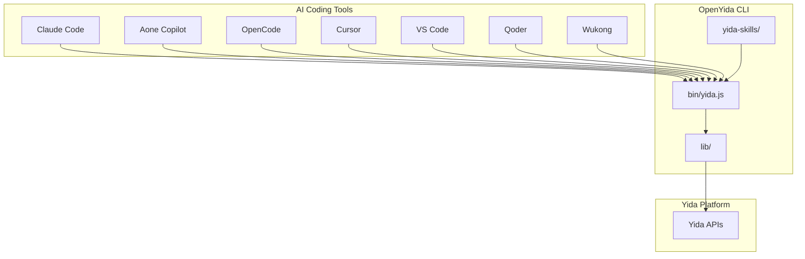
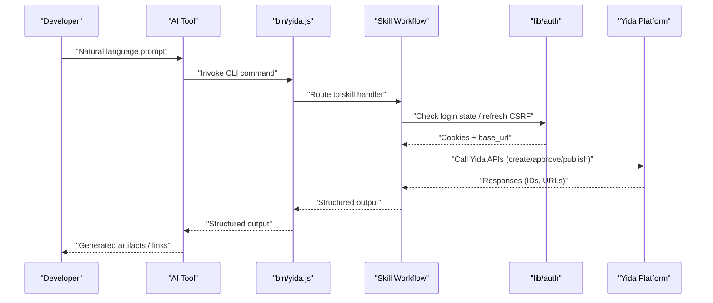
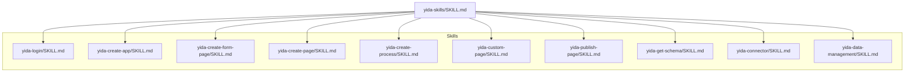
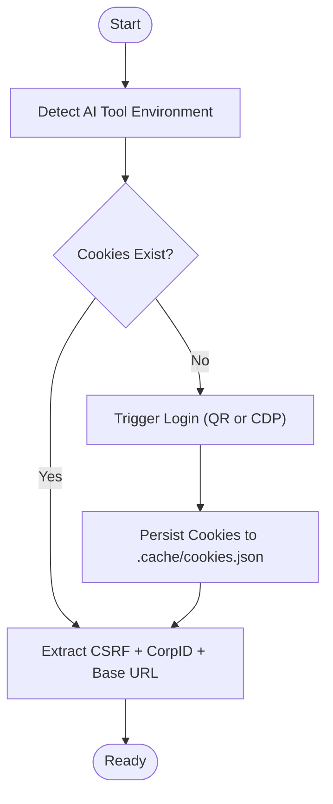
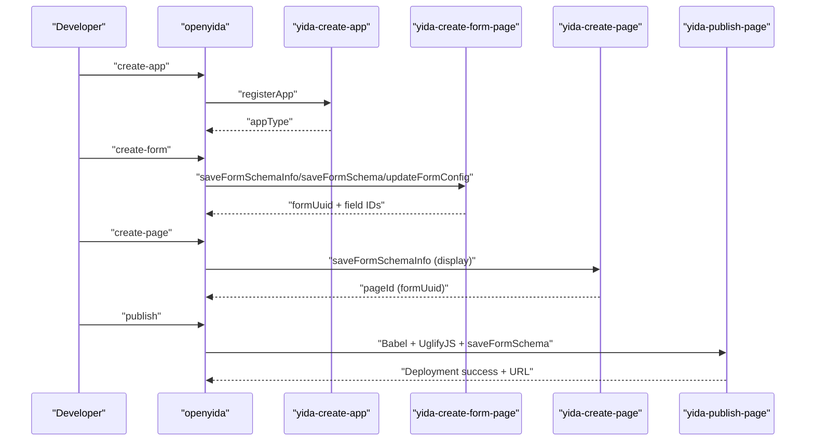
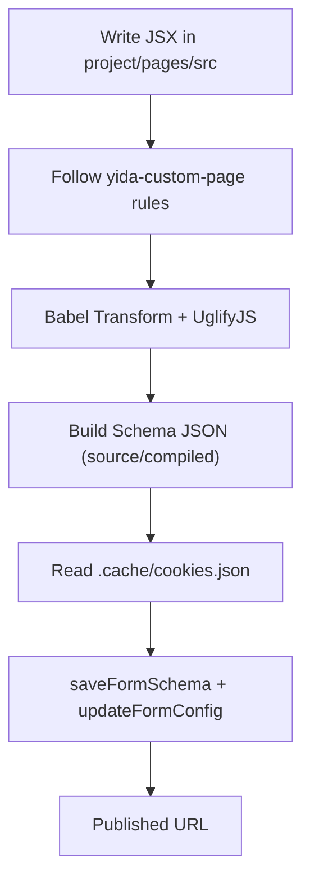
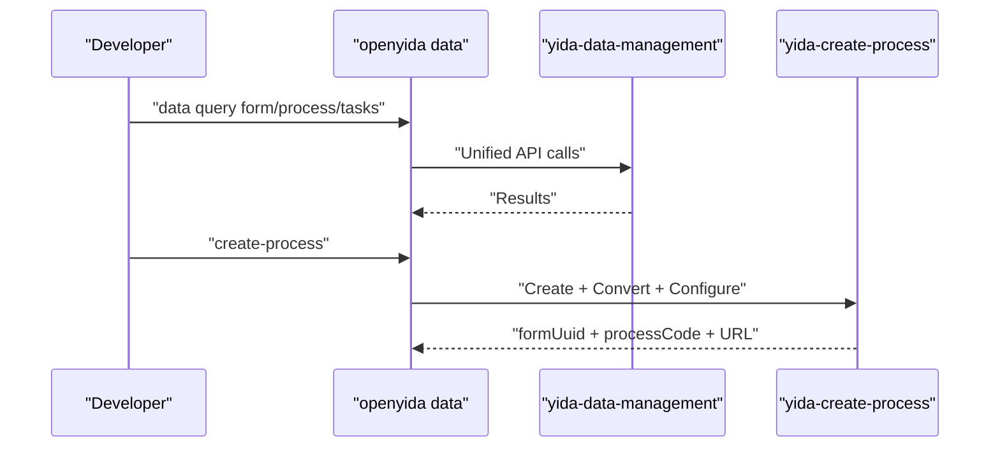
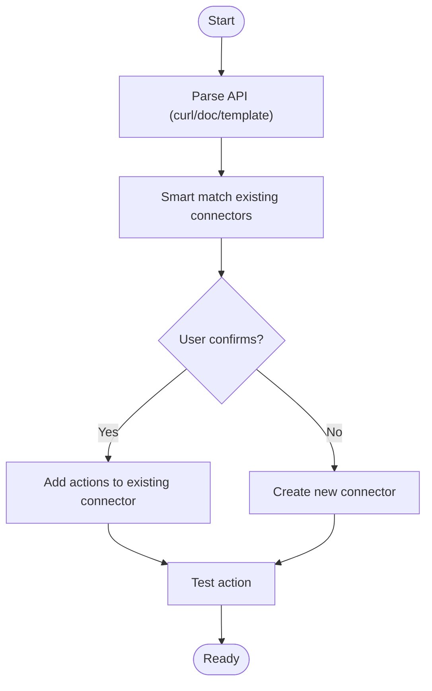
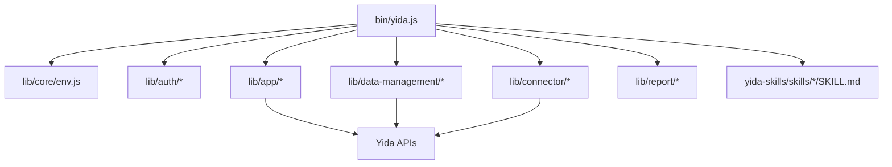

# AI Skill System & Integration

<cite>
**Referenced Files in This Document**
- [README.md](file://README.md)
- [AGENTS.md](file://AGENTS.md)
- [CONTRIBUTING.md](file://CONTRIBUTING.md)
- [yida-skills/SKILL.md](file://yida-skills/SKILL.md)
- [yida-skills/skills/yida-login/SKILL.md](file://yida-skills/skills/yida-login/SKILL.md)
- [yida-skills/skills/yida-create-app/SKILL.md](file://yida-skills/skills/yida-create-app/SKILL.md)
- [yida-skills/skills/yida-create-form-page/SKILL.md](file://yida-skills/skills/yida-create-form-page/SKILL.md)
- [yida-skills/skills/yida-create-page/SKILL.md](file://yida-skills/skills/yida-create-page/SKILL.md)
- [yida-skills/skills/yida-create-process/SKILL.md](file://yida-skills/skills/yida-create-process/SKILL.md)
- [yida-skills/skills/yida-custom-page/SKILL.md](file://yida-skills/skills/yida-custom-page/SKILL.md)
- [yida-skills/skills/yida-publish-page/SKILL.md](file://yida-skills/skills/yida-publish-page/SKILL.md)
- [yida-skills/skills/yida-get-schema/SKILL.md](file://yida-skills/skills/yida-get-schema/SKILL.md)
- [yida-skills/skills/yida-connector/SKILL.md](file://yida-skills/skills/yida-connector/SKILL.md)
- [yida-skills/skills/yida-data-management/SKILL.md](file://yida-skills/skills/yida-data-management/SKILL.md)
</cite>

## Table of Contents
1. [Introduction](#introduction)
2. [Project Structure](#project-structure)
3. [Core Components](#core-components)
4. [Architecture Overview](#architecture-overview)
5. [Detailed Component Analysis](#detailed-component-analysis)
6. [Dependency Analysis](#dependency-analysis)
7. [Performance Considerations](#performance-considerations)
8. [Troubleshooting Guide](#troubleshooting-guide)
9. [Conclusion](#conclusion)
10. [Appendices](#appendices)

## Introduction
OpenYida is an AI-powered extensible integration framework that connects AI coding tools with the Yida low-code platform. It enables developers to build applications, forms, and custom pages through natural language interactions with supported AI tools (Claude Code, Aone Copilot, OpenCode, Cursor, VS Code, Qoder, Wukong). The system centers around a skill architecture that exposes modular capabilities (skills) consumable by AI agents. These skills encapsulate CLI commands and workflows for environment detection, authentication, app/page creation, form management, publishing, data operations, and HTTP connector management.

Supported AI coding tools and their status are documented in the project’s README. The framework emphasizes:
- Zero-config CLI usage
- Seamless integration with Yida platform APIs
- Template-driven skill documentation for AI agents
- Extensibility for new AI platforms and custom skills

**Section sources**
- [README.md:42-52](file://README.md#L42-L52)
- [README.md:26-38](file://README.md#L26-L38)

## Project Structure
The repository organizes the CLI, libraries, and AI skill packs as follows:
- bin/: CLI entrypoint and command routing
- lib/: Core modules for environment detection, authentication, app/page/form management, publishing, connectors, data management, reports, and i18n
- project/: Workspace template for user projects (config.json, pages/)
- yida-skills/: AI skill pack consumed by AI tools; includes top-level SKILL.md and per-skill SKILL.md docs
- scripts/: Post-install, validation, and contributor automation
- tests/: Unit tests for various modules

**Diagram sources**
- [AGENTS.md:11-91](file://AGENTS.md#L11-L91)
- [README.md:42-52](file://README.md#L42-L52)

**Section sources**
- [AGENTS.md:11-91](file://AGENTS.md#L11-L91)
- [README.md:42-52](file://README.md#L42-L52)

## Core Components
- CLI entrypoint and routing: bin/yida.js
- Environment detection: lib/core/env.js
- Authentication and login: lib/auth/*
- Application and page management: lib/app/*
- Publishing pipeline: lib/app/publish.js and Babel transform
- Data management: lib/data-management/*
- Connectors: lib/connector/*
- Reports: lib/report/*
- i18n: lib/core/i18n.js and locales/*
- Skill pack: yida-skills/SKILL.md and yida-skills/skills/*/SKILL.md

Key integration points:
- AI tool environment detection and cookie extraction
- Persistent login state via .cache/cookies.json
- Skill-driven workflows orchestrated by CLI commands

**Section sources**
- [AGENTS.md:17-80](file://AGENTS.md#L17-L80)
- [AGENTS.md:106-110](file://AGENTS.md#L106-L110)
- [AGENTS.md:111-115](file://AGENTS.md#L111-L115)

## Architecture Overview
The AI skill system architecture integrates AI coding tools with the OpenYida CLI and Yida platform:
- AI tools detect environment and route commands to bin/yida.js
- bin/yida.js routes commands to lib modules
- Skills define workflows and CLI commands in yida-skills/skills/*/SKILL.md
- Authentication and environment checks ensure secure, persistent sessions
- Workflows orchestrate creation, configuration, publishing, and data operations

**Diagram sources**
- [yida-skills/SKILL.md:99-121](file://yida-skills/SKILL.md#L99-L121)
- [yida-skills/skills/yida-login/SKILL.md:95-101](file://yida-skills/skills/yida-login/SKILL.md#L95-L101)
- [yida-skills/skills/yida-create-app/SKILL.md:87-94](file://yida-skills/skills/yida-create-app/SKILL.md#L87-L94)

**Section sources**
- [yida-skills/SKILL.md:99-121](file://yida-skills/SKILL.md#L99-L121)
- [yida-skills/skills/yida-login/SKILL.md:95-101](file://yida-skills/skills/yida-login/SKILL.md#L95-L101)

## Detailed Component Analysis

### Skill Architecture and Plugin System
- Top-level skill entry: yida-skills/SKILL.md describes the “yida” skill as the master orchestrator for Yida app development
- Each sub-skill resides under yida-skills/skills/<skill>/ with its own SKILL.md
- AI tools read SKILL.md to discover capabilities and workflows
- Skills define CLI commands, prerequisites, and integration points with Yida APIs

**Diagram sources**
- [yida-skills/SKILL.md:124-145](file://yida-skills/SKILL.md#L124-L145)
- [yida-skills/skills/yida-login/SKILL.md:1-18](file://yida-skills/skills/yida-login/SKILL.md#L1-L18)
- [yida-skills/skills/yida-create-app/SKILL.md:1-16](file://yida-skills/skills/yida-create-app/SKILL.md#L1-L16)
- [yida-skills/skills/yida-create-form-page/SKILL.md:1-17](file://yida-skills/skills/yida-create-form-page/SKILL.md#L1-L17)
- [yida-skills/skills/yida-create-page/SKILL.md:1-16](file://yida-skills/skills/yida-create-page/SKILL.md#L1-L16)
- [yida-skills/skills/yida-create-process/SKILL.md:1-17](file://yida-skills/skills/yida-create-process/SKILL.md#L1-L17)
- [yida-skills/skills/yida-custom-page/SKILL.md:1-17](file://yida-skills/skills/yida-custom-page/SKILL.md#L1-L17)
- [yida-skills/skills/yida-publish-page/SKILL.md:1-17](file://yida-skills/skills/yida-publish-page/SKILL.md#L1-L17)
- [yida-skills/skills/yida-get-schema/SKILL.md:1-17](file://yida-skills/skills/yida-get-schema/SKILL.md#L1-L17)
- [yida-skills/skills/yida-connector/SKILL.md:1-17](file://yida-skills/skills/yida-connector/SKILL.md#L1-L17)
- [yida-skills/skills/yida-data-management/SKILL.md:1-18](file://yida-skills/skills/yida-data-management/SKILL.md#L1-L18)

**Section sources**
- [yida-skills/SKILL.md:124-145](file://yida-skills/SKILL.md#L124-L145)

### Environment Detection and Authentication
- Environment detection supports Claude Code, Aone Copilot, Cursor, OpenCode, Qoder, Wukong
- Login manages cookies, CSRF token refresh, and base_url resolution
- Cookie persistence in .cache/cookies.json enables seamless session reuse

**Diagram sources**
- [AGENTS.md:106-110](file://AGENTS.md#L106-L110)
- [yida-skills/skills/yida-login/SKILL.md:95-101](file://yida-skills/skills/yida-login/SKILL.md#L95-L101)

**Section sources**
- [AGENTS.md:106-110](file://AGENTS.md#L106-L110)
- [yida-skills/skills/yida-login/SKILL.md:95-101](file://yida-skills/skills/yida-login/SKILL.md#L95-L101)

### Application and Page Creation
- Create application: yida-create-app/SKILL.md
- Create form page: yida-create-form-page/SKILL.md (create/update modes)
- Create custom page: yida-create-page/SKILL.md
- Get schema: yida-get-schema/SKILL.md
- Publish custom page: yida-publish-page/SKILL.md

**Diagram sources**
- [yida-skills/skills/yida-create-app/SKILL.md:87-94](file://yida-skills/skills/yida-create-app/SKILL.md#L87-L94)
- [yida-skills/skills/yida-create-form-page/SKILL.md:475-500](file://yida-skills/skills/yida-create-form-page/SKILL.md#L475-L500)
- [yida-skills/skills/yida-create-page/SKILL.md:74-80](file://yida-skills/skills/yida-create-page/SKILL.md#L74-L80)
- [yida-skills/skills/yida-publish-page/SKILL.md:69-76](file://yida-skills/skills/yida-publish-page/SKILL.md#L69-L76)

**Section sources**
- [yida-skills/skills/yida-create-app/SKILL.md:87-94](file://yida-skills/skills/yida-create-app/SKILL.md#L87-L94)
- [yida-skills/skills/yida-create-form-page/SKILL.md:475-500](file://yida-skills/skills/yida-create-form-page/SKILL.md#L475-L500)
- [yida-skills/skills/yida-create-page/SKILL.md:74-80](file://yida-skills/skills/yida-create-page/SKILL.md#L74-L80)
- [yida-skills/skills/yida-publish-page/SKILL.md:69-76](file://yida-skills/skills/yida-publish-page/SKILL.md#L69-L76)

### Custom Page Development and Publishing
- yida-custom-page/SKILL.md defines React-like component constraints, state management, lifecycle hooks, and styling rules
- yida-publish-page/SKILL.md documents Babel/UglifyJS compilation and saveFormSchema deployment

**Diagram sources**
- [yida-skills/skills/yida-custom-page/SKILL.md:361-385](file://yida-skills/skills/yida-custom-page/SKILL.md#L361-L385)
- [yida-skills/skills/yida-publish-page/SKILL.md:69-76](file://yida-skills/skills/yida-publish-page/SKILL.md#L69-L76)

**Section sources**
- [yida-skills/skills/yida-custom-page/SKILL.md:361-385](file://yida-skills/skills/yida-custom-page/SKILL.md#L361-L385)
- [yida-skills/skills/yida-publish-page/SKILL.md:69-76](file://yida-skills/skills/yida-publish-page/SKILL.md#L69-L76)

### Data Management and Workflow Orchestration
- yida-data-management/SKILL.md unifies CRUD operations across forms, processes, and tasks
- yida-create-process/SKILL.md integrates form creation, process conversion, and workflow configuration into a single command

**Diagram sources**
- [yida-skills/skills/yida-data-management/SKILL.md:121-188](file://yida-skills/skills/yida-data-management/SKILL.md#L121-L188)
- [yida-skills/skills/yida-create-process/SKILL.md:89-107](file://yida-skills/skills/yida-create-process/SKILL.md#L89-L107)

**Section sources**
- [yida-skills/skills/yida-data-management/SKILL.md:121-188](file://yida-skills/skills/yida-data-management/SKILL.md#L121-L188)
- [yida-skills/skills/yida-create-process/SKILL.md:89-107](file://yida-skills/skills/yida-create-process/SKILL.md#L89-L107)

### HTTP Connector Management
- yida-connector/SKILL.md covers connector lifecycle, authentication accounts, and smart creation from curl/doc
- Supports multiple auth schemes and action configurations

**Diagram sources**
- [yida-skills/skills/yida-connector/SKILL.md:239-282](file://yida-skills/skills/yida-connector/SKILL.md#L239-L282)
- [yida-skills/skills/yida-connector/SKILL.md:185-207](file://yida-skills/skills/yida-connector/SKILL.md#L185-L207)

**Section sources**
- [yida-skills/skills/yida-connector/SKILL.md:239-282](file://yida-skills/skills/yida-connector/SKILL.md#L239-L282)
- [yida-skills/skills/yida-connector/SKILL.md:185-207](file://yida-skills/skills/yida-connector/SKILL.md#L185-L207)

### Template-Based Code Generation
- Custom page development follows strict patterns defined in yida-custom-page/SKILL.md
- Publishing compiles JSX to ES5 and injects platform-specific overrides
- Field ID semantic aliases and schema caching streamline development

**Section sources**
- [yida-skills/skills/yida-custom-page/SKILL.md:693-747](file://yida-skills/skills/yida-custom-page/SKILL.md#L693-L747)
- [yida-skills/skills/yida-publish-page/SKILL.md:77-105](file://yida-skills/skills/yida-publish-page/SKILL.md#L77-L105)

### Advanced Features: Skill Chaining, Conditional Selection, and Orchestration
- Skill chaining: yida-skills/SKILL.md outlines a complete development flow from environment detection to publishing
- Conditional selection: skills check login state, corpId consistency, and schema availability before proceeding
- Intelligent orchestration: skills coordinate with each other (e.g., login triggers, schema retrieval, and publishing)

**Section sources**
- [yida-skills/SKILL.md:99-121](file://yida-skills/SKILL.md#L99-L121)
- [yida-skills/SKILL.md:154-169](file://yida-skills/SKILL.md#L154-L169)
- [yida-skills/skills/yida-login/SKILL.md:168-178](file://yida-skills/skills/yida-login/SKILL.md#L168-L178)

### Relationship Between AI Skills and Low-Code Application Generation
- Skills translate natural language prompts into structured CLI commands
- They automate schema generation, field definitions, and page publishing
- The result is a deployable Yida application with consistent IDs and URLs

**Section sources**
- [yida-skills/SKILL.md:195-208](file://yida-skills/SKILL.md#L195-L208)
- [yida-skills/skills/yida-create-form-page/SKILL.md:534-544](file://yida-skills/skills/yida-create-form-page/SKILL.md#L534-L544)

### Practical Examples of Skill Configuration
- Environment detection and initialization: yida-skills/SKILL.md
- Login and cookie management: yida-skills/skills/yida-login/SKILL.md
- App creation with optional metadata: yida-skills/skills/yida-create-app/SKILL.md
- Form creation/update with field definitions: yida-skills/skills/yida-create-form-page/SKILL.md
- Custom page creation and publishing: yida-skills/skills/yida-create-page/SKILL.md, yida-skills/skills/yida-publish-page/SKILL.md
- Data operations: yida-skills/skills/yida-data-management/SKILL.md
- Connector management: yida-skills/skills/yida-connector/SKILL.md

**Section sources**
- [yida-skills/SKILL.md:53-85](file://yida-skills/SKILL.md#L53-L85)
- [yida-skills/skills/yida-login/SKILL.md:34-91](file://yida-skills/skills/yida-login/SKILL.md#L34-L91)
- [yida-skills/skills/yida-create-app/SKILL.md:31-81](file://yida-skills/skills/yida-create-app/SKILL.md#L31-L81)
- [yida-skills/skills/yida-create-form-page/SKILL.md:36-112](file://yida-skills/skills/yida-create-form-page/SKILL.md#L36-L112)
- [yida-skills/skills/yida-create-page/SKILL.md:31-67](file://yida-skills/skills/yida-create-page/SKILL.md#L31-L67)
- [yida-skills/skills/yida-publish-page/SKILL.md:32-67](file://yida-skills/skills/yida-publish-page/SKILL.md#L32-L67)
- [yida-skills/skills/yida-data-management/SKILL.md:58-95](file://yida-skills/skills/yida-data-management/SKILL.md#L58-L95)
- [yida-skills/skills/yida-connector/SKILL.md:45-68](file://yida-skills/skills/yida-connector/SKILL.md#L45-L68)

### Skill Development Guidelines, Testing, and Contribution
- Development setup, linking globally, and running tests
- Adding new CLI commands and updating documentation
- Following commit conventions and code style
- Community contributions welcomed via PRs

**Section sources**
- [CONTRIBUTING.md:28-46](file://CONTRIBUTING.md#L28-L46)
- [CONTRIBUTING.md:48-62](file://CONTRIBUTING.md#L48-L62)
- [CONTRIBUTING.md:83-100](file://CONTRIBUTING.md#L83-L100)

## Dependency Analysis
The CLI depends on:
- Environment detection for AI tools
- Authentication modules for login and cookie management
- Skill modules for command execution
- Yida platform APIs for app/page/form operations

**Diagram sources**
- [AGENTS.md:17-80](file://AGENTS.md#L17-L80)
- [AGENTS.md:106-110](file://AGENTS.md#L106-L110)

**Section sources**
- [AGENTS.md:17-80](file://AGENTS.md#L17-L80)
- [AGENTS.md:106-110](file://AGENTS.md#L106-L110)

## Performance Considerations
- Prefer Babel/UglifyJS compression during publishing to reduce payload size
- Use pagination and appropriate pageSize limits when querying data
- Minimize repeated schema fetches by leveraging cached IDs
- Respect platform API rate limits and batch operations when feasible

[No sources needed since this section provides general guidance]

## Troubleshooting Guide
Common issues and resolutions:
- Login failures: Re-run login; ensure cookies are persisted
- CSRF token invalid: Automatic refresh handled by login skill
- CorpId mismatch: Switch organization or create new app in current org
- Schema retrieval: Use get-schema to confirm field IDs
- Connector errors: Validate auth scheme and test action configuration

**Section sources**
- [yida-skills/skills/yida-login/SKILL.md:168-178](file://yida-skills/skills/yida-login/SKILL.md#L168-L178)
- [yida-skills/skills/yida-create-app/SKILL.md:222-229](file://yida-skills/skills/yida-create-app/SKILL.md#L222-L229)
- [yida-skills/skills/yida-get-schema/SKILL.md:69-74](file://yida-skills/skills/yida-get-schema/SKILL.md#L69-L74)
- [yida-skills/skills/yida-connector/SKILL.md:504-512](file://yida-skills/skills/yida-connector/SKILL.md#L504-L512)

## Conclusion
OpenYida’s AI skill system provides a robust, template-driven framework for integrating AI coding tools with the Yida low-code platform. Through modular skills, persistent authentication, and standardized workflows, developers can rapidly prototype, configure, and publish applications while maintaining control over customization and extensibility.

[No sources needed since this section summarizes without analyzing specific files]

## Appendices

### AI Tool Compatibility Matrix
- Supported tools: Claude Code, Aone Copilot, OpenCode, Cursor, VS Code, Qoder, Wukong

**Section sources**
- [README.md:42-52](file://README.md#L42-L52)

### CLI Command Reference
- Environment and auth: env, login, logout, copy, auth status/refresh
- App and form management: create-app, create-page, create-form, get-schema, publish, update-form-config, export/import
- Page config and sharing: verify-short-url, save-share-config, get-page-config
- Data management: data, query-data
- Permissions and process: get-permission, save-permission, configure-process, create-process
- Connector: list, create, detail, delete, add-action, test, smart-create, parse-api, gen-template
- Report: create-report, append-chart
- CDN: cdn-config, cdn-upload, cdn-refresh

**Section sources**
- [README.md:77-135](file://README.md#L77-L135)