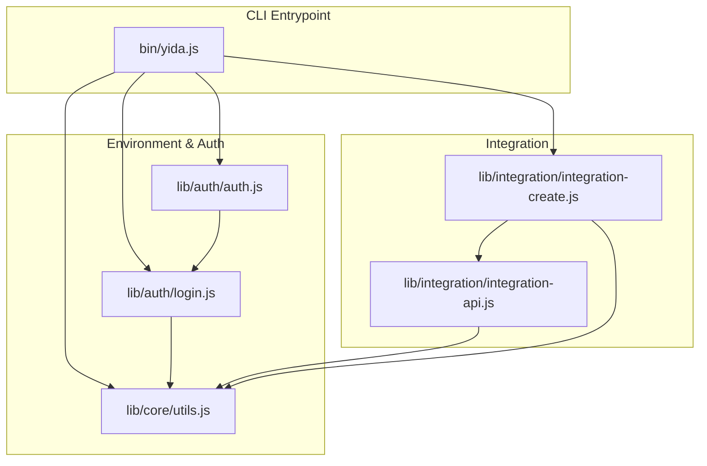
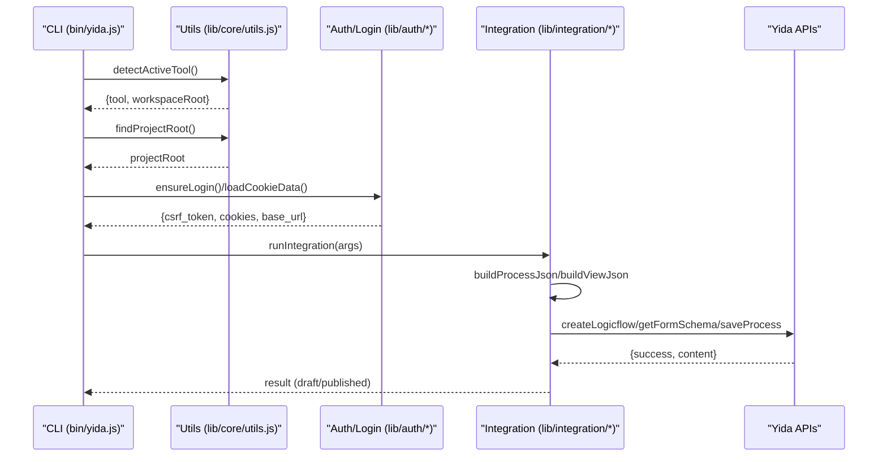
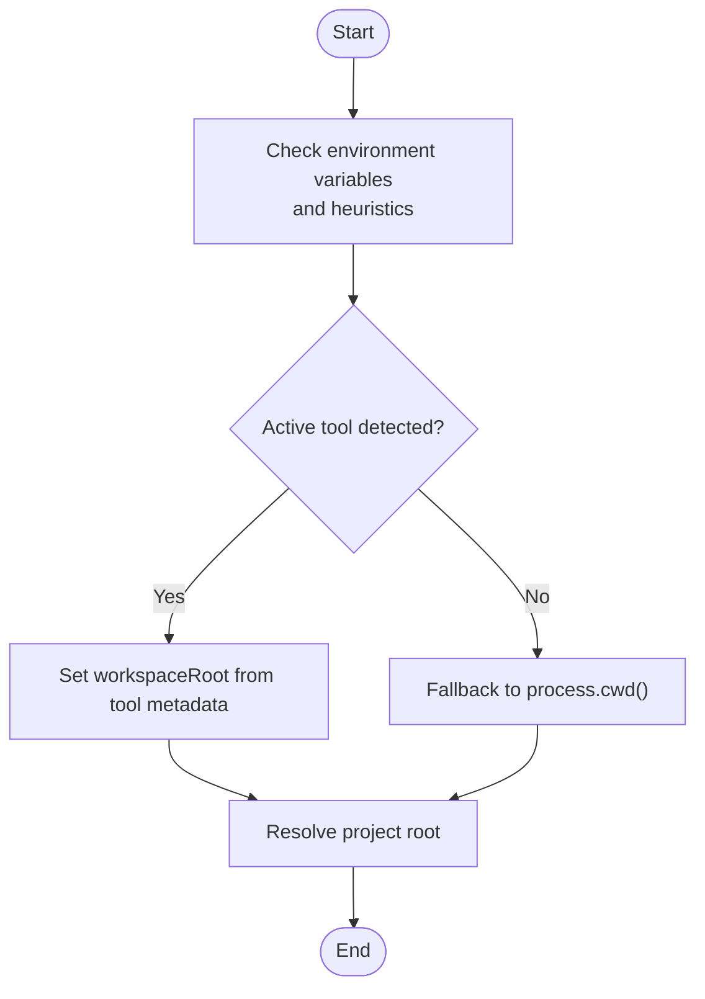
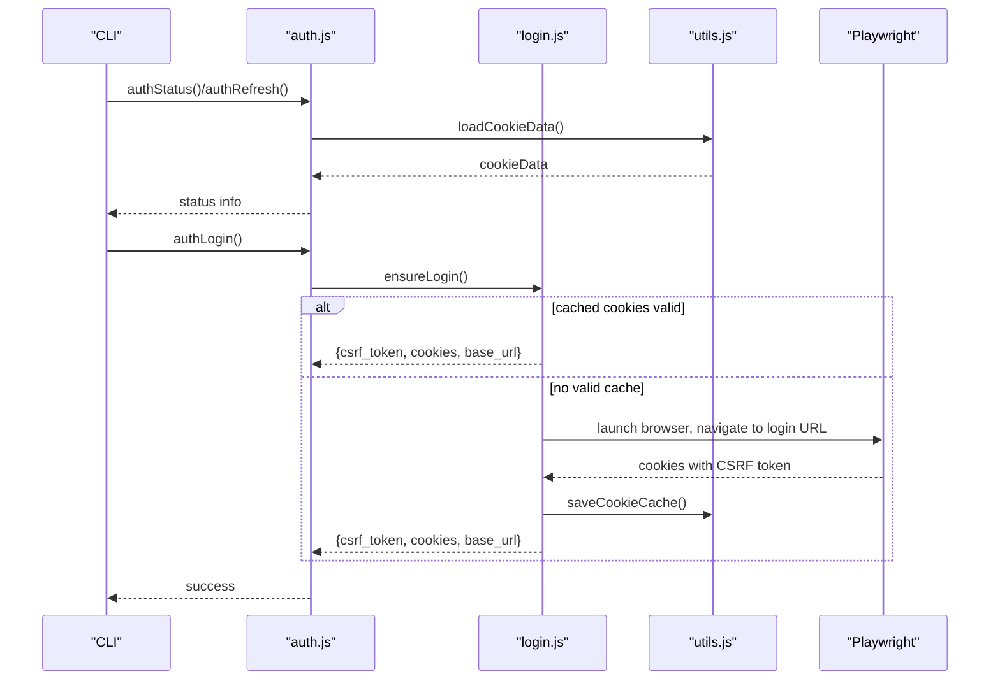
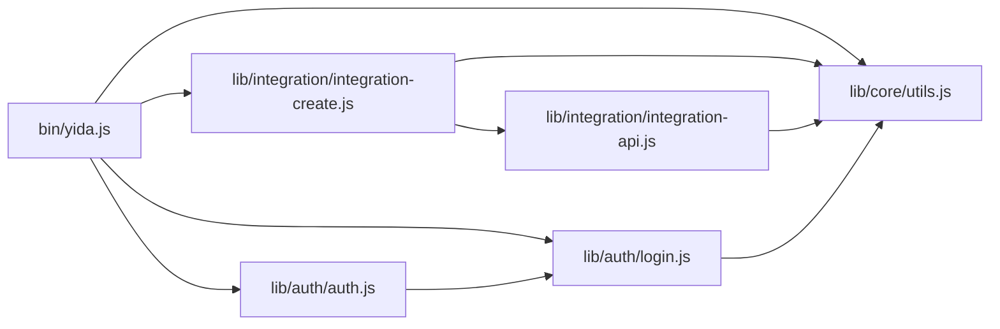

# AI Tool Integration & Compatibility

<cite>
**Referenced Files in This Document**
- [package.json](file://package.json)
- [README.md](file://README.md)
- [bin/yida.js](file://bin/yida.js)
- [lib/core/utils.js](file://lib/core/utils.js)
- [lib/auth/login.js](file://lib/auth/login.js)
- [lib/auth/auth.js](file://lib/auth/auth.js)
- [lib/integration/integration-api.js](file://lib/integration/integration-api.js)
- [lib/integration/integration-create.js](file://lib/integration/integration-create.js)
- [tests/utils.test.js](file://tests/utils.test.js)
</cite>

## Table of Contents
1. [Introduction](#introduction)
2. [Project Structure](#project-structure)
3. [Core Components](#core-components)
4. [Architecture Overview](#architecture-overview)
5. [Detailed Component Analysis](#detailed-component-analysis)
6. [Dependency Analysis](#dependency-analysis)
7. [Performance Considerations](#performance-considerations)
8. [Troubleshooting Guide](#troubleshooting-guide)
9. [Conclusion](#conclusion)
10. [Appendices](#appendices)

## Introduction
This document explains how OpenYida integrates with AI coding platforms and manages compatibility across environments. It covers environment detection for major AI tools, authentication flows, capability detection, session management, and operational guidance for running integrations and automation flows across platforms such as Claude Code, Aone Copilot, OpenCode, Cursor, VS Code, Qoder, and Wukong. It also provides a compatibility matrix, troubleshooting steps, performance tips, and configuration guidance.

## Project Structure
OpenYida organizes AI tool integration around:
- Environment detection and project root resolution
- Authentication and session management
- Integration automation creation and orchestration
- Utility HTTP requests with auto-relogin and CSRF refresh



**Diagram sources**
- [bin/yida.js:152-504](file://bin/yida.js#L152-L504)
- [lib/core/utils.js:121-133](file://lib/core/utils.js#L121-L133)
- [lib/auth/login.js:134-155](file://lib/auth/login.js#L134-L155)
- [lib/auth/auth.js:61-127](file://lib/auth/auth.js#L61-L127)
- [lib/integration/integration-create.js:49-391](file://lib/integration/integration-create.js#L49-L391)
- [lib/integration/integration-api.js:26-239](file://lib/integration/integration-api.js#L26-L239)

**Section sources**
- [bin/yida.js:8-50](file://bin/yida.js#L8-L50)
- [lib/core/utils.js:24-133](file://lib/core/utils.js#L24-L133)
- [lib/auth/login.js:134-155](file://lib/auth/login.js#L134-L155)
- [lib/auth/auth.js:61-127](file://lib/auth/auth.js#L61-L127)
- [lib/integration/integration-create.js:49-391](file://lib/integration/integration-create.js#L49-L391)
- [lib/integration/integration-api.js:26-239](file://lib/integration/integration-api.js#L26-L239)

## Core Components
- Environment detection and project root resolution:
  - Detects active AI tool via environment variables and filesystem heuristics, returning tool metadata and workspace root.
  - Resolves project root per detected tool, falling back to current working directory.
- Authentication and session management:
  - Loads cached cookies, extracts CSRF token and identity, resolves base URL, and supports auto-relogin and CSRF refresh.
  - Provides login, refresh, status, and logout commands.
- Integration automation creation:
  - Parses CLI arguments, orchestrates logic flow creation, saves drafts or publishes online, and builds process/view JSON for automation nodes.
- HTTP utilities:
  - Performs GET/POST requests with cookie filtering and CSRF header injection, detects expired login/CSRF, and retries with refreshed credentials.

**Section sources**
- [lib/core/utils.js:24-133](file://lib/core/utils.js#L24-L133)
- [lib/core/utils.js:170-223](file://lib/core/utils.js#L170-L223)
- [lib/core/utils.js:268-447](file://lib/core/utils.js#L268-L447)
- [lib/auth/login.js:134-155](file://lib/auth/login.js#L134-L155)
- [lib/auth/auth.js:61-127](file://lib/auth/auth.js#L61-L127)
- [lib/integration/integration-create.js:49-391](file://lib/integration/integration-create.js#L49-L391)
- [lib/integration/integration-api.js:26-239](file://lib/integration/integration-api.js#L26-L239)

## Architecture Overview
The integration architecture centers on environment-aware project roots, robust authentication, and automated logic flow creation.



**Diagram sources**
- [bin/yida.js:152-504](file://bin/yida.js#L152-L504)
- [lib/core/utils.js:32-133](file://lib/core/utils.js#L32-L133)
- [lib/auth/login.js:134-155](file://lib/auth/login.js#L134-L155)
- [lib/integration/integration-create.js:49-391](file://lib/integration/integration-create.js#L49-L391)
- [lib/integration/integration-api.js:26-239](file://lib/integration/integration-api.js#L26-L239)

## Detailed Component Analysis

### Environment Detection and Tool Switching
- Detection logic:
  - Checks environment variables for Qoder, Claude Code, OpenCode, Cursor, and Wukong.
  - Uses filesystem heuristics for Aone Copilot detection under VS Code.
  - Returns tool metadata including display name, directory name, and workspace root.
- Project root resolution:
  - Uses detected tool’s workspace root if present; otherwise falls back to current working directory.
- Tool switching:
  - Switching is implicit via environment variables and workspace layout; the CLI reads the active tool and resolves the project root accordingly.



**Diagram sources**
- [lib/core/utils.js:32-109](file://lib/core/utils.js#L32-L109)
- [lib/core/utils.js:121-133](file://lib/core/utils.js#L121-L133)

**Section sources**
- [lib/core/utils.js:32-109](file://lib/core/utils.js#L32-L109)
- [lib/core/utils.js:121-133](file://lib/core/utils.js#L121-L133)
- [tests/utils.test.js:207-302](file://tests/utils.test.js#L207-L302)

### Authentication and Session Management
- Login:
  - Attempts to reuse cached cookies; if valid CSRF exists, returns immediately.
  - Otherwise opens a browser (via Playwright) to perform QR login, waits for CSRF token presence, extracts base URL, and persists cookies.
- Refresh:
  - Extracts CSRF from cached cookies without requiring a new login.
- Status:
  - Reports login state, base URL, org/user IDs, and CSRF token preview.
- Logout:
  - Clears persisted cookie cache file.



**Diagram sources**
- [lib/auth/auth.js:61-127](file://lib/auth/auth.js#L61-L127)
- [lib/auth/login.js:134-155](file://lib/auth/login.js#L134-L155)
- [lib/auth/login.js:207-313](file://lib/auth/login.js#L207-L313)
- [lib/core/utils.js:170-223](file://lib/core/utils.js#L170-L223)

**Section sources**
- [lib/auth/auth.js:61-127](file://lib/auth/auth.js#L61-L127)
- [lib/auth/login.js:134-155](file://lib/auth/login.js#L134-L155)
- [lib/auth/login.js:207-313](file://lib/auth/login.js#L207-L313)
- [lib/core/utils.js:170-223](file://lib/core/utils.js#L170-L223)

### Integration Automation Creation
- CLI command:
  - Parses flags for events, receivers, notifications, and optional data retrieval/addition nodes.
  - Generates deterministic node IDs and builds process/view JSON for automation nodes.
- Workflow:
  - Ensures login, optionally creates logic flow binding, fetches target form schema if needed, saves draft, and optionally publishes.

```mermaid
sequenceDiagram
participant CLI as "CLI"
participant Create as "integration-create.js"
participant API as "integration-api.js"
participant Utils as "utils.js"
CLI->>Create : run(args)
Create->>Utils : loadCookieData()/ensureLogin()
Utils-->>Create : authRef
alt no processCode
Create->>API : createLogicflow()
API-->>Create : processCode
end
Create->>API : getFormSchema() (optional)
Create->>API : saveProcess(draft)
alt publish flag
Create->>API : saveProcess(online)
end
Create-->>CLI : result JSON
```

**Diagram sources**
- [lib/integration/integration-create.js:49-391](file://lib/integration/integration-create.js#L49-L391)
- [lib/integration/integration-api.js:26-239](file://lib/integration/integration-api.js#L26-L239)
- [lib/core/utils.js:209-223](file://lib/core/utils.js#L209-L223)

**Section sources**
- [lib/integration/integration-create.js:49-391](file://lib/integration/integration-create.js#L49-L391)
- [lib/integration/integration-api.js:26-239](file://lib/integration/integration-api.js#L26-L239)

### Capability Detection and Compatibility Matrix
- Supported AI coding platforms:
  - Claude Code, Aone Copilot, OpenCode, Cursor, VS Code, Qoder, Wukong.
- Detection mechanism:
  - Environment variables and filesystem heuristics determine the active tool and project root.
- Compatibility:
  - Full support is indicated for all listed tools; environment detection ensures the correct workspace is used regardless of the host IDE or agent.

**Section sources**
- [README.md:42-52](file://README.md#L42-L52)
- [lib/core/utils.js:32-109](file://lib/core/utils.js#L32-L109)
- [tests/utils.test.js:207-302](file://tests/utils.test.js#L207-L302)

## Dependency Analysis
- CLI entrypoint routes commands to submodules:
  - Environment, authentication, organization switching, integration automation, and more.
- Integration depends on:
  - Authentication utilities for CSRF and cookies.
  - HTTP utilities for API calls and automatic re-authentication.
- Authentication depends on:
  - Cookie cache persistence and Playwright for interactive login.



**Diagram sources**
- [bin/yida.js:152-504](file://bin/yida.js#L152-L504)
- [lib/core/utils.js:121-133](file://lib/core/utils.js#L121-L133)
- [lib/auth/auth.js:61-127](file://lib/auth/auth.js#L61-L127)
- [lib/auth/login.js:134-155](file://lib/auth/login.js#L134-L155)
- [lib/integration/integration-create.js:49-391](file://lib/integration/integration-create.js#L49-L391)
- [lib/integration/integration-api.js:26-239](file://lib/integration/integration-api.js#L26-L239)

**Section sources**
- [bin/yida.js:152-504](file://bin/yida.js#L152-L504)
- [lib/core/utils.js:121-133](file://lib/core/utils.js#L121-L133)
- [lib/auth/auth.js:61-127](file://lib/auth/auth.js#L61-L127)
- [lib/auth/login.js:134-155](file://lib/auth/login.js#L134-L155)
- [lib/integration/integration-create.js:49-391](file://lib/integration/integration-create.js#L49-L391)
- [lib/integration/integration-api.js:26-239](file://lib/integration/integration-api.js#L26-L239)

## Performance Considerations
- Prefer cached cookies to avoid repeated browser logins.
- Use publish flag judiciously; saving drafts first reduces unnecessary network overhead.
- Limit condition and assignment arguments to only what is required for the automation.
- Keep project root aligned with the active tool to minimize cross-environment file operations.

## Troubleshooting Guide
- No active tool detected:
  - Ensure environment variables for the target tool are set or the filesystem markers are present.
  - Verify project directory exists at the resolved workspace root.
- Login failures or timeouts:
  - Confirm Playwright is available; the interactive login path requires it.
  - Re-run login; ensure the browser completes the QR flow and CSRF token appears.
- CSRF or login expired:
  - The system automatically refreshes CSRF tokens and re-triggers login when needed.
  - Clear cookie cache and re-authenticate if persistent errors occur.
- Integration creation fails:
  - Check required parameters (appType, formUuid, flowName).
  - Validate event types and notification settings.
  - Confirm base URL and CSRF token are present in the cached cookies.

**Section sources**
- [lib/core/utils.js:232-251](file://lib/core/utils.js#L232-L251)
- [lib/core/utils.js:423-447](file://lib/core/utils.js#L423-L447)
- [lib/auth/login.js:207-313](file://lib/auth/login.js#L207-L313)
- [lib/integration/integration-create.js:89-120](file://lib/integration/integration-create.js#L89-L120)

## Conclusion
OpenYida provides robust environment detection, seamless authentication, and reliable integration automation across major AI coding platforms. By leveraging environment variables and filesystem heuristics, it aligns project roots with the active tool and maintains secure, persistent sessions. The integration creation workflow streamlines logic flow development and publishing, while built-in retry and refresh logic improves resilience against transient authentication issues.

## Appendices

### Setup and Configuration Examples
- Install globally and run:
  - Use the CLI to initialize environment and authentication.
- Environment detection:
  - Set the appropriate environment variable for the target AI tool (e.g., Qoder, Claude Code, OpenCode, Cursor, Wukong).
  - Ensure the project directory exists at the resolved workspace root.
- Authentication:
  - Run login to establish a session; subsequent commands reuse cached cookies.
  - Use refresh to update CSRF tokens without re-entering credentials.
- Integration automation:
  - Use the integration create command with required parameters and optional flags for events, receivers, and data nodes.
  - Publish immediately or save as draft for later review.

**Section sources**
- [README.md:42-52](file://README.md#L42-L52)
- [package.json:50-72](file://package.json#L50-L72)
- [bin/yida.js:152-504](file://bin/yida.js#L152-L504)
- [lib/core/utils.js:32-109](file://lib/core/utils.js#L32-L109)
- [lib/auth/login.js:134-155](file://lib/auth/login.js#L134-L155)
- [lib/integration/integration-create.js:49-391](file://lib/integration/integration-create.js#L49-L391)