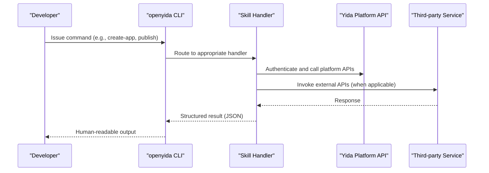
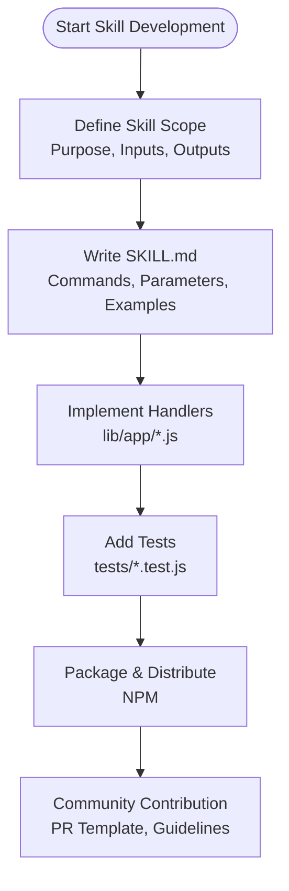
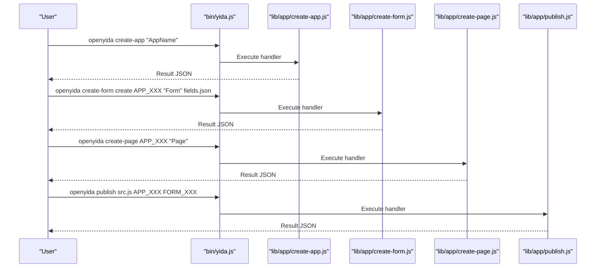
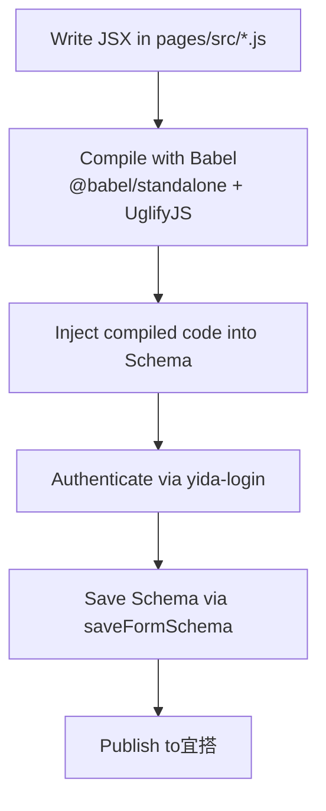
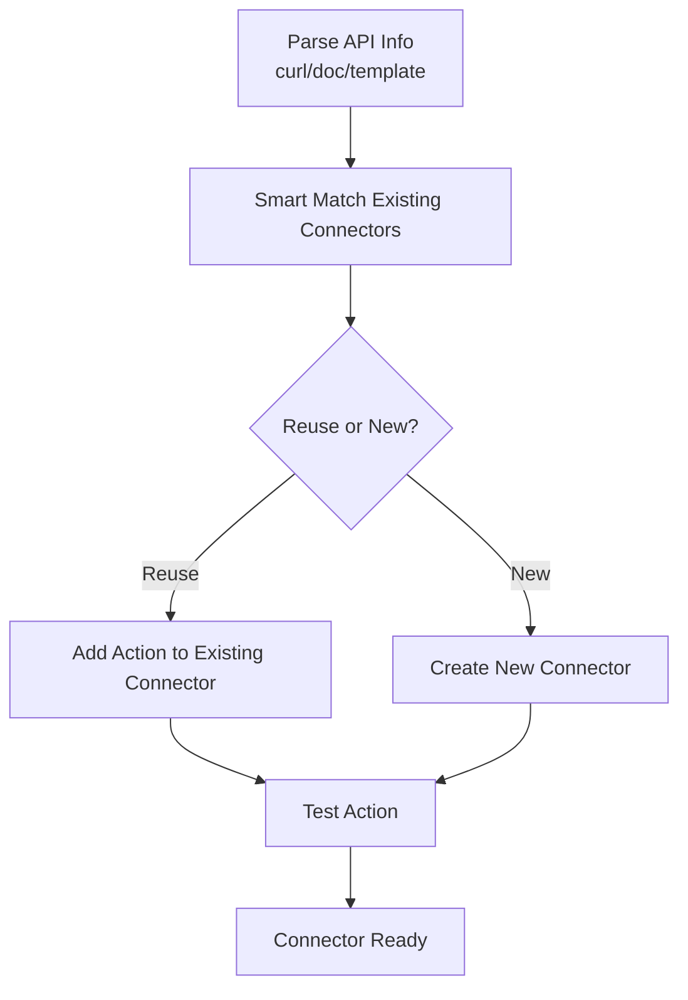
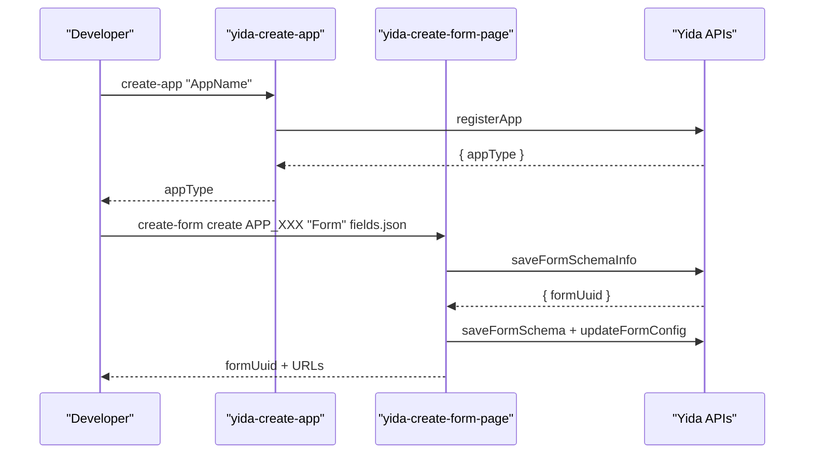
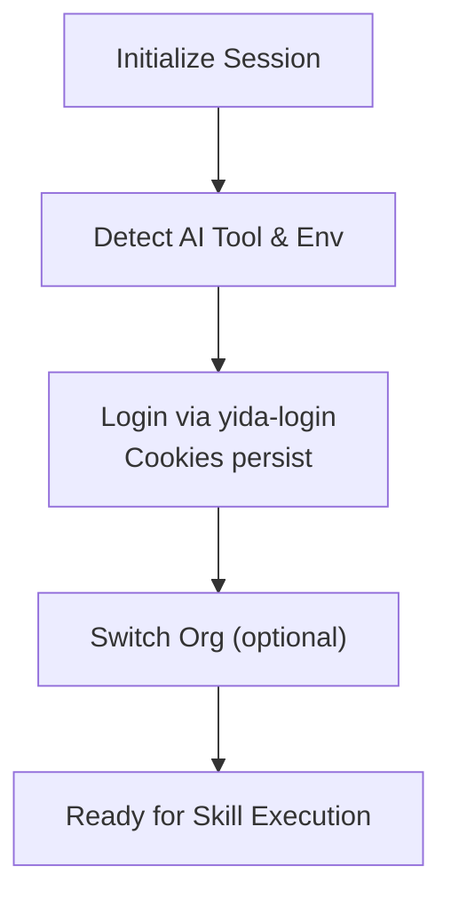
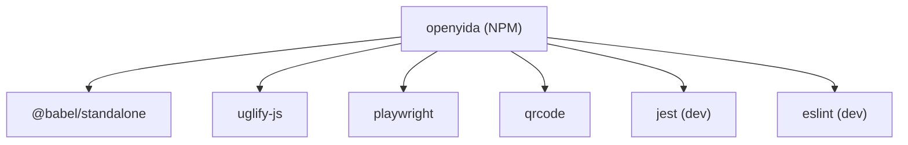

# Extensibility & Custom Skill Development

<cite>
**Referenced Files in This Document**
- [README.md](file://README.md)
- [package.json](file://package.json)
- [bin/yida.js](file://bin/yida.js)
- [lib/app/create-app.js](file://lib/app/create-app.js)
- [lib/app/create-form.js](file://lib/app/create-form.js)
- [lib/app/create-page.js](file://lib/app/create-page.js)
- [lib/app/publish.js](file://lib/app/publish.js)
- [lib/app/get-schema.js](file://lib/app/get-schema.js)
- [lib/app/update-form-config.js](file://lib/app/update-form-config.js)
- [lib/auth/auth.js](file://lib/auth/auth.js)
- [lib/auth/login.js](file://lib/auth/login.js)
- [lib/auth/org.js](file://lib/auth/org.js)
- [lib/cdn/cdn-config.js](file://lib/cdn/cdn-config.js)
- [lib/cdn/cdn-config-cmd.js](file://lib/cdn/cdn-config-cmd.js)
- [lib/cdn/cdn-refresh.js](file://lib/cdn/cdn-refresh.js)
- [lib/app/datasource-utils.js](file://lib/app/datasource-utils.js)
- [yida-skills/SKILL.md](file://yida-skills/SKILL.md)
- [yida-skills/skills/yida-custom-page/SKILL.md](file://yida-skills/skills/yida-custom-page/SKILL.md)
- [yida-skills/skills/yida-connector/SKILL.md](file://yida-skills/skills/yida-connector/SKILL.md)
- [yida-skills/skills/yida-create-app/SKILL.md](file://yida-skills/skills/yida-create-app/SKILL.md)
- [yida-skills/skills/yida-create-form-page/SKILL.md](file://yida-skills/skills/yida-create-form-page/SKILL.md)
- [yida-skills/skills/yida-connector/examples/operations-search-formdata.json](file://yida-skills/skills/yida-connector/examples/operations-search-formdata.json)
</cite>

## Table of Contents
1. [Introduction](#introduction)
2. [Project Structure](#project-structure)
3. [Core Components](#core-components)
4. [Architecture Overview](#architecture-overview)
5. [Detailed Component Analysis](#detailed-component-analysis)
6. [Dependency Analysis](#dependency-analysis)
7. [Performance Considerations](#performance-considerations)
8. [Troubleshooting Guide](#troubleshooting-guide)
9. [Conclusion](#conclusion)
10. [Appendices](#appendices)

## Introduction
This document explains how to extend OpenYida’s AI skill system and develop custom skills within the OpenYida ecosystem. It covers the extensibility model, plugin architecture, development guidelines, lifecycle from concept to deployment, testing and validation, API specifications, integration patterns, and advanced topics such as skill chaining, conditional logic, performance optimization, and error handling. It also provides step-by-step tutorials for creating new skill packages, implementing AI tool adapters, and integrating third-party services, along with templates, boilerplate guidance, and best practices.

## Project Structure
OpenYida is distributed as an NPM package with a CLI entry point and a library of application modules. Skills are organized under the yida-skills directory, each skill encapsulated with a SKILL.md that documents its purpose, commands, parameters, and integration patterns. The CLI binary delegates to module-specific handlers under lib/app.

```mermaid
graph TB
CLI["CLI Binary<br/>bin/yida.js"] --> CreateApp["Create App<br/>lib/app/create-app.js"]
CLI --> CreateForm["Create/Update Form<br/>lib/app/create-form.js"]
CLI --> CreatePage["Create Page<br/>lib/app/create-page.js"]
CLI --> Publish["Publish Page<br/>lib/app/publish.js"]
CLI --> GetSchema["Get Schema<br/>lib/app/get-schema.js"]
CLI --> UpdateFormConfig["Update Form Config<br/>lib/app/update-form-config.js"]
CLI --> Auth["Auth & Org<br/>lib/auth/*.js"]
CLI --> CDN["CDN Config<br/>lib/cdn/*.js"]
CLI --> DatasourceUtils["Datasource Utils<br/>lib/app/datasource-utils.js"]
Skills["Skills Docs<br/>yida-skills/*.md"] --> CustomPage["Custom Page Skill<br/>yida-skills/skills/yida-custom-page/SKILL.md"]
Skills --> Connector["Connector Skill<br/>yida-skills/skills/yida-connector/SKILL.md"]
Skills --> CreateAppSkill["Create App Skill<br/>yida-skills/skills/yida-create-app/SKILL.md"]
Skills --> CreateFormSkill["Create Form Skill<br/>yida-skills/skills/yida-create-form-page/SKILL.md"]
```

**Diagram sources**
- [bin/yida.js](file://bin/yida.js)
- [lib/app/create-app.js](file://lib/app/create-app.js)
- [lib/app/create-form.js](file://lib/app/create-form.js)
- [lib/app/create-page.js](file://lib/app/create-page.js)
- [lib/app/publish.js](file://lib/app/publish.js)
- [lib/app/get-schema.js](file://lib/app/get-schema.js)
- [lib/app/update-form-config.js](file://lib/app/update-form-config.js)
- [lib/auth/auth.js](file://lib/auth/auth.js)
- [lib/auth/login.js](file://lib/auth/login.js)
- [lib/auth/org.js](file://lib/auth/org.js)
- [lib/cdn/cdn-config.js](file://lib/cdn/cdn-config.js)
- [lib/cdn/cdn-config-cmd.js](file://lib/cdn/cdn-config-cmd.js)
- [lib/cdn/cdn-refresh.js](file://lib/cdn/cdn-refresh.js)
- [lib/app/datasource-utils.js](file://lib/app/datasource-utils.js)
- [yida-skills/SKILL.md](file://yida-skills/SKILL.md)
- [yida-skills/skills/yida-custom-page/SKILL.md](file://yida-skills/skills/yida-custom-page/SKILL.md)
- [yida-skills/skills/yida-connector/SKILL.md](file://yida-skills/skills/yida-connector/SKILL.md)
- [yida-skills/skills/yida-create-app/SKILL.md](file://yida-skills/skills/yida-create-app/SKILL.md)
- [yida-skills/skills/yida-create-form-page/SKILL.md](file://yida-skills/skills/yida-create-form-page/SKILL.md)

**Section sources**
- [README.md](file://README.md)
- [package.json](file://package.json)

## Core Components
- CLI entry point: The CLI binary delegates commands to module handlers. The package.json defines the binary mapping and runtime requirements.
- Application modules: Handlers for app creation, form creation/update, page creation, publishing, schema retrieval, and form configuration updates.
- Authentication and organization switching: Login, QR login, and organization selection flows.
- CDN configuration and refresh: Utilities for CDN image upload and cache refresh.
- Datasource utilities: Helpers for connector and datasource integration.
- Skills documentation: Each skill is documented with SKILL.md detailing commands, parameters, examples, and integration patterns.

**Section sources**
- [package.json](file://package.json)
- [bin/yida.js](file://bin/yida.js)
- [lib/app/create-app.js](file://lib/app/create-app.js)
- [lib/app/create-form.js](file://lib/app/create-form.js)
- [lib/app/create-page.js](file://lib/app/create-page.js)
- [lib/app/publish.js](file://lib/app/publish.js)
- [lib/app/get-schema.js](file://lib/app/get-schema.js)
- [lib/app/update-form-config.js](file://lib/app/update-form-config.js)
- [lib/auth/auth.js](file://lib/auth/auth.js)
- [lib/auth/login.js](file://lib/auth/login.js)
- [lib/auth/org.js](file://lib/auth/org.js)
- [lib/cdn/cdn-config.js](file://lib/cdn/cdn-config.js)
- [lib/cdn/cdn-config-cmd.js](file://lib/cdn/cdn-config-cmd.js)
- [lib/cdn/cdn-refresh.js](file://lib/cdn/cdn-refresh.js)
- [lib/app/datasource-utils.js](file://lib/app/datasource-utils.js)
- [yida-skills/SKILL.md](file://yida-skills/SKILL.md)

## Architecture Overview
OpenYida’s extensibility model centers on:
- Skill packages: Each skill is a self-contained unit with a SKILL.md that documents its contract, CLI commands, and integration patterns.
- Plugin architecture: The CLI routes commands to module handlers; each handler encapsulates a specific capability (e.g., connector management, form creation).
- Integration patterns: Skills integrate with宜搭 APIs, authentication, and optional third-party services via connectors and datasources.
- Toolchain: Compilation and publishing pipeline for custom pages, including JSX-to-ES5 transformation and schema injection.

**Diagram sources**
- [bin/yida.js](file://bin/yida.js)
- [lib/app/create-app.js](file://lib/app/create-app.js)
- [lib/app/publish.js](file://lib/app/publish.js)
- [yida-skills/skills/yida-create-app/SKILL.md](file://yida-skills/skills/yida-create-app/SKILL.md)
- [yida-skills/skills/yida-custom-page/SKILL.md](file://yida-skills/skills/yida-custom-page/SKILL.md)

## Detailed Component Analysis

### Skill Package Model
- Each skill is documented in a dedicated SKILL.md with metadata (name, description, compatibility, license, tags), usage instructions, CLI commands, and integration examples.
- Skills define:
  - Purpose and supported AI tools
  - Required parameters and examples
  - Error handling and troubleshooting
  - Integration with宜搭 APIs and optional third-party services

**Section sources**
- [yida-skills/SKILL.md](file://yida-skills/SKILL.md)
- [yida-skills/skills/yida-create-app/SKILL.md](file://yida-skills/skills/yida-create-app/SKILL.md)
- [yida-skills/skills/yida-create-form-page/SKILL.md](file://yida-skills/skills/yida-create-form-page/SKILL.md)
- [yida-skills/skills/yida-custom-page/SKILL.md](file://yida-skills/skills/yida-custom-page/SKILL.md)
- [yida-skills/skills/yida-connector/SKILL.md](file://yida-skills/skills/yida-connector/SKILL.md)

### CLI Command Routing
- The CLI binary maps commands to handlers. The package.json declares the binary entry and required engines.
- Typical commands include environment detection, login/logout, app creation, form creation/update, page creation/publishing, schema retrieval, and connector management.

**Diagram sources**
- [bin/yida.js](file://bin/yida.js)
- [lib/app/create-app.js](file://lib/app/create-app.js)
- [lib/app/create-form.js](file://lib/app/create-form.js)
- [lib/app/create-page.js](file://lib/app/create-page.js)
- [lib/app/publish.js](file://lib/app/publish.js)

**Section sources**
- [package.json](file://package.json)
- [bin/yida.js](file://bin/yida.js)
- [lib/app/create-app.js](file://lib/app/create-app.js)
- [lib/app/create-form.js](file://lib/app/create-form.js)
- [lib/app/create-page.js](file://lib/app/create-page.js)
- [lib/app/publish.js](file://lib/app/publish.js)

### Custom Page Development (yida-custom-page)
- Develop custom pages with React 16-compatible JSX inside宜搭. The skill defines design systems, state management, lifecycle hooks, and API usage patterns.
- Constraints:
  - Single-file component model
  - No import/export statements; use loadScript for third-party libraries
  - State managed via custom functions; avoid setState for business state
  - Style via inline style objects
  - Event handlers must use arrow functions to preserve this context
- Publishing pipeline compiles JSX to ES5, compresses, injects into schema, and saves via platform APIs.

**Diagram sources**
- [yida-skills/skills/yida-custom-page/SKILL.md](file://yida-skills/skills/yida-custom-page/SKILL.md)
- [lib/app/publish.js](file://lib/app/publish.js)

**Section sources**
- [yida-skills/skills/yida-custom-page/SKILL.md](file://yida-skills/skills/yida-custom-page/SKILL.md)

### Connector Management (yida-connector)
- Manage宜搭 HTTP connectors, including authentication accounts, actions, and testing.
- Supports multiple auth schemes (BasicAuth, ApiKey, DingTalk OpenAPI, Aliyun API Gateway, DingTrustGW).
- Provides smart-create workflow to parse curl/doc and match existing connectors.

**Diagram sources**
- [yida-skills/skills/yida-connector/SKILL.md](file://yida-skills/skills/yida-connector/SKILL.md)
- [yida-skills/skills/yida-connector/examples/operations-search-formdata.json](file://yida-skills/skills/yida-connector/examples/operations-search-formdata.json)

**Section sources**
- [yida-skills/skills/yida-connector/SKILL.md](file://yida-skills/skills/yida-connector/SKILL.md)
- [yida-skills/skills/yida-connector/examples/operations-search-formdata.json](file://yida-skills/skills/yida-connector/examples/operations-search-formdata.json)

### Application and Form Creation (yida-create-app, yida-create-form-page)
- Application creation returns appType for subsequent operations.
- Form creation supports create and update modes with rich field definitions and change sets.

**Diagram sources**
- [yida-skills/skills/yida-create-app/SKILL.md](file://yida-skills/skills/yida-create-app/SKILL.md)
- [yida-skills/skills/yida-create-form-page/SKILL.md](file://yida-skills/skills/yida-create-form-page/SKILL.md)

**Section sources**
- [yida-skills/skills/yida-create-app/SKILL.md](file://yida-skills/skills/yida-create-app/SKILL.md)
- [yida-skills/skills/yida-create-form-page/SKILL.md](file://yida-skills/skills/yida-create-form-page/SKILL.md)

### Authentication and Organization
- Authentication integrates with宜搭 cookies and QR login.
- Organization switching allows targeting different corpId contexts.

**Diagram sources**
- [lib/auth/auth.js](file://lib/auth/auth.js)
- [lib/auth/login.js](file://lib/auth/login.js)
- [lib/auth/org.js](file://lib/auth/org.js)

**Section sources**
- [lib/auth/auth.js](file://lib/auth/auth.js)
- [lib/auth/login.js](file://lib/auth/login.js)
- [lib/auth/org.js](file://lib/auth/org.js)

### CDN Integration
- Configure and refresh CDN for image uploads.
- Useful for custom page assets and media resources.

**Section sources**
- [lib/cdn/cdn-config.js](file://lib/cdn/cdn-config.js)
- [lib/cdn/cdn-config-cmd.js](file://lib/cdn/cdn-config-cmd.js)
- [lib/cdn/cdn-refresh.js](file://lib/cdn/cdn-refresh.js)

## Dependency Analysis
- Runtime dependencies include Babel standalone for JSX transformation, UglifyJS for minification, Playwright for headless browser automation, and QR code generation.
- The CLI requires Node.js >= 18.
- Skills depend on宜搭 platform APIs and optional third-party services accessed via connectors.

**Diagram sources**
- [package.json](file://package.json)

**Section sources**
- [package.json](file://package.json)

## Performance Considerations
- Prefer non-blocking UI updates; avoid frequent state updates in event handlers.
- Use loadScript for third-party libraries and cache CDN assets.
- Minimize DOM reflows by batching state updates and using forceUpdate judiciously.
- Keep payload sizes small for connector actions and limit pageSize to宜搭 limits.

## Troubleshooting Guide
Common issues and resolutions:
- Login failures: Re-run login to refresh session.
- CSRF errors: Automatic token refresh occurs in handlers; retry after login.
- CorpId mismatch: Switch organization or log in again to the correct account.
- JSX compilation errors: Follow the custom page skill’s “JSX compile error checklist” and use the provided quick validation script.

**Section sources**
- [yida-skills/skills/yida-custom-page/SKILL.md](file://yida-skills/skills/yida-custom-page/SKILL.md)
- [yida-skills/skills/yida-create-form-page/SKILL.md](file://yida-skills/skills/yida-create-form-page/SKILL.md)
- [yida-skills/skills/yida-connector/SKILL.md](file://yida-skills/skills/yida-connector/SKILL.md)

## Conclusion
OpenYida’s extensibility model enables developers to build and distribute custom skills that integrate seamlessly with宜搭 and optional third-party services. By adhering to documented contracts, leveraging the CLI toolchain, and following best practices for performance and error handling, teams can rapidly prototype, validate, and deploy AI-powered low-code applications.

## Appendices

### A. Skill Development Lifecycle
- Concept: Define scope, inputs, outputs, and integration points.
- Documentation: Write SKILL.md with commands, parameters, and examples.
- Implementation: Implement handlers under lib/app and add tests.
- Validation: Use built-in tests and manual verification.
- Packaging: Publish via NPM; include demos and examples.
- Distribution: Encourage community contributions via PR template and guidelines.

**Section sources**
- [yida-skills/SKILL.md](file://yida-skills/SKILL.md)
- [README.md](file://README.md)

### B. API Specifications and Integration Patterns
-宜搭 APIs: Use documented endpoints for app creation, form schema management, data operations, and process instances.
- AI integration: Call AI text generation endpoint with CSRF token and prompt.
- Connector actions: Define inputs/outputs per operation; use examples as templates.

**Section sources**
- [yida-skills/skills/yida-custom-page/SKILL.md](file://yida-skills/skills/yida-custom-page/SKILL.md)
- [yida-skills/skills/yida-connector/SKILL.md](file://yida-skills/skills/yida-connector/SKILL.md)
- [yida-skills/skills/yida-create-form-page/SKILL.md](file://yida-skills/skills/yida-create-form-page/SKILL.md)

### C. Step-by-Step Tutorials

#### Create a New Skill Package
- Create a new directory under yida-skills/skills/<your-skill>.
- Add SKILL.md with metadata, usage, commands, and examples.
- Implement handler under lib/app/<your-handler>.js.
- Add tests under tests/<your-handler>.test.js.
- Update package.json files if distributing as part of the package.
- Submit PR following the community contribution guidelines.

**Section sources**
- [yida-skills/SKILL.md](file://yida-skills/SKILL.md)
- [README.md](file://README.md)

#### Implement an AI Tool Adapter
- Identify the AI tool’s authentication and request format.
- Integrate with宜搭’s AI endpoint (/query/intelligent/txtFromAI.json) using CSRF token.
- Wrap adapter logic in a reusable module and expose via CLI handler.

**Section sources**
- [yida-skills/skills/yida-custom-page/SKILL.md](file://yida-skills/skills/yida-custom-page/SKILL.md)

#### Integrate a Third-Party Service
- Use the connector skill to define authentication and actions.
- Generate operation definitions from curl or API docs.
- Test actions and inject datasources into forms/pages.

**Section sources**
- [yida-skills/skills/yida-connector/SKILL.md](file://yida-skills/skills/yida-connector/SKILL.md)
- [yida-skills/skills/yida-connector/examples/operations-search-formdata.json](file://yida-skills/skills/yida-connector/examples/operations-search-formdata.json)

### D. Advanced Topics

#### Skill Chaining
- Chain multiple skills by orchestrating CLI commands in sequence.
- Persist intermediate artifacts (appType, formUuid) in project cache or PRD docs.

#### Conditional Logic
- Use datasource conditions and visibility rules in forms.
- Implement conditional rendering in custom pages using state-driven UI.

#### Performance Optimization
- Minimize network requests; batch operations where possible.
- Use CDN for static assets; leverage caching strategies.

#### Error Handling Strategies
- Centralize error handling in handlers; propagate structured messages.
- Provide fallbacks and retry logic for transient failures.

**Section sources**
- [yida-skills/skills/yida-custom-page/SKILL.md](file://yida-skills/skills/yida-custom-page/SKILL.md)
- [yida-skills/skills/yida-create-form-page/SKILL.md](file://yida-skills/skills/yida-create-form-page/SKILL.md)