# Skill Architecture & Core Concepts

<cite>
**Referenced Files in This Document**
- [README.md](file://README.md)
- [package.json](file://package.json)
- [bin/yida.js](file://bin/yida.js)
- [lib/auth/login.js](file://lib/auth/login.js)
- [lib/app/create-app.js](file://lib/app/create-app.js)
- [lib/app/create-page.js](file://lib/app/create-page.js)
- [yida-skills/SKILL.md](file://yida-skills/SKILL.md)
- [yida-skills/skills/yida-login/SKILL.md](file://yida-skills/skills/yida-login/SKILL.md)
- [yida-skills/skills/yida-create-app/SKILL.md](file://yida-skills/skills/yida-create-app/SKILL.md)
- [yida-skills/skills/yida-create-page/SKILL.md](file://yida-skills/skills/yida-create-page/SKILL.md)
- [yida-skills/skills/yida-custom-page/SKILL.md](file://yida-skills/skills/yida-custom-page/SKILL.md)
- [yida-skills/reference/association-form-field.md](file://yida-skills/reference/association-form-field.md)
</cite>

## Table of Contents
1. [Introduction](#introduction)
2. [Project Structure](#project-structure)
3. [Core Components](#core-components)
4. [Architecture Overview](#architecture-overview)
5. [Detailed Component Analysis](#detailed-component-analysis)
6. [Dependency Analysis](#dependency-analysis)
7. [Performance Considerations](#performance-considerations)
8. [Troubleshooting Guide](#troubleshooting-guide)
9. [Conclusion](#conclusion)
10. [Appendices](#appendices)

## Introduction
This document explains OpenYida’s AI skill architecture and core concepts. It covers the skill system design pattern, plugin-style skill modules, and the template-driven workflow orchestration used to generate and execute low-code AI-powered tasks against the Yida platform. It documents the skill metadata structure, compatibility matrix, and the relationship between main skills and sub-skills. It also details the skill discovery and loading process, runtime environment management, and practical examples of configuration, parameter passing, and result handling. Finally, it outlines the skill lifecycle, error handling and fallback mechanisms, versioning and compatibility checks, and guidelines for development, testing, and debugging within the OpenYida ecosystem.

## Project Structure
OpenYida is organized around a CLI entry point and a set of skill modules under the yida-skills directory. Skills are self-contained units with a standardized metadata block and a SKILL.md that documents usage, parameters, and workflows. The CLI routes commands to dedicated modules under lib/ that encapsulate HTTP interactions, authentication, and orchestration.

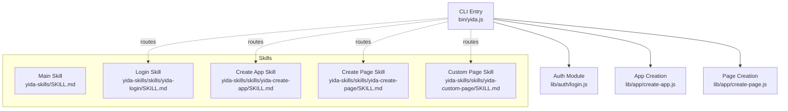

**Diagram sources**
- [bin/yida.js:152-512](file://bin/yida.js#L152-L512)
- [lib/auth/login.js:134-349](file://lib/auth/login.js#L134-L349)
- [lib/app/create-app.js:81-192](file://lib/app/create-app.js#L81-L192)
- [lib/app/create-page.js:24-139](file://lib/app/create-page.js#L24-L139)
- [yida-skills/SKILL.md:1-235](file://yida-skills/SKILL.md#L1-L235)
- [yida-skills/skills/yida-login/SKILL.md:1-201](file://yida-skills/skills/yida-login/SKILL.md#L1-L201)
- [yida-skills/skills/yida-create-app/SKILL.md:1-159](file://yida-skills/skills/yida-create-app/SKILL.md#L1-L159)
- [yida-skills/skills/yida-create-page/SKILL.md:1-126](file://yida-skills/skills/yida-create-page/SKILL.md#L1-L126)
- [yida-skills/skills/yida-custom-page/SKILL.md:1-948](file://yida-skills/skills/yida-custom-page/SKILL.md#L1-L948)

**Section sources**
- [README.md:1-223](file://README.md#L1-L223)
- [package.json:1-74](file://package.json#L1-L74)
- [bin/yida.js:1-521](file://bin/yida.js#L1-L521)

## Core Components
- CLI entrypoint: Parses commands and dispatches to appropriate modules.
- Authentication: Manages login state, caches cookies, and resolves base URLs.
- Application creation: Registers a new Yida application and records metadata.
- Page creation: Creates a custom display page and optionally injects data sources.
- Skill modules: Self-describing units with metadata, compatibility, and usage docs.

Key responsibilities:
- Command routing and argument parsing
- Login state detection and refresh
- HTTP requests with CSRF token and cookie handling
- Orchestration of multi-step workflows (e.g., create app → create page → publish)

**Section sources**
- [bin/yida.js:152-512](file://bin/yida.js#L152-L512)
- [lib/auth/login.js:134-349](file://lib/auth/login.js#L134-L349)
- [lib/app/create-app.js:81-192](file://lib/app/create-app.js#L81-L192)
- [lib/app/create-page.js:24-139](file://lib/app/create-page.js#L24-L139)

## Architecture Overview
OpenYida follows a plugin-style skill architecture:
- Each skill is a folder containing a SKILL.md and optional assets.
- The CLI discovers and routes commands to skill modules.
- Skills depend on shared utilities for authentication, HTTP, and environment resolution.
- Workflows are composed by chaining skills and passing structured parameters.

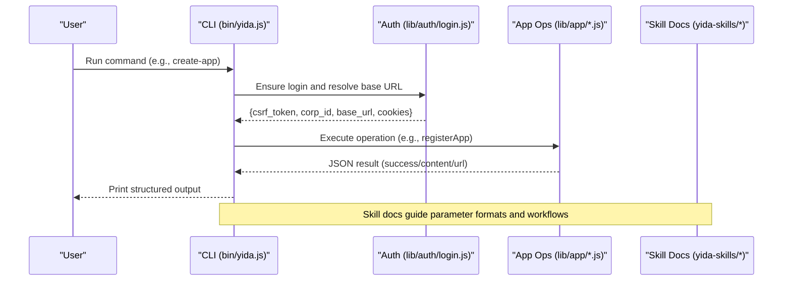

**Diagram sources**
- [bin/yida.js:152-512](file://bin/yida.js#L152-L512)
- [lib/auth/login.js:134-349](file://lib/auth/login.js#L134-L349)
- [lib/app/create-app.js:81-192](file://lib/app/create-app.js#L81-L192)
- [lib/app/create-page.js:24-139](file://lib/app/create-page.js#L24-L139)
- [yida-skills/SKILL.md:124-145](file://yida-skills/SKILL.md#L124-L145)

## Detailed Component Analysis

### CLI Command Routing and Orchestration
- The CLI parses the command and delegates to the corresponding handler.
- Handlers load authentication, construct HTTP requests, and print structured JSON to stdout.
- The main skill guide enumerates sub-skills and their typical command sequences.

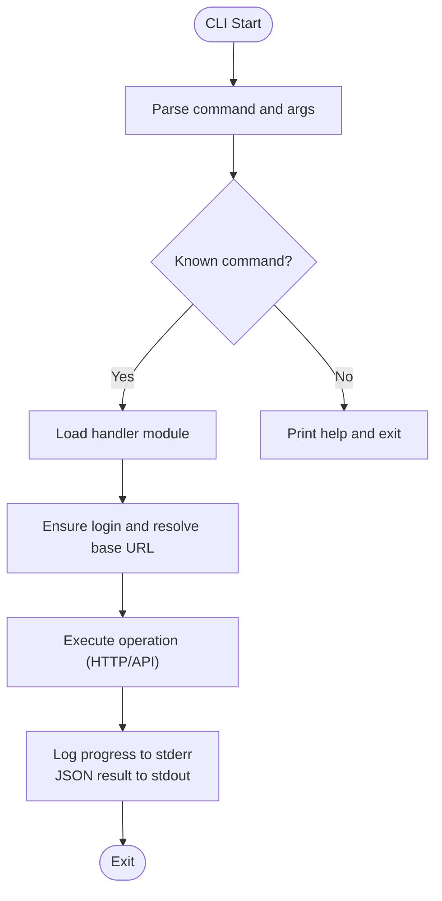

**Diagram sources**
- [bin/yida.js:152-512](file://bin/yida.js#L152-L512)
- [yida-skills/SKILL.md:124-145](file://yida-skills/SKILL.md#L124-L145)

**Section sources**
- [bin/yida.js:152-512](file://bin/yida.js#L152-L512)
- [yida-skills/SKILL.md:124-145](file://yida-skills/SKILL.md#L124-L145)

### Authentication and Runtime Environment
- Login state is cached in .cache/cookies.json with base_url derived from the actual login domain.
- The system supports both standard Playwright-based QR login and special handling for Wukong environments.
- On-demand refresh of CSRF tokens is supported; handlers automatically retry on login errors.

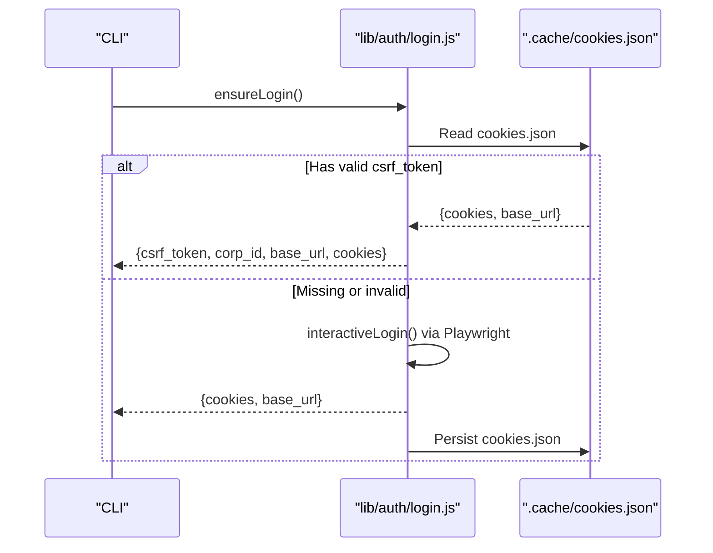

**Diagram sources**
- [lib/auth/login.js:134-349](file://lib/auth/login.js#L134-L349)

**Section sources**
- [lib/auth/login.js:134-349](file://lib/auth/login.js#L134-L349)
- [yida-skills/skills/yida-login/SKILL.md:168-195](file://yida-skills/skills/yida-login/SKILL.md#L168-L195)

### Application Creation Workflow
- Reads login state, queries enterprise-specific flags, constructs payload, and calls registerApp.
- Updates PRD documentation with appType, corpId, and base_url.
- Outputs structured JSON suitable for scripting.

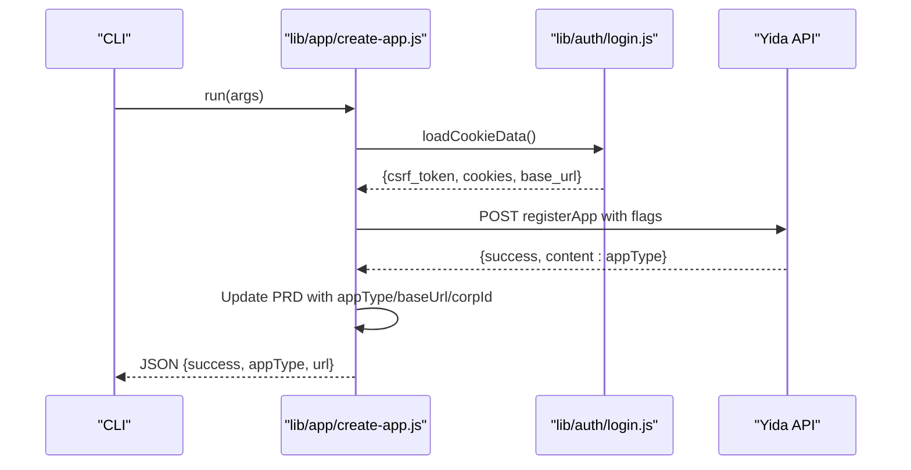

**Diagram sources**
- [lib/app/create-app.js:81-192](file://lib/app/create-app.js#L81-L192)
- [lib/auth/login.js:134-349](file://lib/auth/login.js#L134-L349)

**Section sources**
- [lib/app/create-app.js:81-192](file://lib/app/create-app.js#L81-L192)
- [yida-skills/skills/yida-create-app/SKILL.md:87-137](file://yida-skills/skills/yida-create-app/SKILL.md#L87-L137)

### Page Creation and Data Source Injection
- Creates a display-type page and optionally injects data sources into the schema after creation.
- Uses CSRF token and cookies from the cached login state.

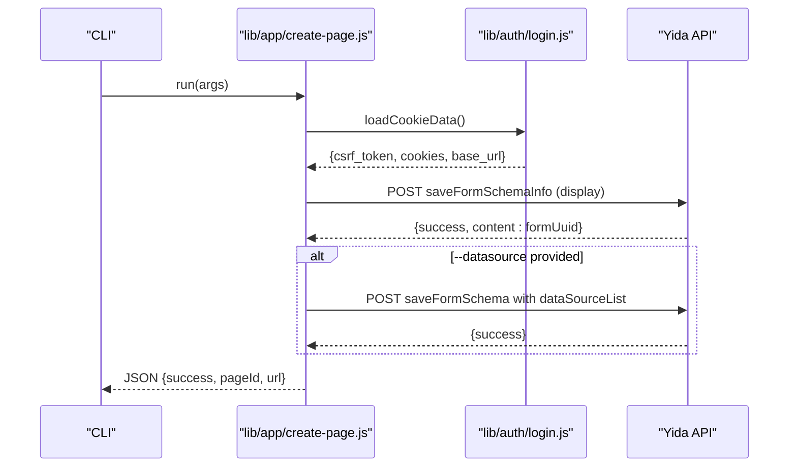

**Diagram sources**
- [lib/app/create-page.js:24-139](file://lib/app/create-page.js#L24-L139)
- [lib/auth/login.js:134-349](file://lib/auth/login.js#L134-L349)

**Section sources**
- [lib/app/create-page.js:24-139](file://lib/app/create-page.js#L24-L139)
- [yida-skills/skills/yida-create-page/SKILL.md:74-124](file://yida-skills/skills/yida-create-page/SKILL.md#L74-L124)

### Skill Metadata Structure and Compatibility Matrix
Each skill defines a metadata block with:
- name, description, license
- compatibility: list of supported AI tools
- metadata: audience, workflow, version, tags

The main skill guide enumerates sub-skills and their compatibility and workflow tags.

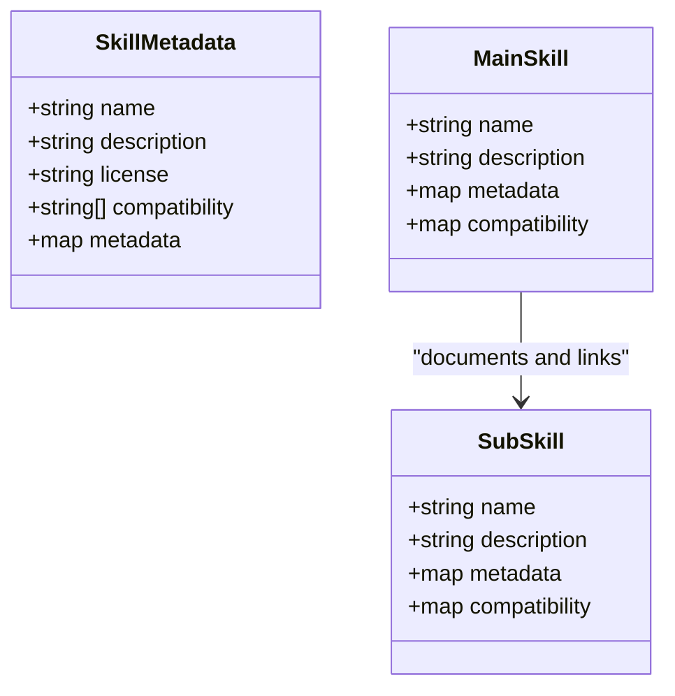

**Diagram sources**
- [yida-skills/SKILL.md:1-235](file://yida-skills/SKILL.md#L1-L235)
- [yida-skills/skills/yida-login/SKILL.md:1-201](file://yida-skills/skills/yida-login/SKILL.md#L1-L201)
- [yida-skills/skills/yida-create-app/SKILL.md:1-159](file://yida-skills/skills/yida-create-app/SKILL.md#L1-L159)
- [yida-skills/skills/yida-create-page/SKILL.md:1-126](file://yida-skills/skills/yida-create-page/SKILL.md#L1-L126)

**Section sources**
- [yida-skills/SKILL.md:1-235](file://yida-skills/SKILL.md#L1-L235)
- [yida-skills/skills/yida-login/SKILL.md:1-201](file://yida-skills/skills/yida-login/SKILL.md#L1-L201)
- [yida-skills/skills/yida-create-app/SKILL.md:1-159](file://yida-skills/skills/yida-create-app/SKILL.md#L1-L159)
- [yida-skills/skills/yida-create-page/SKILL.md:1-126](file://yida-skills/skills/yida-create-page/SKILL.md#L1-L126)

### Relationship Between Main Skill and Sub-skills
- The main skill guide lists sub-skills and their typical usage order.
- Sub-skills define their own metadata and compatibility.
- The CLI routes commands to sub-skill handlers.

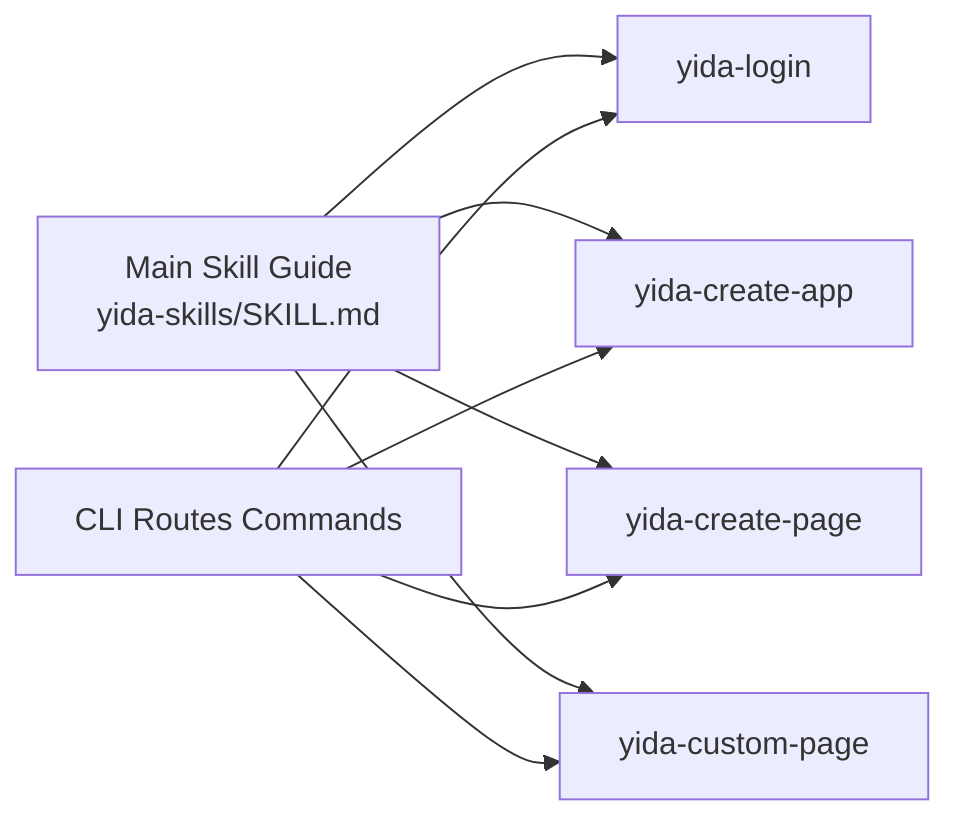

**Diagram sources**
- [yida-skills/SKILL.md:124-145](file://yida-skills/SKILL.md#L124-L145)
- [bin/yida.js:152-512](file://bin/yida.js#L152-L512)

**Section sources**
- [yida-skills/SKILL.md:124-145](file://yida-skills/SKILL.md#L124-L145)
- [bin/yida.js:152-512](file://bin/yida.js#L152-L512)

### Skill Discovery and Loading Mechanism
- CLI loads modules dynamically based on the command.
- Skill documentation drives parameter expectations and workflows.
- No centralized registry is required; skills are discovered by command routing.

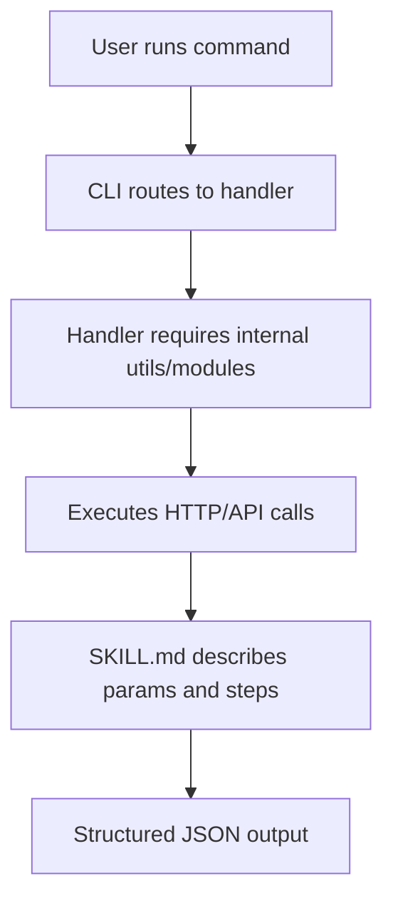

**Diagram sources**
- [bin/yida.js:152-512](file://bin/yida.js#L152-L512)
- [yida-skills/SKILL.md:124-145](file://yida-skills/SKILL.md#L124-L145)

**Section sources**
- [bin/yida.js:152-512](file://bin/yida.js#L152-L512)
- [yida-skills/SKILL.md:124-145](file://yida-skills/SKILL.md#L124-L145)

### Practical Examples: Configuration, Parameter Passing, and Result Handling
- Application creation: Pass app name and optional description/icon/theme; receive appType and URL.
- Page creation: Pass appType and page name; optionally pass --datasource JSON or file to inject data sources.
- Login: Trigger standard QR login or Wukong-specific extraction; outputs csrf_token, corp_id, base_url, cookies.

Examples are documented in each skill’s SKILL.md with typical commands and outputs.

**Section sources**
- [yida-skills/skills/yida-create-app/SKILL.md:31-81](file://yida-skills/skills/yida-create-app/SKILL.md#L31-L81)
- [yida-skills/skills/yida-create-page/SKILL.md:31-68](file://yida-skills/skills/yida-create-page/SKILL.md#L31-L68)
- [yida-skills/skills/yida-login/SKILL.md:34-91](file://yida-skills/skills/yida-login/SKILL.md#L34-L91)

### Skill Lifecycle: Registration to Execution
- Registration: Define metadata and SKILL.md; place under yida-skills/skills/<skill-name>.
- Discovery: CLI recognizes command and routes to handler.
- Execution: Handler reads auth, constructs request, executes, and prints structured JSON.
- Error handling: Handlers detect login errors via errorCode and can trigger login or refresh.
- Fallback: On CSRF/token failure, refresh from cache or re-login.

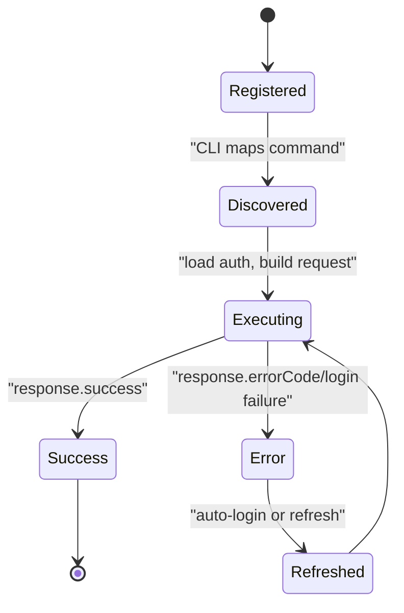

**Diagram sources**
- [yida-skills/skills/yida-login/SKILL.md:168-179](file://yida-skills/skills/yida-login/SKILL.md#L168-L179)
- [lib/app/create-app.js:146-162](file://lib/app/create-app.js#L146-L162)
- [lib/app/create-page.js:65-77](file://lib/app/create-page.js#L65-L77)

**Section sources**
- [yida-skills/skills/yida-login/SKILL.md:168-179](file://yida-skills/skills/yida-login/SKILL.md#L168-L179)
- [lib/app/create-app.js:146-162](file://lib/app/create-app.js#L146-L162)
- [lib/app/create-page.js:65-77](file://lib/app/create-page.js#L65-L77)

### Error Handling and Fallback Mechanisms
- Login errors are detected by errorCode in response bodies; handlers can auto-refresh CSRF or trigger full login.
- For Wukong environment, re-extract cookies via CDP when login expires.
- CLI prints human-readable messages to stderr and structured JSON to stdout.

**Section sources**
- [yida-skills/skills/yida-login/SKILL.md:168-179](file://yida-skills/skills/yida-login/SKILL.md#L168-L179)
- [lib/auth/login.js:207-313](file://lib/auth/login.js#L207-L313)

### Versioning, Compatibility Checking, and Upgrade Procedures
- Each skill declares metadata.version and metadata.tags.
- compatibility lists supported AI tools.
- Upgrade procedures rely on installing the latest openyida package and re-running commands; handlers will re-authenticate as needed.

**Section sources**
- [yida-skills/skills/yida-login/SKILL.md:8-17](file://yida-skills/skills/yida-login/SKILL.md#L8-L17)
- [yida-skills/skills/yida-create-app/SKILL.md:8-16](file://yida-skills/skills/yida-create-app/SKILL.md#L8-L16)
- [yida-skills/skills/yida-create-page/SKILL.md:5-16](file://yida-skills/skills/yida-create-page/SKILL.md#L5-L16)
- [package.json:3-4](file://package.json#L3-L4)

### Guidelines for Skill Development, Testing, and Debugging
- Develop skills as self-contained folders under yida-skills/skills/<skill-name> with a SKILL.md.
- Define metadata, compatibility, and workflow tags; keep examples minimal and reproducible.
- Use the CLI to test commands; verify that stderr shows progress and stdout contains JSON.
- For debugging, enable verbose logs, inspect .cache/cookies.json, and re-run with explicit login when needed.

**Section sources**
- [yida-skills/SKILL.md:124-145](file://yida-skills/SKILL.md#L124-L145)
- [bin/yida.js:152-512](file://bin/yida.js#L152-L512)

## Dependency Analysis
OpenYida’s CLI depends on:
- Node.js >= 18
- playwright for QR login
- qrcode for terminal-based flows
- uglify-js for minification in custom page publishing
- babel standalone for transformations

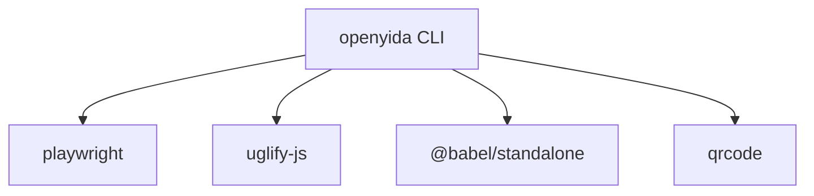

**Diagram sources**
- [package.json:50-55](file://package.json#L50-L55)

**Section sources**
- [package.json:50-55](file://package.json#L50-L55)

## Performance Considerations
- Prefer cached login state to avoid repeated browser automation.
- Minimize network retries by validating parameters before invoking APIs.
- Use structured logging to stderr and JSON to stdout for efficient parsing by AI agents.

## Troubleshooting Guide
Common issues and resolutions:
- Login expired or CSRF missing: Re-run login; handlers will auto-refresh or prompt.
- corpId mismatch: Re-login to correct organization or switch corpId.
- Missing cookies.json: Run login to generate cache.
- Page creation fails: Verify appType and permissions; check response errorCode.

**Section sources**
- [yida-skills/skills/yida-login/SKILL.md:168-195](file://yida-skills/skills/yida-login/SKILL.md#L168-L195)
- [yida-skills/SKILL.md:222-229](file://yida-skills/SKILL.md#L222-L229)

## Conclusion
OpenYida’s skill architecture is a pragmatic, plugin-style system centered on self-documenting skills and a robust CLI. Skills declare metadata and compatibility, workflows are orchestrated by the CLI, and authentication is managed centrally. The system emphasizes structured outputs, clear error handling, and developer-friendly documentation, enabling seamless AI-assisted low-code development on the Yida platform.

## Appendices

### Appendix A: Main Skill and Sub-skills Reference
- Main skill guide: [yida-skills/SKILL.md](file://yida-skills/SKILL.md)
- Sub-skills:
  - Login: [yida-skills/skills/yida-login/SKILL.md](file://yida-skills/skills/yida-login/SKILL.md)
  - Create App: [yida-skills/skills/yida-create-app/SKILL.md](file://yida-skills/skills/yida-create-app/SKILL.md)
  - Create Page: [yida-skills/skills/yida-create-page/SKILL.md](file://yida-skills/skills/yida-create-page/SKILL.md)
  - Custom Page: [yida-skills/skills/yida-custom-page/SKILL.md](file://yida-skills/skills/yida-custom-page/SKILL.md)

**Section sources**
- [yida-skills/SKILL.md:124-145](file://yida-skills/SKILL.md#L124-L145)
- [yida-skills/skills/yida-login/SKILL.md:1-201](file://yida-skills/skills/yida-login/SKILL.md#L1-L201)
- [yida-skills/skills/yida-create-app/SKILL.md:1-159](file://yida-skills/skills/yida-create-app/SKILL.md#L1-L159)
- [yida-skills/skills/yida-create-page/SKILL.md:1-126](file://yida-skills/skills/yida-create-page/SKILL.md#L1-L126)
- [yida-skills/skills/yida-custom-page/SKILL.md:1-948](file://yida-skills/skills/yida-custom-page/SKILL.md#L1-L948)

### Appendix B: Advanced Field Configuration Reference
- Association Form Field usage and rules: [yida-skills/reference/association-form-field.md](file://yida-skills/reference/association-form-field.md)

**Section sources**
- [yida-skills/reference/association-form-field.md:1-469](file://yida-skills/reference/association-form-field.md#L1-L469)