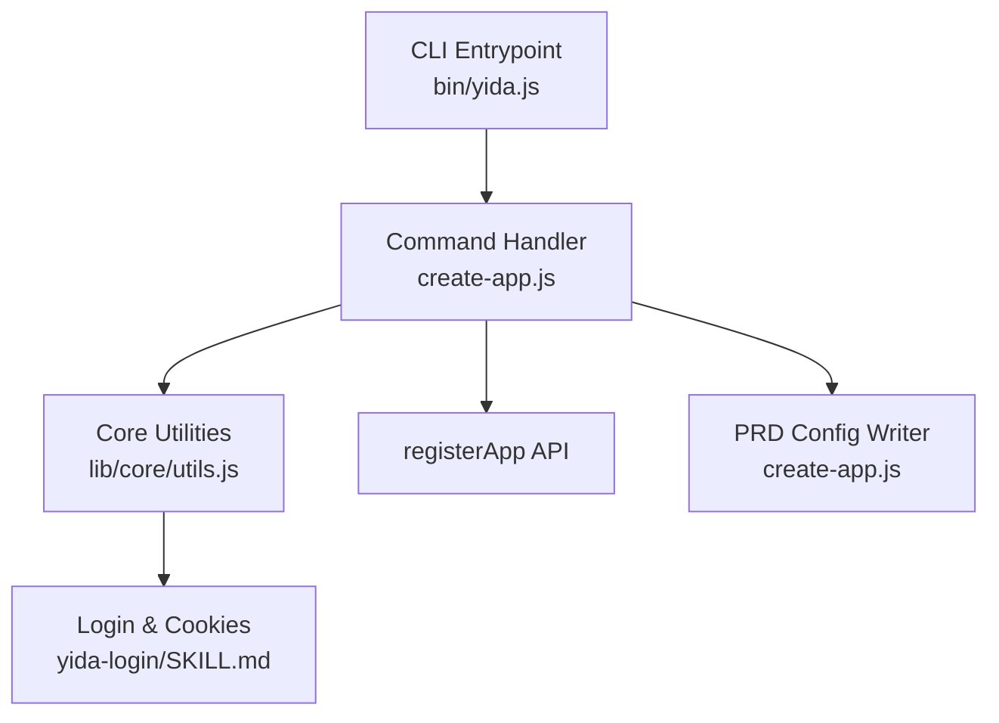
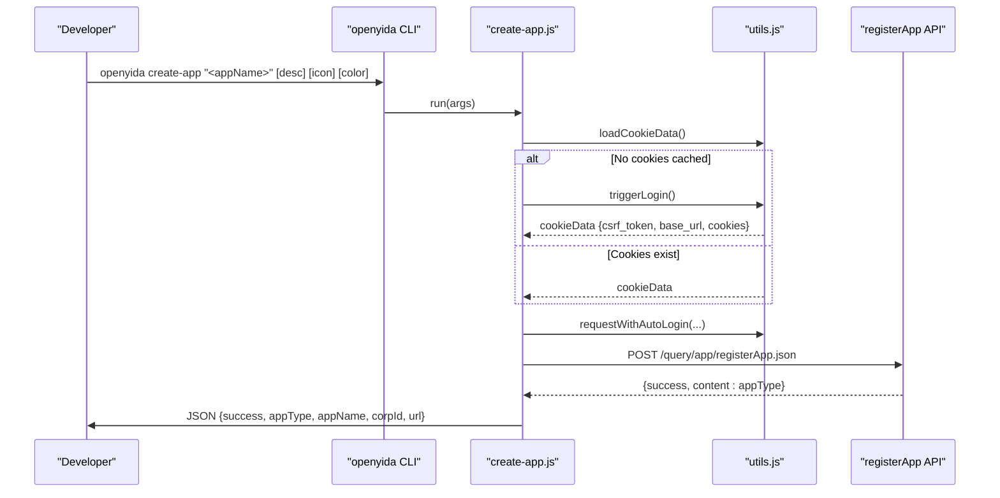
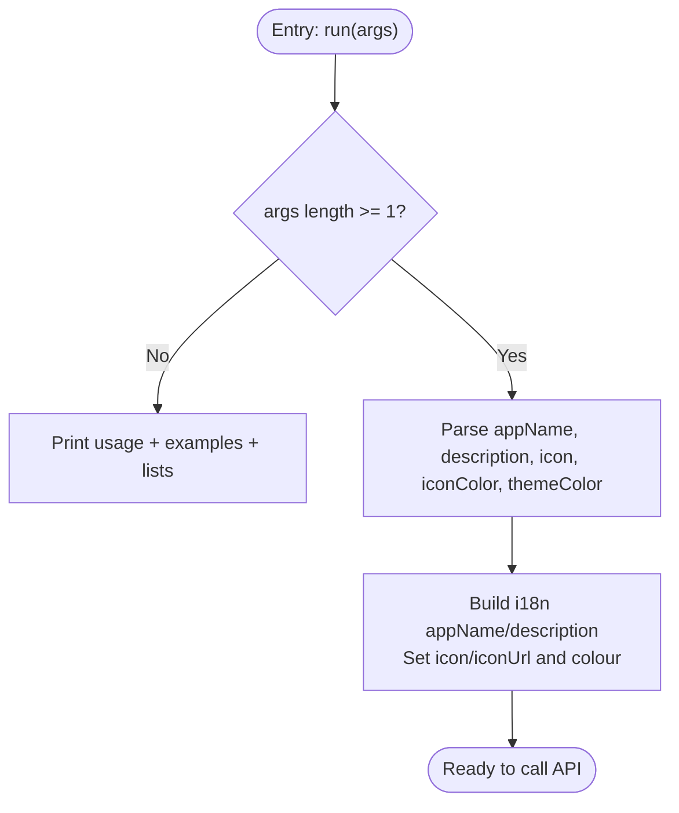
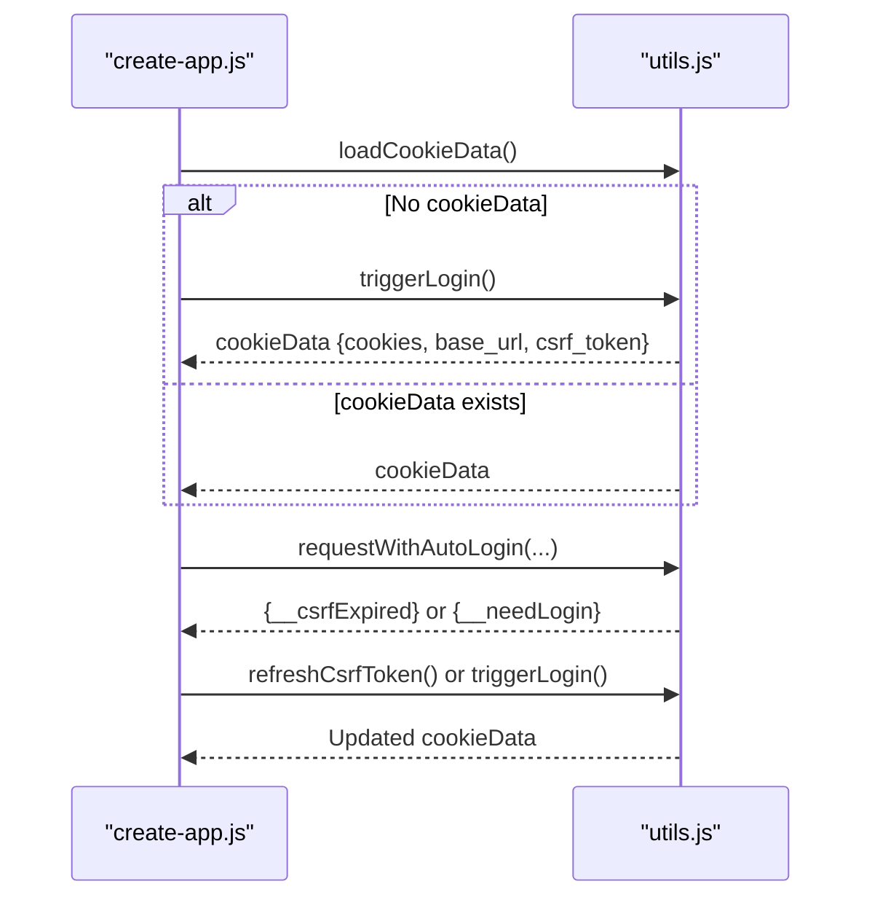
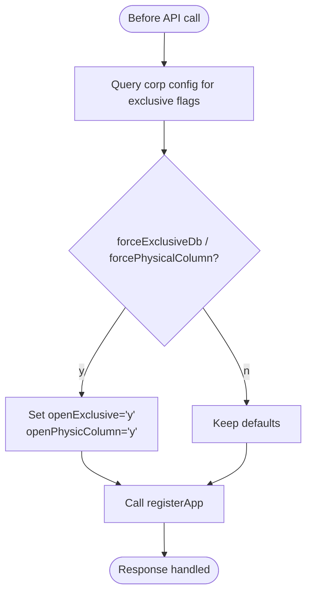
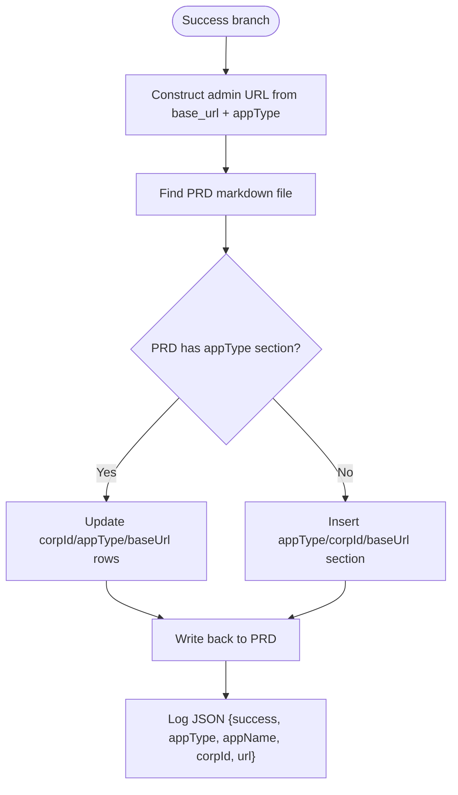
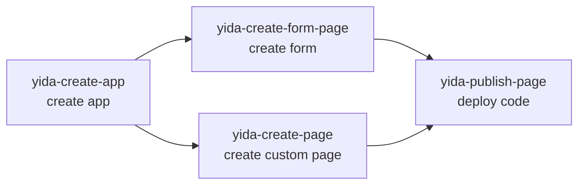
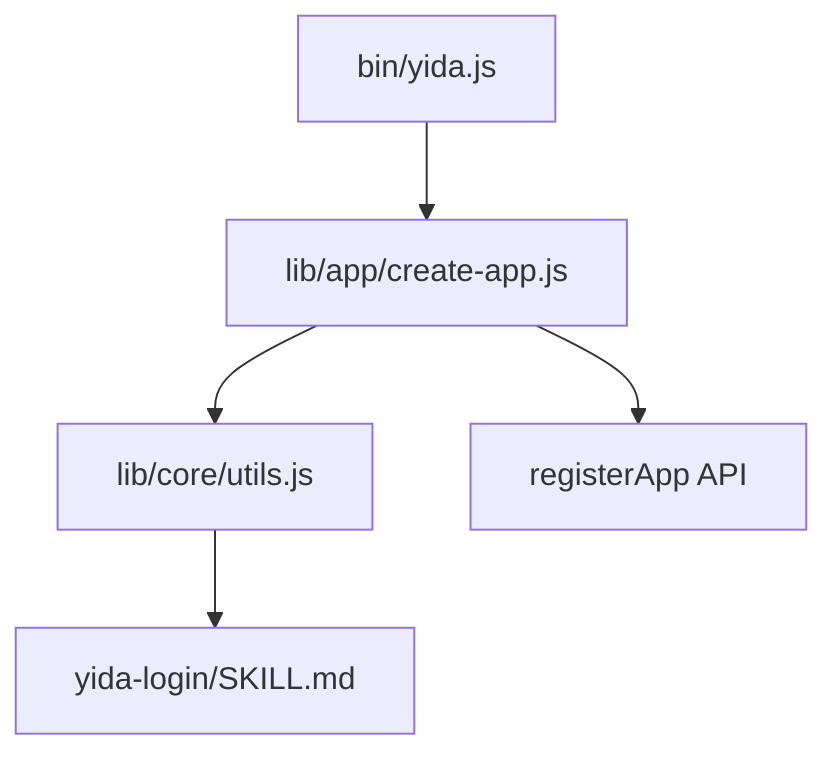

# Application Creation Skill

<cite>
**Referenced Files in This Document**
- [yida-create-app/SKILL.md](file://yida-skills/skills/yida-create-app/SKILL.md)
- [create-app.js](file://lib/app/create-app.js)
- [utils.js](file://lib/core/utils.js)
- [yida.js](file://bin/yida.js)
- [yida-login/SKILL.md](file://yida-skills/skills/yida-login/SKILL.md)
- [yida-create-form-page/SKILL.md](file://yida-skills/skills/yida-create-form-page/SKILL.md)
- [yida-create-page/SKILL.md](file://yida-skills/skills/yida-create-page/SKILL.md)
</cite>

## Table of Contents
1. [Introduction](#introduction)
2. [Project Structure](#project-structure)
3. [Core Components](#core-components)
4. [Architecture Overview](#architecture-overview)
5. [Detailed Component Analysis](#detailed-component-analysis)
6. [Dependency Analysis](#dependency-analysis)
7. [Performance Considerations](#performance-considerations)
8. [Troubleshooting Guide](#troubleshooting-guide)
9. [Conclusion](#conclusion)
10. [Appendices](#appendices)

## Introduction
This document explains the yida-create-app skill that creates a new Yida application via the registerApp API. It covers parameter specifications, authentication via cookies.json, integration into the OpenYida development workflow, and the skill’s role as the first step before creating forms and custom pages. It also documents the output format, practical usage examples, error handling, and the icon/color selection system. Finally, it clarifies compatibility with AI coding platforms and the skill chain workflow.

## Project Structure
The yida-create-app skill is implemented as a CLI command under the openyida toolchain. The primary runtime logic resides in the application creation module, while authentication and HTTP utilities are shared across skills.

**Diagram sources**
- [yida.js:243-247](file://bin/yida.js#L243-L247)
- [create-app.js:146-162](file://lib/app/create-app.js#L146-L162)
- [utils.js:276-341](file://lib/core/utils.js#L276-L341)

**Section sources**
- [yida.js:19-247](file://bin/yida.js#L19-L247)
- [create-app.js:1-192](file://lib/app/create-app.js#L1-L192)
- [utils.js:1-463](file://lib/core/utils.js#L1-L463)

## Core Components
- Command interface: The CLI exposes openyida create-app with optional parameters for app name, description, icon, and icon color.
- Authentication: Reads .cache/cookies.json for CSRF token and base_url; triggers login if missing.
- API invocation: Calls registerApp with i18n-formatted appName/description, icon/iconUrl, and theme color.
- Output: Emits structured JSON to stdout and logs to stderr; records appType and base_url to PRD file if present.

Key parameter specifications:
- appName: Required. Used for both zh_CN and en_US i18n keys.
- description: Optional. Defaults to appName if omitted.
- icon: Optional. Defaults to a predefined icon identifier; supports a combined iconName%%color format.
- iconColor: Optional. Defaults to a predefined hex color; paired with icon.
- themeColor: Optional. Fixed to blue per interface spec.

Output format:
- success: boolean
- appType: newly created application ID
- appName: original input
- corpId: extracted from cookies
- url: admin URL constructed from base_url and appType

**Section sources**
- [yida-create-app/SKILL.md:57-80](file://yida-skills/skills/yida-create-app/SKILL.md#L57-L80)
- [yida-create-app/SKILL.md:104-131](file://yida-skills/skills/yida-create-app/SKILL.md#L104-L131)
- [create-app.js:92-96](file://lib/app/create-app.js#L92-L96)
- [create-app.js:167-181](file://lib/app/create-app.js#L167-L181)

## Architecture Overview
The skill orchestrates authentication, dynamic configuration detection, API request construction, and result reporting. It integrates with the broader OpenYida workflow by emitting appType for downstream skills.

**Diagram sources**
- [yida.js:243-247](file://bin/yida.js#L243-L247)
- [create-app.js:109-121](file://lib/app/create-app.js#L109-L121)
- [create-app.js:146-162](file://lib/app/create-app.js#L146-L162)
- [utils.js:423-447](file://lib/core/utils.js#L423-L447)

## Detailed Component Analysis

### Parameter Specification and Validation
- Positional and optional arguments are parsed from CLI input.
- Defaults are applied for description, icon, iconColor, and themeColor.
- i18n payload is constructed for appName and description with zh_CN and en_US keys.
- Icon and iconUrl are set to the combined iconName%%color string.

**Diagram sources**
- [create-app.js:81-100](file://lib/app/create-app.js#L81-L100)
- [create-app.js:146-160](file://lib/app/create-app.js#L146-L160)

**Section sources**
- [create-app.js:92-96](file://lib/app/create-app.js#L92-L96)
- [create-app.js:149-153](file://lib/app/create-app.js#L149-L153)

### Authentication and Login Flow
- Attempts to load cookie data from .cache/cookies.json.
- If missing or incomplete, triggers login to obtain credentials and base_url.
- Extracts csrf_token, corp_id, and user_id from cookies for API requests.
- Uses requestWithAutoLogin to transparently refresh CSRF tokens or re-login on errors.

**Diagram sources**
- [create-app.js:109-121](file://lib/app/create-app.js#L109-L121)
- [utils.js:170-201](file://lib/core/utils.js#L170-L201)
- [utils.js:423-447](file://lib/core/utils.js#L423-L447)

**Section sources**
- [yida-login/SKILL.md:95-101](file://yida-skills/skills/yida-login/SKILL.md#L95-L101)
- [utils.js:232-251](file://lib/core/utils.js#L232-L251)

### Dynamic Configuration Detection
- Queries enterprise-specific app configuration to decide whether to enable exclusive database and physical column flags.
- Falls back to defaults if the query fails, ensuring robustness.

**Diagram sources**
- [create-app.js:130-143](file://lib/app/create-app.js#L130-L143)

**Section sources**
- [create-app.js:126-143](file://lib/app/create-app.js#L126-L143)

### Output and PRD Integration
- On success, prints human-readable summary to stderr and emits structured JSON to stdout.
- Records appType, corpId, and base_url into the project’s PRD markdown if found.

**Diagram sources**
- [create-app.js:167-181](file://lib/app/create-app.js#L167-L181)
- [create-app.js:23-77](file://lib/app/create-app.js#L23-L77)

**Section sources**
- [create-app.js:167-181](file://lib/app/create-app.js#L167-L181)
- [create-app.js:39-77](file://lib/app/create-app.js#L39-L77)

### Icon and Color Selection System
- Icons are identified by short identifiers (e.g., xian-yingyong).
- Colors are hex values (e.g., #0089FF).
- The icon parameter accepts iconName%%color to combine both.
- The skill supports a curated list of icons and a palette of colors for consistent branding.

**Section sources**
- [yida-create-app/SKILL.md:139-159](file://yida-skills/skills/yida-create-app/SKILL.md#L139-L159)
- [create-app.js:145](file://lib/app/create-app.js#L145)

### Integration with OpenYida Workflow
- First step: create app to obtain appType.
- Next steps (examples):
  - Create form page using yida-create-form-page with the returned appType.
  - Create custom page using yida-create-page with the returned appType.
  - Publish code using yida-publish-page with the resulting page/form IDs.

**Diagram sources**
- [yida-create-form-page/SKILL.md:534-544](file://yida-skills/skills/yida-create-form-page/SKILL.md#L534-L544)
- [yida-create-page/SKILL.md:94-126](file://yida-skills/skills/yida-create-page/SKILL.md#L94-L126)

**Section sources**
- [yida-create-app/SKILL.md:132-138](file://yida-skills/skills/yida-create-app/SKILL.md#L132-L138)
- [yida-create-form-page/SKILL.md:534-544](file://yida-skills/skills/yida-create-form-page/SKILL.md#L534-L544)
- [yida-create-page/SKILL.md:94-126](file://yida-skills/skills/yida-create-page/SKILL.md#L94-L126)

## Dependency Analysis
- CLI entrypoint routes create-app to the application module.
- The application module depends on core utilities for cookie loading, login triggering, CSRF refresh, base_url resolution, and HTTP helpers.
- The HTTP helpers encapsulate request building, filtering cookies by domain, and detecting login/expired CSRF conditions.

**Diagram sources**
- [yida.js:243-247](file://bin/yida.js#L243-L247)
- [create-app.js:18](file://lib/app/create-app.js#L18)
- [utils.js:1-463](file://lib/core/utils.js#L1-L463)

**Section sources**
- [yida.js:243-247](file://bin/yida.js#L243-L247)
- [create-app.js:18](file://lib/app/create-app.js#L18)
- [utils.js:423-447](file://lib/core/utils.js#L423-L447)

## Performance Considerations
- Network latency dominates API calls; timeouts are configured in HTTP helpers.
- Minimizing repeated cookie parsing and login attempts improves throughput.
- Using PRD updates is O(1) file I/O; ensure the PRD file exists to avoid unnecessary checks.

## Troubleshooting Guide
Common issues and resolutions:
- Missing cookies.json: Trigger login to generate .cache/cookies.json and retry.
- CSRF token expired: Automatic refresh via requestWithAutoLogin; retry after refresh.
- Login session expired: Automatic re-login via requestWithAutoLogin; retry after re-authentication.
- API response not JSON: HTTP helper detects malformed responses and reports error context.
- Enterprise-specific flags: If exclusive database or physical column policies apply, the skill queries corp config and adjusts flags accordingly.

Operational tips:
- Verify base_url correctness; it reflects the actual organization domain after login.
- Ensure PRD file exists to persist appType and related metadata automatically.
- Use stderr logs for progress and error messages; stdout contains structured JSON for automation.

**Section sources**
- [utils.js:232-251](file://lib/core/utils.js#L232-L251)
- [utils.js:317-333](file://lib/core/utils.js#L317-L333)
- [utils.js:423-447](file://lib/core/utils.js#L423-L447)
- [create-app.js:178-179](file://lib/app/create-app.js#L178-L179)

## Conclusion
The yida-create-app skill streamlines Yida application creation by integrating authentication, dynamic configuration detection, and structured output. It anchors the OpenYida development workflow, enabling seamless progression to form and custom page creation, and supports AI coding platforms through standardized CLI commands and JSON outputs.

## Appendices

### Practical Usage Examples
- Basic usage: create an app with minimal parameters.
- Advanced usage: specify description, icon, and color.

Refer to the skill documentation for exact command formats and expected outputs.

**Section sources**
- [yida-create-app/SKILL.md:31-80](file://yida-skills/skills/yida-create-app/SKILL.md#L31-L80)

### Compatibility with AI Coding Platforms
- Explicitly compatible with opencode and claude-code environments.
- Integrates with environment detection and workspace root resolution to align with AI tooling.

**Section sources**
- [yida-create-app/SKILL.md:5-8](file://yida-skills/skills/yida-create-app/SKILL.md#L5-L8)
- [utils.js:32-109](file://lib/core/utils.js#L32-L109)