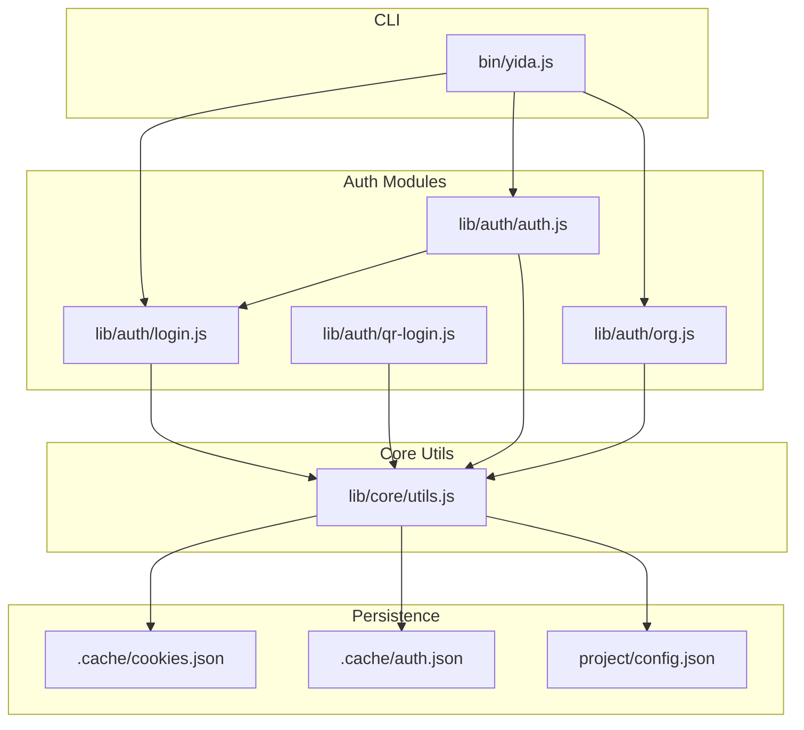
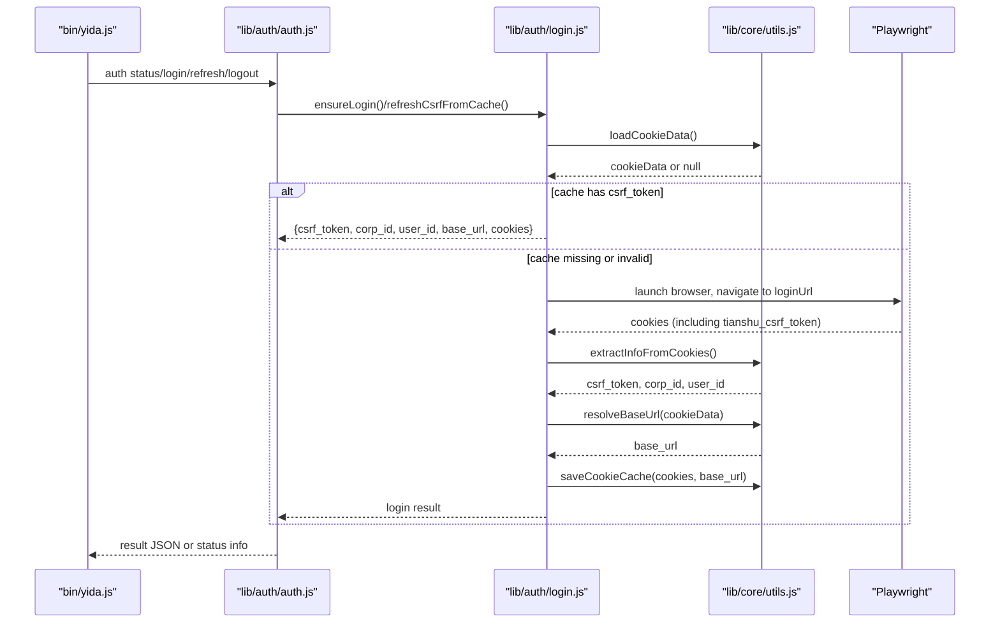
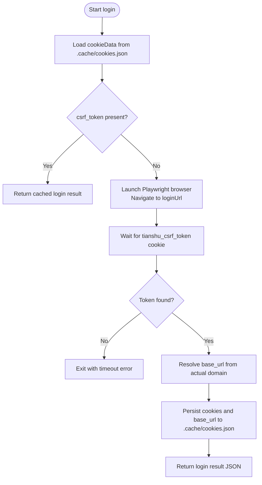
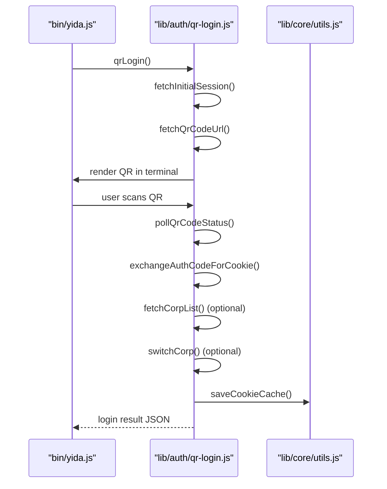
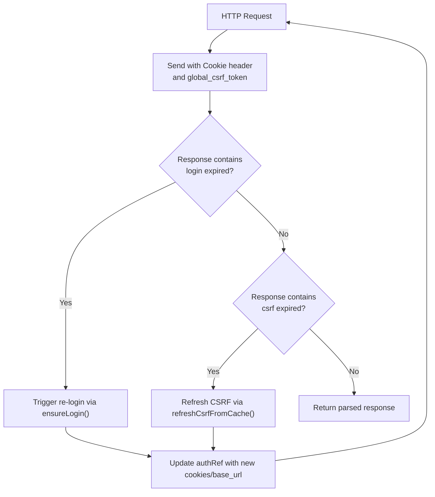
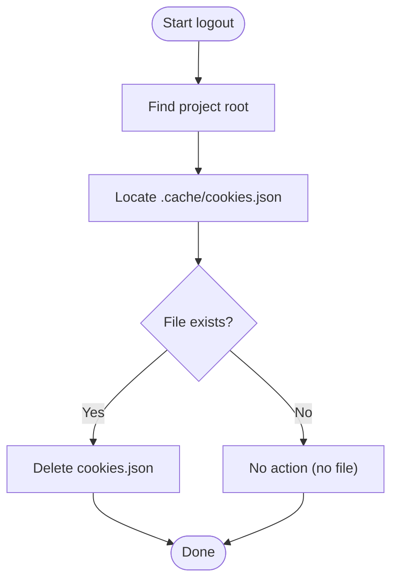
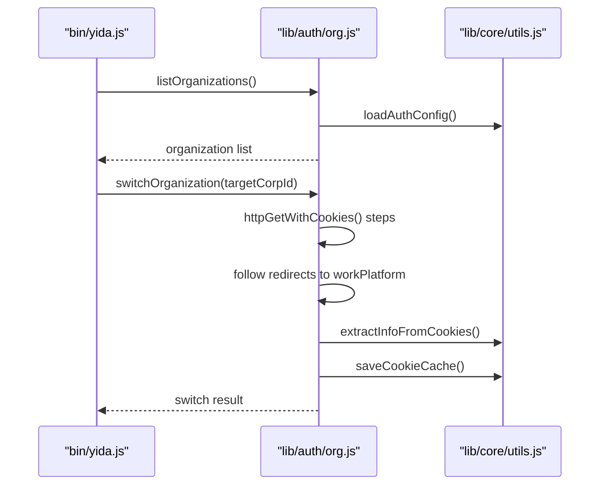
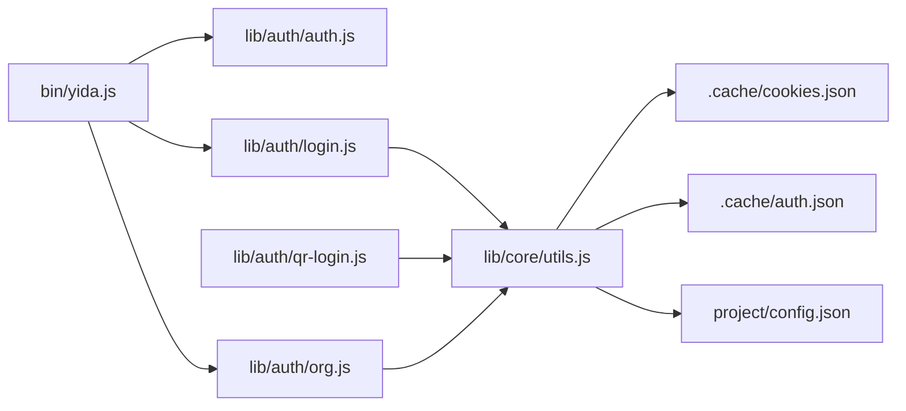

# Authentication Skills

<cite>
**Referenced Files in This Document**
- [yida-login/SKILL.md](file://yida-skills/skills/yida-login/SKILL.md)
- [yida-logout/SKILL.md](file://yida-skills/skills/yida-logout/SKILL.md)
- [bin/yida.js](file://bin/yida.js)
- [lib/auth/login.js](file://lib/auth/login.js)
- [lib/auth/qr-login.js](file://lib/auth/qr-login.js)
- [lib/auth/org.js](file://lib/auth/org.js)
- [lib/auth/auth.js](file://lib/auth/auth.js)
- [lib/core/utils.js](file://lib/core/utils.js)
- [project/config.json](file://project/config.json)
- [tests/auth.test.js](file://tests/auth.test.js)
- [tests/utils.test.js](file://tests/utils.test.js)
</cite>

## Table of Contents
1. [Introduction](#introduction)
2. [Project Structure](#project-structure)
3. [Core Components](#core-components)
4. [Architecture Overview](#architecture-overview)
5. [Detailed Component Analysis](#detailed-component-analysis)
6. [Dependency Analysis](#dependency-analysis)
7. [Performance Considerations](#performance-considerations)
8. [Troubleshooting Guide](#troubleshooting-guide)
9. [Conclusion](#conclusion)

## Introduction
This document explains the authentication-related skill packages yida-login and yida-logout and how they integrate with the broader OpenYIDA ecosystem. It covers:
- Login workflow via Playwright QR code authentication and terminal QR code flow
- Session management through cookies.json and automatic CSRF token extraction
- Logout procedures and session persistence
- Role of the authentication skill as a foundational component for all other skills
- Parameter requirements, error handling, and integration with Playwright
- Security considerations, session timeout handling, and troubleshooting

## Project Structure
The authentication system spans CLI entry points, core utilities, and skill-specific documentation:
- CLI entry: bin/yida.js routes commands to authentication modules
- Authentication logic: lib/auth/*.js implement login, logout, QR login, and organization switching
- Utilities: lib/core/utils.js provides shared helpers for cookie parsing, base_url resolution, and HTTP wrappers
- Skill docs: yida-skills/skills/yida-login/SKILL.md and yida-logout/SKILL.md describe usage and workflows
- Configuration: project/config.json defines loginUrl and defaultBaseUrl

**Diagram sources**
- [bin/yida.js:165-185](file://bin/yida.js#L165-L185)
- [lib/auth/login.js:134-155](file://lib/auth/login.js#L134-L155)
- [lib/auth/qr-login.js:499-614](file://lib/auth/qr-login.js#L499-L614)
- [lib/auth/org.js:121-180](file://lib/auth/org.js#L121-L180)
- [lib/auth/auth.js:61-127](file://lib/auth/auth.js#L61-L127)
- [lib/core/utils.js:170-201](file://lib/core/utils.js#L170-L201)
- [project/config.json:1-5](file://project/config.json#L1-L5)

**Section sources**
- [bin/yida.js:165-185](file://bin/yida.js#L165-L185)
- [lib/auth/login.js:134-155](file://lib/auth/login.js#L134-L155)
- [lib/auth/qr-login.js:499-614](file://lib/auth/qr-login.js#L499-L614)
- [lib/auth/org.js:121-180](file://lib/auth/org.js#L121-L180)
- [lib/auth/auth.js:61-127](file://lib/auth/auth.js#L61-L127)
- [lib/core/utils.js:170-201](file://lib/core/utils.js#L170-L201)
- [project/config.json:1-5](file://project/config.json#L1-L5)

## Core Components
- yida-login skill: Provides login capabilities with Playwright QR scanning and optional terminal QR flow, persists cookies, extracts CSRF tokens, and supports refreshing CSRF without re-scanning.
- yida-logout skill: Clears local cookie cache to invalidate session; subsequent skill invocations trigger re-login.
- Core utilities: Load project root, parse cookies, resolve base_url, detect login expiration and CSRF expiration, and wrap HTTP requests with automatic retry and refresh.
- Organization switching: Switch between organizations without full re-login using HTTP redirects and cookie updates.

Key outputs and formats:
- Login outputs a JSON object containing csrf_token, corp_id, user_id, base_url, and cookies.
- Cookie cache file: .cache/cookies.json stores cookies and base_url; csrf_token, corp_id, user_id are extracted from cookies at runtime.
- Auth config: .cache/auth.json stores login metadata (type, timestamps, corp/user IDs).

**Section sources**
- [yida-login/SKILL.md:119-131](file://yida-skills/skills/yida-login/SKILL.md#L119-L131)
- [yida-login/SKILL.md:139-148](file://yida-skills/skills/yida-login/SKILL.md#L139-L148)
- [lib/auth/login.js:57-93](file://lib/auth/login.js#L57-L93)
- [lib/auth/login.js:45-53](file://lib/auth/login.js#L45-L53)
- [lib/core/utils.js:170-201](file://lib/core/utils.js#L170-L201)
- [lib/auth/auth.js:29-53](file://lib/auth/auth.js#L29-L53)

## Architecture Overview
The authentication architecture centers around a CLI entrypoint that delegates to modular authentication logic. The system:
- Detects project root and loads configuration
- Checks local cookie cache for valid session
- Falls back to Playwright QR login or terminal QR login when needed
- Persists cookies and resolves base_url from actual browser domain after login
- Wraps HTTP requests to auto-detect login expiration and CSRF expiration, triggering refresh or re-login

**Diagram sources**
- [bin/yida.js:187-204](file://bin/yida.js#L187-L204)
- [lib/auth/auth.js:137-160](file://lib/auth/auth.js#L137-L160)
- [lib/auth/login.js:134-155](file://lib/auth/login.js#L134-L155)
- [lib/auth/login.js:207-313](file://lib/auth/login.js#L207-L313)
- [lib/core/utils.js:170-201](file://lib/core/utils.js#L170-L201)

## Detailed Component Analysis

### yida-login Skill
- Purpose: Provide login capability with Playwright QR scanning and optional terminal QR flow; persist cookies and extract CSRF token; support CSRF refresh without re-scanning.
- Workflow:
  - Check .cache/cookies.json for cached cookies and csrf_token
  - If present and valid, return cached login info without opening browser
  - Otherwise, launch browser via Playwright to scan QR code and wait for tianshu_csrf_token
  - Extract base_url from actual browser domain after login
  - Save cookies and base_url to .cache/cookies.json
- Output format: JSON with csrf_token, corp_id, user_id, base_url, cookies
- Configuration: Reads loginUrl and defaultBaseUrl from project/config.json

**Diagram sources**
- [lib/auth/login.js:134-155](file://lib/auth/login.js#L134-L155)
- [lib/auth/login.js:207-313](file://lib/auth/login.js#L207-L313)
- [lib/core/utils.js:170-201](file://lib/core/utils.js#L170-L201)

**Section sources**
- [yida-login/SKILL.md:95-101](file://yida-skills/skills/yida-login/SKILL.md#L95-L101)
- [yida-login/SKILL.md:119-131](file://yida-skills/skills/yida-login/SKILL.md#L119-L131)
- [lib/auth/login.js:134-155](file://lib/auth/login.js#L134-L155)
- [lib/auth/login.js:207-313](file://lib/auth/login.js#L207-L313)
- [project/config.json:1-5](file://project/config.json#L1-L5)

### Terminal QR Login (Alternative Flow)
- Implements QR login without Playwright, suitable for environments where Playwright is unavailable.
- Steps: fetch initial session, get QR URL, render QR in terminal, poll for scan confirmation, exchange authCode for cookies, optionally switch organization, save cookies.

**Diagram sources**
- [bin/yida.js:170-177](file://bin/yida.js#L170-L177)
- [lib/auth/qr-login.js:499-614](file://lib/auth/qr-login.js#L499-L614)

**Section sources**
- [lib/auth/qr-login.js:243-280](file://lib/auth/qr-login.js#L243-L280)
- [lib/auth/qr-login.js:289-330](file://lib/auth/qr-login.js#L289-L330)
- [lib/auth/qr-login.js:338-361](file://lib/auth/qr-login.js#L338-L361)
- [lib/auth/qr-login.js:369-429](file://lib/auth/qr-login.js#L369-L429)
- [lib/auth/qr-login.js:499-614](file://lib/auth/qr-login.js#L499-L614)

### Session Management and CSRF Handling
- Cookie extraction: Extracts csrf_token, corp_id, user_id from cookies; corp_id and user_id derived from tianshu_corp_user value.
- Base_url resolution: Uses actual browser domain after login; falls back to configured defaultBaseUrl if needed.
- CSRF refresh: Refreshes csrf_token from local cache without requiring QR re-scan.
- HTTP wrappers: Automatic detection of login expiration and CSRF expiration; triggers re-login or CSRF refresh transparently.

**Diagram sources**
- [lib/core/utils.js:276-341](file://lib/core/utils.js#L276-L341)
- [lib/core/utils.js:423-447](file://lib/core/utils.js#L423-L447)
- [lib/auth/login.js:101-126](file://lib/auth/login.js#L101-L126)
- [lib/auth/login.js:134-155](file://lib/auth/login.js#L134-L155)

**Section sources**
- [lib/core/utils.js:142-160](file://lib/core/utils.js#L142-L160)
- [lib/core/utils.js:232-251](file://lib/core/utils.js#L232-L251)
- [lib/core/utils.js:276-341](file://lib/core/utils.js#L276-L341)
- [lib/core/utils.js:423-447](file://lib/core/utils.js#L423-L447)
- [lib/auth/login.js:101-126](file://lib/auth/login.js#L101-L126)
- [lib/auth/login.js:134-155](file://lib/auth/login.js#L134-L155)

### Logout Procedure
- Purpose: Clear local cookie cache to invalidate session; next invocation triggers re-login.
- Behavior: Deletes .cache/cookies.json if present; prints helpful messages; does not throw if file does not exist.

**Diagram sources**
- [lib/auth/login.js:317-339](file://lib/auth/login.js#L317-L339)
- [yida-logout/SKILL.md:48-51](file://yida-skills/skills/yida-logout/SKILL.md#L48-L51)

**Section sources**
- [yida-logout/SKILL.md:181-194](file://yida-skills/skills/yida-logout/SKILL.md#L181-L194)
- [lib/auth/login.js:317-339](file://lib/auth/login.js#L317-L339)

### Organization Switching
- Lists organizations from cookie data and auth config; switches to target organization via HTTP redirects and cookie updates.
- Updates auth config with recent organizations and timestamps.

**Diagram sources**
- [bin/yida.js:207-241](file://bin/yida.js#L207-L241)
- [lib/auth/org.js:121-180](file://lib/auth/org.js#L121-L180)
- [lib/auth/org.js:189-313](file://lib/auth/org.js#L189-L313)

**Section sources**
- [lib/auth/org.js:121-180](file://lib/auth/org.js#L121-L180)
- [lib/auth/org.js:189-313](file://lib/auth/org.js#L189-L313)

## Dependency Analysis
- CLI depends on auth modules for login, logout, status, refresh, and organization operations.
- Auth modules depend on core utilities for cookie parsing, base_url resolution, and HTTP wrappers.
- Persistence relies on .cache/cookies.json and .cache/auth.json under project root.
- Configuration is read from project/config.json.

**Diagram sources**
- [bin/yida.js:165-185](file://bin/yida.js#L165-L185)
- [lib/auth/auth.js:29-53](file://lib/auth/auth.js#L29-L53)
- [lib/auth/login.js:19-21](file://lib/auth/login.js#L19-L21)
- [lib/auth/qr-login.js:22-24](file://lib/auth/qr-login.js#L22-L24)
- [lib/auth/org.js:26-29](file://lib/auth/org.js#L26-L29)
- [lib/core/utils.js:170-201](file://lib/core/utils.js#L170-L201)
- [project/config.json:1-5](file://project/config.json#L1-L5)

**Section sources**
- [bin/yida.js:165-185](file://bin/yida.js#L165-L185)
- [lib/auth/auth.js:29-53](file://lib/auth/auth.js#L29-L53)
- [lib/auth/login.js:19-21](file://lib/auth/login.js#L19-L21)
- [lib/auth/qr-login.js:22-24](file://lib/auth/qr-login.js#L22-L24)
- [lib/auth/org.js:26-29](file://lib/auth/org.js#L26-L29)
- [lib/core/utils.js:170-201](file://lib/core/utils.js#L170-L201)
- [project/config.json:1-5](file://project/config.json#L1-L5)

## Performance Considerations
- Playwright browser launch and navigation add overhead; reuse cached sessions to avoid repeated scans.
- HTTP wrappers batch detection of login and CSRF expiration to minimize retries.
- Base_url resolution avoids unnecessary DNS lookups by using actual browser domain.
- Terminal QR flow avoids Playwright dependency but requires manual scanning.

## Troubleshooting Guide
Common issues and resolutions:
- No cookie cache or invalid csrf_token: Run yida login to scan QR code; ensure browser completes login and tianshu_csrf_token appears.
- Login expired (errorCode 307/302): HTTP wrapper detects automatically and triggers re-login; retry the operation.
- CSRF token expired (errorCode TIANSHU_000030): HTTP wrapper detects and refreshes CSRF from cache; retry the operation.
- Playwright not installed: The login flow reports installation hints; install Playwright or use terminal QR flow.
- Wukong environment: Use yida login --wukong to extract cookies from the embedded browser; ensure loginUrl matches the intended organization.

Operational checks:
- Verify .cache/cookies.json exists and contains cookies and base_url.
- Confirm project/config.json has correct loginUrl and defaultBaseUrl.
- Use yida auth status to inspect current login state and base_url.

**Section sources**
- [lib/core/utils.js:232-251](file://lib/core/utils.js#L232-L251)
- [lib/core/utils.js:423-447](file://lib/core/utils.js#L423-L447)
- [yida-login/SKILL.md:168-180](file://yida-skills/skills/yida-login/SKILL.md#L168-L180)
- [lib/auth/login.js:212-218](file://lib/auth/login.js#L212-L218)
- [tests/auth.test.js:240-256](file://tests/auth.test.js#L240-L256)
- [tests/utils.test.js:127-143](file://tests/utils.test.js#L127-L143)

## Conclusion
The yida-login and yida-logout skills provide robust, environment-aware authentication for OpenYIDA. They leverage Playwright for seamless QR login, persist sessions locally, and integrate tightly with HTTP wrappers to handle CSRF and login expiration automatically. By centralizing session management and exposing consistent outputs, these skills serve as the foundation for all other skills, ensuring reliable, secure, and maintainable automation across宜搭 workflows.