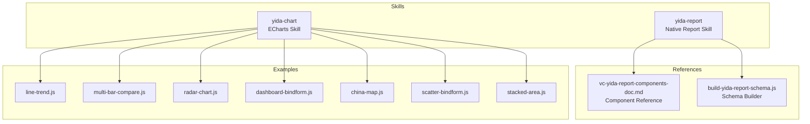
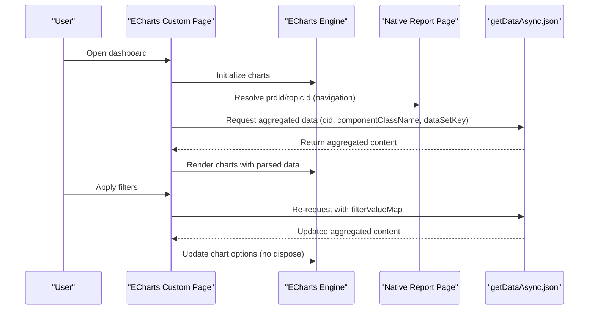
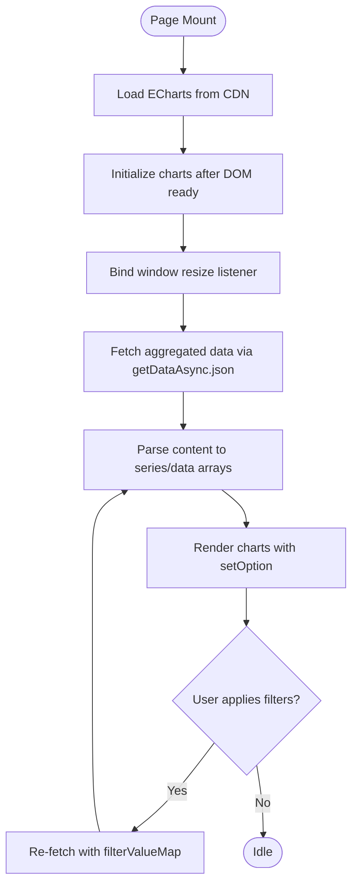
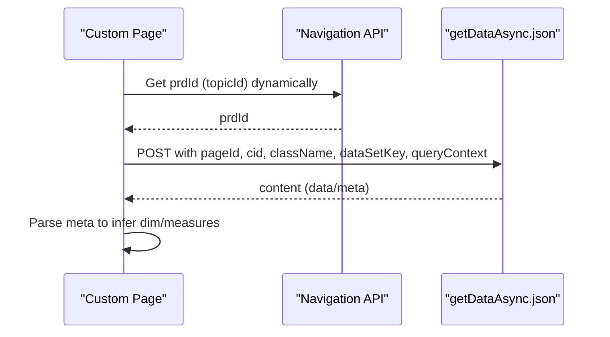
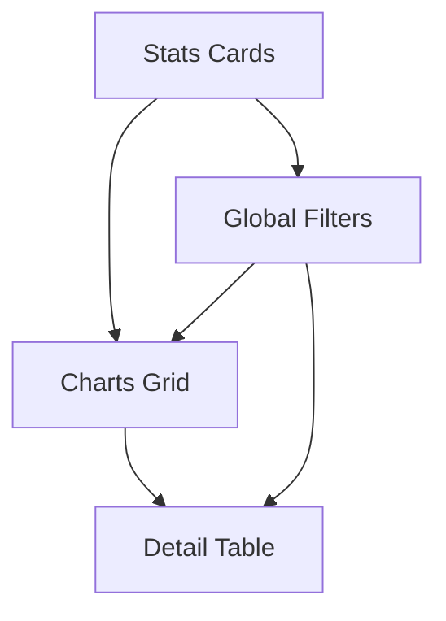
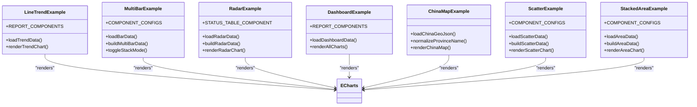
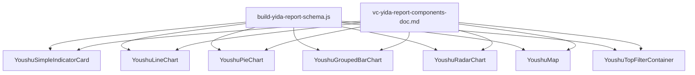
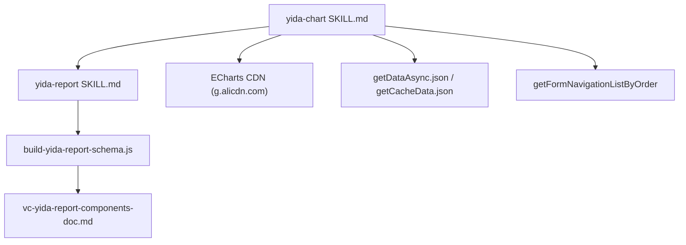

# Chart & Report Skills

<cite>
**Referenced Files in This Document**
- [yida-chart SKILL.md](file://yida-skills/skills/yida-chart/SKILL.md)
- [yida-report SKILL.md](file://yida-skills/skills/yida-report/SKILL.md)
- [build-yida-report-schema.js](file://yida-skills/skills/yida-report/build-yida-report-schema.js)
- [vc-yida-report-components-doc.md](file://yida-skills/reference/vc-yida-report-components-doc.md)
- [line-trend.js](file://yida-skills/skills/yida-chart/examples/line-trend.js)
- [multi-bar-compare.js](file://yida-skills/skills/yida-chart/examples/multi-bar-compare.js)
- [radar-chart.js](file://yida-skills/skills/yida-chart/examples/radar-chart.js)
- [dashboard-bindform.js](file://yida-skills/skills/yida-chart/examples/dashboard-bindform.js)
- [china-map.js](file://yida-skills/skills/yida-chart/examples/china-map.js)
- [scatter-bindform.js](file://yida-skills/skills/yida-chart/examples/scatter-bindform.js)
- [stacked-area.js](file://yida-skills/skills/yida-chart/examples/stacked-area.js)
</cite>

## Table of Contents
1. [Introduction](#introduction)
2. [Project Structure](#project-structure)
3. [Core Components](#core-components)
4. [Architecture Overview](#architecture-overview)
5. [Detailed Component Analysis](#detailed-component-analysis)
6. [Dependency Analysis](#dependency-analysis)
7. [Performance Considerations](#performance-considerations)
8. [Troubleshooting Guide](#troubleshooting-guide)
9. [Conclusion](#conclusion)
10. [Appendices](#appendices)

## Introduction
This document explains the chart and report skills in the OpenYida ecosystem with a focus on:
- Creating advanced ECharts-based dashboards and reports
- Integrating with宜搭原生报表 (Yida native report) data sources
- Understanding report creation workflows, chart type specifications, data binding mechanisms, and dashboard configuration options
- Leveraging examples for line trends, multi-bar comparisons, radar charts, dashboards, maps, scatter plots, and stacked areas
- Addressing customization, responsiveness, and publishing workflows

The yida-chart skill specializes in advanced visualizations powered by ECharts, while yida-report focuses on building native report pages that supply aggregated data via standardized APIs.

## Project Structure
The relevant artifacts for chart and report skills are organized under:
- yida-skills/skills/yida-chart: ECharts skill documentation and example implementations
- yida-skills/skills/yida-report: Native report skill documentation and schema builder
- yida-skills/reference: Component reference for vc-yida-report

**Diagram sources**
- [yida-chart SKILL.md:1-1526](file://yida-skills/skills/yida-chart/SKILL.md#L1-L1526)
- [yida-report SKILL.md:1-775](file://yida-skills/skills/yida-report/SKILL.md#L1-L775)
- [build-yida-report-schema.js:1-1285](file://yida-skills/skills/yida-report/build-yida-report-schema.js#L1-L1285)
- [vc-yida-report-components-doc.md:1-616](file://yida-skills/reference/vc-yida-report-components-doc.md#L1-L616)
- [line-trend.js:1-392](file://yida-skills/skills/yida-chart/examples/line-trend.js#L1-L392)
- [multi-bar-compare.js:1-332](file://yida-skills/skills/yida-chart/examples/multi-bar-compare.js#L1-L332)
- [radar-chart.js:1-431](file://yida-skills/skills/yida-chart/examples/radar-chart.js#L1-L431)
- [dashboard-bindform.js:1-525](file://yida-skills/skills/yida-chart/examples/dashboard-bindform.js#L1-L525)
- [china-map.js:1-458](file://yida-skills/skills/yida-chart/examples/china-map.js#L1-L458)
- [scatter-bindform.js:1-401](file://yida-skills/skills/yida-chart/examples/scatter-bindform.js#L1-L401)
- [stacked-area.js:1-358](file://yida-skills/skills/yida-chart/examples/stacked-area.js#L1-L358)

**Section sources**
- [yida-chart SKILL.md:1-1526](file://yida-skills/skills/yida-chart/SKILL.md#L1-L1526)
- [yida-report SKILL.md:1-775](file://yida-skills/skills/yida-report/SKILL.md#L1-L775)

## Core Components
- ECharts rendering pipeline: Load ECharts from trusted CDN, initialize charts after DOM ready, manage lifecycle (create/dispose), and handle responsive resize.
- Data sourcing: Native report aggregation via getDataAsync.json or getCacheData.json; frontend aggregation forbidden except for raw detail tables via searchFormDatas.
- Dashboard composition: Combine indicator cards, charts, and detail tables; support global filters and drill-down where configured.
- Schema-driven native reports: Use vc-yida-report components and build-yida-report-schema.js to define datasets, filters, and chart configurations.

Key capabilities:
- Line trend, multi-series comparison, radar charts, stacked areas, bar charts, pie charts, funnel charts, gauges, heatmaps, calendars, word clouds, maps, and pivot tables.
- Responsive design with adaptive heights and grid layouts.
- Publishing and maintenance workflows that keep native report and ECharts pages synchronized.

**Section sources**
- [yida-chart SKILL.md:168-984](file://yida-skills/skills/yida-chart/SKILL.md#L168-L984)
- [yida-report SKILL.md:256-390](file://yida-skills/skills/yida-report/SKILL.md#L256-L390)
- [vc-yida-report-components-doc.md:1-616](file://yida-skills/reference/vc-yida-report-components-doc.md#L1-L616)

## Architecture Overview
The system integrates宜搭原生报表 (native report) as the authoritative data source for aggregations, while ECharts renders advanced visualizations in custom pages.

**Diagram sources**
- [yida-chart SKILL.md:363-467](file://yida-skills/skills/yida-chart/SKILL.md#L363-L467)
- [yida-chart SKILL.md:486-768](file://yida-skills/skills/yida-chart/SKILL.md#L486-L768)
- [yida-report SKILL.md:29-65](file://yida-skills/skills/yida-report/SKILL.md#L29-L65)

## Detailed Component Analysis

### ECharts Rendering Pipeline
- Essential functions: _customState, getCustomState, setCustomState, forceUpdate, didMount, didUnmount, renderJsx.
- ECharts initialization and disposal: createChart ensures single instance per container; didUnmount disposes instances and removes listeners.
- Resize handling: bindChartResize listens to window resize and calls chart.resize() for each registered chartId.

**Diagram sources**
- [yida-chart SKILL.md:815-910](file://yida-skills/skills/yida-chart/SKILL.md#L815-L910)
- [yida-chart SKILL.md:914-946](file://yida-skills/skills/yida-chart/SKILL.md#L914-L946)

**Section sources**
- [yida-chart SKILL.md:280-483](file://yida-skills/skills/yida-chart/SKILL.md#L280-L483)
- [yida-chart SKILL.md:815-910](file://yida-skills/skills/yida-chart/SKILL.md#L815-L910)

### Data Binding Mechanisms
- Native report data source: getDataAsync.json or getCacheData.json; requires prdId (topicId), pageId (REPORT-xxx), cid, componentClassName, dataSetKey, and queryContext.
- Filter propagation: filterValueMap uses filterKey (UUID format) extracted from the native report schema.
- Indicator vs. table data: Indicator cards use dataSetKey "youshuData"; tables use "table".
- Detail table access: searchFormDatas provides raw records with formInstId for detail navigation.

**Diagram sources**
- [yida-chart SKILL.md:363-436](file://yida-skills/skills/yida-chart/SKILL.md#L363-L436)
- [yida-chart SKILL.md:486-768](file://yida-skills/skills/yida-chart/SKILL.md#L486-L768)
- [yida-report SKILL.md:29-93](file://yida-skills/skills/yida-report/SKILL.md#L29-L93)

**Section sources**
- [yida-chart SKILL.md:486-768](file://yida-skills/skills/yida-chart/SKILL.md#L486-L768)
- [yida-report SKILL.md:29-134](file://yida-skills/skills/yida-report/SKILL.md#L29-L134)

### Dashboard Configuration Options
- Layout: Stats cards (indicators), charts grid, and detail table arranged vertically; responsive widths and heights.
- Filters: Global filters placed at the top; applied via filterValueMap to re-fetch and update charts in place.
- Refresh UX: Local refresh indicators and progress bar during partial updates.

**Diagram sources**
- [dashboard-bindform.js:380-525](file://yida-skills/skills/yida-chart/examples/dashboard-bindform.js#L380-L525)
- [yida-chart SKILL.md:1038-1172](file://yida-skills/skills/yida-chart/SKILL.md#L1038-L1172)

**Section sources**
- [dashboard-bindform.js:1-525](file://yida-skills/skills/yida-chart/examples/dashboard-bindform.js#L1-L525)
- [yida-chart SKILL.md:1038-1172](file://yida-skills/skills/yida-chart/SKILL.md#L1038-L1172)

### Chart Type Specifications and Examples
- Line Trend: Multi-series line chart comparing categories over time; demonstrates parallel fetching and merging of multiple report components.
- Multi-Bar Compare: Grouped vs stacked bar chart with mode toggle; shows frontend aggregation for detail table data (searchFormDatas) and backend aggregation for charts (getDataAsync.json).
- Radar Chart: Multi-dimension radar comparing status and priority distributions; builds indicator arrays from report data.
- Dashboard: Combined KPI cards, bar/pie/line charts; showcases unified layout and refresh strategy.
- China Map: Geospatial visualization using registered map and normalized province names; demonstrates external GeoJSON loading and visualMap.
- Scatter Plot: Correlation analysis with categorical coloring and bubble sizing; illustrates tooltip customization.
- Stacked Area: Structural change analysis with percentage stacking toggle.

**Diagram sources**
- [line-trend.js:1-392](file://yida-skills/skills/yida-chart/examples/line-trend.js#L1-L392)
- [multi-bar-compare.js:1-332](file://yida-skills/skills/yida-chart/examples/multi-bar-compare.js#L1-L332)
- [radar-chart.js:1-431](file://yida-skills/skills/yida-chart/examples/radar-chart.js#L1-L431)
- [dashboard-bindform.js:1-525](file://yida-skills/skills/yida-chart/examples/dashboard-bindform.js#L1-L525)
- [china-map.js:1-458](file://yida-skills/skills/yida-chart/examples/china-map.js#L1-L458)
- [scatter-bindform.js:1-401](file://yida-skills/skills/yida-chart/examples/scatter-bindform.js#L1-L401)
- [stacked-area.js:1-358](file://yida-skills/skills/yida-chart/examples/stacked-area.js#L1-L358)

**Section sources**
- [line-trend.js:1-392](file://yida-skills/skills/yida-chart/examples/line-trend.js#L1-L392)
- [multi-bar-compare.js:1-332](file://yida-skills/skills/yida-chart/examples/multi-bar-compare.js#L1-L332)
- [radar-chart.js:1-431](file://yida-skills/skills/yida-chart/examples/radar-chart.js#L1-L431)
- [dashboard-bindform.js:1-525](file://yida-skills/skills/yida-chart/examples/dashboard-bindform.js#L1-L525)
- [china-map.js:1-458](file://yida-skills/skills/yida-chart/examples/china-map.js#L1-L458)
- [scatter-bindform.js:1-401](file://yida-skills/skills/yida-chart/examples/scatter-bindform.js#L1-L401)
- [stacked-area.js:1-358](file://yida-skills/skills/yida-chart/examples/stacked-area.js#L1-L358)

### Native Report Schema and Component Library
- vc-yida-report provides 16+ components (indicators, charts, tables, filters) with lazy-loading architecture.
- build-yida-report-schema.js generates page schemas programmatically, defining datasets, fields, filters, orders, and limits.
- Components accept youshuData and settings; many support drill-down, percent display, and color customization.

**Diagram sources**
- [build-yida-report-schema.js:1-1285](file://yida-skills/skills/yida-report/build-yida-report-schema.js#L1-L1285)
- [vc-yida-report-components-doc.md:1-616](file://yida-skills/reference/vc-yida-report-components-doc.md#L1-L616)

**Section sources**
- [build-yida-report-schema.js:1-1285](file://yida-skills/skills/yida-report/build-yida-report-schema.js#L1-L1285)
- [vc-yida-report-components-doc.md:1-616](file://yida-skills/reference/vc-yida-report-components-doc.md#L1-L616)

## Dependency Analysis
- yida-chart depends on yida-report for data source creation and on vc-yida-report components for schema-driven native reports.
- ECharts pages depend on:
  - Trusted CDN for ECharts (g.alicdn.com)
  - Native report APIs (getDataAsync.json/getCacheData.json)
  - Dynamic prdId resolution via navigation API
  - Proper filterKey extraction from native report schema

**Diagram sources**
- [yida-chart SKILL.md:190-236](file://yida-skills/skills/yida-chart/SKILL.md#L190-L236)
- [yida-report SKILL.md:1-775](file://yida-skills/skills/yida-report/SKILL.md#L1-L775)
- [build-yida-report-schema.js:1-1285](file://yida-skills/skills/yida-report/build-yida-report-schema.js#L1-L1285)
- [vc-yida-report-components-doc.md:1-616](file://yida-skills/reference/vc-yida-report-components-doc.md#L1-L616)

**Section sources**
- [yida-chart SKILL.md:190-236](file://yida-skills/skills/yida-chart/SKILL.md#L190-L236)
- [yida-report SKILL.md:1-775](file://yida-skills/skills/yida-report/SKILL.md#L1-L775)

## Performance Considerations
- Prefer getCacheData.json for large datasets to reduce server load.
- Use local refresh (partial updates) instead of full-page reloads; avoid disposing chart instances unnecessarily.
- Limit data volume by applying filters and using paging; leverage server-side aggregation.
- Optimize rendering by batching chart updates and minimizing DOM operations.

[No sources needed since this section provides general guidance]

## Troubleshooting Guide
Common issues and resolutions:
- ECharts load failures: Use the ali cdn (g.alicdn.com) and lock version to 5.6.0.
- forceUpdate errors: Ensure getCustomState/setCustomState/forceUpdate are exported and renderJsx includes the hidden timestamp div.
- Charts not updating: Verify the hidden timestamp div exists in every render branch.
- Data not refreshing: Confirm filterValueMap keys are filterKey (UUID) from schema, not field IDs.
- PrdId/topicId missing: Dynamically fetch via getFormNavigationListByOrder; do not hardcode.
- Memory leaks: Dispose charts in didUnmount and remove event listeners.

**Section sources**
- [yida-chart SKILL.md:1392-1525](file://yida-skills/skills/yida-chart/SKILL.md#L1392-L1525)

## Conclusion
The yida-chart skill enables advanced, customizable visualizations by leveraging宜搭原生报表 as the authoritative data source. By following the documented patterns for data binding, filtering, rendering lifecycle, and responsive design, teams can build robust dashboards and reports that integrate seamlessly with宜搭’s native reporting infrastructure. The examples demonstrate practical implementations across multiple chart types and dashboard patterns, while the native report skill and component library provide a structured foundation for schema-driven report creation.

[No sources needed since this section summarizes without analyzing specific files]

## Appendices

### Report Creation Workflow
- From scratch: Use yida-report to create native report pages with desired components; then use yida-chart to build ECharts custom pages consuming the native report’s getDataAsync.json.
- Based on existing report: Parse the existing native report schema to extract data source parameters (prdId, pageId, cid, componentClassName, dataSetKey), then create an ECharts custom page with enhanced visuals.

**Section sources**
- [yida-report SKILL.md:256-325](file://yida-skills/skills/yida-report/SKILL.md#L256-L325)
- [yida-chart SKILL.md:1280-1390](file://yida-skills/skills/yida-chart/SKILL.md#L1280-L1390)

### Parameter Requirements for Chart Definitions
- Native report API parameters: pageId (REPORT-xxx), prdId (topicId), cid, componentClassName, dataSetKey, queryContext (filterValueMap, paging, orderBy).
- Indicator vs. table: dataSetKey "youshuData" for indicator cards; "table" for statistics.
- Filter keys: Use filterKey (UUID) from schema; values are arrays.

**Section sources**
- [yida-chart SKILL.md:572-768](file://yida-skills/skills/yida-chart/SKILL.md#L572-L768)
- [yida-report SKILL.md:29-93](file://yida-skills/skills/yida-report/SKILL.md#L29-L93)

### Data Formatting Requirements
- Meta inference: When meta lacks explicit DIMENSION/MEASURE types, infer from column order.
- Dimension/measure mapping: Use alias fields to construct series and axes.
- Date/time handling: Respect timezone and timeGranularityType for time-series charts.

**Section sources**
- [yida-report SKILL.md:95-133](file://yida-skills/skills/yida-report/SKILL.md#L95-L133)
- [build-yida-report-schema.js:24-86](file://yida-skills/skills/yida-report/build-yida-report-schema.js#L24-L86)

### Relationship with Report Publishing Workflows
- After creating or updating native reports, synchronize ECharts pages to reflect new components or data structures.
- Hide native report pages (double-hide) to avoid dual entry points; maintain a single source of truth in the ECharts custom page.
- Record and maintain binding relations (.cache/<project>-report-binding.json) to track native report ↔ ECharts page mappings.

**Section sources**
- [yida-chart SKILL.md:96-142](file://yida-skills/skills/yida-chart/SKILL.md#L96-L142)
- [yida-chart SKILL.md:1280-1390](file://yida-skills/skills/yida-chart/SKILL.md#L1280-L1390)

### Chart Customization Options
- Themes and palettes: Use consistent color schemes and typography; adjust opacity, gradients, and label visibility.
- Interactions: Tooltips, legends, zoom, and drill-down where supported by components.
- Responsiveness: Adaptive heights and grid layouts; label rotation and legend scrolling on small screens.

**Section sources**
- [yida-chart SKILL.md:1000-1072](file://yida-skills/skills/yida-chart/SKILL.md#L1000-L1072)
- [vc-yida-report-components-doc.md:61-72](file://yida-skills/reference/vc-yida-report-components-doc.md#L61-L72)

### Business Intelligence Dashboards
- Composition: KPI cards, multiple charts, and a detail table; global filters; drill-down where configured.
- Refresh strategy: Partial refresh with local indicators; avoid full-page loading.
- Publishing: Keep native report and ECharts page in sync; publish custom pages for end-user consumption.

**Section sources**
- [dashboard-bindform.js:1-525](file://yida-skills/skills/yida-chart/examples/dashboard-bindform.js#L1-L525)
- [yida-chart SKILL.md:1038-1172](file://yida-skills/skills/yida-chart/SKILL.md#L1038-L1172)