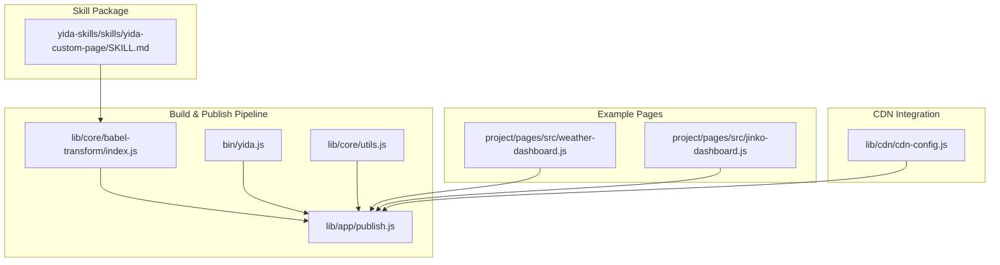
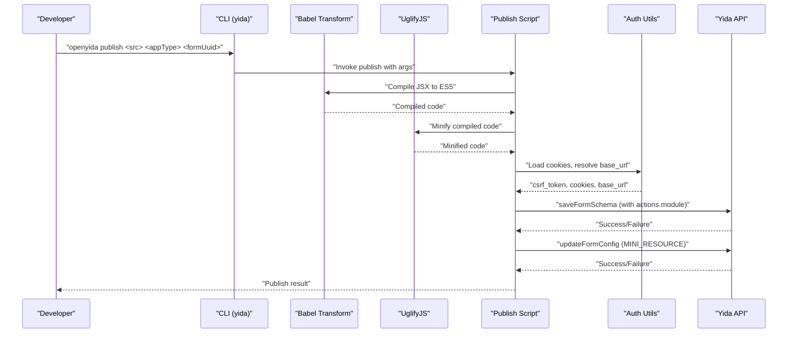
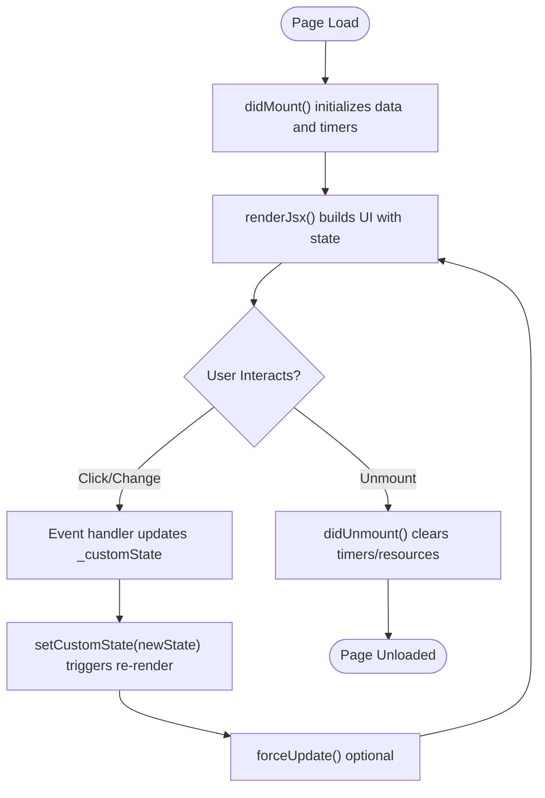
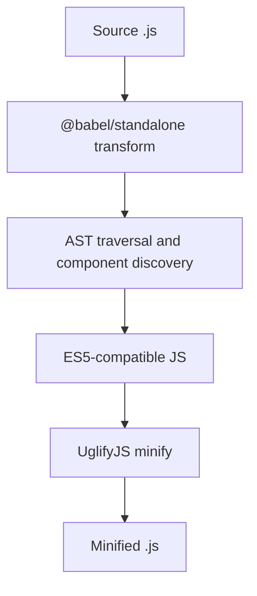
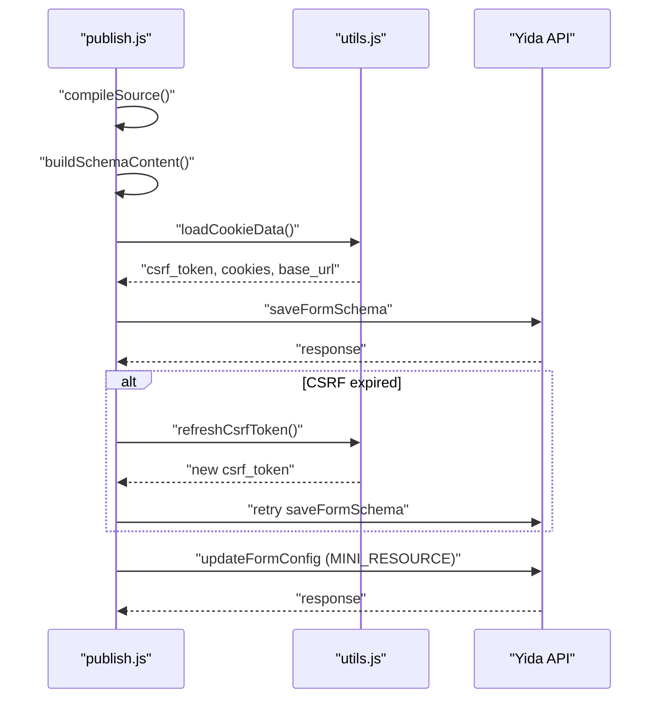
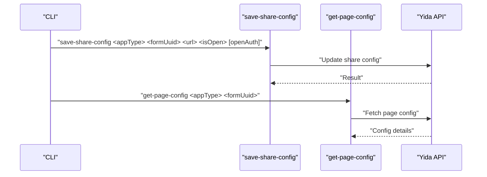
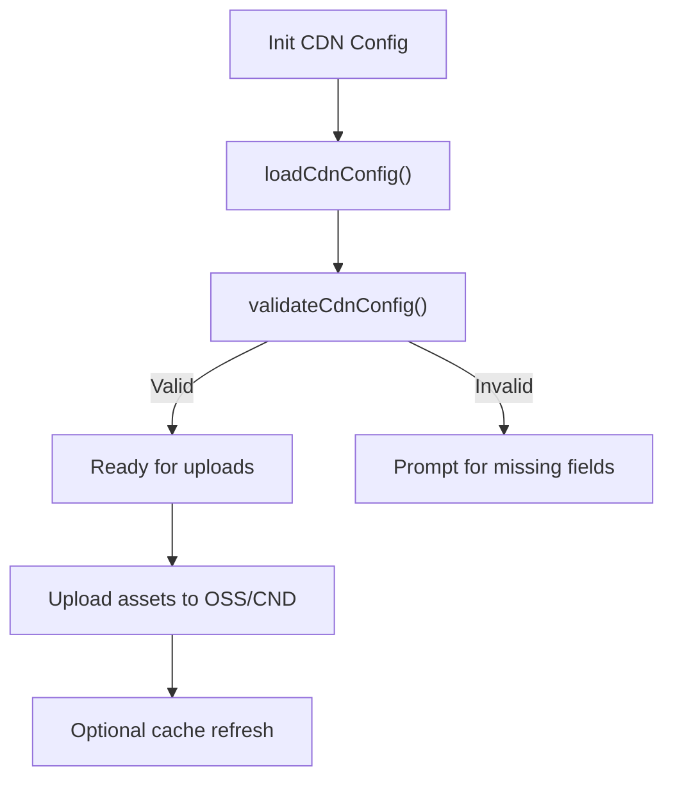
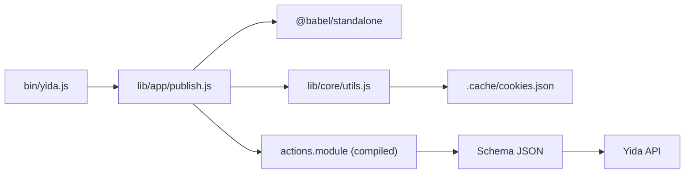

# Custom Page Creation Skill

<cite>
**Referenced Files in This Document**
- [SKILL.md](file://yida-skills/skills/yida-custom-page/SKILL.md)
- [babel-transform/index.js](file://lib/core/babel-transform/index.js)
- [publish.js](file://lib/app/publish.js)
- [yida.js](file://bin/yida.js)
- [utils.js](file://lib/core/utils.js)
- [weather-dashboard.js](file://project/pages/src/weather-dashboard.js)
- [jinko-dashboard.js](file://project/pages/src/jinko-dashboard.js)
- [cdn-config.js](file://lib/cdn/cdn-config.js)
</cite>

## Table of Contents
1. [Introduction](#introduction)
2. [Project Structure](#project-structure)
3. [Core Components](#core-components)
4. [Architecture Overview](#architecture-overview)
5. [Detailed Component Analysis](#detailed-component-analysis)
6. [Dependency Analysis](#dependency-analysis)
7. [Performance Considerations](#performance-considerations)
8. [Troubleshooting Guide](#troubleshooting-guide)
9. [Conclusion](#conclusion)

## Introduction
This document explains the yida-custom-page skill package for developing interactive dashboards and custom interfaces on the Alibaba Yida low-code platform. It covers the JSX-based page development workflow, component integration patterns, publishing pipeline, and operational aspects such as parameter requirements, access control, and CDN asset management. The skill enables developers to build rich, reactive pages that integrate with Yida's runtime APIs, state management, and deployment mechanisms.

## Project Structure
The yida-custom-page skill is part of the broader openyida toolkit. Key areas relevant to custom page creation include:
- Skill documentation and design guidelines
- Build-time compilation and publishing pipeline
- Example custom pages demonstrating best practices
- Utility modules for authentication, CSRF handling, and HTTP requests
- CDN configuration for asset management

**Diagram sources**
- [SKILL.md:1-1100](file://yida-skills/skills/yida-custom-page/SKILL.md#L1-L1100)
- [babel-transform/index.js:1-244](file://lib/core/babel-transform/index.js#L1-L244)
- [publish.js:1-630](file://lib/app/publish.js#L1-L630)
- [yida.js:1-521](file://bin/yida.js#L1-L521)
- [utils.js:1-463](file://lib/core/utils.js#L1-L463)
- [weather-dashboard.js:1-374](file://project/pages/src/weather-dashboard.js#L1-L374)
- [jinko-dashboard.js:1-661](file://project/pages/src/jinko-dashboard.js#L1-L661)
- [cdn-config.js:1-173](file://lib/cdn/cdn-config.js#L1-L173)

**Section sources**
- [SKILL.md:1-1100](file://yida-skills/skills/yida-custom-page/SKILL.md#L1-L1100)
- [yida.js:24-50](file://bin/yida.js#L24-L50)

## Core Components
- JSX rendering and state management: Custom pages define a renderJsx function and manage state via getCustomState/setCustomState/forceUpdate, with lifecycle hooks didMount/didUnmount.
- Compilation engine: Babel transforms JSX to ES5-compatible code and compresses it for deployment.
- Publishing pipeline: The CLI orchestrates compilation, schema generation, authentication, and API calls to persist the page to Yida.
- Runtime utilities: Helpers for login state, CSRF token detection, and HTTP requests streamline the publish flow.
- Example pages: Real-world dashboards demonstrate responsive layouts, charts, and interactivity patterns.

**Section sources**
- [SKILL.md:550-800](file://yida-skills/skills/yida-custom-page/SKILL.md#L550-L800)
- [babel-transform/index.js:89-244](file://lib/core/babel-transform/index.js#L89-L244)
- [publish.js:59-123](file://lib/app/publish.js#L59-L123)
- [utils.js:170-264](file://lib/core/utils.js#L170-L264)
- [weather-dashboard.js:85-124](file://project/pages/src/weather-dashboard.js#L85-L124)
- [jinko-dashboard.js:1-661](file://project/pages/src/jinko-dashboard.js#L1-L661)

## Architecture Overview
The custom page creation workflow integrates authoring, compilation, schema generation, authentication, and publishing into a cohesive pipeline.

**Diagram sources**
- [yida.js:268-280](file://bin/yida.js#L268-L280)
- [publish.js:509-624](file://lib/app/publish.js#L509-L624)
- [utils.js:170-264](file://lib/core/utils.js#L170-L264)
- [babel-transform/index.js:89-130](file://lib/core/babel-transform/index.js#L89-L130)

## Detailed Component Analysis

### JSX Rendering and State Management
Custom pages must define:
- _customState: Initial state object
- getCustomState/setCustomState/forceUpdate: State management helpers
- didMount/didUnmount: Lifecycle hooks
- renderJsx: The JSX rendering function that returns the page UI

**Diagram sources**
- [SKILL.md:585-670](file://yida-skills/skills/yida-custom-page/SKILL.md#L585-L670)
- [weather-dashboard.js:85-124](file://project/pages/src/weather-dashboard.js#L85-L124)
- [jinko-dashboard.js:1-661](file://project/pages/src/jinko-dashboard.js#L1-L661)

**Section sources**
- [SKILL.md:570-700](file://yida-skills/skills/yida-custom-page/SKILL.md#L570-L700)
- [weather-dashboard.js:85-124](file://project/pages/src/weather-dashboard.js#L85-L124)
- [jinko-dashboard.js:1-661](file://project/pages/src/jinko-dashboard.js#L1-L661)

### Compilation and Minification
The build pipeline compiles JSX to ES5 and minifies the output for deployment.

**Diagram sources**
- [babel-transform/index.js:89-244](file://lib/core/babel-transform/index.js#L89-L244)
- [publish.js:59-123](file://lib/app/publish.js#L59-L123)

**Section sources**
- [babel-transform/index.js:89-244](file://lib/core/babel-transform/index.js#L89-L244)
- [publish.js:59-123](file://lib/app/publish.js#L59-L123)

### Publishing Workflow
The publish script performs:
- Compile source code
- Build schema JSON embedding compiled actions
- Authenticate and refresh CSRF tokens if needed
- Save schema and update form configuration

**Diagram sources**
- [publish.js:509-624](file://lib/app/publish.js#L509-L624)
- [utils.js:170-264](file://lib/core/utils.js#L170-L264)

**Section sources**
- [publish.js:509-624](file://lib/app/publish.js#L509-L624)
- [utils.js:232-251](file://lib/core/utils.js#L232-L251)

### Access Control and Sharing Configuration
The CLI supports saving share configuration and retrieving page configuration, enabling controlled public access and permissions.

**Diagram sources**
- [yida.js:26-28](file://bin/yida.js#L26-L28)
- [yida.js:293-313](file://bin/yida.js#L293-L313)

**Section sources**
- [yida.js:26-28](file://bin/yida.js#L26-L28)
- [yida.js:293-313](file://bin/yida.js#L293-L313)

### CDN Integration for Asset Management
CDN configuration supports secure asset uploads and endpoint management for images and static resources.

**Diagram sources**
- [cdn-config.js:1-173](file://lib/cdn/cdn-config.js#L1-L173)

**Section sources**
- [cdn-config.js:27-173](file://lib/cdn/cdn-config.js#L27-L173)

## Dependency Analysis
The custom page skill depends on several internal modules and follows a clear separation of concerns:
- Babel transform handles JSX compilation and AST analysis
- Publish script coordinates compilation, schema building, and API calls
- CLI routes commands to appropriate modules
- Utilities manage authentication and HTTP interactions
- Example pages demonstrate best practices for state and rendering

**Diagram sources**
- [yida.js:268-280](file://bin/yida.js#L268-L280)
- [publish.js:59-123](file://lib/app/publish.js#L59-L123)
- [utils.js:170-264](file://lib/core/utils.js#L170-L264)

**Section sources**
- [yida.js:268-280](file://bin/yida.js#L268-L280)
- [publish.js:59-123](file://lib/app/publish.js#L59-L123)
- [utils.js:170-264](file://lib/core/utils.js#L170-L264)

## Performance Considerations
- Keep JSX minimal and avoid heavy computations inside renderJsx to maintain smooth interactions.
- Use non-controlled inputs for text fields to prevent unnecessary re-renders during typing.
- Limit pageSize for paginated queries to the documented maximum to avoid API errors.
- Prefer inline styles and avoid external CSS to reduce complexity under Yida's constraints.
- Use forceUpdate judiciously; excessive re-renders can degrade performance.

[No sources needed since this section provides general guidance]

## Troubleshooting Guide
Common issues and resolutions:
- JSX compilation errors: Verify syntax against the skill's prohibited constructs and event binding rules.
- Login or CSRF token expiration: The publish flow automatically detects and refreshes tokens or triggers re-login.
- Missing or invalid parameters: Ensure appType, formUuid, and source file path are correct when invoking the CLI.

**Section sources**
- [publish.js:80-104](file://lib/app/publish.js#L80-L104)
- [utils.js:232-251](file://lib/core/utils.js#L232-L251)
- [yida.js:268-280](file://bin/yida.js#L268-L280)

## Conclusion
The yida-custom-page skill provides a complete framework for building interactive dashboards and custom interfaces on Yida. By adhering to the design guidelines, leveraging the compilation and publishing pipeline, and integrating with access control and CDN capabilities, teams can efficiently develop, iterate, and deploy custom pages that deliver rich user experiences within the Yida ecosystem.