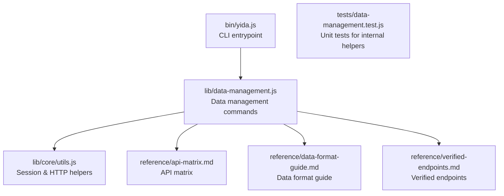
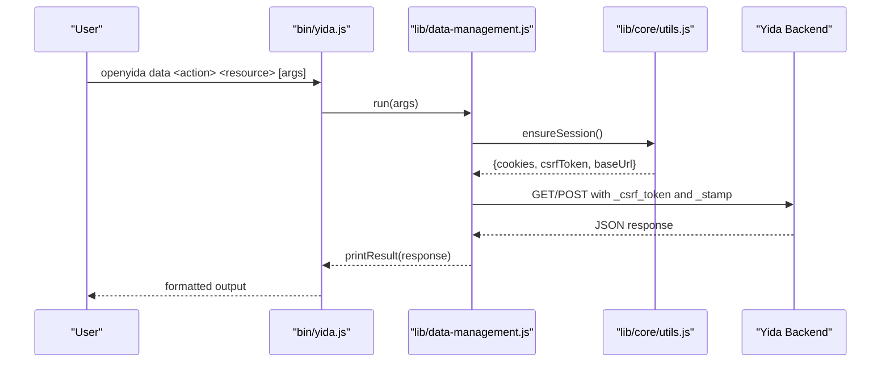
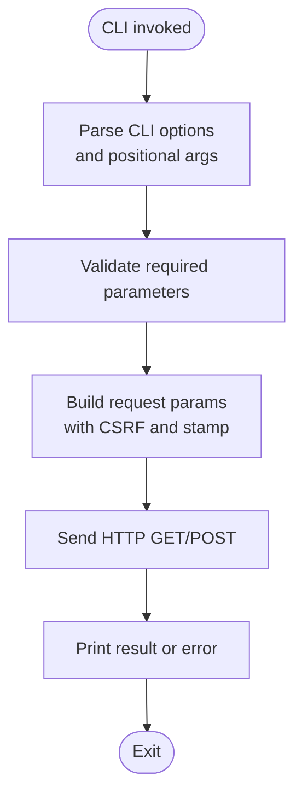
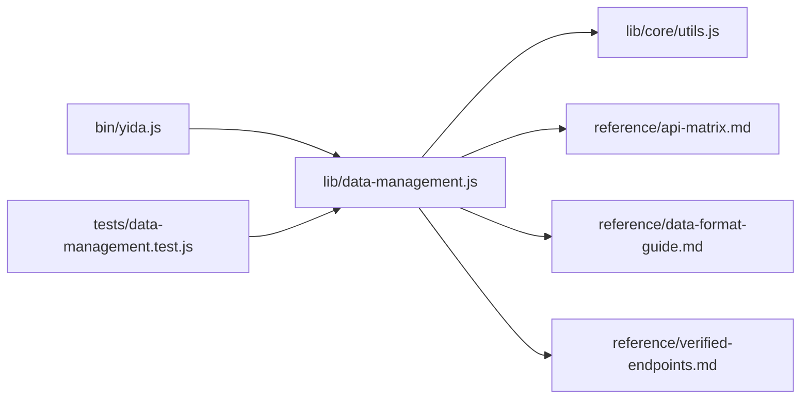

# Data Management Skills

<cite>
**Referenced Files in This Document**
- [lib/data-management.js](file://lib/data-management.js)
- [bin/yida.js](file://bin/yida.js)
- [yida-skills/skills/yida-data-management/SKILL.md](file://yida-skills/skills/yida-data-management/SKILL.md)
- [yida-skills/skills/yida-data-management/reference/api-matrix.md](file://yida-skills/skills/yida-data-management/reference/api-matrix.md)
- [yida-skills/skills/yida-data-management/reference/data-format-guide.md](file://yida-skills/skills/yida-data-management/reference/data-format-guide.md)
- [yida-skills/skills/yida-data-management/reference/verified-endpoints.md](file://yida-skills/skills/yida-data-management/reference/verified-endpoints.md)
- [tests/data-management.test.js](file://tests/data-management.test.js)
- [lib/core/utils.js](file://lib/core/utils.js)
</cite>

## Table of Contents
1. [Introduction](#introduction)
2. [Project Structure](#project-structure)
3. [Core Components](#core-components)
4. [Architecture Overview](#architecture-overview)
5. [Detailed Component Analysis](#detailed-component-analysis)
6. [Dependency Analysis](#dependency-analysis)
7. [Performance Considerations](#performance-considerations)
8. [Troubleshooting Guide](#troubleshooting-guide)
9. [Conclusion](#conclusion)
10. [Appendices](#appendices)

## Introduction
This document describes the data management skills centered on the yida-data-management capability. It explains the unified data operations workflow across forms, processes, and tasks, including query capabilities, filtering mechanisms, pagination, and data manipulation functions. It also documents how the skill connects applications with backend data sources, parameter requirements, integration with form and report systems, and its role in the data-driven application development workflow. The content is derived from the CLI implementation, skill documentation, and reference materials included in the repository.

## Project Structure
The data management skill is implemented as a CLI subcommand under the openyida toolchain. The primary entry point is the CLI router, which delegates to the data management module. The skill’s documentation and reference materials are organized under the yida-data-management skill directory.

**Diagram sources**
- [bin/yida.js:326-335](file://bin/yida.js#L326-L335)
- [lib/data-management.js:1-363](file://lib/data-management.js#L1-L363)
- [lib/core/utils.js:1-200](file://lib/core/utils.js#L1-L200)
- [yida-skills/skills/yida-data-management/reference/api-matrix.md:1-50](file://yida-skills/skills/yida-data-management/reference/api-matrix.md#L1-L50)
- [yida-skills/skills/yida-data-management/reference/data-format-guide.md:1-74](file://yida-skills/skills/yida-data-management/reference/data-format-guide.md#L1-L74)
- [yida-skills/skills/yida-data-management/reference/verified-endpoints.md:1-63](file://yida-skills/skills/yida-data-management/reference/verified-endpoints.md#L1-L63)
- [tests/data-management.test.js:1-218](file://tests/data-management.test.js#L1-L218)

**Section sources**
- [bin/yida.js:29-335](file://bin/yida.js#L29-L335)
- [lib/data-management.js:13-363](file://lib/data-management.js#L13-L363)
- [yida-skills/skills/yida-data-management/SKILL.md:1-302](file://yida-skills/skills/yida-data-management/SKILL.md#L1-L302)

## Core Components
- CLI routing and dispatch: The CLI routes the openyida data command to the data management module.
- Data management module: Implements actions for forms, processes, and tasks, including query, get, create, update, subform query, operation records, task execution, and task center queries.
- Session and HTTP helpers: Provides session initialization, CSRF token handling, base URL resolution, and HTTP GET/POST wrappers with auto-login support.
- Reference materials: API matrix, data format guide, and verified endpoints define the interface contracts and data formats.

Key responsibilities:
- Unified CLI surface for data operations across forms, processes, and tasks.
- Parameter parsing, validation, and transformation (kebab-to-snake conversion, pagination clamping).
- Request construction with CSRF and stamp headers.
- Output formatting and error handling.

**Section sources**
- [lib/data-management.js:13-363](file://lib/data-management.js#L13-L363)
- [lib/core/utils.js:170-200](file://lib/core/utils.js#L170-L200)
- [yida-skills/skills/yida-data-management/reference/api-matrix.md:1-50](file://yida-skills/skills/yida-data-management/reference/api-matrix.md#L1-L50)
- [yida-skills/skills/yida-data-management/reference/data-format-guide.md:1-74](file://yida-skills/skills/yida-data-management/reference/data-format-guide.md#L1-L74)
- [yida-skills/skills/yida-data-management/reference/verified-endpoints.md:1-63](file://yida-skills/skills/yida-data-management/reference/verified-endpoints.md#L1-L63)

## Architecture Overview
The data management skill follows a layered architecture:
- CLI layer: Parses arguments and dispatches to the appropriate handler.
- Command layer: Validates parameters, constructs requests, and invokes HTTP helpers.
- HTTP layer: Manages session, CSRF, base URL, and performs GET/POST requests.
- Backend layer: Yida APIs for forms, processes, and tasks.

**Diagram sources**
- [bin/yida.js:326-335](file://bin/yida.js#L326-L335)
- [lib/data-management.js:44-60](file://lib/data-management.js#L44-L60)
- [lib/data-management.js:124-136](file://lib/data-management.js#L124-L136)
- [lib/core/utils.js:170-200](file://lib/core/utils.js#L170-L200)

## Detailed Component Analysis

### Unified Data Operations Workflow
The data management module exposes a consistent CLI surface for data operations:
- Forms: query, get, create, update, subform query
- Processes: query, get, create, update, operation records, task execution
- Tasks: query tasks by type (todo, done, submitted, cc)

Each operation validates required parameters, transforms option names (kebab-case to snake_case), builds request parameters with CSRF and stamp, and prints standardized output.

**Diagram sources**
- [lib/data-management.js:62-83](file://lib/data-management.js#L62-L83)
- [lib/data-management.js:103-107](file://lib/data-management.js#L103-L107)
- [lib/data-management.js:114-122](file://lib/data-management.js#L114-L122)
- [lib/data-management.js:124-136](file://lib/data-management.js#L124-L136)
- [lib/data-management.js:138-149](file://lib/data-management.js#L138-L149)

**Section sources**
- [lib/data-management.js:151-334](file://lib/data-management.js#L151-L334)
- [tests/data-management.test.js:49-94](file://tests/data-management.test.js#L49-L94)

### Query Capabilities and Filtering Mechanisms
- Form queries support:
  - List search with pagination and optional filters (searchFieldJson, originatorId, date ranges, dynamicOrder).
  - ID-only listing mode.
  - Single record retrieval by form instance ID.
- Process queries support:
  - List search with pagination and optional filters (searchFieldJson, taskId, instanceStatus, approvedResult, originatorId, date ranges).
  - ID-only listing mode.
  - Single record retrieval by process instance ID.
- Subform queries:
  - Retrieve child table rows by form instance ID and table field ID with pagination.
- Task center queries:
  - Retrieve tasks by type (todo, done, submitted, cc) with pagination and optional keyword.

Filtering and ordering:
- searchFieldJson must be passed as a JSON string.
- dynamicOrder must be passed as a JSON string.
- Date ranges and IDs are supported via dedicated parameters.

Pagination:
- currentPage starts at 1.
- pageSize defaults to 20 for forms and 10 for processes/tasks; clamped to a maximum of 100.

**Section sources**
- [lib/data-management.js:151-179](file://lib/data-management.js#L151-L179)
- [lib/data-management.js:232-248](file://lib/data-management.js#L232-L248)
- [lib/data-management.js:216-230](file://lib/data-management.js#L216-L230)
- [lib/data-management.js:310-334](file://lib/data-management.js#L310-L334)
- [yida-skills/skills/yida-data-management/reference/data-format-guide.md:10-74](file://yida-skills/skills/yida-data-management/reference/data-format-guide.md#L10-L74)
- [yida-skills/skills/yida-data-management/reference/api-matrix.md:5-34](file://yida-skills/skills/yida-data-management/reference/api-matrix.md#L5-L34)

### Data Manipulation Functions
- Create form instance: Requires appType, formUuid, and formDataJson (as a JSON string).
- Update form instance: Requires appType and form instance ID plus updateFormDataJson (as a JSON string). Optional useLatestVersion flag.
- Create process instance: Requires appType, formUuid, processCode, and formDataJson (as a JSON string).
- Update process instance: Requires appType and process instance ID plus updateFormDataJson (as a JSON string).
- Execute task: Requires appType, taskId, processInstanceId, outResult, remark, and optional formDataJson and noExecuteExpressions.

Data format:
- All JSON payloads must be passed as strings.
- Only the fields to update should be included in update payloads.

**Section sources**
- [lib/data-management.js:190-214](file://lib/data-management.js#L190-L214)
- [lib/data-management.js:259-282](file://lib/data-management.js#L259-L282)
- [lib/data-management.js:293-308](file://lib/data-management.js#L293-L308)
- [yida-skills/skills/yida-data-management/reference/data-format-guide.md:30-46](file://yida-skills/skills/yida-data-management/reference/data-format-guide.md#L30-L46)

### Connecting Applications with Backend Data Sources
- Session management: Automatically loads cookies and CSRF token from .cache/cookies.json, triggers login if missing/expired, and resolves base URL.
- Request construction: Adds _api, _mock, _csrf_token, and _stamp to every request.
- HTTP transport: Uses GET/POST wrappers with automatic login retry.

Integration points:
- Form pages and custom pages can leverage the same session and CSRF mechanisms for data operations.
- Connector data sources can be injected via datasource parameters during page creation and accessed from JavaScript code.

**Section sources**
- [lib/data-management.js:44-60](file://lib/data-management.js#L44-L60)
- [lib/data-management.js:114-122](file://lib/data-management.js#L114-L122)
- [lib/data-management.js:124-136](file://lib/data-management.js#L124-L136)
- [lib/core/utils.js:170-200](file://lib/core/utils.js#L170-L200)
- [yida-skills/SKILL.md:245-250](file://yida-skills/SKILL.md#L245-L250)

### Parameter Requirements and Validation
- Required parameters are validated per command; missing parameters cause a structured error message.
- Option names are normalized from kebab-case to snake_case for backend compatibility.
- Pagination values are sanitized and clamped.

Validation examples:
- Form query requires appType and formUuid.
- Form update requires appType and instId.
- Process create requires appType, formUuid, processCode, and dataJson.
- Task execution requires appType, taskId, processInstanceId, outResult, and remark.

**Section sources**
- [lib/data-management.js:97-107](file://lib/data-management.js#L97-L107)
- [lib/data-management.js:109-112](file://lib/data-management.js#L109-L112)
- [lib/data-management.js:85-95](file://lib/data-management.js#L85-L95)
- [yida-skills/skills/yida-data-management/SKILL.md:100-114](file://yida-skills/skills/yida-data-management/SKILL.md#L100-L114)

### Integration with Form and Report Systems
- Forms: The skill operates on form instances and subforms, enabling CRUD operations and subform data retrieval.
- Reports: While not directly implemented here, the skill’s data formats and APIs align with report building and filtering workflows that rely on form data.

Integration patterns:
- Use get-schema to discover field IDs before constructing searchFieldJson.
- Use create/update to populate form data for reports.
- Use query operations to drive report filters and dashboards.

**Section sources**
- [yida-skills/skills/yida-data-management/SKILL.md:251-257](file://yida-skills/skills/yida-data-management/SKILL.md#L251-L257)
- [yida-skills/skills/yida-data-management/reference/api-matrix.md:14-34](file://yida-skills/skills/yida-data-management/reference/api-matrix.md#L14-L34)

### Relationship with Permission Management
- Permission management is handled by separate skills (get-permission and save-permission), which operate on permission packages and roles.
- Data operations performed by this skill are subject to the permissions configured via those skills.

Operational note:
- Ensure that the account used by the CLI has appropriate permissions to perform the desired data operations.

**Section sources**
- [yida-skills/SKILL.md:139-140](file://yida-skills/SKILL.md#L139-L140)
- [lib/permission/get-permission.js:141-179](file://lib/permission/get-permission.js#L141-L179)
- [lib/permission/save-permission.js:68-74](file://lib/permission/save-permission.js#L68-L74)

### Data Format Specifications
- searchFieldJson: Must be a JSON string describing filters.
- formDataJson/updateFormDataJson/dynamicOrder: Must be JSON strings.
- Field value formats vary by component type (text, number, select, multi-select, date, member, department, city, subform).

Implementation guidance:
- Treat CLI-provided JSON as strings and pass them as-is to the backend.
- Use currentPage starting at 1 and pageSize up to 100.

**Section sources**
- [yida-skills/skills/yida-data-management/reference/data-format-guide.md:3-74](file://yida-skills/skills/yida-data-management/reference/data-format-guide.md#L3-L74)
- [yida-skills/skills/yida-data-management/reference/api-matrix.md:35-50](file://yida-skills/skills/yida-data-management/reference/api-matrix.md#L35-L50)

### API Integration Patterns
- All requests include _api, _mock, _csrf_token, and _stamp.
- Base URL is resolved from cookie data; endpoints are constructed under /dingtalk/web/{appType}/v1/...
- Verified endpoints and API matrix provide the canonical interface definitions.

**Section sources**
- [lib/data-management.js:114-122](file://lib/data-management.js#L114-L122)
- [yida-skills/skills/yida-data-management/reference/verified-endpoints.md:1-63](file://yida-skills/skills/yida-data-management/reference/verified-endpoints.md#L1-L63)
- [yida-skills/skills/yida-data-management/reference/api-matrix.md:1-50](file://yida-skills/skills/yida-data-management/reference/api-matrix.md#L1-L50)

### Skill Position in Data-Driven Application Development Workflow
- Pre-requisites: Environment detection, project initialization, and login state.
- Typical workflow:
  - Detect environment and login state.
  - Initialize project directory if needed.
  - Create or update forms/pages.
  - Configure processes and permissions.
  - Use data management to query, create, and update data.
  - Publish pages and verify URLs.

**Section sources**
- [yida-skills/SKILL.md:53-85](file://yida-skills/SKILL.md#L53-L85)
- [yida-skills/SKILL.md:99-122](file://yida-skills/SKILL.md#L99-L122)

## Dependency Analysis
The data management skill depends on:
- CLI router for command dispatch.
- Core utilities for session management and HTTP helpers.
- Reference materials for API contracts and data formats.

**Diagram sources**
- [bin/yida.js:326-335](file://bin/yida.js#L326-L335)
- [lib/data-management.js:1-363](file://lib/data-management.js#L1-L363)
- [lib/core/utils.js:1-200](file://lib/core/utils.js#L1-L200)
- [tests/data-management.test.js:1-218](file://tests/data-management.test.js#L1-L218)

**Section sources**
- [bin/yida.js:326-335](file://bin/yida.js#L326-L335)
- [lib/data-management.js:1-363](file://lib/data-management.js#L1-L363)
- [lib/core/utils.js:1-200](file://lib/core/utils.js#L1-L200)

## Performance Considerations
- Concurrency and rate limits: The skill notes a backend QPS limit of approximately 40 requests per second.
- Pagination: Prefer smaller pageSize values and iterate with currentPage to avoid heavy payloads.
- Payload size: Limit searchFieldJson and dynamicOrder to essential filters to reduce payload sizes.
- Caching: Reuse session cookies and avoid unnecessary repeated logins.

**Section sources**
- [yida-skills/skills/yida-data-management/SKILL.md:284](file://yida-skills/skills/yida-data-management/SKILL.md#L284)

## Troubleshooting Guide
Common issues and resolutions:
- Login/session expired: The session helper triggers login automatically; re-run the command after login.
- Missing required parameters: The CLI prints a structured error indicating which parameters are missing.
- Incorrect JSON format: Ensure searchFieldJson, formDataJson, and dynamicOrder are passed as JSON strings.
- Pagination errors: Use currentPage starting at 1 and pageSize up to 100.
- Mixed form and process endpoints: Do not interchange form and process endpoints; they have different paths and structures.

Verification:
- Use verified endpoints reference to confirm which endpoints are available in the current environment.

**Section sources**
- [lib/data-management.js:32-42](file://lib/data-management.js#L32-L42)
- [lib/data-management.js:85-95](file://lib/data-management.js#L85-L95)
- [yida-skills/skills/yida-data-management/reference/verified-endpoints.md:41-62](file://yida-skills/skills/yida-data-management/reference/verified-endpoints.md#L41-L62)

## Conclusion
The yida-data-management skill provides a unified, CLI-driven interface for interacting with Yida’s data layer across forms, processes, and tasks. It enforces consistent parameter handling, pagination, and data formatting while integrating seamlessly with the broader openyida toolchain. By following the documented patterns and leveraging the reference materials, developers can reliably query, create, update, and manage data within Yida applications.

## Appendices

### API Matrix Summary
- Forms: searchFormDatas, searchFormDataIds, getFormDataById, saveFormData, updateFormData, listTableDataByFormInstIdAndTableId.
- Processes: getInstanceIds, getInstances, getInstanceById, updateInstance, getOperationRecords, executeTask.
- Tasks: getMySubmitInApp, getTodoTasksInApp, getDoneTasksInApp, getNotifyMeTasksInApp.

**Section sources**
- [yida-skills/skills/yida-data-management/reference/api-matrix.md:1-50](file://yida-skills/skills/yida-data-management/reference/api-matrix.md#L1-L50)

### Verified Endpoints Summary
- Forms: searchFormDatas, searchFormDataIds, getFormDataById, saveFormData, updateFormData, listTableDataByFormInstIdAndTableId.
- Processes: startInstance, getInstances, getInstanceIds, getInstanceById, updateInstance, getOperationRecords.
- Tasks: executeTask, getTodoTasksInApp, getDoneTasksInApp, getMySubmitInApp, getNotifyMeTasksInApp.

**Section sources**
- [yida-skills/skills/yida-data-management/reference/verified-endpoints.md:1-63](file://yida-skills/skills/yida-data-management/reference/verified-endpoints.md#L1-L63)