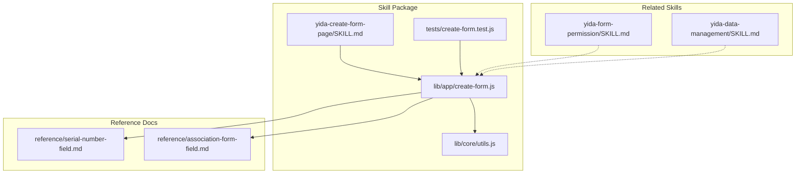
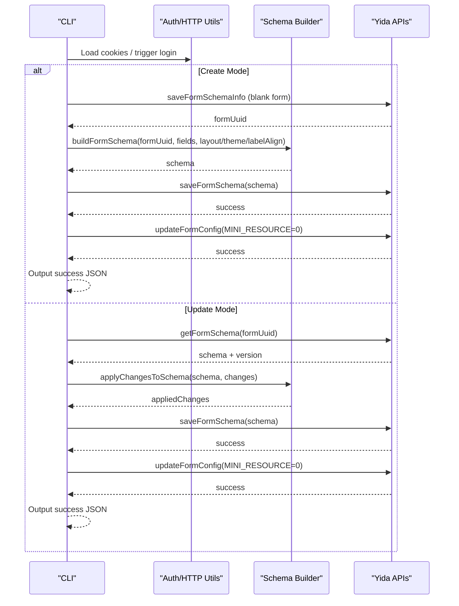
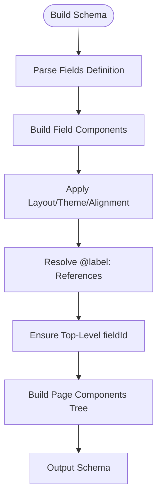
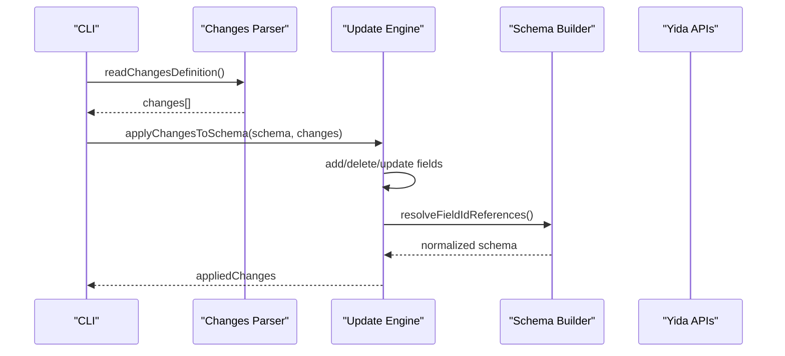
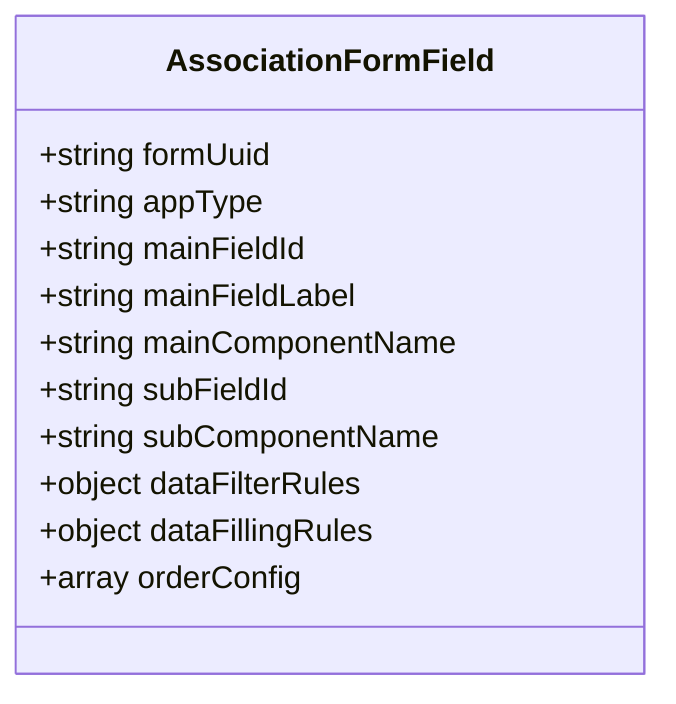
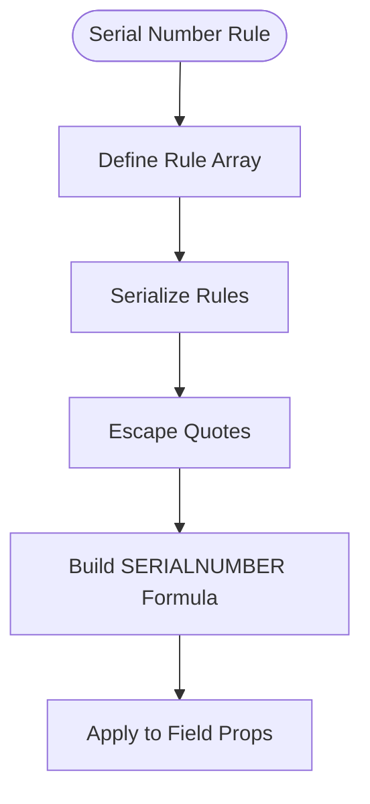
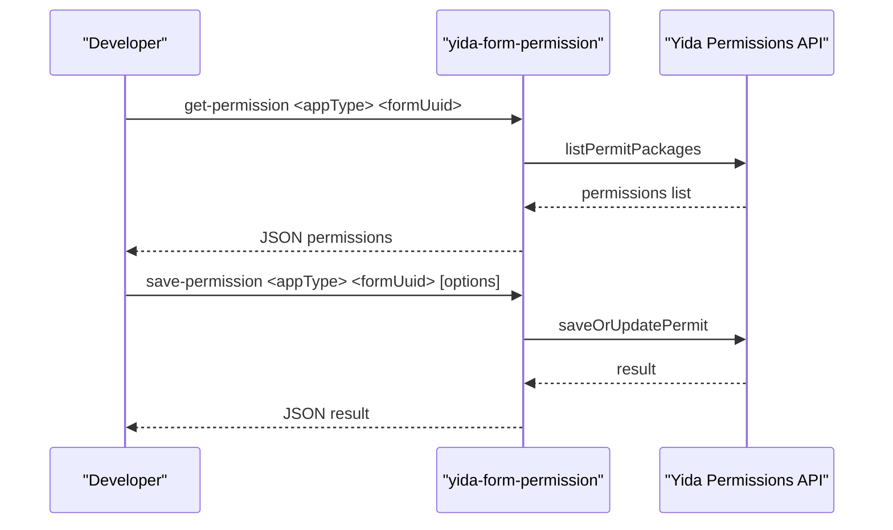
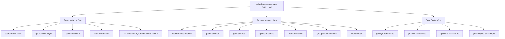
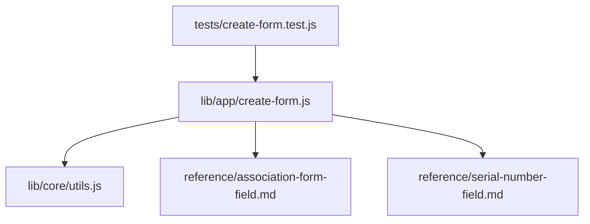

# Form Page Creation Skill

<cite>
**Referenced Files in This Document**
- [SKILL.md](file://yida-skills/skills/yida-create-form-page/SKILL.md)
- [create-form.js](file://lib/app/create-form.js)
- [utils.js](file://lib/core/utils.js)
- [association-form-field.md](file://yida-skills/reference/association-form-field.md)
- [serial-number-field.md](file://yida-skills/reference/serial-number-field.md)
- [yida-form-permission SKILL.md](file://yida-skills/skills/yida-form-permission/SKILL.md)
- [yida-data-management SKILL.md](file://yida-skills/skills/yida-data-management/SKILL.md)
- [create-form.test.js](file://tests/create-form.test.js)
</cite>

## Table of Contents
1. [Introduction](#introduction)
2. [Project Structure](#project-structure)
3. [Core Components](#core-components)
4. [Architecture Overview](#architecture-overview)
5. [Detailed Component Analysis](#detailed-component-analysis)
6. [Dependency Analysis](#dependency-analysis)
7. [Performance Considerations](#performance-considerations)
8. [Troubleshooting Guide](#troubleshooting-guide)
9. [Conclusion](#conclusion)

## Introduction
This document explains the yida-create-form-page skill package for low-code form page creation and updates within the Yida platform. It covers form schema generation, field type definitions, validation rules, page configuration options, integration with application creation, parameter requirements, and the relationship with form permission management. It also provides examples of form creation commands, schema structure requirements, and the connection between form pages and data management operations.

## Project Structure
The yida-create-form-page skill is implemented as a Node.js CLI script that orchestrates Yida form design APIs. It reads field definitions, builds a form schema, saves it via Yida APIs, and updates form configuration. It integrates with shared utilities for authentication and HTTP requests, and references external documentation for advanced field types and permissions.

**Diagram sources**
- [SKILL.md:1-658](file://yida-skills/skills/yida-create-form-page/SKILL.md#L1-L658)
- [create-form.js:1-2445](file://lib/app/create-form.js#L1-L2445)
- [utils.js:1-463](file://lib/core/utils.js#L1-L463)
- [association-form-field.md:1-469](file://yida-skills/reference/association-form-field.md#L1-L469)
- [serial-number-field.md:1-133](file://yida-skills/reference/serial-number-field.md#L1-L133)
- [yida-form-permission SKILL.md:1-207](file://yida-skills/skills/yida-form-permission/SKILL.md#L1-L207)
- [yida-data-management SKILL.md:1-302](file://yida-skills/skills/yida-data-management/SKILL.md#L1-L302)
- [create-form.test.js:1-119](file://tests/create-form.test.js#L1-L119)

**Section sources**
- [SKILL.md:1-658](file://yida-skills/skills/yida-create-form-page/SKILL.md#L1-L658)
- [create-form.js:1-2445](file://lib/app/create-form.js#L1-L2445)

## Core Components
- CLI entry and argument parsing: Parses mode (create/update), parameters, and optional layout/theme/label alignment options.
- Authentication and HTTP utilities: Loads cookies, triggers login if needed, refreshes CSRF tokens, and wraps requests with auto-retry on login expiration.
- Schema builder: Generates form schema from field definitions, applies layout/theme/label alignment, and sets up componentsMap.
- Field builders: Constructs individual field components with defaults, validations, and type-specific properties.
- Update engine: Applies add/delete/update operations to existing schemas, resolves field references, and ensures componentsMap is kept current.
- API orchestration: Calls Yida APIs for creating blank forms, saving schemas, and updating form configuration.

Key capabilities:
- Support for 19 field types including text, numeric, date, selection, employee/department/country selectors, address, attachments/images, table subforms, association forms, and serial number fields.
- Validation rules (e.g., required) and field behaviors (normal/read-only/hidden).
- Layout themes (single/double/card/section), spacing, and label alignment.
- Formula generation for serial number fields using corpId/appType/formUuid/fieldId and rule arrays.

**Section sources**
- [SKILL.md:3-11](file://yida-skills/skills/yida-create-form-page/SKILL.md#L3-L11)
- [create-form.js:92-176](file://lib/app/create-form.js#L92-L176)
- [create-form.js:299-846](file://lib/app/create-form.js#L299-L846)
- [create-form.js:1177-1416](file://lib/app/create-form.js#L1177-L1416)
- [create-form.js:1755-1892](file://lib/app/create-form.js#L1755-L1892)

## Architecture Overview
The skill follows a two-mode workflow: create and update. Both modes rely on a shared authentication layer and a schema builder.

**Diagram sources**
- [create-form.js:2157-2249](file://lib/app/create-form.js#L2157-L2249)
- [create-form.js:2288-2416](file://lib/app/create-form.js#L2288-L2416)
- [utils.js:209-223](file://lib/core/utils.js#L209-L223)
- [utils.js:423-447](file://lib/core/utils.js#L423-L447)

## Detailed Component Analysis

### Field Type Definitions and Defaults
The skill supports 19 field types, each with default properties and optional overrides. Examples include:
- Text and textarea fields with maxLength, clear button, and i18n placeholders.
- Numeric fields with precision, step, thousand separators, and unit suffix.
- Rating, date, cascading date, radio/checkbox, select/multi-select with searchable dropdowns and data sources.
- Employee, department, country selectors with range and multi-selection options.
- Address, attachment, and image fields with upload policies and preview modes.
- Table subforms with paging, actions, and summary controls.
- Association form fields with filtering and data filling rules.
- Serial number fields with customizable rule arrays and formula generation.

Validation rules:
- Required validation is supported for most fields via a validation array containing a "required" rule.
- Serial number fields intentionally exclude required validation and set a formula for automatic generation.

Layout and theme:
- Layout options: single, double, card, section.
- Theme options: default, compact, comfortable.
- Label alignment: top, left, right.

**Section sources**
- [SKILL.md:113-145](file://yida-skills/skills/yida-create-form-page/SKILL.md#L113-L145)
- [SKILL.md:146-427](file://yida-skills/skills/yida-create-form-page/SKILL.md#L146-L427)
- [create-form.js:300-846](file://lib/app/create-form.js#L300-L846)
- [create-form.js:1032-1088](file://lib/app/create-form.js#L1032-L1088)

### Schema Generation and Build Pipeline
The schema builder:
- Collects component names and generates componentsMap entries.
- Builds page structure with RootHeader, RootContent, FormContainer, and optional grouped containers (card/section).
- Applies layout, theme, and label alignment to page props.
- Resolves @label: syntax in association form rules to real fieldIds and normalizes data filling rules.
- Ensures top-level fieldId exists for each field component (required by Yida’s data filling engine).

**Diagram sources**
- [create-form.js:1177-1416](file://lib/app/create-form.js#L1177-L1416)
- [create-form.js:934-1030](file://lib/app/create-form.js#L934-L1030)
- [create-form.js:1874-1890](file://lib/app/create-form.js#L1874-L1890)

**Section sources**
- [create-form.js:848-873](file://lib/app/create-form.js#L848-L873)
- [create-form.js:1177-1416](file://lib/app/create-form.js#L1177-L1416)
- [create-form.js:934-1030](file://lib/app/create-form.js#L934-L1030)

### Update Operations Engine
The update engine:
- Reads changes JSON (add/delete/update).
- Adds new fields with optional positioning (after/before).
- Deletes fields by label.
- Updates field properties (including nested properties for association forms).
- Normalizes and resolves data filling rules and @label: references.
- Ensures componentsMap includes new component types introduced by additions.

**Diagram sources**
- [create-form.js:224-251](file://lib/app/create-form.js#L224-L251)
- [create-form.js:1755-1892](file://lib/app/create-form.js#L1755-L1892)
- [create-form.js:934-1030](file://lib/app/create-form.js#L934-L1030)

**Section sources**
- [create-form.js:1755-1892](file://lib/app/create-form.js#L1755-L1892)
- [create-form.js:1615-1739](file://lib/app/create-form.js#L1615-L1739)

### Association Form Field Configuration
Association form fields enable selecting records from another form and optionally auto-filling fields. The skill supports:
- Basic configuration: formUuid, appType, main/sub field identifiers, and table field selection.
- Data filter rules to restrict selectable records.
- Data filling rules to auto-fill fields upon selection, including sub-table filling rules.
- Automatic normalization and resolution of @label: syntax to fieldIds.

**Diagram sources**
- [association-form-field.md:1-469](file://yida-skills/reference/association-form-field.md#L1-L469)
- [create-form.js:683-747](file://lib/app/create-form.js#L683-L747)
- [create-form.js:888-932](file://lib/app/create-form.js#L888-L932)
- [create-form.js:934-1030](file://lib/app/create-form.js#L934-L1030)

**Section sources**
- [association-form-field.md:1-469](file://yida-skills/reference/association-form-field.md#L1-L469)
- [create-form.js:683-747](file://lib/app/create-form.js#L683-L747)
- [create-form.js:888-1030](file://lib/app/create-form.js#L888-L1030)

### Serial Number Field Rules and Formula
Serial number fields automatically generate unique identifiers. The skill:
- Supports default and custom rule arrays with types like autoCount, character, date, and form.
- Generates formulas using corpId, appType, formUuid, fieldId, and serialized rule arrays.
- Ensures formulas are set for both new and existing serial number fields during updates.

**Diagram sources**
- [serial-number-field.md:1-133](file://yida-skills/reference/serial-number-field.md#L1-L133)
- [create-form.js:749-802](file://lib/app/create-form.js#L749-L802)
- [create-form.js:1190-1210](file://lib/app/create-form.js#L1190-L1210)
- [create-form.js:2251-2286](file://lib/app/create-form.js#L2251-L2286)

**Section sources**
- [serial-number-field.md:1-133](file://yida-skills/reference/serial-number-field.md#L1-L133)
- [create-form.js:749-802](file://lib/app/create-form.js#L749-L802)
- [create-form.js:1190-1210](file://lib/app/create-form.js#L1190-L1210)
- [create-form.js:2251-2286](file://lib/app/create-form.js#L2251-L2286)

### Permission Management Integration
Form permission management is handled by a separate skill that queries and updates permission packages for forms. While not part of the form creation pipeline, it complements form creation by enabling controlled access to form instances.

**Diagram sources**
- [yida-form-permission SKILL.md:47-207](file://yida-skills/skills/yida-form-permission/SKILL.md#L47-L207)

**Section sources**
- [yida-form-permission SKILL.md:1-207](file://yida-skills/skills/yida-form-permission/SKILL.md#L1-L207)

### Data Management Operations
After form creation, data operations are managed by the yida-data-management skill, which provides unified commands for querying, creating, and updating form instances and process instances.

**Diagram sources**
- [yida-data-management SKILL.md:121-188](file://yida-skills/skills/yida-data-management/SKILL.md#L121-L188)

**Section sources**
- [yida-data-management SKILL.md:1-302](file://yida-skills/skills/yida-data-management/SKILL.md#L1-L302)

## Dependency Analysis
The skill depends on:
- Shared authentication utilities for cookie loading, login triggering, CSRF token refresh, and request wrappers.
- Reference documents for advanced field configurations (association forms, serial numbers).
- Test suite validating critical fixes (imports, uniqueness, container nesting).

**Diagram sources**
- [create-form.js:64-66](file://lib/app/create-form.js#L64-L66)
- [utils.js:1-463](file://lib/core/utils.js#L1-L463)
- [association-form-field.md:1-469](file://yida-skills/reference/association-form-field.md#L1-L469)
- [serial-number-field.md:1-133](file://yida-skills/reference/serial-number-field.md#L1-L133)
- [create-form.test.js:1-119](file://tests/create-form.test.js#L1-L119)

**Section sources**
- [create-form.js:64-66](file://lib/app/create-form.js#L64-L66)
- [utils.js:1-463](file://lib/core/utils.js#L1-L463)
- [create-form.test.js:1-119](file://tests/create-form.test.js#L1-L119)

## Performance Considerations
- Unique field ID generation uses a combination of timestamp, incrementing counter, and random suffix to avoid collisions during rapid field creation.
- Schema building avoids redundant FormContainer nesting to prevent component ID conflicts.
- Request wrappers handle automatic CSRF refresh and re-login retries to minimize manual intervention.

[No sources needed since this section provides general guidance]

## Troubleshooting Guide
Common issues and resolutions:
- Login or CSRF token expiration: Requests automatically refresh CSRF tokens or trigger re-login and retry once.
- Missing or invalid cookies: Ensure .cache/cookies.json exists or run login flow.
- Duplicate component IDs: Verify schema does not contain repeated FormContainer nesting; the builder enforces a single root FormContainer.
- Field ID collisions: The generator includes an incrementing counter to ensure uniqueness.
- Schema extraction failures: The update flow validates schema content and falls back to an empty schema template when needed.

**Section sources**
- [utils.js:209-223](file://lib/core/utils.js#L209-L223)
- [utils.js:423-447](file://lib/core/utils.js#L423-L447)
- [create-form.js:1190-1210](file://lib/app/create-form.js#L1190-L1210)
- [create-form.js:1615-1642](file://lib/app/create-form.js#L1615-L1642)
- [create-form.js:2322-2346](file://lib/app/create-form.js#L2322-L2346)
- [create-form.test.js:62-82](file://tests/create-form.test.js#L62-L82)

## Conclusion
The yida-create-form-page skill provides a robust, low-code solution for creating and updating Yida form pages. It supports a comprehensive set of field types, validation rules, layout and theme options, and advanced features like association forms and serial number generation. Its integration with authentication utilities and complementary skills (permissions and data management) enables a complete form lifecycle from creation to data operations.