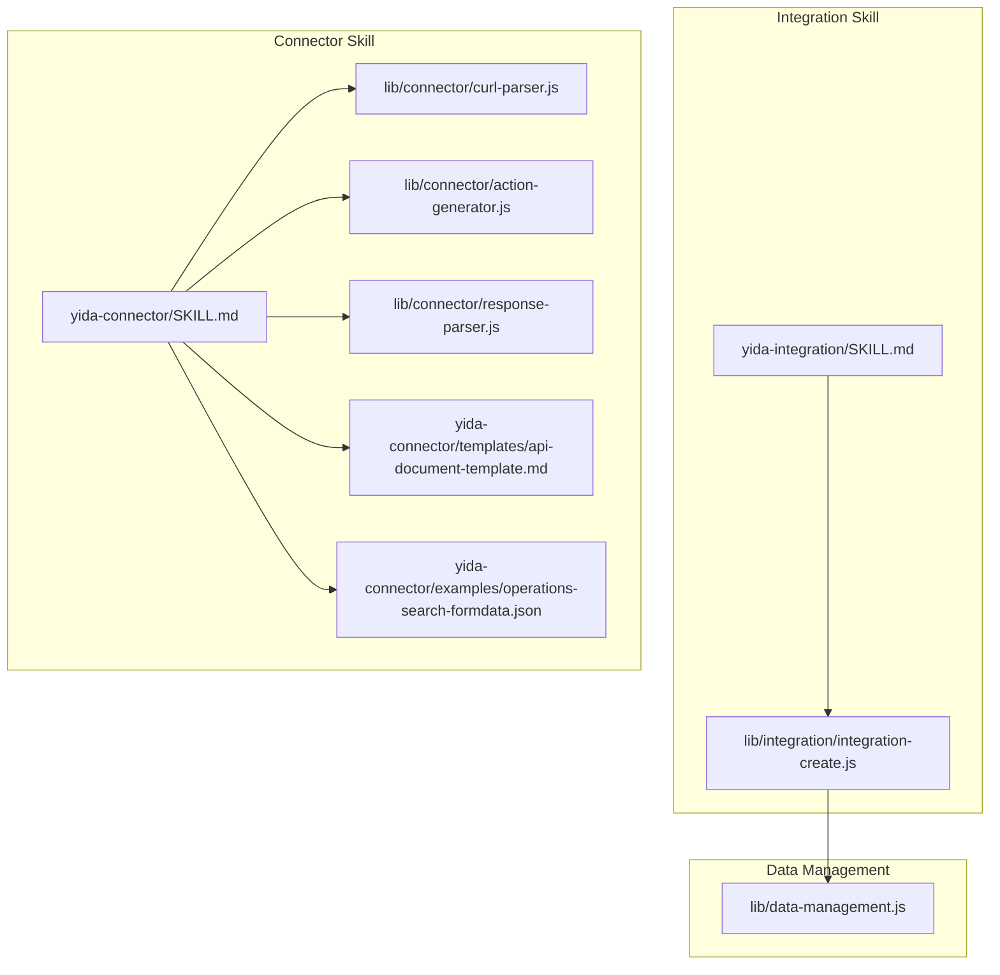
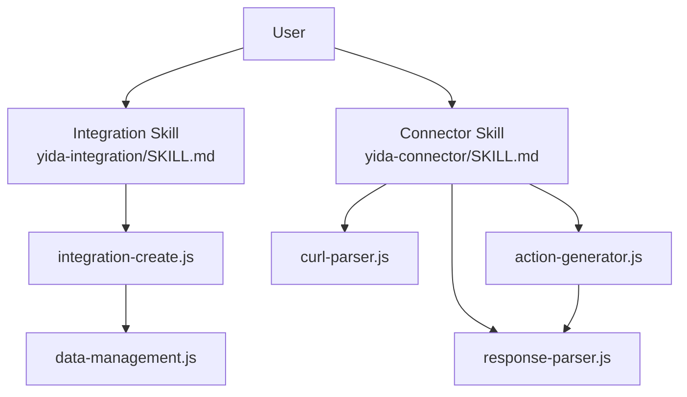
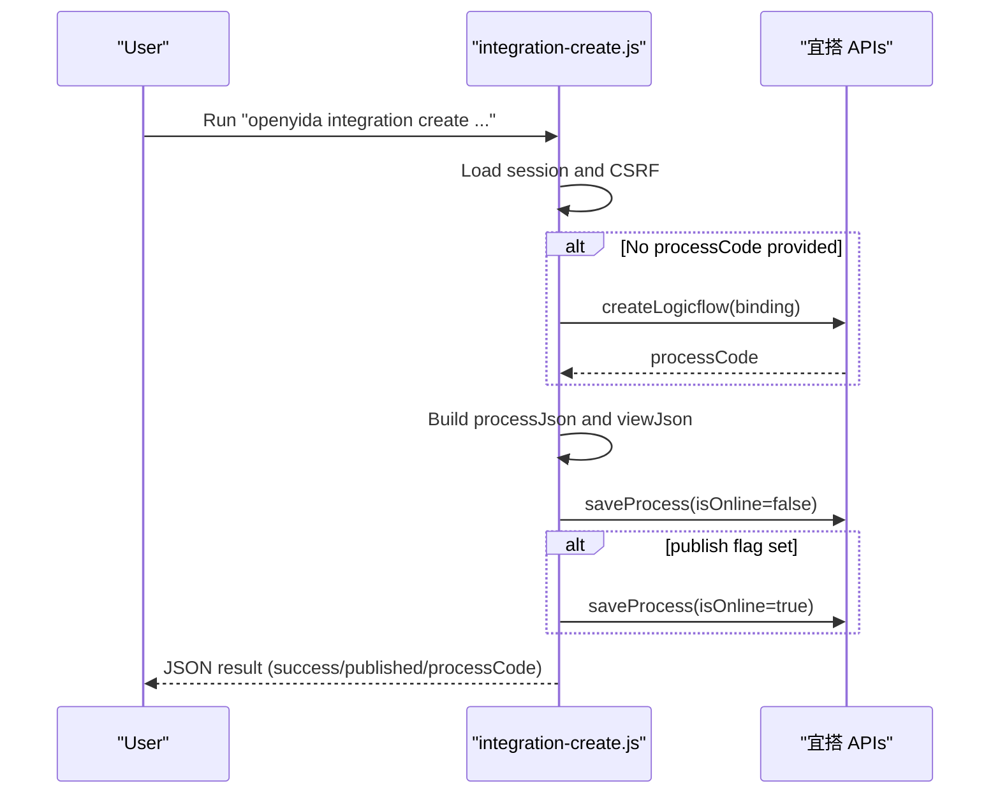
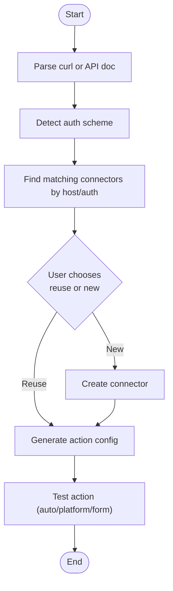
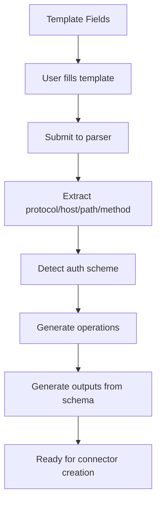
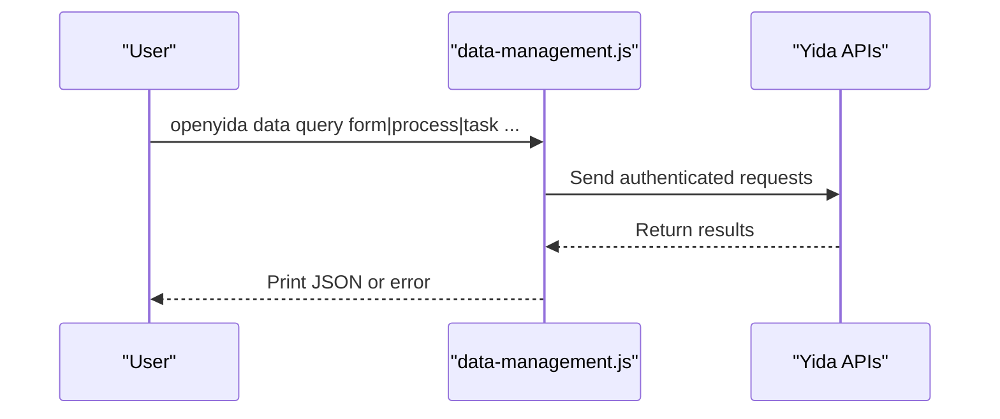
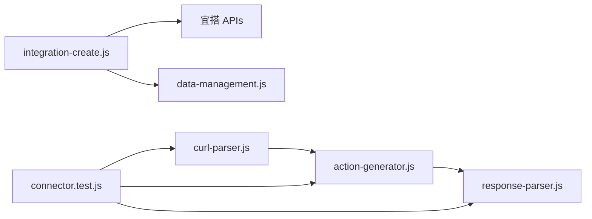

# Integration & Connector Skills

<cite>
**Referenced Files in This Document**
- [SKILL.md](file://yida-skills/skills/yida-integration/SKILL.md)
- [integration-create.js](file://lib/integration/integration-create.js)
- [data-management.js](file://lib/data-management.js)
- [SKILL.md](file://yida-skills/skills/yida-connector/SKILL.md)
- [curl-parser.js](file://lib/connector/curl-parser.js)
- [action-generator.js](file://lib/connector/action-generator.js)
- [response-parser.js](file://lib/connector/response-parser.js)
- [api-document-template.md](file://yida-skills/skills/yida-connector/templates/api-document-template.md)
- [operations-search-formdata.json](file://yida-skills/skills/yida-connector/examples/operations-search-formdata.json)
- [connector.test.js](file://tests/connector.test.js)
</cite>

## Table of Contents
1. [Introduction](#introduction)
2. [Project Structure](#project-structure)
3. [Core Components](#core-components)
4. [Architecture Overview](#architecture-overview)
5. [Detailed Component Analysis](#detailed-component-analysis)
6. [Dependency Analysis](#dependency-analysis)
7. [Performance Considerations](#performance-considerations)
8. [Troubleshooting Guide](#troubleshooting-guide)
9. [Conclusion](#conclusion)
10. [Appendices](#appendices)

## Introduction
This document explains how OpenYida integrates applications with external services via two complementary skill packages:
- Integration & Automation (logic flows) skill for automating actions triggered by form events and orchestrating notifications, data retrieval, updates, and conditional branching.
- HTTP Connector skill for creating, configuring, and testing HTTP connectors to external systems, including smart connector generation from curl or API documentation and robust authentication handling.

It covers HTTP connector creation, external API integration patterns, smart connector generation, API documentation parsing, parameter requirements, testing procedures, and the relationship with data management workflows. It also highlights customization options, authentication handling, and the skill’s contribution to enterprise system integration.

## Project Structure
The relevant parts of the repository are organized around:
- Integration automation skill under yida-skills/skills/yida-integration
- HTTP connector skill under yida-skills/skills/yida-connector
- Shared integration utilities under lib/integration
- Connector parsing and generation utilities under lib/connector
- Data management utilities under lib/data-management.js

**Diagram sources**
- [SKILL.md:1-562](file://yida-skills/skills/yida-integration/SKILL.md#L1-L562)
- [integration-create.js:1-394](file://lib/integration/integration-create.js#L1-L394)
- [SKILL.md:1-517](file://yida-skills/skills/yida-connector/SKILL.md#L1-L517)
- [curl-parser.js:1-123](file://lib/connector/curl-parser.js#L1-L123)
- [action-generator.js:1-253](file://lib/connector/action-generator.js#L1-L253)
- [response-parser.js:1-139](file://lib/connector/response-parser.js#L1-L139)
- [api-document-template.md:1-166](file://yida-skills/skills/yida-connector/templates/api-document-template.md#L1-L166)
- [operations-search-formdata.json:1-185](file://yida-skills/skills/yida-connector/examples/operations-search-formdata.json#L1-L185)
- [data-management.js:1-363](file://lib/data-management.js#L1-L363)

**Section sources**
- [SKILL.md:1-562](file://yida-skills/skills/yida-integration/SKILL.md#L1-L562)
- [integration-create.js:1-394](file://lib/integration/integration-create.js#L1-L394)
- [SKILL.md:1-517](file://yida-skills/skills/yida-connector/SKILL.md#L1-L517)
- [curl-parser.js:1-123](file://lib/connector/curl-parser.js#L1-L123)
- [action-generator.js:1-253](file://lib/connector/action-generator.js#L1-L253)
- [response-parser.js:1-139](file://lib/connector/response-parser.js#L1-L139)
- [api-document-template.md:1-166](file://yida-skills/skills/yida-connector/templates/api-document-template.md#L1-L166)
- [operations-search-formdata.json:1-185](file://yida-skills/skills/yida-connector/examples/operations-search-formdata.json#L1-L185)
- [data-management.js:1-363](file://lib/data-management.js#L1-L363)

## Core Components
- Integration & Automation skill
  - Purpose: Create and publish logic flows that react to form events and orchestrate notifications, data retrieval, updates, and conditional branches.
  - Key capabilities: Trigger on insert/update/delete/comment; optional cross-form data retrieval; optional data creation/update; conditional routing; publish or draft mode.
  - Authentication: Uses宜搭 login session and CSRF token for API calls.
  - Outputs: JSON result indicating success, publish status, processCode, and triggering event types.

- HTTP Connector skill
  - Purpose: Manage HTTP connectors, configure execution actions, manage authentication accounts, and test connectivity.
  - Smart creation: Parse curl commands or API documentation to auto-generate connector configurations.
  - Authentication: Supports multiple schemes (None, BasicAuth, ApiKey, DingTalk Open Platform, Aliyun API Gateway, DingTrustGW).
  - Testing: Provides automated testing against connectors with optional parameters and account selection.

- Data Management utilities
  - Purpose: Provide unified CLI for querying, creating, updating forms and processes, and managing tasks.
  - Integration: Used alongside connectors and integrations to operate on宜搭 data resources.

**Section sources**
- [SKILL.md:1-113](file://yida-skills/skills/yida-integration/SKILL.md#L1-L113)
- [integration-create.js:49-394](file://lib/integration/integration-create.js#L49-L394)
- [SKILL.md:20-68](file://yida-skills/skills/yida-connector/SKILL.md#L20-L68)
- [data-management.js:13-363](file://lib/data-management.js#L13-L363)

## Architecture Overview
The integration and connector skills work together to connect applications with external services:
- Integration skill builds logic flows inside宜搭, optionally invoking HTTP connectors for external API calls.
- Connector skill prepares and validates external API access, enabling seamless integration from within宜搭.

**Diagram sources**
- [SKILL.md:1-562](file://yida-skills/skills/yida-integration/SKILL.md#L1-L562)
- [integration-create.js:1-394](file://lib/integration/integration-create.js#L1-L394)
- [SKILL.md:1-517](file://yida-skills/skills/yida-connector/SKILL.md#L1-L517)
- [curl-parser.js:1-123](file://lib/connector/curl-parser.js#L1-L123)
- [action-generator.js:1-253](file://lib/connector/action-generator.js#L1-L253)
- [response-parser.js:1-139](file://lib/connector/response-parser.js#L1-L139)
- [data-management.js:1-363](file://lib/data-management.js#L1-L363)

## Detailed Component Analysis

### Integration & Automation Skill
- Command: openyida integration create
- Parameters and options:
  - Required: appType, formUuid, flowName
  - Optional: processCode, receivers, title, content, events, data-form-uuid, data-condition, add-data-form-uuid, add-data-assignment, publish
- Behavior:
  - Reads宜搭 login session and CSRF token
  - Creates logicflow binding (if not provided) and generates node IDs
  - Builds process JSON and view JSON for nodes: trigger, optional data retrieval, optional data creation/update, optional message notification, end
  - Saves as draft; optionally publishes immediately
- Node types and structures:
  - Trigger node: form event types and form UUID
  - Message node: recipients, title, content, buttons
  - Data nodes: create/retrieve/update with assignments and conditions
  - Route/Condition container for conditional branching
- Field variable reference:
  - Notification title/content support variable substitution using fieldId-ComponentType format
  - Assignments support processVar, literal, and column (including formulas and upstream node references)

**Diagram sources**
- [integration-create.js:194-394](file://lib/integration/integration-create.js#L194-L394)
- [SKILL.md:103-113](file://yida-skills/skills/yida-integration/SKILL.md#L103-L113)

**Section sources**
- [SKILL.md:15-113](file://yida-skills/skills/yida-integration/SKILL.md#L15-L113)
- [integration-create.js:29-161](file://lib/integration/integration-create.js#L29-L161)
- [integration-create.js:259-394](file://lib/integration/integration-create.js#L259-L394)

### HTTP Connector Skill
- CLI commands:
  - List/connectors, create/update connector, detail, delete
  - Add action to existing connector (smart match)
  - List/create connections (authentication accounts)
  - Smart create: parse curl or API docs, generate template, test
- Smart connector creation (three-stage workflow):
  - Stage 1: Parse curl/API docs to extract protocol, host, path, method, and auth scheme
  - Stage 2: Match existing connectors by host and auth scheme; present choices
  - Stage 3: Generate action configs, meaningful names/descriptions, and test suggestions
- Execution action configuration:
  - Inputs grouped by Headers, Query, Path, Body
  - Parameters synchronized with inputs
  - Responses schema defines outputs with type mapping and example generation
- Authentication schemes:
  - None, BasicAuth, ApiKeyAuth, DingAuth, AliyunApiGateway, DingTrustGW
  - Security schemes and security values mapped per scheme
- Testing:
  - Test connector with action, optional parameters, and selected account
  - Automatic detection of required authentication

**Diagram sources**
- [SKILL.md:239-313](file://yida-skills/skills/yida-connector/SKILL.md#L239-L313)
- [curl-parser.js:10-90](file://lib/connector/curl-parser.js#L10-L90)
- [action-generator.js:103-247](file://lib/connector/action-generator.js#L103-L247)
- [response-parser.js:119-131](file://lib/connector/response-parser.js#L119-L131)

**Section sources**
- [SKILL.md:45-68](file://yida-skills/skills/yida-connector/SKILL.md#L45-L68)
- [SKILL.md:239-313](file://yida-skills/skills/yida-connector/SKILL.md#L239-L313)
- [curl-parser.js:10-90](file://lib/connector/curl-parser.js#L10-L90)
- [action-generator.js:103-247](file://lib/connector/action-generator.js#L103-L247)
- [response-parser.js:119-131](file://lib/connector/response-parser.js#L119-L131)

### API Documentation Parsing and Template Generation
- Template fields:
  - Basic info (name, provider, doc link)
  - Server info (protocol, host, base URL)
  - Authentication (6 schemes supported)
  - Operation list (method, path, parameters, responses)
  - Request example (curl)
- Parser behavior:
  - Extract protocol/host/path/method from curl
  - Detect auth type from headers
  - Filter browser-added headers
  - Generate operation metadata and inputs/parameters
  - Generate outputs from response schema

**Diagram sources**
- [api-document-template.md:1-166](file://yida-skills/skills/yida-connector/templates/api-document-template.md#L1-L166)
- [curl-parser.js:10-90](file://lib/connector/curl-parser.js#L10-L90)
- [action-generator.js:103-247](file://lib/connector/action-generator.js#L103-L247)
- [response-parser.js:119-131](file://lib/connector/response-parser.js#L119-L131)

**Section sources**
- [api-document-template.md:1-166](file://yida-skills/skills/yida-connector/templates/api-document-template.md#L1-L166)
- [connector.test.js:12-139](file://tests/connector.test.js#L12-L139)
- [connector.test.js:367-455](file://tests/connector.test.js#L367-L455)

### Data Management Integration
- The integration skill saves logic flows and can be combined with data operations:
  - Query forms/processes/tasks
  - Create/update forms/processes
  - Execute tasks
- These utilities enable end-to-end workflows where logic flows trigger data operations or external API calls via connectors.

**Diagram sources**
- [data-management.js:124-136](file://lib/data-management.js#L124-L136)
- [data-management.js:151-334](file://lib/data-management.js#L151-L334)

**Section sources**
- [data-management.js:13-363](file://lib/data-management.js#L13-L363)

## Dependency Analysis
- Integration skill depends on:
  - Session management and CSRF token handling
  -宜搭 APIs for logicflow binding and saving process
  - Form schema retrieval for view builder
- Connector skill depends on:
  - Curl parsing and authentication detection
  - Action generation and response schema parsing
  - Template and example action configurations

**Diagram sources**
- [integration-create.js:15-19](file://lib/integration/integration-create.js#L15-L19)
- [data-management.js:1-363](file://lib/data-management.js#L1-L363)
- [action-generator.js:1-253](file://lib/connector/action-generator.js#L1-L253)
- [response-parser.js:1-139](file://lib/connector/response-parser.js#L1-L139)
- [curl-parser.js:1-123](file://lib/connector/curl-parser.js#L1-L123)
- [connector.test.js:1-456](file://tests/connector.test.js#L1-L456)

**Section sources**
- [integration-create.js:15-19](file://lib/integration/integration-create.js#L15-L19)
- [action-generator.js:1-253](file://lib/connector/action-generator.js#L1-L253)
- [response-parser.js:1-139](file://lib/connector/response-parser.js#L1-L139)
- [curl-parser.js:1-123](file://lib/connector/curl-parser.js#L1-L123)
- [connector.test.js:1-456](file://tests/connector.test.js#L1-L456)

## Performance Considerations
- Minimize repeated API calls by reusing sessions and avoiding redundant schema fetches.
- Prefer batch operations where possible; avoid excessive conditional branching in logic flows.
- Use appropriate pagination parameters when querying data to limit payload sizes.
- Keep connector action parameters concise and avoid unnecessary nested structures.

## Troubleshooting Guide
- CSRF token invalid or login expired:
  - The integration skill automatically refreshes tokens or triggers login when encountering specific error codes.
- Missing required parameters:
  - Ensure appType, formUuid, and flowName are provided; verify optional flags like receivers and events.
- Authentication failures:
  - Verify connector authentication accounts and schemes; confirm correct credentials and locations (header vs query).
- Publish failures:
  - The integration skill reports warnings when publishing fails while still saving as draft; review returned messages and publish manually if needed.

**Section sources**
- [SKILL.md:555-562](file://yida-skills/skills/yida-integration/SKILL.md#L555-L562)
- [integration-create.js:318-350](file://lib/integration/integration-create.js#L318-L350)

## Conclusion
OpenYida’s integration and connector skills provide a cohesive framework for enterprise integration:
- The integration skill enables robust automation workflows within宜搭, reacting to form events and orchestrating notifications and data operations.
- The connector skill streamlines HTTP integration by parsing API specs, generating accurate action configurations, and supporting multiple authentication schemes.
- Together with data management utilities, they support end-to-end workflows spanning internal宜搭 resources and external systems.

## Appendices

### Parameter Reference: Integration Skill
- Required
  - appType: Application ID (e.g., APP_XXXX)
  - formUuid: Trigger form UUID (e.g., FORM-XXXX)
  - flowName: Logic flow name
- Optional
  - --process-code: Existing processCode (LPROC-xxx) to reuse
  - --receivers: Comma-separated user IDs for notifications
  - --title: Notification title supporting field variable substitution
  - --content: Notification content supporting field variable substitution
  - --events: Comma-separated event types (insert/update/delete/comment or alias create)
  - --data-form-uuid: Target form UUID for single record retrieval
  - --data-condition: Repeatable; format BFieldId:BFieldName:AFieldId[:ComponentType]
  - --add-data-form-uuid: Target form UUID for data creation
  - --add-data-assignment: Repeatable; format Column:valueType:value
  - --publish: Save and publish immediately

**Section sources**
- [SKILL.md:21-41](file://yida-skills/skills/yida-integration/SKILL.md#L21-L41)

### Parameter Reference: Connector Skill
- Connector management
  - list, create, detail, delete
  - add-action (smart match), list-actions, create-action, delete-action, test
  - list-connections, create-connection
  - smart-create, parse-api, gen-template
- Authentication schemes
  - None, BasicAuth (--username --password), ApiKeyAuth (--api-key-label --api-key-name [--api-key-location QUERY|HEADER])
  - DingTalk Open Platform (--app-key --app-secret)
  - Aliyun API Gateway
  - DingTrustGW (--app-key --app-secret)

**Section sources**
- [SKILL.md:45-68](file://yida-skills/skills/yida-connector/SKILL.md#L45-L68)
- [SKILL.md:34-44](file://yida-skills/skills/yida-connector/SKILL.md#L34-L44)

### Example Workflows
- Integration automation
  - Create a logic flow that notifies users on form insert/update and optionally retrieves cross-form data before notifying.
- Connector creation
  - Use smart-create with a curl command to auto-detect auth and generate action configurations; then test and publish.

**Section sources**
- [SKILL.md:42-70](file://yida-skills/skills/yida-integration/SKILL.md#L42-L70)
- [SKILL.md:267-313](file://yida-skills/skills/yida-connector/SKILL.md#L267-L313)