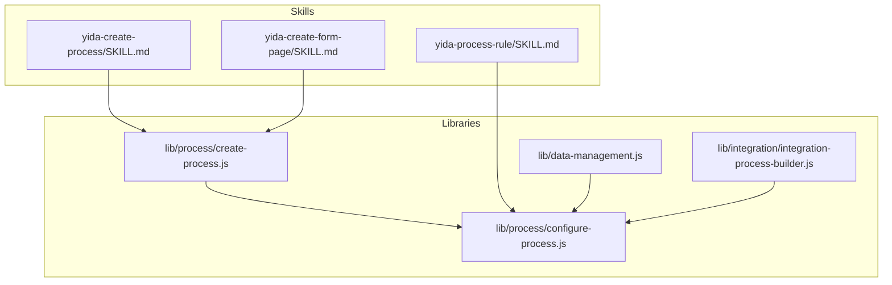
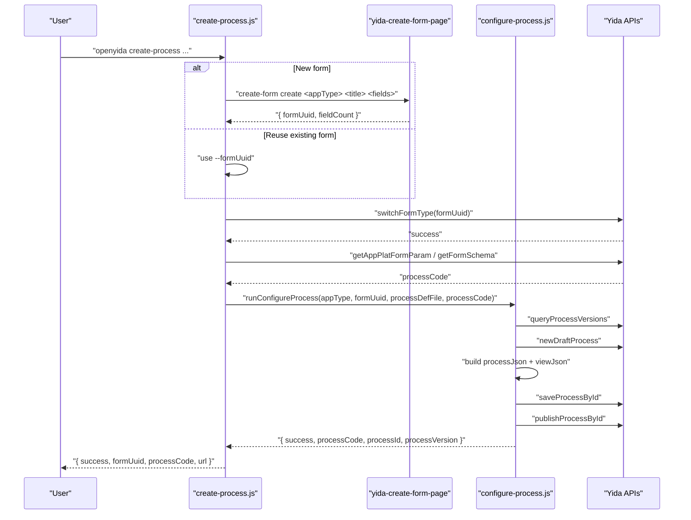
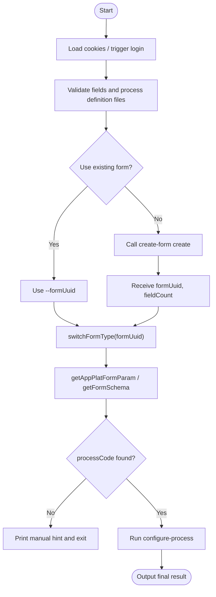
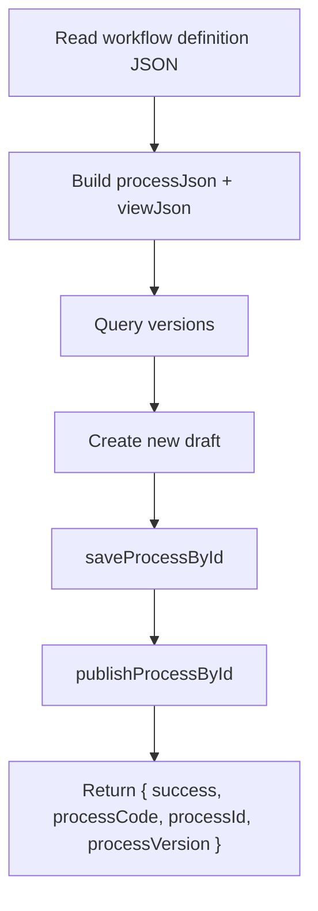
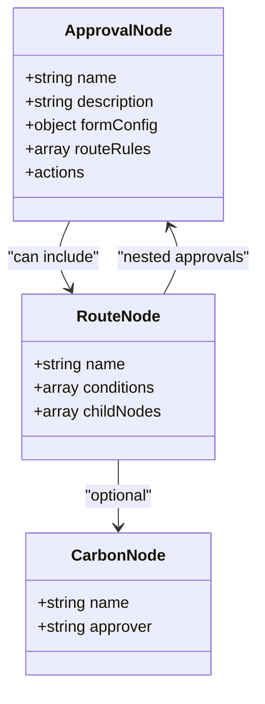
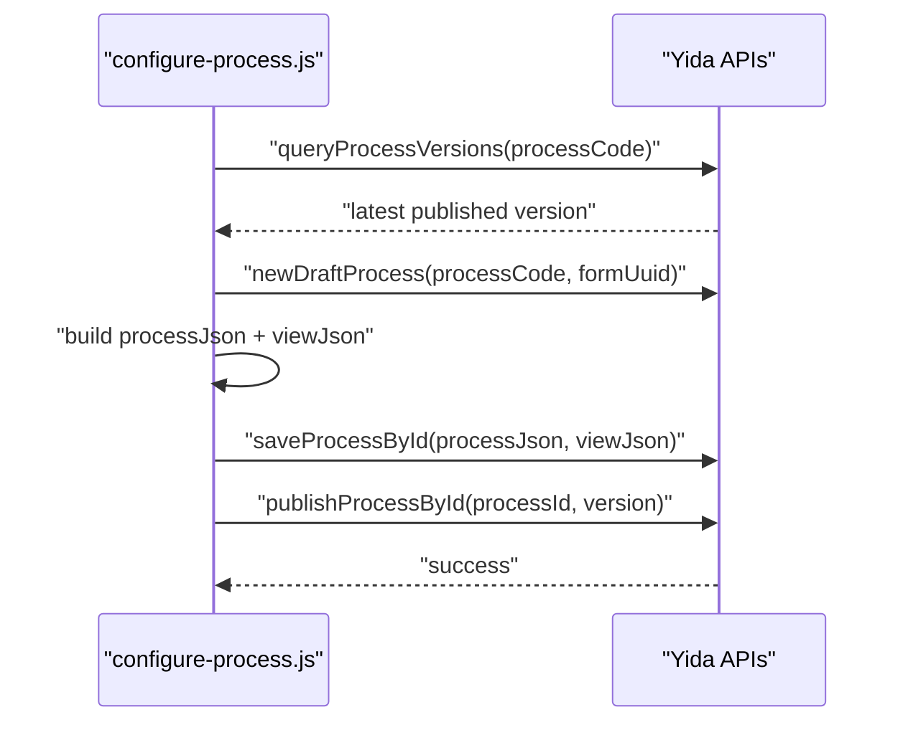
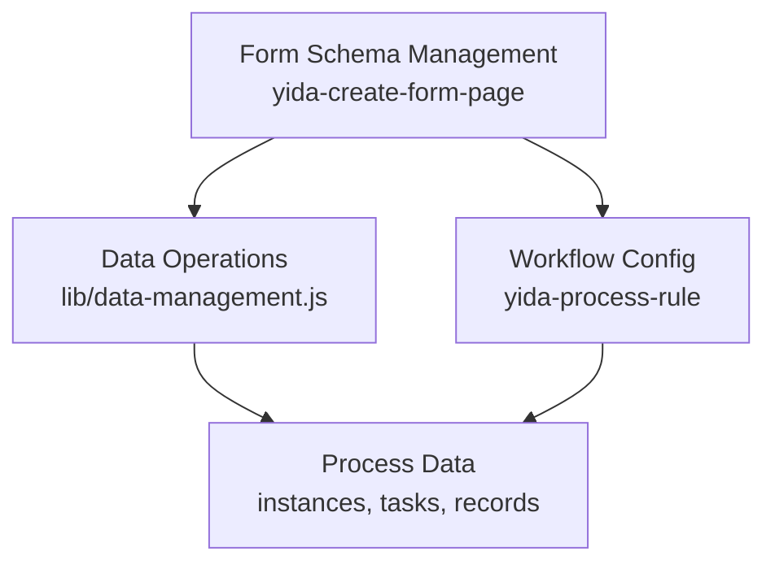
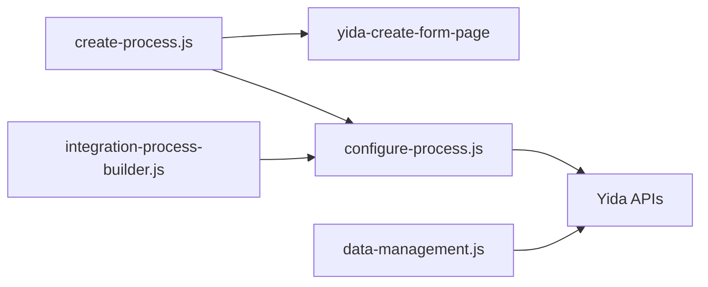

# Process & Workflow Skills

<cite>
**Referenced Files in This Document**
- [yida-create-process/SKILL.md](file://yida-skills/skills/yida-create-process/SKILL.md)
- [create-process.js](file://lib/process/create-process.js)
- [configure-process.js](file://lib/process/configure-process.js)
- [yida-process-rule/SKILL.md](file://yida-skills/skills/yida-process-rule/SKILL.md)
- [yida-create-form-page/SKILL.md](file://yida-skills/skills/yida-create-form-page/SKILL.md)
- [data-management.js](file://lib/data-management.js)
- [integration-process-builder.js](file://lib/integration/integration-process-builder.js)
</cite>

## Table of Contents
1. [Introduction](#introduction)
2. [Project Structure](#project-structure)
3. [Core Components](#core-components)
4. [Architecture Overview](#architecture-overview)
5. [Detailed Component Analysis](#detailed-component-analysis)
6. [Dependency Analysis](#dependency-analysis)
7. [Performance Considerations](#performance-considerations)
8. [Troubleshooting Guide](#troubleshooting-guide)
9. [Conclusion](#conclusion)
10. [Appendices](#appendices)

## Introduction
This document explains the process and workflow capabilities centered around the yida-create-process skill and related orchestration components. It covers:
- How to create and publish workflows for forms in one step or in two steps (recommended)
- How to define approval mechanisms, multi-step approvals, conditions, and routing rules
- How to configure field permissions per approval node
- How to integrate with form creation and data management
- How to relate workflow configuration to permission and form schemas
- Practical examples and troubleshooting tips

The goal is to help both developers and product practitioners automate enterprise workflows efficiently using宜搭 (Yida) skills and APIs.

## Project Structure
The relevant modules for process and workflow automation are organized under:
- yida-skills/skills/yida-create-process: end-to-end process creation skill
- lib/process: core process orchestration and configuration logic
- yida-skills/skills/yida-process-rule: workflow rule configuration skill
- yida-skills/skills/yida-create-form-page: form creation skill
- lib/data-management.js: form and process data operations
- lib/integration/integration-process-builder.js: optional integration builder for logical flow nodes

**Diagram sources**
- [yida-create-process/SKILL.md](file://yida-skills/skills/yida-create-process/SKILL.md)
- [create-process.js](file://lib/process/create-process.js)
- [configure-process.js](file://lib/process/configure-process.js)
- [yida-process-rule/SKILL.md](file://yida-skills/skills/yida-process-rule/SKILL.md)
- [yida-create-form-page/SKILL.md](file://yida-skills/skills/yida-create-form-page/SKILL.md)
- [data-management.js](file://lib/data-management.js)
- [integration-process-builder.js](file://lib/integration/integration-process-builder.js)

**Section sources**
- [yida-create-process/SKILL.md](file://yida-skills/skills/yida-create-process/SKILL.md)
- [create-process.js](file://lib/process/create-process.js)
- [configure-process.js](file://lib/process/configure-process.js)
- [yida-process-rule/SKILL.md](file://yida-skills/skills/yida-process-rule/SKILL.md)
- [yida-create-form-page/SKILL.md](file://yida-skills/skills/yida-create-form-page/SKILL.md)
- [data-management.js](file://lib/data-management.js)
- [integration-process-builder.js](file://lib/integration/integration-process-builder.js)

## Core Components
- yida-create-process: Orchestrates end-to-end creation of a process-enabled form and publishes the workflow in one or two steps.
- yida-process-rule: Converts a declarative workflow definition into宜搭’s internal processJson/viewJson and publishes the process.
- yida-create-form-page: Creates or updates form schemas and returns formUuid and field metadata.
- lib/process/create-process.js: Implements the end-to-end flow, including form creation, switching to process form, processCode retrieval, and delegating to the configuration step.
- lib/process/configure-process.js: Builds processJson and viewJson from a workflow definition, manages versions, drafts, saves, and publishes.
- lib/data-management.js: Provides unified CLI commands for querying, creating, updating, and managing form and process instances and tasks.
- integration-process-builder.js: Optional builder for logical flow nodes (e.g., data retrieval, create assignments, notifications) used in integrations.

**Section sources**
- [yida-create-process/SKILL.md](file://yida-skills/skills/yida-create-process/SKILL.md)
- [create-process.js](file://lib/process/create-process.js)
- [configure-process.js](file://lib/process/configure-process.js)
- [yida-process-rule/SKILL.md](file://yida-skills/skills/yida-process-rule/SKILL.md)
- [yida-create-form-page/SKILL.md](file://yida-skills/skills/yida-create-form-page/SKILL.md)
- [data-management.js](file://lib/data-management.js)
- [integration-process-builder.js](file://lib/integration/integration-process-builder.js)

## Architecture Overview
The yida-create-process skill integrates three major steps:
1. Create or reuse a form (formUuid)
2. Switch the form to a process-enabled form
3. Configure and publish the workflow using the workflow definition

**Diagram sources**
- [create-process.js](file://lib/process/create-process.js)
- [configure-process.js](file://lib/process/configure-process.js)
- [yida-create-process/SKILL.md](file://yida-skills/skills/yida-create-process/SKILL.md)
- [yida-process-rule/SKILL.md](file://yida-skills/skills/yida-process-rule/SKILL.md)
- [yida-create-form-page/SKILL.md](file://yida-skills/skills/yida-create-form-page/SKILL.md)

## Detailed Component Analysis

### yida-create-process: End-to-End Process Creation
- Purpose: Automate “create form → switch to process → get processCode → configure and publish” into a single command or a recommended two-step flow.
- Two usage modes:
  - Create new form + switch + configure
  - Reuse existing formUuid + switch + configure
- Key behaviors:
  - Reads login cookies, triggers login if needed
  - Validates input files
  - Invokes form creation via child process
  - Switches form type to process
  - Retrieves processCode from platform parameters or form schema
  - Delegates to configure-process for building and publishing

**Diagram sources**
- [create-process.js](file://lib/process/create-process.js)
- [yida-create-process/SKILL.md](file://yida-skills/skills/yida-create-process/SKILL.md)

**Section sources**
- [yida-create-process/SKILL.md](file://yida-skills/skills/yida-create-process/SKILL.md)
- [create-process.js](file://lib/process/create-process.js)

### yida-process-rule: Workflow Rule Definition and Publishing
- Purpose: Convert a declarative workflow definition into宜搭’s internal processJson and viewJson, then save and publish.
- Supported node types:
  - Approval nodes
  - Route (conditions) with nested branches
  - Carbon (notification) nodes
- Advanced features:
  - Field permissions per node (behaviorList)
  - Route rules for approvals (e.g., jump back on disagreement)
  - Auto-generation of permissions and route rules when conditions are met
- Versioning:
  - Queries existing versions
  - Creates a new draft
  - Saves and publishes the process

**Diagram sources**
- [configure-process.js](file://lib/process/configure-process.js)
- [yida-process-rule/SKILL.md](file://yida-skills/skills/yida-process-rule/SKILL.md)

**Section sources**
- [yida-process-rule/SKILL.md](file://yida-skills/skills/yida-process-rule/SKILL.md)
- [configure-process.js](file://lib/process/configure-process.js)

### Approval Mechanisms and Multi-Step Approvals
- Approval nodes:
  - Approver selection and actions (agree/disagree/save/forward/append/return)
  - Conditional mode and route rules
- Multi-step approvals:
  - Sequential nodes linked by nextId
  - Nested conditions inside route nodes
- Field permissions:
  - behaviorList per node defines editable/read-only/hidden fields
  - Automatically generated when table has ≥3 fields and ≥2 approval nodes

**Diagram sources**
- [configure-process.js](file://lib/process/configure-process.js)
- [yida-process-rule/SKILL.md](file://yida-skills/skills/yida-process-rule/SKILL.md)

**Section sources**
- [configure-process.js](file://lib/process/configure-process.js)
- [yida-process-rule/SKILL.md](file://yida-skills/skills/yida-process-rule/SKILL.md)

### Process Publishing Workflows
- Version discovery and draft creation
- Saving and publishing the process
- Optional customization of detail URLs for DingTalk notifications

**Diagram sources**
- [configure-process.js](file://lib/process/configure-process.js)

**Section sources**
- [configure-process.js](file://lib/process/configure-process.js)

### Integration with Form and Data Management Systems
- Form creation and schema management:
  - Create or update forms with rich field types and layouts
  - Returns formUuid and field metadata for later use
- Data operations:
  - Query, create, update form instances
  - Query, create, update process instances
  - Execute tasks and manage operation records
  - Query tasks (todo/done/submitted/cc)

**Diagram sources**
- [yida-create-form-page/SKILL.md](file://yida-skills/skills/yida-create-form-page/SKILL.md)
- [data-management.js](file://lib/data-management.js)
- [yida-process-rule/SKILL.md](file://yida-skills/skills/yida-process-rule/SKILL.md)

**Section sources**
- [yida-create-form-page/SKILL.md](file://yida-skills/skills/yida-create-form-page/SKILL.md)
- [data-management.js](file://lib/data-management.js)
- [yida-process-rule/SKILL.md](file://yida-skills/skills/yida-process-rule/SKILL.md)

### Permission Management Relationship
- Field permissions are configured per approval node via behaviorList.
- Auto-generated when:
  - Table has ≥3 fields AND
  - Workflow has ≥2 approval nodes
- Permissions ensure:
  - Editable fields match node responsibilities
  - Previous fields are READONLY
  - Future fields are HIDDEN
- Route rules support back/loop scenarios (e.g., disagree → jump back to previous node)

**Section sources**
- [yida-process-rule/SKILL.md](file://yida-skills/skills/yida-process-rule/SKILL.md)
- [configure-process.js](file://lib/process/configure-process.js)

### Examples and Usage Patterns
- Create a new form and configure a simple approval:
  - Use yida-create-process with fields and process definition files
- Reuse an existing form:
  - First create the form to obtain formUuid and field IDs
  - Then use yida-create-process with --formUuid and the process definition
- Configure advanced workflows:
  - Use yida-process-rule with route conditions, nested branches, and field permissions
- Manage instances and tasks:
  - Use data-management commands to query, create, update, and execute tasks

**Section sources**
- [yida-create-process/SKILL.md](file://yida-skills/skills/yida-create-process/SKILL.md)
- [yida-process-rule/SKILL.md](file://yida-skills/skills/yida-process-rule/SKILL.md)
- [data-management.js](file://lib/data-management.js)

## Dependency Analysis
- yida-create-process depends on:
  - yida-create-form-page (for new form creation)
  - yida-process-rule (for workflow configuration and publishing)
  -宜搭 backend APIs for form switching, process code retrieval, and workflow publishing
- yida-process-rule depends on:
  -宜搭 backend APIs for version queries, draft creation, saving, and publishing
  - Form schema availability for field permissions and routing
- data-management provides complementary operations for form and process lifecycle after workflow publication

**Diagram sources**
- [create-process.js](file://lib/process/create-process.js)
- [configure-process.js](file://lib/process/configure-process.js)
- [yida-create-form-page/SKILL.md](file://yida-skills/skills/yida-create-form-page/SKILL.md)
- [yida-process-rule/SKILL.md](file://yida-skills/skills/yida-process-rule/SKILL.md)
- [data-management.js](file://lib/data-management.js)
- [integration-process-builder.js](file://lib/integration/integration-process-builder.js)

**Section sources**
- [create-process.js](file://lib/process/create-process.js)
- [configure-process.js](file://lib/process/configure-process.js)
- [yida-create-form-page/SKILL.md](file://yida-skills/skills/yida-create-form-page/SKILL.md)
- [yida-process-rule/SKILL.md](file://yida-skills/skills/yida-process-rule/SKILL.md)
- [data-management.js](file://lib/data-management.js)
- [integration-process-builder.js](file://lib/integration/integration-process-builder.js)

## Performance Considerations
- Minimize repeated API calls by reusing formUuid and processCode where possible.
- Prefer the two-step flow (create form first, then configure) to avoid redundant form creation.
- Batch operations on form schemas reduce unnecessary round-trips.
- Use appropriate pagination and filtering when querying form/process instances and tasks.

## Troubleshooting Guide
Common issues and resolutions:
- processCode not found:
  - The script prints the formUuid and suggests manually retrieving processCode from the designer URL and using configure-process with the processCode.
- Field IDs unknown before workflow definition:
  - Use the two-step flow: create form to obtain field IDs, then write them into the workflow definition and re-run create-process with --formUuid.
- Switching form type fails:
  - The script detects “already converted” messages and continues; otherwise, it exits with an error.
- Login/session issues:
  - Ensure .cache/cookies.json exists or allow the script to trigger login.

**Section sources**
- [yida-create-process/SKILL.md](file://yida-skills/skills/yida-create-process/SKILL.md)
- [create-process.js](file://lib/process/create-process.js)

## Conclusion
The yida-create-process skill streamlines enterprise workflow automation by combining form creation, process conversion, and workflow publishing into a cohesive flow. Together with yida-process-rule and yida-create-form-page, teams can:
- Define complex multi-step approvals with conditions and routing
- Enforce field-level permissions per node
- Integrate with form schemas and data operations
- Publish and manage workflows reliably

Adopting the recommended two-step flow and leveraging auto-generated configurations ensures robust, maintainable, and permission-aware workflows.

## Appendices

### Parameter Requirements Summary
- yida-create-process:
  - appType, formTitle (when creating), fieldsJsonFile (when creating), --formUuid (when reusing), processDefinitionFile
- yida-process-rule:
  - appType, formUuid, processDefinitionFile, optional processCode
- data-management:
  - Supports form and process CRUD, task execution, and record queries

**Section sources**
- [yida-create-process/SKILL.md](file://yida-skills/skills/yida-create-process/SKILL.md)
- [yida-process-rule/SKILL.md](file://yida-skills/skills/yida-process-rule/SKILL.md)
- [data-management.js](file://lib/data-management.js)