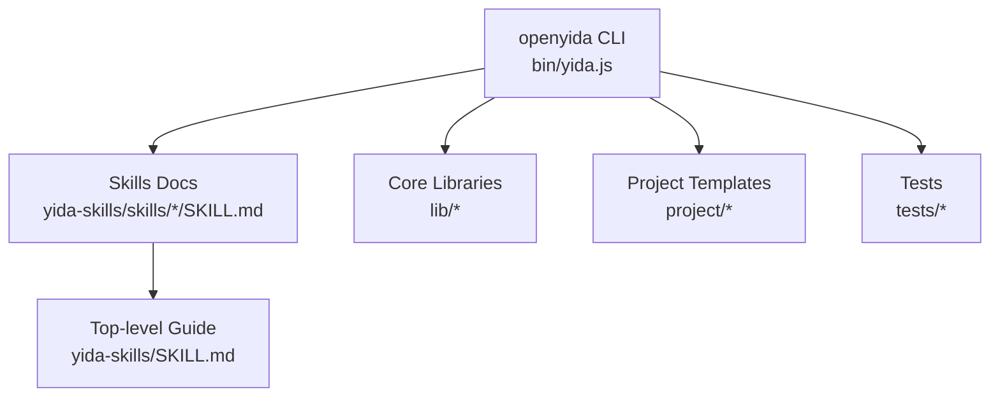
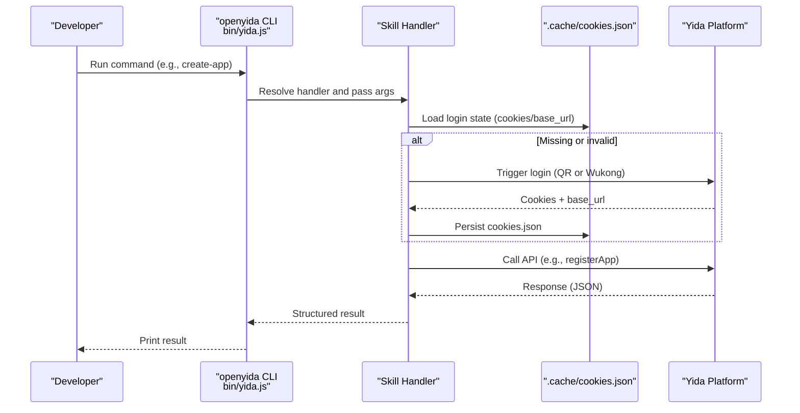
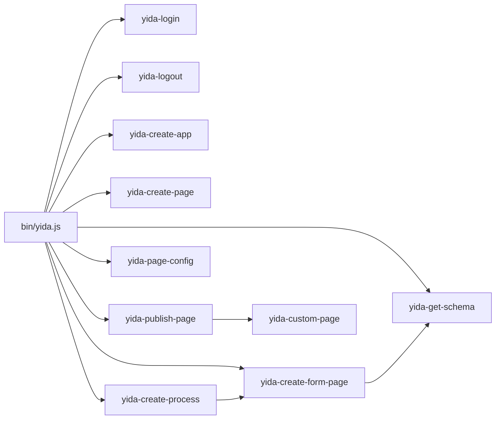

# Skill Packages & Implementation

<cite>
**Referenced Files in This Document**
- [README.md](file://README.md)
- [package.json](file://package.json)
- [bin/yida.js](file://bin/yida.js)
- [yida-skills/SKILL.md](file://yida-skills/SKILL.md)
- [yida-skills/skills/yida-create-app/SKILL.md](file://yida-skills/skills/yida-create-app/SKILL.md)
- [yida-skills/skills/yida-create-form-page/SKILL.md](file://yida-skills/skills/yida-create-form-page/SKILL.md)
- [yida-skills/skills/yida-create-page/SKILL.md](file://yida-skills/skills/yida-create-page/SKILL.md)
- [yida-skills/skills/yida-custom-page/SKILL.md](file://yida-skills/skills/yida-custom-page/SKILL.md)
- [yida-skills/skills/yida-login/SKILL.md](file://yida-skills/skills/yida-login/SKILL.md)
- [yida-skills/skills/yida-logout/SKILL.md](file://yida-skills/skills/yida-logout/SKILL.md)
- [yida-skills/skills/yida-get-schema/SKILL.md](file://yida-skills/skills/yida-get-schema/SKILL.md)
- [yida-skills/skills/yida-create-process/SKILL.md](file://yida-skills/skills/yida-create-process/SKILL.md)
- [yida-skills/skills/yida-page-config/SKILL.md](file://yida-skills/skills/yida-page-config/SKILL.md)
- [yida-skills/skills/yida-publish-page/SKILL.md](file://yida-skills/skills/yida-publish-page/SKILL.md)
</cite>

## Table of Contents
1. [Introduction](#introduction)
2. [Project Structure](#project-structure)
3. [Core Components](#core-components)
4. [Architecture Overview](#architecture-overview)
5. [Detailed Component Analysis](#detailed-component-analysis)
6. [Dependency Analysis](#dependency-analysis)
7. [Performance Considerations](#performance-considerations)
8. [Troubleshooting Guide](#troubleshooting-guide)
9. [Conclusion](#conclusion)
10. [Appendices](#appendices)

## Introduction
This document explains OpenYida’s skill packages and their implementations. It focuses on the available skills such as yida-create-app, yida-create-form-page, yida-custom-page, yida-login, yida-logout, and related development and deployment skills. For each skill, we describe purpose, parameters, usage examples, integration patterns, configuration options, and customization capabilities. We also connect skills to CLI commands, show practical execution flows, and provide guidance for skill development, testing, and contribution.

## Project Structure
OpenYida is a CLI tool centered around the openyida command. Skills are documented under yida-skills/skills/<skill-name>/SKILL.md and orchestrated by the CLI entry point bin/yida.js. The repository includes:
- CLI entrypoint and command routing
- Skill documentation for development and deployment
- Example pages and PRD docs under project/
- Scripts and tests for validation and maintenance

**Diagram sources**
- [bin/yida.js:1-521](file://bin/yida.js#L1-L521)
- [yida-skills/SKILL.md:1-250](file://yida-skills/SKILL.md#L1-L250)

**Section sources**
- [README.md:1-223](file://README.md#L1-L223)
- [package.json:1-74](file://package.json#L1-L74)
- [bin/yida.js:1-521](file://bin/yida.js#L1-L521)

## Core Components
- CLI entrypoint routes commands to skill modules and prints help/version.
- Skills define workflows, parameters, and integration points with the Yida platform APIs.
- Login/Logout skills manage persistent cookies and CSRF tokens.
- Development skills enable form creation, schema inspection, custom page authoring, and publishing.

Key CLI commands and their mapped skills:
- Environment and auth: env, login, logout, auth, org
- App and form management: create-app, create-page, create-form, get-schema, publish
- Page config and sharing: verify-short-url, save-share-config, get-page-config, update-form-config
- Data management, permissions, connectors, reports, and CDNs are supported via dedicated skills

**Section sources**
- [README.md:77-135](file://README.md#L77-L135)
- [bin/yida.js:140-521](file://bin/yida.js#L140-L521)
- [yida-skills/SKILL.md:124-145](file://yida-skills/SKILL.md#L124-L145)

## Architecture Overview
The CLI orchestrates skill execution by parsing arguments and invoking the appropriate handler. Handlers read login state from .cache/cookies.json, call Yida APIs, and produce structured outputs. Skills are self-contained documents describing parameters, flows, and integration points.

**Diagram sources**
- [bin/yida.js:152-512](file://bin/yida.js#L152-L512)
- [yida-skills/skills/yida-login/SKILL.md:95-101](file://yida-skills/skills/yida-login/SKILL.md#L95-L101)

## Detailed Component Analysis

### yida-login
Purpose
- Manage login state with persistent cookies and CSRF token extraction.
- Support standard Playwright-based login and Wukong CDP-based cookie extraction.

Parameters
- Standard login: none (reads config.json for loginUrl).
- Wukong mode: --wukong to extract cookies from Real browser.

Outputs
- JSON with csrf_token, corp_id, user_id, base_url, cookies.

Integration
- Called automatically by other skills when login state is missing/expired.
- Writes to .cache/cookies.json for reuse.

Common errors and handling
- CSRF token expired or login expired: handled by re-login and token refresh.

**Section sources**
- [yida-skills/skills/yida-login/SKILL.md:1-201](file://yida-skills/skills/yida-login/SKILL.md#L1-L201)
- [bin/yida.js:165-184](file://bin/yida.js#L165-L184)

### yida-logout
Purpose
- Clear local cookie cache to invalidate login state.

Usage
- openyida logout

Behavior
- Truncates .cache/cookies.json; next skill invocation triggers login.

**Section sources**
- [yida-skills/skills/yida-logout/SKILL.md:1-59](file://yida-skills/skills/yida-logout/SKILL.md#L1-L59)

### yida-create-app
Purpose
- Create a new Yida application and return appType.

Parameters
- appName (required)
- description (optional)
- icon (optional)
- iconColor (optional)

Output
- JSON with success flag, appType, appName, and admin URL.

Flow
- Read cookies.json; if missing or invalid, trigger login.
- Call registerApp with CSRF token and app metadata.
- Record appType for downstream steps.

**Section sources**
- [yida-skills/skills/yida-create-app/SKILL.md:1-159](file://yida-skills/skills/yida-create-app/SKILL.md#L1-L159)
- [bin/yida.js:243-247](file://bin/yida.js#L243-L247)

### yida-create-page
Purpose
- Create a custom display page (no form fields) and return formUuid.

Parameters
- appType (required)
- pageName (required)

Flow
- Read cookies.json; if missing or invalid, trigger login.
- Call saveFormSchemaInfo with formType=display.
- Record formUuid for publishing.

**Section sources**
- [yida-skills/skills/yida-create-page/SKILL.md:1-126](file://yida-skills/skills/yida-create-page/SKILL.md#L1-L126)

### yida-create-form-page
Purpose
- Create or update a form page with fields and layouts.

Modes
- create: create blank form, save schema, update config.
- update: fetch schema, apply changes, save schema, update config.

Parameters
- create: appType, formTitle, fieldsJsonOrFile, optional layout/theme/label-align
- update: appType, formUuid, changesJsonOrFile

Field types and constraints
- Supports 19+ field types including TextField, SelectField, NumberField, DateField, TableField, SerialNumberField, etc.
- Strict defaults and validation per field type.

Change operations
- add, delete, update with positional hints (after/before) and property updates.

Flow
- Read cookies.json; if missing or invalid, trigger login.
- For create: saveFormSchemaInfo -> build schema -> saveFormSchema -> updateFormConfig.
- For update: getFormSchema -> apply changes -> saveFormSchema -> updateFormConfig.

**Section sources**
- [yida-skills/skills/yida-create-form-page/SKILL.md:1-658](file://yida-skills/skills/yida-create-form-page/SKILL.md#L1-L658)
- [bin/yida.js:255-260](file://bin/yida.js#L255-L260)

### yida-get-schema
Purpose
- Retrieve the full form schema for analysis and field ID discovery.

Parameters
- appType (required)
- formUuid (required)

Output
- Schema JSON to stdout.

Flow
- Read cookies.json; if missing or invalid, trigger login.
- Call getFormSchema and print result.

**Section sources**
- [yida-skills/skills/yida-get-schema/SKILL.md:1-91](file://yida-skills/skills/yida-get-schema/SKILL.md#L1-L91)
- [bin/yida.js:262-266](file://bin/yida.js#L262-L266)

### yida-custom-page
Purpose
- Author custom pages with React 16-compatible JSX and Yida JS APIs.

Constraints
- Single-file component, no imports/exports, no hooks.
- State via _customState + getCustomState/setCustomState + forceUpdate.
- Lifecycle: didMount, didUnmount.
- Render entry: renderJsx with hidden timestamp div to trigger re-render.
- Style via inline style objects; no external CSS.

Publishing
- Use yida-publish-page to compile and deploy.

**Section sources**
- [yida-skills/skills/yida-custom-page/SKILL.md:1-800](file://yida-skills/skills/yida-custom-page/SKILL.md#L1-L800)

### yida-publish-page
Purpose
- Compile JSX to ES5, compress, embed into schema, and publish to Yida.

Parameters
- sourceFile (relative path)
- appType
- formUuid

Flow
- Babel transform + UglifyJS compression.
- Build schema with compiled source.
- Read cookies.json; if missing or invalid, trigger login.
- Call saveFormSchema and updateFormConfig.

**Section sources**
- [yida-skills/skills/yida-publish-page/SKILL.md:1-130](file://yida-skills/skills/yida-publish-page/SKILL.md#L1-L130)
- [bin/yida.js:268-280](file://bin/yida.js#L268-L280)

### yida-create-process
Purpose
- One-step creation of a form plus workflow configuration.

Modes
- New form + process: create fields -> switch to workflow form -> configure process.
- Reuse existing form: --formUuid -> switch to workflow form -> configure process.

Inputs
- fieldsJsonFile (for new form)
- processDefinitionFile (workflow definition)
- --formUuid (for reuse)

Output
- JSON with formUuid, fieldCount, processCode, and URL.

**Section sources**
- [yida-skills/skills/yida-create-process/SKILL.md:1-204](file://yida-skills/skills/yida-create-process/SKILL.md#L1-L204)
- [bin/yida.js:400-409](file://bin/yida.js#L400-L409)

### yida-page-config
Purpose
- Configure public access (/o/xxx) and internal share (/s/xxx) URLs.

Capabilities
- verify-short-url: check availability
- save-share-config: enable/disable and set auth
- get-page-config: query current config
- update-form-config: hide/show top navigation and set title

Constraints
- Pages using Yida form data cannot be published publicly; use internal share (/s/xxx) instead.

**Section sources**
- [yida-skills/skills/yida-page-config/SKILL.md:1-265](file://yida-skills/skills/yida-page-config/SKILL.md#L1-L265)
- [bin/yida.js:282-324](file://bin/yida.js#L282-L324)

## Dependency Analysis
- CLI depends on Node.js runtime and delegates to skill handlers.
- Skills depend on:
  - Persistent login state (.cache/cookies.json)
  - Yida platform APIs (CSRF-protected)
  - Optional Wukong CDP for cookie extraction
- Internal coupling:
  - yida-create-form-page integrates with get-schema for pre-checks.
  - yida-publish-page depends on yida-custom-page authoring rules.
  - yida-create-process depends on yida-create-form-page and workflow rule skills.

**Diagram sources**
- [bin/yida.js:152-512](file://bin/yida.js#L152-L512)
- [yida-skills/SKILL.md:124-145](file://yida-skills/SKILL.md#L124-L145)

**Section sources**
- [bin/yida.js:140-521](file://bin/yida.js#L140-L521)
- [yida-skills/SKILL.md:124-145](file://yida-skills/SKILL.md#L124-L145)

## Performance Considerations
- Prefer reusing existing forms with --formUuid to avoid redundant creation steps.
- Keep field definitions concise; large schemas increase compilation and API payload sizes.
- Avoid unnecessary re-publishing; batch changes and publish once.
- Use update-form-config to toggle navigation rendering to reduce layout overhead.

## Troubleshooting Guide
Common issues and resolutions
- Login invalid or CSRF expired
  - Trigger re-login; scripts auto-handle refresh.
  - For Wukong environments, re-extract cookies via --wukong.
- CorpId mismatch during publish
  - Switch to correct organization or create a new app in the current org.
- JSX compilation errors
  - Follow yida-custom-page “⚠️ JSX 编译错误自查清单”.
  - Avoid class fields, import/export, optional chaining, nullish coalescing.
  - Use arrow functions for event handlers; style uses camelCase.
- Page not publicly accessible
  - If page reads/writes Yida form data, use internal share (/s/xxx) instead of public (/o/xxx).

**Section sources**
- [yida-skills/skills/yida-login/SKILL.md:168-179](file://yida-skills/skills/yida-login/SKILL.md#L168-L179)
- [yida-skills/skills/yida-custom-page/SKILL.md:348-482](file://yida-skills/skills/yida-custom-page/SKILL.md#L348-L482)
- [yida-skills/skills/yida-page-config/SKILL.md:46-64](file://yida-skills/skills/yida-page-config/SKILL.md#L46-L64)

## Conclusion
OpenYida’s skill packages provide a cohesive, CLI-driven workflow for building Yida applications: create app, design forms, author custom pages, and publish. Skills are documented with precise parameters, flows, and integration points. By following the documented constraints—especially around JSX authoring and login state—you can reliably automate development and deployment while leveraging platform APIs safely.

## Appendices

### CLI Commands Reference
- Environment & Auth: env, login, logout, auth, org
- App & Form: create-app, create-page, create-form, get-schema, publish
- Page Config: verify-short-url, save-share-config, get-page-config, update-form-config
- Others: data, doctor, export/import, get/save-permission, connector, create-report/append-chart, cdn-config/upload/refresh

**Section sources**
- [README.md:77-135](file://README.md#L77-L135)
- [bin/yida.js:8-50](file://bin/yida.js#L8-L50)

### Practical Execution Examples
- Create an app and a form page
  - openyida create-app "<AppName>"
  - openyida create-form create APP_XXX "<FormTitle>" fields.json
- Create a custom page and publish
  - openyida create-page APP_XXX "<PageTitle>"
  - Write JSX per yida-custom-page
  - openyida publish pages/src/<file>.js APP_XXX FORM-XXX
- Configure public/internal sharing
  - openyida verify-short-url APP_XXX FORM-XXX /o/myapp
  - openyida save-share-config APP_XXX FORM-XXX /o/myapp y n

**Section sources**
- [yida-skills/skills/yida-create-app/SKILL.md:31-80](file://yida-skills/skills/yida-create-app/SKILL.md#L31-L80)
- [yida-skills/skills/yida-create-form-page/SKILL.md:36-111](file://yida-skills/skills/yida-create-form-page/SKILL.md#L36-L111)
- [yida-skills/skills/yida-create-page/SKILL.md:31-67](file://yida-skills/skills/yida-create-page/SKILL.md#L31-L67)
- [yida-skills/skills/yida-publish-page/SKILL.md:32-53](file://yida-skills/skills/yida-publish-page/SKILL.md#L32-L53)
- [yida-skills/skills/yida-page-config/SKILL.md:72-98](file://yida-skills/skills/yida-page-config/SKILL.md#L72-L98)

### Advanced Patterns
- Skill chaining
  - create-app → create-form → publish
  - create-page → publish
- Conditional execution
  - Use get-schema to discover field IDs before updates.
  - Use verify-short-url to prevent conflicts before saving share config.
- Intelligent orchestration
  - Use yida-create-process to bundle form + workflow creation.
  - Combine update-form-config with page sharing to tailor UX.

**Section sources**
- [yida-skills/SKILL.md:99-122](file://yida-skills/SKILL.md#L99-L122)
- [yida-skills/skills/yida-create-process/SKILL.md:89-107](file://yida-skills/skills/yida-create-process/SKILL.md#L89-L107)
- [yida-skills/skills/yida-page-config/SKILL.md:101-200](file://yida-skills/skills/yida-page-config/SKILL.md#L101-L200)

### Guidelines for Skill Development and Testing
- Document parameters, flows, and outputs in SKILL.md.
- Validate login state handling and error codes.
- Add unit tests for parsing and validation logic.
- Use CI to lint, test, and enforce coverage.

**Section sources**
- [package.json:20-28](file://package.json#L20-L28)
- [README.md:200-203](file://README.md#L200-L203)