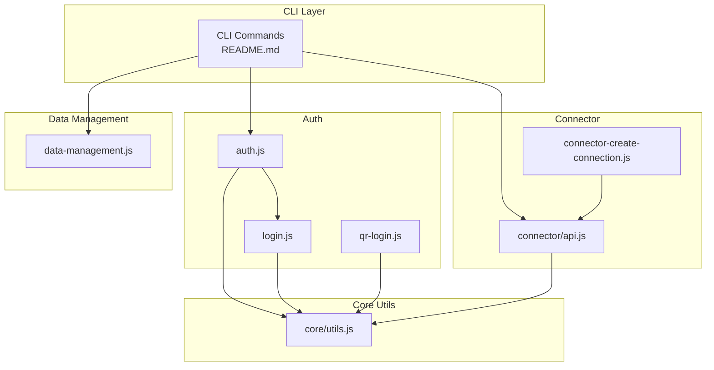
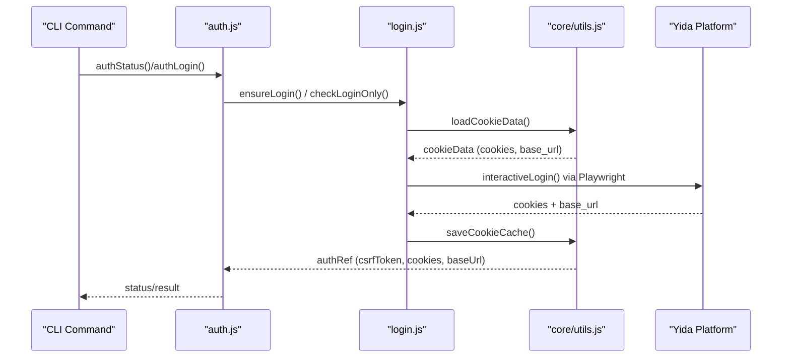
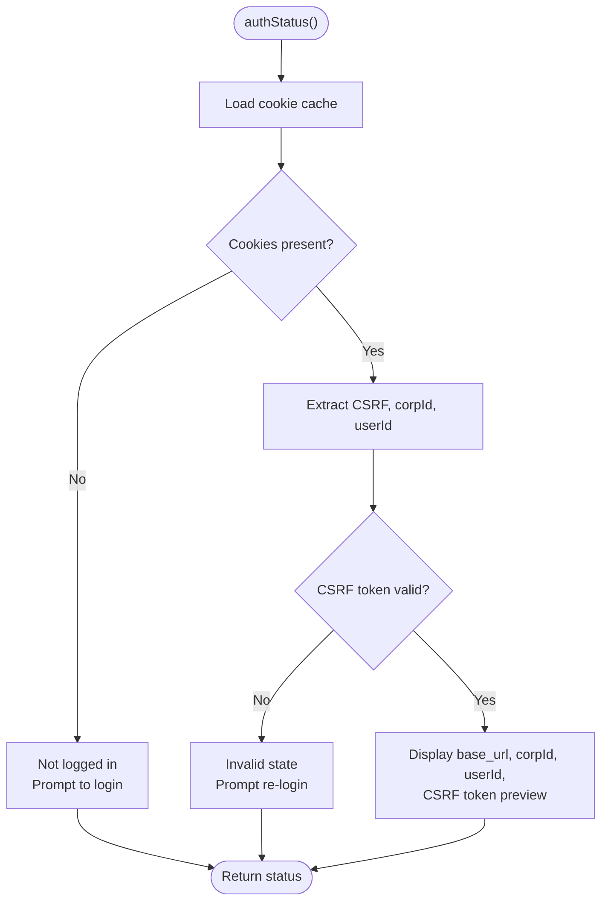
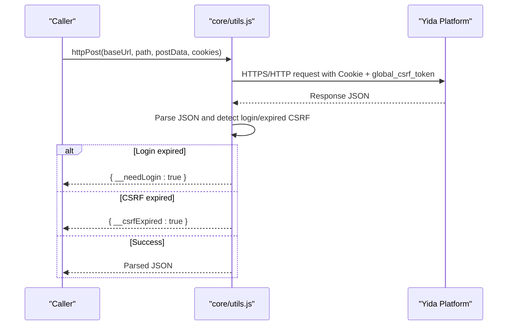
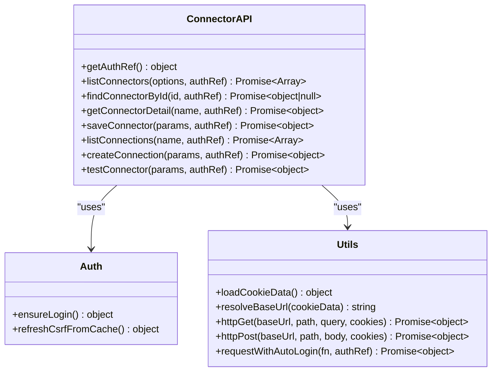
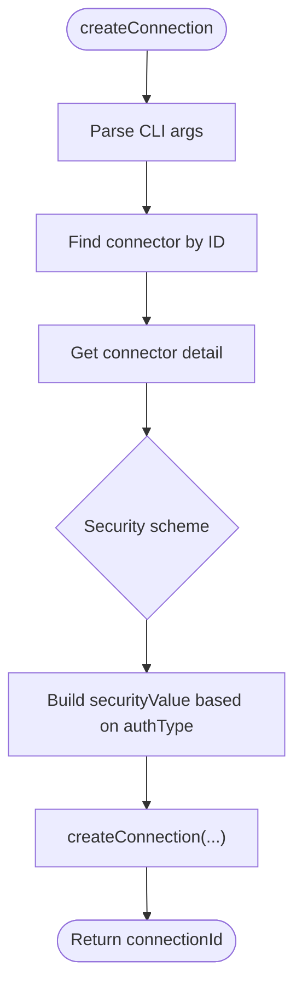
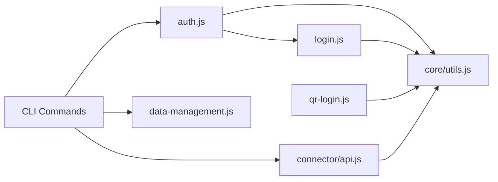

# API Reference & Integration

<cite>
**Referenced Files in This Document**
- [package.json](file://package.json)
- [README.md](file://README.md)
- [lib/core/utils.js](file://lib/core/utils.js)
- [lib/auth/login.js](file://lib/auth/login.js)
- [lib/auth/qr-login.js](file://lib/auth/qr-login.js)
- [lib/auth/auth.js](file://lib/auth/auth.js)
- [lib/connector/api.js](file://lib/connector/api.js)
- [lib/connector/connector-create-connection.js](file://lib/connector/connector-create-connection.js)
- [lib/data-management.js](file://lib/data-management.js)
</cite>

## Table of Contents
1. [Introduction](#introduction)
2. [Project Structure](#project-structure)
3. [Core Components](#core-components)
4. [Architecture Overview](#architecture-overview)
5. [Detailed Component Analysis](#detailed-component-analysis)
6. [Dependency Analysis](#dependency-analysis)
7. [Performance Considerations](#performance-considerations)
8. [Troubleshooting Guide](#troubleshooting-guide)
9. [Conclusion](#conclusion)
10. [Appendices](#appendices)

## Introduction
This document provides a comprehensive API reference and integration guide for OpenYida’s internal APIs and external Yida platform integrations. It explains authentication protocols, connector specifications, HTTP client configurations, request/response schemas, and operational patterns. It also covers advanced topics such as automatic login refresh, CSRF token handling, and robust error handling strategies. Practical usage patterns, troubleshooting steps, and extensibility guidelines are included to help developers integrate and extend OpenYida effectively.

## Project Structure
OpenYida organizes its APIs and utilities primarily under the lib/ directory. Key areas include:
- Authentication utilities and login flows
- Core HTTP utilities and CSRF/login detection
- Connector API wrappers for Yida platform operations
- Data management commands for forms, processes, and tasks
- CLI command surface described in the project README

**Diagram sources**
- [README.md:77-135](file://README.md#L77-L135)
- [lib/auth/auth.js:1-239](file://lib/auth/auth.js#L1-L239)
- [lib/auth/login.js:1-349](file://lib/auth/login.js#L1-L349)
- [lib/auth/qr-login.js:1-617](file://lib/auth/qr-login.js#L1-L617)
- [lib/core/utils.js:1-463](file://lib/core/utils.js#L1-L463)
- [lib/connector/api.js:1-379](file://lib/connector/api.js#L1-L379)
- [lib/connector/connector-create-connection.js:1-174](file://lib/connector/connector-create-connection.js#L1-L174)
- [lib/data-management.js:1-27](file://lib/data-management.js#L1-L27)

**Section sources**
- [README.md:77-135](file://README.md#L77-L135)
- [package.json:1-74](file://package.json#L1-L74)

## Core Components
This section outlines the primary modules that implement internal APIs and external integrations with the Yida platform.

- Authentication and Login
  - Provides login status inspection, QR-based login, and session refresh.
  - Implements cookie extraction, CSRF token detection, and base URL resolution.
- Core HTTP Utilities
  - Encapsulates GET/POST requests with cookie filtering, CSRF header injection, and automatic login/retry handling.
- Connector API Wrapper
  - Offers typed operations for listing/connectors, fetching details, saving connectors, managing connections, and testing actions.
- Data Management CLI
  - Exposes unified commands for querying and mutating forms, processes, and subforms.

**Section sources**
- [lib/auth/auth.js:1-239](file://lib/auth/auth.js#L1-L239)
- [lib/auth/login.js:1-349](file://lib/auth/login.js#L1-L349)
- [lib/auth/qr-login.js:1-617](file://lib/auth/qr-login.js#L1-L617)
- [lib/core/utils.js:1-463](file://lib/core/utils.js#L1-L463)
- [lib/connector/api.js:1-379](file://lib/connector/api.js#L1-L379)
- [lib/data-management.js:1-27](file://lib/data-management.js#L1-L27)

## Architecture Overview
OpenYida’s integration architecture centers on a shared authentication and HTTP utility layer that all CLI commands and connector operations rely upon. The flow below illustrates how authentication is established and reused across operations.

**Diagram sources**
- [lib/auth/auth.js:57-127](file://lib/auth/auth.js#L57-L127)
- [lib/auth/login.js:134-155](file://lib/auth/login.js#L134-L155)
- [lib/auth/login.js:207-313](file://lib/auth/login.js#L207-L313)
- [lib/core/utils.js:170-201](file://lib/core/utils.js#L170-L201)
- [lib/core/utils.js:45-53](file://lib/core/utils.js#L45-L53)

## Detailed Component Analysis

### Authentication and Login APIs
- Purpose: Manage login state, detect expired tokens, and refresh sessions automatically.
- Key functions:
  - authStatus(): Inspect current login state and display base URL, corp ID, user ID, and CSRF token preview.
  - authLogin(): Trigger login (QR or cached) and persist login metadata.
  - authRefresh(): Refresh CSRF token from cache without prompting.
  - authLogout(): Clear persisted auth configuration.
  - ensureLogin(): Prefer cached cookies; otherwise launch browser-based login.
  - refreshCsrfFromCache(): Extract CSRF token from local cache.
  - qrLogin(): Terminal-based QR login flow with polling and organization selection.

**Diagram sources**
- [lib/auth/auth.js:61-127](file://lib/auth/auth.js#L61-L127)
- [lib/core/utils.js:142-160](file://lib/core/utils.js#L142-L160)

**Section sources**
- [lib/auth/auth.js:57-127](file://lib/auth/auth.js#L57-L127)
- [lib/auth/auth.js:137-160](file://lib/auth/auth.js#L137-L160)
- [lib/auth/auth.js:168-210](file://lib/auth/auth.js#L168-L210)
- [lib/auth/auth.js:217-229](file://lib/auth/auth.js#L217-L229)
- [lib/auth/login.js:134-155](file://lib/auth/login.js#L134-L155)
- [lib/auth/login.js:101-126](file://lib/auth/login.js#L101-L126)
- [lib/auth/qr-login.js:499-614](file://lib/auth/qr-login.js#L499-L614)

### Core HTTP Utilities and Request Handling
- Purpose: Provide robust HTTP GET/POST helpers with CSRF-aware headers, cookie filtering, and automatic login/retry.
- Key capabilities:
  - httpGet(baseUrl, requestPath, queryParams, cookies): GET with JSON parsing and CSRF/login detection.
  - httpPost(baseUrl, requestPath, postData, cookies): POST with form-encoded body and CSRF header.
  - requestWithAutoLogin(requestFn, authRef): Transparently refresh CSRF or re-login on expiration.
  - isLoginExpired(responseJson), isCsrfTokenExpired(responseJson): Response validators.
  - resolveBaseUrl(cookieData): Normalize base URL from cookies.

**Diagram sources**
- [lib/core/utils.js:276-341](file://lib/core/utils.js#L276-L341)
- [lib/core/utils.js:351-415](file://lib/core/utils.js#L351-L415)
- [lib/core/utils.js:423-447](file://lib/core/utils.js#L423-L447)

**Section sources**
- [lib/core/utils.js:276-341](file://lib/core/utils.js#L276-L341)
- [lib/core/utils.js:351-415](file://lib/core/utils.js#L351-L415)
- [lib/core/utils.js:423-447](file://lib/core/utils.js#L423-L447)
- [lib/core/utils.js:232-251](file://lib/core/utils.js#L232-L251)
- [lib/core/utils.js:261-264](file://lib/core/utils.js#L261-L264)

### Connector API Wrapper
- Purpose: Encapsulate Yida connector lifecycle operations with automatic authentication and error handling.
- Key operations:
  - getAuthRef(): Build auth reference from cookie cache or trigger login.
  - listConnectors(options, authRef), findConnectorById(id, authRef): Discover connectors.
  - getConnectorDetail(name, authRef): Retrieve connector metadata and security schemes.
  - saveConnector(params, authRef): Create or update connector with operations and security schemes.
  - listConnections(name, authRef), createConnection(params, authRef): Manage connection credentials.
  - testConnector(params, authRef): Execute a connector action with headers, query, and body.

**Diagram sources**
- [lib/connector/api.js:26-38](file://lib/connector/api.js#L26-L38)
- [lib/connector/api.js:180-207](file://lib/connector/api.js#L180-L207)
- [lib/connector/api.js:228-237](file://lib/connector/api.js#L228-L237)
- [lib/connector/api.js:247-284](file://lib/connector/api.js#L247-L284)
- [lib/connector/api.js:294-303](file://lib/connector/api.js#L294-L303)
- [lib/connector/api.js:311-333](file://lib/connector/api.js#L311-L333)
- [lib/connector/api.js:343-362](file://lib/connector/api.js#L343-L362)
- [lib/auth/login.js:134-155](file://lib/auth/login.js#L134-L155)
- [lib/core/utils.js:170-201](file://lib/core/utils.js#L170-L201)
- [lib/core/utils.js:261-264](file://lib/core/utils.js#L261-L264)
- [lib/core/utils.js:142-160](file://lib/core/utils.js#L142-L160)

**Section sources**
- [lib/connector/api.js:26-38](file://lib/connector/api.js#L26-L38)
- [lib/connector/api.js:180-207](file://lib/connector/api.js#L180-L207)
- [lib/connector/api.js:228-237](file://lib/connector/api.js#L228-L237)
- [lib/connector/api.js:247-284](file://lib/connector/api.js#L247-L284)
- [lib/connector/api.js:294-303](file://lib/connector/api.js#L294-L303)
- [lib/connector/api.js:311-333](file://lib/connector/api.js#L311-L333)
- [lib/connector/api.js:343-362](file://lib/connector/api.js#L343-L362)

### Connector Connection Creation
- Purpose: Create and attach secure connection credentials to a connector based on its security scheme.
- Supported auth types:
  - BasicAuth: username/password
  - ApiKeyAuth: token
  - DingAuth: appKey/appSecret
  - AliyunApiGateway: appCode
  - DingTrustGW: appKey/appSecret
- Workflow:
  - Resolve connector by ID
  - Fetch connector detail to determine security scheme
  - Build security value payload
  - Call createConnection with auth type code and security schemes

**Diagram sources**
- [lib/connector/connector-create-connection.js:126-171](file://lib/connector/connector-create-connection.js#L126-L171)
- [lib/connector/connector-create-connection.js:57-92](file://lib/connector/connector-create-connection.js#L57-L92)
- [lib/connector/api.js:228-237](file://lib/connector/api.js#L228-L237)
- [lib/connector/api.js:311-333](file://lib/connector/api.js#L311-L333)

**Section sources**
- [lib/connector/connector-create-connection.js:126-171](file://lib/connector/connector-create-connection.js#L126-L171)
- [lib/connector/connector-create-connection.js:57-92](file://lib/connector/connector-create-connection.js#L57-L92)
- [lib/connector/api.js:228-237](file://lib/connector/api.js#L228-L237)
- [lib/connector/api.js:311-333](file://lib/connector/api.js#L311-L333)

### Data Management Operations
- Purpose: Unified CLI for querying and mutating Yida data entities (forms, processes, tasks).
- Supported commands:
  - data query form, data get form, data create form, data update form
  - data query process, data get process, data create process, data update process
  - data query operation-records, data execute task

These commands internally leverage core HTTP utilities and authentication references to communicate with the Yida platform.

**Section sources**
- [lib/data-management.js:13-27](file://lib/data-management.js#L13-L27)

## Dependency Analysis
OpenYida’s internal APIs exhibit a layered dependency model:
- CLI commands depend on authentication and connector modules.
- Authentication depends on core utilities for cookie loading and base URL resolution.
- Connector API wrapper depends on core utilities for HTTP operations and automatic login handling.
- Data management commands depend on core utilities for HTTP and authentication.

**Diagram sources**
- [README.md:77-135](file://README.md#L77-L135)
- [lib/auth/auth.js:1-239](file://lib/auth/auth.js#L1-L239)
- [lib/auth/login.js:1-349](file://lib/auth/login.js#L1-L349)
- [lib/auth/qr-login.js:1-617](file://lib/auth/qr-login.js#L1-L617)
- [lib/connector/api.js:1-379](file://lib/connector/api.js#L1-L379)
- [lib/core/utils.js:1-463](file://lib/core/utils.js#L1-L463)
- [lib/data-management.js:1-27](file://lib/data-management.js#L1-L27)

**Section sources**
- [README.md:77-135](file://README.md#L77-L135)
- [lib/auth/auth.js:1-239](file://lib/auth/auth.js#L1-L239)
- [lib/connector/api.js:1-379](file://lib/connector/api.js#L1-L379)
- [lib/core/utils.js:1-463](file://lib/core/utils.js#L1-L463)

## Performance Considerations
- Timeout handling: HTTP requests are configured with a 30-second timeout to prevent hanging operations.
- Automatic retries: requestWithAutoLogin transparently refreshes CSRF tokens or re-authenticates when login or CSRF expires, minimizing manual intervention.
- Cookie filtering: Requests send only relevant cookies per target domain to reduce overhead and avoid cross-domain issues.
- Base URL normalization: resolveBaseUrl ensures consistent endpoint construction across environments.

[No sources needed since this section provides general guidance]

## Troubleshooting Guide
Common issues and resolutions:
- No cookie cache or invalid CSRF token
  - Symptom: authStatus reports “not logged in” or “no CSRF token.”
  - Resolution: Run auth login or qr login to establish a session; confirm base_url and CSRF token are present.
- Login expired during request
  - Symptom: Responses indicate login errors.
  - Resolution: requestWithAutoLogin triggers re-login automatically; ensure network connectivity and retry.
- CSRF token expired
  - Symptom: Responses indicate CSRF failure.
  - Resolution: requestWithAutoLogin refreshes CSRF from cache; retry the request.
- Connector creation fails
  - Symptom: Missing required auth parameters or unsupported auth type.
  - Resolution: Verify authType matches supported schemes and required fields are provided; check connector detail security schemes.

**Section sources**
- [lib/core/utils.js:232-251](file://lib/core/utils.js#L232-L251)
- [lib/core/utils.js:423-447](file://lib/core/utils.js#L423-L447)
- [lib/auth/auth.js:61-127](file://lib/auth/auth.js#L61-L127)
- [lib/connector/connector-create-connection.js:57-92](file://lib/connector/connector-create-connection.js#L57-L92)

## Conclusion
OpenYida’s internal APIs provide a cohesive foundation for authenticating with the Yida platform, issuing HTTP requests with CSRF awareness, and managing connectors and data. The documented patterns enable reliable integrations, robust error handling, and straightforward extensibility for new connector actions and custom endpoints.

[No sources needed since this section summarizes without analyzing specific files]

## Appendices

### API Usage Patterns and Examples
- Authentication
  - Check login status: openyida auth status
  - Login with QR: openyida auth login
  - Refresh session: openyida auth refresh
- Connectors
  - List connectors: openyida connector list
  - Create connection: openyida connector create-connection <connector-id> <connection-name> [options]
  - Test action: openyida connector test
- Data Management
  - Query form instances: openyida data query form ...
  - Execute task: openyida data execute task ...

**Section sources**
- [README.md:77-135](file://README.md#L77-L135)

### Security Considerations and Compliance
- Authentication mechanisms:
  - Cookie-based session with CSRF protection
  - QR-based login with browser automation
  - Organization switching with explicit consent
- Best practices:
  - Store credentials securely; avoid exposing tokens in logs
  - Use HTTPS endpoints and validate base URLs
  - Limit exposure of sensitive fields in CLI outputs

**Section sources**
- [lib/auth/qr-login.js:499-614](file://lib/auth/qr-login.js#L499-L614)
- [lib/core/utils.js:261-264](file://lib/core/utils.js#L261-L264)