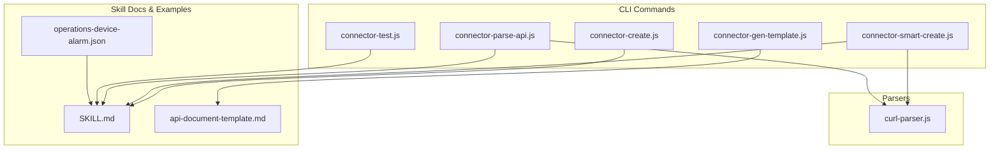
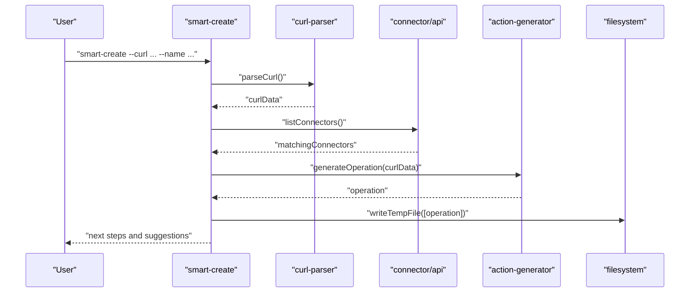
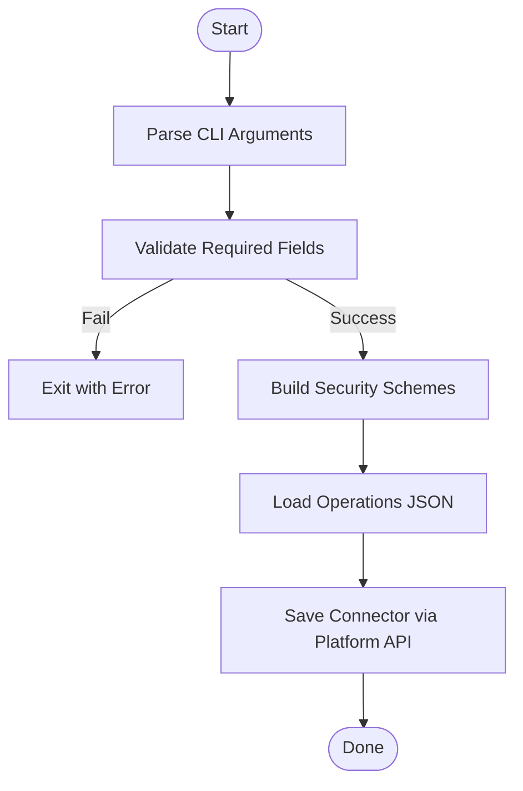
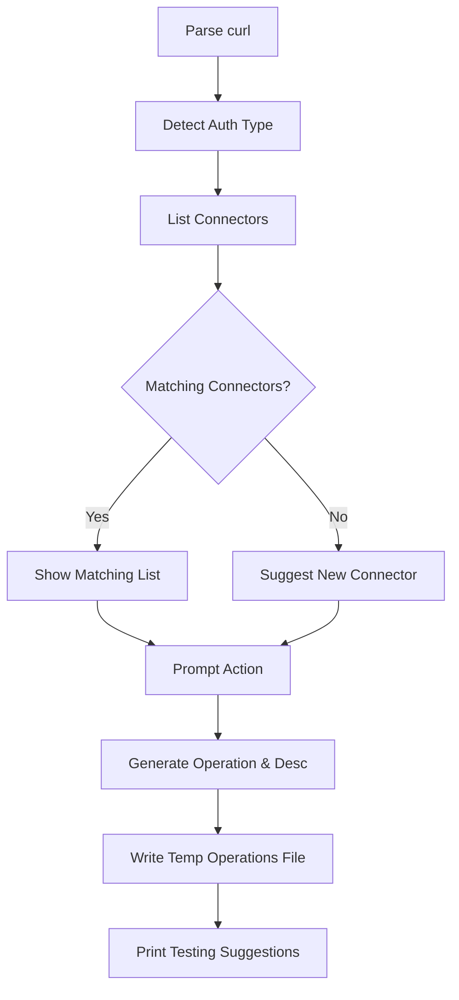
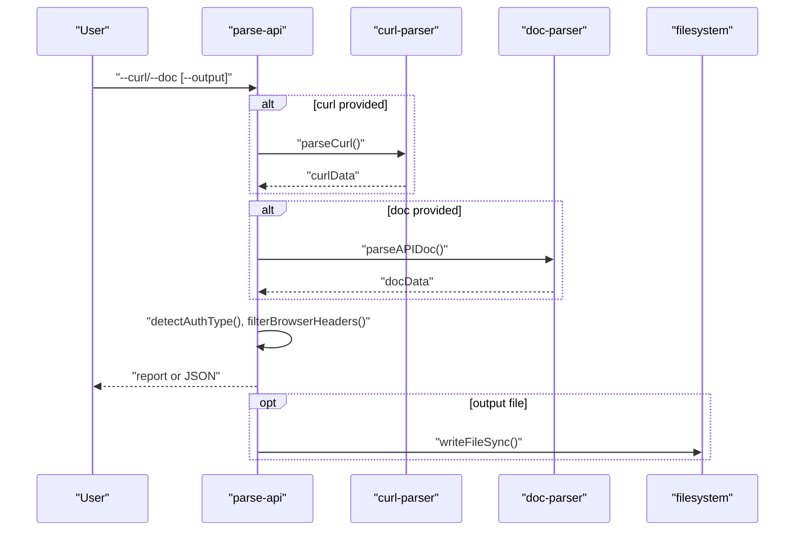
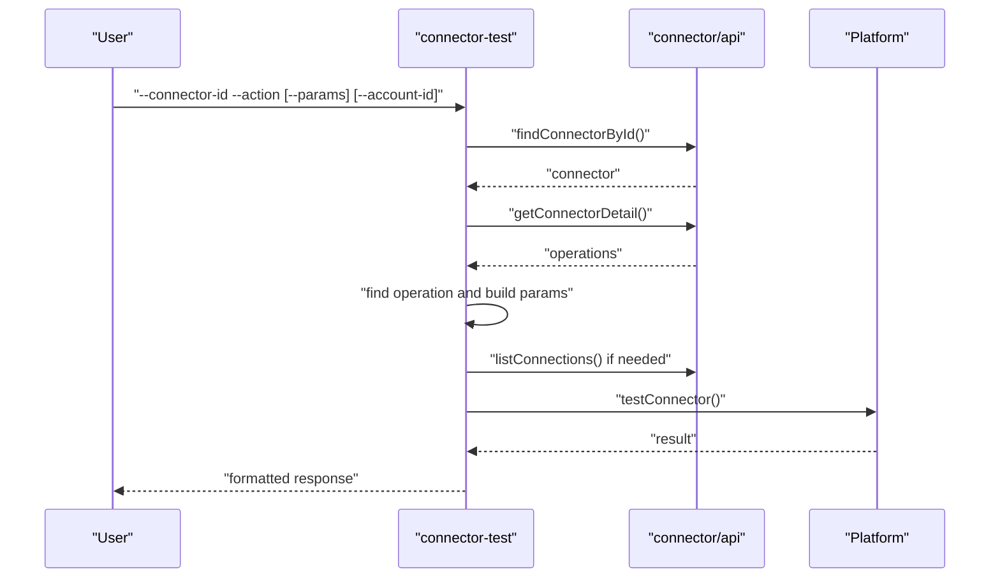
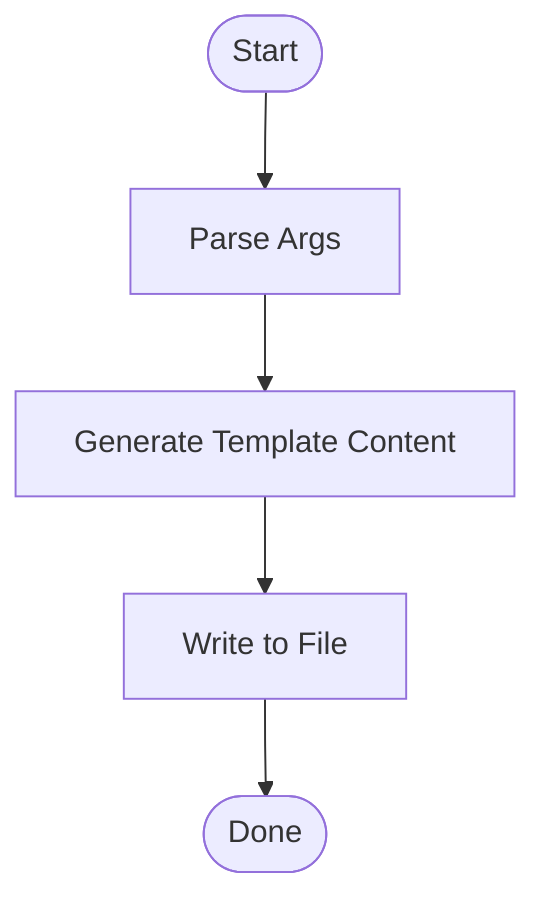
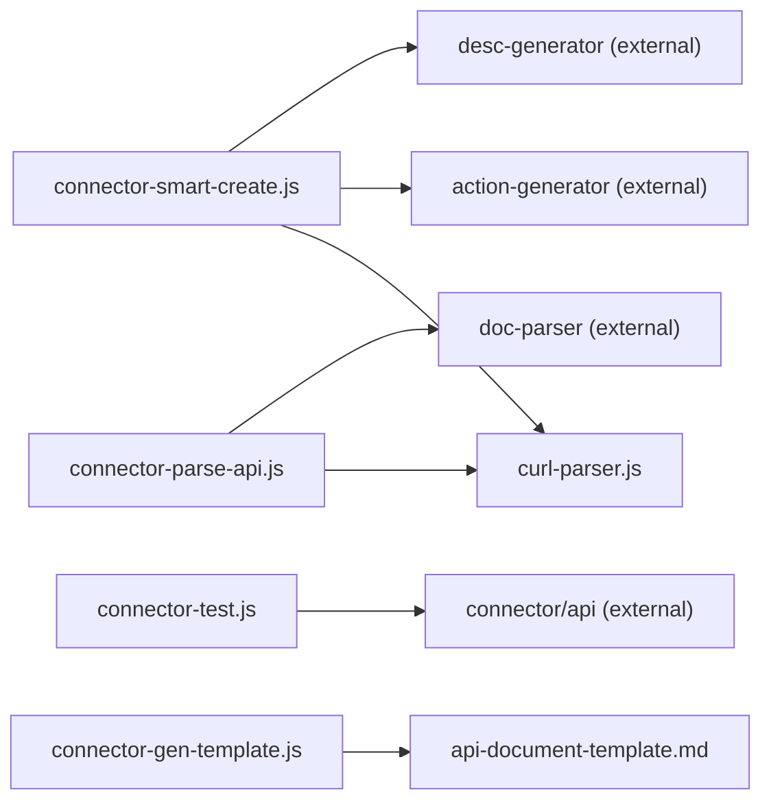

# Connector Specifications

<cite>
**Referenced Files in This Document**
- [SKILL.md](file://yida-skills/skills/yida-connector/SKILL.md)
- [connector-create.js](file://lib/connector/connector-create.js)
- [connector-smart-create.js](file://lib/connector/connector-smart-create.js)
- [connector-parse-api.js](file://lib/connector/connector-parse-api.js)
- [connector-test.js](file://lib/connector/connector-test.js)
- [connector-gen-template.js](file://lib/connector/connector-gen-template.js)
- [curl-parser.js](file://lib/connector/curl-parser.js)
- [operations-device-alarm.json](file://yida-skills/skills/yida-connector/examples/operations-device-alarm.json)
- [api-document-template.md](file://yida-skills/skills/yida-connector/templates/api-document-template.md)
</cite>

## Table of Contents
1. [Introduction](#introduction)
2. [Project Structure](#project-structure)
3. [Core Components](#core-components)
4. [Architecture Overview](#architecture-overview)
5. [Detailed Component Analysis](#detailed-component-analysis)
6. [Dependency Analysis](#dependency-analysis)
7. [Performance Considerations](#performance-considerations)
8. [Troubleshooting Guide](#troubleshooting-guide)
9. [Conclusion](#conclusion)
10. [Appendices](#appendices)

## Introduction
This document specifies OpenYida’s HTTP connector system for宜搭 (Yida). It covers the connector creation workflow, template generation, and smart connector functionality. It explains connector schema definitions, field mappings, data transformation rules, API parsing capabilities, endpoint discovery, and automatic connector generation. It also documents configuration parameters, authentication methods, request/response formatting, testing framework, validation rules, debugging procedures, deployment strategies, version management, maintenance, troubleshooting, performance optimization, and best practices.

## Project Structure
The connector subsystem is organized around CLI commands and supporting parsers. Key areas:
- CLI command modules under lib/connector for create, smart-create, parse-api, test, and template generation
- Skill documentation under yida-skills/skills/yida-connector detailing usage, authentication types, and examples
- Example operation configurations and templates for rapid prototyping

**Diagram sources**
- [connector-create.js:1-328](file://lib/connector/connector-create.js#L1-L328)
- [connector-smart-create.js:1-222](file://lib/connector/connector-smart-create.js#L1-L222)
- [connector-parse-api.js:1-223](file://lib/connector/connector-parse-api.js#L1-L223)
- [connector-test.js:1-225](file://lib/connector/connector-test.js#L1-L225)
- [connector-gen-template.js:1-174](file://lib/connector/connector-gen-template.js#L1-L174)
- [curl-parser.js:1-123](file://lib/connector/curl-parser.js#L1-L123)
- [SKILL.md:1-517](file://yida-skills/skills/yida-connector/SKILL.md#L1-L517)
- [operations-device-alarm.json:1-82](file://yida-skills/skills/yida-connector/examples/operations-device-alarm.json#L1-L82)
- [api-document-template.md:1-166](file://yida-skills/skills/yida-connector/templates/api-document-template.md#L1-L166)

**Section sources**
- [SKILL.md:1-517](file://yida-skills/skills/yida-connector/SKILL.md#L1-L517)

## Core Components
- Connector creation and update: parses CLI arguments, validates inputs, builds security schemes, loads operations, and persists connector metadata.
- Smart creation: three-phase pipeline to parse API info, match existing connectors, generate actions, and suggest next steps.
- API parsing: supports curl and Markdown docs, prints structured reports, and optionally writes operation configs.
- Testing: resolves connector and action, auto-builds request parameters, executes test, and prints formatted response.
- Template generation: scaffolds a Markdown template for documenting APIs prior to connector creation.

**Section sources**
- [connector-create.js:1-328](file://lib/connector/connector-create.js#L1-L328)
- [connector-smart-create.js:1-222](file://lib/connector/connector-smart-create.js#L1-L222)
- [connector-parse-api.js:1-223](file://lib/connector/connector-parse-api.js#L1-L223)
- [connector-test.js:1-225](file://lib/connector/connector-test.js#L1-L225)
- [connector-gen-template.js:1-174](file://lib/connector/connector-gen-template.js#L1-L174)

## Architecture Overview
The connector system orchestrates CLI commands with parser utilities and skill documentation. Smart creation ties together curl parsing, connector matching, and action generation. Testing integrates with platform APIs to validate requests and responses.

**Diagram sources**
- [connector-smart-create.js:64-218](file://lib/connector/connector-smart-create.js#L64-L218)
- [curl-parser.js:10-56](file://lib/connector/curl-parser.js#L10-L56)
- [connector-create.js:210-325](file://lib/connector/connector-create.js#L210-L325)

## Detailed Component Analysis

### Connector Creation Workflow
- Command: create/update connector with optional operations file and authentication parameters.
- Behavior:
  - Parse CLI arguments and validate required fields.
  - Build securitySchemes based on selected auth type.
  - Load operations from JSON file and validate structure.
  - Persist connector via platform API and print next steps.

**Diagram sources**
- [connector-create.js:74-152](file://lib/connector/connector-create.js#L74-L152)
- [connector-create.js:210-325](file://lib/connector/connector-create.js#L210-L325)

**Section sources**
- [connector-create.js:1-328](file://lib/connector/connector-create.js#L1-L328)
- [SKILL.md:47-68](file://yida-skills/skills/yida-connector/SKILL.md#L47-L68)

### Smart Connector Creation (Three-Phase Pipeline)
- Phase 1: Parse curl to extract protocol, host, path, method, and detect auth type.
- Phase 2: List connectors and match by host and compatible auth scheme.
- Phase 3: Generate operation config and connector description; write temp file.
- Phase 4: Print actionable next steps and testing suggestions.

**Diagram sources**
- [connector-smart-create.js:64-218](file://lib/connector/connector-smart-create.js#L64-L218)
- [curl-parser.js:63-90](file://lib/connector/curl-parser.js#L63-L90)

**Section sources**
- [connector-smart-create.js:1-222](file://lib/connector/connector-smart-create.js#L1-L222)
- [SKILL.md:239-313](file://yida-skills/skills/yida-connector/SKILL.md#L239-L313)

### API Parsing Capabilities and Endpoint Discovery
- Supports curl commands and Markdown documents.
- Detects auth type from headers and filters browser-added headers.
- Converts parsed docs into operation configuration and prints a structured report.
- Optionally writes operation JSON to a file for reuse.

**Diagram sources**
- [connector-parse-api.js:166-220](file://lib/connector/connector-parse-api.js#L166-L220)
- [curl-parser.js:10-56](file://lib/connector/curl-parser.js#L10-L56)
- [curl-parser.js:63-90](file://lib/connector/curl-parser.js#L63-L90)
- [curl-parser.js:108-115](file://lib/connector/curl-parser.js#L108-L115)

**Section sources**
- [connector-parse-api.js:1-223](file://lib/connector/connector-parse-api.js#L1-L223)
- [curl-parser.js:1-123](file://lib/connector/curl-parser.js#L1-L123)

### Connector Testing Framework
- Resolves connector and action, lists available auth accounts when needed.
- Builds test parameters from defaults and user-provided JSON.
- Executes test via platform API and prints formatted status, headers, body, and execution time.
- Handles errors and displays content when present.

**Diagram sources**
- [connector-test.js:98-222](file://lib/connector/connector-test.js#L98-L222)

**Section sources**
- [connector-test.js:1-225](file://lib/connector/connector-test.js#L1-L225)

### Template Generation for API Documentation
- Generates a Markdown template with sections for basic info, server info, auth, actions, and examples.
- Writes the template to a specified path or current directory.

**Diagram sources**
- [connector-gen-template.js:153-171](file://lib/connector/connector-gen-template.js#L153-L171)

**Section sources**
- [connector-gen-template.js:1-174](file://lib/connector/connector-gen-template.js#L1-L174)
- [api-document-template.md:1-166](file://yida-skills/skills/yida-connector/templates/api-document-template.md#L1-L166)

### Authentication Methods and Security Schemes
Supported auth types and their mapping:
- None, Basic, ApiKey (header or query), DingTalk, Aliyun API Gateway, DingTrust
- securitySchemes and securityValue formats are documented in the skill guide.

**Section sources**
- [SKILL.md:34-484](file://yida-skills/skills/yida-connector/SKILL.md#L34-L484)

### Execution Action Configuration Schema
- Inputs groups: Headers, Query, Path, Body
- Outputs: JSON schema with paramType per leaf field
- Responses: JSON Schema object with properties
- Defaults and examples are validated and used during testing

**Section sources**
- [SKILL.md:314-449](file://yida-skills/skills/yida-connector/SKILL.md#L314-L449)
- [operations-device-alarm.json:1-82](file://yida-skills/skills/yida-connector/examples/operations-device-alarm.json#L1-L82)

### Request/Response Formatting Rules
- GET endpoints: no body; all parameters go to Query; inputs include Headers and Query; parameters include header and query only.
- access_token in query: when ApiKeyAuth is in query, it is injected automatically by the connector’s auth account; do not duplicate in inputs.
- Connector descriptions: auto-generated from operations; keep descriptions concise and focused on purpose.

**Section sources**
- [SKILL.md:328-336](file://yida-skills/skills/yida-connector/SKILL.md#L328-L336)

### Example Implementations
- Device alarm action: demonstrates Headers and Body inputs, JSON responses, and outputs structure.
- Additional examples exist under the skill’s examples directory for search forms and attachments.

**Section sources**
- [operations-device-alarm.json:1-82](file://yida-skills/skills/yida-connector/examples/operations-device-alarm.json#L1-L82)

## Dependency Analysis
- connector-smart-create depends on curl-parser for parsing and detection, and on connector-create’s helpers for saving and description building.
- connector-parse-api depends on curl-parser and doc-parser to produce operation configs.
- connector-test depends on connector-create’s helpers to resolve connector details and operations.
- connector-gen-template is self-contained and writes the template file.

**Diagram sources**
- [connector-smart-create.js:14-18](file://lib/connector/connector-smart-create.js#L14-L18)
- [connector-parse-api.js:15-17](file://lib/connector/connector-parse-api.js#L15-L17)
- [connector-test.js:9-15](file://lib/connector/connector-test.js#L9-L15)
- [connector-gen-template.js:9-10](file://lib/connector/connector-gen-template.js#L9-L10)

**Section sources**
- [connector-smart-create.js:1-222](file://lib/connector/connector-smart-create.js#L1-L222)
- [connector-parse-api.js:1-223](file://lib/connector/connector-parse-api.js#L1-L223)
- [connector-test.js:1-225](file://lib/connector/connector-test.js#L1-L225)
- [connector-gen-template.js:1-174](file://lib/connector/connector-gen-template.js#L1-L174)

## Performance Considerations
- Minimize unnecessary network calls by validating inputs locally (e.g., operations JSON) before invoking platform APIs.
- Prefer HEAD/OPTIONS checks for endpoint availability when supported by upstream APIs.
- Cache parsed curl and doc results when iterating on configurations.
- Use query-based API keys judiciously; avoid redundant manual injection when the connector can inject automatically.
- Batch updates to connectors when adding multiple actions to reduce repeated saves.

## Troubleshooting Guide
Common issues and resolutions:
- CSRF token invalid: refresh token or re-authenticate.
- Application/connection not found: verify IDs and permissions.
- Parameter errors: validate JSON and types against operation schema.
- Authentication failures: confirm auth configuration and credentials.

**Section sources**
- [SKILL.md:504-512](file://yida-skills/skills/yida-connector/SKILL.md#L504-L512)

## Conclusion
OpenYida’s HTTP connector system provides a robust, automated workflow for creating, configuring, and testing connectors. The smart creation pipeline accelerates adoption by parsing API inputs, matching existing connectors, generating accurate action configurations, and guiding testing. The schema-driven action definitions, strong authentication support, and comprehensive testing framework enable reliable integrations across RESTful services, SOAP APIs, and custom endpoints.

## Appendices

### Connector Configuration Parameters
- Name, base URL, icon, description, and category are set during creation/update.
- Operations file defines actions, inputs, parameters, responses, and outputs.

**Section sources**
- [connector-create.js:9-21](file://lib/connector/connector-create.js#L9-L21)
- [connector-create.js:286-305](file://lib/connector/connector-create.js#L286-L305)

### Authentication Methods Reference
- None, Basic, ApiKey (header/query), DingTalk, Aliyun API Gateway, DingTrust.

**Section sources**
- [SKILL.md:34-44](file://yida-skills/skills/yida-connector/SKILL.md#L34-L44)

### Deployment and Version Management
- Use the skill version metadata for tracking compatibility and updates.
- Maintain separate operation JSON files per environment and rotate secrets via connection management.

**Section sources**
- [SKILL.md:8-11](file://yida-skills/skills/yida-connector/SKILL.md#L8-L11)

### Best Practices
- Keep connector descriptions concise and purpose-focused.
- Use the template to capture all relevant request/response details before creation.
- Leverage smart-create to avoid duplication and ensure consistent action naming.
- Validate actions with connector-test before integrating into forms or processes.

**Section sources**
- [SKILL.md:332-336](file://yida-skills/skills/yida-connector/SKILL.md#L332-L336)
- [SKILL.md:233-238](file://yida-skills/skills/yida-connector/SKILL.md#L233-L238)