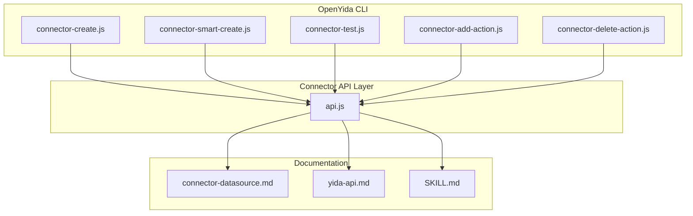
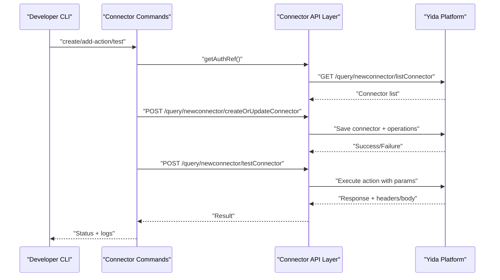
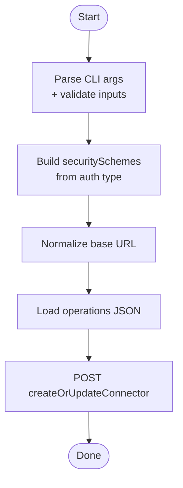
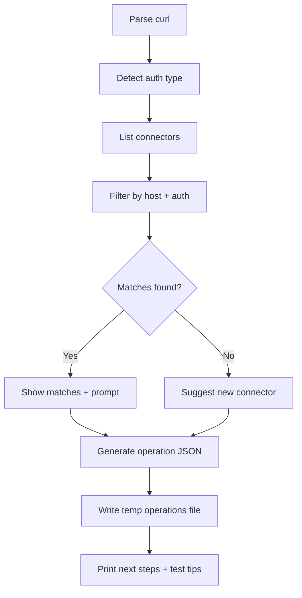
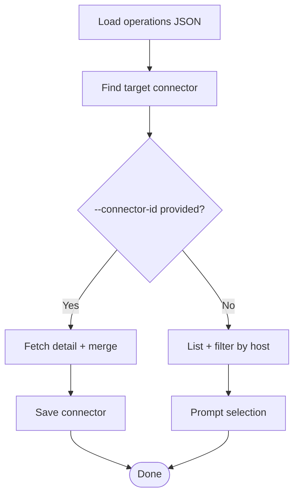
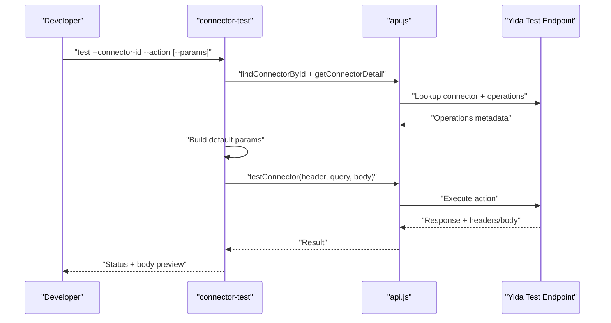
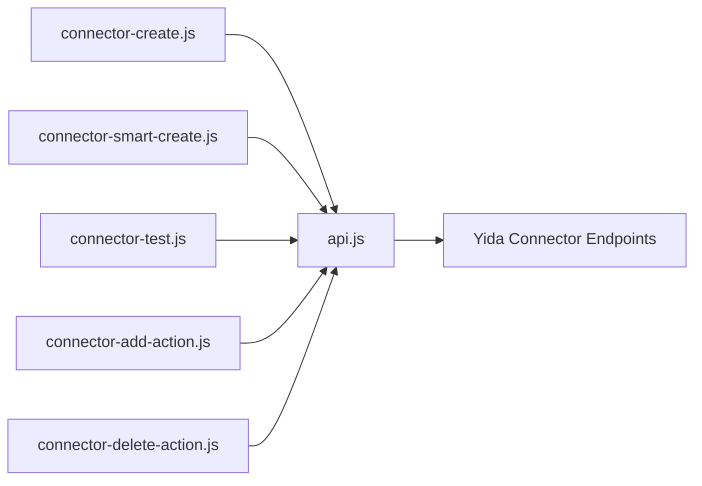

# External API Integrations

<cite>
**Referenced Files in This Document**
- [connector-create.js](file://lib/connector/connector-create.js)
- [connector-smart-create.js](file://lib/connector/connector-smart-create.js)
- [connector-test.js](file://lib/connector/connector-test.js)
- [connector-add-action.js](file://lib/connector/connector-add-action.js)
- [connector-delete-action.js](file://lib/connector/connector-delete-action.js)
- [api.js](file://lib/connector/api.js)
- [connector-datasource.md](file://yida-skills/reference/connector-datasource.md)
- [yida-api.md](file://yida-skills/reference/yida-api.md)
- [SKILL.md](file://yida-skills/skills/yida-connector/SKILL.md)
</cite>

## Table of Contents
1. [Introduction](#introduction)
2. [Project Structure](#project-structure)
3. [Core Components](#core-components)
4. [Architecture Overview](#architecture-overview)
5. [Detailed Component Analysis](#detailed-component-analysis)
6. [Dependency Analysis](#dependency-analysis)
7. [Performance Considerations](#performance-considerations)
8. [Troubleshooting Guide](#troubleshooting-guide)
9. [Conclusion](#conclusion)
10. [Appendices](#appendices)

## Introduction
This document explains how OpenYida’s connector system integrates with external APIs and the Yida platform. It covers the lifecycle of HTTP connectors from creation to testing and deployment, including authentication mechanisms, request/response patterns, data transformation, and error handling. Practical examples demonstrate CRM, HR, and external data source integrations, along with security and enterprise considerations such as SSL/TLS and proxy configurations.

## Project Structure
OpenYida provides a CLI-driven workflow to manage HTTP connectors and integrate them into Yida pages. The connector subsystem consists of:
- CLI commands for creating, updating, adding actions, deleting actions, and testing connectors
- API wrappers for authenticating with Yida and invoking connector endpoints
- Reference materials for Yida’s internal APIs and connector usage patterns

**Diagram sources**
- [connector-create.js:1-328](file://lib/connector/connector-create.js#L1-L328)
- [connector-smart-create.js:1-222](file://lib/connector/connector-smart-create.js#L1-L222)
- [connector-test.js:1-225](file://lib/connector/connector-test.js#L1-L225)
- [connector-add-action.js:1-215](file://lib/connector/connector-add-action.js#L1-L215)
- [connector-delete-action.js:1-120](file://lib/connector/connector-delete-action.js#L1-L120)
- [api.js:1-379](file://lib/connector/api.js#L1-L379)
- [connector-datasource.md:1-388](file://yida-skills/reference/connector-datasource.md#L1-L388)
- [yida-api.md:1-1281](file://yida-skills/reference/yida-api.md#L1-L1281)
- [SKILL.md:1-517](file://yida-skills/skills/yida-connector/SKILL.md#L1-L517)

**Section sources**
- [connector-create.js:1-328](file://lib/connector/connector-create.js#L1-L328)
- [connector-smart-create.js:1-222](file://lib/connector/connector-smart-create.js#L1-L222)
- [connector-test.js:1-225](file://lib/connector/connector-test.js#L1-L225)
- [connector-add-action.js:1-215](file://lib/connector/connector-add-action.js#L1-L215)
- [connector-delete-action.js:1-120](file://lib/connector/connector-delete-action.js#L1-L120)
- [api.js:1-379](file://lib/connector/api.js#L1-L379)
- [connector-datasource.md:1-388](file://yida-skills/reference/connector-datasource.md#L1-L388)
- [yida-api.md:1-1281](file://yida-skills/reference/yida-api.md#L1-L1281)
- [SKILL.md:1-517](file://yida-skills/skills/yida-connector/SKILL.md#L1-L517)

## Core Components
- Connector creation and update: CLI supports manual creation and updates, including authentication schemes and operation definitions.
- Smart creation: Parses curl or API docs to auto-generate actions and suggest reuse of existing connectors.
- Action management: Add or delete actions to existing connectors; merge logic avoids duplicates.
- Testing: Build test parameters from operation metadata and send requests via Yida’s connector test endpoint.
- API layer: Encapsulates login, CSRF handling, and HTTP calls to Yida’s connector endpoints.

**Section sources**
- [connector-create.js:65-186](file://lib/connector/connector-create.js#L65-L186)
- [connector-smart-create.js:61-204](file://lib/connector/connector-smart-create.js#L61-L204)
- [connector-add-action.js:111-212](file://lib/connector/connector-add-action.js#L111-L212)
- [connector-delete-action.js:43-117](file://lib/connector/connector-delete-action.js#L43-L117)
- [connector-test.js:98-222](file://lib/connector/connector-test.js#L98-L222)
- [api.js:26-379](file://lib/connector/api.js#L26-L379)

## Architecture Overview
The connector lifecycle spans CLI commands, the connector API layer, and Yida platform endpoints. Authentication is centralized through a cookie/CSRF mechanism. Actions are defined as structured operation documents and attached to connectors.

**Diagram sources**
- [api.js:180-284](file://lib/connector/api.js#L180-L284)
- [connector-create.js:210-325](file://lib/connector/connector-create.js#L210-L325)
- [connector-test.js:98-222](file://lib/connector/connector-test.js#L98-L222)

**Section sources**
- [api.js:26-379](file://lib/connector/api.js#L26-L379)
- [connector-create.js:210-325](file://lib/connector/connector-create.js#L210-L325)
- [connector-test.js:98-222](file://lib/connector/connector-test.js#L98-L222)

## Detailed Component Analysis

### HTTP Connector Creation and Authentication
- Supported auth types include none, basic auth, API key (header or query), DingTalk OpenAPI, Alibaba Cloud API Gateway, and DingTrust gateway.
- CLI parses arguments, builds security schemes, validates base URL, and saves connector metadata.
- Connector descriptions include openyida metadata for auditability.

**Diagram sources**
- [connector-create.js:74-305](file://lib/connector/connector-create.js#L74-L305)

**Section sources**
- [connector-create.js:65-186](file://lib/connector/connector-create.js#L65-L186)
- [connector-create.js:188-204](file://lib/connector/connector-create.js#L188-L204)
- [connector-create.js:286-305](file://lib/connector/connector-create.js#L286-L305)
- [SKILL.md:34-44](file://yida-skills/skills/yida-connector/SKILL.md#L34-L44)

### Smart Connector Creation Workflow
- Parses curl to extract protocol, host, method, path, and auth type.
- Matches existing connectors by host and auth compatibility.
- Generates operation definition and suggests next steps (add to existing or create new).

**Diagram sources**
- [connector-smart-create.js:64-204](file://lib/connector/connector-smart-create.js#L64-L204)

**Section sources**
- [connector-smart-create.js:61-204](file://lib/connector/connector-smart-create.js#L61-L204)
- [SKILL.md:239-313](file://yida-skills/skills/yida-connector/SKILL.md#L239-L313)

### Adding and Deleting Actions
- Add action merges new operations with existing ones, avoiding duplicates by operationId.
- Delete action filters out a single operation and re-saves the connector.

**Diagram sources**
- [connector-add-action.js:111-212](file://lib/connector/connector-add-action.js#L111-L212)

**Section sources**
- [connector-add-action.js:111-212](file://lib/connector/connector-add-action.js#L111-L212)
- [connector-delete-action.js:43-117](file://lib/connector/connector-delete-action.js#L43-L117)

### Testing Connectors
- Builds test parameters from operation metadata (headers, query, body).
- Detects required auth accounts and prompts for selection if missing.
- Executes via Yida’s test endpoint and prints status, headers, body, and execution time.

**Diagram sources**
- [connector-test.js:98-222](file://lib/connector/connector-test.js#L98-L222)
- [api.js:214-237](file://lib/connector/api.js#L214-L237)
- [api.js:343-362](file://lib/connector/api.js#L343-L362)

**Section sources**
- [connector-test.js:62-96](file://lib/connector/connector-test.js#L62-L96)
- [connector-test.js:151-160](file://lib/connector/connector-test.js#L151-L160)
- [connector-test.js:172-222](file://lib/connector/connector-test.js#L172-L222)

### Request/Response Patterns and Parameter Mapping
- Inputs are grouped into Headers, Query, Path, and Body according to HTTP semantics.
- GET interfaces place all parameters under Query; Body is omitted.
- When API key is configured in query mode, access tokens can be injected automatically by the connector’s auth account.

**Section sources**
- [SKILL.md:314-449](file://yida-skills/skills/yida-connector/SKILL.md#L314-L449)
- [connector-datasource.md:106-161](file://yida-skills/reference/connector-datasource.md#L106-L161)

### Data Transformation and Page Integration
- On the Yida page, connectors are referenced as data sources and invoked via JavaScript using a standardized load method.
- The platform unpacks serviceReturnValue automatically, exposing a simplified result object to page scripts.

**Section sources**
- [connector-datasource.md:141-161](file://yida-skills/reference/connector-datasource.md#L141-L161)
- [connector-datasource.md:162-234](file://yida-skills/reference/connector-datasource.md#L162-L234)

### Authentication Mechanisms
- Login and CSRF token management are handled centrally; subsequent connector operations reuse credentials.
- Auth types supported include Basic, API Key, DingTalk OpenAPI, Alibaba Cloud API Gateway, and DingTrust.

**Section sources**
- [api.js:26-38](file://lib/connector/api.js#L26-L38)
- [api.js:47-69](file://lib/connector/api.js#L47-L69)
- [SKILL.md:34-44](file://yida-skills/skills/yida-connector/SKILL.md#L34-L44)

### Integration with Yida Platform APIs
- Internal Yida APIs enable form data operations, process instances, and form schema management. These are distinct from HTTP connectors but useful for end-to-end integrations.
- Connector actions can be combined with Yida’s built-in APIs to orchestrate workflows.

**Section sources**
- [yida-api.md:50-448](file://yida-skills/reference/yida-api.md#L50-L448)
- [yida-api.md:452-658](file://yida-skills/reference/yida-api.md#L452-L658)

## Dependency Analysis
The connector subsystem depends on a shared API layer for authentication and HTTP operations. The CLI commands coordinate with Yida endpoints to list, create, update, and test connectors.

**Diagram sources**
- [connector-create.js:25-32](file://lib/connector/connector-create.js#L25-L32)
- [connector-smart-create.js:14-18](file://lib/connector/connector-smart-create.js#L14-L18)
- [connector-test.js:9-15](file://lib/connector/connector-test.js#L9-L15)
- [connector-add-action.js:15-24](file://lib/connector/connector-add-action.js#L15-L24)
- [connector-delete-action.js:12-18](file://lib/connector/connector-delete-action.js#L12-L18)
- [api.js:10-18](file://lib/connector/api.js#L10-L18)

**Section sources**
- [connector-create.js:25-32](file://lib/connector/connector-create.js#L25-L32)
- [connector-smart-create.js:14-18](file://lib/connector/connector-smart-create.js#L14-L18)
- [connector-test.js:9-15](file://lib/connector/connector-test.js#L9-L15)
- [connector-add-action.js:15-24](file://lib/connector/connector-add-action.js#L15-L24)
- [connector-delete-action.js:12-18](file://lib/connector/connector-delete-action.js#L12-L18)
- [api.js:10-18](file://lib/connector/api.js#L10-L18)

## Performance Considerations
- Prefer smart creation to avoid redundant connectors and reduce maintenance overhead.
- Use query-based API keys for parameters like access tokens to minimize payload sizes.
- Batch operations where possible and leverage Yida’s caching for repeated reads.
- Keep operation definitions concise to reduce page rendering and parameter handling overhead.

## Troubleshooting Guide
Common issues and resolutions:
- CSRF token invalid: Re-authenticate or refresh session; the API layer handles retries automatically.
- Application/connection not found: Verify IDs and permissions.
- Parameter errors: Validate operation metadata and ensure correct grouping (Headers/Query/Body).
- Authentication failures: Confirm auth type, credentials, and account binding.

**Section sources**
- [api.js:506-512](file://lib/connector/api.js#L506-L512)
- [connector-test.js:151-160](file://lib/connector/connector-test.js#L151-L160)

## Conclusion
OpenYida’s connector system streamlines external API integration by encapsulating authentication, parameter mapping, and testing within a cohesive CLI and API layer. By following the documented lifecycle and leveraging smart creation, teams can rapidly onboard connectors for CRM, HR, and external systems while maintaining security and operational visibility.

## Appendices

### Practical Examples Index
- CRM integration: Use API key in header or query to call third-party CRM endpoints; define actions for list/search and create/update records.
- HR systems: Integrate with DingTalk OpenAPI for employee and roster data; configure DingTalk auth and map fields to Yida forms.
- External data sources: Configure basic auth or API key for internal APIs; expose actions for paginated queries and transformations.

### Security and Enterprise Considerations
- SSL/TLS: All connectors operate over HTTPS; ensure corporate trust stores include required certificates.
- Proxy: Configure environment proxies for outbound requests; verify CSRF and cookie handling remain intact.
- Rate limiting: Respect upstream limits; implement retries with backoff and circuit breaker patterns at the application level.