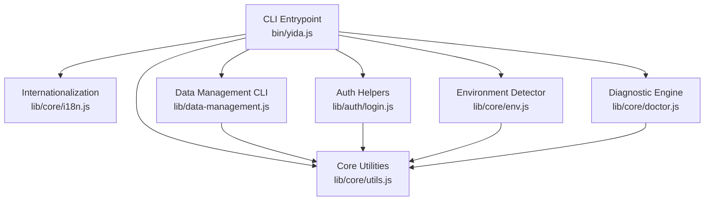
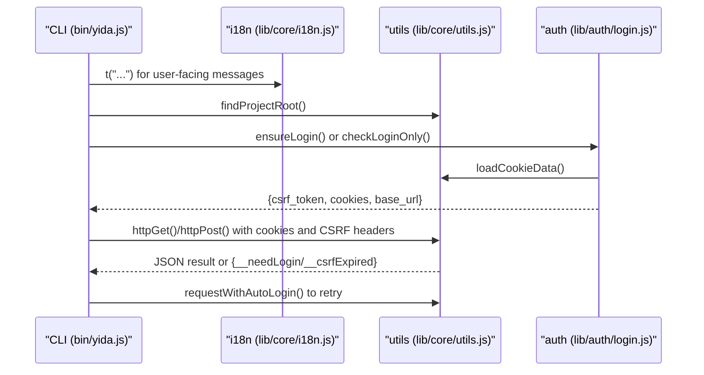
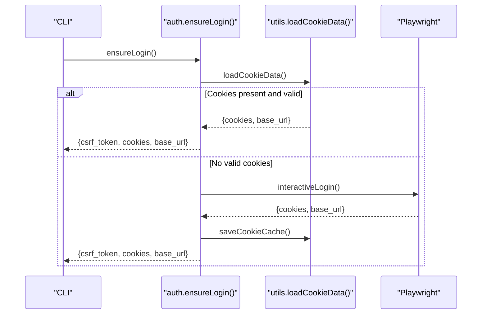
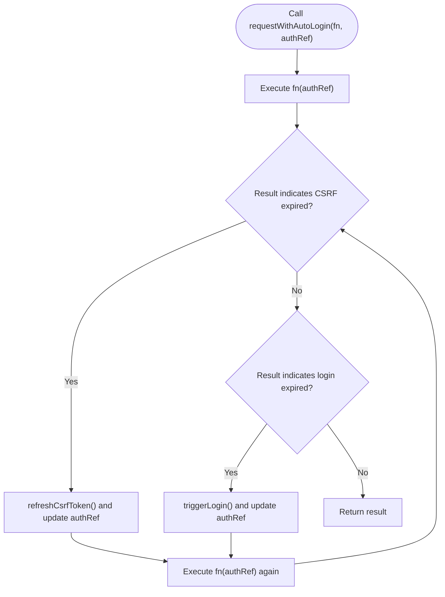
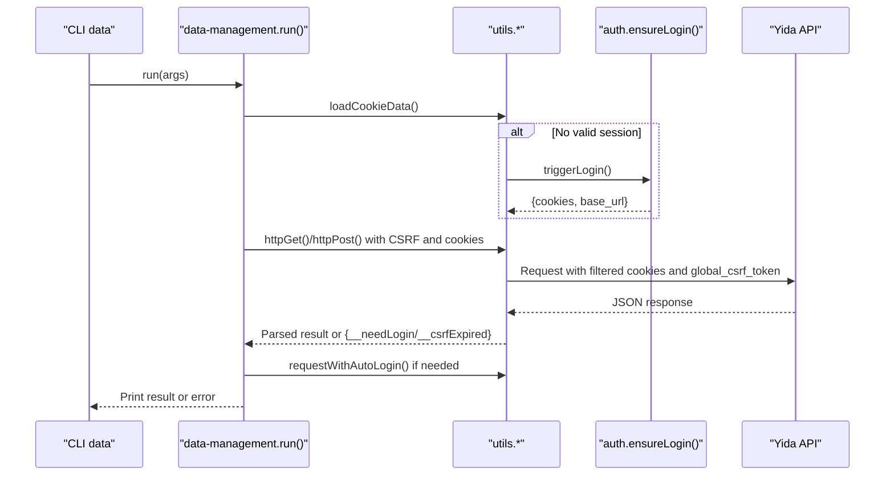
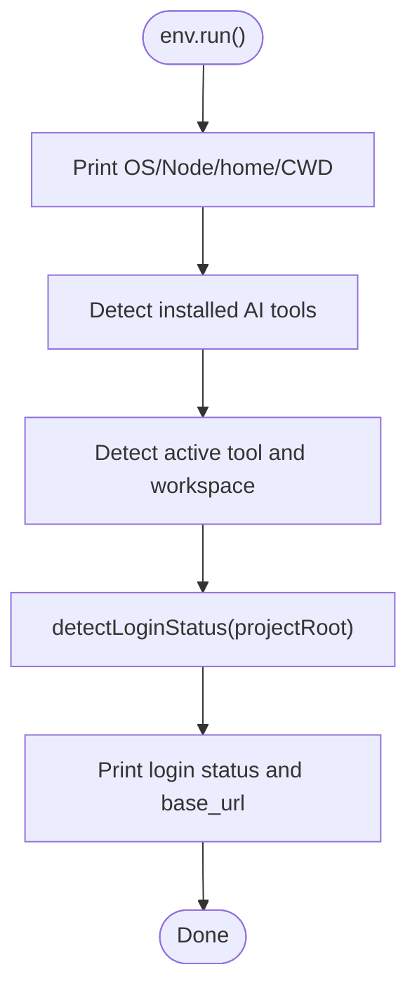
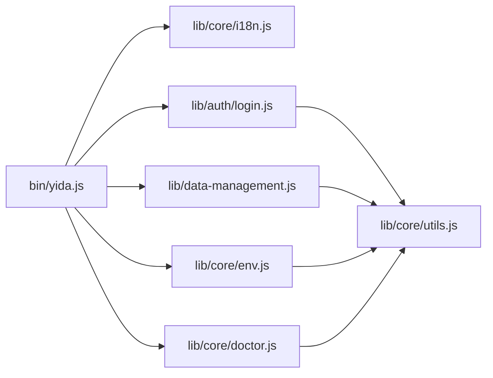

# Internal APIs

<cite>
**Referenced Files in This Document**
- [bin/yida.js](file://bin/yida.js)
- [lib/core/utils.js](file://lib/core/utils.js)
- [lib/core/i18n.js](file://lib/core/i18n.js)
- [lib/core/env.js](file://lib/core/env.js)
- [lib/core/doctor.js](file://lib/core/doctor.js)
- [lib/auth/login.js](file://lib/auth/login.js)
- [lib/data-management.js](file://lib/data-management.js)
</cite>

## Table of Contents
1. [Introduction](#introduction)
2. [Project Structure](#project-structure)
3. [Core Components](#core-components)
4. [Architecture Overview](#architecture-overview)
5. [Detailed Component Analysis](#detailed-component-analysis)
6. [Dependency Analysis](#dependency-analysis)
7. [Performance Considerations](#performance-considerations)
8. [Troubleshooting Guide](#troubleshooting-guide)
9. [Conclusion](#conclusion)
10. [Appendices](#appendices)

## Introduction
This document describes the internal APIs and system interfaces used by OpenYida’s CLI and core subsystems. It focuses on:
- Utility functions for project root detection, cookie parsing, authentication helpers, and HTTP request utilities
- Internationalization (i18n) system with translation functions and locale management
- Environment detection and diagnostic tools
- Function contracts, parameters, return values, error handling, and integration patterns
- Practical usage scenarios and best practices

## Project Structure
OpenYida organizes internal APIs primarily under lib/core and lib/auth, with the CLI entrypoint in bin/yida.js orchestrating commands and delegating to these modules. Data operations are encapsulated in lib/data-management.js, which reuses core utilities.

**Diagram sources**
- [bin/yida.js:140-521](file://bin/yida.js#L140-L521)
- [lib/core/utils.js:1-463](file://lib/core/utils.js#L1-L463)
- [lib/core/i18n.js:1-174](file://lib/core/i18n.js#L1-L174)
- [lib/core/env.js:1-171](file://lib/core/env.js#L1-L171)
- [lib/core/doctor.js:1-800](file://lib/core/doctor.js#L1-L800)
- [lib/auth/login.js:1-349](file://lib/auth/login.js#L1-L349)
- [lib/data-management.js:1-363](file://lib/data-management.js#L1-L363)

**Section sources**
- [bin/yida.js:140-521](file://bin/yida.js#L140-L521)

## Core Components
This section documents the internal APIs exposed by core modules and their contracts.

### Authentication Helpers (lib/auth/login.js)
Exports:
- ensureLogin(): Ensures a valid login session by loading cached cookies or triggering interactive login via Playwright.
- checkLoginOnly(): Checks current login state without prompting login.
- refreshCsrfFromCache(): Extracts CSRF token from cached cookies without re-authentication.
- interactiveLogin(): Opens a headed browser to perform QR-based login and saves cookies.
- saveCookieCache(cookies, baseUrl): Persists cookies and base_url to project cache.
- logout(): Removes cached cookies for the project.

Key behaviors:
- Loads project config.json to determine loginUrl and defaultBaseUrl.
- Uses Playwright to wait for tianshu_csrf_token cookie presence.
- Saves cookies to project-level .cache/cookies.json with base_url normalization.

Error handling:
- Exits with non-zero status on missing cookies, invalid CSRF, or Playwright resolution failures.
- Provides localized messages via i18n.

Integration:
- Used by env detector to assess login status.
- Consumed by data-management CLI to maintain session state.

**Section sources**
- [lib/auth/login.js:27-41](file://lib/auth/login.js#L27-L41)
- [lib/auth/login.js:45-53](file://lib/auth/login.js#L45-L53)
- [lib/auth/login.js:61-93](file://lib/auth/login.js#L61-L93)
- [lib/auth/login.js:101-126](file://lib/auth/login.js#L101-L126)
- [lib/auth/login.js:134-155](file://lib/auth/login.js#L134-L155)
- [lib/auth/login.js:169-201](file://lib/auth/login.js#L169-L201)
- [lib/auth/login.js:207-313](file://lib/auth/login.js#L207-L313)
- [lib/auth/login.js:320-339](file://lib/auth/login.js#L320-L339)

### HTTP Utilities and Session Helpers (lib/core/utils.js)
Exports:
- detectActiveTool(): Detects active AI tool environment via environment variables and filesystem checks.
- findProjectRoot(): Returns project root path based on detected tool workspace or CWD.
- extractInfoFromCookies(cookies): Parses csrf_token, corp_id, user_id from cookie array.
- loadCookieData(projectRoot?, defaultBaseUrl?): Reads and normalizes .cache/cookies.json.
- triggerLogin(): Triggers interactive login via auth module.
- refreshCsrfToken(): Refreshes CSRF token from cache.
- resolveBaseUrl(cookieData, defaultBaseUrl?): Normalizes base_url from cookie data.
- isLoginExpired(responseJson): Detects login expiration errors.
- isCsrfTokenExpired(responseJson): Detects CSRF token expiration errors.
- httpGet(baseUrl, requestPath, queryParams, cookies): Performs GET with cookie filtering and CSRF header injection.
- httpPost(baseUrl, requestPath, postData, cookies): Performs POST with form-encoded body and CSRF header injection.
- requestWithAutoLogin(requestFn, authRef): Retries requests after refreshing CSRF or re-authenticating automatically.

Processing logic highlights:
- Cookie filtering ensures only relevant cookies are sent based on host/domain.
- CSRF token extracted from cookies injected into global_csrf_token header.
- Automatic retry on login or CSRF expiration using internal helpers.

Error handling:
- Returns structured results (__needLogin, __csrfExpired) for higher-level handlers.
- Wraps network errors and JSON parse failures with localized messages.

Integration:
- Used by data-management CLI for form/process/task operations.
- Consumed by auth module for session refresh and login triggers.

**Section sources**
- [lib/core/utils.js:32-109](file://lib/core/utils.js#L32-L109)
- [lib/core/utils.js:121-133](file://lib/core/utils.js#L121-L133)
- [lib/core/utils.js:142-160](file://lib/core/utils.js#L142-L160)
- [lib/core/utils.js:170-201](file://lib/core/utils.js#L170-L201)
- [lib/core/utils.js:209-223](file://lib/core/utils.js#L209-L223)
- [lib/core/utils.js:232-251](file://lib/core/utils.js#L232-L251)
- [lib/core/utils.js:261-264](file://lib/core/utils.js#L261-L264)
- [lib/core/utils.js:276-341](file://lib/core/utils.js#L276-L341)
- [lib/core/utils.js:351-415](file://lib/core/utils.js#L351-L415)
- [lib/core/utils.js:423-447](file://lib/core/utils.js#L423-L447)

### Internationalization (lib/core/i18n.js)
Exports:
- t(key, ...args): Translates nested keys with positional argument interpolation.
- getLanguage(): Returns current language code.
- setLanguage(lang): Switches language for testing (clears translation cache).
- detectLanguage(): Detects language from OPENYIDA_LANG, LANG/LC_ALL, or defaults to zh.
- SUPPORTED_LANGUAGES: List of supported language codes.

Behavior:
- Lazy-loads translation dictionary per language.
- Falls back to Chinese for missing keys.
- Supports placeholders like {0}, {1}.

Integration:
- Used across CLI, env detector, and doctor engine for user-facing messages.

**Section sources**
- [lib/core/i18n.js:39-88](file://lib/core/i18n.js#L39-L88)
- [lib/core/i18n.js:97-106](file://lib/core/i18n.js#L97-L106)
- [lib/core/i18n.js:114-138](file://lib/core/i18n.js#L114-L138)
- [lib/core/i18n.js:146-152](file://lib/core/i18n.js#L146-L152)
- [lib/core/i18n.js:158-171](file://lib/core/i18n.js#L158-L171)

### Environment Detection (lib/core/env.js)
Exports:
- run(): Prints environment and login status report.
- detectEnvironment(): Enumerates installed AI tools and detects active tool/workspace.
- detectLoginStatus(projectRoot): Reads cookies and extracts CSRF/corp/user/base_url.

Behavior:
- Uses detectActiveTool() and loadCookieData() from utils.
- Reports OS, Node version, home/CWD, AI tools presence, active tool, project root, and login status.

Integration:
- Called by CLI env subcommand.

**Section sources**
- [lib/core/env.js:24-41](file://lib/core/env.js#L24-L41)
- [lib/core/env.js:47-76](file://lib/core/env.js#L47-L76)
- [lib/core/env.js:80-90](file://lib/core/env.js#L80-L90)
- [lib/core/env.js:95-168](file://lib/core/env.js#L95-L168)

### Diagnostic Engine (lib/core/doctor.js)
Exports:
- DiagnosticEngine: Orchestrates checker registration and result aggregation.
- EnvironmentChecker: Validates Node/Python/Playwright/gh/config/Skills/login/network.
- ApplicationChecker: Validates PRD/pages/schema/hooks.
- FixEngine: Auto/manual/command fixes.
- ReportGenerator: Generates JSON/Markdown/HTML reports.
- run(args): CLI entrypoint for doctor.

Behavior:
- Severity levels: error, warning, info.
- Fix types: auto, manual, command.
- Aggregates results and prints formatted summaries.

Integration:
- Called by CLI doctor subcommand.

**Section sources**
- [lib/core/doctor.js:50-129](file://lib/core/doctor.js#L50-L129)
- [lib/core/doctor.js:137-438](file://lib/core/doctor.js#L137-L438)
- [lib/core/doctor.js:446-631](file://lib/core/doctor.js#L446-L631)
- [lib/core/doctor.js:639-733](file://lib/core/doctor.js#L639-L733)
- [lib/core/doctor.js:741-800](file://lib/core/doctor.js#L741-L800)

### Data Management CLI (lib/data-management.js)
Exports:
- run(args): Main CLI entrypoint for unified data operations.

Capabilities:
- Form CRUD, subform listing, process queries, task operations, operation records, and task execution.
- Automatic session management using ensureSession() and requestWithAutoLogin().
- Parameter parsing, validation, and printing results.

Integration:
- Reuses utils.loadCookieData, utils.triggerLogin, utils.resolveBaseUrl, utils.httpGet, utils.httpPost, utils.requestWithAutoLogin.

**Section sources**
- [lib/data-management.js:44-60](file://lib/data-management.js#L44-L60)
- [lib/data-management.js:124-136](file://lib/data-management.js#L124-L136)
- [lib/data-management.js:151-179](file://lib/data-management.js#L151-L179)
- [lib/data-management.js:336-362](file://lib/data-management.js#L336-L362)

## Architecture Overview
The CLI delegates to internal modules that encapsulate cross-cutting concerns:
- i18n provides localized messages
- utils centralizes environment detection, cookie parsing, and HTTP utilities
- auth manages login state and persistence
- env and doctor consume these to produce diagnostics and reports

**Diagram sources**
- [bin/yida.js:140-521](file://bin/yida.js#L140-L521)
- [lib/core/i18n.js:114-138](file://lib/core/i18n.js#L114-L138)
- [lib/core/utils.js:121-133](file://lib/core/utils.js#L121-L133)
- [lib/auth/login.js:134-155](file://lib/auth/login.js#L134-L155)
- [lib/core/utils.js:276-341](file://lib/core/utils.js#L276-L341)
- [lib/core/utils.js:423-447](file://lib/core/utils.js#L423-L447)

## Detailed Component Analysis

### Authentication Flow (ensureLogin)

**Diagram sources**
- [lib/auth/login.js:134-155](file://lib/auth/login.js#L134-L155)
- [lib/auth/login.js:207-313](file://lib/auth/login.js#L207-L313)
- [lib/auth/login.js:45-53](file://lib/auth/login.js#L45-L53)
- [lib/core/utils.js:170-201](file://lib/core/utils.js#L170-L201)

**Section sources**
- [lib/auth/login.js:134-155](file://lib/auth/login.js#L134-L155)
- [lib/auth/login.js:207-313](file://lib/auth/login.js#L207-L313)

### HTTP Request Pipeline (requestWithAutoLogin)

**Diagram sources**
- [lib/core/utils.js:423-447](file://lib/core/utils.js#L423-L447)
- [lib/core/utils.js:209-223](file://lib/core/utils.js#L209-L223)
- [lib/core/utils.js:232-251](file://lib/core/utils.js#L232-L251)

**Section sources**
- [lib/core/utils.js:423-447](file://lib/core/utils.js#L423-L447)

### Data Operations Workflow (Unified Data CLI)

**Diagram sources**
- [lib/data-management.js:44-60](file://lib/data-management.js#L44-L60)
- [lib/data-management.js:124-136](file://lib/data-management.js#L124-L136)
- [lib/core/utils.js:276-341](file://lib/core/utils.js#L276-L341)
- [lib/core/utils.js:423-447](file://lib/core/utils.js#L423-L447)
- [lib/auth/login.js:134-155](file://lib/auth/login.js#L134-L155)

**Section sources**
- [lib/data-management.js:44-60](file://lib/data-management.js#L44-L60)
- [lib/data-management.js:124-136](file://lib/data-management.js#L124-L136)
- [lib/core/utils.js:276-341](file://lib/core/utils.js#L276-L341)
- [lib/core/utils.js:423-447](file://lib/core/utils.js#L423-L447)

### Environment Detection Report

**Diagram sources**
- [lib/core/env.js:95-168](file://lib/core/env.js#L95-L168)
- [lib/core/env.js:47-76](file://lib/core/env.js#L47-L76)
- [lib/core/env.js:80-90](file://lib/core/env.js#L80-L90)

**Section sources**
- [lib/core/env.js:95-168](file://lib/core/env.js#L95-L168)

## Dependency Analysis
- bin/yida.js depends on i18n for messages, env for environment inspection, doctor for diagnostics, auth for login, and data-management for unified data operations.
- auth/login.js depends on utils for cookie loading and base_url resolution.
- data-management.js depends on utils for session and HTTP operations.
- env.js depends on utils for project root and cookie resolution.
- doctor.js depends on utils for project root discovery.

**Diagram sources**
- [bin/yida.js:140-521](file://bin/yida.js#L140-L521)
- [lib/auth/login.js:19-20](file://lib/auth/login.js#L19-L20)
- [lib/data-management.js:3-11](file://lib/data-management.js#L3-L11)
- [lib/core/env.js:12-13](file://lib/core/env.js#L12-L13)
- [lib/core/doctor.js:28-28](file://lib/core/doctor.js#L28-L28)

**Section sources**
- [bin/yida.js:140-521](file://bin/yida.js#L140-L521)
- [lib/auth/login.js:19-20](file://lib/auth/login.js#L19-L20)
- [lib/data-management.js:3-11](file://lib/data-management.js#L3-L11)
- [lib/core/env.js:12-13](file://lib/core/env.js#L12-L13)
- [lib/core/doctor.js:28-28](file://lib/core/doctor.js#L28-L28)

## Performance Considerations
- HTTP utilities enforce timeouts and filter cookies to reduce payload size and avoid unnecessary requests.
- requestWithAutoLogin minimizes repeated user prompts by refreshing CSRF tokens silently and re-issuing the same request.
- Translation dictionaries are lazily loaded and cached per language to avoid repeated disk reads.
- Environment and doctor checks avoid heavy operations by using lightweight probing (e.g., HEAD-like checks) and early exits.

## Troubleshooting Guide
Common issues and resolutions:
- Missing or invalid cookies:
  - Symptom: Login required or CSRF token missing.
  - Resolution: Run login command to refresh cookies; verify .cache/cookies.json exists and contains tianshu_csrf_token.
- CSRF token expired:
  - Symptom: Requests return CSRF expiration error.
  - Resolution: requestWithAutoLogin automatically refreshes CSRF and retries; ensure cache is valid.
- Login expired:
  - Symptom: Requests indicate login failure.
  - Resolution: requestWithAutoLogin triggers interactive login and updates session.
- Network connectivity:
  - Symptom: Doctor reports network failure.
  - Resolution: Verify outbound HTTPS to aliwork.com; proxy or firewall may block access.
- Unsupported language:
  - Symptom: Messages remain in default language.
  - Resolution: Set OPENYIDA_LANG to a supported code; fallback to zh is automatic.

Operational tips:
- Use env subcommand to confirm active tool workspace and login status.
- Use doctor subcommand to run environment and application checks; auto-fix known issues where applicable.
- For data operations, ensure a valid session is established before invoking data-management commands.

**Section sources**
- [lib/core/utils.js:232-251](file://lib/core/utils.js#L232-L251)
- [lib/core/utils.js:423-447](file://lib/core/utils.js#L423-L447)
- [lib/core/doctor.js:407-437](file://lib/core/doctor.js#L407-L437)
- [lib/auth/login.js:320-339](file://lib/auth/login.js#L320-L339)

## Conclusion
OpenYida’s internal APIs provide a cohesive foundation for authentication, localization, environment detection, diagnostics, and HTTP operations. They emphasize reliability through automatic session management, robust error detection, and user-friendly messaging. Integrators should leverage utils for environment and HTTP concerns, i18n for localization, and auth for login state management, while using env and doctor for operational health checks.

## Appendices

### API Contracts Summary

- Authentication Helpers (lib/auth/login.js)
  - ensureLogin(): returns {csrf_token, corp_id, user_id, base_url, cookies}
  - checkLoginOnly(): returns {status, can_auto_use, message, ...fields}
  - refreshCsrfFromCache(): returns {csrf_token, corp_id, user_id, base_url, cookies}
  - interactiveLogin(): returns {cookies, base_url}; writes .cache/cookies.json
  - saveCookieCache(cookies, baseUrl): void
  - logout(): void

- HTTP Utilities (lib/core/utils.js)
  - httpGet(baseUrl, requestPath, queryParams, cookies): Promise<object>
  - httpPost(baseUrl, requestPath, postData, cookies): Promise<object>
  - requestWithAutoLogin(requestFn, authRef): Promise<object>
  - isLoginExpired(responseJson): boolean
  - isCsrfTokenExpired(responseJson): boolean
  - extractInfoFromCookies(cookies): {csrfToken, corpId, userId}
  - loadCookieData(projectRoot?, defaultBaseUrl?): object|null
  - resolveBaseUrl(cookieData, defaultBaseUrl?): string
  - triggerLogin(): object
  - refreshCsrfToken(): object

- Internationalization (lib/core/i18n.js)
  - t(key, ...args): string
  - getLanguage(): string
  - setLanguage(lang): void
  - detectLanguage(): string
  - SUPPORTED_LANGUAGES: string[]

- Environment Detection (lib/core/env.js)
  - run(): void
  - detectEnvironment(): {activeToolName, activeProjectRoot, results}
  - detectLoginStatus(projectRoot): {loggedIn, csrfToken, corpId, userId, baseUrl}

- Diagnostic Engine (lib/core/doctor.js)
  - DiagnosticEngine.registerChecker(), runAll(), getAutoFixableIssues(), getSummary(), formatConsoleOutput()
  - EnvironmentChecker.check(), checkNodeVersion(), checkPythonVersion(), checkPlaywrightInstalled(), checkPlaywrightChromium(), checkGhCli(), checkGhAuth(), checkConfig(), checkSkills(), checkLoginStatus(), checkNetwork()
  - ApplicationChecker.check(), checkPrdFiles(), checkPageSources(), checkSchemaCache(), checkReactHooks()
  - FixEngine.autoFix(), applyAutoFix(), formatFixOutput()
  - ReportGenerator.generate(results, summary, format): string
  - run(args): void

- Data Management CLI (lib/data-management.js)
  - run(args): Promise<void>
  - ensureSession(): {cookieData, cookies, csrfToken, baseUrl}
  - sendGet/sendPost(appType, requestPath, params): Promise<object>
  - printResult(result): void