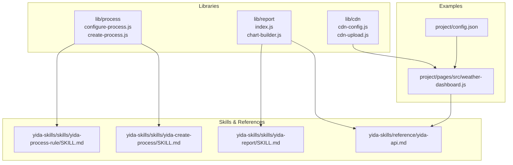
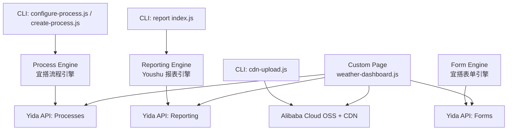
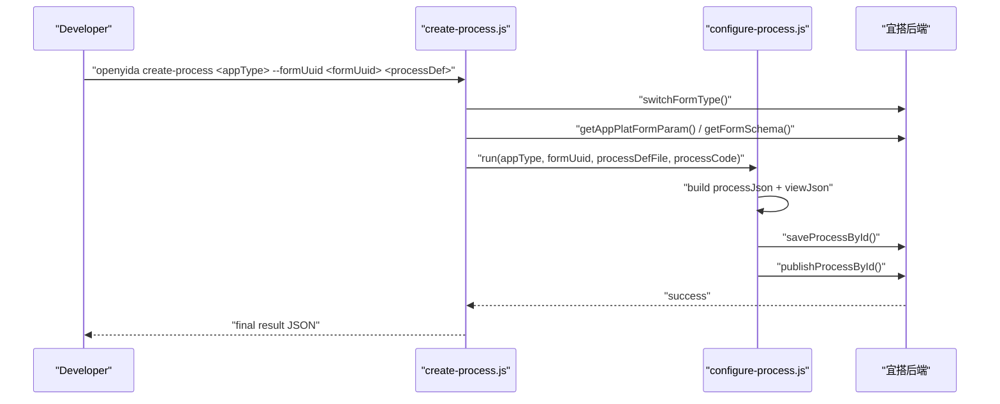
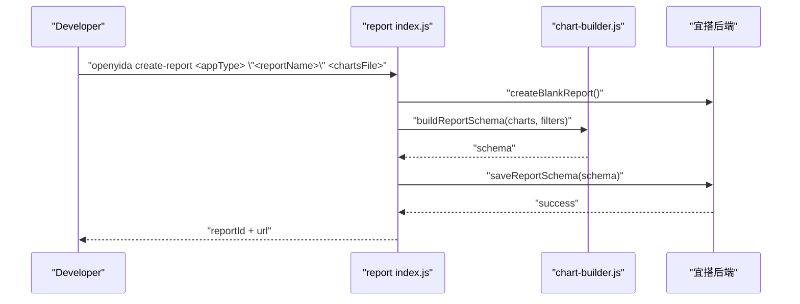
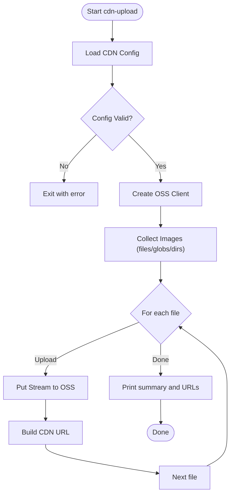
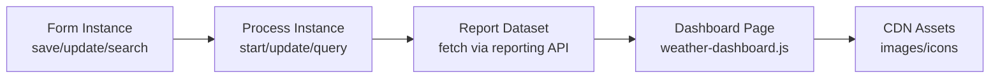
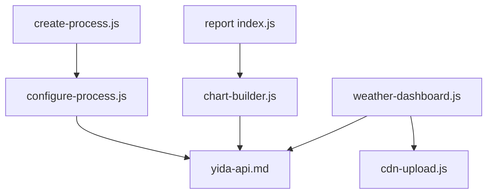

# Advanced Application Features

<cite>
**Referenced Files in This Document**
- [configure-process.js](file://lib/process/configure-process.js)
- [create-process.js](file://lib/process/create-process.js)
- [index.js](file://lib/report/index.js)
- [chart-builder.js](file://lib/report/chart-builder.js)
- [cdn-config.js](file://lib/cdn/cdn-config.js)
- [cdn-upload.js](file://lib/cdn/cdn-upload.js)
- [yida-api.md](file://yida-skills/reference/yida-api.md)
- [SKILL.md (yida-process-rule)](file://yida-skills/skills/yida-process-rule/SKILL.md)
- [SKILL.md (yida-create-process)](file://yida-skills/skills/yida-create-process/SKILL.md)
- [SKILL.md (yida-report)](file://yida-skills/skills/yida-report/SKILL.md)
- [weather-dashboard.js](file://project/pages/src/weather-dashboard.js)
- [config.json](file://project/config.json)
</cite>

## Table of Contents
1. [Introduction](#introduction)
2. [Project Structure](#project-structure)
3. [Core Components](#core-components)
4. [Architecture Overview](#architecture-overview)
5. [Detailed Component Analysis](#detailed-component-analysis)
6. [Dependency Analysis](#dependency-analysis)
7. [Performance Considerations](#performance-considerations)
8. [Troubleshooting Guide](#troubleshooting-guide)
9. [Conclusion](#conclusion)
10. [Appendices](#appendices)

## Introduction
This document explains advanced application development features in OpenYida with a focus on:
- Process workflows: automated business process configuration, approval chains, validation rules, and notifications
- Report integration: building dashboards with charts, filters, and real-time data binding
- CDN management: enterprise-grade image upload, storage, and caching via Alibaba Cloud OSS and CDN

It also demonstrates integration patterns among forms, processes, reports, and pages, and provides best practices for scalability and maintainability.

## Project Structure
OpenYida organizes advanced features under dedicated libraries and skills:
- Process workflow: lib/process (configuration and creation)
- Reports: lib/report (creation, schema building, and chart integration)
- CDN: lib/cdn (configuration and upload)
- Reference APIs and skills: yida-skills (usage patterns and examples)
- Example pages: project/pages/src (dashboard rendering and integration)

**Diagram sources**
- [configure-process.js:1-1035](file://lib/process/configure-process.js#L1-L1035)
- [create-process.js:1-301](file://lib/process/create-process.js#L1-L301)
- [index.js:1-282](file://lib/report/index.js#L1-L282)
- [chart-builder.js:1-800](file://lib/report/chart-builder.js#L1-L800)
- [cdn-config.js:1-173](file://lib/cdn/cdn-config.js#L1-L173)
- [cdn-upload.js:1-322](file://lib/cdn/cdn-upload.js#L1-L322)
- [SKILL.md (yida-process-rule):1-536](file://yida-skills/skills/yida-process-rule/SKILL.md#L1-L536)
- [SKILL.md (yida-create-process):1-204](file://yida-skills/skills/yida-create-process/SKILL.md#L1-L204)
- [SKILL.md (yida-report):1-775](file://yida-skills/skills/yida-report/SKILL.md#L1-L775)
- [yida-api.md:1-1281](file://yida-skills/reference/yida-api.md#L1-L1281)
- [weather-dashboard.js:1-374](file://project/pages/src/weather-dashboard.js#L1-L374)
- [config.json:1-5](file://project/config.json#L1-L5)

**Section sources**
- [configure-process.js:1-1035](file://lib/process/configure-process.js#L1-L1035)
- [create-process.js:1-301](file://lib/process/create-process.js#L1-L301)
- [index.js:1-282](file://lib/report/index.js#L1-L282)
- [chart-builder.js:1-800](file://lib/report/chart-builder.js#L1-L800)
- [cdn-config.js:1-173](file://lib/cdn/cdn-config.js#L1-L173)
- [cdn-upload.js:1-322](file://lib/cdn/cdn-upload.js#L1-L322)
- [SKILL.md (yida-process-rule):1-536](file://yida-skills/skills/yida-process-rule/SKILL.md#L1-L536)
- [SKILL.md (yida-create-process):1-204](file://yida-skills/skills/yida-create-process/SKILL.md#L1-L204)
- [SKILL.md (yida-report):1-775](file://yida-skills/skills/yida-report/SKILL.md#L1-L775)
- [yida-api.md:1-1281](file://yida-skills/reference/yida-api.md#L1-L1281)
- [weather-dashboard.js:1-374](file://project/pages/src/weather-dashboard.js#L1-L374)
- [config.json:1-5](file://project/config.json#L1-L5)

## Core Components
- Process workflow configuration and publishing
- Report creation with filters and chart datasets
- CDN configuration and image upload pipeline
- Cross-application API for forms, processes, and reporting
- Dashboard page integration with real-time updates

**Section sources**
- [configure-process.js:1-1035](file://lib/process/configure-process.js#L1-L1035)
- [create-process.js:1-301](file://lib/process/create-process.js#L1-L301)
- [index.js:1-282](file://lib/report/index.js#L1-L282)
- [chart-builder.js:1-800](file://lib/report/chart-builder.js#L1-L800)
- [cdn-config.js:1-173](file://lib/cdn/cdn-config.js#L1-L173)
- [cdn-upload.js:1-322](file://lib/cdn/cdn-upload.js#L1-L322)
- [yida-api.md:1-1281](file://yida-skills/reference/yida-api.md#L1-L1281)

## Architecture Overview
OpenYida’s advanced features integrate via:
- CLI-driven creation and configuration for processes and reports
- Backend APIs for forms, processes, and reporting
- Frontend pages leveraging cross-application APIs and optional CDN assets

**Diagram sources**
- [configure-process.js:1-1035](file://lib/process/configure-process.js#L1-L1035)
- [create-process.js:1-301](file://lib/process/create-process.js#L1-L301)
- [index.js:1-282](file://lib/report/index.js#L1-L282)
- [cdn-upload.js:1-322](file://lib/cdn/cdn-upload.js#L1-L322)
- [yida-api.md:1-1281](file://yida-skills/reference/yida-api.md#L1-L1281)
- [weather-dashboard.js:1-374](file://project/pages/src/weather-dashboard.js#L1-L374)

## Detailed Component Analysis

### Process Workflow Configuration
OpenYida supports:
- Approval nodes with actions (approve, disagree, save, forward, append, return)
- Conditional branching with AND/OR logic and nested routes
- Field permissions per node (READONLY/HIDDEN/NORMAL)
- Jump rules for return/redo flows
- Automatic process code discovery and publishing

**Diagram sources**
- [create-process.js:131-298](file://lib/process/create-process.js#L131-L298)
- [configure-process.js:724-800](file://lib/process/configure-process.js#L724-L800)

Key capabilities:
- Approval chain construction with actions and route rules
- Field-level permissions per node
- Conditional branches with embedded child nodes
- Automatic process code resolution and publishing

Best practices:
- Use AI-generated checks to ensure every field appears in behaviorList
- Add routeRules for return/redo scenarios
- Keep approval nodes focused on minimal editable fields

**Section sources**
- [configure-process.js:1-1035](file://lib/process/configure-process.js#L1-L1035)
- [SKILL.md (yida-process-rule):167-318](file://yida-skills/skills/yida-process-rule/SKILL.md#L167-L318)
- [SKILL.md (yida-create-process):142-148](file://yida-skills/skills/yida-create-process/SKILL.md#L142-L148)

### Report Creation and Chart Integration
OpenYida builds Yida report pages with:
- Filters (select/time/input) and linkage to charts
- Multiple chart types (bar, line, pie, combo, gauge, pivot, indicator)
- Dataset model maps with field definitions and aggregation rules
- Real-time data binding via reporting API

**Diagram sources**
- [index.js:96-271](file://lib/report/index.js#L96-L271)
- [chart-builder.js:116-515](file://lib/report/chart-builder.js#L116-L515)
- [SKILL.md (yida-report):664-775](file://yida-skills/skills/yida-report/SKILL.md#L664-L775)

Real-time data binding:
- Use reporting API to fetch dataset content and transform to chart-ready arrays
- Apply filters to drive multiple charts in a dashboard

**Section sources**
- [index.js:1-282](file://lib/report/index.js#L1-L282)
- [chart-builder.js:1-800](file://lib/report/chart-builder.js#L1-L800)
- [SKILL.md (yida-report):29-134](file://yida-skills/skills/yida-report/SKILL.md#L29-L134)

### CDN Configuration and Image Management
OpenYida integrates Alibaba Cloud OSS and CDN for enterprise image management:
- Secure configuration storage in user home directory
- Upload with unique filenames, optional compression, and batch support
- Domain and path customization, plus validation

**Diagram sources**
- [cdn-upload.js:167-262](file://lib/cdn/cdn-upload.js#L167-L262)
- [cdn-config.js:56-87](file://lib/cdn/cdn-config.js#L56-L87)

Operational guidance:
- Initialize config with access keys, CDN domain, and OSS bucket
- Use upload path prefixes to organize assets
- Enable compression for web delivery

**Section sources**
- [cdn-config.js:1-173](file://lib/cdn/cdn-config.js#L1-L173)
- [cdn-upload.js:1-322](file://lib/cdn/cdn-upload.js#L1-L322)

### Integration Patterns Across Forms, Processes, Reports, and Pages
OpenYida enables end-to-end integration:
- Forms: create and manage schemas; update and query instances
- Processes: start instances, update, and track tasks
- Reports: build dashboards and bind to real-time data
- Pages: render custom dashboards and call APIs

**Diagram sources**
- [yida-api.md:50-660](file://yida-skills/reference/yida-api.md#L50-L660)
- [weather-dashboard.js:1-374](file://project/pages/src/weather-dashboard.js#L1-L374)

Example integration:
- A dashboard page renders metrics and charts by calling reporting API and linking to form submission URLs
- CDN images are uploaded and referenced for branding and icons

**Section sources**
- [yida-api.md:1-1281](file://yida-skills/reference/yida-api.md#L1-L1281)
- [weather-dashboard.js:1-374](file://project/pages/src/weather-dashboard.js#L1-L374)

## Dependency Analysis
- Process creation depends on report creation for schema generation
- Report creation depends on chart-builder utilities and backend reporting APIs
- Dashboard pages depend on cross-application APIs and optional CDN assets
- CDN upload depends on OSS SDK and validated configuration

**Diagram sources**
- [create-process.js:1-301](file://lib/process/create-process.js#L1-L301)
- [configure-process.js:1-1035](file://lib/process/configure-process.js#L1-L1035)
- [index.js:1-282](file://lib/report/index.js#L1-L282)
- [chart-builder.js:1-800](file://lib/report/chart-builder.js#L1-L800)
- [cdn-upload.js:1-322](file://lib/cdn/cdn-upload.js#L1-L322)
- [yida-api.md:1-1281](file://yida-skills/reference/yida-api.md#L1-L1281)
- [weather-dashboard.js:1-374](file://project/pages/src/weather-dashboard.js#L1-L374)

**Section sources**
- [create-process.js:1-301](file://lib/process/create-process.js#L1-L301)
- [configure-process.js:1-1035](file://lib/process/configure-process.js#L1-L1035)
- [index.js:1-282](file://lib/report/index.js#L1-L282)
- [chart-builder.js:1-800](file://lib/report/chart-builder.js#L1-L800)
- [cdn-upload.js:1-322](file://lib/cdn/cdn-upload.js#L1-L322)
- [yida-api.md:1-1281](file://yida-skills/reference/yida-api.md#L1-L1281)
- [weather-dashboard.js:1-374](file://project/pages/src/weather-dashboard.js#L1-L374)

## Performance Considerations
- Prefer server-side aggregation via reporting API over client-side pagination for large datasets
- Limit report dataset sizes and use filters to reduce payload
- Compress images and leverage CDN caching for faster asset delivery
- Batch uploads to OSS to minimize connection overhead
- Use field-level permissions to reduce unnecessary UI updates during approvals

[No sources needed since this section provides general guidance]

## Troubleshooting Guide
Common issues and resolutions:
- Process code not found: use alternative extraction methods or manual retrieval
- Incomplete report data: ensure correct dataset keys and component IDs
- CDN upload failures: verify credentials, domain, and bucket configuration
- Cookies format errors: ensure array format for cookies in cached session

**Section sources**
- [create-process.js:235-277](file://lib/process/create-process.js#L235-L277)
- [SKILL.md (yida-report):175-252](file://yida-skills/skills/yida-report/SKILL.md#L175-L252)
- [cdn-upload.js:167-176](file://lib/cdn/cdn-upload.js#L167-L176)
- [yida-api.md:227-244](file://yida-skills/reference/yida-api.md#L227-L244)

## Conclusion
OpenYida provides a cohesive toolkit for building advanced, integrated business applications:
- Automated process workflows with approval chains, validation, and notifications
- Rich reporting with filters, charts, and real-time data binding
- Enterprise-grade CDN image management with secure configuration and optimized uploads
- Seamless integration across forms, processes, reports, and custom pages

Adopt the best practices outlined here to achieve scalable, maintainable, and high-performance solutions.

## Appendices

### Practical Examples
- Building a comprehensive business system:
  - Create a form with fields, convert to a process-enabled form, and configure approval chains with field permissions and jump rules
  - Build a report dashboard with filters and multiple chart types, then embed it in a custom page
  - Upload brand assets to CDN and reference them in the dashboard
- Real-world dashboard example:
  - See [weather-dashboard.js:1-374](file://project/pages/src/weather-dashboard.js#L1-L374) for a fully self-contained dashboard rendering multiple charts and links to forms

**Section sources**
- [SKILL.md (yida-create-process):59-87](file://yida-skills/skills/yida-create-process/SKILL.md#L59-L87)
- [SKILL.md (yida-process-rule):321-486](file://yida-skills/skills/yida-process-rule/SKILL.md#L321-L486)
- [SKILL.md (yida-report):256-325](file://yida-skills/skills/yida-report/SKILL.md#L256-L325)
- [weather-dashboard.js:1-374](file://project/pages/src/weather-dashboard.js#L1-L374)