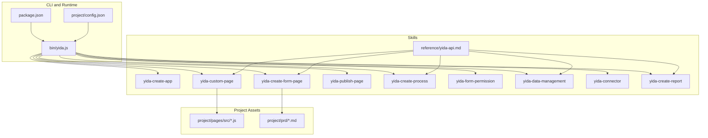
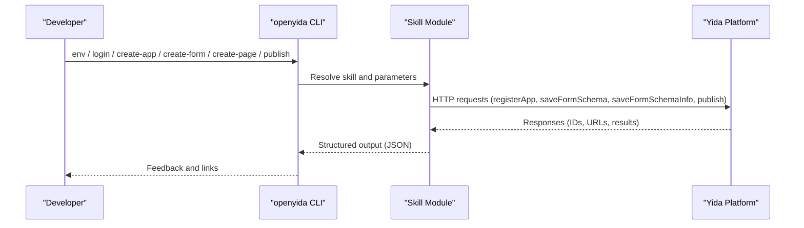
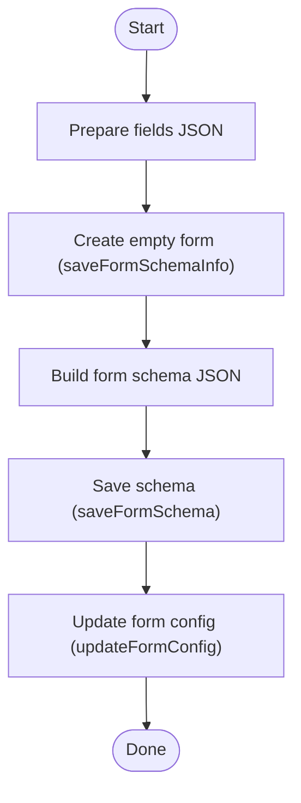
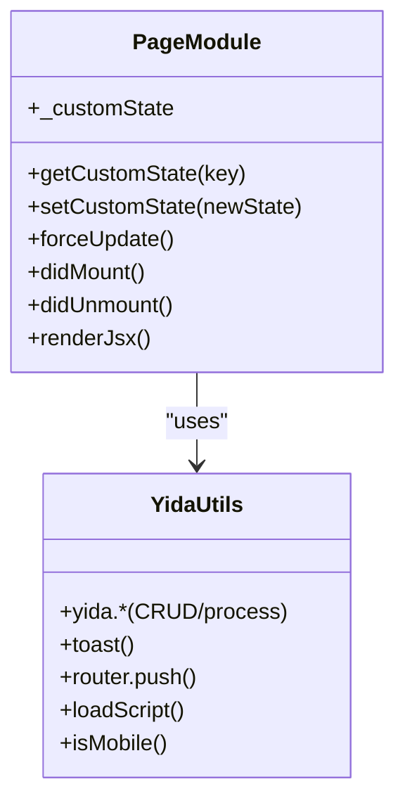
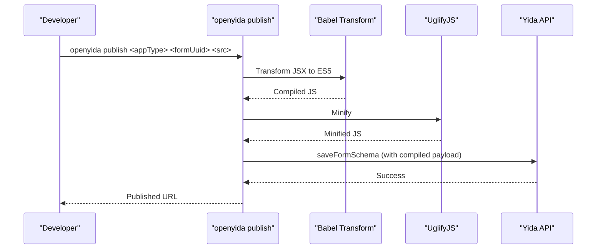
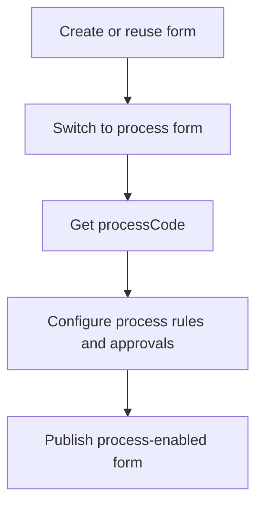
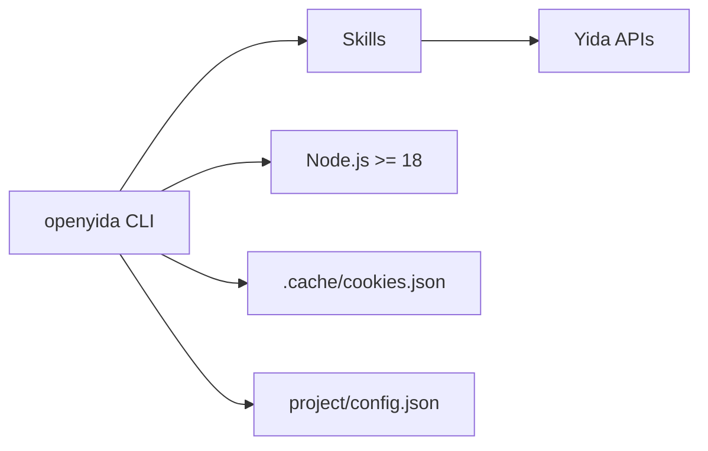

# Application Development

<cite>
**Referenced Files in This Document**
- [README.md](file://README.md)
- [package.json](file://package.json)
- [yida-skills/SKILL.md](file://yida-skills/SKILL.md)
- [yida-skills/skills/yida-create-app/SKILL.md](file://yida-skills/skills/yida-create-app/SKILL.md)
- [yida-skills/skills/yida-create-form-page/SKILL.md](file://yida-skills/skills/yida-create-form-page/SKILL.md)
- [yida-skills/skills/yida-custom-page/SKILL.md](file://yida-skills/skills/yida-custom-page/SKILL.md)
- [yida-skills/skills/yida-publish-page/SKILL.md](file://yida-skills/skills/yida-publish-page/SKILL.md)
- [yida-skills/skills/yida-create-process/SKILL.md](file://yida-skills/skills/yida-create-process/SKILL.md)
- [yida-skills/skills/yida-form-permission/SKILL.md](file://yida-skills/skills/yida-form-permission/SKILL.md)
- [yida-skills/skills/yida-data-management/SKILL.md](file://yida-skills/skills/yida-data-management/SKILL.md)
- [yida-skills/skills/yida-connector/SKILL.md](file://yida-skills/skills/yida-connector/SKILL.md)
- [yida-skills/skills/yida-create-report/SKILL.md](file://yida-skills/skills/yida-create-report/SKILL.md)
- [yida-skills/reference/yida-api.md](file://yida-skills/reference/yida-api.md)
- [project/config.json](file://project/config.json)
- [project/pages/src/demo-birthday-game.js](file://project/pages/src/demo-birthday-game.js)
- [project/pages/src/demo-salary-calculator.js](file://project/pages/src/demo-salary-calculator.js)
</cite>

## Table of Contents
1. [Introduction](#introduction)
2. [Project Structure](#project-structure)
3. [Core Components](#core-components)
4. [Architecture Overview](#architecture-overview)
5. [Detailed Component Analysis](#detailed-component-analysis)
6. [Dependency Analysis](#dependency-analysis)
7. [Performance Considerations](#performance-considerations)
8. [Troubleshooting Guide](#troubleshooting-guide)
9. [Conclusion](#conclusion)
10. [Appendices](#appendices)

## Introduction
This document explains how to develop Yida low-code applications end-to-end using OpenYida’s AI-assisted toolchain. It covers the complete lifecycle from natural language requirements to deployed applications, including form schema creation, field types and validation, custom page development with React-like JSX, publishing and deployment, AI-assisted translation from prompts to schema and code, permissions, process integration, reports, and best practices for building complex systems such as IPD workflows and CRM applications.

OpenYida provides:
- A CLI that unifies environment detection, authentication, app/page/form creation, publishing, and integrations.
- Skills for app creation, form design, custom page development, process configuration, permissions, data management, connectors, and reporting.
- Example pages demonstrating interactive UIs and state management patterns.

## Project Structure
At a high level, the repository organizes capabilities into:
- CLI and runtime: binaries and scripts for environment detection, login, and publishing.
- Skills: modular, composable capabilities for each stage of development.
- Project assets: example pages and PRD documents.
- Reference docs: API matrices and guidelines.

**Diagram sources**
- [package.json:1-73](file://package.json#L1-L73)
- [yida-skills/SKILL.md:1-235](file://yida-skills/SKILL.md#L1-L235)
- [project/config.json:1-5](file://project/config.json#L1-L5)

**Section sources**
- [README.md:1-223](file://README.md#L1-L223)
- [package.json:1-73](file://package.json#L1-L73)
- [yida-skills/SKILL.md:1-235](file://yida-skills/SKILL.md#L1-L235)
- [project/config.json:1-5](file://project/config.json#L1-L5)

## Core Components
- CLI commands: Environment detection, login/logout, app creation, form creation/update, custom page creation/publishing, permissions, process configuration, data management, connectors, and reporting.
- Skills: Self-contained capabilities for each phase of development, with explicit parameters, workflows, and integration points.
- Example pages: Demonstrations of state management, rendering, and interactivity in a Yida custom page environment.
- Reference APIs: Consistent JS API surface for form/process/data operations and utilities.

Key capabilities:
- App creation: Register a new Yida application and obtain appType.
- Form schema creation: Define fields, layouts, themes, and validations; update schemas incrementally.
- Custom page development: Build React-like JSX pages with state management, lifecycle hooks, and Yida utilities.
- Publishing: Compile and deploy custom pages into Yida.
- Process integration: Convert forms to process-enabled forms and configure approvals.
- Permissions: Manage role members, data scope, and operational permissions.
- Data management: Query, create, and update form and process instances; manage tasks.
- Connectors: Integrate external systems via HTTP connectors with multiple auth schemes.
- Reporting: Create dashboards with charts and filters; append charts to existing reports.

**Section sources**
- [README.md:77-135](file://README.md#L77-L135)
- [yida-skills/skills/yida-create-app/SKILL.md:1-159](file://yida-skills/skills/yida-create-app/SKILL.md#L1-L159)
- [yida-skills/skills/yida-create-form-page/SKILL.md:1-658](file://yida-skills/skills/yida-create-form-page/SKILL.md#L1-L658)
- [yida-skills/skills/yida-custom-page/SKILL.md:1-948](file://yida-skills/skills/yida-custom-page/SKILL.md#L1-L948)
- [yida-skills/skills/yida-publish-page/SKILL.md:1-143](file://yida-skills/skills/yida-publish-page/SKILL.md#L1-L143)
- [yida-skills/skills/yida-create-process/SKILL.md:1-204](file://yida-skills/skills/yida-create-process/SKILL.md#L1-L204)
- [yida-skills/skills/yida-form-permission/SKILL.md:1-207](file://yida-skills/skills/yida-form-permission/SKILL.md#L1-L207)
- [yida-skills/skills/yida-data-management/SKILL.md:1-302](file://yida-skills/skills/yida-data-management/SKILL.md#L1-L302)
- [yida-skills/skills/yida-connector/SKILL.md:1-517](file://yida-skills/skills/yida-connector/SKILL.md#L1-L517)
- [yida-skills/skills/yida-create-report/SKILL.md:1-339](file://yida-skills/skills/yida-create-report/SKILL.md#L1-L339)
- [yida-skills/reference/yida-api.md:1-200](file://yida-skills/reference/yida-api.md#L1-L200)

## Architecture Overview
OpenYida’s development architecture is a skill-driven pipeline orchestrated by the CLI. The CLI reads environment and authentication state, invokes skills, and coordinates with Yida APIs to create, configure, and publish applications.

**Diagram sources**
- [yida-skills/SKILL.md:99-121](file://yida-skills/SKILL.md#L99-L121)
- [yida-skills/skills/yida-create-app/SKILL.md:87-94](file://yida-skills/skills/yida-create-app/SKILL.md#L87-L94)
- [yida-skills/skills/yida-create-form-page/SKILL.md:475-500](file://yida-skills/skills/yida-create-form-page/SKILL.md#L475-L500)
- [yida-skills/skills/yida-publish-page/SKILL.md:69-76](file://yida-skills/skills/yida-publish-page/SKILL.md#L69-L76)

## Detailed Component Analysis

### Form Schema Creation and Validation
- Create or update forms with a declarative field definition JSON. Supports 19+ field types (text, number, selection, date, attachment, image, table, association, serial number, etc.), layout/theme options, and per-field behavior/visibility.
- Validation defaults and attributes are preconfigured per field type (e.g., max length, units, searchable selects).
- Incremental updates via change sets (add/delete/update) with positional insertion and nested children for table fields.
- Auto-generation of formulas for serial number fields using corpId/appType/formUuid/fieldId.

**Diagram sources**
- [yida-skills/skills/yida-create-form-page/SKILL.md:475-499](file://yida-skills/skills/yida-create-form-page/SKILL.md#L475-L499)

**Section sources**
- [yida-skills/skills/yida-create-form-page/SKILL.md:113-554](file://yida-skills/skills/yida-create-form-page/SKILL.md#L113-L554)
- [yida-skills/reference/yida-api.md:26-31](file://yida-skills/reference/yida-api.md#L26-L31)

### Field Types, Validation, and Behavior
- Field types include TextField, TextareaField, RadioField, SelectField, CheckboxField, MultiSelectField, NumberField, RateField, DateField, CascadeDateField, EmployeeField, DepartmentSelectField, CountrySelectField, AddressField, AttachmentField, ImageField, TableField, AssociationFormField, SerialNumberField.
- Defaults and special attributes are defined per type (e.g., precision, thousands separators, searchable selects, cascading dates, employee selection modes).
- Validation rules and behavior (required, readonly, hidden) are configurable per field.

**Section sources**
- [yida-skills/skills/yida-create-form-page/SKILL.md:146-427](file://yida-skills/skills/yida-create-form-page/SKILL.md#L146-L427)

### Custom Page Development with React-like JSX
- Pages are single-file JSX components compatible with React 16. No hooks; state managed via exported functions and a shared custom state object.
- Lifecycle hooks: didMount, didUnmount; rendering via renderJsx; forced re-render via timestamp-based setState.
- Style system: inline style objects only; global color/typography/spacing tokens recommended.
- Data access: this.utils.yida.* APIs for CRUD, process operations, and utilities (toast, router, loadScript, etc.).
- Compilation and deployment: Babel transform + UglifyJS compression, then injected into Yida schema and published.

**Diagram sources**
- [yida-skills/skills/yida-custom-page/SKILL.md:400-535](file://yida-skills/skills/yida-custom-page/SKILL.md#L400-L535)
- [yida-skills/reference/yida-api.md:1-48](file://yida-skills/reference/yida-api.md#L1-L48)

**Section sources**
- [yida-skills/skills/yida-custom-page/SKILL.md:398-692](file://yida-skills/skills/yida-custom-page/SKILL.md#L398-L692)
- [project/pages/src/demo-birthday-game.js:1-834](file://project/pages/src/demo-birthday-game.js#L1-L834)
- [project/pages/src/demo-salary-calculator.js:1-905](file://project/pages/src/demo-salary-calculator.js#L1-L905)

### Publishing Workflow
- Compile: Babel transform + UglifyJS compression.
- Inject: Build schema dynamically with compiled source and metadata.
- Authenticate: Read cookies and refresh as needed.
- Publish: Call saveFormSchema; update form config for custom pages.

**Diagram sources**
- [yida-skills/skills/yida-publish-page/SKILL.md:69-76](file://yida-skills/skills/yida-publish-page/SKILL.md#L69-L76)

**Section sources**
- [yida-skills/skills/yida-publish-page/SKILL.md:1-143](file://yida-skills/skills/yida-publish-page/SKILL.md#L1-L143)

### AI-Assisted Development and Prompt-to-Schema/Code
- Natural language prompts drive the creation of complete applications, including forms, pages, and reports.
- The CLI orchestrates environment detection and authentication automatically, then executes skills based on prompts.
- Example prompts and workflows are documented to guide users in generating apps from scratch.

**Section sources**
- [README.md:167-179](file://README.md#L167-L179)
- [yida-skills/SKILL.md:99-121](file://yida-skills/SKILL.md#L99-L121)

### Process Integration and Approval Workflows
- Convert a form into a process-enabled form and configure approval nodes, routing, and field-level permissions.
- AI can auto-generate field permissions and route rules for multi-node approvals.

**Diagram sources**
- [yida-skills/skills/yida-create-process/SKILL.md:89-107](file://yida-skills/skills/yida-create-process/SKILL.md#L89-L107)

**Section sources**
- [yida-skills/skills/yida-create-process/SKILL.md:1-204](file://yida-skills/skills/yida-create-process/SKILL.md#L1-L204)

### Permissions and Access Control
- Query and manage permission packages: members, data scope, and operational permissions.
- Supports granular controls for viewing/editing/deleting/export/printing and batch operations.

**Section sources**
- [yida-skills/skills/yida-form-permission/SKILL.md:1-207](file://yida-skills/skills/yida-form-permission/SKILL.md#L1-L207)

### Data Management and Task Center
- Unified CLI for querying, creating, and updating form and process instances.
- Task center operations: todo/done/submitted/cc tasks.
- Clear separation between form and process APIs.

**Section sources**
- [yida-skills/skills/yida-data-management/SKILL.md:1-302](file://yida-skills/skills/yida-data-management/SKILL.md#L1-L302)

### Connectors and Integrations
- Create and manage HTTP connectors with multiple auth schemes (Basic, API Key, DingTalk Open, Aliyun API Gateway, DingTrust).
- Smart-create workflow parses curl/doc and suggests matching connectors.
- Test connectors with automatic parameter injection and account selection.

**Section sources**
- [yida-skills/skills/yida-connector/SKILL.md:1-517](file://yida-skills/skills/yida-connector/SKILL.md#L1-L517)

### Reports and Dashboards
- Create reports with 9 chart types and filter联动.
- Append charts to existing reports with automatic layout and component map updates.

**Section sources**
- [yida-skills/skills/yida-create-report/SKILL.md:1-339](file://yida-skills/skills/yida-create-report/SKILL.md#L1-L339)

### Practical Examples: Building Complex Systems
- IPD workflows: Combine process-enabled forms with reporting and dashboards to visualize stages and KPIs.
- CRM applications: Use forms for leads/customers, process for approvals, and reports for sales metrics.
- Utility tools: Leverage custom pages for interactive calculators and games, integrating with form data where needed.

[No sources needed since this section provides conceptual guidance]

## Dependency Analysis
OpenYida’s CLI depends on Node.js and integrates with Yida APIs. Skills encapsulate domain-specific workflows and rely on consistent authentication and CSRF handling.

**Diagram sources**
- [package.json:69-72](file://package.json#L69-L72)
- [yida-skills/SKILL.md:37-70](file://yida-skills/SKILL.md#L37-L70)
- [project/config.json:1-5](file://project/config.json#L1-L5)

**Section sources**
- [package.json:1-73](file://package.json#L1-L73)
- [yida-skills/SKILL.md:37-70](file://yida-skills/SKILL.md#L37-L70)
- [project/config.json:1-5](file://project/config.json#L1-L5)

## Performance Considerations
- Prefer non-controlled inputs to avoid excessive re-renders during typing.
- Batch state updates and defer heavy computations to background tasks.
- Use pagination limits (≤100) for list queries to avoid timeouts.
- Minimize DOM churn by conditionally rendering content and avoiding unnecessary component recreation.

[No sources needed since this section provides general guidance]

## Troubleshooting Guide
Common issues and resolutions:
- Login/session failures: Re-run login; ensure cookies are present and valid.
- CorpId mismatch: Switch organization or create a new app in the current organization.
- Schema validation errors: Confirm field IDs via get-schema; verify change sets and positions.
- Deployment failures: Check compilation logs; ensure Babel/Uglify steps succeed; confirm CSRF token presence.
- Process not found: Retrieve processCode from app platform params or form schema; reconfigure if needed.
- Connector errors: Validate auth credentials and endpoint; test with connector test command.

**Section sources**
- [yida-skills/SKILL.md:211-235](file://yida-skills/SKILL.md#L211-L235)
- [yida-skills/skills/yida-publish-page/SKILL.md:109-118](file://yida-skills/skills/yida-publish-page/SKILL.md#L109-L118)
- [yida-skills/skills/yida-create-process/SKILL.md:192-204](file://yida-skills/skills/yida-create-process/SKILL.md#L192-L204)
- [yida-skills/skills/yida-connector/SKILL.md:504-517](file://yida-skills/skills/yida-connector/SKILL.md#L504-L517)

## Conclusion
OpenYida enables rapid, AI-assisted development of Yida applications from natural language to production-ready pages and processes. By leveraging structured skills, consistent APIs, and example pages, teams can build robust, scalable low-code solutions including complex workflows, CRM systems, and utility tools while maintaining control over permissions, integrations, and reporting.

[No sources needed since this section summarizes without analyzing specific files]

## Appendices

### Best Practices
- Naming and organization:
  - Keep PRD documents in project/prd with concise titles.
  - Store temporary IDs in .cache/<project>-schema.json.
  - Use semantic field aliases mapped to field IDs.
- Development workflow:
  - Always detect environment and ensure login before running skills.
  - Use get-schema to confirm field IDs before publishing pages.
  - Test connectors and reports before integrating into production apps.
- Code quality:
  - Avoid controlled inputs for text fields to prevent re-render loops.
  - Use global style tokens and consistent spacing.
  - Keep renderJsx minimal and delegate logic to exported functions.

**Section sources**
- [yida-skills/SKILL.md:148-192](file://yida-skills/SKILL.md#L148-L192)
- [yida-skills/skills/yida-custom-page/SKILL.md:606-692](file://yida-skills/skills/yida-custom-page/SKILL.md#L606-L692)