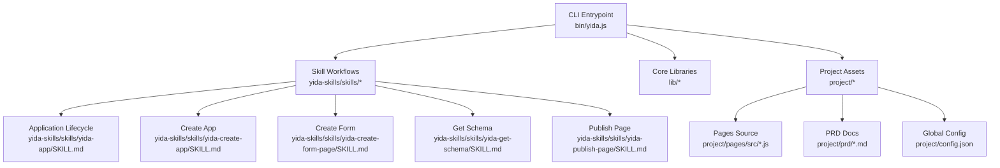
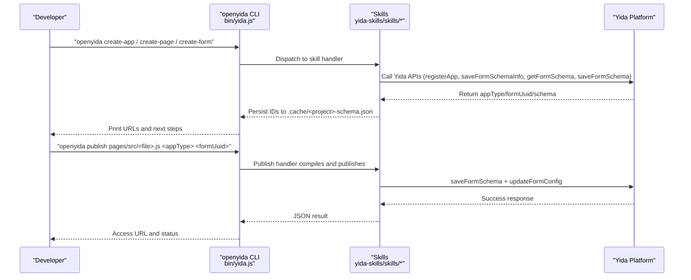
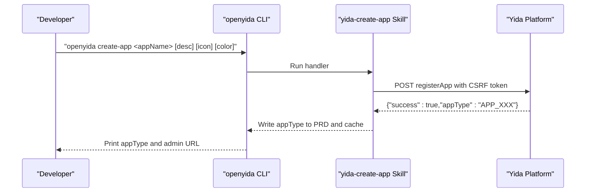
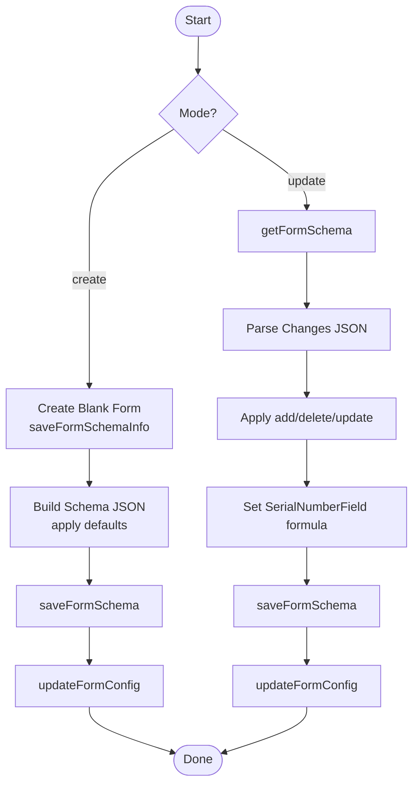
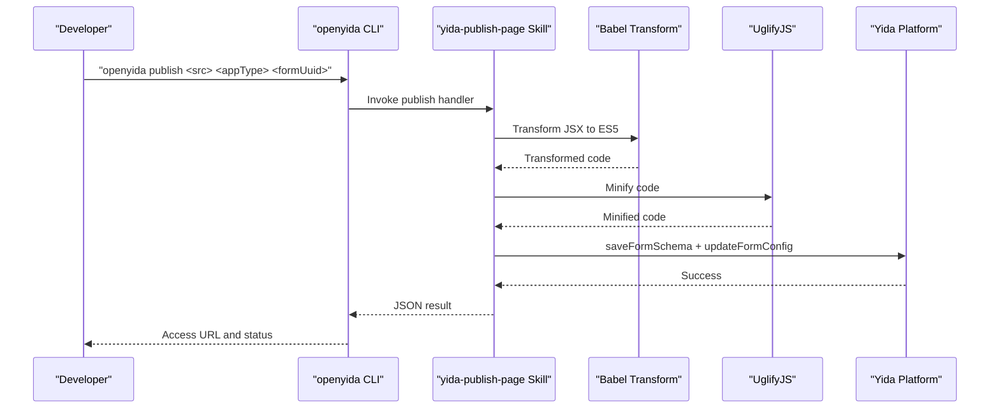
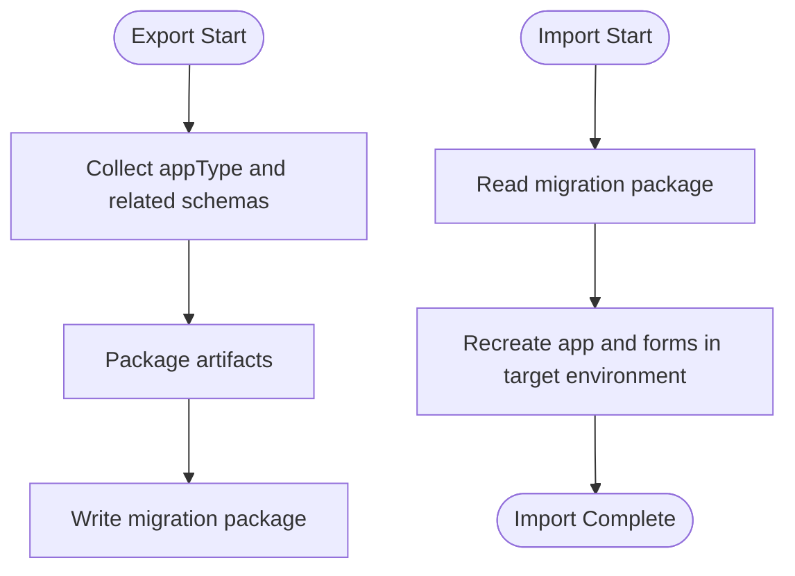
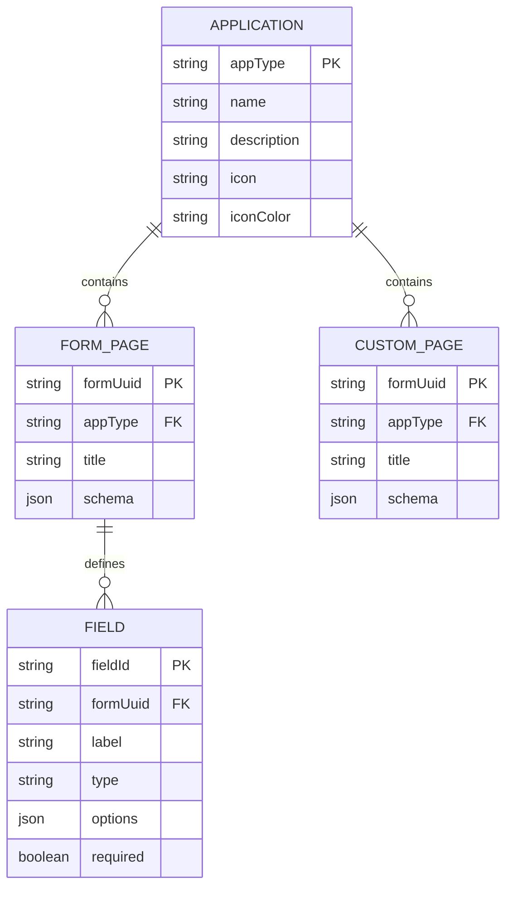
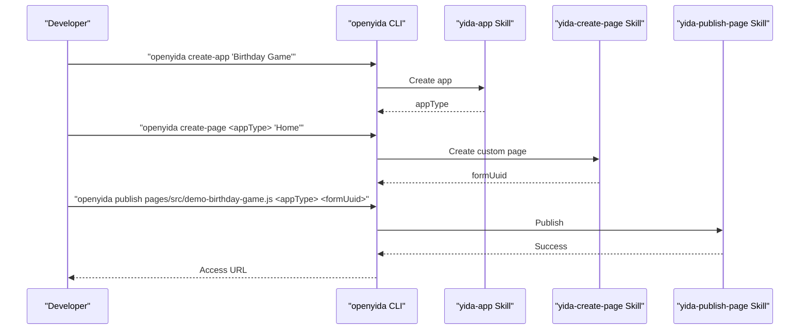

# Application Lifecycle Management

<cite>
**Referenced Files in This Document**
- [README.md](file://README.md)
- [package.json](file://package.json)
- [yida-skills/SKILL.md](file://yida-skills/SKILL.md)
- [yida-skills/skills/yida-app/SKILL.md](file://yida-skills/skills/yida-app/SKILL.md)
- [yida-skills/skills/yida-create-app/SKILL.md](file://yida-skills/skills/yida-create-app/SKILL.md)
- [yida-skills/skills/yida-create-form-page/SKILL.md](file://yida-skills/skills/yida-create-form-page/SKILL.md)
- [yida-skills/skills/yida-get-schema/SKILL.md](file://yida-skills/skills/yida-get-schema/SKILL.md)
- [yida-skills/skills/yida-publish-page/SKILL.md](file://yida-skills/skills/yida-publish-page/SKILL.md)
- [bin/yida.js](file://bin/yida.js)
- [project/config.json](file://project/config.json)
- [project/pages/src/demo-birthday-game.js](file://project/pages/src/demo-birthday-game.js)
- [project/prd/demo-birthday-game.md](file://project/prd/demo-birthday-game.md)
</cite>

## Table of Contents
1. [Introduction](#introduction)
2. [Project Structure](#project-structure)
3. [Core Components](#core-components)
4. [Architecture Overview](#architecture-overview)
5. [Detailed Component Analysis](#detailed-component-analysis)
6. [Dependency Analysis](#dependency-analysis)
7. [Performance Considerations](#performance-considerations)
8. [Troubleshooting Guide](#troubleshooting-guide)
9. [Conclusion](#conclusion)
10. [Appendices](#appendices)

## Introduction
This document explains the complete application lifecycle for OpenYida’s Yida low-code development workflow. It covers how to transform natural language requirements into deployed Yida applications, including AI-assisted schema generation and automated code creation. It also documents application export/import for migration and backup, configuration and branding options, and the relationships among applications, forms, pages, and data models. Practical examples demonstrate building complex systems such as IPD workflows, CRM applications, and utility tools. Finally, it provides troubleshooting guidance for common development issues, schema validation errors, and deployment failures, along with versioning, migration strategies, and best practices.

## Project Structure
OpenYida is distributed as a CLI package that orchestrates Yida application lifecycle commands. The repository organizes core CLI logic, skill-based workflows, and example assets under a clear project layout.

Key elements:
- CLI entrypoint: bin/yida.js
- Skill-based workflows: yida-skills/skills/*
- Example pages and PRD docs: project/pages/src/*.js and project/prd/*.md
- Global configuration: project/config.json
- Package metadata and dependencies: package.json

**Diagram sources**
- [bin/yida.js:1-521](file://bin/yida.js#L1-L521)
- [yida-skills/skills/yida-app/SKILL.md:1-395](file://yida-skills/skills/yida-app/SKILL.md#L1-L395)
- [yida-skills/skills/yida-create-app/SKILL.md:1-159](file://yida-skills/skills/yida-create-app/SKILL.md#L1-L159)
- [yida-skills/skills/yida-create-form-page/SKILL.md:1-658](file://yida-skills/skills/yida-create-form-page/SKILL.md#L1-L658)
- [yida-skills/skills/yida-get-schema/SKILL.md:1-91](file://yida-skills/skills/yida-get-schema/SKILL.md#L1-L91)
- [yida-skills/skills/yida-publish-page/SKILL.md:1-143](file://yida-skills/skills/yida-publish-page/SKILL.md#L1-L143)
- [project/config.json:1-5](file://project/config.json#L1-L5)

**Section sources**
- [README.md:1-223](file://README.md#L1-L223)
- [package.json:1-74](file://package.json#L1-L74)
- [bin/yida.js:1-521](file://bin/yida.js#L1-L521)
- [project/config.json:1-5](file://project/config.json#L1-L5)

## Core Components
- CLI Entrypoint: bin/yida.js routes commands to appropriate modules and prints help/version information.
- Skill Workflows: yida-skills/skills/* define end-to-end workflows for creating apps, forms, pages, and publishing code.
- Application Lifecycle: yida-skills/skills/yida-app/SKILL.md describes the end-to-end process from requirements to deployment.
- Export/Import: bin/yida.js exposes export and import commands for application migration and backup.
- Configuration: project/config.json stores base URLs used by CLI commands.

Key capabilities:
- Zero-config, AI-driven development with natural language prompts.
- Automated schema generation and code publishing.
- Migration via export/import of application artifacts.
- Organization switching and login management.

**Section sources**
- [bin/yida.js:1-521](file://bin/yida.js#L1-L521)
- [yida-skills/SKILL.md:1-235](file://yida-skills/SKILL.md#L1-L235)
- [yida-skills/skills/yida-app/SKILL.md:1-395](file://yida-skills/skills/yida-app/SKILL.md#L1-L395)
- [project/config.json:1-5](file://project/config.json#L1-L5)

## Architecture Overview
The lifecycle spans three stages:
1) Requirements to Schema: AI and CLI orchestrate app creation, form definition, and schema retrieval.
2) Code to Deployment: Custom page code is compiled, transformed, and published to Yida.
3) Operations: Export/import for migration, permissions, connectors, and reports.

**Diagram sources**
- [bin/yida.js:1-521](file://bin/yida.js#L1-L521)
- [yida-skills/skills/yida-create-app/SKILL.md:1-159](file://yida-skills/skills/yida-create-app/SKILL.md#L1-L159)
- [yida-skills/skills/yida-create-form-page/SKILL.md:1-658](file://yida-skills/skills/yida-create-form-page/SKILL.md#L1-L658)
- [yida-skills/skills/yida-get-schema/SKILL.md:1-91](file://yida-skills/skills/yida-get-schema/SKILL.md#L1-L91)
- [yida-skills/skills/yida-publish-page/SKILL.md:1-143](file://yida-skills/skills/yida-publish-page/SKILL.md#L1-L143)

## Detailed Component Analysis

### Application Creation Workflow
- Purpose: Create a Yida application with optional branding and theme color.
- Inputs: Name, description, icon, icon color.
- Outputs: appType and admin URL.
- Integration: Uses registerApp endpoint; writes appType to PRD and caches IDs in .cache.

**Diagram sources**
- [bin/yida.js:243-247](file://bin/yida.js#L243-L247)
- [yida-skills/skills/yida-create-app/SKILL.md:1-159](file://yida-skills/skills/yida-create-app/SKILL.md#L1-L159)

**Section sources**
- [yida-skills/skills/yida-create-app/SKILL.md:1-159](file://yida-skills/skills/yida-create-app/SKILL.md#L1-L159)
- [yida-skills/skills/yida-app/SKILL.md:102-113](file://yida-skills/skills/yida-app/SKILL.md#L102-L113)

### Form Schema Generation and Updates
- Purpose: Create or update form pages with precise field definitions and validations.
- Modes:
  - create: Build blank form, generate schema, apply configuration.
  - update: Retrieve schema, apply changes (add/delete/update), regenerate formula for SerialNumberField, save and reconfigure.
- Data Model: Fields array with types, options, visibility, behavior, and nested children.

**Diagram sources**
- [yida-skills/skills/yida-create-form-page/SKILL.md:1-658](file://yida-skills/skills/yida-create-form-page/SKILL.md#L1-L658)

**Section sources**
- [yida-skills/skills/yida-create-form-page/SKILL.md:1-658](file://yida-skills/skills/yida-create-form-page/SKILL.md#L1-L658)
- [yida-skills/skills/yida-get-schema/SKILL.md:1-91](file://yida-skills/skills/yida-get-schema/SKILL.md#L1-L91)

### Custom Page Publishing Pipeline
- Purpose: Compile JSX to ES5, minify, inject platform overrides, and publish to Yida.
- Steps:
  1) Babel transform JSX -> ES5.
  2) UglifyJS minification.
  3) Dynamic Schema build embedding source and compiled code.
  4) Read login cookies; auto-trigger QR login if needed.
  5) saveFormSchema and updateFormConfig (MINI_RESOURCE differs for custom pages).
- Output: Published page URL and version info.

**Diagram sources**
- [bin/yida.js:268-280](file://bin/yida.js#L268-L280)
- [yida-skills/skills/yida-publish-page/SKILL.md:1-143](file://yida-skills/skills/yida-publish-page/SKILL.md#L1-L143)

**Section sources**
- [yida-skills/skills/yida-publish-page/SKILL.md:1-143](file://yida-skills/skills/yida-publish-page/SKILL.md#L1-L143)

### Export and Import for Migration and Backup
- Purpose: Export an application’s form schemas and related artifacts to a migration package; import to rebuild in another environment.
- Commands:
  - Export: openyida export <appType> [output]
  - Import: openyida import <file> [name]
- Use Cases: Disaster recovery, environment handover, version control of schemas.

**Diagram sources**
- [bin/yida.js:343-365](file://bin/yida.js#L343-L365)

**Section sources**
- [bin/yida.js:31-32](file://bin/yida.js#L31-L32)
- [bin/yida.js:343-365](file://bin/yida.js#L343-L365)

### Relationship Between Applications, Forms, Pages, and Data Models
- Application: Container with appType and branding; created via registerApp.
- Form: Data collection surface with formUuid; built from field definitions and stored via saveFormSchema.
- Page: Presentation surface (custom or submission); associated with formUuid; published via saveFormSchema.
- Data Model: Field-level definitions (types, options, visibility, behavior) and nested structures (TableField children).

**Diagram sources**
- [yida-skills/skills/yida-create-app/SKILL.md:104-130](file://yida-skills/skills/yida-create-app/SKILL.md#L104-L130)
- [yida-skills/skills/yida-create-form-page/SKILL.md:113-128](file://yida-skills/skills/yida-create-form-page/SKILL.md#L113-L128)
- [yida-skills/skills/yida-publish-page/SKILL.md:71-75](file://yida-skills/skills/yida-publish-page/SKILL.md#L71-L75)

**Section sources**
- [yida-skills/skills/yida-create-form-page/SKILL.md:113-128](file://yida-skills/skills/yida-create-form-page/SKILL.md#L113-L128)
- [yida-skills/skills/yida-publish-page/SKILL.md:71-75](file://yida-skills/skills/yida-publish-page/SKILL.md#L71-L75)

### Practical Examples

#### Building a Birthday Game Utility
- Requirements: Welcome screen, candle-blowing game, celebration animations.
- Steps:
  1) Create app and record appType.
  2) Create a custom page with formUuid.
  3) Optionally create a form to store player stats.
  4) Implement pages/src/demo-birthday-game.js per custom page guidelines.
  5) Publish and share the page URL.

**Diagram sources**
- [yida-skills/skills/yida-app/SKILL.md:32-60](file://yida-skills/skills/yida-app/SKILL.md#L32-L60)
- [yida-skills/skills/yida-create-app/SKILL.md:33-42](file://yida-skills/skills/yida-create-app/SKILL.md#L33-L42)
- [yida-skills/skills/yida-publish-page/SKILL.md:34-43](file://yida-skills/skills/yida-publish-page/SKILL.md#L34-L43)
- [project/pages/src/demo-birthday-game.js:1-200](file://project/pages/src/demo-birthday-game.js#L1-L200)

**Section sources**
- [yida-skills/skills/yida-app/SKILL.md:32-60](file://yida-skills/skills/yida-app/SKILL.md#L32-L60)
- [project/prd/demo-birthday-game.md:1-39](file://project/prd/demo-birthday-game.md#L1-L39)

#### Building an IPD Workflow System
- Requirements: Multi-form workflow spanning design, verification, and release stages.
- Steps:
  1) Create app with corporate branding.
  2) Create form pages for each stage (design review, testing, approval).
  3) Use AssociationFormField to link related records across forms.
  4) Publish custom dashboards to visualize progress.
  5) Configure permissions and sharing as needed.

Best practices:
- Use SerialNumberField for traceability.
- Keep field labels consistent across forms.
- Store IDs in .cache/<project>-schema.json for reuse.

**Section sources**
- [yida-skills/skills/yida-create-form-page/SKILL.md:402-427](file://yida-skills/skills/yida-create-form-page/SKILL.md#L402-L427)
- [yida-skills/skills/yida-create-form-page/SKILL.md:398-401](file://yida-skills/skills/yida-create-form-page/SKILL.md#L398-L401)

#### Building a CRM Application
- Requirements: Lead capture, opportunity tracking, and reporting.
- Steps:
  1) Create app and CRM forms (Lead, Opportunity, Activity).
  2) Define picklists and formulas for probability and value.
  3) Publish custom reporting pages and dashboards.
  4) Configure connectors to external systems if needed.

**Section sources**
- [yida-skills/skills/yida-create-form-page/SKILL.md:510-533](file://yida-skills/skills/yida-create-form-page/SKILL.md#L510-L533)

## Dependency Analysis
- CLI depends on skill modules for each workflow.
- Skills depend on Yida APIs for app, form, and page operations.
- Project configuration influences base URLs used during login and publishing.
- Temporary schema IDs are cached in .cache for subsequent steps.

```mermaid
graph TB
YidaJS["bin/yida.js"] --> CreateApp["lib/app/create-app.js"]
YidaJS --> CreatePage["lib/app/create-page.js"]
YidaJS --> CreateForm["lib/app/create-form.js"]
YidaJS --> GetSchema["lib/app/get-schema.js"]
YidaJS --> Publish["lib/app/publish.js"]
YidaJS --> Export["lib/app/export-app.js"]
YidaJS --> Import["lib/app/import-app.js"]
YidaJS --> UpdateFormCfg["lib/app/update-form-config.js"]
YidaJS --> Doctor["lib/core/doctor.js"]
YidaJS --> Auth["lib/auth/*"]
YidaJS --> PageCfg["lib/page-config/*"]
YidaJS --> Data["lib/data-management.js"]
YidaJS --> Report["lib/report/*"]
YidaJS --> Connector["lib/connector/*"]
YidaJS --> Permission["lib/permission/*"]
YidaJS --> Process["lib/process/*"]
YidaJS --> CDN["lib/cdn/*"]
YidaJS --> Integration["lib/integration/*"]
```

**Diagram sources**
- [bin/yida.js:152-512](file://bin/yida.js#L152-L512)

**Section sources**
- [bin/yida.js:152-512](file://bin/yida.js#L152-L512)

## Performance Considerations
- Prefer compact themes and minimal components to reduce render overhead in custom pages.
- Use TableField with sensible pageSize and maxItems to avoid heavy client-side rendering.
- Minimize nested children and association depth for complex forms.
- Cache and reuse schema IDs to avoid repeated API calls.

## Troubleshooting Guide
Common issues and resolutions:
- Login failure or expired session:
  - Clear cookies and re-authenticate; the system auto-triggers QR login when missing or invalid.
- CorpId mismatch:
  - Switch organization or re-login to the correct corpId before creating pages or publishing.
- Schema validation errors:
  - Use get-schema to inspect current structure; ensure field labels match and IDs are present in .cache.
- Deployment failures:
  - Re-run publish after fixing login or organization; ensure custom page code follows class-component rules and avoids React Hooks.
- Export/Import problems:
  - Verify migration package integrity and target environment compatibility; re-export if corrupted.

**Section sources**
- [yida-skills/SKILL.md:211-235](file://yida-skills/SKILL.md#L211-L235)
- [yida-skills/skills/yida-app/SKILL.md:355-374](file://yida-skills/skills/yida-app/SKILL.md#L355-L374)
- [yida-skills/skills/yida-publish-page/SKILL.md:107-108](file://yida-skills/skills/yida-publish-page/SKILL.md#L107-L108)

## Conclusion
OpenYida streamlines the Yida application lifecycle from natural language to deployment. By leveraging AI-assisted schema generation, structured PRD-driven workflows, and robust export/import mechanisms, teams can rapidly build and evolve complex systems such as IPD workflows, CRM applications, and utility tools. Following the documented patterns for configuration, branding, and data modeling ensures maintainable, scalable applications across environments.

## Appendices

### Command Reference
- Environment and auth: env, login, logout, auth status/refresh/logout, org list/switch, doctor
- App and form management: create-app, create-page, create-form (create/update), get-schema, publish, update-form-config, export, import
- Page config and sharing: verify-short-url, save-share-config, get-page-config
- Data management: data, query-data
- Permissions and process: get-permission, save-permission, configure-process, create-process
- Connector (HTTP): list, create, detail, delete, add-action, test, smart-create, parse-api, gen-template
- Reports: create-report, append-chart
- CDN: cdn-config, cdn-upload, cdn-refresh

**Section sources**
- [README.md:77-135](file://README.md#L77-L135)
- [bin/yida.js:8-50](file://bin/yida.js#L8-L50)