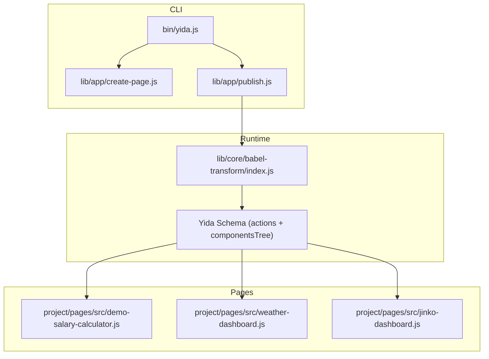
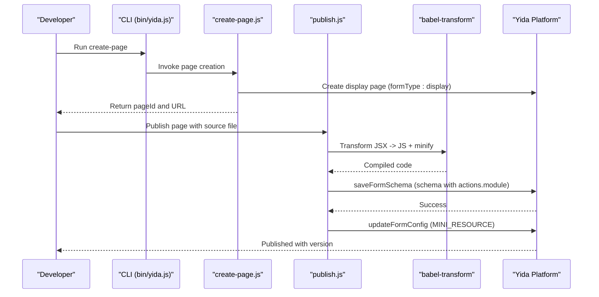
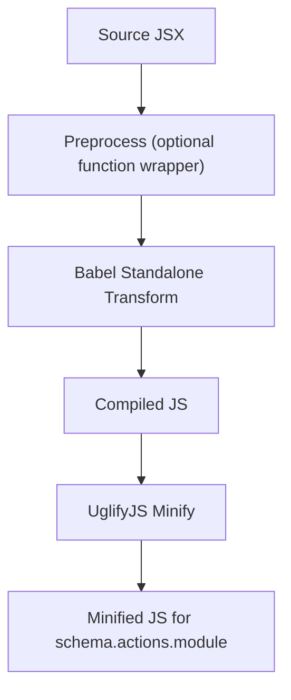
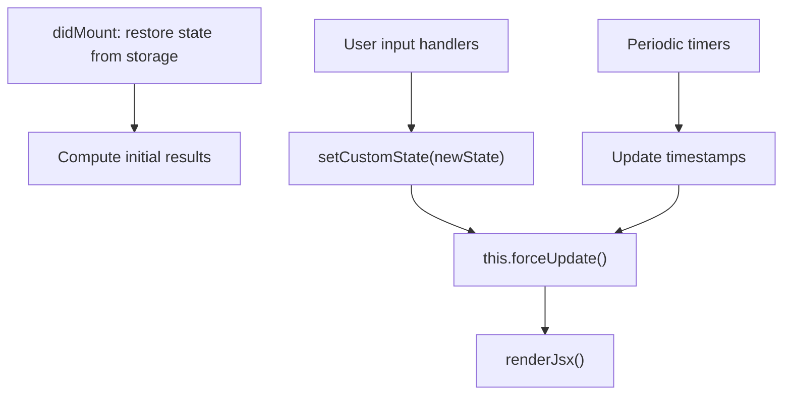
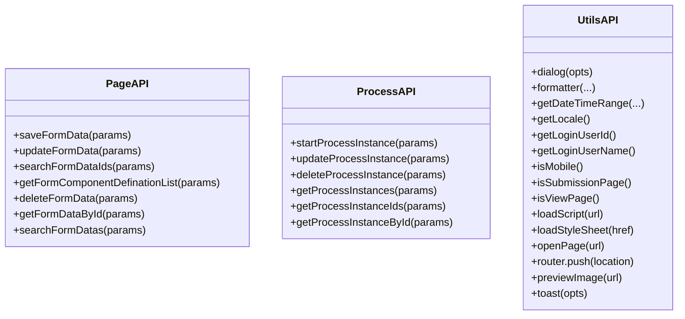
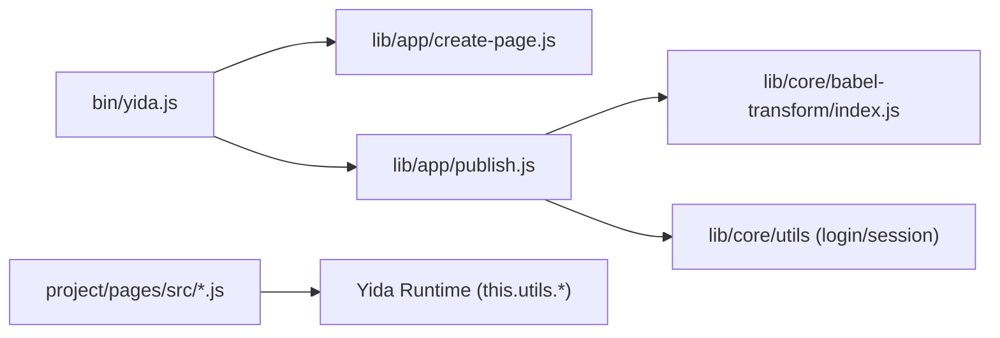

# Custom Page Development

<cite>
**Referenced Files in This Document**
- [README.md](file://README.md)
- [package.json](file://package.json)
- [project/config.json](file://project/config.json)
- [bin/yida.js](file://bin/yida.js)
- [lib/app/create-page.js](file://lib/app/create-page.js)
- [lib/app/publish.js](file://lib/app/publish.js)
- [lib/core/babel-transform/index.js](file://lib/core/babel-transform/index.js)
- [yida-skills/reference/yida-api.md](file://yida-skills/reference/yida-api.md)
- [project/pages/src/demo-salary-calculator.js](file://project/pages/src/demo-salary-calculator.js)
- [project/pages/src/weather-dashboard.js](file://project/pages/src/weather-dashboard.js)
- [project/pages/src/jinko-dashboard.js](file://project/pages/src/jinko-dashboard.js)
</cite>

## Table of Contents
1. [Introduction](#introduction)
2. [Project Structure](#project-structure)
3. [Core Components](#core-components)
4. [Architecture Overview](#architecture-overview)
5. [Detailed Component Analysis](#detailed-component-analysis)
6. [Dependency Analysis](#dependency-analysis)
7. [Performance Considerations](#performance-considerations)
8. [Troubleshooting Guide](#troubleshooting-guide)
9. [Conclusion](#conclusion)
10. [Appendices](#appendices)

## Introduction
This document explains how to develop custom pages for the Yida low-code platform using a React-like JSX syntax. It covers the end-to-end workflow from creating a page template to publishing and sharing, including JSX extensions, component composition, state management, layout and responsive design, and integration with forms, reports, and external APIs. Practical examples demonstrate building interactive dashboards, data visualization pages, and utility tools.

## Project Structure
The repository provides:
- CLI commands for environment setup, login, page creation, publishing, and sharing
- A JSX-based page authoring system that compiles to a Yida schema and executes in the Yida runtime
- Example pages showcasing state-driven rendering, charts, and responsive layouts
- Reference documentation for Yida JS APIs



**Diagram sources**
- [bin/yida.js](file://bin/yida.js)
- [lib/app/create-page.js](file://lib/app/create-page.js)
- [lib/app/publish.js](file://lib/app/publish.js)
- [lib/core/babel-transform/index.js](file://lib/core/babel-transform/index.js)
- [project/pages/src/demo-salary-calculator.js](file://project/pages/src/demo-salary-calculator.js)
- [project/pages/src/weather-dashboard.js](file://project/pages/src/weather-dashboard.js)
- [project/pages/src/jinko-dashboard.js](file://project/pages/src/jinko-dashboard.js)

**Section sources**
- [README.md:77-135](file://README.md#L77-L135)
- [package.json:1-74](file://package.json#L1-L74)
- [project/config.json:1-5](file://project/config.json#L1-L5)

## Core Components
- CLI entrypoint and commands:
  - Environment detection, login, logout, organization switching, and diagnostics
  - Page creation, publishing, and sharing configuration
  - Data management, permissions, connectors, and reports
- Page authoring:
  - JSX-based rendering with lifecycle hooks and state helpers
  - Built-in utilities for dialogs, routing, toast, and device checks
- Build pipeline:
  - Babel transform to convert JSX to executable code
  - UglifyJS minification and schema generation for Yida runtime

Key capabilities:
- Zero-config CLI with built-in environment detection and login flows
- React-like JSX rendering inside Yida’s visual engine
- Lifecycle hooks (mount/unmount) and state helpers (getCustomState/setCustomState/forceUpdate)
- Rich API surface for forms, processes, routing, and UI feedback

**Section sources**
- [README.md:77-135](file://README.md#L77-L135)
- [lib/app/create-page.js:1-139](file://lib/app/create-page.js#L1-L139)
- [lib/app/publish.js:1-607](file://lib/app/publish.js#L1-L607)
- [lib/core/babel-transform/index.js:1-244](file://lib/core/babel-transform/index.js#L1-L244)
- [yida-skills/reference/yida-api.md:1-800](file://yida-skills/reference/yida-api.md#L1-L800)

## Architecture Overview
The custom page development workflow consists of:
- Authoring: Write a single-file page with JSX and lifecycle/state functions
- Building: Compile JSX to JavaScript, minify, and embed into a Yida schema
- Publishing: Save the schema to Yida and update page configuration
- Sharing: Configure public access and retrieve share settings



**Diagram sources**
- [bin/yida.js](file://bin/yida.js)
- [lib/app/create-page.js:1-139](file://lib/app/create-page.js#L1-L139)
- [lib/app/publish.js:1-607](file://lib/app/publish.js#L1-L607)
- [lib/core/babel-transform/index.js:1-244](file://lib/core/babel-transform/index.js#L1-L244)

## Detailed Component Analysis

### JSX Rendering and Lifecycle
- State management:
  - Expose a custom state object and functions to read/write it
  - Trigger re-render via forceUpdate or setState
- Lifecycle:
  - didMount: initialize timers, fetch data, restore persisted state
  - didUnmount: clear timers and resources
- Rendering:
  - renderJsx returns JSX nodes representing the UI
  - Styles are inline objects; responsive behavior can be toggled via this.utils.isMobile()

Example pages illustrate:
- Utility calculator with local state persistence and computed results
- Data visualization dashboard with SVG charts and animated updates
- Multi-tab dashboard with KPI cards, progress bars, and charts

**Section sources**
- [project/pages/src/demo-salary-calculator.js:155-267](file://project/pages/src/demo-salary-calculator.js#L155-L267)
- [project/pages/src/demo-salary-calculator.js:273-800](file://project/pages/src/demo-salary-calculator.js#L273-L800)
- [project/pages/src/weather-dashboard.js:94-124](file://project/pages/src/weather-dashboard.js#L94-L124)
- [project/pages/src/weather-dashboard.js:126-374](file://project/pages/src/weather-dashboard.js#L126-L374)
- [project/pages/src/jinko-dashboard.js:7-40](file://project/pages/src/jinko-dashboard.js#L7-L40)
- [project/pages/src/jinko-dashboard.js:548-661](file://project/pages/src/jinko-dashboard.js#L548-L661)

### Babel Transform and JSX Compilation
- The transform converts JSX to executable code compatible with Yida’s runtime
- Adds automatic component view bindings for uppercase JSX tags
- Supports function transforms and AST analysis for component discovery



**Diagram sources**
- [lib/core/babel-transform/index.js:89-244](file://lib/core/babel-transform/index.js#L89-L244)
- [lib/app/publish.js:59-100](file://lib/app/publish.js#L59-L100)

**Section sources**
- [lib/core/babel-transform/index.js:1-244](file://lib/core/babel-transform/index.js#L1-L244)
- [lib/app/publish.js:59-100](file://lib/app/publish.js#L59-L100)

### Page Creation and Publishing
- Page creation:
  - Creates a display page with a given name under an application type
  - Optionally injects data sources into the page schema
- Publishing:
  - Compiles and minifies the source
  - Builds a schema embedding the compiled actions
  - Saves schema and updates page configuration for mini-resource mode

```mermaid
sequenceDiagram
participant Dev as "Developer"
participant Create as "create-page.js"
participant Publish as "publish.js"
participant Utils as "core/utils"
participant Yida as "Yida API"
Dev->>Create : openyida create-page <appType> "<pageName>"
Create->>Yida : saveFormSchemaInfo (display)
Yida-->>Create : formUuid
Create-->>Dev : pageId + URL
Dev->>Publish : openyida publish <appType> <formUuid> <source>
Publish->>Utils : Load cookies, resolve base URL
Publish->>Publish : Compile + Minify
Publish->>Yida : saveFormSchema (with actions.module)
Yida-->>Publish : success
Publish->>Yida : updateFormConfig (MINI_RESOURCE)
Yida-->>Dev : published
```

**Diagram sources**
- [lib/app/create-page.js:24-139](file://lib/app/create-page.js#L24-L139)
- [lib/app/publish.js:486-607](file://lib/app/publish.js#L486-L607)

**Section sources**
- [lib/app/create-page.js:1-139](file://lib/app/create-page.js#L1-L139)
- [lib/app/publish.js:1-607](file://lib/app/publish.js#L1-L607)

### State Management Patterns
- Private state object per page
- Exposed getters/setters to read/write state
- Force update via this.forceUpdate or this.setState({ timestamp: ... })
- Optional persistence to localStorage for quick reloads



**Diagram sources**
- [project/pages/src/demo-salary-calculator.js:175-225](file://project/pages/src/demo-salary-calculator.js#L175-L225)
- [project/pages/src/weather-dashboard.js:103-124](file://project/pages/src/weather-dashboard.js#L103-L124)

**Section sources**
- [project/pages/src/demo-salary-calculator.js:155-225](file://project/pages/src/demo-salary-calculator.js#L155-L225)
- [project/pages/src/weather-dashboard.js:94-124](file://project/pages/src/weather-dashboard.js#L94-L124)

### Layout Settings, Responsive Design, and Mobile Optimization
- Inline styles define layout and responsiveness
- Use this.utils.isMobile() to adapt UI for smaller screens
- Grid and flex layouts are used for dashboards and cards
- Charts and SVG are sized dynamically based on viewport

Practical tips:
- Keep font sizes and paddings relative to screen size
- Collapse side panels or switch to vertical stacks on mobile
- Prefer percentage-based widths and flexible grids

**Section sources**
- [project/pages/src/weather-dashboard.js:126-374](file://project/pages/src/weather-dashboard.js#L126-L374)
- [project/pages/src/jinko-dashboard.js:548-661](file://project/pages/src/jinko-dashboard.js#L548-L661)

### Page Publishing and Deployment
- Build steps:
  - Compile JSX via Babel
  - Minify with UglifyJS
  - Embed compiled code into schema.actions.module
- Deployment steps:
  - Save schema via saveFormSchema
  - Update configuration to enable mini-resource mode
- Error handling:
  - Automatic CSRF and login refresh
  - Retry on expired tokens or redirects

**Section sources**
- [lib/app/publish.js:59-100](file://lib/app/publish.js#L59-L100)
- [lib/app/publish.js:338-482](file://lib/app/publish.js#L338-L482)
- [lib/app/publish.js:484-607](file://lib/app/publish.js#L484-L607)

### Page Sharing and Access Control
- Public access verification and saving share configuration are exposed via CLI
- Retrieve current page sharing configuration
- Combine with form permission APIs to restrict access to specific roles or departments

**Section sources**
- [README.md:103-107](file://README.md#L103-L107)
- [yida-skills/reference/yida-api.md:1-800](file://yida-skills/reference/yida-api.md#L1-L800)

### Integrations with Forms, Reports, and External APIs
- Forms:
  - Create, update, search, and delete form instances
  - Fetch form definitions and data by ID
- Processes:
  - Start and update process instances
  - Search and query process instances
- Utilities:
  - Toast notifications, dialogs, router navigation, image preview
  - Dynamic script and stylesheet loading



**Diagram sources**
- [yida-skills/reference/yida-api.md:1-800](file://yida-skills/reference/yida-api.md#L1-L800)

**Section sources**
- [yida-skills/reference/yida-api.md:1-800](file://yida-skills/reference/yida-api.md#L1-L800)

## Dependency Analysis
- CLI depends on:
  - Environment detection and authentication utilities
  - Page creation and publishing modules
- Publishing depends on:
  - Babel standalone for JSX transform
  - UglifyJS for minification
  - Core utilities for login/session handling
- Pages depend on:
  - Inline state and lifecycle functions
  - Runtime utilities for UI and navigation



**Diagram sources**
- [bin/yida.js](file://bin/yida.js)
- [lib/app/create-page.js](file://lib/app/create-page.js)
- [lib/app/publish.js](file://lib/app/publish.js)
- [lib/core/babel-transform/index.js](file://lib/core/babel-transform/index.js)

**Section sources**
- [package.json:50-55](file://package.json#L50-L55)
- [lib/app/publish.js:23-26](file://lib/app/publish.js#L23-L26)

## Performance Considerations
- Minimize DOM updates:
  - Batch state changes and call forceUpdate once per event cycle
  - Use memoization for expensive computations
- Optimize rendering:
  - Avoid unnecessary re-renders by updating only changed state keys
  - Defer heavy work to idle callbacks or background threads
- Asset optimization:
  - Prefer SVG for charts and icons
  - Lazy-load external assets via loadScript/loadStyleSheet
- Network:
  - Cache API responses when appropriate
  - Use pagination for large datasets

## Troubleshooting Guide
Common issues and resolutions:
- Login/session errors:
  - Use environment diagnostics and login refresh
  - Re-authenticate when CSRF or login expires
- Compilation failures:
  - Inspect Babel transform errors and locations
  - Simplify JSX temporarily to isolate issues
- Publishing errors:
  - Verify base URL and appType correctness
  - Check schema validity and required fields

**Section sources**
- [lib/app/publish.js:338-410](file://lib/app/publish.js#L338-L410)
- [lib/app/publish.js:524-552](file://lib/app/publish.js#L524-L552)

## Conclusion
OpenYida’s custom page system enables rapid development of interactive, data-driven pages using a familiar JSX syntax. By leveraging lifecycle hooks, state helpers, and the Yida API surface, developers can build dashboards, calculators, and utility tools that are responsive, performant, and easy to publish and share.

## Appendices

### Quick Start Workflow
- Initialize environment and login
- Create a page and optionally inject data sources
- Author a single-file page with JSX and lifecycle/state functions
- Publish the page to Yida
- Configure sharing and permissions

**Section sources**
- [README.md:77-135](file://README.md#L77-L135)
- [lib/app/create-page.js:24-139](file://lib/app/create-page.js#L24-L139)
- [lib/app/publish.js:486-607](file://lib/app/publish.js#L486-L607)