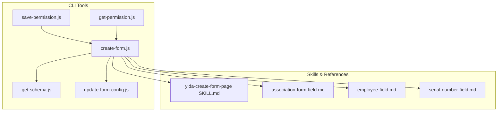
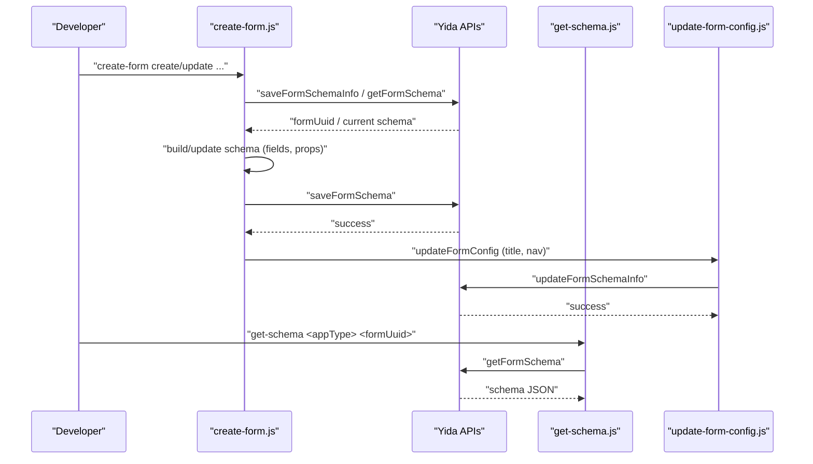
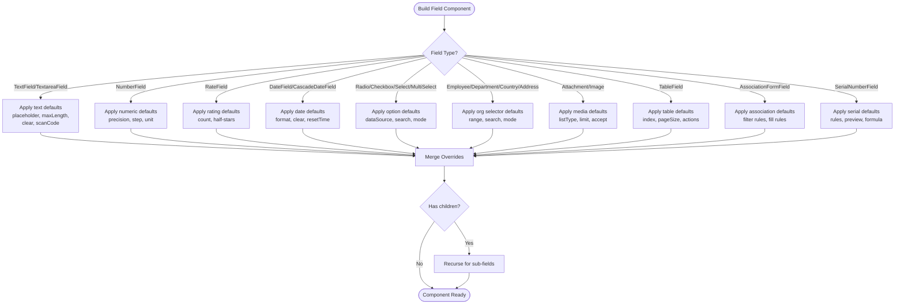
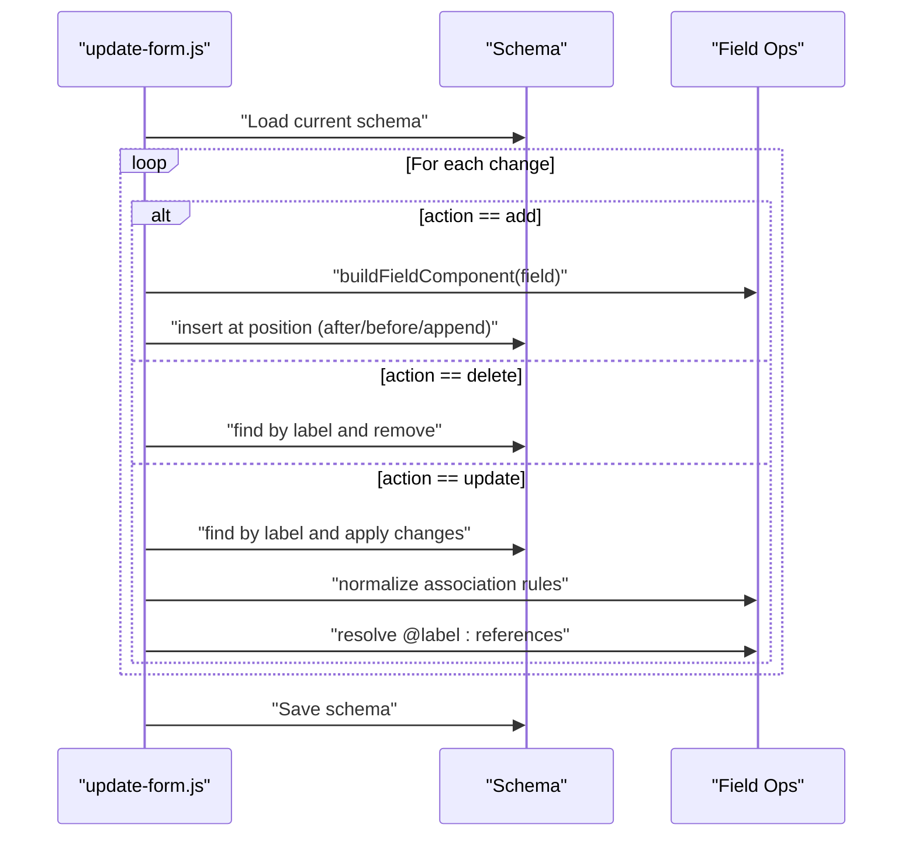
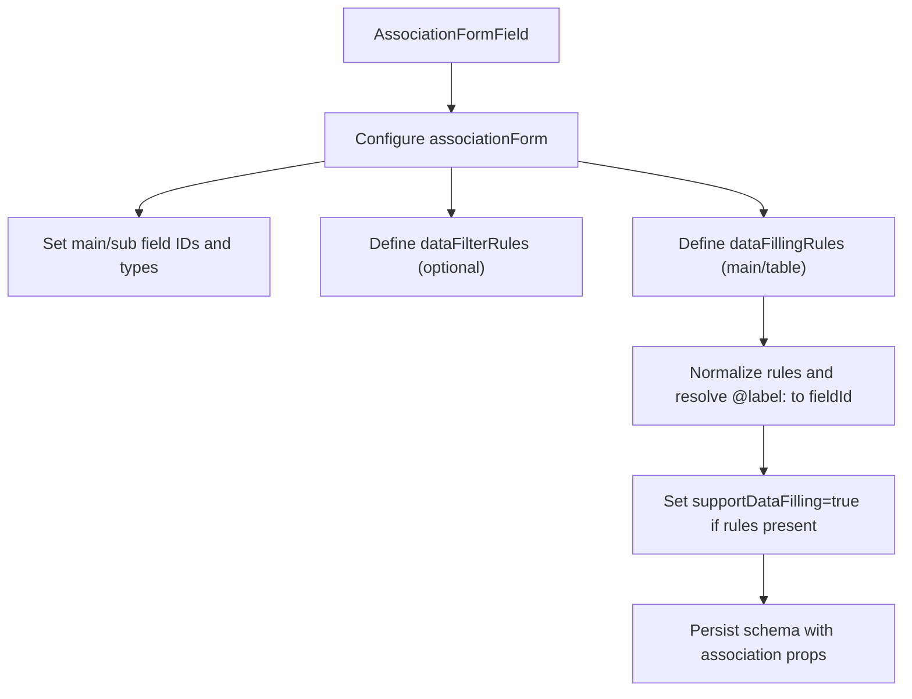
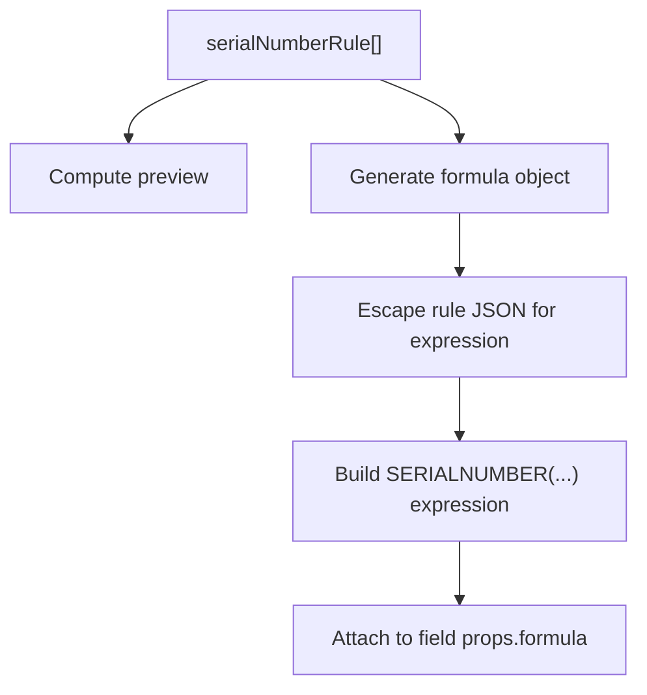
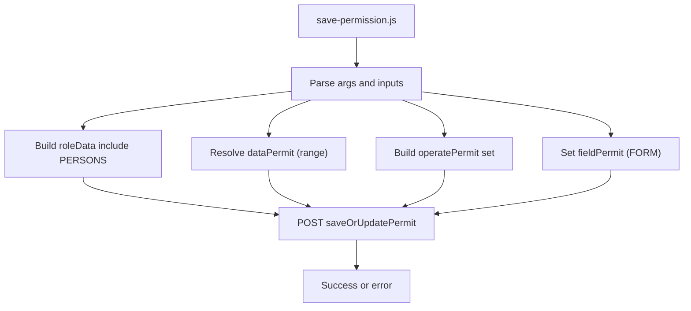
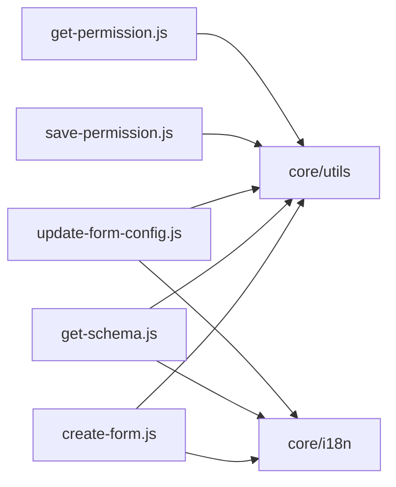

# Form Management & Schema Creation

<cite>
**Referenced Files in This Document**
- [create-form.js](file://lib/app/create-form.js)
- [get-schema.js](file://lib/app/get-schema.js)
- [update-form-config.js](file://lib/app/update-form-config.js)
- [SKILL.md](file://yida-skills/skills/yida-create-form-page/SKILL.md)
- [association-form-field.md](file://yida-skills/reference/association-form-field.md)
- [employee-field.md](file://yida-skills/reference/employee-field.md)
- [serial-number-field.md](file://yida-skills/reference/serial-number-field.md)
- [report-constants.test.js](file://tests/report-constants.test.js)
- [create-form.test.js](file://tests/create-form.test.js)
- [save-permission.js](file://lib/permission/save-permission.js)
- [get-permission.js](file://lib/permission/get-permission.js)
</cite>

## Table of Contents
1. [Introduction](#introduction)
2. [Project Structure](#project-structure)
3. [Core Components](#core-components)
4. [Architecture Overview](#architecture-overview)
5. [Detailed Component Analysis](#detailed-component-analysis)
6. [Dependency Analysis](#dependency-analysis)
7. [Performance Considerations](#performance-considerations)
8. [Troubleshooting Guide](#troubleshooting-guide)
9. [Conclusion](#conclusion)
10. [Appendices](#appendices)

## Introduction
This document explains OpenYida’s form management and schema creation capabilities. It covers how to define forms, configure fields, apply validations, and manage permissions. It also documents advanced features such as dynamic associations, cascading data, formulas, and permission groups. Practical examples illustrate building forms for HR onboarding, expense approvals, and customer management.

## Project Structure
OpenYida provides CLI-driven capabilities to create, update, and inspect form schemas, and to manage permissions at the form level. The relevant modules include:
- Form creation and updates via schema manipulation
- Schema retrieval for inspection
- Form configuration updates (title, navigation, etc.)
- Permission management for roles and field-level visibility
- Reference materials for advanced field types and behaviors

**Diagram sources**
- [create-form.js:1-2445](file://lib/app/create-form.js#L1-L2445)
- [get-schema.js:1-79](file://lib/app/get-schema.js#L1-L79)
- [update-form-config.js:1-232](file://lib/app/update-form-config.js#L1-L232)
- [save-permission.js:1-449](file://lib/permission/save-permission.js#L1-L449)
- [get-permission.js:1-179](file://lib/permission/get-permission.js#L1-L179)
- [SKILL.md:1-658](file://yida-skills/skills/yida-create-form-page/SKILL.md#L1-L658)
- [association-form-field.md:1-469](file://yida-skills/reference/association-form-field.md#L1-L469)
- [employee-field.md:1-17](file://yida-skills/reference/employee-field.md#L1-L17)
- [serial-number-field.md:1-133](file://yida-skills/reference/serial-number-field.md#L1-L133)

**Section sources**
- [create-form.js:1-2445](file://lib/app/create-form.js#L1-L2445)
- [get-schema.js:1-79](file://lib/app/get-schema.js#L1-L79)
- [update-form-config.js:1-232](file://lib/app/update-form-config.js#L1-L232)
- [SKILL.md:1-658](file://yida-skills/skills/yida-create-form-page/SKILL.md#L1-L658)

## Core Components
- Form schema builder: constructs field components, applies defaults, merges overrides, and supports nested sub-tables and associations.
- Update engine: reads current schema, applies add/delete/update operations, and writes back the modified schema.
- Schema inspector: retrieves the current form schema for review and debugging.
- Config updater: adjusts form-level metadata such as title and navigation rendering.
- Permission manager: creates and updates permission packages scoped to data ranges, operation rights, and field visibility.

Key capabilities:
- Field types: text inputs, textarea, radio/checkbox, select/multi-select, number, rate, date, cascade date, employee, department, country, address, attachment, image, table (sub-table), association form, serial number.
- Validation: required flag and per-type validation hints.
- Behavior and visibility: normal, read-only, hidden; device visibility (PC/mobile).
- Advanced features: association filtering and auto-fill, serial number generation, formulas, and permission scoping.

**Section sources**
- [create-form.js:300-846](file://lib/app/create-form.js#L300-L846)
- [SKILL.md:113-468](file://yida-skills/skills/yida-create-form-page/SKILL.md#L113-L468)
- [report-constants.test.js:133-180](file://tests/report-constants.test.js#L133-L180)

## Architecture Overview
The form lifecycle integrates CLI commands with宜搭 APIs to create, update, and inspect schemas, and to manage permissions.

**Diagram sources**
- [create-form.js:183-251](file://lib/app/create-form.js#L183-L251)
- [get-schema.js:18-76](file://lib/app/get-schema.js#L18-L76)
- [update-form-config.js:138-232](file://lib/app/update-form-config.js#L138-L232)

## Detailed Component Analysis

### Form Schema Builder and Field Types
The builder generates field components with sensible defaults per type and allows explicit overrides. It supports:
- Text inputs and textareas with placeholders, limits, and optional scanning.
- Numbers with precision, steps, thousand separators, and unit suffix.
- Ratings, dates, and cascade dates with format and clear/reset options.
- Options-based fields (radio, checkbox, select, multi-select) with custom data sources and search/filtering.
- Employee, department, country, and address selectors with range and search controls.
- Attachments and images with upload policies, limits, and accept filters.
- Sub-tables with paging, actions, export/import, and summary.
- Association form fields with filtering rules and auto-fill rules.
- Serial number fields with customizable rules and formula generation.

**Diagram sources**
- [create-form.js:300-846](file://lib/app/create-form.js#L300-L846)

**Section sources**
- [create-form.js:300-846](file://lib/app/create-form.js#L300-L846)
- [SKILL.md:146-427](file://yida-skills/skills/yida-create-form-page/SKILL.md#L146-L427)

### Update Engine: Add, Delete, Update Fields
The update engine:
- Reads the current schema.
- Applies ordered changes: add (with position hints), delete, update (including nested sub-tables).
- Ensures components map is updated for new types.
- Normalizes association rules and resolves label-to-fieldId references.

**Diagram sources**
- [create-form.js:1615-1814](file://lib/app/create-form.js#L1615-L1814)
- [create-form.js:911-932](file://lib/app/create-form.js#L911-L932)
- [create-form.js:934-970](file://lib/app/create-form.js#L934-L970)

**Section sources**
- [create-form.js:1615-1814](file://lib/app/create-form.js#L1615-L1814)
- [create-form.js:911-970](file://lib/app/create-form.js#L911-L970)

### Association Form Fields: Filtering and Auto-Fill
Association form fields enable:
- Filtering target records based on current form values.
- Auto-filling main and sub-table fields upon selection.

**Diagram sources**
- [create-form.js:683-747](file://lib/app/create-form.js#L683-L747)
- [create-form.js:911-970](file://lib/app/create-form.js#L911-L970)
- [association-form-field.md:33-171](file://yida-skills/reference/association-form-field.md#L33-L171)

**Section sources**
- [create-form.js:683-747](file://lib/app/create-form.js#L683-L747)
- [association-form-field.md:33-171](file://yida-skills/reference/association-form-field.md#L33-L171)

### Serial Number Fields: Rules and Formula
Serial number fields support:
- Customizable rule sequences (fixed characters, date, auto-count).
- Preview and reset behavior.
- Formula generation using corpId, appType, formUuid, fieldId, and escaped rule JSON.

**Diagram sources**
- [create-form.js:749-802](file://lib/app/create-form.js#L749-L802)
- [serial-number-field.md:123-133](file://yida-skills/reference/serial-number-field.md#L123-L133)

**Section sources**
- [create-form.js:749-802](file://lib/app/create-form.js#L749-L802)
- [serial-number-field.md:1-133](file://yida-skills/reference/serial-number-field.md#L1-L133)

### Permissions: Data Scope, Operations, and Field Visibility
Permissions are managed via packages:
- Data range: self, department, subordinate, formula, etc.
- Operation rights: view, edit, delete, print, batch actions.
- Field-level visibility: per-field permissions.
- Members: role members included in the package.

**Diagram sources**
- [save-permission.js:68-314](file://lib/permission/save-permission.js#L68-L314)
- [get-permission.js:141-179](file://lib/permission/get-permission.js#L141-L179)

**Section sources**
- [save-permission.js:32-314](file://lib/permission/save-permission.js#L32-L314)
- [get-permission.js:128-179](file://lib/permission/get-permission.js#L128-L179)

### Practical Examples

#### HR Onboarding Form
- Fields: Employee (default to current user), Name (text), Gender (radio), Department (department selector), Start Date (date), Photo (image), Emergency Contact (table with Name, Phone).
- Validation: required for Name, Department, Start Date; optional photo.
- Behavior: Employee read-only; Name/Department/Start Date visible on both devices.
- Permissions: view/edit for HR; read-only for others; field-level visibility for sensitive contact info.

Implementation references:
- Employee default: [employee-field.md:1-17](file://yida-skills/reference/employee-field.md#L1-L17)
- Field types and defaults: [SKILL.md:146-427](file://yida-skills/skills/yida-create-form-page/SKILL.md#L146-L427)

#### Expense Approval Form
- Fields: Employee (employee selector), Expense Date (date), Category (select), Amount (number), Receipts (attachment), Details (table with Item, Cost).
- Validation: required for Employee, Date, Category, Amount; attachments optional but recommended.
- Associations: Category could be an association to a lookup form; auto-fill category defaults.
- Permissions: submit/view for requester; approve/reject for approvers; hide sensitive cost fields from requester.

Implementation references:
- Association filtering/filling: [association-form-field.md:33-171](file://yida-skills/reference/association-form-field.md#L33-L171)
- Field types and defaults: [SKILL.md:146-427](file://yida-skills/skills/yida-create-form-page/SKILL.md#L146-L427)

#### Customer Management Form
- Fields: Company (text), Contact Person (employee), Email/Phone (text), Country (country), Address (address), Notes (textarea), Products (table with Product, Quantity).
- Validation: required for company, contact person, email; phone optional.
- Behavior: Address auto-location; country search enabled.
- Permissions: view/edit for sales; read-only for support; hide internal notes.

Implementation references:
- Organization selectors and address: [SKILL.md:316-353](file://yida-skills/skills/yida-create-form-page/SKILL.md#L316-L353)
- Field types and defaults: [SKILL.md:146-427](file://yida-skills/skills/yida-create-form-page/SKILL.md#L146-L427)

## Dependency Analysis
- create-form.js depends on utils for authentication and HTTP helpers, and on i18n for localized messages.
- get-schema.js and update-form-config.js depend on shared HTTP utilities and CSRF handling.
- Permission scripts depend on shared auth utilities and querystring encoding.
- Tests validate schema correctness and ID generation uniqueness.

**Diagram sources**
- [create-form.js:64-66](file://lib/app/create-form.js#L64-L66)
- [get-schema.js:9-16](file://lib/app/get-schema.js#L9-L16)
- [update-form-config.js:1-7](file://lib/app/update-form-config.js#L1-L7)
- [save-permission.js:1-6](file://lib/permission/save-permission.js#L1-L6)
- [get-permission.js:1-16](file://lib/permission/get-permission.js#L1-L16)

**Section sources**
- [create-form.js:64-66](file://lib/app/create-form.js#L64-L66)
- [get-schema.js:9-16](file://lib/app/get-schema.js#L9-L16)
- [update-form-config.js:1-7](file://lib/app/update-form-config.js#L1-L7)
- [save-permission.js:1-6](file://lib/permission/save-permission.js#L1-L6)
- [get-permission.js:1-16](file://lib/permission/get-permission.js#L1-L16)

## Performance Considerations
- Minimize repeated schema fetches; use get-schema before updates to avoid unnecessary writes.
- Batch changes in update mode to reduce round trips.
- Prefer local filtering for select fields to reduce server load.
- Limit attachment/image sizes and counts to improve upload performance.
- Use association filtering to constrain large datasets.

## Troubleshooting Guide
Common issues and resolutions:
- Duplicate component IDs: ensure single FormContainer wrapper and unique field IDs; tests enforce uniqueness and single container nesting.
- Association auto-fill not working: verify dataFillingRules include all six fields (sourceFieldId, targetFieldId, source, sourceType, target, targetType); confirm top-level fieldId exists on association node.
- Label-to-fieldId resolution failures: ensure @label: syntax is used consistently and that labels match exactly.
- Login or CSRF errors during requests: scripts handle retries automatically; re-run with fresh credentials if needed.
- Schema not applying changes: verify change order and labels; use get-schema to inspect current state before updating.

**Section sources**
- [create-form.test.js:39-69](file://tests/create-form.test.js#L39-L69)
- [create-form.js:911-970](file://lib/app/create-form.js#L911-L970)
- [association-form-field.md:96-120](file://yida-skills/reference/association-form-field.md#L96-L120)
- [get-schema.js:55-76](file://lib/app/get-schema.js#L55-L76)

## Conclusion
OpenYida provides a robust, scriptable framework for designing and managing forms. With comprehensive field types, powerful association features, flexible permissions, and strong validation defaults, teams can rapidly build complex, data-driven forms for HR, finance, and customer management workflows.

## Appendices

### Supported Field Types and Defaults
- Text inputs: placeholder, max length, clear button, scanning.
- Numbers: precision, step, thousand separators, unit suffix.
- Ratings: star count and half-star support.
- Dates: format, clear, reset time.
- Options: radio/checkbox/select/multi-select with searchable data sources.
- Organization: employee, department, country selectors with range and search.
- Address: country mode, sub-labels, location enablement.
- Media: attachments and images with list types, limits, accept filters.
- Sub-table: index, paging, actions, export/import, freeze columns.
- Association: filter rules, auto-fill rules, order config.
- Serial number: customizable rules and formula generation.

**Section sources**
- [SKILL.md:146-427](file://yida-skills/skills/yida-create-form-page/SKILL.md#L146-L427)
- [create-form.js:328-802](file://lib/app/create-form.js#L328-L802)

### Data Type Inference for Reports
Certain field types infer specific data types for reporting:
- EmployeeField, DepartmentSelectField, MultiSelectField, CheckboxField → ARRAY
- DateField, CascadeDateField → DATE
- NumberField, RateField → DOUBLE
- TextField, TextareaField, SelectField, RadioField → STRING

**Section sources**
- [report-constants.test.js:133-180](file://tests/report-constants.test.js#L133-L180)