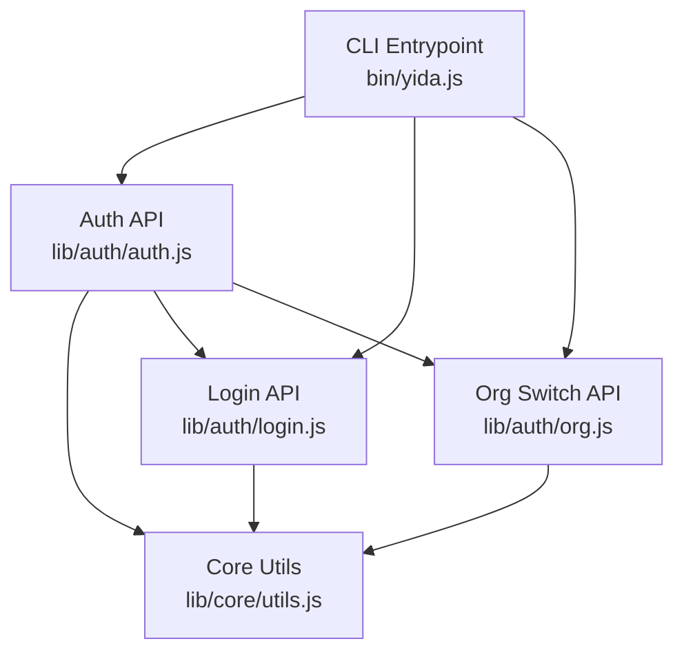
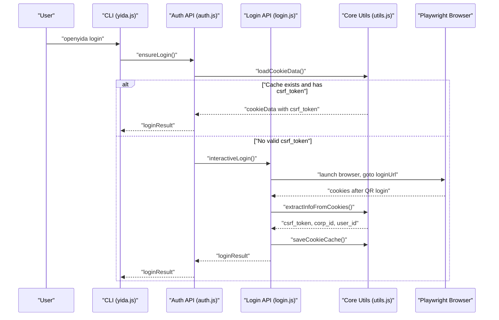
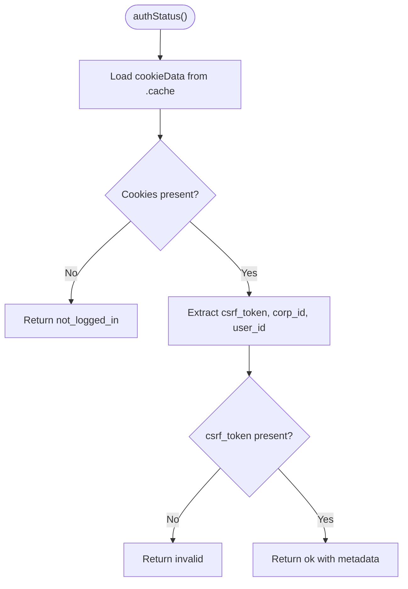
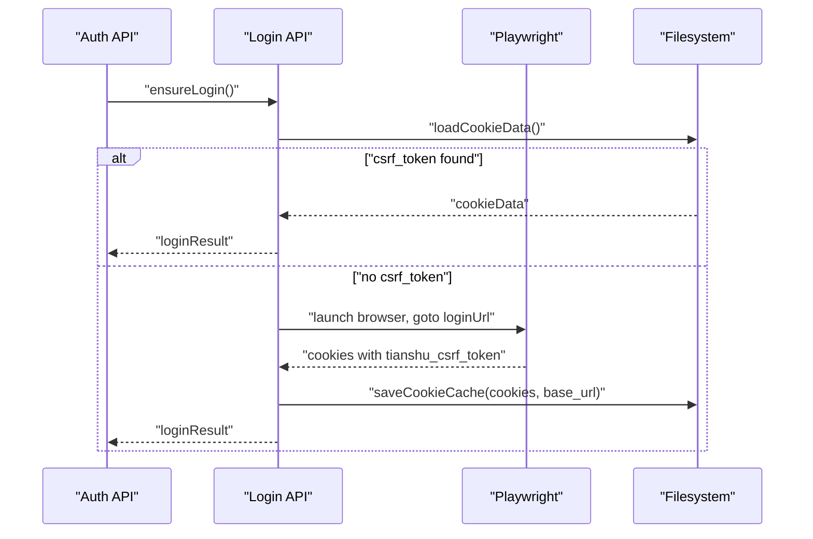
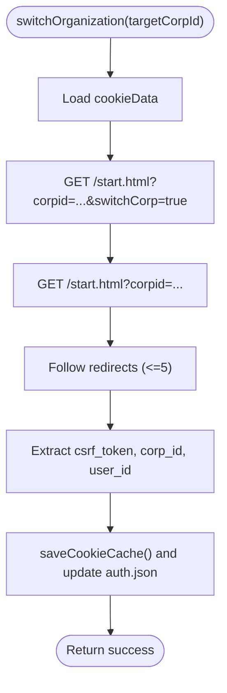
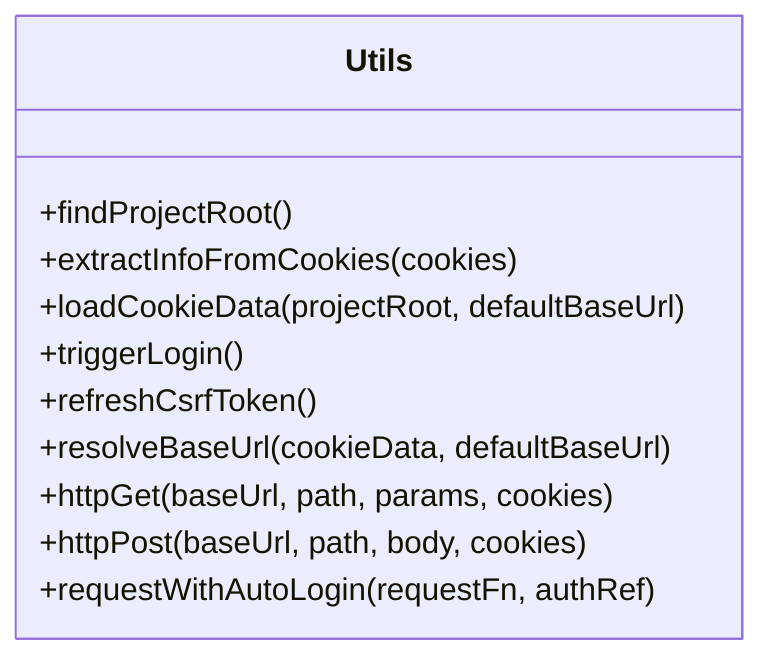
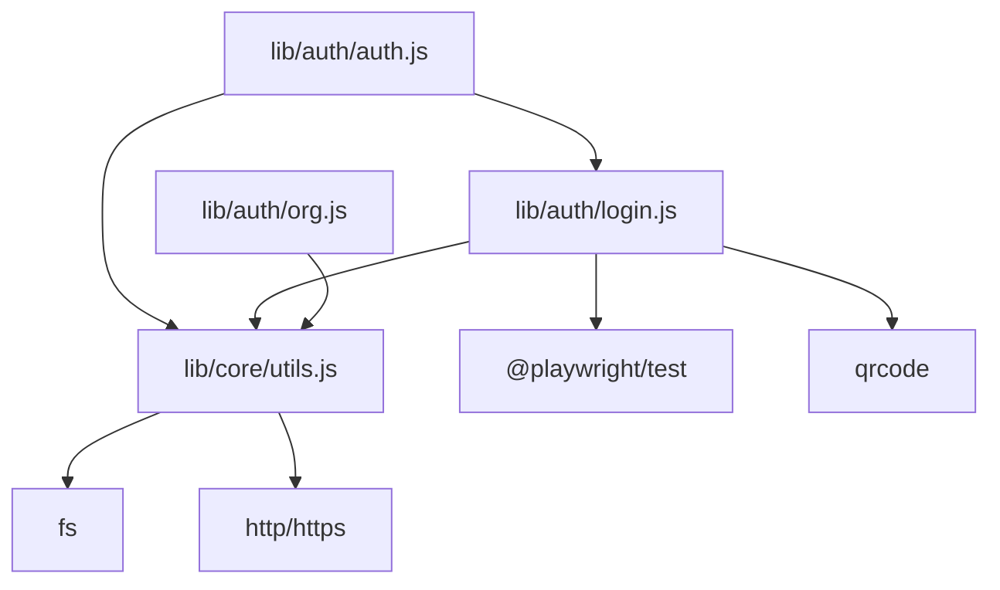
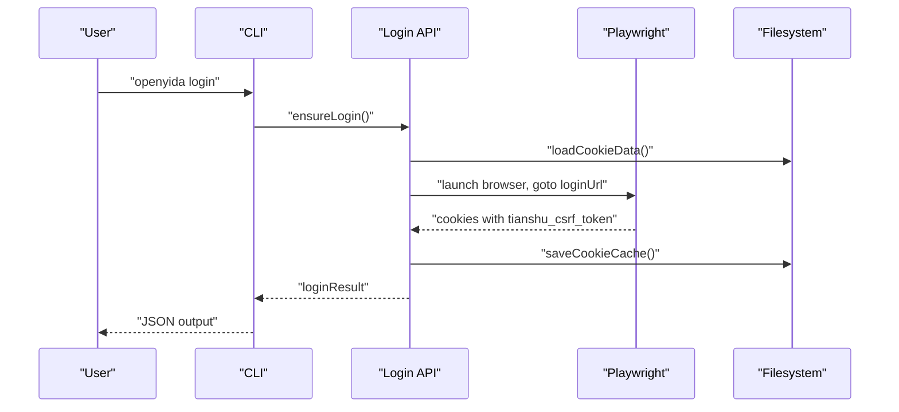
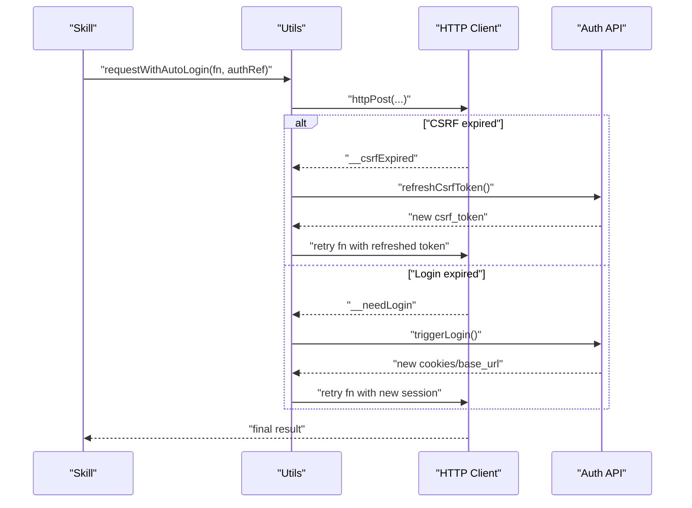

# Authentication & Session Management

<cite>
**Referenced Files in This Document**
- [auth.js](file://lib/auth/auth.js)
- [login.js](file://lib/auth/login.js)
- [org.js](file://lib/auth/org.js)
- [utils.js](file://lib/core/utils.js)
- [yida.js](file://bin/yida.js)
- [auth.test.js](file://tests/auth.test.js)
- [SKILL.md](file://yida-skills/skills/yida-login/SKILL.md)
- [SECURITY.md](file://SECURITY.md)
- [package.json](file://package.json)
</cite>

## Table of Contents
1. [Introduction](#introduction)
2. [Project Structure](#project-structure)
3. [Core Components](#core-components)
4. [Architecture Overview](#architecture-overview)
5. [Detailed Component Analysis](#detailed-component-analysis)
6. [Dependency Analysis](#dependency-analysis)
7. [Performance Considerations](#performance-considerations)
8. [Troubleshooting Guide](#troubleshooting-guide)
9. [Conclusion](#conclusion)
10. [Appendices](#appendices)

## Introduction
This document explains OpenYida’s comprehensive authentication and session management system for Alibaba Yida (宜搭). It covers:
- Multi-layered authentication: automatic login detection, QR-based login, and session persistence
- Browser automation via Playwright for seamless login across Alibaba Yida
- Organization switching and multi-tenant support
- Session token management, automatic refresh, and fallback authentication
- Security considerations, token storage, and logout procedures
- Troubleshooting for common issues
- Authentication workflows for typical user scenarios and CI/CD integration patterns

## Project Structure
Authentication-related modules are organized under lib/auth and lib/core, with CLI entry points in bin/yida.js. Tests validate core behaviors.

**Diagram sources**
- [yida.js:152-241](file://bin/yida.js#L152-L241)
- [auth.js:19-239](file://lib/auth/auth.js#L19-L239)
- [login.js:15-349](file://lib/auth/login.js#L15-L349)
- [org.js:22-364](file://lib/auth/org.js#L22-L364)
- [utils.js:15-463](file://lib/core/utils.js#L15-L463)

**Section sources**
- [yida.js:152-241](file://bin/yida.js#L152-L241)
- [auth.js:19-239](file://lib/auth/auth.js#L19-L239)
- [login.js:15-349](file://lib/auth/login.js#L15-L349)
- [org.js:22-364](file://lib/auth/org.js#L22-L364)
- [utils.js:15-463](file://lib/core/utils.js#L15-L463)

## Core Components
- Authentication status and lifecycle: status, login, refresh, logout
- Login orchestration: cache-first, Playwright QR login, cookie extraction, and base_url resolution
- Organization switching: HTTP-driven organization change without re-login
- Core utilities: project root detection, cookie parsing, request helpers, auto-relogin and CSRF refresh

Key exported APIs:
- authStatus, authLogin, authRefresh, authLogout
- ensureLogin, checkLoginOnly, refreshCsrfFromCache, interactiveLogin, saveCookieCache, logout
- listOrganizations, switchOrganization, interactiveSwitch
- findProjectRoot, extractInfoFromCookies, loadCookieData, triggerLogin, refreshCsrfToken, resolveBaseUrl, httpGet, httpPost, requestWithAutoLogin

**Section sources**
- [auth.js:19-239](file://lib/auth/auth.js#L19-L239)
- [login.js:15-349](file://lib/auth/login.js#L15-L349)
- [org.js:22-364](file://lib/auth/org.js#L22-L364)
- [utils.js:15-463](file://lib/core/utils.js#L15-L463)

## Architecture Overview
OpenYida’s authentication architecture centers on:
- Local cache (.cache/cookies.json) storing cookies and base_url
- Automatic login detection by extracting csrf_token, corp_id, user_id from cached cookies
- Playwright-powered QR login flow when cache is missing or invalid
- Organization switching via controlled HTTP requests without re-authentication
- Request helpers that auto-detect login expiration and CSRF expiry, then refresh or re-login transparently

**Diagram sources**
- [yida.js:165-178](file://bin/yida.js#L165-L178)
- [auth.js:134-155](file://lib/auth/auth.js#L134-L155)
- [login.js:207-313](file://lib/auth/login.js#L207-L313)
- [utils.js:170-201](file://lib/core/utils.js#L170-L201)

## Detailed Component Analysis

### Authentication Lifecycle Module (auth.js)
Responsibilities:
- Query current login status and display metadata
- Execute login (QR/DingTalk) and persist login info
- Refresh session tokens from cache
- Logout and clear persisted auth config

Behavior highlights:
- Status checks cookie cache and extracts csrf_token, corp_id, user_id
- On successful login, saves auth.json with loginType, loginTime, corpId, userId
- Refresh reads cached cookies, re-extracts csrf_token, updates refreshTime and identifiers
- Logout clears auth.json and triggers logout in login module

**Diagram sources**
- [auth.js:61-127](file://lib/auth/auth.js#L61-L127)

**Section sources**
- [auth.js:57-127](file://lib/auth/auth.js#L57-L127)
- [auth.js:137-160](file://lib/auth/auth.js#L137-L160)
- [auth.js:168-210](file://lib/auth/auth.js#L168-L210)
- [auth.js:217-229](file://lib/auth/auth.js#L217-L229)

### Login Orchestration Module (login.js)
Responsibilities:
- Determine whether to use cached cookies or initiate QR login
- Save cookies to .cache/cookies.json with base_url
- Detect and use Playwright for browser automation
- Logout by removing cookies.json

Key flows:
- ensureLogin: prefers cache; falls back to interactiveLogin
- interactiveLogin: launches Chromium, waits for tianshu_csrf_token, resolves base_url from cookie domain or current URL, saves cookies
- refreshCsrfFromCache: re-extracts csrf_token without browser interaction
- logout: deletes cookies.json

**Diagram sources**
- [login.js:134-155](file://lib/auth/login.js#L134-L155)
- [login.js:207-313](file://lib/auth/login.js#L207-L313)
- [login.js:45-53](file://lib/auth/login.js#L45-L53)

**Section sources**
- [login.js:57-93](file://lib/auth/login.js#L57-L93)
- [login.js:101-126](file://lib/auth/login.js#L101-L126)
- [login.js:134-155](file://lib/auth/login.js#L134-L155)
- [login.js:207-313](file://lib/auth/login.js#L207-L313)
- [login.js:320-339](file://lib/auth/login.js#L320-L339)

### Organization Switching Module (org.js)
Responsibilities:
- List organizations (from auth config and current cookie)
- Switch organization without re-authentication
- Interactive selection (non-interactive in current implementation)

Mechanism:
- Issue controlled HTTP GET requests to start.html with corpid and switchCorp flags
- Follow redirects up to a limit, extract new cookies and base_url
- Persist new cookies and update auth config with recent corps

**Diagram sources**
- [org.js:190-313](file://lib/auth/org.js#L190-L313)

**Section sources**
- [org.js:121-180](file://lib/auth/org.js#L121-L180)
- [org.js:190-313](file://lib/auth/org.js#L190-L313)
- [org.js:322-357](file://lib/auth/org.js#L322-L357)

### Core Utilities (utils.js)
Responsibilities:
- Project root detection (supports multiple AI environments)
- Cookie parsing and cache loading
- Base_url resolution and request helpers
- Auto-relogin and CSRF refresh wrappers around HTTP calls

Highlights:
- extractInfoFromCookies: parses tianshu_csrf_token and tianshu_corp_user into corp_id and user_id
- loadCookieData: supports legacy array format and modern {cookies, base_url}
- httpGet/httpPost: attach Cookie and global_csrf_token headers, detect login/CSRF errors
- requestWithAutoLogin: transparently refresh CSRF or re-login on failure

**Diagram sources**
- [utils.js:142-201](file://lib/core/utils.js#L142-L201)
- [utils.js:268-447](file://lib/core/utils.js#L268-L447)

**Section sources**
- [utils.js:142-201](file://lib/core/utils.js#L142-L201)
- [utils.js:268-447](file://lib/core/utils.js#L268-L447)

### CLI Entrypoint (yida.js)
Responsibilities:
- Parse commands: login, logout, auth status/login/refresh/logout, org list/switch
- Invoke appropriate modules and print structured JSON where applicable

Key mappings:
- openyida login -> ensureLogin or QR login
- openyida auth status/login/refresh/logout -> auth.js
- openyida org list/switch -> org.js
- openyida logout -> login.js logout

**Section sources**
- [yida.js:165-178](file://bin/yida.js#L165-L178)
- [yida.js:187-204](file://bin/yida.js#L187-L204)
- [yida.js:207-241](file://bin/yida.js#L207-L241)

### Skill Documentation (yida-login/SKILL.md)
Provides user-facing guidance:
- Standard environment: Playwright-based QR login
- Wukong environment: CDP-based cookie extraction
- Outputs standardized JSON with csrf_token, corp_id, user_id, base_url, cookies
- Error handling: maps errorCode to actions (refresh CSRF vs full re-login)

**Section sources**
- [SKILL.md:36-91](file://yida-skills/skills/yida-login/SKILL.md#L36-L91)
- [SKILL.md:168-180](file://yida-skills/skills/yida-login/SKILL.md#L168-L180)

## Dependency Analysis
External and internal dependencies:
- Playwright for browser automation
- QR code generation for QR login
- Node core modules for filesystem, HTTP(S), child process, path, and OS

**Diagram sources**
- [auth.js:19-23](file://lib/auth/auth.js#L19-L23)
- [login.js:15-20](file://lib/auth/login.js#L15-L20)
- [org.js:24-29](file://lib/auth/org.js#L24-L29)
- [utils.js:17-20](file://lib/core/utils.js#L17-L20)
- [package.json:49-54](file://package.json#L49-L54)

**Section sources**
- [package.json:49-54](file://package.json#L49-L54)

## Performance Considerations
- Prefer cache-first login to avoid browser startup overhead
- Use refreshCsrfFromCache when only CSRF needs renewal
- Organization switching avoids full re-authentication by leveraging HTTP redirects
- Auto-relogin and CSRF refresh are transparent but add extra network calls; monitor latency in CI/CD pipelines

## Troubleshooting Guide
Common issues and resolutions:
- No cookie cache or invalid csrf_token
  - Trigger QR login via CLI or skill; ensure Playwright is installed
  - Verify base_url is extracted from actual login domain
- Network connectivity problems
  - Retry login; increase timeouts if behind proxy
  - Confirm loginUrl and defaultBaseUrl in config.json
- Expired sessions
  - Use requestWithAutoLogin to transparently refresh CSRF or re-login
  - For skills, rely on errorCode handling to trigger refresh/re-login
- Organization access restrictions
  - Use org list and switch to target corpId; ensure account has access
- Logout and token storage
  - Run logout to clear cookies.json; ensure .cache is not committed to VCS

**Section sources**
- [auth.js:61-127](file://lib/auth/auth.js#L61-L127)
- [login.js:101-126](file://lib/auth/login.js#L101-L126)
- [org.js:190-313](file://lib/auth/org.js#L190-L313)
- [utils.js:423-447](file://lib/core/utils.js#L423-L447)
- [SECURITY.md:40-46](file://SECURITY.md#L40-L46)

## Conclusion
OpenYida’s authentication system provides a robust, cache-backed, and automated approach to managing Alibaba Yida sessions. It leverages Playwright for seamless login, persists cookies locally, supports organization switching without re-authentication, and offers transparent CSRF refresh and fallback re-login. The design balances usability and security, with clear guidelines for token storage and logout.

## Appendices

### Authentication Workflows

#### Workflow: First-time Login (Standard Environment)

**Diagram sources**
- [yida.js:165-178](file://bin/yida.js#L165-L178)
- [login.js:207-313](file://lib/auth/login.js#L207-L313)

#### Workflow: Auto-Refresh and Fallback (Skill Integration)

**Diagram sources**
- [utils.js:423-447](file://lib/core/utils.js#L423-L447)
- [utils.js:268-415](file://lib/core/utils.js#L268-L415)
- [auth.js:168-210](file://lib/auth/auth.js#L168-L210)

### CI/CD Integration Patterns
- Cache .cache/cookies.json between runs (do not commit secrets)
- Use openyida login to bootstrap session; subsequent commands reuse cache
- For headless environments, ensure Playwright dependencies are installed
- Map errorCode responses to explicit refresh/re-login steps in pipelines

**Section sources**
- [SKILL.md:168-180](file://yida-skills/skills/yida-login/SKILL.md#L168-L180)
- [SECURITY.md:40-46](file://SECURITY.md#L40-L46)

### Security Considerations and Compliance
- Store cookies.json locally; do not commit to version control
- Keep .cache ignored by default; avoid manual removal of .gitignore rules
- Separate development and production accounts
- Follow responsible disclosure for security issues

**Section sources**
- [SECURITY.md:40-46](file://SECURITY.md#L40-L46)
- [SECURITY.md:14-36](file://SECURITY.md#L14-L36)