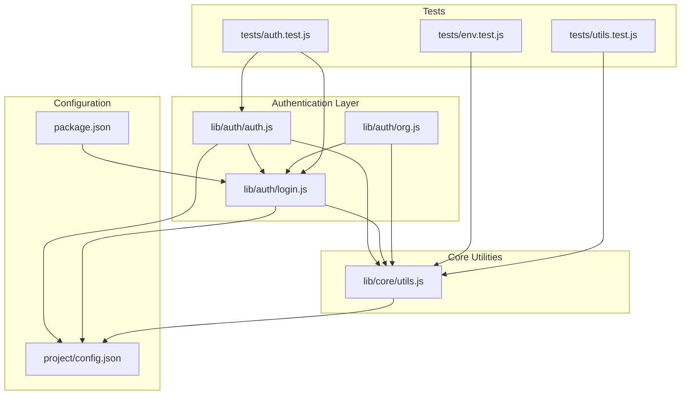
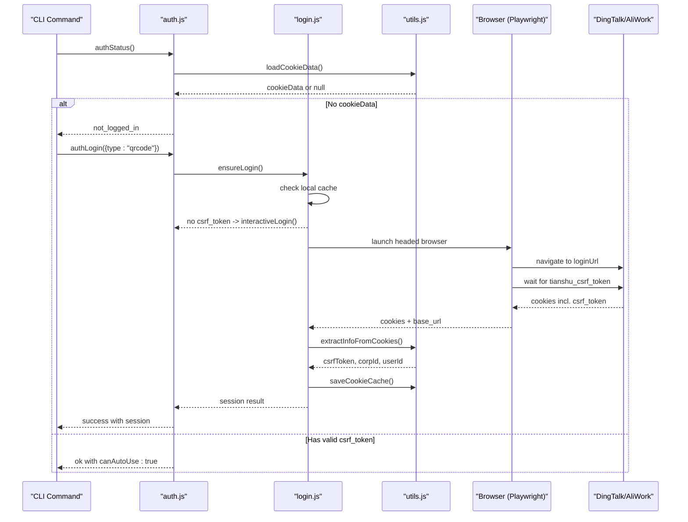
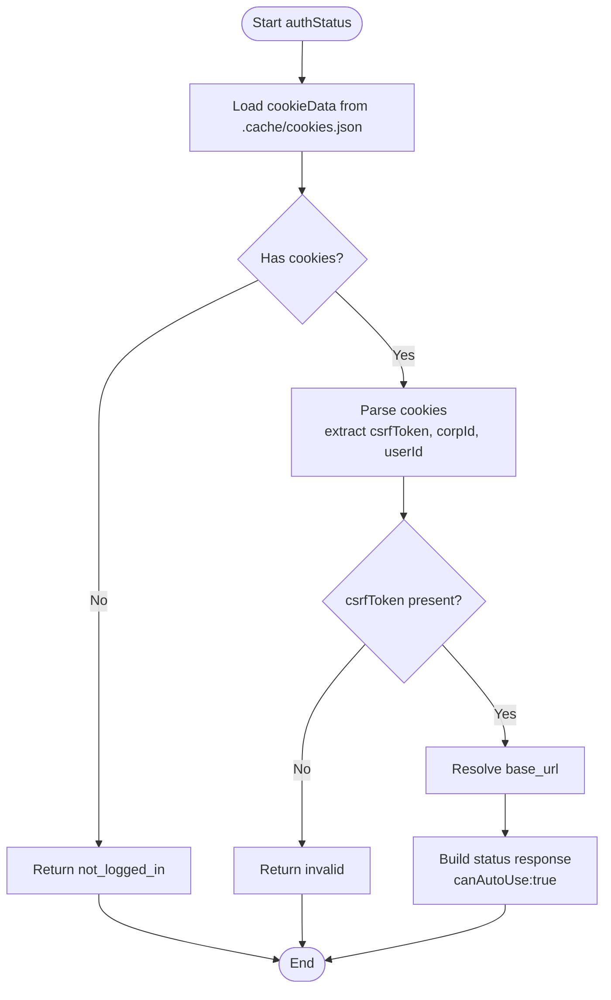
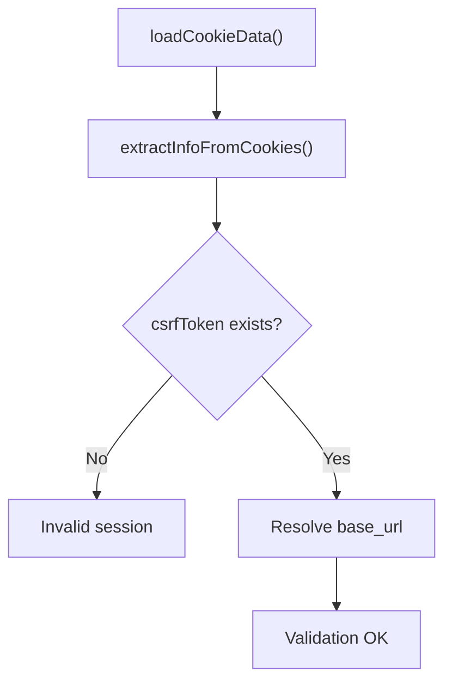
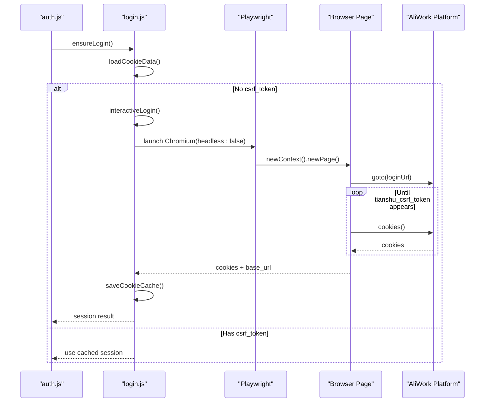
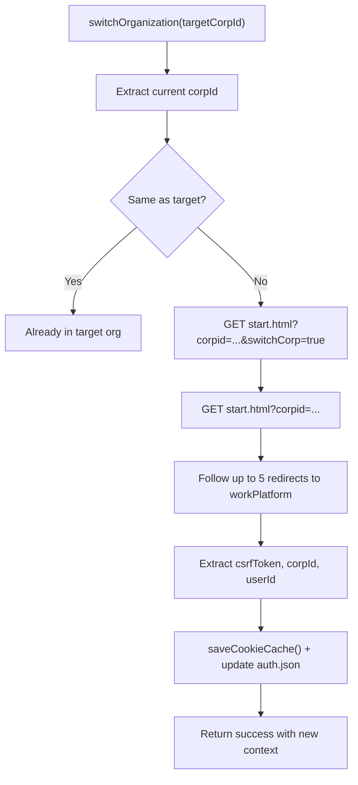
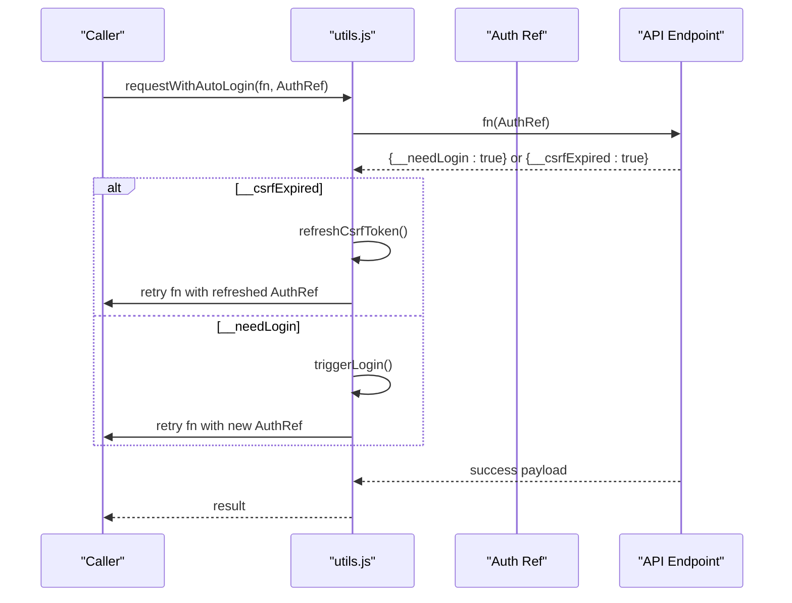
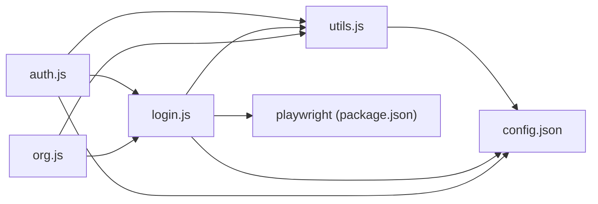

# DingTalk Auto-Login Detection

<cite>
**Referenced Files in This Document**
- [auth.js](file://lib/auth/auth.js)
- [login.js](file://lib/auth/login.js)
- [org.js](file://lib/auth/org.js)
- [utils.js](file://lib/core/utils.js)
- [auth.test.js](file://tests/auth.test.js)
- [env.test.js](file://tests/env.test.js)
- [utils.test.js](file://tests/utils.test.js)
- [config.json](file://project/config.json)
- [package.json](file://package.json)
- [SKILL.md](file://yida-skills/skills/yida-login/SKILL.md)
</cite>

## Table of Contents
1. [Introduction](#introduction)
2. [Project Structure](#project-structure)
3. [Core Components](#core-components)
4. [Architecture Overview](#architecture-overview)
5. [Detailed Component Analysis](#detailed-component-analysis)
6. [Dependency Analysis](#dependency-analysis)
7. [Performance Considerations](#performance-considerations)
8. [Troubleshooting Guide](#troubleshooting-guide)
9. [Conclusion](#conclusion)
10. [Appendices](#appendices)

## Introduction
This document explains OpenYida’s DingTalk auto-login detection mechanism for the DingTalk (AliWork) platform. It details how the system automatically detects existing login sessions, validates session integrity via cookie parsing and CSRF token verification, and determines organization context. It also documents the fallback logic that triggers QR code/browser-based authentication when auto-login detection fails, and outlines integration points, persistence mechanisms, and renewal processes. Practical scenarios such as fresh installations, cached sessions, expired sessions, and multi-organization environments are covered, along with configuration options and security considerations.

## Project Structure
The auto-login detection spans three primary modules:
- Authentication orchestration and persistence
- Login flow and browser automation
- Organization switching and context extraction

**Diagram sources**
- [auth.js:1-239](file://lib/auth/auth.js#L1-L239)
- [login.js:1-349](file://lib/auth/login.js#L1-L349)
- [org.js:1-364](file://lib/auth/org.js#L1-L364)
- [utils.js:1-463](file://lib/core/utils.js#L1-L463)
- [config.json:1-5](file://project/config.json#L1-L5)
- [package.json:50-74](file://package.json#L50-L74)
- [auth.test.js:100-199](file://tests/auth.test.js#L100-L199)
- [env.test.js:74-113](file://tests/env.test.js#L74-L113)
- [utils.test.js:40-154](file://tests/utils.test.js#L40-L154)

**Section sources**
- [auth.js:1-239](file://lib/auth/auth.js#L1-L239)
- [login.js:1-349](file://lib/auth/login.js#L1-L349)
- [org.js:1-364](file://lib/auth/org.js#L1-L364)
- [utils.js:1-463](file://lib/core/utils.js#L1-L463)
- [config.json:1-5](file://project/config.json#L1-L5)
- [package.json:50-74](file://package.json#L50-L74)

## Core Components
- Authentication status and lifecycle management
  - Provides status inspection, login initiation, refresh, and logout.
  - Persists minimal auth metadata to a project-scoped cache file.
- Login orchestration and browser automation
  - Attempts to reuse local cookie cache; otherwise opens a headed browser to guide QR-based login.
  - Extracts and persists cookies and base_url after successful login.
- Organization management
  - Lists and switches organizations without re-authentication by following platform redirects and updating cookies.
- Core utilities
  - Loads project root, parses cookies, resolves base_url, and performs HTTP requests with CSRF-aware headers.
  - Detects login and CSRF expiration from API responses and supports automatic retry with refresh or re-login.

**Section sources**
- [auth.js:29-239](file://lib/auth/auth.js#L29-L239)
- [login.js:45-349](file://lib/auth/login.js#L45-L349)
- [org.js:115-364](file://lib/auth/org.js#L115-L364)
- [utils.js:142-463](file://lib/core/utils.js#L142-L463)

## Architecture Overview
The auto-login detection algorithm follows a deterministic flow:
- Load local cookie cache
- Parse cookies for CSRF token, corpId, and userId
- Resolve base_url from cookie metadata or defaults
- Validate CSRF presence and session viability
- On success, return session info and enable auto-use
- On failure, trigger fallback QR login flow

**Diagram sources**
- [auth.js:61-127](file://lib/auth/auth.js#L61-L127)
- [login.js:134-155](file://lib/auth/login.js#L134-L155)
- [login.js:207-313](file://lib/auth/login.js#L207-L313)
- [utils.js:170-201](file://lib/core/utils.js#L170-L201)
- [utils.js:142-160](file://lib/core/utils.js#L142-L160)

## Detailed Component Analysis

### Auto-Login Detection Algorithm
The detection centers on validating a local cookie cache and extracting session identifiers.

Key steps:
- Load cookie cache from project .cache directory
- Parse cookies to extract CSRF token, corpId, and userId
- Resolve base_url from cookie domain or defaults
- If CSRF token exists, mark session as usable; otherwise, mark invalid

**Diagram sources**
- [auth.js:61-127](file://lib/auth/auth.js#L61-L127)
- [utils.js:170-201](file://lib/core/utils.js#L170-L201)
- [utils.js:142-160](file://lib/core/utils.js#L142-L160)

**Section sources**
- [auth.js:61-127](file://lib/auth/auth.js#L61-L127)
- [utils.js:170-201](file://lib/core/utils.js#L170-L201)
- [utils.js:142-160](file://lib/core/utils.js#L142-L160)

### Session Validation: Cookies, CSRF, and Base URL
- Cookie parsing
  - Extracts tianshu_csrf_token and tianshu_corp_user to derive corpId and userId.
  - Supports array or object cookie payloads and enriches cookieData with derived fields.
- CSRF token verification
  - Presence of tianshu_csrf_token is mandatory for a valid session.
  - Absence triggers invalid status and prompts re-login.
- Base URL resolution
  - Resolves to the actual aliwork subdomain from cookie domain or falls back to configured default.

**Diagram sources**
- [utils.js:170-201](file://lib/core/utils.js#L170-L201)
- [utils.js:142-160](file://lib/core/utils.js#L142-L160)
- [utils.js:261-264](file://lib/core/utils.js#L261-L264)

**Section sources**
- [utils.js:142-160](file://lib/core/utils.js#L142-L160)
- [utils.js:170-201](file://lib/core/utils.js#L170-L201)
- [utils.js:261-264](file://lib/core/utils.js#L261-L264)

### Fallback Logic: QR/Browser-Based Login
When auto-login detection fails, the system launches a headed browser to guide QR-based login:
- Determine login URL from config.json
- Launch Chromium with Playwright, open login page
- Poll for tianshu_csrf_token presence in cookies
- Extract base_url from cookie domain or current page origin
- Persist cookies and return session result

**Diagram sources**
- [login.js:134-155](file://lib/auth/login.js#L134-L155)
- [login.js:207-313](file://lib/auth/login.js#L207-L313)
- [config.json:1-5](file://project/config.json#L1-L5)

**Section sources**
- [login.js:134-155](file://lib/auth/login.js#L134-L155)
- [login.js:207-313](file://lib/auth/login.js#L207-L313)
- [config.json:1-5](file://project/config.json#L1-L5)

### Organization Context Detection and Switching
The system detects organization context from cookies and supports switching without re-authentication:
- Extract current corpId from cookies
- List organizations using persisted recent corps and current context
- Switch organization by following platform redirects and updating cookies
- Persist new corpId, userId, and timestamps

**Diagram sources**
- [org.js:190-313](file://lib/auth/org.js#L190-L313)
- [utils.js:142-160](file://lib/core/utils.js#L142-L160)

**Section sources**
- [org.js:190-313](file://lib/auth/org.js#L190-L313)
- [utils.js:142-160](file://lib/core/utils.js#L142-L160)

### Automatic Renewal and Request Retry
The system includes automatic renewal hooks:
- Detect login expiration or CSRF token expiration from API responses
- Refresh CSRF token from cache without re-login
- Trigger re-login and retry the request automatically

**Diagram sources**
- [utils.js:423-447](file://lib/core/utils.js#L423-L447)

**Section sources**
- [utils.js:423-447](file://lib/core/utils.js#L423-L447)

### Example Scenarios

- Fresh installation
  - No cookie cache exists; authStatus reports not_logged_in; authLogin triggers interactiveLogin; QR login completes and cookies are saved.
  - Section sources
    - [auth.js:70-78](file://lib/auth/auth.js#L70-L78)
    - [login.js:134-155](file://lib/auth/login.js#L134-L155)
    - [login.js:207-313](file://lib/auth/login.js#L207-L313)

- Cached session
  - Cookie cache present with valid csrf_token; authStatus returns ok with canAutoUse:true; session reused without browser.
  - Section sources
    - [auth.js:117-126](file://lib/auth/auth.js#L117-L126)
    - [utils.js:170-201](file://lib/core/utils.js#L170-L201)

- Expired session
  - API responds indicating login expired; requestWithAutoLogin triggers re-login and retries the request.
  - Section sources
    - [utils.js:423-447](file://lib/core/utils.js#L423-L447)
    - [utils.js:232-251](file://lib/core/utils.js#L232-L251)

- Multi-organization environment
  - Organization switching updates cookies and base_url; recent corps history is maintained.
  - Section sources
    - [org.js:190-313](file://lib/auth/org.js#L190-L313)
    - [auth.js:46-53](file://lib/auth/auth.js#L46-L53)

### Integration with DingTalk Platform Authentication
- Login URL and default base_url are configurable via project config.json.
- Playwright is used to automate browser-based QR login; the package dependency ensures availability.
- The CLI skill documentation describes the end-to-end QR login flow and output format.

**Section sources**
- [config.json:1-5](file://project/config.json#L1-L5)
- [package.json:50-74](file://package.json#L50-L74)
- [SKILL.md:57-89](file://yida-skills/skills/yida-login/SKILL.md#L57-L89)

## Dependency Analysis
- Module coupling
  - auth.js depends on login.js for ensureLogin and on utils.js for cookie loading and parsing.
  - login.js depends on utils.js for cookie parsing and base_url resolution, and on config.json for loginUrl/defaultBaseUrl.
  - org.js depends on utils.js for cookie parsing and on login.js for saving cookies.
  - utils.js provides shared utilities consumed by auth.js, login.js, and org.js.
- External dependencies
  - Playwright for browser automation during fallback login.
  - QR code library for QR generation in related flows.

**Diagram sources**
- [auth.js:19-23](file://lib/auth/auth.js#L19-L23)
- [login.js:15-21](file://lib/auth/login.js#L15-L21)
- [org.js:24-29](file://lib/auth/org.js#L24-L29)
- [utils.js:17-21](file://lib/core/utils.js#L17-L21)
- [config.json:1-5](file://project/config.json#L1-L5)
- [package.json:50-74](file://package.json#L50-L74)

**Section sources**
- [auth.js:19-23](file://lib/auth/auth.js#L19-L23)
- [login.js:15-21](file://lib/auth/login.js#L15-L21)
- [org.js:24-29](file://lib/auth/org.js#L24-L29)
- [utils.js:17-21](file://lib/core/utils.js#L17-L21)
- [package.json:50-74](file://package.json#L50-L74)

## Performance Considerations
- Local cookie cache avoids repeated browser automation, reducing latency and network overhead.
- Minimal cookie parsing cost; ensure cookie files are small and only include necessary cookies.
- Automatic retry logic prevents unnecessary user interruption but should be used judiciously to avoid excessive polling.

## Troubleshooting Guide
Common issues and resolutions:
- No cookie cache or empty cache
  - Symptom: not_logged_in status.
  - Action: Run QR login to generate cookies; verify .cache/cookies.json exists.
  - Section sources
    - [auth.js:70-78](file://lib/auth/auth.js#L70-L78)
    - [env.test.js:82-95](file://tests/env.test.js#L82-L95)

- Missing CSRF token in cache
  - Symptom: invalid status; re-login required.
  - Action: Perform QR login again; ensure tianshu_csrf_token is present in cookies.
  - Section sources
    - [auth.js:84-92](file://lib/auth/auth.js#L84-L92)
    - [auth.test.js:140-152](file://tests/auth.test.js#L140-L152)

- Login or CSRF token expired during requests
  - Symptom: API indicates login expired or CSRF token expired.
  - Action: Automatic retry will refresh CSRF or trigger re-login; verify network stability.
  - Section sources
    - [utils.js:423-447](file://lib/core/utils.js#L423-L447)
    - [utils.js:232-251](file://lib/core/utils.js#L232-L251)

- Browser compatibility or Playwright not installed
  - Symptom: Failure to launch browser for QR login.
  - Action: Install Playwright; ensure Node.js version meets engine requirement.
  - Section sources
    - [login.js:211-218](file://lib/auth/login.js#L211-L218)
    - [package.json:70-74](file://package.json#L70-L74)

- Organization switching fails
  - Symptom: Missing csrf_token in new cookies after redirect.
  - Action: Re-run QR login to refresh cookies; confirm platform redirects succeed.
  - Section sources
    - [org.js:256-263](file://lib/auth/org.js#L256-L263)

## Conclusion
OpenYida’s DingTalk auto-login detection leverages a robust, cache-first strategy to minimize friction for users. By parsing cookies, verifying CSRF tokens, and resolving base_url, it reliably detects valid sessions. When detection fails, a guided QR login flow ensures seamless fallback. The system further supports organization switching and automatic renewal, providing a resilient and user-friendly authentication experience.

## Appendices

### Configuration Options
- Project-level configuration
  - loginUrl: URL used for QR login flow
  - defaultBaseUrl: Fallback base URL when cookie domain is unavailable
  - Section sources
    - [config.json:1-5](file://project/config.json#L1-L5)

- Runtime behavior
  - Playwright dependency enables browser automation for QR login
  - Section sources
    - [package.json:50-74](file://package.json#L50-L74)

### Security Considerations
- Cookie persistence
  - Store cookies locally under .cache; restrict file permissions where possible.
- CSRF protection
  - Always verify tianshu_csrf_token presence before enabling auto-use.
- Base URL integrity
  - Prefer cookie-derived base_url to avoid stale or incorrect origins.
- Automatic renewal
  - Use automatic retry sparingly to prevent abuse; monitor error rates.