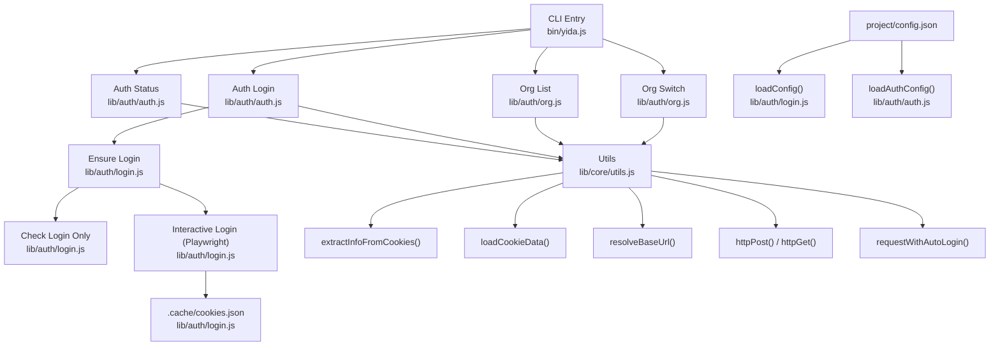
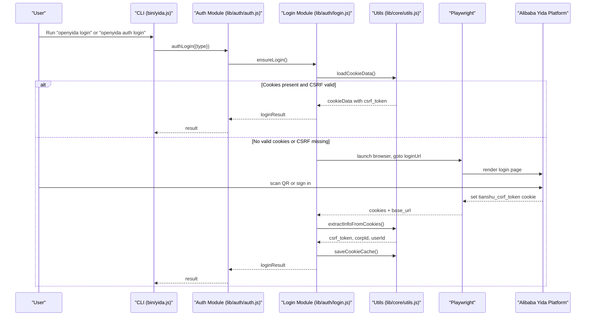
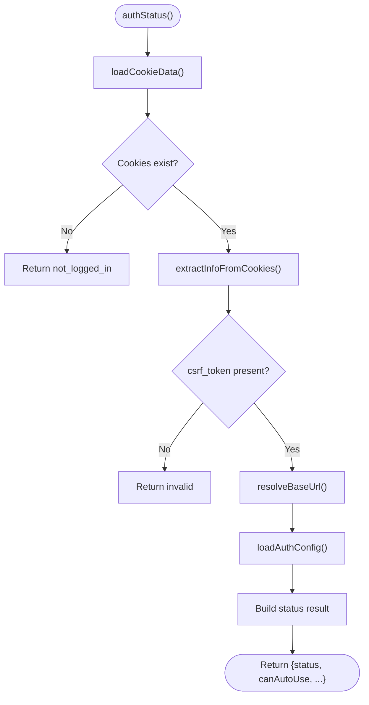
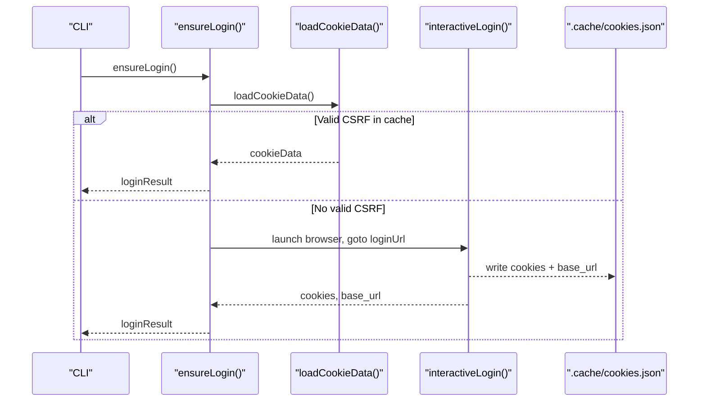
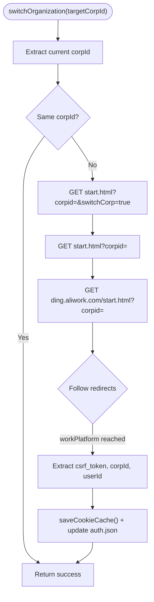
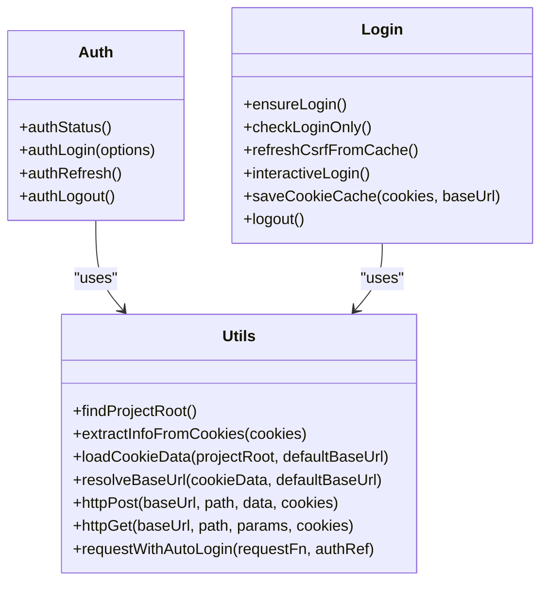
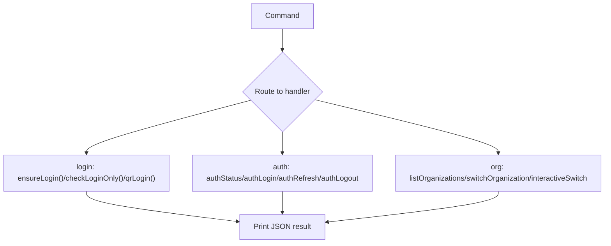
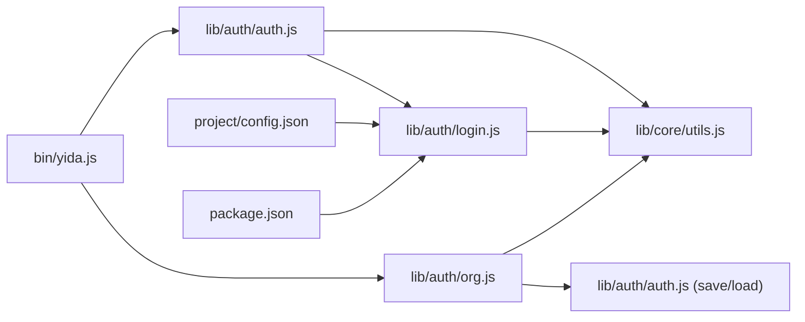

# Login Flows & Authentication Methods

<cite>
**Referenced Files in This Document**
- [bin/yida.js](file://bin/yida.js)
- [lib/auth/auth.js](file://lib/auth/auth.js)
- [lib/auth/login.js](file://lib/auth/login.js)
- [lib/auth/org.js](file://lib/auth/org.js)
- [lib/core/utils.js](file://lib/core/utils.js)
- [project/config.json](file://project/config.json)
- [tests/auth.test.js](file://tests/auth.test.js)
- [package.json](file://package.json)
</cite>

## Table of Contents
1. [Introduction](#introduction)
2. [Project Structure](#project-structure)
3. [Core Components](#core-components)
4. [Architecture Overview](#architecture-overview)
5. [Detailed Component Analysis](#detailed-component-analysis)
6. [Dependency Analysis](#dependency-analysis)
7. [Performance Considerations](#performance-considerations)
8. [Troubleshooting Guide](#troubleshooting-guide)
9. [Conclusion](#conclusion)
10. [Appendices](#appendices)

## Introduction
This document explains OpenYida’s login flow implementations and authentication mechanisms. It covers:
- Dual authentication modes: QR code-based login via a headed browser and DingTalk auto-login detection
- Browser automation using Playwright for seamless authentication
- Login flow orchestration: automatic login detection, QR code generation and scanning, and session establishment
- Integration with Alibaba Yida platform authentication systems, CSRF token extraction, and cookie management
- Step-by-step authentication workflows, error handling, and fallback mechanisms
- Examples for different user types and organizational setups
- Troubleshooting for common login issues

## Project Structure
OpenYida exposes CLI commands that drive authentication:
- The CLI entry point routes commands to authentication modules
- Authentication modules manage login state, cookies, CSRF tokens, and organization switching
- Utilities centralize cookie parsing, base URL resolution, and HTTP requests with auto-relogin and CSRF refresh logic

**Diagram sources**
- [bin/yida.js:165-204](file://bin/yida.js#L165-L204)
- [lib/auth/auth.js:29-53](file://lib/auth/auth.js#L29-L53)
- [lib/auth/login.js:27-41](file://lib/auth/login.js#L27-L41)
- [lib/auth/org.js:121-180](file://lib/auth/org.js#L121-L180)
- [lib/core/utils.js:142-201](file://lib/core/utils.js#L142-L201)
- [project/config.json:1-5](file://project/config.json#L1-L5)

**Section sources**
- [bin/yida.js:165-204](file://bin/yida.js#L165-L204)
- [lib/auth/auth.js:29-53](file://lib/auth/auth.js#L29-L53)
- [lib/auth/login.js:27-41](file://lib/auth/login.js#L27-L41)
- [lib/auth/org.js:121-180](file://lib/auth/org.js#L121-L180)
- [lib/core/utils.js:142-201](file://lib/core/utils.js#L142-L201)
- [project/config.json:1-5](file://project/config.json#L1-L5)

## Core Components
- Authentication status and orchestration: [lib/auth/auth.js](file://lib/auth/auth.js)
- Login logic and Playwright automation: [lib/auth/login.js](file://lib/auth/login.js)
- Organization switching and HTTP utilities: [lib/auth/org.js](file://lib/auth/org.js)
- Shared utilities for cookies, CSRF, base URL, and HTTP requests: [lib/core/utils.js](file://lib/core/utils.js)
- CLI routing and command dispatch: [bin/yida.js](file://bin/yida.js)
- Project configuration for login and base URLs: [project/config.json](file://project/config.json)
- Tests validating auth flows and cookie handling: [tests/auth.test.js](file://tests/auth.test.js)

Key responsibilities:
- Detect and validate login state from cached cookies
- Extract CSRF token, corpId, and userId from cookies
- Resolve base URL from cookie domain or current page
- Perform Playwright-driven QR login with 10-minute timeout
- Persist cookies to .cache/cookies.json for reuse
- Refresh CSRF token from cache without re-login
- Switch organizations without re-authentication
- Auto-relogin and CSRF refresh during HTTP requests

**Section sources**
- [lib/auth/auth.js:61-127](file://lib/auth/auth.js#L61-L127)
- [lib/auth/login.js:61-93](file://lib/auth/login.js#L61-L93)
- [lib/auth/login.js:134-155](file://lib/auth/login.js#L134-L155)
- [lib/auth/login.js:207-313](file://lib/auth/login.js#L207-L313)
- [lib/auth/org.js:190-313](file://lib/auth/org.js#L190-L313)
- [lib/core/utils.js:142-201](file://lib/core/utils.js#L142-L201)
- [lib/core/utils.js:261-264](file://lib/core/utils.js#L261-L264)
- [lib/core/utils.js:276-341](file://lib/core/utils.js#L276-L341)
- [lib/core/utils.js:423-447](file://lib/core/utils.js#L423-L447)

## Architecture Overview
OpenYida’s authentication architecture centers on:
- CLI commands invoking authentication modules
- Centralized cookie and CSRF token extraction
- Base URL resolution supporting aliwork domains and custom domains
- Playwright automation for QR login with robust timeout handling
- HTTP utilities that auto-detect expired login or CSRF and trigger re-login or refresh

**Diagram sources**
- [bin/yida.js:165-204](file://bin/yida.js#L165-L204)
- [lib/auth/auth.js:137-160](file://lib/auth/auth.js#L137-L160)
- [lib/auth/login.js:134-155](file://lib/auth/login.js#L134-L155)
- [lib/auth/login.js:207-313](file://lib/auth/login.js#L207-L313)
- [lib/core/utils.js:142-201](file://lib/core/utils.js#L142-L201)

## Detailed Component Analysis

### Authentication Orchestration (lib/auth/auth.js)
- Loads and saves authentication configuration (login type, timestamps, corp/user IDs)
- Provides status reporting with CSRF token visibility and organization info
- Executes login via ensureLogin and persists auth metadata
- Refreshes login state from cached cookies and updates auth.json

**Diagram sources**
- [lib/auth/auth.js:61-127](file://lib/auth/auth.js#L61-L127)
- [lib/core/utils.js:142-201](file://lib/core/utils.js#L142-L201)
- [lib/core/utils.js:261-264](file://lib/core/utils.js#L261-L264)

**Section sources**
- [lib/auth/auth.js:29-53](file://lib/auth/auth.js#L29-L53)
- [lib/auth/auth.js:61-127](file://lib/auth/auth.js#L61-L127)
- [lib/auth/auth.js:137-160](file://lib/auth/auth.js#L137-L160)
- [lib/auth/auth.js:168-210](file://lib/auth/auth.js#L168-L210)
- [lib/auth/auth.js:217-239](file://lib/auth/auth.js#L217-L239)

### Login Flow (lib/auth/login.js)
- Config loading from project/config.json with defaults
- Ensures login by checking cached cookies first; falls back to Playwright QR login
- Playwright automation:
  - Launches a headed Chromium browser
  - Navigates to configured login URL
  - Polls for tianshu_csrf_token cookie up to 10 minutes
  - Resolves base_url from cookie domain or current page
  - Saves cookies to .cache/cookies.json
- Exposes helpers:
  - checkLoginOnly(): returns status without triggering login
  - refreshCsrfFromCache(): extracts CSRF from cache without re-login
  - saveCookieCache(): persists cookies and base_url
  - logout(): removes cookies.json

**Diagram sources**
- [lib/auth/login.js:134-155](file://lib/auth/login.js#L134-L155)
- [lib/auth/login.js:207-313](file://lib/auth/login.js#L207-L313)
- [lib/core/utils.js:142-201](file://lib/core/utils.js#L142-L201)

**Section sources**
- [lib/auth/login.js:27-41](file://lib/auth/login.js#L27-L41)
- [lib/auth/login.js:61-93](file://lib/auth/login.js#L61-L93)
- [lib/auth/login.js:101-126](file://lib/auth/login.js#L101-L126)
- [lib/auth/login.js:134-155](file://lib/auth/login.js#L134-L155)
- [lib/auth/login.js:207-313](file://lib/auth/login.js#L207-L313)

### Organization Switching (lib/auth/org.js)
- Lists organizations using cached auth configuration and current corpId
- Switches organization via HTTP requests without re-authentication
- Follows redirects and extracts new CSRF token and base_url
- Persists updated cookies and auth configuration

**Diagram sources**
- [lib/auth/org.js:190-313](file://lib/auth/org.js#L190-L313)
- [lib/auth/org.js:42-85](file://lib/auth/org.js#L42-L85)
- [lib/auth/org.js:93-112](file://lib/auth/org.js#L93-L112)

**Section sources**
- [lib/auth/org.js:121-180](file://lib/auth/org.js#L121-L180)
- [lib/auth/org.js:190-313](file://lib/auth/org.js#L190-L313)
- [lib/auth/org.js:322-357](file://lib/auth/org.js#L322-L357)

### Utilities and CSRF/Base URL Handling (lib/core/utils.js)
- extractInfoFromCookies(): parses tianshu_csrf_token, corpId, and userId
- loadCookieData(): reads .cache/cookies.json with array-or-object support
- resolveBaseUrl(): normalizes base_url from cookie domain or fallback
- HTTP helpers: httpPost() and httpGet() attach global_csrf_token header and filter cookies by domain
- requestWithAutoLogin(): transparently re-login or refresh CSRF on expiration

**Diagram sources**
- [lib/core/utils.js:142-201](file://lib/core/utils.js#L142-L201)
- [lib/core/utils.js:261-264](file://lib/core/utils.js#L261-L264)
- [lib/core/utils.js:276-341](file://lib/core/utils.js#L276-L341)
- [lib/core/utils.js:423-447](file://lib/core/utils.js#L423-L447)
- [lib/auth/auth.js:61-127](file://lib/auth/auth.js#L61-L127)
- [lib/auth/login.js:134-155](file://lib/auth/login.js#L134-L155)

**Section sources**
- [lib/core/utils.js:142-201](file://lib/core/utils.js#L142-L201)
- [lib/core/utils.js:261-264](file://lib/core/utils.js#L261-L264)
- [lib/core/utils.js:276-341](file://lib/core/utils.js#L276-L341)
- [lib/core/utils.js:423-447](file://lib/core/utils.js#L423-L447)

### CLI Command Routing (bin/yida.js)
- Routes "login", "logout", "auth status|login|refresh|logout", and "org list|switch"
- Invokes appropriate modules and prints structured JSON for machine consumption

**Diagram sources**
- [bin/yida.js:165-204](file://bin/yida.js#L165-L204)
- [bin/yida.js:207-241](file://bin/yida.js#L207-L241)

**Section sources**
- [bin/yida.js:165-204](file://bin/yida.js#L165-L204)
- [bin/yida.js:207-241](file://bin/yida.js#L207-L241)

## Dependency Analysis
- Runtime dependencies include Playwright for browser automation
- Internal dependencies:
  - CLI depends on auth and org modules
  - Auth module depends on login and utils
  - Login module depends on utils and project config
  - Org module depends on utils and auth config

**Diagram sources**
- [bin/yida.js:165-204](file://bin/yida.js#L165-L204)
- [lib/auth/auth.js:21-23](file://lib/auth/auth.js#L21-L23)
- [lib/auth/login.js:19-20](file://lib/auth/login.js#L19-L20)
- [lib/auth/org.js:27-28](file://lib/auth/org.js#L27-L28)
- [project/config.json:1-5](file://project/config.json#L1-L5)
- [package.json:50-55](file://package.json#L50-L55)

**Section sources**
- [package.json:50-55](file://package.json#L50-L55)
- [lib/auth/auth.js:21-23](file://lib/auth/auth.js#L21-L23)
- [lib/auth/login.js:19-20](file://lib/auth/login.js#L19-L20)
- [lib/auth/org.js:27-28](file://lib/auth/org.js#L27-L28)

## Performance Considerations
- Playwright browser launch and navigation add latency; subsequent logins reuse cached cookies
- Network timeouts are set per HTTP request; adjust if behind restrictive proxies
- Base URL resolution avoids redundant DNS lookups by caching resolved origin
- Auto-relogin and CSRF refresh occur transparently during HTTP operations to minimize user interruption

## Troubleshooting Guide
Common issues and resolutions:
- No playwright installed
  - Symptom: Error indicating playwright not found during QR login
  - Resolution: Install Playwright globally and Chromium driver as indicated by CLI messages
  - Section sources
    - [lib/auth/login.js:213-218](file://lib/auth/login.js#L213-L218)

- Login timeout (10 minutes)
  - Symptom: Timeout after extended inactivity or slow network
  - Resolution: Retry login; ensure stable network and sufficient time for scanning
  - Section sources
    - [lib/auth/login.js:249-253](file://lib/auth/login.js#L249-L253)

- Missing CSRF token in cache
  - Symptom: "No csrf_token in cache" or "No tianshu_csrf_token in Cookie"
  - Resolution: Perform QR login to regenerate cookies; verify .cache/cookies.json exists
  - Section sources
    - [lib/auth/auth.js:173-189](file://lib/auth/auth.js#L173-L189)
    - [lib/auth/login.js:104-114](file://lib/auth/login.js#L104-L114)

- Login or CSRF expired during requests
  - Symptom: HTTP responses indicate login expired or CSRF expired
  - Resolution: Auto-relogin or CSRF refresh occurs automatically; retry operation
  - Section sources
    - [lib/core/utils.js:320-327](file://lib/core/utils.js#L320-L327)
    - [lib/core/utils.js:423-447](file://lib/core/utils.js#L423-L447)

- Organization switch fails due to missing CSRF
  - Symptom: Switch returns failure due to missing csrf_token
  - Resolution: Re-authenticate and retry organization switch
  - Section sources
    - [lib/auth/org.js:256-263](file://lib/auth/org.js#L256-L263)

- Logout does not remove cookies
  - Symptom: cookies.json still exists after logout
  - Resolution: Confirm project root and .cache directory; ensure CLI runs from correct project
  - Section sources
    - [lib/auth/login.js:320-339](file://lib/auth/login.js#L320-L339)

## Conclusion
OpenYida provides a robust, automated authentication system:
- Seamless QR login via Playwright with clear timeouts and error messaging
- Persistent cookie and CSRF management for repeatable sessions
- Transparent auto-relogin and CSRF refresh during HTTP operations
- Organization switching without re-authentication
- Well-defined CLI commands and modular components for maintainability and extensibility

## Appendices

### Step-by-Step Workflows

- Automatic login detection and reuse
  - Load cached cookies and validate CSRF token
  - If valid, return login result immediately
  - If missing, proceed to QR login
  - Section sources
    - [lib/auth/login.js:134-155](file://lib/auth/login.js#L134-L155)
    - [lib/auth/auth.js:61-127](file://lib/auth/auth.js#L61-L127)

- QR code login flow
  - Verify Playwright availability
  - Launch headed browser and navigate to login URL
  - Poll for tianshu_csrf_token cookie up to 10 minutes
  - Extract base_url from cookie domain or current page
  - Save cookies to .cache/cookies.json
  - Section sources
    - [lib/auth/login.js:213-218](file://lib/auth/login.js#L213-L218)
    - [lib/auth/login.js:249-253](file://lib/auth/login.js#L249-L253)
    - [lib/auth/login.js:260-272](file://lib/auth/login.js#L260-L272)
    - [lib/auth/login.js:298-302](file://lib/auth/login.js#L298-L302)

- Session establishment and CSRF extraction
  - Parse tianshu_csrf_token, corpId, and userId from cookies
  - Resolve base_url from cookie domain or fallback
  - Save to auth.json and cookies.json for future use
  - Section sources
    - [lib/core/utils.js:142-160](file://lib/core/utils.js#L142-L160)
    - [lib/core/utils.js:261-264](file://lib/core/utils.js#L261-L264)
    - [lib/auth/auth.js:146-152](file://lib/auth/auth.js#L146-L152)

- Organization switching
  - Build switch URLs and follow redirects
  - Extract new CSRF token and corpId
  - Persist updated cookies and update auth configuration
  - Section sources
    - [lib/auth/org.js:215-251](file://lib/auth/org.js#L215-L251)
    - [lib/auth/org.js:266-290](file://lib/auth/org.js#L266-L290)

### Example Scenarios
- Standard enterprise user with aliwork.com domain
  - Use default login URL and base URL
  - QR login captures cookies and CSRF token
  - Section sources
    - [project/config.json:1-5](file://project/config.json#L1-L5)
    - [lib/auth/login.js:209-210](file://lib/auth/login.js#L209-L210)

- Enterprise user with custom aliwork subdomain
  - Base URL derived from cookie domain
  - Section sources
    - [lib/auth/login.js:262-271](file://lib/auth/login.js#L262-L271)
    - [lib/core/utils.js:261-264](file://lib/core/utils.js#L261-L264)

- Multi-org user
  - List organizations and switch without re-authentication
  - Section sources
    - [lib/auth/org.js:121-180](file://lib/auth/org.js#L121-L180)
    - [lib/auth/org.js:190-313](file://lib/auth/org.js#L190-L313)

### Error Handling and Fallbacks
- Playwright not installed: prompt to install and exit
- No cookie cache: trigger QR login
- CSRF missing in cache: exit with guidance to re-login
- Login or CSRF expired during HTTP: auto-relogin or refresh
- Organization switch fails: prompt to re-authenticate
- Section sources
  - [lib/auth/login.js:213-218](file://lib/auth/login.js#L213-L218)
  - [lib/auth/auth.js:173-189](file://lib/auth/auth.js#L173-L189)
  - [lib/core/utils.js:320-327](file://lib/core/utils.js#L320-L327)
  - [lib/core/utils.js:423-447](file://lib/core/utils.js#L423-L447)
  - [lib/auth/org.js:256-263](file://lib/auth/org.js#L256-L263)