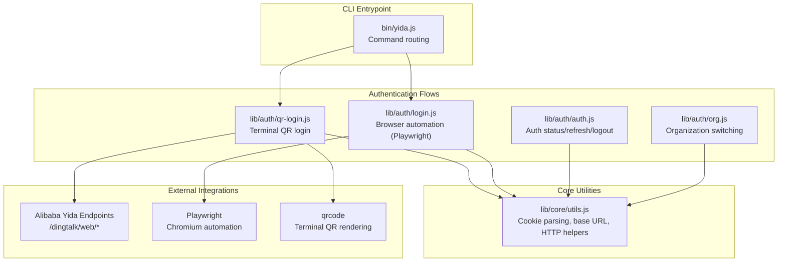
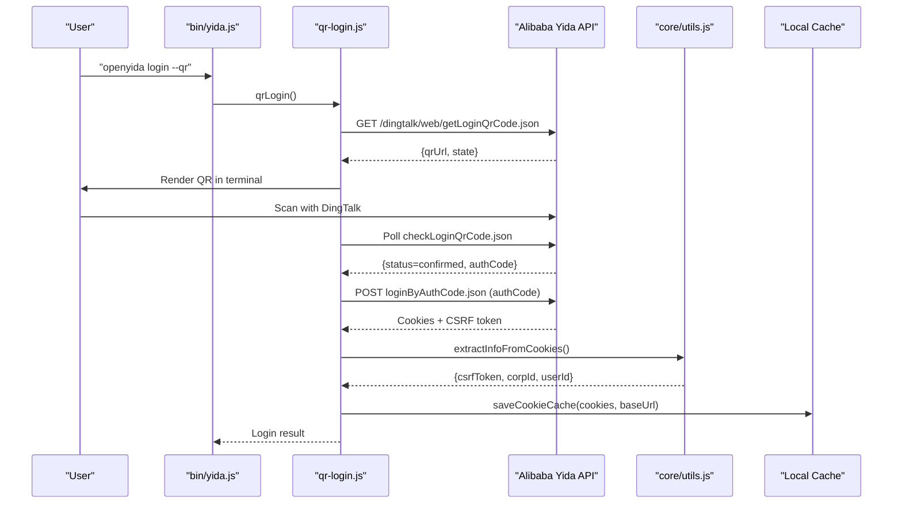
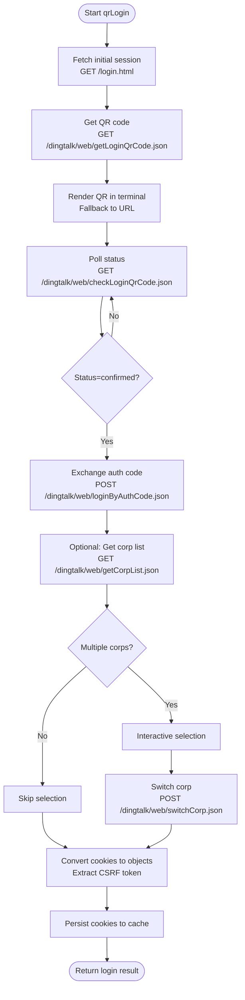
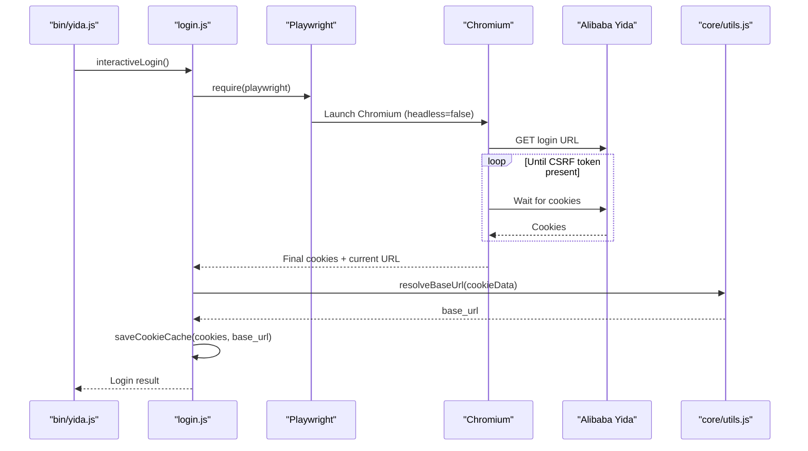
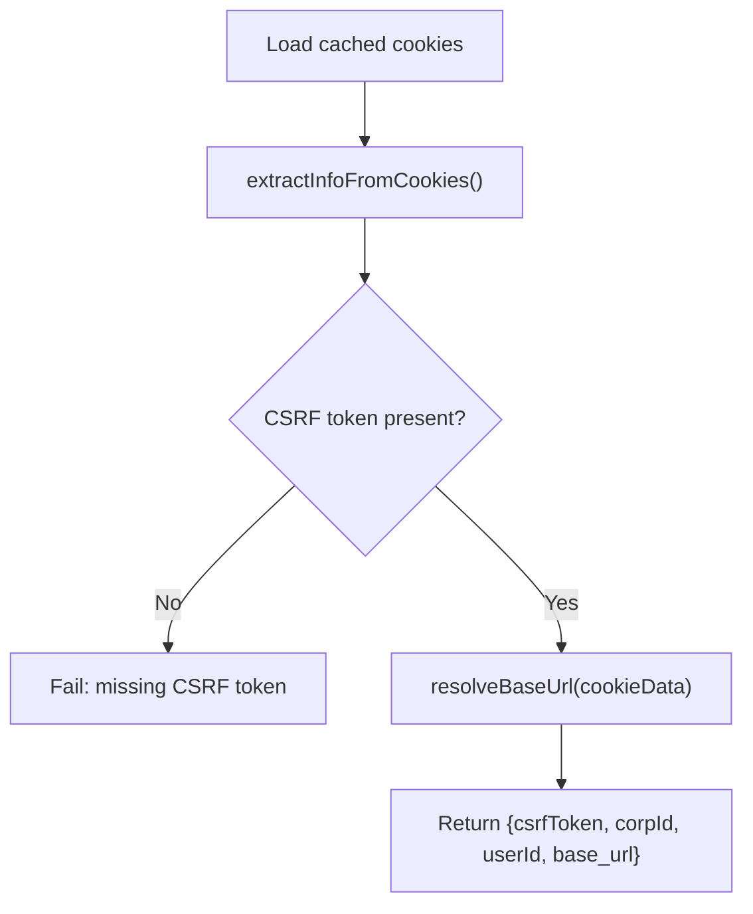
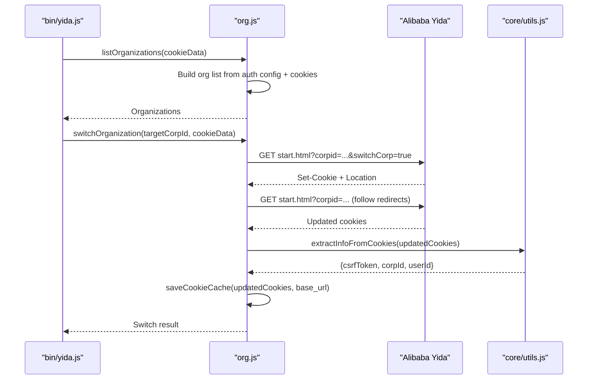
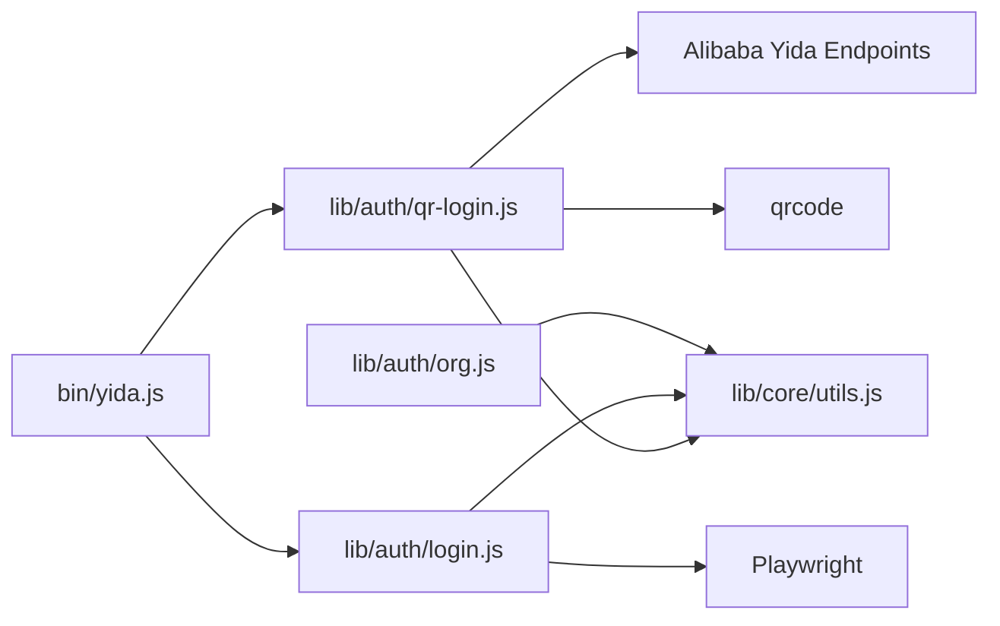

# QR Code Authentication Flow

<cite>
**Referenced Files in This Document**
- [yida.js](file://bin/yida.js)
- [package.json](file://package.json)
- [auth.js](file://lib/auth/auth.js)
- [login.js](file://lib/auth/login.js)
- [qr-login.js](file://lib/auth/qr-login.js)
- [utils.js](file://lib/core/utils.js)
- [org.js](file://lib/auth/org.js)
- [en.js](file://lib/core/locales/en.js)
- [auth.test.js](file://tests/auth.test.js)
- [config.json](file://project/config.json)
</cite>

## Table of Contents
1. [Introduction](#introduction)
2. [Project Structure](#project-structure)
3. [Core Components](#core-components)
4. [Architecture Overview](#architecture-overview)
5. [Detailed Component Analysis](#detailed-component-analysis)
6. [Dependency Analysis](#dependency-analysis)
7. [Performance Considerations](#performance-considerations)
8. [Troubleshooting Guide](#troubleshooting-guide)
9. [Conclusion](#conclusion)

## Introduction
This document explains OpenYida's QR code authentication implementation for Alibaba Yida (DingTalk-based low-code platform). It covers the complete flow from QR code generation to session establishment, including browser automation via Playwright, cookie extraction, CSRF token validation, base URL resolution for standard and custom domains, and robust timeout/retry/error handling. It also documents integration with Alibaba Yida endpoints and cookie management for persistent sessions.

## Project Structure
OpenYida exposes two primary QR-based login modes:
- Terminal QR login using HTTP APIs and a terminal QR renderer
- Browser-based QR login using Playwright to automate a real browser

Key modules involved:
- Command entrypoint routes user commands to authentication flows
- QR login module orchestrates HTTP requests to Alibaba Yida endpoints
- Login module handles Playwright automation and cookie caching
- Utilities module extracts CSRF tokens, resolves base URLs, and manages HTTP requests
- Organization module switches organizations without re-authentication

**Diagram sources**
- [yida.js:165-179](file://bin/yida.js#L165-L179)
- [qr-login.js:499-617](file://lib/auth/qr-login.js#L499-L617)
- [login.js:207-313](file://lib/auth/login.js#L207-L313)
- [auth.js:61-127](file://lib/auth/auth.js#L61-L127)
- [org.js:121-180](file://lib/auth/org.js#L121-L180)
- [utils.js:142-201](file://lib/core/utils.js#L142-L201)

**Section sources**
- [yida.js:165-179](file://bin/yida.js#L165-L179)
- [package.json:50-55](file://package.json#L50-L55)

## Core Components
- Terminal QR login: Generates QR code, polls status, exchanges auth code for cookies, selects organization, persists cookies, and validates CSRF token.
- Browser automation login: Launches Chromium, navigates to login URL, waits for CSRF token presence, extracts cookies, resolves base URL, and saves cache.
- Utilities: Extract CSRF token/corp/user info from cookies, load cached cookies, resolve base URL, and wrap HTTP requests with auto-relogin and CSRF refresh.
- Organization switching: Switches organizations without re-authentication by following redirects and updating cookies.

**Section sources**
- [qr-login.js:499-617](file://lib/auth/qr-login.js#L499-L617)
- [login.js:207-313](file://lib/auth/login.js#L207-L313)
- [utils.js:142-201](file://lib/core/utils.js#L142-L201)
- [org.js:190-313](file://lib/auth/org.js#L190-L313)

## Architecture Overview
The authentication architecture integrates CLI commands, HTTP endpoints, browser automation, and cookie management.

**Diagram sources**
- [yida.js:170-172](file://bin/yida.js#L170-L172)
- [qr-login.js:257-361](file://lib/auth/qr-login.js#L257-L361)
- [utils.js:142-160](file://lib/core/utils.js#L142-L160)

## Detailed Component Analysis

### Terminal QR Login Flow
End-to-end flow for terminal-based QR login:
1. Initialize session and fetch initial cookies from login page
2. Request QR code URL and state from Alibaba Yida endpoint
3. Render QR in terminal (fallback to URL if QR rendering fails)
4. Poll QR status until confirmed
5. Exchange auth code for login cookies
6. Optionally fetch organization list and switch organization
7. Convert cookie header to objects, extract CSRF token, persist cache, and return result

**Diagram sources**
- [qr-login.js:507-599](file://lib/auth/qr-login.js#L507-L599)

**Section sources**
- [qr-login.js:238-430](file://lib/auth/qr-login.js#L238-L430)
- [qr-login.js:499-617](file://lib/auth/qr-login.js#L499-L617)

### Browser Automation Login Flow (Playwright)
When the terminal QR login is unavailable, the CLI can launch a real browser to perform the login:
1. Resolve Playwright path and launch Chromium with a visible window
2. Navigate to the configured login URL
3. Poll for presence of CSRF token cookie to detect successful login
4. Extract cookies and determine base URL from cookie domain or current URL
5. Close browser and save cookies to cache

**Diagram sources**
- [login.js:207-275](file://lib/auth/login.js#L207-L275)
- [utils.js:261-264](file://lib/core/utils.js#L261-L264)

**Section sources**
- [login.js:207-313](file://lib/auth/login.js#L207-L313)
- [utils.js:261-264](file://lib/core/utils.js#L261-L264)

### Cookie Extraction, CSRF Validation, and Base URL Resolution
- Cookie extraction: Parses cookies to retrieve CSRF token, corp ID, and user ID
- CSRF validation: Ensures CSRF token exists before considering login successful
- Base URL resolution: Determines base URL from cookie domain (preferred) or current URL origin

**Diagram sources**
- [utils.js:142-160](file://lib/core/utils.js#L142-L160)
- [utils.js:261-264](file://lib/core/utils.js#L261-L264)

**Section sources**
- [utils.js:142-160](file://lib/core/utils.js#L142-L160)
- [utils.js:261-264](file://lib/core/utils.js#L261-L264)

### Organization Switching Without Re-authentication
After login, users can switch organizations without re-entering credentials:
1. List organizations using cached auth config and current cookies
2. Perform HTTP GET requests with cookie forwarding
3. Follow redirects to obtain updated cookies
4. Persist new cookies and update recent organizations history

**Diagram sources**
- [org.js:121-180](file://lib/auth/org.js#L121-L180)
- [org.js:190-313](file://lib/auth/org.js#L190-L313)
- [utils.js:142-160](file://lib/core/utils.js#L142-L160)

**Section sources**
- [org.js:121-180](file://lib/auth/org.js#L121-L180)
- [org.js:190-313](file://lib/auth/org.js#L190-L313)

## Dependency Analysis
- CLI depends on authentication modules for login and status checks
- QR login depends on HTTP utilities and external Alibaba Yida endpoints
- Browser login depends on Playwright and Chromium
- All flows depend on core utilities for cookie parsing and base URL resolution
- Organization switching depends on HTTP utilities and Alibaba Yida redirect flow

**Diagram sources**
- [yida.js:165-179](file://bin/yida.js#L165-L179)
- [qr-login.js:499-617](file://lib/auth/qr-login.js#L499-L617)
- [login.js:207-313](file://lib/auth/login.js#L207-L313)
- [utils.js:142-201](file://lib/core/utils.js#L142-L201)
- [org.js:121-180](file://lib/auth/org.js#L121-L180)
- [package.json:50-55](file://package.json#L50-L55)

**Section sources**
- [yida.js:165-179](file://bin/yida.js#L165-L179)
- [package.json:50-55](file://package.json#L50-L55)

## Performance Considerations
- QR polling interval balances responsiveness and API load; adjust as needed for reliability vs. latency
- Timeout handling ensures long-running operations fail fast; consider exponential backoff for retries
- Cookie filtering reduces request overhead by sending only applicable cookies per host
- Base URL resolution avoids redundant DNS lookups by caching resolved origin

## Troubleshooting Guide
Common issues and remedies:
- QR code scanning failures
  - Symptom: Polling stops without confirmation or expires
  - Actions: Verify network connectivity, retry QR generation, ensure DingTalk app is available, and check for QR expiration
  - References: [qr-login.js:290-330](file://lib/auth/qr-login.js#L290-L330), [en.js:728-729](file://lib/core/locales/en.js#L728-L729)

- Network connectivity problems
  - Symptom: Requests timeout or fail to parse responses
  - Actions: Increase timeouts, retry with backoff, verify endpoint reachability, and check proxy/firewall
  - References: [qr-login.js:37-115](file://lib/auth/qr-login.js#L37-L115), [utils.js:276-341](file://lib/core/utils.js#L276-L341)

- Browser compatibility issues
  - Symptom: Playwright not found or browser fails to launch
  - Actions: Install Playwright, ensure compatible Chromium, and verify Node.js version meets engine requirements
  - References: [login.js:169-201](file://lib/auth/login.js#L169-L201), [package.json:70-73](file://package.json#L70-L73)

- Missing CSRF token after login
  - Symptom: Login appears successful but CSRF token is absent
  - Actions: Re-run login, verify cookie extraction, and check base URL resolution
  - References: [qr-login.js:594-597](file://lib/auth/qr-login.js#L594-L597), [utils.js:142-160](file://lib/core/utils.js#L142-L160)

- Organization switching errors
  - Symptom: Redirect loops or missing CSRF token after switch
  - Actions: Follow redirects up to limit, verify cookie updates, and re-save cache
  - References: [org.js:232-251](file://lib/auth/org.js#L232-L251), [utils.js:142-160](file://lib/core/utils.js#L142-L160)

- Timeout handling and retry mechanisms
  - QR polling: Up to 120 attempts at 1-second intervals
  - Browser login: 10-minute wait with periodic cookie checks
  - HTTP requests: 30-second timeouts with error propagation
  - References: [qr-login.js:290-330](file://lib/auth/qr-login.js#L290-L330), [login.js:240-254](file://lib/auth/login.js#L240-L254), [utils.js:276-341](file://lib/core/utils.js#L276-L341)

**Section sources**
- [qr-login.js:290-330](file://lib/auth/qr-login.js#L290-L330)
- [login.js:240-254](file://lib/auth/login.js#L240-L254)
- [utils.js:276-341](file://lib/core/utils.js#L276-L341)
- [en.js:728-729](file://lib/core/locales/en.js#L728-L729)

## Conclusion
OpenYida’s QR authentication combines robust terminal and browser-based flows to support Alibaba Yida login. The implementation emphasizes resilient polling, explicit CSRF validation, flexible base URL resolution, and seamless organization switching. By leveraging core utilities and clear error handling, it delivers a reliable user experience across diverse environments and configurations.