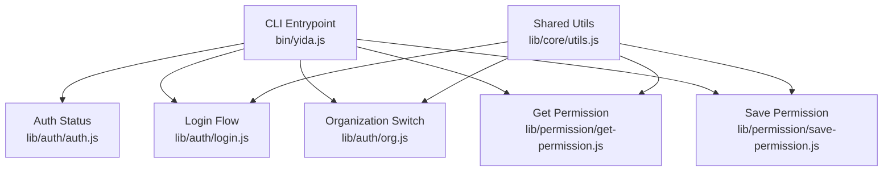
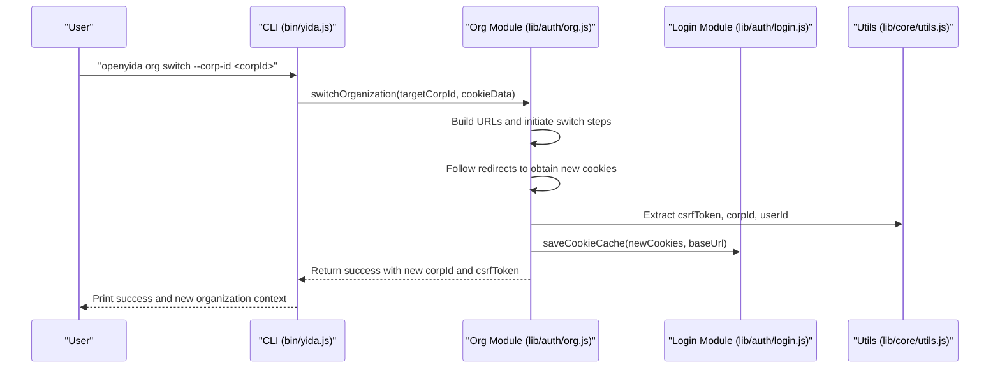
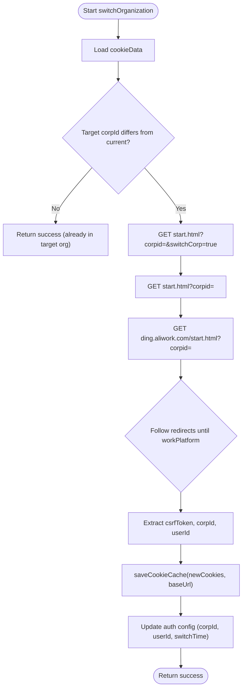
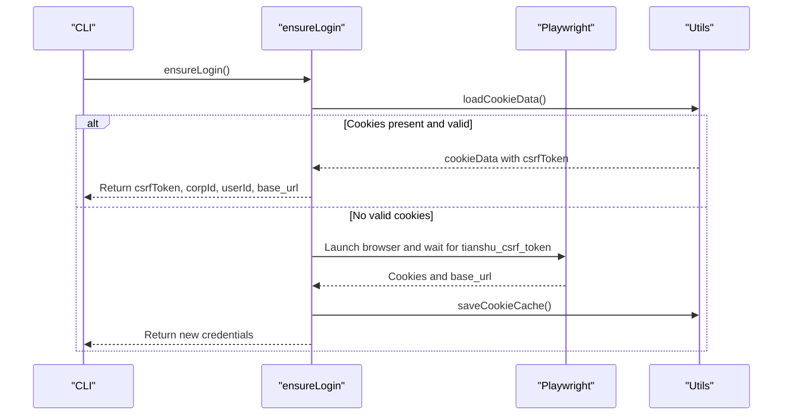
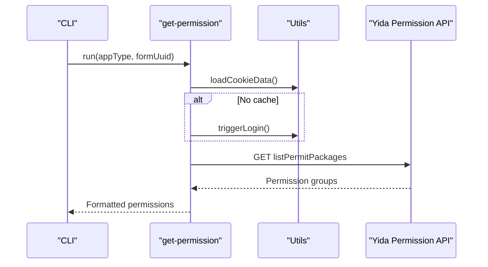
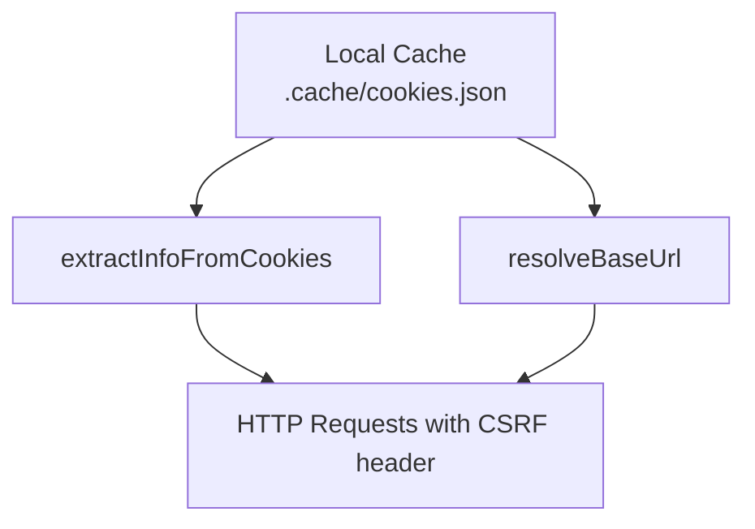
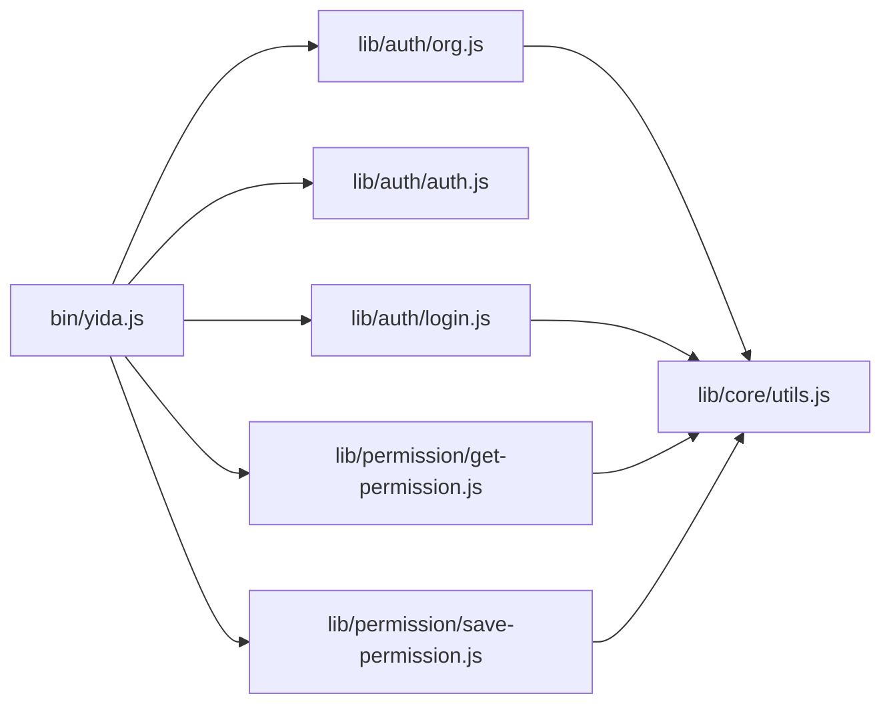

# Organization Management & Multi-Tenant Support

<cite>
**Referenced Files in This Document**
- [README.md](file://README.md)
- [bin/yida.js](file://bin/yida.js)
- [lib/auth/org.js](file://lib/auth/org.js)
- [lib/auth/auth.js](file://lib/auth/auth.js)
- [lib/auth/login.js](file://lib/auth/login.js)
- [lib/core/utils.js](file://lib/core/utils.js)
- [lib/permission/get-permission.js](file://lib/permission/get-permission.js)
- [lib/permission/save-permission.js](file://lib/permission/save-permission.js)
- [SECURITY.md](file://SECURITY.md)
</cite>

## Table of Contents
1. [Introduction](#introduction)
2. [Project Structure](#project-structure)
3. [Core Components](#core-components)
4. [Architecture Overview](#architecture-overview)
5. [Detailed Component Analysis](#detailed-component-analysis)
6. [Dependency Analysis](#dependency-analysis)
7. [Performance Considerations](#performance-considerations)
8. [Troubleshooting Guide](#troubleshooting-guide)
9. [Conclusion](#conclusion)
10. [Appendices](#appendices)

## Introduction
This document explains OpenYida’s organization switching and multi-tenant authentication capabilities. It covers how users switch between organizations under a single Alibaba Yida account, how tenant isolation is enforced via cookies and CSRF tokens, and how organization context is preserved across authentication flows and sessions. It also documents permission management per organization, security considerations for cross-tenant isolation, and practical workflows for enterprise account management.

## Project Structure
OpenYida exposes CLI commands for environment detection, authentication, organization management, and permission configuration. Organization switching is implemented in the auth module and orchestrated by the CLI entrypoint.

**Diagram sources**
- [bin/yida.js:152-241](file://bin/yida.js#L152-L241)
- [lib/auth/org.js:1-364](file://lib/auth/org.js#L1-L364)
- [lib/auth/auth.js:1-239](file://lib/auth/auth.js#L1-L239)
- [lib/auth/login.js:1-349](file://lib/auth/login.js#L1-L349)
- [lib/core/utils.js:1-463](file://lib/core/utils.js#L1-L463)
- [lib/permission/get-permission.js:1-206](file://lib/permission/get-permission.js#L1-L206)
- [lib/permission/save-permission.js:1-583](file://lib/permission/save-permission.js#L1-L583)

**Section sources**
- [README.md:89-91](file://README.md#L89-L91)
- [bin/yida.js:17-50](file://bin/yida.js#L17-L50)

## Core Components
- Organization management: list organizations, switch organization without re-login, and preserve context across requests.
- Authentication lifecycle: ensure login, refresh CSRF token, logout, and persist cookies locally.
- Permission management: query and save form-level permissions scoped to an organization and application context.
- Shared utilities: extract organization/user identifiers from cookies, resolve base URLs, and wrap HTTP requests with automatic login/CSRF refresh.

**Section sources**
- [lib/auth/org.js:16-364](file://lib/auth/org.js#L16-L364)
- [lib/auth/auth.js:10-239](file://lib/auth/auth.js#L10-L239)
- [lib/auth/login.js:45-349](file://lib/auth/login.js#L45-L349)
- [lib/core/utils.js:142-463](file://lib/core/utils.js#L142-L463)
- [lib/permission/get-permission.js:19-206](file://lib/permission/get-permission.js#L19-L206)
- [lib/permission/save-permission.js:68-583](file://lib/permission/save-permission.js#L68-L583)

## Architecture Overview
OpenYida maintains a local cookie cache and organization context. Organization switching updates cookies and persists the new organization identifier and CSRF token. Subsequent operations reuse the cached cookies and CSRF token, ensuring tenant isolation per project workspace.

**Diagram sources**
- [bin/yida.js:207-241](file://bin/yida.js#L207-L241)
- [lib/auth/org.js:190-313](file://lib/auth/org.js#L190-L313)
- [lib/auth/login.js:45-53](file://lib/auth/login.js#L45-L53)
- [lib/core/utils.js:142-160](file://lib/core/utils.js#L142-L160)

## Detailed Component Analysis

### Organization Selection and Switching
- Listing organizations: Reads current organization from cookies and recent organizations from persisted auth config, then prints a selectable list.
- Interactive switching: Filters out the current organization and presents alternatives; currently returns a non-interactive result instructing use of the explicit flag.
- Programmatic switching: Validates target organization, performs a series of HTTP requests to switch, follows redirects, extracts new CSRF token and organization ID, saves updated cookies and auth config.

**Diagram sources**
- [lib/auth/org.js:190-313](file://lib/auth/org.js#L190-L313)

**Section sources**
- [lib/auth/org.js:121-180](file://lib/auth/org.js#L121-L180)
- [lib/auth/org.js:322-357](file://lib/auth/org.js#L322-L357)
- [lib/auth/org.js:190-313](file://lib/auth/org.js#L190-L313)

### Authentication Lifecycle and Session Management
- Ensuring login: Prefer local cookie cache; otherwise launch browser-based login via Playwright, extract CSRF token and base URL, and save cookies.
- Refreshing CSRF: Re-extract CSRF token from local cache without prompting for login.
- Status reporting: Validate cached cookies, display organization and user context, and indicate whether auto-use is possible.
- Logout: Clear local cookie cache.

**Diagram sources**
- [lib/auth/login.js:134-155](file://lib/auth/login.js#L134-L155)
- [lib/auth/login.js:207-313](file://lib/auth/login.js#L207-L313)
- [lib/core/utils.js:170-201](file://lib/core/utils.js#L170-L201)

**Section sources**
- [lib/auth/login.js:45-155](file://lib/auth/login.js#L45-L155)
- [lib/auth/auth.js:61-127](file://lib/auth/auth.js#L61-L127)
- [lib/auth/auth.js:168-210](file://lib/auth/auth.js#L168-L210)
- [lib/auth/auth.js:217-230](file://lib/auth/auth.js#L217-L230)

### Permission Management Per Organization
- Query permissions: Uses current cookie context to call the宜搭 permission API, returning formatted permission groups including data range, operation permissions, and members.
- Save permissions: Validates and normalizes permission inputs, optionally creates a new permission group or updates existing ones, and applies member overrides.

**Diagram sources**
- [lib/permission/get-permission.js:141-203](file://lib/permission/get-permission.js#L141-L203)
- [lib/core/utils.js:209-223](file://lib/core/utils.js#L209-L223)

**Section sources**
- [lib/permission/get-permission.js:19-206](file://lib/permission/get-permission.js#L19-L206)
- [lib/permission/save-permission.js:68-583](file://lib/permission/save-permission.js#L68-L583)

### Organization Context Preservation Across Flows
- Cookie caching: Persist cookies and base URL to a project-local cache file to maintain organization context across runs.
- Base URL resolution: Resolve the effective base URL from cookies to support aliwork domains and custom domains.
- CSRF propagation: Include CSRF token in request headers for all authenticated operations.

**Diagram sources**
- [lib/auth/login.js:45-53](file://lib/auth/login.js#L45-L53)
- [lib/core/utils.js:142-160](file://lib/core/utils.js#L142-L160)
- [lib/core/utils.js:261-264](file://lib/core/utils.js#L261-L264)
- [lib/core/utils.js:295-341](file://lib/core/utils.js#L295-L341)

**Section sources**
- [lib/auth/login.js:45-53](file://lib/auth/login.js#L45-L53)
- [lib/core/utils.js:142-160](file://lib/core/utils.js#L142-L160)
- [lib/core/utils.js:261-264](file://lib/core/utils.js#L261-L264)
- [lib/core/utils.js:295-341](file://lib/core/utils.js#L295-L341)

## Dependency Analysis
- CLI orchestrates commands and delegates to modules.
- Organization switching depends on login utilities for cookie extraction and persistence.
- Permission commands depend on shared utilities for login, CSRF refresh, and request wrapping.
- Shared utilities encapsulate cookie parsing, base URL resolution, and HTTP helpers.

**Diagram sources**
- [bin/yida.js:152-241](file://bin/yida.js#L152-L241)
- [lib/auth/org.js:1-364](file://lib/auth/org.js#L1-L364)
- [lib/auth/auth.js:1-239](file://lib/auth/auth.js#L1-L239)
- [lib/auth/login.js:1-349](file://lib/auth/login.js#L1-L349)
- [lib/permission/get-permission.js:1-206](file://lib/permission/get-permission.js#L1-L206)
- [lib/permission/save-permission.js:1-583](file://lib/permission/save-permission.js#L1-L583)
- [lib/core/utils.js:1-463](file://lib/core/utils.js#L1-L463)

**Section sources**
- [bin/yida.js:152-241](file://bin/yida.js#L152-L241)
- [lib/auth/org.js:1-364](file://lib/auth/org.js#L1-L364)
- [lib/auth/auth.js:1-239](file://lib/auth/auth.js#L1-L239)
- [lib/auth/login.js:1-349](file://lib/auth/login.js#L1-L349)
- [lib/permission/get-permission.js:1-206](file://lib/permission/get-permission.js#L1-L206)
- [lib/permission/save-permission.js:1-583](file://lib/permission/save-permission.js#L1-L583)
- [lib/core/utils.js:1-463](file://lib/core/utils.js#L1-L463)

## Performance Considerations
- Local cookie caching avoids repeated browser-based login prompts, reducing latency for subsequent operations.
- Request wrappers automatically refresh CSRF tokens and re-authenticate when needed, minimizing manual intervention.
- Redirect-following in organization switching is bounded to prevent excessive network overhead.

[No sources needed since this section provides general guidance]

## Troubleshooting Guide
Common issues and resolutions:
- No login cache: Trigger login to populate cookies and CSRF token.
- Expired CSRF token: Use refresh to re-extract token from cache.
- Login expired errors: Re-run login to obtain new cookies.
- Organization switching fails: Ensure target organization ID is provided and reachable; verify network connectivity and domain redirection.

**Section sources**
- [lib/auth/login.js:101-126](file://lib/auth/login.js#L101-L126)
- [lib/core/utils.js:219-223](file://lib/core/utils.js#L219-L223)
- [lib/core/utils.js:423-447](file://lib/core/utils.js#L423-L447)
- [lib/auth/org.js:253-263](file://lib/auth/org.js#L253-L263)

## Conclusion
OpenYida’s organization switching and multi-tenant authentication are built around a robust cookie and CSRF token lifecycle managed locally per project workspace. Organization context is preserved across commands, and tenant isolation is enforced by updating cookies and base URLs upon switching. Permission management remains scoped to the active organization and application context, enabling precise control over access patterns.

[No sources needed since this section summarizes without analyzing specific files]

## Appendices

### Organization Switching Workflow Examples
- List organizations: Use the CLI command to enumerate accessible organizations and their IDs.
- Switch organization: Provide the target organization ID via the explicit flag to switch without re-login.
- Interactive selection: The interactive mode currently returns a non-interactive result and instructs using the explicit flag.

**Section sources**
- [README.md:89-91](file://README.md#L89-L91)
- [bin/yida.js:212-239](file://bin/yida.js#L212-L239)
- [lib/auth/org.js:322-357](file://lib/auth/org.js#L322-L357)

### Multi-Tenant Application Deployment Scenarios
- Separate projects per organization: Keep distinct project workspaces to isolate cookies and organization contexts.
- Environment isolation: Use separate Yida accounts for development and production to avoid cross-environment contamination.

**Section sources**
- [SECURITY.md:42-45](file://SECURITY.md#L42-L45)

### Enterprise Account Management
- Role mapping and permission inheritance: Use permission APIs to define and enforce granular access controls per organization and application.
- Cross-organization access patterns: Restrict operations to the active organization context; avoid sharing cookies across tenants.

**Section sources**
- [lib/permission/get-permission.js:19-206](file://lib/permission/get-permission.js#L19-L206)
- [lib/permission/save-permission.js:68-583](file://lib/permission/save-permission.js#L68-L583)

### Security Considerations
- Protect local cookie cache: Do not commit the cookie cache file to version control.
- Audit dependencies: Regularly run vulnerability checks on dependencies.
- Isolate environments: Use separate accounts for production and development.

**Section sources**
- [SECURITY.md:42-45](file://SECURITY.md#L42-L45)