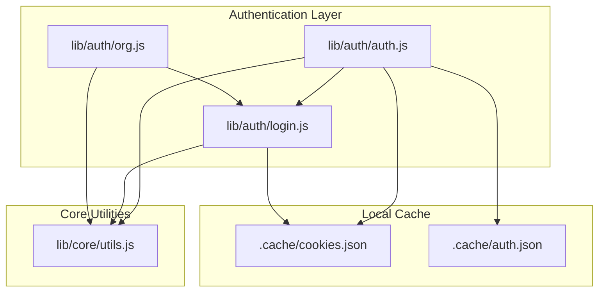
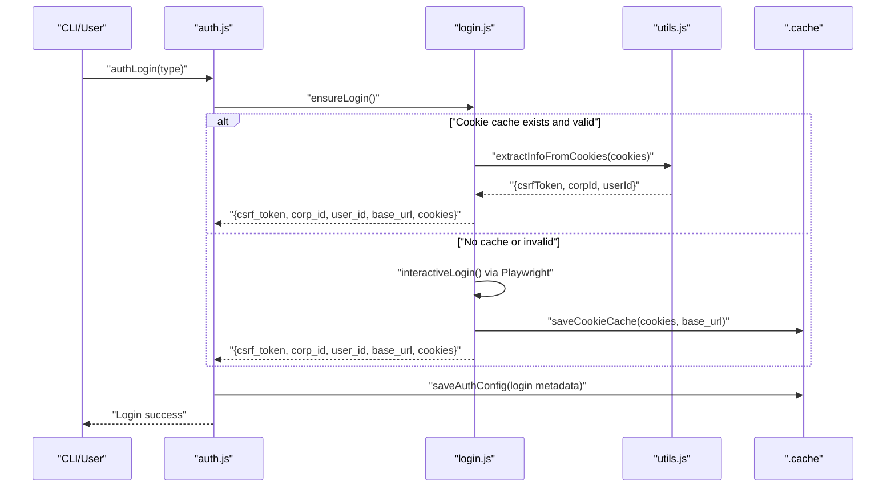
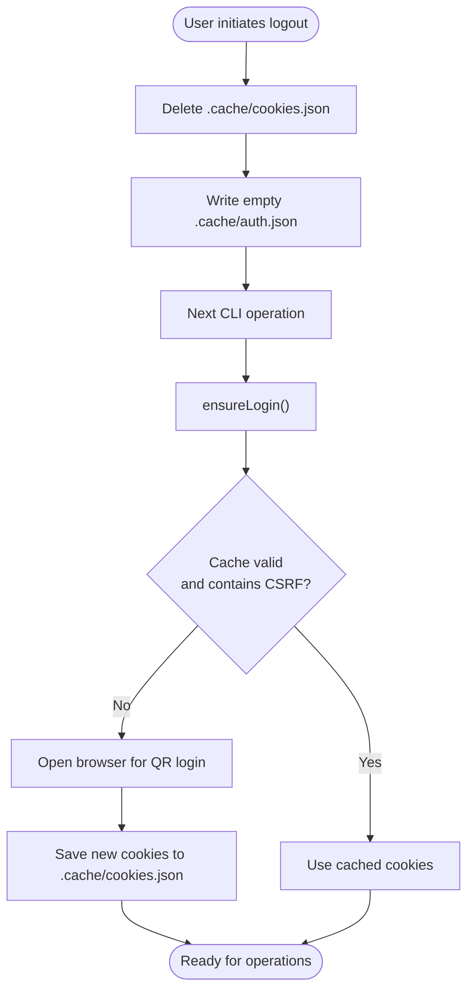
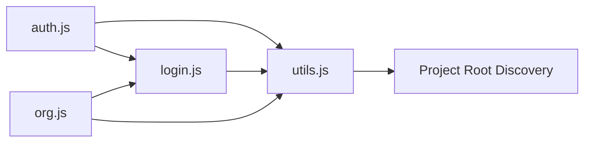

# Security & Logout Procedures

<cite>
**Referenced Files in This Document**
- [SECURITY.md](file://SECURITY.md)
- [package.json](file://package.json)
- [lib/auth/auth.js](file://lib/auth/auth.js)
- [lib/auth/login.js](file://lib/auth/login.js)
- [lib/auth/org.js](file://lib/auth/org.js)
- [lib/core/utils.js](file://lib/core/utils.js)
- [tests/auth.test.js](file://tests/auth.test.js)
- [yida-skills/skills/yida-login/SKILL.md](file://yida-skills/skills/yida-login/SKILL.md)
</cite>

## Table of Contents
1. [Introduction](#introduction)
2. [Project Structure](#project-structure)
3. [Core Components](#core-components)
4. [Architecture Overview](#architecture-overview)
5. [Detailed Component Analysis](#detailed-component-analysis)
6. [Dependency Analysis](#dependency-analysis)
7. [Performance Considerations](#performance-considerations)
8. [Troubleshooting Guide](#troubleshooting-guide)
9. [Conclusion](#conclusion)
10. [Appendices](#appendices)

## Introduction
This document provides comprehensive security documentation for OpenYida’s authentication system and logout procedures. It explains secure token storage practices, credential protection mechanisms, and session termination processes. It also details the logout workflow including local cache cleanup, token invalidation, and browser session termination. Additional topics include security considerations for authentication data storage, encryption of sensitive information, protection against session hijacking attacks, enterprise security compliance, audit logging, monitoring authentication activities, security troubleshooting, suspicious login detection, unauthorized access prevention, incident response procedures, and integration with enterprise security policies and compliance requirements.

## Project Structure
OpenYida organizes authentication-related logic under the lib/auth module and shared utilities under lib/core. The authentication system relies on local cookie caching (.cache/cookies.json) and optional persistent auth metadata (.cache/auth.json). Utilities encapsulate cookie parsing, CSRF token extraction, base URL resolution, and HTTP request helpers with automatic login and CSRF refresh logic.

**Diagram sources**
- [lib/auth/auth.js:1-239](file://lib/auth/auth.js#L1-L239)
- [lib/auth/login.js:1-349](file://lib/auth/login.js#L1-L349)
- [lib/auth/org.js:1-364](file://lib/auth/org.js#L1-L364)
- [lib/core/utils.js:1-463](file://lib/core/utils.js#L1-L463)

**Section sources**
- [lib/auth/auth.js:1-239](file://lib/auth/auth.js#L1-L239)
- [lib/auth/login.js:1-349](file://lib/auth/login.js#L1-L349)
- [lib/auth/org.js:1-364](file://lib/auth/org.js#L1-L364)
- [lib/core/utils.js:1-463](file://lib/core/utils.js#L1-L463)

## Core Components
- Authentication manager (auth.js): Provides status checks, login initiation, token refresh, and logout orchestration. It reads/writes .cache/auth.json for login metadata and delegates cookie operations to login.js and utilities.
- Login manager (login.js): Implements cookie caching, login state checks, interactive QR login via Playwright, CSRF extraction from cached cookies, and logout by deleting .cache/cookies.json.
- Organization switching (org.js): Performs HTTP-based organization switching without re-authentication, extracting and saving updated cookies and updating auth metadata.
- Core utilities (utils.js): Centralizes project root discovery, cookie parsing, CSRF token detection, base URL resolution, HTTP GET/POST helpers, and automatic login/CSRF refresh logic.

Key security-relevant responsibilities:
- Local credential storage: .cache/cookies.json and .cache/auth.json
- CSRF token handling and validation
- Automatic refresh of CSRF tokens and re-login on expiration
- Base URL resolution for tenant isolation
- HTTP request filtering by cookie domain for CSRF header propagation

**Section sources**
- [lib/auth/auth.js:29-53](file://lib/auth/auth.js#L29-L53)
- [lib/auth/auth.js:61-127](file://lib/auth/auth.js#L61-L127)
- [lib/auth/auth.js:137-160](file://lib/auth/auth.js#L137-L160)
- [lib/auth/auth.js:168-210](file://lib/auth/auth.js#L168-L210)
- [lib/auth/auth.js:217-229](file://lib/auth/auth.js#L217-L229)
- [lib/auth/login.js:45-53](file://lib/auth/login.js#L45-L53)
- [lib/auth/login.js:61-93](file://lib/auth/login.js#L61-L93)
- [lib/auth/login.js:101-126](file://lib/auth/login.js#L101-L126)
- [lib/auth/login.js:134-155](file://lib/auth/login.js#L134-L155)
- [lib/auth/login.js:320-339](file://lib/auth/login.js#L320-L339)
- [lib/auth/org.js:115-180](file://lib/auth/org.js#L115-L180)
- [lib/auth/org.js:190-313](file://lib/auth/org.js#L190-L313)
- [lib/core/utils.js:170-201](file://lib/core/utils.js#L170-L201)
- [lib/core/utils.js:232-251](file://lib/core/utils.js#L232-L251)
- [lib/core/utils.js:276-341](file://lib/core/utils.js#L276-L341)
- [lib/core/utils.js:423-447](file://lib/core/utils.js#L423-L447)

## Architecture Overview
The authentication system follows a layered design:
- UI/CLI entry points trigger ensureLogin or authLogin.
- Login manager caches cookies locally and extracts CSRF token and identifiers.
- Authentication manager persists login metadata and orchestrates refresh/logout.
- Organization switching updates cookies and metadata without requiring re-authentication.
- Core utilities provide CSRF detection, base URL resolution, and HTTP helpers with auto-login/CSRF refresh.

**Diagram sources**
- [lib/auth/auth.js:137-160](file://lib/auth/auth.js#L137-L160)
- [lib/auth/login.js:134-155](file://lib/auth/login.js#L134-L155)
- [lib/auth/login.js:207-313](file://lib/auth/login.js#L207-L313)
- [lib/core/utils.js:142-160](file://lib/core/utils.js#L142-L160)

## Detailed Component Analysis

### Secure Token Storage Practices
- Local cache locations:
  - .cache/cookies.json: Stores cookies and base_url extracted during login or organization switching.
  - .cache/auth.json: Stores login metadata (loginType, loginTime, corpId, userId, refreshTime, recentCorps).
- Credential protection mechanisms:
  - Cookies are stored as JSON; no encryption is applied in the current implementation.
  - The project’s security policy explicitly warns against committing .cache/cookies.json to version control and recommends keeping .cache/ ignored by default.
  - Environment isolation is recommended to prevent cross-environment credential leakage.

Best practices for secure storage:
- Encrypt .cache/cookies.json and .cache/auth.json at rest using platform-native key stores or repository encryption.
- Restrict file permissions to the minimum required (e.g., user-read/write only).
- Avoid storing sensitive data in plaintext logs; sanitize logs containing tokens.
- Consider rotating tokens server-side and invalidating stale local caches periodically.

**Section sources**
- [lib/auth/login.js:45-53](file://lib/auth/login.js#L45-L53)
- [lib/auth/auth.js:46-53](file://lib/auth/auth.js#L46-L53)
- [SECURITY.md:42-45](file://SECURITY.md#L42-L45)

### Credential Protection Mechanisms
- CSRF token extraction and validation:
  - The system extracts tianshu_csrf_token from cookies and validates its presence before considering the session valid.
  - HTTP requests automatically include the CSRF token via the global_csrf_token header when sending requests to the resolved base_url.
- Automatic refresh and re-login:
  - On detecting CSRF token expiration (errorCode TIANSHU_000030), the system refreshes the CSRF token from cache without prompting the user.
  - On login expiration (errorCode 307/302), the system triggers a re-login flow.
- Base URL resolution:
  - Base URL is derived from cookies and validated to ensure tenant isolation and correct CSRF header propagation.

Recommendations:
- Enforce SameSite cookies and secure flags on the server side to mitigate CSRF and session theft.
- Use short-lived tokens and frequent rotation to reduce risk windows.
- Implement client-side token binding and revocation on logout.

**Section sources**
- [lib/core/utils.js:142-160](file://lib/core/utils.js#L142-L160)
- [lib/core/utils.js:232-251](file://lib/core/utils.js#L232-L251)
- [lib/core/utils.js:292-293](file://lib/core/utils.js#L292-L293)
- [lib/core/utils.js:423-447](file://lib/core/utils.js#L423-L447)
- [yida-skills/skills/yida-login/SKILL.md:168-180](file://yida-skills/skills/yida-login/SKILL.md#L168-L180)

### Session Termination and Logout Workflow
- Logout steps:
  - Delete .cache/cookies.json to terminate the local session.
  - Clear .cache/auth.json to remove login metadata.
  - On next operation, ensureLogin will prompt interactive login if no valid cache exists.
- Browser session termination:
  - The logout action removes the local cookie cache; however, the browser session on the provider site persists until the user closes the browser or the provider terminates the session server-side.

**Diagram sources**
- [lib/auth/auth.js:217-229](file://lib/auth/auth.js#L217-L229)
- [lib/auth/login.js:320-339](file://lib/auth/login.js#L320-L339)
- [lib/auth/login.js:134-155](file://lib/auth/login.js#L134-L155)

**Section sources**
- [lib/auth/auth.js:217-229](file://lib/auth/auth.js#L217-L229)
- [lib/auth/login.js:320-339](file://lib/auth/login.js#L320-L339)
- [tests/auth.test.js:290-316](file://tests/auth.test.js#L290-L316)
- [yida-skills/skills/yida-login/SKILL.md:181-195](file://yida-skills/skills/yida-login/SKILL.md#L181-L195)

### Organization Switching and Session Integrity
- Organization switching performs a series of HTTP requests to obtain updated cookies and validates the presence of the CSRF token before saving the new session state.
- Recent organizations are tracked in .cache/auth.json to facilitate quick switching.

Security considerations:
- Validate that redirects lead to trusted domains and avoid open redirect risks.
- Ensure CSRF token presence after each redirect and fail closed if missing.
- Limit the number of recent organizations to reduce attack surface.

**Section sources**
- [lib/auth/org.js:190-313](file://lib/auth/org.js#L190-L313)
- [lib/auth/org.js:115-180](file://lib/auth/org.js#L115-L180)

### Authentication Data Storage and Encryption
- Current implementation stores cookies and auth metadata as JSON files without encryption.
- To meet enterprise-grade security, encrypt sensitive files at rest and manage keys securely.

Encryption recommendations:
- Use platform keychain APIs (Windows DPAPI, macOS Keychain, Linux Secret-tool) or HSM-backed KMS.
- Rotate encryption keys periodically and maintain key versioning.
- Avoid embedding encryption keys in code or configuration files.

**Section sources**
- [lib/auth/login.js:45-53](file://lib/auth/login.js#L45-L53)
- [lib/auth/auth.js:46-53](file://lib/auth/auth.js#L46-L53)
- [SECURITY.md:42-45](file://SECURITY.md#L42-L45)

### Protection Against Session Hijacking Attacks
- CSRF protections:
  - Extract and propagate tianshu_csrf_token via global_csrf_token header.
  - Detect CSRF expiration and refresh without user interaction.
- Tenant isolation:
  - Resolve base_url from cookies to ensure requests target the correct domain.
- Request filtering:
  - Filter cookies by domain before sending HTTP requests to avoid leaking cookies across domains.

Additional mitigations:
- Implement short-lived sessions and frequent re-authentication for privileged operations.
- Add IP binding or device fingerprinting where feasible.
- Monitor for unusual geographic or temporal access patterns.

**Section sources**
- [lib/core/utils.js:292-293](file://lib/core/utils.js#L292-L293)
- [lib/core/utils.js:359-361](file://lib/core/utils.js#L359-L361)
- [lib/core/utils.js:423-447](file://lib/core/utils.js#L423-L447)

### Enterprise Security Compliance and Audit Logging
- Compliance alignment:
  - Follow least privilege, separation of duties, and segregation of environments.
  - Maintain audit trails for login, logout, and organization switches.
- Audit logging recommendations:
  - Log authentication events (timestamp, user_id, corp_id, action, outcome, base_url).
  - Store logs securely and retain them per policy.
  - Alert on failed attempts, multiple concurrent sessions, or rapid organization switches.
- Monitoring:
  - Track CSRF refresh and re-login events to detect anomalies.
  - Integrate with SIEM for correlation and alerting.

**Section sources**
- [SECURITY.md:38-46](file://SECURITY.md#L38-L46)
- [lib/auth/org.js:265-290](file://lib/auth/org.js#L265-L290)
- [lib/auth/auth.js:146-152](file://lib/auth/auth.js#L146-L152)

### Security Troubleshooting and Incident Response
- Suspicious login detection:
  - Monitor for repeated login failures, rapid successive logins, or logins from unexpected regions/timezones.
  - Investigate when CSRF refresh or re-login occurs frequently.
- Unauthorized access prevention:
  - Immediately revoke compromised sessions by deleting .cache/cookies.json and .cache/auth.json.
  - Enforce MFA and device trust policies at the provider level.
- Incident response:
  - Isolate affected workstations and revoke tokens server-side if possible.
  - Review logs for attack vectors (CSRF bypass attempts, replay, or credential scraping).
  - Update security policies and re-educate users.

**Section sources**
- [lib/core/utils.js:232-251](file://lib/core/utils.js#L232-L251)
- [lib/auth/auth.js:168-210](file://lib/auth/auth.js#L168-L210)
- [SECURITY.md:47-62](file://SECURITY.md#L47-L62)

## Dependency Analysis
Authentication components depend on core utilities for cookie parsing, CSRF detection, and HTTP helpers. The login manager depends on Playwright for interactive login and on the project root discovery mechanism to locate the .cache directory.

**Diagram sources**
- [lib/auth/auth.js:21-23](file://lib/auth/auth.js#L21-L23)
- [lib/auth/login.js:19](file://lib/auth/login.js#L19)
- [lib/auth/org.js:27-28](file://lib/auth/org.js#L27-L28)
- [lib/core/utils.js:121-133](file://lib/core/utils.js#L121-L133)

**Section sources**
- [lib/auth/auth.js:21-23](file://lib/auth/auth.js#L21-L23)
- [lib/auth/login.js:19](file://lib/auth/login.js#L19)
- [lib/auth/org.js:27-28](file://lib/auth/org.js#L27-L28)
- [lib/core/utils.js:121-133](file://lib/core/utils.js#L121-L133)

## Performance Considerations
- Local cache usage reduces network overhead and improves responsiveness for subsequent operations.
- Interactive login via Playwright introduces latency; prefer cached sessions when possible.
- HTTP helpers include timeouts and JSON parsing safeguards to prevent hangs and improve reliability.

[No sources needed since this section provides general guidance]

## Troubleshooting Guide
Common issues and resolutions:
- No cookie cache or invalid CSRF token:
  - Trigger interactive login to regenerate .cache/cookies.json.
- CSRF token expired:
  - The system automatically refreshes the token from cache; if not possible, re-login is required.
- Login expired:
  - The system triggers re-login; ensure network connectivity and browser availability.
- Logout does not terminate browser session:
  - The logout action clears local cache; the provider’s browser session remains active until closed.

Validation via tests:
- Cookie cache deletion on logout is verified in unit tests.
- Status checks differentiate between not logged in, invalid, and ok states based on CSRF presence.

**Section sources**
- [tests/auth.test.js:290-316](file://tests/auth.test.js#L290-L316)
- [lib/auth/auth.js:61-127](file://lib/auth/auth.js#L61-L127)
- [lib/core/utils.js:232-251](file://lib/core/utils.js#L232-L251)

## Conclusion
OpenYida’s authentication system centers on secure local cookie caching, robust CSRF handling, and automatic refresh/re-login mechanisms. The logout procedure terminates local sessions by clearing cached cookies and metadata. For enterprise-grade deployments, strengthen security by encrypting local caches, enforcing strict environment isolation, and integrating comprehensive audit logging and monitoring. Align operational procedures with the project’s security policy and incident response guidelines.

[No sources needed since this section summarizes without analyzing specific files]

## Appendices

### Appendix A: Logout Command Reference
- Command: openyida logout
- Behavior: Deletes .cache/cookies.json and clears .cache/auth.json
- Effect: Forces re-login on next operation

**Section sources**
- [yida-skills/skills/yida-login/SKILL.md:181-195](file://yida-skills/skills/yida-login/SKILL.md#L181-L195)
- [lib/auth/auth.js:217-229](file://lib/auth/auth.js#L217-L229)
- [lib/auth/login.js:320-339](file://lib/auth/login.js#L320-L339)

### Appendix B: Security Policy Highlights
- Supported versions, reporting channels, response timeline, and disclosure policy
- Best practices: protect .cache/cookies.json, keep .cache ignored, run npm audit, isolate environments

**Section sources**
- [SECURITY.md:1-62](file://SECURITY.md#L1-L62)

### Appendix C: Node.js Engine Requirement
- Minimum Node.js version requirement for compatibility and security updates

**Section sources**
- [package.json:70-73](file://package.json#L70-L73)