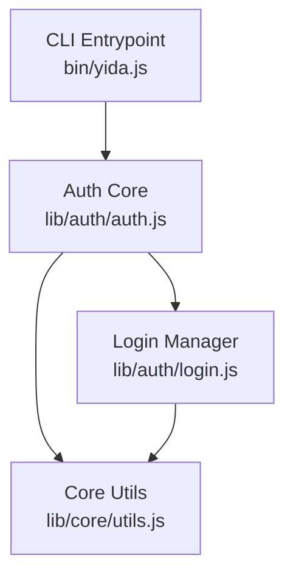
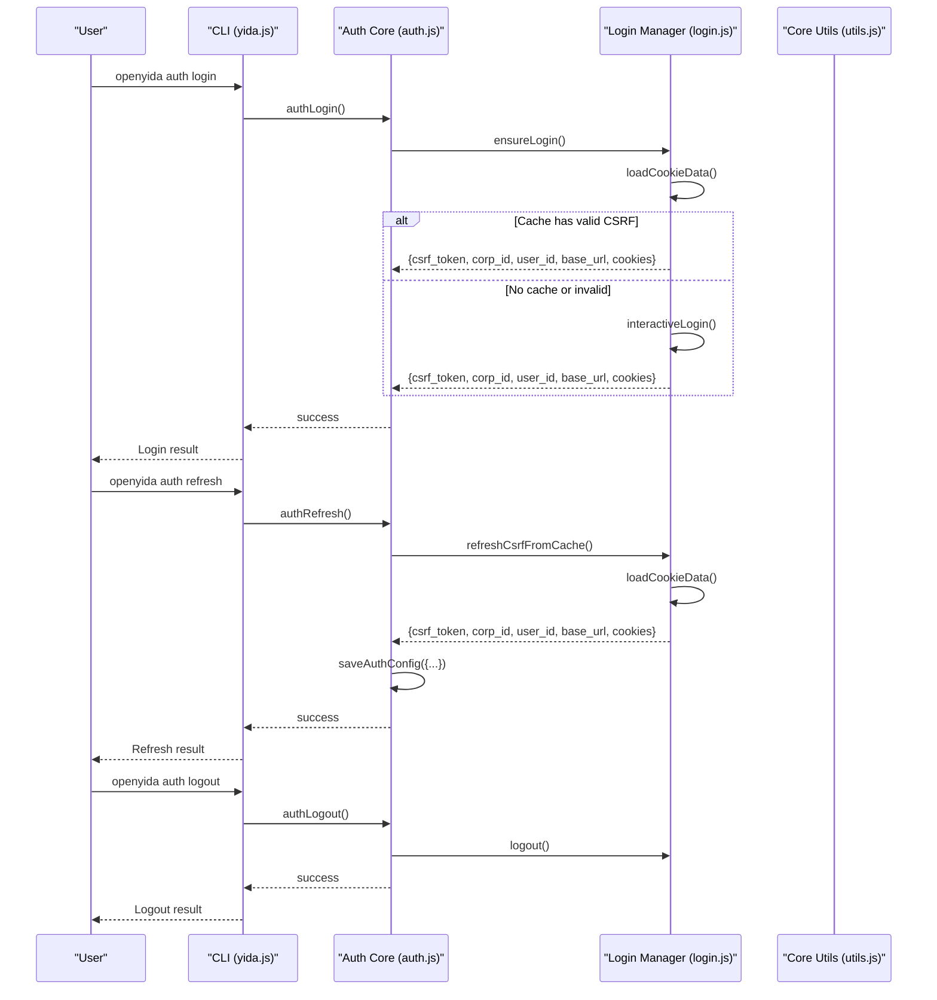
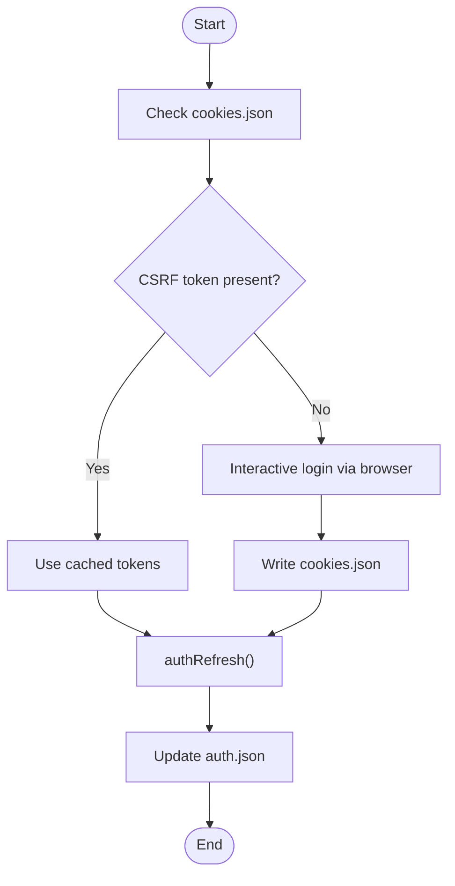
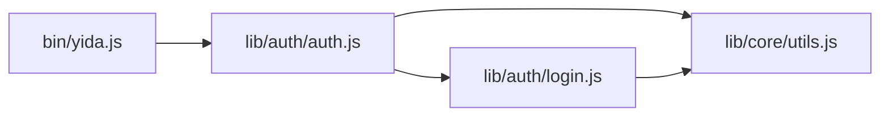

# Session Management & Token Handling

<cite>
**Referenced Files in This Document**
- [auth.js](file://lib/auth/auth.js)
- [login.js](file://lib/auth/login.js)
- [utils.js](file://lib/core/utils.js)
- [yida.js](file://bin/yida.js)
- [auth.test.js](file://tests/auth.test.js)
- [utils.test.js](file://tests/utils.test.js)
</cite>

## Table of Contents
1. [Introduction](#introduction)
2. [Project Structure](#project-structure)
3. [Core Components](#core-components)
4. [Architecture Overview](#architecture-overview)
5. [Detailed Component Analysis](#detailed-component-analysis)
6. [Dependency Analysis](#dependency-analysis)
7. [Performance Considerations](#performance-considerations)
8. [Troubleshooting Guide](#troubleshooting-guide)
9. [Conclusion](#conclusion)
10. [Appendices](#appendices)

## Introduction
This document explains OpenYida’s session management and token handling mechanisms. It covers how login state is persisted locally, how tokens are extracted and validated, how automatic session refresh works, and how CSRF tokens and cookies are managed. It also documents the session lifecycle from initial login through automatic refresh to logout cleanup, along with security considerations, cache invalidation strategies, and cross-platform behavior.

## Project Structure
The session management spans three primary modules:
- CLI entrypoint routes commands to authentication actions
- Authentication core manages status, login, refresh, and logout
- Core utilities provide cookie parsing, base URL resolution, and HTTP helpers

**Diagram sources**
- [yida.js:187-205](file://bin/yida.js#L187-L205)
- [auth.js:1-238](file://lib/auth/auth.js#L1-L238)
- [login.js:1-349](file://lib/auth/login.js#L1-L349)
- [utils.js:1-463](file://lib/core/utils.js#L1-L463)

**Section sources**
- [yida.js:187-205](file://bin/yida.js#L187-L205)
- [auth.js:1-238](file://lib/auth/auth.js#L1-L238)
- [login.js:1-349](file://lib/auth/login.js#L1-L349)
- [utils.js:1-463](file://lib/core/utils.js#L1-L463)

## Core Components
- Session persistence: Local cache files under the project’s .cache directory
  - Cookies cache: .cache/cookies.json
  - Auth config cache: .cache/auth.json
- Token extraction and validation: Extract CSRF token, corpId, and userId from cookies
- Automatic refresh: Re-extract CSRF token from cache without requiring manual login
- Base URL resolution: Resolve environment-specific base URLs from cookie data
- CSRF handling: Detect expired CSRF and automatically refresh
- Logout cleanup: Clear both cookies.json and auth.json

Key exported APIs:
- authStatus(): Inspect current login state and environment
- authLogin(): Trigger login (QR code flow)
- authRefresh(): Refresh session using cached cookies
- authLogout(): Clear session caches
- saveAuthConfig()/loadAuthConfig(): Persist additional auth metadata

**Section sources**
- [auth.js:25-53](file://lib/auth/auth.js#L25-L53)
- [auth.js:61-103](file://lib/auth/auth.js#L61-L103)
- [auth.js:189-229](file://lib/auth/auth.js#L189-L229)
- [login.js:45-53](file://lib/auth/login.js#L45-L53)
- [login.js:61-93](file://lib/auth/login.js#L61-L93)
- [login.js:101-126](file://lib/auth/login.js#L101-L126)
- [utils.js:142-160](file://lib/core/utils.js#L142-L160)
- [utils.js:261-264](file://lib/core/utils.js#L261-L264)

## Architecture Overview
The session lifecycle integrates CLI commands, authentication core, and utilities:

**Diagram sources**
- [yida.js:187-205](file://bin/yida.js#L187-L205)
- [auth.js:189-229](file://lib/auth/auth.js#L189-L229)
- [login.js:134-155](file://lib/auth/login.js#L134-L155)
- [login.js:101-126](file://lib/auth/login.js#L101-L126)
- [login.js:320-339](file://lib/auth/login.js#L320-L339)

## Detailed Component Analysis

### Session Persistence and Caches
- Cookies cache: .cache/cookies.json stores cookies and base_url
- Auth config cache: .cache/auth.json stores additional auth metadata (e.g., loginType, loginTime, corpId)
- Both caches are stored under the project root determined by findProjectRoot()

Behavior highlights:
- loadCookieData() reads cookies.json and enriches with csrf_token, corp_id, user_id
- saveCookieCache() writes cookies.json with cookies and base_url
- saveAuthConfig()/loadAuthConfig() persist arbitrary auth metadata

Security considerations:
- Cookies cache contains sensitive tokens; ensure proper file permissions on shared systems
- Auth config cache is JSON; keep it minimal and avoid storing secrets beyond tokens

**Section sources**
- [login.js:45-53](file://lib/auth/login.js#L45-L53)
- [login.js:134-155](file://lib/auth/login.js#L134-L155)
- [login.js:101-126](file://lib/auth/login.js#L101-L126)
- [auth.js:29-53](file://lib/auth/auth.js#L29-L53)
- [utils.js:170-201](file://lib/core/utils.js#L170-L201)

### Token Extraction and Validation
- extractInfoFromCookies(): Parses tianshu_csrf_token and tianshu_corp_user to derive csrfToken, corpId, and userId
- authStatus(): Validates presence of CSRF token and prints environment info
- isCsrfTokenExpired(): Detects CSRF token expiration via errorCode
- isLoginExpired(): Detects login expiration via errorCode

Validation flow:
- If no CSRF token present, status is invalid and requires re-login
- CSRF token expiry triggers automatic refresh via refreshCsrfFromCache()

**Section sources**
- [utils.js:142-160](file://lib/core/utils.js#L142-L160)
- [auth.js:61-103](file://lib/auth/auth.js#L61-L103)
- [utils.js:245-251](file://lib/core/utils.js#L245-L251)
- [utils.js:232-238](file://lib/core/utils.js#L232-L238)

### Automatic Session Refresh
- authRefresh(): Attempts to refresh session using cached cookies
- refreshCsrfFromCache(): Reads cookies.json and re-extracts tokens without prompting user
- requestWithAutoLogin(): Wraps HTTP requests to auto-relogin or refresh CSRF when needed

Refresh behavior:
- On CSRF expiration, refreshCsrfFromCache() is invoked and auth config is updated
- On login expiration, ensureLogin() is invoked to re-authenticate

**Section sources**
- [auth.js:189-229](file://lib/auth/auth.js#L189-L229)
- [login.js:101-126](file://lib/auth/login.js#L101-L126)
- [utils.js:423-447](file://lib/core/utils.js#L423-L447)

### CSRF Token Management
- CSRF token is extracted from tianshu_csrf_token cookie
- global_csrf_token header is set for HTTP requests using the CSRF value
- Expired CSRF detection triggers automatic refresh flow

**Section sources**
- [utils.js:292-293](file://lib/core/utils.js#L292-L293)
- [utils.js:369-370](file://lib/core/utils.js#L369-L370)
- [utils.js:423-447](file://lib/core/utils.js#L423-L447)

### Cookie Data Handling
- loadCookieData(): Loads cookies.json, normalizes legacy arrays, and enriches with derived fields
- saveCookieCache(): Writes cookies.json with cookies and base_url
- logout(): Removes cookies.json to clear session

Base URL resolution:
- resolveBaseUrl(): Strips trailing slashes from base_url
- Base URL is derived from cookie domain or current page origin during interactive login

**Section sources**
- [utils.js:170-201](file://lib/core/utils.js#L170-L201)
- [login.js:45-53](file://lib/auth/login.js#L45-L53)
- [login.js:320-339](file://lib/auth/login.js#L320-L339)
- [utils.js:261-264](file://lib/core/utils.js#L261-L264)

### Base URL Resolution Across Environments
- resolveBaseUrl(): Uses cookieData.base_url with fallback to default
- During interactive login, base_url is inferred from cookie domain or current page origin
- Supports dedicated domains (e.g., your-company.aliwork.com)

**Section sources**
- [utils.js:261-264](file://lib/core/utils.js#L261-L264)
- [login.js:257-272](file://lib/auth/login.js#L257-L272)

### Session Lifecycle
- Initial login:
  - ensureLogin() checks cookies.json; if valid, returns cached tokens
  - Otherwise, interactiveLogin() opens browser, waits for tianshu_csrf_token, saves cookies.json, and returns tokens
- Automatic refresh:
  - authRefresh() re-extracts tokens from cookies.json and updates auth.json
  - requestWithAutoLogin() transparently handles CSRF and login expiration
- Logout:
  - authLogout() clears auth.json and invokes logout() to remove cookies.json

**Diagram sources**
- [login.js:134-155](file://lib/auth/login.js#L134-L155)
- [login.js:207-313](file://lib/auth/login.js#L207-L313)
- [auth.js:189-229](file://lib/auth/auth.js#L189-L229)

**Section sources**
- [login.js:134-155](file://lib/auth/login.js#L134-L155)
- [login.js:207-313](file://lib/auth/login.js#L207-L313)
- [auth.js:189-229](file://lib/auth/auth.js#L189-L229)

### Token Storage Security Considerations
- Cookies cache contains sensitive tokens; restrict file permissions on shared machines
- Avoid logging or printing full tokens; the code truncates displayed tokens
- Keep auth.json minimal; avoid storing secrets beyond tokens
- On logout, both cookies.json and auth.json are cleared

**Section sources**
- [auth.js:217-229](file://lib/auth/auth.js#L217-L229)
- [login.js:320-339](file://lib/auth/login.js#L320-L339)

### Cache Invalidation Strategies
- Explicit logout removes cookies.json and clears auth.json
- Invalid or empty cookies.json leads to re-login
- Invalid or empty auth.json is treated as missing metadata and does not block operations

**Section sources**
- [auth.js:217-229](file://lib/auth/auth.js#L217-L229)
- [auth.js:29-44](file://lib/auth/auth.js#L29-L44)
- [utils.js:170-201](file://lib/core/utils.js#L170-L201)

### Session State Validation
- authStatus(): Returns status (not_logged_in, invalid, ok) and whether auto-use is possible
- Tests verify behavior for missing cache, missing CSRF, and valid cookies

**Section sources**
- [auth.js:61-103](file://lib/auth/auth.js#L61-L103)
- [auth.test.js:113-152](file://tests/auth.test.js#L113-L152)

### Examples and Workflows

- Session status checking:
  - Use CLI: openyida auth status
  - Internally: authStatus() loads cookies.json, extracts tokens, resolves base_url, and prints status

- Token renewal process:
  - Use CLI: openyida auth refresh
  - Internally: authRefresh() calls refreshCsrfFromCache(), updates auth.json

- Handling expired or invalid sessions:
  - If CSRF token expires, requestWithAutoLogin() triggers refreshCsrfFromCache()
  - If login expires, requestWithAutoLogin() triggers ensureLogin()
  - Tests demonstrate error messages and expected outcomes

- Session persistence across OS and environments:
  - Project root is resolved via findProjectRoot(), supporting multiple AI tool environments
  - Cookies cache is stored under .cache in the project root

**Section sources**
- [yida.js:187-205](file://bin/yida.js#L187-L205)
- [auth.js:61-103](file://lib/auth/auth.js#L61-L103)
- [auth.js:189-229](file://lib/auth/auth.js#L189-L229)
- [utils.js:423-447](file://lib/core/utils.js#L423-L447)
- [auth.test.js:169-208](file://tests/auth.test.js#L169-L208)

## Dependency Analysis

**Diagram sources**
- [yida.js:187-205](file://bin/yida.js#L187-L205)
- [auth.js:1-238](file://lib/auth/auth.js#L1-L238)
- [login.js:1-349](file://lib/auth/login.js#L1-L349)
- [utils.js:1-463](file://lib/core/utils.js#L1-L463)

**Section sources**
- [yida.js:187-205](file://bin/yida.js#L187-L205)
- [auth.js:1-238](file://lib/auth/auth.js#L1-L238)
- [login.js:1-349](file://lib/auth/login.js#L1-L349)
- [utils.js:1-463](file://lib/core/utils.js#L1-L463)

## Performance Considerations
- Local cache reads are fast; avoid frequent disk writes by batching auth.json updates
- Interactive login opens a browser and waits for user action; keep timeouts reasonable
- HTTP requests leverage filtered cookies and global_csrf_token header; ensure network stability

## Troubleshooting Guide
Common scenarios and resolutions:
- No cookie cache:
  - Symptom: authRefresh() returns error indicating no cookie cache
  - Action: Run openyida auth login to establish session
- Missing CSRF token:
  - Symptom: authStatus() reports invalid; authRefresh() fails
  - Action: Re-login to regenerate CSRF token
- CSRF token expired:
  - Symptom: Requests return CSRF expired; automatic refresh occurs
  - Action: Allow refresh to complete; if persistent, re-login
- Login expired:
  - Symptom: Requests indicate login expired; automatic re-login occurs
  - Action: Allow re-login to complete; if persistent, re-login manually
- Logout cleanup:
  - Symptom: Session persists after logout
  - Action: Confirm cookies.json and auth.json are removed

**Section sources**
- [auth.test.js:169-208](file://tests/auth.test.js#L169-L208)
- [utils.test.js:127-143](file://tests/utils.test.js#L127-L143)
- [auth.js:61-103](file://lib/auth/auth.js#L61-L103)
- [auth.js:189-229](file://lib/auth/auth.js#L189-L229)

## Conclusion
OpenYida’s session management centers on local cache files for cookies and auth metadata, robust token extraction and validation, and automatic refresh flows for CSRF and login expiration. The system integrates cleanly with CLI commands and provides clear failure modes and recovery paths. Following the security and cache invalidation recommendations ensures reliable operation across diverse environments and platforms.

## Appendices

### API Reference Summary
- authStatus(): Inspect login state and environment
- authLogin(): Trigger login (QR code)
- authRefresh(): Refresh session from cache
- authLogout(): Clear session caches
- saveAuthConfig()/loadAuthConfig(): Persist auth metadata
- ensureLogin()/refreshCsrfFromCache(): Internal helpers for login and refresh
- loadCookieData()/resolveBaseUrl(): Cookie and base URL utilities
- isLoginExpired()/isCsrfTokenExpired(): Expiration detection helpers

**Section sources**
- [auth.js:61-229](file://lib/auth/auth.js#L61-L229)
- [login.js:61-126](file://lib/auth/login.js#L61-L126)
- [utils.js:170-264](file://lib/core/utils.js#L170-L264)
- [utils.js:232-251](file://lib/core/utils.js#L232-L251)