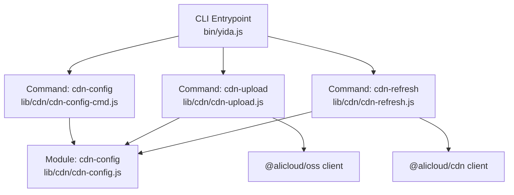
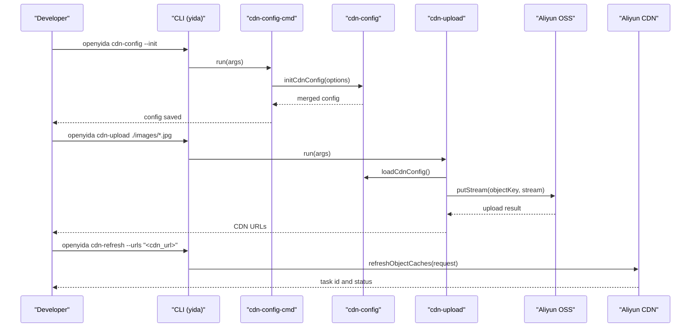
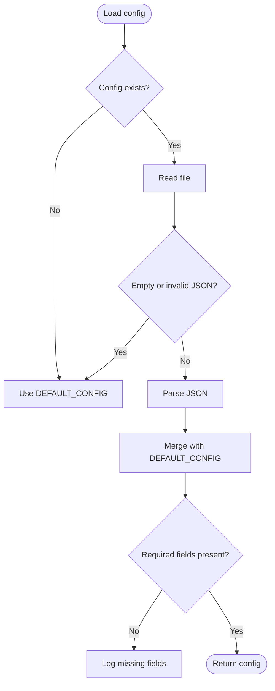
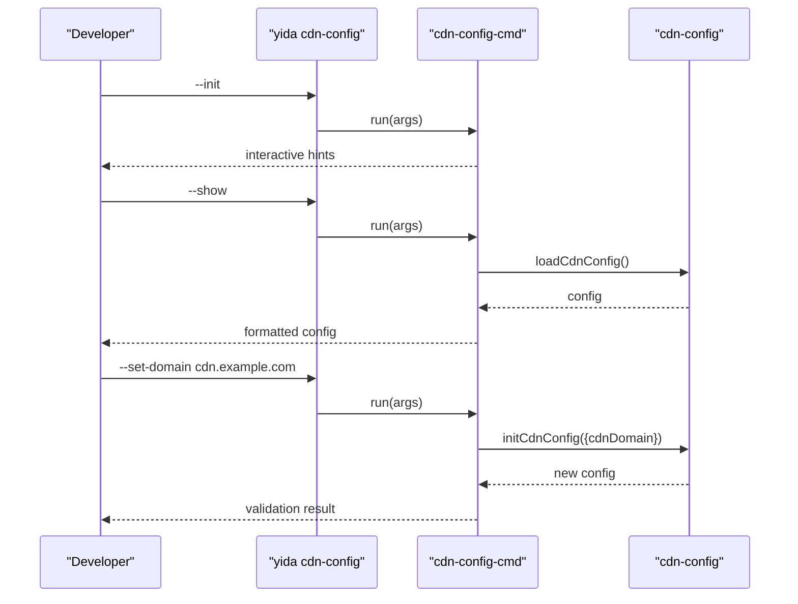
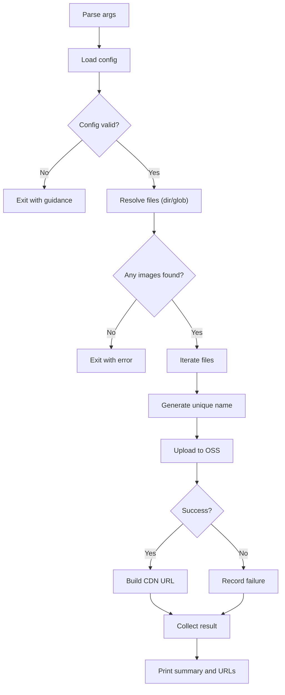
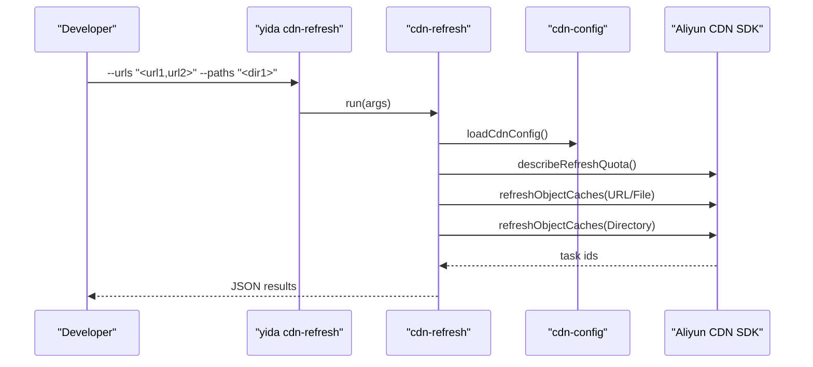
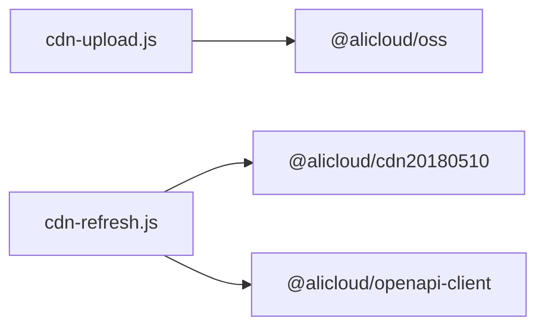

# CDN Integration & Image Management

<cite>
**Referenced Files in This Document**
- [README.md](file://README.md)
- [package.json](file://package.json)
- [bin/yida.js](file://bin/yida.js)
- [lib/cdn/cdn-config.js](file://lib/cdn/cdn-config.js)
- [lib/cdn/cdn-config-cmd.js](file://lib/cdn/cdn-config-cmd.js)
- [lib/cdn/cdn-upload.js](file://lib/cdn/cdn-upload.js)
- [lib/cdn/cdn-refresh.js](file://lib/cdn/cdn-refresh.js)
- [tests/cdn-config.test.js](file://tests/cdn-config.test.js)
</cite>

## Table of Contents
1. [Introduction](#introduction)
2. [Project Structure](#project-structure)
3. [Core Components](#core-components)
4. [Architecture Overview](#architecture-overview)
5. [Detailed Component Analysis](#detailed-component-analysis)
6. [Dependency Analysis](#dependency-analysis)
7. [Performance Considerations](#performance-considerations)
8. [Troubleshooting Guide](#troubleshooting-guide)
9. [Conclusion](#conclusion)
10. [Appendices](#appendices)

## Introduction
This document explains how OpenYida integrates with a CDN and Aliyun OSS for image management and content delivery. It covers configuration workflows, upload and caching strategies, supported image formats, optimization settings, cache refresh procedures, and operational best practices. It also outlines how these CDN features relate to application deployment and provides practical scenarios for product catalogs, user uploads, and marketing assets.

## Project Structure
OpenYida exposes three primary CDN-related CLI commands:
- cdn-config: Configure Aliyun credentials, CDN domain, and OSS settings
- cdn-upload: Upload images to OSS and receive CDN-accessible URLs
- cdn-refresh: Invalidate or refresh CDN cache for URLs or directories

These commands are wired into the CLI entrypoint and implemented under lib/cdn.

**Diagram sources**
- [bin/yida.js:423-439](file://bin/yida.js#L423-L439)
- [lib/cdn/cdn-config-cmd.js:1-251](file://lib/cdn/cdn-config-cmd.js#L1-L251)
- [lib/cdn/cdn-upload.js:1-322](file://lib/cdn/cdn-upload.js#L1-L322)
- [lib/cdn/cdn-refresh.js:1-294](file://lib/cdn/cdn-refresh.js#L1-L294)
- [lib/cdn/cdn-config.js:1-173](file://lib/cdn/cdn-config.js#L1-L173)

**Section sources**
- [README.md:131-135](file://README.md#L131-L135)
- [bin/yida.js:423-439](file://bin/yida.js#L423-L439)

## Core Components
- CDN configuration manager: Loads, validates, and persists configuration to ~/.openyida/cdn-config.json
- CDN configuration command: Provides CLI interface to initialize, show, and update configuration
- CDN upload command: Validates images, uploads to OSS, and returns CDN URLs
- CDN refresh command: Uses Aliyun CDN SDK to refresh cache for URLs or directories

Key responsibilities:
- Secure credential storage in user home directory
- Validation of required configuration fields
- Deterministic OSS object keys and CDN URL generation
- SDK availability checks and graceful error reporting

**Section sources**
- [lib/cdn/cdn-config.js:1-173](file://lib/cdn/cdn-config.js#L1-L173)
- [lib/cdn/cdn-config-cmd.js:1-251](file://lib/cdn/cdn-config-cmd.js#L1-L251)
- [lib/cdn/cdn-upload.js:1-322](file://lib/cdn/cdn-upload.js#L1-L322)
- [lib/cdn/cdn-refresh.js:1-294](file://lib/cdn/cdn-refresh.js#L1-L294)

## Architecture Overview
The CDN subsystem orchestrates three stages:
1. Configuration: Store and validate Aliyun credentials, CDN domain, and OSS settings
2. Upload: Transform local images into OSS objects and compute CDN URLs
3. Cache Management: Invalidate or refresh CDN cache for URLs or directories

**Diagram sources**
- [lib/cdn/cdn-config-cmd.js:188-248](file://lib/cdn/cdn-config-cmd.js#L188-L248)
- [lib/cdn/cdn-config.js:98-126](file://lib/cdn/cdn-config.js#L98-L126)
- [lib/cdn/cdn-upload.js:268-319](file://lib/cdn/cdn-upload.js#L268-L319)
- [lib/cdn/cdn-refresh.js:242-284](file://lib/cdn/cdn-refresh.js#L242-L284)

## Detailed Component Analysis

### CDN Configuration Management
Responsibilities:
- Persist configuration to ~/.openyida/cdn-config.json
- Merge defaults with user-provided values
- Validate required fields (AccessKey ID, AccessKey Secret, CDN domain, OSS bucket)
- Provide helpers to check existence and retrieve path

**Diagram sources**
- [lib/cdn/cdn-config.js:60-76](file://lib/cdn/cdn-config.js#L60-L76)
- [lib/cdn/cdn-config.js:133-141](file://lib/cdn/cdn-config.js#L133-L141)

**Section sources**
- [lib/cdn/cdn-config.js:27-45](file://lib/cdn/cdn-config.js#L27-L45)
- [lib/cdn/cdn-config.js:60-87](file://lib/cdn/cdn-config.js#L60-L87)
- [lib/cdn/cdn-config.js:133-154](file://lib/cdn/cdn-config.js#L133-L154)
- [tests/cdn-config.test.js:53-117](file://tests/cdn-config.test.js#L53-L117)

### CDN Configuration Command
Capabilities:
- Interactive initialization guide
- Show current configuration with masked secrets
- Set individual fields (AccessKey, domain, bucket, region, upload path)
- Print usage and examples

**Diagram sources**
- [lib/cdn/cdn-config-cmd.js:188-248](file://lib/cdn/cdn-config-cmd.js#L188-L248)
- [lib/cdn/cdn-config.js:98-126](file://lib/cdn/cdn-config.js#L98-L126)

**Section sources**
- [lib/cdn/cdn-config-cmd.js:109-157](file://lib/cdn/cdn-config-cmd.js#L109-L157)
- [lib/cdn/cdn-config-cmd.js:162-186](file://lib/cdn/cdn-config-cmd.js#L162-L186)
- [lib/cdn/cdn-config.js:164-172](file://lib/cdn/cdn-config.js#L164-L172)

### CDN Upload Command
Features:
- Supported formats: jpg, jpeg, png, gif, webp, bmp, svg
- Unique filename generation preserving extension
- Directory and glob pattern support
- Optional override of domain and upload path
- Streaming upload to OSS with error handling
- CDN URL construction and summary output

**Diagram sources**
- [lib/cdn/cdn-upload.js:46-74](file://lib/cdn/cdn-upload.js#L46-L74)
- [lib/cdn/cdn-upload.js:167-262](file://lib/cdn/cdn-upload.js#L167-L262)
- [lib/cdn/cdn-upload.js:227-259](file://lib/cdn/cdn-upload.js#L227-L259)

**Section sources**
- [lib/cdn/cdn-upload.js:38-102](file://lib/cdn/cdn-upload.js#L38-L102)
- [lib/cdn/cdn-upload.js:116-156](file://lib/cdn/cdn-upload.js#L116-L156)
- [lib/cdn/cdn-upload.js:167-262](file://lib/cdn/cdn-upload.js#L167-L262)

### CDN Refresh Command
Capabilities:
- Refresh by URL list
- Refresh by directory path
- Read URLs from a file
- Query refresh quotas
- Track refresh tasks by ID

**Diagram sources**
- [lib/cdn/cdn-refresh.js:242-284](file://lib/cdn/cdn-refresh.js#L242-L284)
- [lib/cdn/cdn-refresh.js:162-236](file://lib/cdn/cdn-refresh.js#L162-L236)

**Section sources**
- [lib/cdn/cdn-refresh.js:28-55](file://lib/cdn/cdn-refresh.js#L28-L55)
- [lib/cdn/cdn-refresh.js:162-236](file://lib/cdn/cdn-refresh.js#L162-L236)

## Dependency Analysis
External SDKs:
- Aliyun OSS SDK for object storage operations
- Aliyun CDN SDK for cache refresh operations

These are dynamically loaded and trigger explicit installation guidance when missing.

**Diagram sources**
- [lib/cdn/cdn-upload.js:141-156](file://lib/cdn/cdn-upload.js#L141-L156)
- [lib/cdn/cdn-refresh.js:79-96](file://lib/cdn/cdn-refresh.js#L79-L96)

**Section sources**
- [lib/cdn/cdn-upload.js:141-156](file://lib/cdn/cdn-upload.js#L141-L156)
- [lib/cdn/cdn-refresh.js:79-96](file://lib/cdn/cdn-refresh.js#L79-L96)

## Performance Considerations
- Upload throughput: Streaming uploads reduce memory overhead; ensure network stability to avoid partial uploads
- Image optimization: The configuration module defines quality and max width defaults; adjust upload path to separate optimized vs. original buckets if needed
- CDN cache TTL: Configure appropriate cache policies at the CDN level to balance freshness and cost
- Batch operations: Use directory globs or file lists to upload multiple images efficiently

[No sources needed since this section provides general guidance]

## Troubleshooting Guide

Common issues and resolutions:
- Missing or invalid configuration
  - Symptom: Upload/refresh exits early with “missing fields” or “no config”
  - Action: Run the configuration command to set AccessKey, domain, bucket, and region
- SDK not installed
  - Symptom: Error indicating SDK packages are required
  - Action: Install ali-oss and @alicloud/cdn20180510 per the printed guidance
- No images found
  - Symptom: Upload fails because no supported files were detected
  - Action: Verify file paths, extensions, and glob patterns
- Upload failures
  - Symptom: Individual file entries show errors
  - Action: Check file permissions, disk space, and OSS bucket ACLs
- Cache refresh errors
  - Symptom: Task creation or status queries fail
  - Action: Confirm credentials, domain, and CDN service availability; check quotas

Operational tips:
- Use refresh quotas to plan bulk invalidations
- Prefer directory-based refresh for batch updates
- Keep configuration files secure and avoid committing them to version control

**Section sources**
- [lib/cdn/cdn-config.js:133-154](file://lib/cdn/cdn-config.js#L133-L154)
- [lib/cdn/cdn-upload.js:217-220](file://lib/cdn/cdn-upload.js#L217-L220)
- [lib/cdn/cdn-upload.js:250-258](file://lib/cdn/cdn-upload.js#L250-L258)
- [lib/cdn/cdn-refresh.js:176-189](file://lib/cdn/cdn-refresh.js#L176-L189)
- [lib/cdn/cdn-refresh.js:214-233](file://lib/cdn/cdn-refresh.js#L214-L233)

## Conclusion
OpenYida’s CDN integration provides a streamlined workflow for configuring Aliyun credentials, uploading images to OSS, and managing CDN cache. By leveraging the CLI commands and the underlying modules, teams can automate image management for applications, ensuring fast global delivery and efficient cache control.

[No sources needed since this section summarizes without analyzing specific files]

## Appendices

### Practical Scenarios

- Product catalog images
  - Upload processed images to a dedicated upload path (e.g., products/)
  - Use CDN URLs in product listings; invalidate after bulk updates
- User-generated images
  - Accept uploads via application forms, then upload to OSS via CLI or automation
  - Serve via CDN domain; apply cache refresh for immediate visibility
- Marketing assets
  - Store banners and promotional materials in a separate path
  - Refresh CDN after campaign changes to ensure global consistency

[No sources needed since this section provides general guidance]

### Security Considerations
- Store configuration securely in ~/.openyida/cdn-config.json
- Mask sensitive values in CLI output
- Limit OSS bucket permissions to least privilege
- Use signed URLs or referer restrictions at the CDN/OSS level when applicable

[No sources needed since this section provides general guidance]

### Integration Patterns and Backup Strategies
- External storage integration
  - Use OSS as the origin; CDN distributes globally
  - Maintain a staging bucket for pre-production uploads
- Backup strategies
  - Retain versioned backups in OSS
  - Track uploaded object keys to facilitate recovery and audits

[No sources needed since this section provides general guidance]