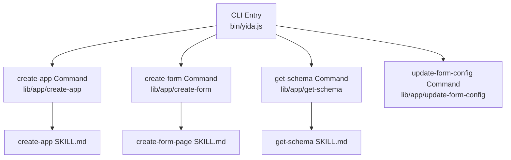
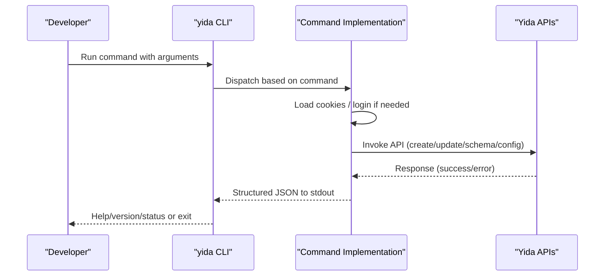
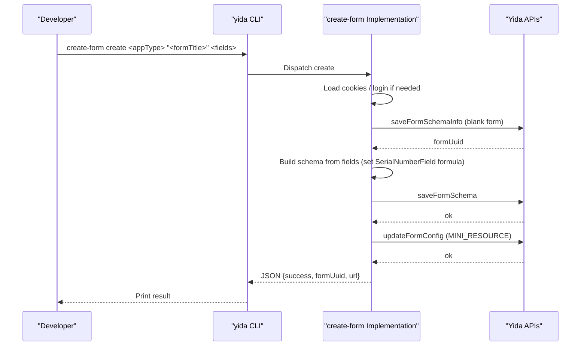
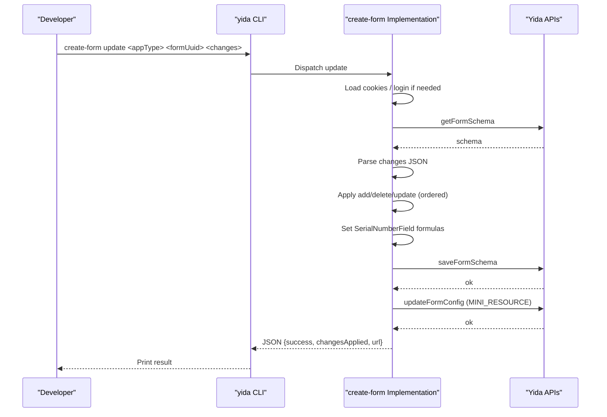
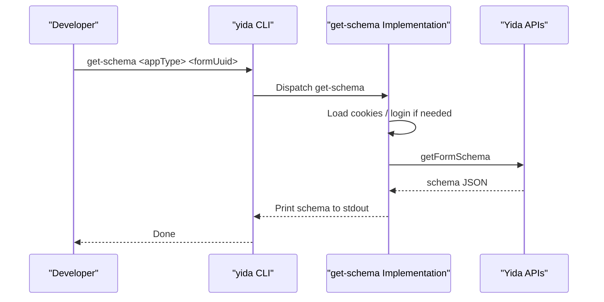
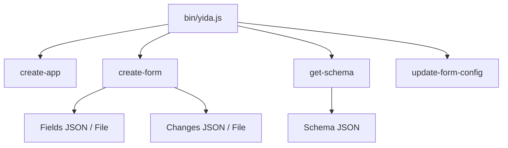

# Application & Form Management Commands

<cite>
**Referenced Files in This Document**
- [yida.js](file://bin/yida.js)
- [create-app SKILL.md](file://yida-skills/skills/yida-create-app/SKILL.md)
- [create-form-page SKILL.md](file://yida-skills/skills/yida-create-form-page/SKILL.md)
- [get-schema SKILL.md](file://yida-skills/skills/yida-get-schema/SKILL.md)
- [association-form-field.md](file://yida-skills/reference/association-form-field.md)
- [employee-field.md](file://yida-skills/reference/employee-field.md)
</cite>

## Table of Contents
1. [Introduction](#introduction)
2. [Project Structure](#project-structure)
3. [Core Components](#core-components)
4. [Architecture Overview](#architecture-overview)
5. [Detailed Component Analysis](#detailed-component-analysis)
6. [Dependency Analysis](#dependency-analysis)
7. [Performance Considerations](#performance-considerations)
8. [Troubleshooting Guide](#troubleshooting-guide)
9. [Conclusion](#conclusion)
10. [Appendices](#appendices)

## Introduction
This document provides comprehensive documentation for OpenYida’s application and form management command group. It covers:
- create-app: Application creation with name, description, icon, and theme parameters.
- create-form: Subcommands for creating and updating forms, including field JSON specification, layout options, and theme customization.
- get-schema: Retrieving form schemas for inspection and integration.
- update-form-config: Modifying form settings such as navigation rendering and titles.

It also documents form field types, validation rule configuration, layout customization, common development patterns, schema modification workflows, and integration with the broader application lifecycle.

## Project Structure
OpenYida exposes a CLI entry point that routes commands to dedicated modules. The application and form management commands are defined in the CLI entry and dispatched to implementation modules under lib/app and related packages.

**Diagram sources**
- [yida.js:243-266](file://bin/yida.js#L243-L266)
- [create-form-page SKILL.md:36-112](file://yida-skills/skills/yida-create-form-page/SKILL.md#L36-L112)
- [get-schema SKILL.md:43-62](file://yida-skills/skills/yida-get-schema/SKILL.md#L43-L62)
- [create-app SKILL.md:51-80](file://yida-skills/skills/yida-create-app/SKILL.md#L51-L80)

**Section sources**
- [yida.js:19-50](file://bin/yida.js#L19-L50)
- [yida.js:243-266](file://bin/yida.js#L243-L266)

## Core Components
- create-app: Creates a new application with optional description, icon, and color. Outputs appType and admin URL.
- create-form: Two subcommands:
  - create: Builds a new form page from a fields definition (JSON or file), supports layout and theme options.
  - update: Applies changes to an existing form via a changes definition (JSON or file).
- get-schema: Retrieves the full form schema for inspection and automation.
- update-form-config: Updates form configuration such as navigation rendering and titles.

**Section sources**
- [yida.js:19-28](file://bin/yida.js#L19-L28)
- [create-app SKILL.md:51-80](file://yida-skills/skills/yida-create-app/SKILL.md#L51-L80)
- [create-form-page SKILL.md:36-112](file://yida-skills/skills/yida-create-form-page/SKILL.md#L36-L112)
- [get-schema SKILL.md:43-62](file://yida-skills/skills/yida-get-schema/SKILL.md#L43-L62)

## Architecture Overview
The CLI routes commands to implementation modules. Each command orchestrates HTTP requests to Yida APIs, manages authentication cookies, and prints structured JSON to stdout while logging progress to stderr.

**Diagram sources**
- [yida.js:140-521](file://bin/yida.js#L140-L521)

## Detailed Component Analysis

### create-app Command
Purpose: Create a new application with customizable metadata and theme.

Syntax
- openyida create-app "<appName>" [description] [icon] [iconColor]

Parameters
- appName: Required. Application name.
- description: Optional. Defaults to appName if omitted.
- icon: Optional. Icon identifier (e.g., xian-daka). See icon list.
- iconColor: Optional. Icon color hex code.

Outputs
- JSON to stdout containing success flag, appType, appName, and admin URL.

Usage Scenarios
- Rapid prototyping: Create a minimal app with just the name.
- Branding: Provide icon and color for consistent UI.
- Automation: Integrate into CI/CD to bootstrap projects.

Practical Examples
- Minimal: openyida create-app "Project Alpha"
- Full: openyida create-app "Project Alpha" "Agile project tracker" "xian-daka" "#00B853"

Notes
- Uses registerApp endpoint with CSRF token and i18n appName/description.
- Records appType for downstream use.

**Section sources**
- [yida.js](file://bin/yida.js#L19)
- [create-app SKILL.md:51-80](file://yida-skills/skills/yida-create-app/SKILL.md#L51-L80)
- [create-app SKILL.md:102-130](file://yida-skills/skills/yida-create-app/SKILL.md#L102-L130)
- [create-app SKILL.md:139-159](file://yida-skills/skills/yida-create-app/SKILL.md#L139-L159)

### create-form Command
Purpose: Create or update form pages with flexible field definitions, layouts, and themes.

Subcommands
- create: Build a new form page from fields JSON or file.
- update: Apply changes to an existing form via changes JSON or file.

Syntax
- create: openyida create-form create <appType> "<formTitle>" <fieldsJsonOrFile> [--layout <layout>] [--theme <theme>] [--label-align <align>]
- update: openyida create-form update <appType> <formUuid> <changesJsonOrFile>

Parameters
- appType: Required. Application ID (e.g., APP_XXX).
- formTitle: Required for create.
- fieldsJsonOrFile: Required for create. JSON string (starts with [) or file path.
- changesJsonOrFile: Required for update. JSON string or file path.
- layout: Optional. double or card.
- theme: Optional. comfortable or compact.
- label-align: Optional. top, left, or right.

Outputs
- JSON to stdout with success, identifiers, counts, and URLs.

Field JSON Specification
- Fields array with each element describing a field (type, label, required, placeholder, behavior, visibility, labelAlign).
- Options fields (RadioField, SelectField, CheckboxField, MultiSelectField) require dataSource arrays with text (i18n), value, sid, and flags.
- TableField requires children array.
- AssociationFormField requires associationForm configuration including formUuid, appType, mainFieldId, and optional dataFilterRules/dataFillingRules.
- SerialNumberField auto-generates formula using corpId, appType, formUuid, and fieldId.

Validation Rule Configuration
- Text fields support validationType and maxLength defaults.
- Number fields support precision, step, thousandsSeparators, innerAfter (unit).
- Date fields support format and disabledDate rules.
- Options fields support showSearch, autoWidth, filterLocal, mode, and defaultDataSource with formula/url/searchConfig.

Layout and Theme Customization
- Layout: double or card.
- Theme: comfortable or compact.
- Label alignment: top, left, right.

Common Patterns
- Create blank form, then apply schema and update config.
- Update existing forms by fetching schema, applying changes, saving schema, and updating config.
- Use get-schema to inspect current structure before updates.

Practical Examples
- Create simple form: openyida create-form create "APP_XXX" "Registration" fields.json
- Create double-column form: openyida create-form create "APP_XXX" "Registration" fields.json --layout double
- Create card theme with left label alignment: openyida create-form create "APP_XXX" "Registration" fields.json --layout card --theme comfortable --label-align left
- Update form: openyida create-form update "APP_XXX" "FORM-YYY" '[{"action":"add","field":{"type":"TextField","label":"Remarks"}}]'

Notes
- Changes support add, delete, update actions with positional after/before for add.
- update mode fetches schema, applies ordered changes, sets SerialNumberField formulas, saves schema, and updates config.

**Section sources**
- [yida.js:21-22](file://bin/yida.js#L21-L22)
- [create-form-page SKILL.md:36-112](file://yida-skills/skills/yida-create-form-page/SKILL.md#L36-L112)
- [create-form-page SKILL.md:113-128](file://yida-skills/skills/yida-create-form-page/SKILL.md#L113-L128)
- [create-form-page SKILL.md:430-468](file://yida-skills/skills/yida-create-form-page/SKILL.md#L430-L468)
- [create-form-page SKILL.md:475-500](file://yida-skills/skills/yida-create-form-page/SKILL.md#L475-L500)
- [association-form-field.md:33-63](file://yida-skills/reference/association-form-field.md#L33-L63)
- [association-form-field.md:75-94](file://yida-skills/reference/association-form-field.md#L75-L94)
- [employee-field.md:1-17](file://yida-skills/reference/employee-field.md#L1-L17)

#### Sequence: create-form create

**Diagram sources**
- [yida.js:255-260](file://bin/yida.js#L255-L260)
- [create-form-page SKILL.md:477-484](file://yida-skills/skills/yida-create-form-page/SKILL.md#L477-L484)

#### Sequence: create-form update

**Diagram sources**
- [yida.js:255-260](file://bin/yida.js#L255-L260)
- [create-form-page SKILL.md:486-499](file://yida-skills/skills/yida-create-form-page/SKILL.md#L486-L499)

### get-schema Command
Purpose: Retrieve the full form schema for inspection and automation.

Syntax
- openyida get-schema <appType> <formUuid>

Parameters
- appType: Required. Application ID (e.g., APP_XXX).
- formUuid: Required. Form UUID (e.g., FORM-XXX).

Outputs
- Complete Schema JSON to stdout.

Usage Scenarios
- Inspect current field structure.
- Confirm field IDs for later updates.
- Integrate into CI/CD for schema validation.

**Section sources**
- [yida.js](file://bin/yida.js#L23)
- [get-schema SKILL.md:43-62](file://yida-skills/skills/yida-get-schema/SKILL.md#L43-L62)

#### Sequence: get-schema

**Diagram sources**
- [yida.js:262-266](file://bin/yida.js#L262-L266)
- [get-schema SKILL.md:69-73](file://yida-skills/skills/yida-get-schema/SKILL.md#L69-L73)

### update-form-config Command
Purpose: Modify form configuration such as navigation rendering and titles.

Syntax
- openyida update-form-config <appType> <formUuid> <isRenderNav> <title>

Parameters
- appType: Required. Application ID (e.g., APP_XXX).
- formUuid: Required. Form UUID (e.g., FORM-XXX).
- isRenderNav: Required. Navigation rendering flag (0 or 1).
- title: Required. Form title string.

Outputs
- JSON to stdout indicating success and redirect URL.

Usage Scenarios
- Enable/disable navigation bar for kiosk or embedded modes.
- Update titles for branding or localization.

**Section sources**
- [yida.js](file://bin/yida.js#L28)
- [create-form-page SKILL.md:475-484](file://yida-skills/skills/yida-create-form-page/SKILL.md#L475-L484)

## Dependency Analysis
- CLI entry depends on command routing and environment detection.
- create-form depends on create-form-page SKILL for field and change definitions.
- get-schema depends on get-schema SKILL for schema retrieval.
- update-form-config depends on form configuration APIs.

**Diagram sources**
- [yida.js:243-266](file://bin/yida.js#L243-L266)
- [create-form-page SKILL.md:36-112](file://yida-skills/skills/yida-create-form-page/SKILL.md#L36-L112)
- [get-schema SKILL.md:43-62](file://yida-skills/skills/yida-get-schema/SKILL.md#L43-L62)

**Section sources**
- [yida.js:243-266](file://bin/yida.js#L243-L266)

## Performance Considerations
- Batch operations: Prefer a single update-form-config call after multiple field changes to minimize API round-trips.
- Schema caching: Store get-schema output locally to avoid repeated network calls during development.
- Large datasets: Use appropriate layout (double/card) and theme (compact) to improve UX and reduce rendering overhead.

## Troubleshooting Guide
Common Issues and Resolutions
- Authentication failures:
  - Ensure .cache/cookies.json exists or run login commands to establish session.
- CSRF/token errors:
  - Re-authenticate or refresh tokens as needed.
- Duplicate component IDs:
  - Avoid manual duplication; rely on generated IDs and follow update order (delete before add when reordering).
- Association field not filling:
  - Verify dataFillingRules include all six fields (sourceFieldId/targetFieldId/source/sourceType/target/targetType).
  - Confirm associationForm.top-level fieldId exists and matches types.
- Label-based targeting in tableRules:
  - Use @label: syntax; script resolves to real fieldId automatically.

**Section sources**
- [create-form-page SKILL.md:555-600](file://yida-skills/skills/yida-create-form-page/SKILL.md#L555-L600)
- [association-form-field.md:380-407](file://yida-skills/reference/association-form-field.md#L380-L407)

## Conclusion
OpenYida’s application and form management commands streamline low-code development workflows. By combining create-app, create-form, get-schema, and update-form-config, teams can rapidly bootstrap applications, define robust form schemas, iterate safely with schema updates, and maintain consistent configurations across environments.

## Appendices

### Appendix A: Field Types and Attributes Reference
- TextField/TextareaField: validationType, maxLength, hasClear, isCustomStore, scanCode.enabled.
- NumberField: precision, step, thousandsSeparators, isCustomStore, innerAfter.
- RateField: count, allowHalf, showGrade.
- RadioField/CheckboxField: dataSourceType, valueType, dataSource, defaultDataSource.
- SelectField/MultiSelectField: showSearch, autoWidth, filterLocal, mode, dataSource, defaultDataSource.
- DateField/CascadeDateField: format, hasClear, resetTime.
- EmployeeField: userRangeType, showEmpIdType, startWithDepartmentId, renderLinkForView, closeOnSelect.
- DepartmentSelectField: deptRangeType, mode, isShowDeptFullName, hasSelectAll.
- CountrySelectField: mode, showSearch, hasSelectAll.
- AddressField: countryMode, addressType, enableLocation, showCountry.
- AttachmentField/ImageField: listType, multiple, limit, maxFileSize, autoUpload, onlineEdit/camera options.
- TableField: showIndex, pageSize, maxItems, minItems, layout, mobileLayout, theme, showActions, showDelAction, showCopyAction, enableExport, enableImport, enableBatchDelete, enableSummary, isFreezeOperateColumn.
- AssociationFormField: associationForm with formUuid, appType, mainFieldId, subFieldId, subComponentName, mainFieldLabel, mainComponentName, tableShowType, customTableFields, dataFilterRules, dataFillingRules.
- SerialNumberField: serialNumberRule, serialNumPreview, serialNumReset, syncSerialConfig, formula.

**Section sources**
- [create-form-page SKILL.md:146-428](file://yida-skills/skills/yida-create-form-page/SKILL.md#L146-L428)
- [association-form-field.md:7-31](file://yida-skills/reference/association-form-field.md#L7-L31)

### Appendix B: Validation Rules and Formats
- Text: validationType (text), maxLength (default 200), hasClear (true), isCustomStore (true), scanCode.enabled (false).
- Number: precision (0), step (1), thousandsSeparators (false), innerAfter ("").
- Date: format (YYYY-MM-DD), hasClear (true), resetTime (false), disabledDate.type ("none").

**Section sources**
- [create-form-page SKILL.md:150-308](file://yida-skills/skills/yida-create-form-page/SKILL.md#L150-L308)

### Appendix C: Layout and Theme Options
- Layout: double, card.
- Theme: comfortable, compact.
- Label alignment: top, left, right.

**Section sources**
- [create-form-page SKILL.md:36-74](file://yida-skills/skills/yida-create-form-page/SKILL.md#L36-L74)