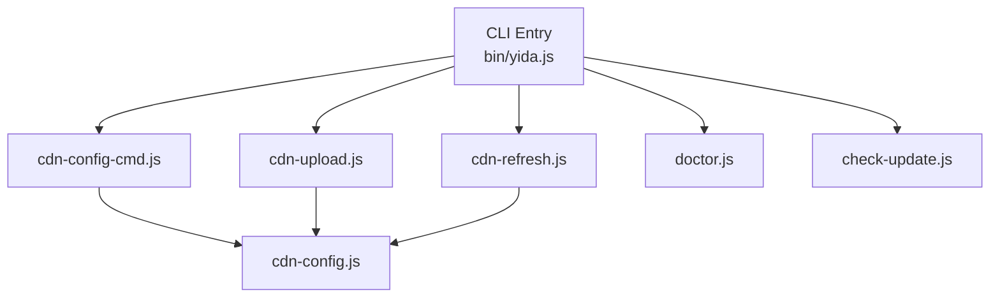
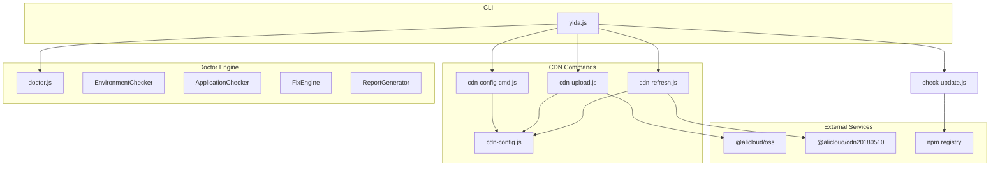
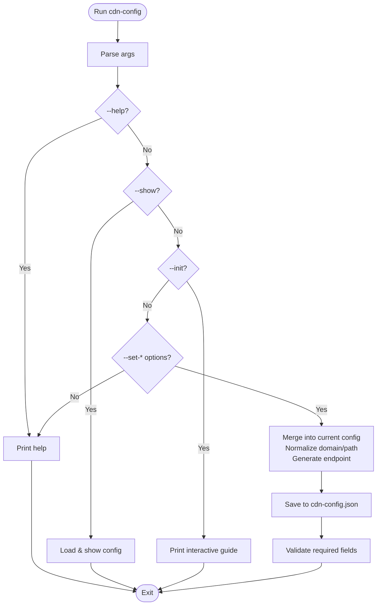
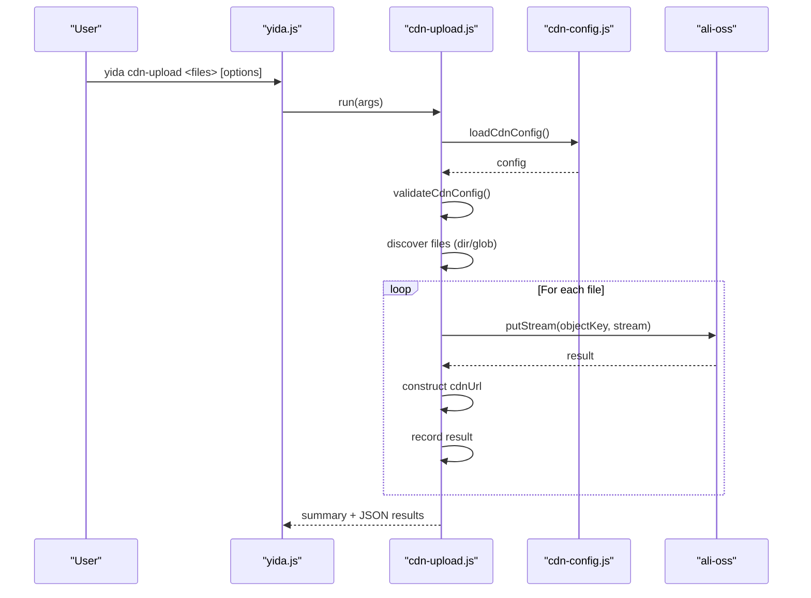
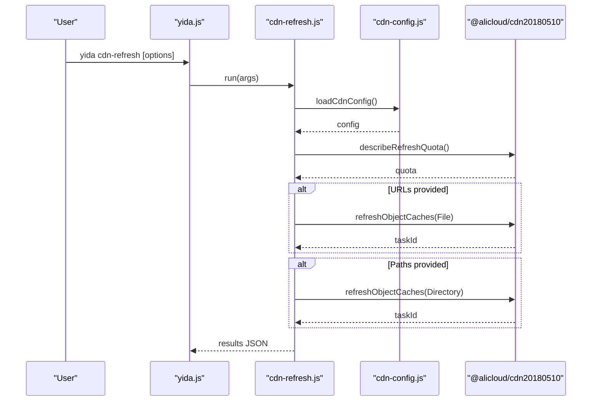
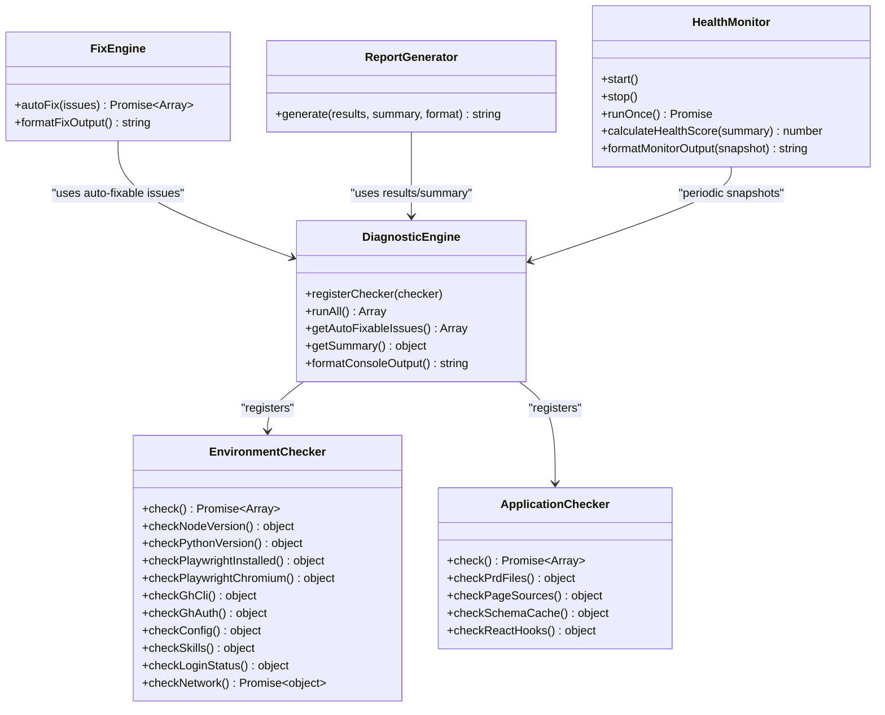
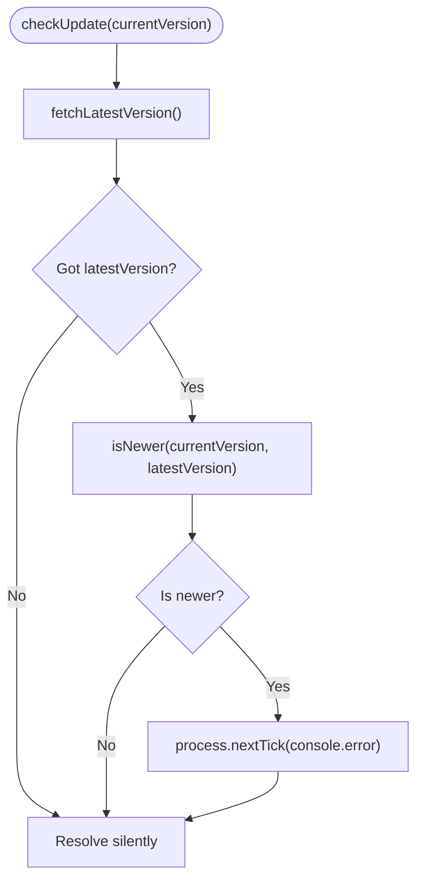
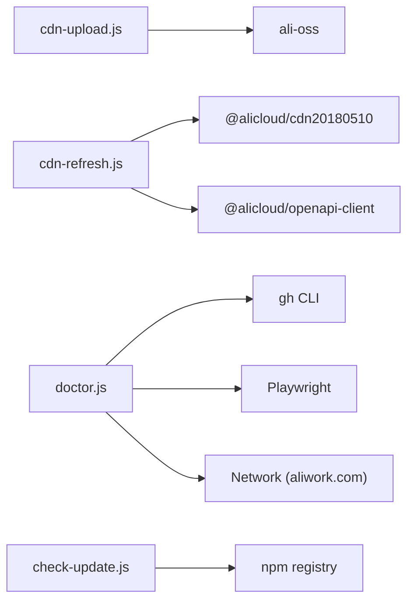

# CDN Integration & Diagnostic Commands

<cite>
**Referenced Files in This Document**
- [yida.js](file://bin/yida.js)
- [cdn-config-cmd.js](file://lib/cdn/cdn-config-cmd.js)
- [cdn-config.js](file://lib/cdn/cdn-config.js)
- [cdn-upload.js](file://lib/cdn/cdn-upload.js)
- [cdn-refresh.js](file://lib/cdn/cdn-refresh.js)
- [doctor.js](file://lib/core/doctor.js)
- [check-update.js](file://lib/core/check-update.js)
- [package.json](file://package.json)
- [cdn-config.test.js](file://tests/cdn-config.test.js)
- [doctor.test.js](file://tests/doctor.test.js)
- [check-update.test.js](file://tests/check-update.test.js)
</cite>

## Table of Contents
1. [Introduction](#introduction)
2. [Project Structure](#project-structure)
3. [Core Components](#core-components)
4. [Architecture Overview](#architecture-overview)
5. [Detailed Component Analysis](#detailed-component-analysis)
6. [Dependency Analysis](#dependency-analysis)
7. [Performance Considerations](#performance-considerations)
8. [Troubleshooting Guide](#troubleshooting-guide)
9. [Conclusion](#conclusion)
10. [Appendices](#appendices)

## Introduction
This document explains OpenYida’s CDN integration and diagnostic command groups. It covers:
- cdn-config: manage CDN configuration for Alibaba Cloud OSS and CDN domains
- cdn-upload: upload images and assets to OSS via CDN
- cdn-refresh: invalidate CDN cache for URLs and directories
- doctor: environment diagnostics and system health checks
- check-update: version management and update notifications

It also documents configuration parameters, upload workflows, diagnostic procedures, CDN integration patterns, image optimization strategies, cache management, and troubleshooting steps for common issues.

## Project Structure
The CLI entry point routes commands to dedicated modules. CDN-related commands are under lib/cdn, while diagnostics live under lib/core.

**Diagram sources**
- [yida.js:423-439](file://bin/yida.js#L423-L439)
- [cdn-config-cmd.js:1-251](file://lib/cdn/cdn-config-cmd.js#L1-L251)
- [cdn-upload.js:1-322](file://lib/cdn/cdn-upload.js#L1-L322)
- [cdn-refresh.js:1-294](file://lib/cdn/cdn-refresh.js#L1-L294)
- [doctor.js:1307-1488](file://lib/core/doctor.js#L1307-L1488)
- [check-update.js:1-71](file://lib/core/check-update.js#L1-L71)

**Section sources**
- [yida.js:423-439](file://bin/yida.js#L423-L439)

## Core Components
- cdn-config-cmd: Parses CLI arguments, initializes and updates configuration, displays masked credentials, validates completeness, and prints help/usage.
- cdn-config: Manages persistent configuration in ~/.openyida/cdn-config.json, merges defaults, validates required fields, and exposes helpers for existence checks and path retrieval.
- cdn-upload: Validates configuration, discovers images (files/directories/globs), optionally compresses, uploads to OSS, generates CDN URLs, and reports results.
- cdn-refresh: Validates configuration, creates Alibaba Cloud CDN client, queries refresh quotas, refreshes URLs and directories, and returns structured results.
- doctor: Multi-check diagnostic engine with EnvironmentChecker and ApplicationChecker, optional production error collection, fix engine, report generator, health monitor, and submission helpers.
- check-update: Asynchronously checks npm registry for newer versions and logs a message when available.

**Section sources**
- [cdn-config-cmd.js:1-251](file://lib/cdn/cdn-config-cmd.js#L1-L251)
- [cdn-config.js:1-173](file://lib/cdn/cdn-config.js#L1-L173)
- [cdn-upload.js:1-322](file://lib/cdn/cdn-upload.js#L1-L322)
- [cdn-refresh.js:1-294](file://lib/cdn/cdn-refresh.js#L1-L294)
- [doctor.js:1307-1488](file://lib/core/doctor.js#L1307-L1488)
- [check-update.js:1-71](file://lib/core/check-update.js#L1-L71)

## Architecture Overview
The CLI orchestrates command modules. CDN commands depend on cdn-config for shared configuration and Alibaba Cloud SDKs. Doctor composes multiple checker classes and optional fix/report/reporter components.

**Diagram sources**
- [yida.js:423-439](file://bin/yida.js#L423-L439)
- [cdn-config-cmd.js:1-251](file://lib/cdn/cdn-config-cmd.js#L1-L251)
- [cdn-upload.js:141-156](file://lib/cdn/cdn-upload.js#L141-L156)
- [cdn-refresh.js:79-96](file://lib/cdn/cdn-refresh.js#L79-L96)
- [doctor.js:1307-1488](file://lib/core/doctor.js#L1307-L1488)
- [check-update.js:19-68](file://lib/core/check-update.js#L19-L68)

## Detailed Component Analysis

### cdn-config Command
Purpose: Initialize and manage CDN configuration for Alibaba Cloud OSS and CDN domains.

Syntax
- yida cdn-config [--help|-h]
- yida cdn-config --init
- yida cdn-config --show
- yida cdn-config --set-key <key> --set-secret <secret> --set-domain <domain> --set-bucket <bucket> --set-region <region> --set-path <path>

Parameters
- --init: Interactive initialization guide
- --show: Print current configuration with masked secrets
- --set-key <key>: Alibaba Cloud AccessKey ID
- --set-secret <secret>: Alibaba Cloud AccessKey Secret
- --set-domain <domain>: CDN acceleration domain
- --set-bucket <bucket>: OSS bucket name
- --set-region <region>: OSS region (auto-generates endpoint)
- --set-path <path>: Upload path prefix (normalized)

Workflow
- Parse arguments and route to help/init/show/set handlers
- Load existing config and merge with new values
- Normalize domain (remove protocol/slashes) and upload path (ensure trailing slash)
- Auto-generate OSS endpoint from bucket and region
- Save to ~/.openyida/cdn-config.json
- Validate required fields and print status

Validation
- Required fields: accessKeyId, accessKeySecret, cdnDomain, ossBucket
- Presence checked via hasCdnConfig()

Security
- Sensitive fields masked when displayed

Examples
- yida cdn-config --init
- yida cdn-config --set-domain cdn.example.com --set-bucket my-bucket --set-region oss-cn-hangzhou

**Diagram sources**
- [cdn-config-cmd.js:40-248](file://lib/cdn/cdn-config-cmd.js#L40-L248)
- [cdn-config.js:98-126](file://lib/cdn/cdn-config.js#L98-L126)

**Section sources**
- [cdn-config-cmd.js:1-251](file://lib/cdn/cdn-config-cmd.js#L1-L251)
- [cdn-config.js:1-173](file://lib/cdn/cdn-config.js#L1-L173)
- [cdn-config.test.js:53-233](file://tests/cdn-config.test.js#L53-L233)

### cdn-upload Command
Purpose: Upload images to Alibaba Cloud OSS via configured CDN domain.

Syntax
- yida cdn-upload <image-or-dir-or-glob> [--domain <domain>] [--path <path>] [--compress|--no-compress]

Parameters
- <image-or-dir-or-glob>: One or more files, directories, or glob patterns
- --domain <domain>: Override configured CDN domain
- --path <path>: Override upload path prefix
- --compress: Enable compression (default)
- --no-compress: Disable compression

Supported Formats
- jpg, jpeg, png, gif, webp, bmp, svg

Workflow
- Validate configuration presence and completeness
- Discover files (directories recursively, glob expansion)
- For each file: generate unique filename, upload to OSS with streaming
- Build CDN URL using domain and object key
- Collect per-file results and print summary

**Diagram sources**
- [yida.js:429-432](file://bin/yida.js#L429-L432)
- [cdn-upload.js:167-262](file://lib/cdn/cdn-upload.js#L167-L262)
- [cdn-config.js:60-76](file://lib/cdn/cdn-config.js#L60-L76)

**Section sources**
- [cdn-upload.js:1-322](file://lib/cdn/cdn-upload.js#L1-L322)

### cdn-refresh Command
Purpose: Invalidate CDN cache for URLs and directories.

Syntax
- yida cdn-refresh [--urls "<url1,url2,...>"] [--paths "<path1,path2,...>"] [--file <file>]

Parameters
- --urls: Comma-separated list of URLs to refresh
- --paths: Comma-separated list of directory paths to refresh
- --file: Path to a file containing one URL per line

Workflow
- Validate configuration presence and completeness
- Create Alibaba Cloud CDN client
- Optionally read URLs from file
- Query refresh quota
- Refresh URLs (ObjectType=File) and/or paths (ObjectType=Directory)
- Return structured results including task IDs

**Diagram sources**
- [yida.js:435-438](file://bin/yida.js#L435-L438)
- [cdn-refresh.js:162-236](file://lib/cdn/cdn-refresh.js#L162-L236)
- [cdn-config.js:60-76](file://lib/cdn/cdn-config.js#L60-L76)

**Section sources**
- [cdn-refresh.js:1-294](file://lib/cdn/cdn-refresh.js#L1-L294)

### doctor Command
Purpose: Comprehensive environment and application diagnostics with optional fixes, reporting, monitoring, and submission automation.

Syntax
- yida doctor [--fix|--repair] [--production] [--app <appId>] [--monitor] [--report <format>] [--create-ticket|--create-voc|--auto-submit]

Key Options
- --fix/--repair: Attempt automatic fixes for auto-fixable issues
- --production: Include production error collection
- --app <appId>: Target application ID for production checks
- --monitor: Start health monitoring loop
- --report <format>: Generate report (json|markdown|html)
- --create-ticket: Interactive creation of a bug ticket
- --create-voc: Interactive creation of a VOC (voice of customer)
- --auto-submit: Intelligent decision on whether to submit ticket or VOC

Checks
- EnvironmentChecker: Node.js version, Python, Playwright, gh CLI, config.json, Skills, login status, network connectivity
- ApplicationChecker: PRD files, page sources, schema cache, React hooks usage
- Optional: ProductionErrorCollector (requires --app)

**Diagram sources**
- [doctor.js:50-129](file://lib/core/doctor.js#L50-L129)
- [doctor.js:1314-1488](file://lib/core/doctor.js#L1314-L1488)

**Section sources**
- [doctor.js:1307-1488](file://lib/core/doctor.js#L1307-L1488)
- [doctor.test.js:79-186](file://tests/doctor.test.js#L79-L186)
- [doctor.test.js:188-402](file://tests/doctor.test.js#L188-L402)

### check-update Command
Purpose: Asynchronously check npm registry for a newer version and notify if available.

Behavior
- Fetch latest version from npm registry
- Compare with current version
- Log a message if a newer version exists
- Failures are silent and do not block main flow

**Diagram sources**
- [check-update.js:56-68](file://lib/core/check-update.js#L56-L68)

**Section sources**
- [check-update.js:1-71](file://lib/core/check-update.js#L1-L71)
- [check-update.test.js:101-154](file://tests/check-update.test.js#L101-L154)

## Dependency Analysis
- cdn-upload depends on ali-oss SDK; missing installation triggers a helpful error with installation guidance.
- cdn-refresh depends on @alicloud/cdn20180510 and @alicloud/openapi-client SDKs; missing installation triggers a helpful error with installation guidance.
- doctor integrates with external tools (gh CLI, Playwright) and network endpoints for connectivity checks.
- check-update depends on npm registry HTTPS endpoint.

**Diagram sources**
- [cdn-upload.js:141-156](file://lib/cdn/cdn-upload.js#L141-L156)
- [cdn-refresh.js:79-96](file://lib/cdn/cdn-refresh.js#L79-L96)
- [doctor.js:25-438](file://lib/core/doctor.js#L25-L438)
- [check-update.js:19-36](file://lib/core/check-update.js#L19-L36)

**Section sources**
- [cdn-upload.js:141-156](file://lib/cdn/cdn-upload.js#L141-L156)
- [cdn-refresh.js:79-96](file://lib/cdn/cdn-refresh.js#L79-L96)
- [doctor.js:25-438](file://lib/core/doctor.js#L25-L438)
- [check-update.js:19-36](file://lib/core/check-update.js#L19-L36)

## Performance Considerations
- Image optimization
  - Compression enabled by default with configurable quality and max width
  - Unique filenames prevent collisions and improve CDN caching
- Upload throughput
  - Streaming uploads reduce memory footprint
  - Batch operations across multiple files
- CDN cache invalidation
  - Query quotas before refresh to avoid exceeding limits
  - Group URLs and paths to minimize API calls
- Diagnostics
  - Non-blocking network checks and optional timeouts
  - Health monitor runs at fixed intervals to track trends

[No sources needed since this section provides general guidance]

## Troubleshooting Guide

Common CDN Issues
- Missing configuration
  - Symptoms: “No config found” or validation fails
  - Resolution: Run cdn-config --init or set required fields via --set-*
- SDK not installed
  - Symptoms: “SDK required” messages during upload/refresh
  - Resolution: Install recommended packages (ali-oss, @alicloud/cdn20180510, @alicloud/openapi-client)
- Invalid domain/bucket/region
  - Symptoms: Endpoint generation or upload failures
  - Resolution: Verify cdnDomain, ossBucket, ossRegion; ensure bucket exists and permissions are correct
- Upload failures
  - Symptoms: Per-file failure entries
  - Resolution: Check file permissions, supported formats, and network connectivity

Cache Clearing Problems
- No targets specified
  - Symptoms: “No refresh targets”
  - Resolution: Provide --urls, --paths, or --file
- Quota exceeded
  - Symptoms: API errors indicating quota limits
  - Resolution: Reduce batch size or wait until quota resets

Environment Validation Errors
- Node.js version too low
  - Symptoms: “Node.js version too low”
  - Resolution: Upgrade to Node.js >= 18
- Python/Playwright missing
  - Symptoms: “Not installed” warnings
  - Resolution: Install Python 3.10+, Playwright, and Chromium
- gh CLI not installed/logged in
  - Symptoms: “gh CLI not installed” or “not logged in”
  - Resolution: Install gh CLI and run gh auth login
- config.json issues
  - Symptoms: “config.json does not exist” or “invalid JSON”
  - Resolution: Create template via auto-fix or correct JSON syntax

Doctor Reports and Monitoring
- Use --report json/markdown/html to generate diagnostics artifacts
- Use --monitor to continuously track health metrics
- Use --fix to automatically apply auto-fixable remediations

**Section sources**
- [cdn-upload.js:151-156](file://lib/cdn/cdn-upload.js#L151-L156)
- [cdn-refresh.js:91-96](file://lib/cdn/cdn-refresh.js#L91-L96)
- [doctor.js:161-210](file://lib/core/doctor.js#L161-L210)
- [doctor.js:261-304](file://lib/core/doctor.js#L261-L304)

## Conclusion
OpenYida’s CDN and diagnostic commands provide a cohesive toolkit for managing assets and validating environments. The cdn-config, cdn-upload, and cdn-refresh commands integrate seamlessly with Alibaba Cloud services and offer robust workflows for image delivery and cache management. The doctor command delivers comprehensive diagnostics, automated fixes, and reporting, while check-update keeps users informed about new releases. Together, these components streamline development, deployment, and operational maintenance.

[No sources needed since this section summarizes without analyzing specific files]

## Appendices

### Practical Workflows

Asset Deployment Workflow
- Configure CDN: yida cdn-config --set-key <key> --set-secret <secret> --set-domain <domain> --set-bucket <bucket> --set-region <region>
- Upload assets: yida cdn-upload ./assets/*.jpg --path product-images/
- Invalidate cache: yida cdn-refresh --urls "<cdn.example.com/a.jpg,cdn.example.com/b.png>"

Diagnostic Reporting
- Full diagnostics: yida doctor --fix --report markdown
- Production health: yida doctor --production --app <appId> --report html
- Continuous monitoring: yida doctor --monitor

System Maintenance
- Check for updates: yida --version (then compare with npm registry)
- Auto-fix environment issues: yida doctor --fix

**Section sources**
- [cdn-config-cmd.js:83-101](file://lib/cdn/cdn-config-cmd.js#L83-L101)
- [cdn-upload.js:79-92](file://lib/cdn/cdn-upload.js#L79-L92)
- [cdn-refresh.js:60-72](file://lib/cdn/cdn-refresh.js#L60-L72)
- [doctor.js:1314-1360](file://lib/core/doctor.js#L1314-L1360)