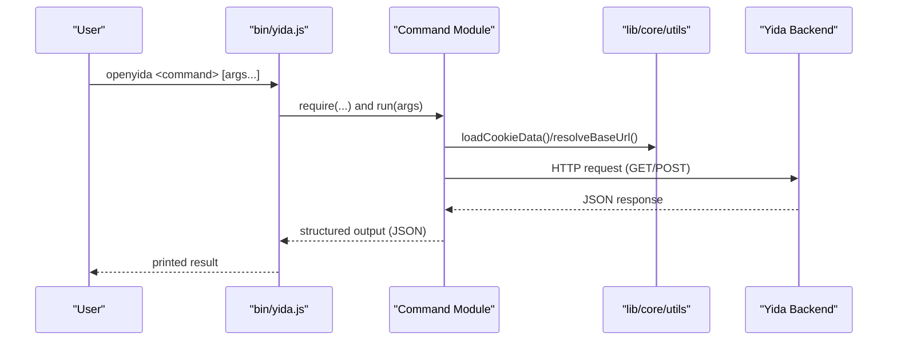
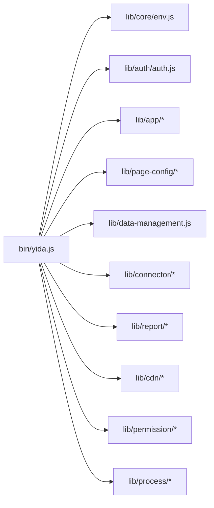

# CLI Command Reference

<cite>
**Referenced Files in This Document**
- [bin/yida.js](file://bin/yida.js)
- [package.json](file://package.json)
- [lib/core/env.js](file://lib/core/env.js)
- [lib/auth/auth.js](file://lib/auth/auth.js)
- [lib/app/create-app.js](file://lib/app/create-app.js)
- [lib/app/create-form.js](file://lib/app/create-form.js)
- [lib/page-config/save-share-config.js](file://lib/page-config/save-share-config.js)
- [lib/data-management.js](file://lib/data-management.js)
- [lib/connector/connector-list.js](file://lib/connector/connector-list.js)
- [lib/report/create-report.js](file://lib/report/create-report.js)
- [lib/cdn/cdn-config-cmd.js](file://lib/cdn/cdn-config-cmd.js)
- [lib/permission/get-permission.js](file://lib/permission/get-permission.js)
- [lib/process/configure-process.js](file://lib/process/configure-process.js)
</cite>

## Table of Contents
1. [Introduction](#introduction)
2. [Project Structure](#project-structure)
3. [Core Components](#core-components)
4. [Architecture Overview](#architecture-overview)
5. [Detailed Component Analysis](#detailed-component-analysis)
6. [Dependency Analysis](#dependency-analysis)
7. [Performance Considerations](#performance-considerations)
8. [Troubleshooting Guide](#troubleshooting-guide)
9. [Conclusion](#conclusion)
10. [Appendices](#appendices)

## Introduction
This document is the comprehensive CLI command reference for OpenYida’s command-line interface. It catalogs all available commands, organizes them by functional categories, and explains syntax, parameters, options, usage examples, and expected outputs. It also covers command routing, integration patterns, error handling, return codes, and practical workflows for both beginners and advanced users.

OpenYida exposes two executable names: openyida and yida. The CLI is implemented as a single entry script that routes commands to dedicated modules under lib/.

## Project Structure
The CLI entry point is located at bin/yida.js. Commands are grouped by functional domains under lib/, such as auth, app, page-config, data-management, connector, report, cdn, permission, process, and core utilities. Each command module encapsulates its own argument parsing, HTTP interactions, and output formatting.

```mermaid
graph TB
subgraph "CLI Entry"
YIDA["bin/yida.js"]
end
subgraph "Core"
ENV["lib/core/env.js"]
end
subgraph "Auth"
AUTH["lib/auth/auth.js"]
end
subgraph "App"
CREATE_APP["lib/app/create-app.js"]
CREATE_FORM["lib/app/create-form.js"]
end
subgraph "Page Config"
SAVE_SHARE["lib/page-config/save-share-config.js"]
end
subgraph "Data"
DATA_MGMT["lib/data-management.js"]
end
subgraph "Connector"
CONN_LIST["lib/connector/connector-list.js"]
end
subgraph "Report"
REPORT_CREATE["lib/report/create-report.js"]
end
subgraph "CDN"
CDN_CMD["lib/cdn/cdn-config-cmd.js"]
end
subgraph "Permission"
GET_PERM["lib/permission/get-permission.js"]
end
subgraph "Process"
CONFIG_PROC["lib/process/configure-process.js"]
end
YIDA --> ENV
YIDA --> AUTH
YIDA --> CREATE_APP
YIDA --> CREATE_FORM
YIDA --> SAVE_SHARE
YIDA --> DATA_MGMT
YIDA --> CONN_LIST
YIDA --> REPORT_CREATE
YIDA --> CDN_CMD
YIDA --> GET_PERM
YIDA --> CONFIG_PROC
```

**Diagram sources**
- [bin/yida.js:152-512](file://bin/yida.js#L152-L512)
- [lib/core/env.js:95-168](file://lib/core/env.js#L95-L168)
- [lib/auth/auth.js:61-127](file://lib/auth/auth.js#L61-L127)
- [lib/app/create-app.js:81-189](file://lib/app/create-app.js#L81-L189)
- [lib/app/create-form.js:92-176](file://lib/app/create-form.js#L92-L176)
- [lib/page-config/save-share-config.js:127-249](file://lib/page-config/save-share-config.js#L127-L249)
- [lib/data-management.js:336-360](file://lib/data-management.js#L336-L360)
- [lib/connector/connector-list.js:72-110](file://lib/connector/connector-list.js#L72-L110)
- [lib/report/create-report.js:15-25](file://lib/report/create-report.js#L15-L25)
- [lib/cdn/cdn-config-cmd.js:192-248](file://lib/cdn/cdn-config-cmd.js#L192-L248)
- [lib/permission/get-permission.js:141-203](file://lib/permission/get-permission.js#L141-L203)
- [lib/process/configure-process.js:1-18](file://lib/process/configure-process.js#L1-L18)

**Section sources**
- [bin/yida.js:152-512](file://bin/yida.js#L152-L512)
- [package.json:5-8](file://package.json#L5-L8)

## Core Components
- CLI entry and routing: The main script reads the command and delegates to the appropriate module. It supports help, version, and first-run guidance.
- Environment detection: Provides system info, active AI tool, project root, and login status.
- Authentication: Manages login status, QR login, refresh, and logout.
- App creation and form management: Creates apps, pages, forms, retrieves schemas, publishes pages, updates configs.
- Page sharing: Saves public access/share configurations and validates URLs.
- Data management: Unified CLI for querying, creating, updating, and managing form and process data.
- Connector system: Lists, creates, manages HTTP connectors and actions.
- Reports: Creates and appends charts to reports.
- CDN integration: Initializes and updates CDN/OSS configuration.
- Permissions: Queries form permission packages.
- Process configuration: Builds and publishes process definitions from JSON.

**Section sources**
- [bin/yida.js:140-521](file://bin/yida.js#L140-L521)
- [lib/core/env.js:95-168](file://lib/core/env.js#L95-L168)
- [lib/auth/auth.js:61-127](file://lib/auth/auth.js#L61-L127)
- [lib/app/create-app.js:81-189](file://lib/app/create-app.js#L81-L189)
- [lib/app/create-form.js:92-176](file://lib/app/create-form.js#L92-L176)
- [lib/page-config/save-share-config.js:127-249](file://lib/page-config/save-share-config.js#L127-L249)
- [lib/data-management.js:336-360](file://lib/data-management.js#L336-L360)
- [lib/connector/connector-list.js:72-110](file://lib/connector/connector-list.js#L72-L110)
- [lib/report/create-report.js:15-25](file://lib/report/create-report.js#L15-L25)
- [lib/cdn/cdn-config-cmd.js:192-248](file://lib/cdn/cdn-config-cmd.js#L192-L248)
- [lib/permission/get-permission.js:141-203](file://lib/permission/get-permission.js#L141-L203)
- [lib/process/configure-process.js:1-18](file://lib/process/configure-process.js#L1-L18)

## Architecture Overview
The CLI follows a modular routing pattern:
- The entry script parses argv and dispatches to a command module.
- Each module handles its own argument parsing, authentication, HTTP requests, and structured output.
- Shared utilities provide environment detection, cookie loading, CSRF handling, and internationalization.

**Diagram sources**
- [bin/yida.js:152-512](file://bin/yida.js#L152-L512)
- [lib/core/env.js:95-168](file://lib/core/env.js#L95-L168)
- [lib/app/create-app.js:146-162](file://lib/app/create-app.js#L146-L162)
- [lib/data-management.js:124-136](file://lib/data-management.js#L124-L136)

## Detailed Component Analysis

### Environment & Authentication
- env
  - Purpose: Detect environment, active AI tool, project root, and login status.
  - Syntax: openyida env
  - Options: None
  - Output: Structured environment and login status summary.
  - Aliases: None
  - Examples:
    - openyida env
  - Notes: Uses environment detection and cookie extraction utilities.

- auth status/login/refresh/logout
  - Purpose: Query login status, initiate login (QR or DingTalk), refresh token, and logout.
  - Syntax:
    - openyida auth status
    - openyida auth login
    - openyida auth refresh
    - openyida auth logout
  - Options: None
  - Output: Status JSON or success messages.
  - Aliases: None
  - Examples:
    - openyida auth status
    - openyida auth login
    - openyida auth refresh
    - openyida auth logout

- login/logout (top-level)
  - Purpose: Login with optional QR mode; logout.
  - Syntax:
    - openyida login [--qr]
    - openyida logout
  - Options:
    - --qr: Use QR login flow.
  - Output: JSON result of login/logout.
  - Aliases: None
  - Examples:
    - openyida login
    - openyida login --qr
    - openyida logout

- org list/switch
  - Purpose: List organizations and switch without re-authentication.
  - Syntax:
    - openyida org list
    - openyida org switch --corp-id <corpId>
  - Options:
    - --corp-id: Target organization ID.
  - Output: Organization list or success confirmation.
  - Aliases: None
  - Examples:
    - openyida org list
    - openyida org switch --corp-id 12345

**Section sources**
- [bin/yida.js:152-241](file://bin/yida.js#L152-L241)
- [lib/core/env.js:95-168](file://lib/core/env.js#L95-L168)
- [lib/auth/auth.js:61-127](file://lib/auth/auth.js#L61-L127)

### Application & Form Management
- create-app
  - Purpose: Create a new application with name, description, icon, color, and theme.
  - Syntax: openyida create-app "<appName>" [description] [icon] [iconColor] [themeColor]
  - Options: None
  - Output: JSON with appType, corpId, URL; updates PRD if present.
  - Aliases: None
  - Examples:
    - openyida create-app "Leave Request App"
    - openyida create-app "Leave Request App" "Leave management app" xian-yingyong "#0089FF" blue

- create-page
  - Purpose: Create a custom page for an app type.
  - Syntax: openyida create-page <appType> "<pageName>"
  - Options: None
  - Output: JSON result of page creation.
  - Aliases: None
  - Examples:
    - openyida create-page APP_XXXXX "Dashboard"

- create-form (create/update)
  - Purpose: Create or update form schema with fields or changes.
  - Syntax:
    - openyida create-form create <appType> "<formTitle>" <fieldsJsonOrFile> [--layout <single|double|card|section>] [--theme <default|compact|comfortable>] [--label-align <top|left|right>]
    - openyida create-form update <appType> <formUuid> <changesJsonOrFile>
  - Options:
    - --layout: Layout style.
    - --theme: Theme style.
    - --label-align: Label alignment.
  - Output: JSON result of schema save/update.
  - Aliases: None
  - Examples:
    - openyida create-form create APP_XXXXX "Employee Info" fields.json
    - openyida create-form update APP_XXXXX FORM-YYYYY '[{"action":"add","field":{"type":"TextField","label":"Remark"}}]'

- get-schema
  - Purpose: Retrieve form schema.
  - Syntax: openyida get-schema <appType> <formUuid>
  - Options: None
  - Output: JSON schema.
  - Aliases: None
  - Examples:
    - openyida get-schema APP_XXXXX FORM-YYYYY

- publish
  - Purpose: Compile and publish a custom page.
  - Syntax: openyida publish <sourceFile> <appType> <formUuid>
  - Options: None
  - Output: JSON result of publish.
  - Aliases: None
  - Examples:
    - openyida publish ./src/index.js APP_XXXXX FORM-YYYYY

- update-form-config
  - Purpose: Update form configuration (e.g., navigation visibility, title).
  - Syntax: openyida update-form-config <appType> <formUuid> <isRenderNav> <title>
  - Options: None
  - Output: JSON result of update.
  - Aliases: None
  - Examples:
    - openyida update-form-config APP_XXXXX FORM-YYYYY n "New Title"

- verify-short-url
  - Purpose: Verify availability of a short URL for sharing.
  - Syntax: openyida verify-short-url <appType> <formUuid> <url>
  - Options: None
  - Output: JSON result of verification.
  - Aliases: None
  - Examples:
    - openyida verify-short-url APP_XXXXX FORM-YYYYY /o/abc123

- get-page-config
  - Purpose: Query page public access/share configuration.
  - Syntax: openyida get-page-config <appType> <formUuid>
  - Options: None
  - Output: JSON configuration.
  - Aliases: None
  - Examples:
    - openyida get-page-config APP_XXXXX FORM-YYYYY

- save-share-config
  - Purpose: Save public access/share configuration for a page.
  - Syntax: openyida save-share-config <appType> <formUuid> <url> <isOpen:y|n> [openAuth:y|n]
  - Options:
    - isOpen: Enable public access.
    - openAuth: Require authentication for public access.
  - Output: JSON result with success or error details.
  - Aliases: None
  - Examples:
    - openyida save-share-config APP_XXXXX FORM-YYYYY "/o/abc123" y n

**Section sources**
- [bin/yida.js:243-324](file://bin/yida.js#L243-L324)
- [lib/app/create-app.js:81-189](file://lib/app/create-app.js#L81-L189)
- [lib/app/create-form.js:92-176](file://lib/app/create-form.js#L92-L176)
- [lib/page-config/save-share-config.js:127-249](file://lib/page-config/save-share-config.js#L127-L249)

### Page Configuration & Sharing
- save-share-config
  - Validates URL prefix (/o/ or /s/) and characters.
  - Supports openAuth configuration.
  - Handles CSRF/token expiration and re-login automatically.
  - Output: JSON success/error with optional openUrl and isOpen flags.

- get-page-config
  - Returns current share/public access configuration.

- verify-short-url
  - Verifies whether a given short URL is available.

- update-form-config
  - Updates rendering and metadata of a form.

**Section sources**
- [bin/yida.js:282-324](file://bin/yida.js#L282-L324)
- [lib/page-config/save-share-config.js:35-56](file://lib/page-config/save-share-config.js#L35-L56)

### Data Management
- data <action> <resource> [args...]
  - Unified CLI for form, process, and task data operations.
  - Actions:
    - query form: Search form instances with pagination and filters.
    - get form: Retrieve a single form instance by ID.
    - create form: Create a new form instance.
    - update form: Update an existing form instance.
    - query subform: List table data within a form instance.
    - query process: Search process instances with filters.
    - get process: Retrieve a process instance by ID.
    - create process: Start a new process instance.
    - update process: Update a process instance.
    - query operation-records: Get operation records for a process.
    - execute task: Approve/reject tasks with remarks and optional data.
    - query tasks: List tasks by type (todo, done, submitted, cc).
  - Common options:
    - --page N, --size N (default varies by endpoint)
    - --search-json JSON, --inst-id ID, --process-inst-id ID, --task-id ID
    - --dept-id ID, --process-code CODE, --data-json JSON, --out-result AGREE|DISAGREE
    - --remark TEXT, --no-execute-expressions y
  - Output: JSON result; exits with non-zero on failure.
  - Examples:
    - openyida data query form APP_XXXXX FORM-YYYYY --page 1 --size 20
    - openyida data create process APP_XXXXX FORM-YYYYY --process-code LEAVE --data-json '{"field": "value"}'

**Section sources**
- [bin/yida.js:326-335](file://bin/yida.js#L326-L335)
- [lib/data-management.js:13-363](file://lib/data-management.js#L13-L363)

### Permissions & Process
- get-permission
  - Purpose: Query permission packages for a form.
  - Syntax: openyida get-permission <appType> <formUuid>
  - Options: None
  - Output: JSON with formatted permissions.
  - Aliases: None
  - Examples:
    - openyida get-permission APP_XXXXX FORM-YYYYY

- save-permission
  - Purpose: Save data/action/field permissions for a form.
  - Syntax: openyida save-permission <appType> <formUuid> [--data-permission <json>] [--action-permission <json>]
  - Options:
    - --data-permission: Data permission JSON.
    - --action-permission: Action permission JSON.
  - Output: JSON result.
  - Aliases: None
  - Examples:
    - openyida save-permission APP_XXXXX FORM-YYYYY --data-permission '{...}' --action-permission '{...}'

- configure-process
  - Purpose: Configure process rules from a JSON definition file.
  - Syntax: openyida configure-process <appType> <formUuid> <processDefinitionFile> [processCode]
  - Options: None
  - Output: JSON result of save/publish.
  - Aliases: None
  - Examples:
    - openyida configure-process APP_XXXXX FORM-YYYYY ./proc-def.json
    - openyida configure-process APP_XXXXX FORM-YYYYY ./proc-def.json PROC_XXXXX

- create-process
  - Purpose: Start a new process instance.
  - Syntax: openyida create-process <appType> <formUuid> --process-code <code> --data-json <json> [--dept-id <id>]
  - Options:
    - --process-code: Process code.
    - --data-json: Instance data.
    - --dept-id: Optional department ID.
  - Output: JSON result.
  - Aliases: None
  - Examples:
    - openyida create-process APP_XXXXX FORM-YYYYY --process-code LEAVE --data-json '{"field": "value"}'

**Section sources**
- [bin/yida.js:367-409](file://bin/yida.js#L367-L409)
- [lib/permission/get-permission.js:141-203](file://lib/permission/get-permission.js#L141-L203)
- [lib/process/configure-process.js:1-18](file://lib/process/configure-process.js#L1-L18)

### HTTP Connector System
- connector list
  - Purpose: List HTTP connectors with filtering and pagination.
  - Syntax: openyida connector list [options]
  - Options:
    - --keyword <keyword>
    - --type <mine|manager>
    - --start-date <YYYY-MM-DD>
    - --end-date <YYYY-MM-DD>
    - --page-size <number>
  - Output: Tabular list; prints usage hints.
  - Aliases: None
  - Examples:
    - openyida connector list --keyword "Test"
    - openyida connector list --type manager --page-size 50

- connector create/detail/delete/add-action/list-actions/delete-action/test/list-connections/create-connection/smart-create/parse-api/gen-template
  - Purpose: Full lifecycle management of connectors and actions.
  - Syntax: openyida connector <subcommand> [args...]
  - Options: Vary by subcommand.
  - Output: JSON result or tabular listings.
  - Aliases: None
  - Examples:
    - openyida connector list
    - openyida connector create "My API" "https://api.example.com" --operations ./ops.json
    - openyida connector detail <connector-id>
    - openyida connector add-action --operations ./ops.json --connector-id <id>

**Section sources**
- [bin/yida.js:441-476](file://bin/yida.js#L441-L476)
- [lib/connector/connector-list.js:72-110](file://lib/connector/connector-list.js#L72-L110)

### Report & Dashboard
- create-report
  - Purpose: Create a new report with chart definitions.
  - Syntax: openyida create-report <appType> "<reportName>" <chartDefJsonOrFile>
  - Options: None
  - Output: JSON result.
  - Aliases: None
  - Examples:
    - openyida create-report APP_XXXXX "Sales Report" ./charts.json

- append-chart
  - Purpose: Append charts to an existing report.
  - Syntax: openyida append-chart <appType> <reportId> <chartDefJsonOrFile>
  - Options: None
  - Output: JSON result.
  - Examples:
    - openyida append-chart APP_XXXXX RPT_XXXXX ./more-charts.json

**Section sources**
- [bin/yida.js:411-421](file://bin/yida.js#L411-L421)
- [lib/report/create-report.js:15-25](file://lib/report/create-report.js#L15-L25)

### CDN Integration
- cdn-config
  - Purpose: Manage Alibaba Cloud CDN/OSS configuration.
  - Syntax: openyida cdn-config [options]
  - Options:
    - --init: Interactive initialization.
    - --show: Show current configuration.
    - --set-key <key>, --set-secret <secret>, --set-domain <domain>, --set-bucket <bucket>, --set-region <region>, --set-path <path>
  - Output: JSON result or masked configuration display.
  - Aliases: None
  - Examples:
    - openyida cdn-config --init
    - openyida cdn-config --show
    - openyida cdn-config --set-domain cdn.example.com

- cdn-upload
  - Purpose: Upload assets to CDN/OSS.
  - Syntax: openyida cdn-upload [options]
  - Options: Vary by implementation.
  - Output: JSON result.
  - Aliases: None
  - Examples:
    - openyida cdn-upload ./assets/

- cdn-refresh
  - Purpose: Refresh CDN cache.
  - Syntax: openyida cdn-refresh [paths...]
  - Options: Paths to refresh.
  - Output: JSON result.
  - Aliases: None
  - Examples:
    - openyida cdn-refresh /img/a.jpg /img/b.png

**Section sources**
- [bin/yida.js:423-439](file://bin/yida.js#L423-L439)
- [lib/cdn/cdn-config-cmd.js:192-248](file://lib/cdn/cdn-config-cmd.js#L192-L248)

### Command Routing Mechanism
- The CLI reads process.argv[2] as the command and switches to the corresponding module.
- Subcommands under connector are dispatched via a subcommand-to-module map.
- Many commands adjust process.argv to align with module expectations (e.g., publish, verify-short-url, save-share-config, get-page-config, update-form-config).
- Errors are handled with localized messages and non-zero exit codes.

```mermaid
flowchart TD
Start(["Process.argv[2] = command"]) --> Switch["Switch(command)"]
Switch --> Env["env"]
Switch --> Auth["auth/*"]
Switch --> Org["org/*"]
Switch --> CreateApp["create-app"]
Switch --> CreatePage["create-page"]
Switch --> CreateForm["create-form"]
Switch --> GetSchema["get-schema"]
Switch --> Publish["publish"]
Switch --> VerifyUrl["verify-short-url"]
Switch --> ShareCfg["save-share-config"]
Switch --> PageCfg["get-page-config"]
Switch --> UpdateFormCfg["update-form-config"]
Switch --> Data["data"]
Switch --> Doctor["doctor"]
Switch --> Export["export"]
Switch --> Import["import"]
Switch --> GetPerm["get-permission"]
Switch --> SavePerm["save-permission"]
Switch --> ConfigureProc["configure-process"]
Switch --> CreateProc["create-process"]
Switch --> CreateReport["create-report"]
Switch --> AppendChart["append-chart"]
Switch --> CdnConfig["cdn-config"]
Switch --> CdnUpload["cdn-upload"]
Switch --> CdnRefresh["cdn-refresh"]
Switch --> Connector["connector/*"]
Switch --> QueryData["query-data"]
Switch --> Integration["integration"]
Switch --> Default["Unknown command"]
```

**Diagram sources**
- [bin/yida.js:152-512](file://bin/yida.js#L152-L512)

**Section sources**
- [bin/yida.js:152-512](file://bin/yida.js#L152-L512)

### Command Chaining and Workflow Automation
- Typical workflow:
  1. openyida env
  2. openyida login or openyida auth login
  3. openyida create-app "<AppName>"
  4. openyida create-form create <appType> "<FormTitle>" fields.json
  5. openyida publish <sourceFile> <appType> <formUuid>
  6. openyida save-share-config <appType> <formUuid> "/o/<slug>" y [openAuth]
  7. openyida create-report <appType> "<ReportName>" charts.json
  8. openyida cdn-config --init
  9. openyida cdn-upload ./dist/
  10. openyida cdn-refresh /assets/*
- Use shell scripting or CI to chain commands and pass JSON outputs between steps.

[No sources needed since this section provides general guidance]

## Dependency Analysis
- Entry depends on command modules via dynamic require.
- Command modules depend on shared utilities for authentication and HTTP.
- Internationalization and logging are centralized.

**Diagram sources**
- [bin/yida.js:152-512](file://bin/yida.js#L152-L512)

**Section sources**
- [bin/yida.js:152-512](file://bin/yida.js#L152-L512)

## Performance Considerations
- Prefer pagination (--page/--size) for large datasets in data queries.
- Use --ids-only variants when only IDs are needed to reduce payload.
- Batch CDN uploads and refreshes to minimize API calls.
- Cache login sessions and avoid repeated login checks in scripts.

[No sources needed since this section provides general guidance]

## Troubleshooting Guide
- Unknown command: The CLI prints a localized “unknown command” message and suggests help.
- Missing arguments: Many commands print usage and examples before exiting with code 1.
- Login required: Commands that need authentication will trigger login or print errors.
- CSRF/token expired: Commands auto-refresh tokens or prompt re-login.
- Non-JSON responses: Errors include HTTP status and truncated body for inspection.
- Return codes:
  - 0: Success
  - 1: Failure (argument or runtime error)

Common fixes:
- Run openyida env to confirm environment and login status.
- Re-run openyida login or openyida auth login.
- Verify URL prefixes for share/public access commands.
- Ensure JSON payloads are valid for data and permission commands.

**Section sources**
- [bin/yida.js:507-520](file://bin/yida.js#L507-L520)
- [lib/page-config/save-share-config.js:35-56](file://lib/page-config/save-share-config.js#L35-L56)
- [lib/data-management.js:138-149](file://lib/data-management.js#L138-L149)

## Conclusion
OpenYida’s CLI offers a comprehensive, modular command surface spanning environment detection, authentication, application and form management, page sharing, unified data operations, connectors, reporting, and CDN integration. Its routing and error-handling patterns enable both beginner-friendly workflows and advanced automation scenarios.

[No sources needed since this section summarizes without analyzing specific files]

## Appendices

### Command Index by Category
- Environment & Authentication
  - env
  - login/logout
  - auth status/login/refresh/logout
  - org list/switch
- Application & Form Management
  - create-app
  - create-page
  - create-form (create/update)
  - get-schema
  - publish
  - verify-short-url
  - save-share-config
  - get-page-config
  - update-form-config
- Data Management
  - data query/get/create/update/query subform/query process/get process/create process/update process/query operation-records/execute task/query tasks
- Permissions & Process
  - get-permission
  - save-permission
  - configure-process
  - create-process
- HTTP Connector System
  - connector list
  - connector create/detail/delete/add-action/list-actions/delete-action/test/list-connections/create-connection/smart-create/parse-api/gen-template
- Report & Dashboard
  - create-report
  - append-chart
- CDN Integration
  - cdn-config
  - cdn-upload
  - cdn-refresh

[No sources needed since this section provides general guidance]