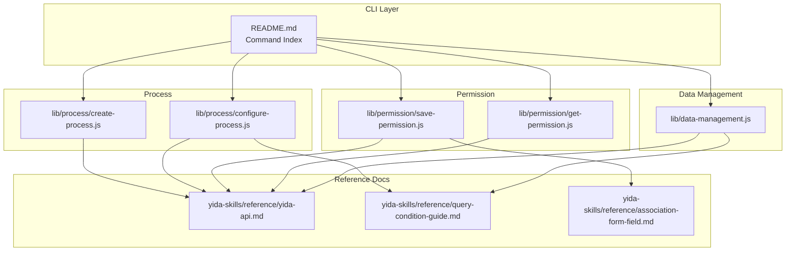
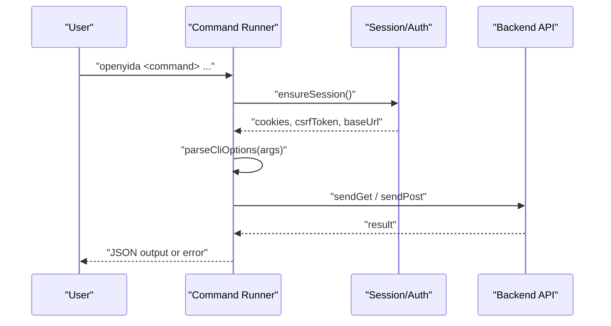
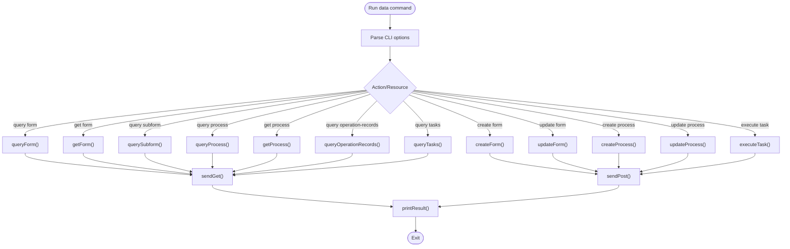
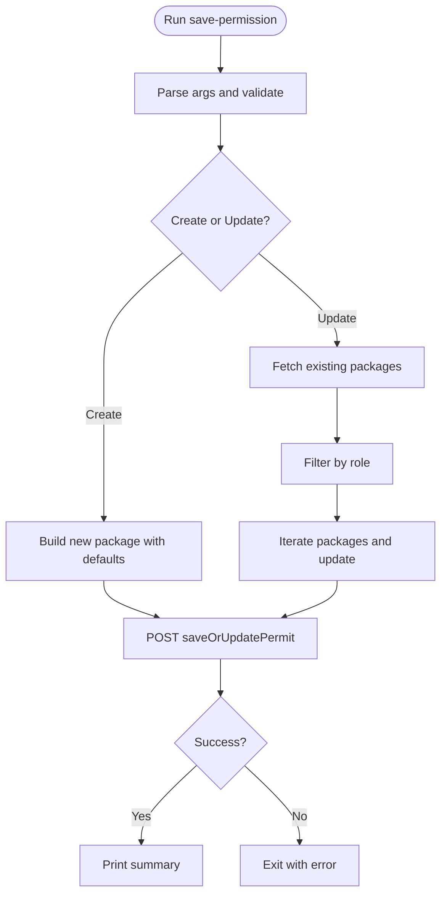
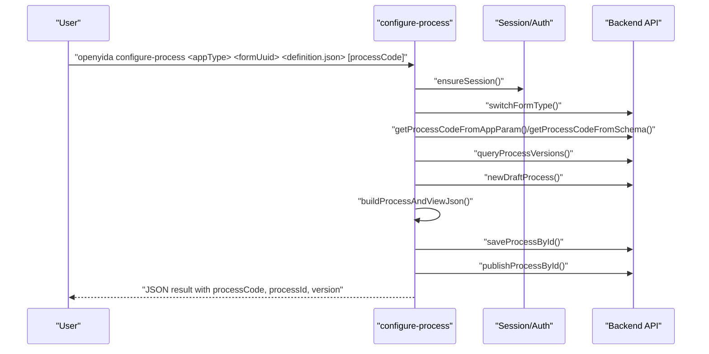
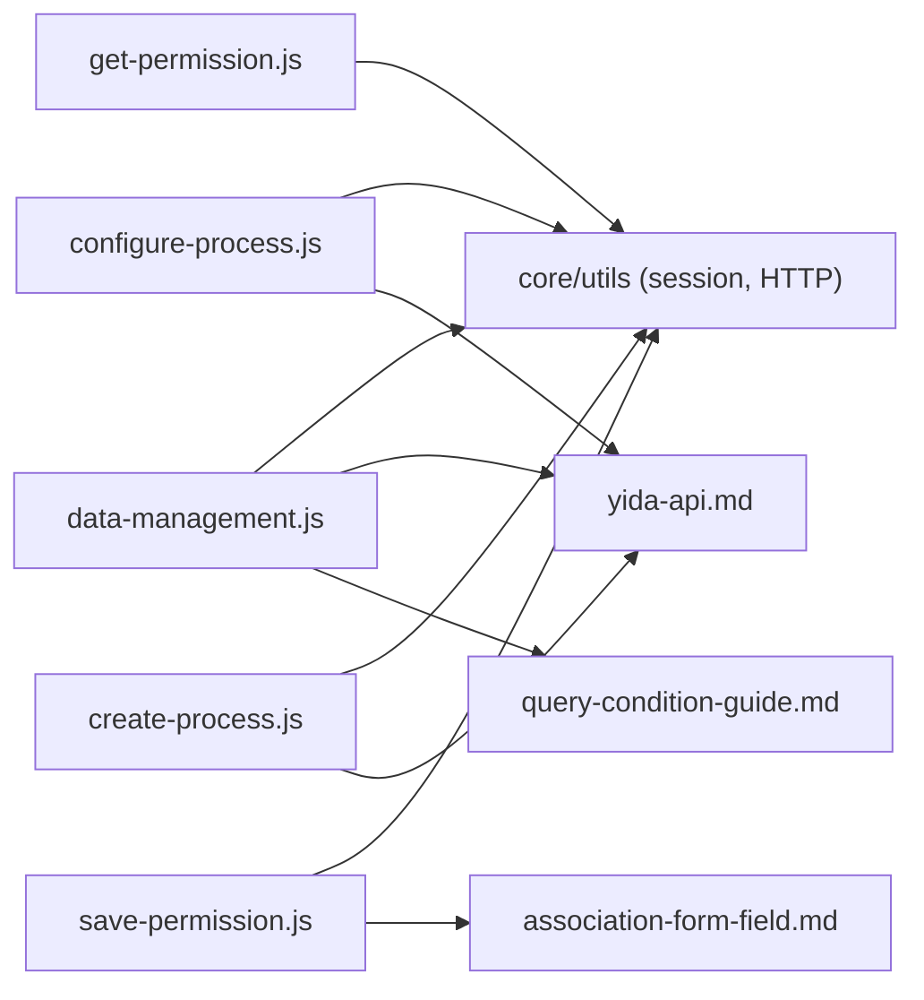

# Data Management & Permission Commands

<cite>
**Referenced Files in This Document**
- [data-management.js](file://lib/data-management.js)
- [README.md](file://README.md)
- [get-permission.js](file://lib/permission/get-permission.js)
- [save-permission.js](file://lib/permission/save-permission.js)
- [configure-process.js](file://lib/process/configure-process.js)
- [create-process.js](file://lib/process/create-process.js)
- [yida-api.md](file://yida-skills/reference/yida-api.md)
- [query-condition-guide.md](file://yida-skills/reference/query-condition-guide.md)
- [association-form-field.md](file://yida-skills/reference/association-form-field.md)
</cite>

## Table of Contents
1. [Introduction](#introduction)
2. [Project Structure](#project-structure)
3. [Core Components](#core-components)
4. [Architecture Overview](#architecture-overview)
5. [Detailed Component Analysis](#detailed-component-analysis)
6. [Dependency Analysis](#dependency-analysis)
7. [Performance Considerations](#performance-considerations)
8. [Troubleshooting Guide](#troubleshooting-guide)
9. [Conclusion](#conclusion)
10. [Appendices](#appendices)

## Introduction
This document provides comprehensive documentation for OpenYida’s data management and permission command group. It covers:
- Unified data operations across forms, processes, tasks, and sub-forms (query, filter, update)
- Permission management commands (get-permission and save-permission)
- Workflow commands (configure-process and create-process)
- Practical examples, filtering capabilities, permission schema patterns, and integration with form schemas and process definitions

The goal is to help developers and operators use these commands effectively for data querying, permission configuration, and workflow automation while understanding validation, access control patterns, and backend integration.

## Project Structure
The relevant modules are organized under lib/, with dedicated subdirectories for permission and process management, and a central data-management module for unified data operations. The README lists the CLI commands and provides usage guidance.

**Diagram sources**
- [README.md:108-117](file://README.md#L108-L117)
- [data-management.js:13-30](file://lib/data-management.js#L13-L30)
- [get-permission.js:1-206](file://lib/permission/get-permission.js#L1-L206)
- [save-permission.js:1-583](file://lib/permission/save-permission.js#L1-L583)
- [configure-process.js:1-1035](file://lib/process/configure-process.js#L1-L1035)
- [create-process.js:1-301](file://lib/process/create-process.js#L1-L301)
- [yida-api.md:1-800](file://yida-skills/reference/yida-api.md#L1-L800)
- [query-condition-guide.md:1-298](file://yida-skills/reference/query-condition-guide.md#L1-L298)
- [association-form-field.md:1-469](file://yida-skills/reference/association-form-field.md#L1-L469)

**Section sources**
- [README.md:77-136](file://README.md#L77-L136)

## Core Components
- Data Management CLI: Centralized command group for unified data operations across forms, processes, tasks, and sub-forms. Supports query, get, create, update, and task execution with robust parameter parsing and pagination controls.
- Permission Management: Two commands—get-permission and save-permission—to inspect and modify form permission packages, including data scope, action permissions, and member lists.
- Process Workflow: Two commands—configure-process and create-process—to define, build, and publish process workflows from JSON definitions, integrating with form schemas and process codes.

**Section sources**
- [data-management.js:13-363](file://lib/data-management.js#L13-L363)
- [get-permission.js:1-206](file://lib/permission/get-permission.js#L1-L206)
- [save-permission.js:1-583](file://lib/permission/save-permission.js#L1-L583)
- [configure-process.js:1-1035](file://lib/process/configure-process.js#L1-L1035)
- [create-process.js:1-301](file://lib/process/create-process.js#L1-L301)

## Architecture Overview
The commands follow a consistent pattern:
- Session initialization and login fallback
- Parameter parsing and validation
- Request construction with CSRF and cookies
- Backend API calls and response handling
- Structured output or error reporting

**Diagram sources**
- [data-management.js:44-122](file://lib/data-management.js#L44-L122)
- [get-permission.js:141-203](file://lib/permission/get-permission.js#L141-L203)
- [save-permission.js:357-581](file://lib/permission/save-permission.js#L357-L581)

## Detailed Component Analysis

### Data Management Command Group
The unified data CLI supports:
- Forms: query, get, create, update, and sub-form list
- Processes: query, get, create, update, and operation records
- Tasks: query tasks by type and execute tasks
- Pagination and filtering with robust parameter validation

Key capabilities:
- Query forms with optional search filters and date ranges
- Query processes with filters and pagination
- Execute tasks with approval outcomes and remarks
- Sub-form queries with pagination
- Robust error handling and structured output

**Diagram sources**
- [data-management.js:151-363](file://lib/data-management.js#L151-L363)

Practical examples (syntax and parameters):
- Query forms with filters and pagination
  - Syntax: openyida data query form <appType> <formUuid> [--page N] [--size N] [--search-json JSON] [--inst-id ID]
  - Filters: searchFieldJson, originatorId, createFrom, createTo, modifiedFrom, modifiedTo, dynamicOrder
  - Reference: [data-management.js:151-179](file://lib/data-management.js#L151-L179), [query-condition-guide.md:1-298](file://yida-skills/reference/query-condition-guide.md#L1-L298)
- Query processes with filters and pagination
  - Syntax: openyida data query process <appType> <formUuid> [--page N] [--size N] [--search-json JSON] [--task-id ID] [--instance-status STATUS] [--approved-result RESULT]
  - Reference: [data-management.js:232-248](file://lib/data-management.js#L232-L248)
- Execute a task
  - Syntax: openyida data execute task <appType> --task-id <taskId> --process-inst-id <processInstanceId> --out-result <AGREE|DISAGREE> --remark <text> [--data-json JSON] [--no-execute-expressions y]
  - Reference: [data-management.js:293-308](file://lib/data-management.js#L293-L308)
- Query tasks by type
  - Syntax: openyida data query tasks <appType> --type <todo|done|submitted|cc> [--page N] [--size N] [--keyword TEXT] [--process-codes JSON] [--instance-status STATUS]
  - Reference: [data-management.js:310-334](file://lib/data-management.js#L310-L334)

Validation and constraints:
- Page size clamping and defaults
- Required parameters enforcement
- Snake-case to camelCase conversion for backend keys
- Structured error messages and exit codes

**Section sources**
- [data-management.js:13-363](file://lib/data-management.js#L13-L363)
- [query-condition-guide.md:1-298](file://yida-skills/reference/query-condition-guide.md#L1-L298)

### Permission Management Commands

#### get-permission
Purpose: Retrieve permission configurations for a form, including data, action, and field permissions, and role members.

Capabilities:
- List permission packages for a given form
- Format internationalized package names and descriptions
- Output structured JSON with permission summaries

Syntax:
- openyida get-permission <appType> <formUuid>

Behavior:
- Ensures session and handles login fallback
- Queries permission packages via GET
- Parses and formats results for readability

**Section sources**
- [get-permission.js:1-206](file://lib/permission/get-permission.js#L1-L206)

#### save-permission
Purpose: Update or create permission packages for a form, including data scope, action permissions, and members.

Capabilities:
- Validate data range and action permissions
- Build role data with override members
- Create or update permission packages via POST
- Support creation of new packages or updates to existing ones

Syntax:
- Update existing: openyida save-permission <appType> <formUuid> [--data-permission JSON] [--action-permission JSON] [--members <userId,...>]
- Create new: openyida save-permission <appType> <formUuid> --create --name <groupName> [--members <userId,...>] [--data-permission JSON] [--action-permission JSON]

Permission schema examples:
- Data scope mapping (user-friendly aliases to backend values)
  - Example: SELF → ORIGINATOR, DEPARTMENT → ORIGINATOR_DEPARTMENT, CUSTOM → FORMULA
- Action permissions (enable/disable operations)
  - Example: OPERATE_VIEW, OPERATE_EDIT, OPERATE_DELETE, etc.
- Members list (DingTalk user IDs)
  - Example: --members "54255850977641,12345678901234"

Validation and constraints:
- Data range validation against supported values
- Operations validation against supported keys
- Member list parsing and trimming
- Field permissions currently unsupported via CLI (manual configuration required)

**Diagram sources**
- [save-permission.js:357-581](file://lib/permission/save-permission.js#L357-L581)

**Section sources**
- [save-permission.js:1-583](file://lib/permission/save-permission.js#L1-L583)

### Process Workflow Commands

#### configure-process
Purpose: Configure and publish a process workflow from a JSON definition file, integrating with form schemas and process codes.

Capabilities:
- Resolve processCode from form navigation or schema
- Query existing versions and create a new draft
- Build processJson and viewJson from definition
- Save and publish the process

Workflow steps:
1. Load definition from file
2. Ensure session and resolve processCode
3. Query versions and create draft
4. Build process/view JSON
5. Save and publish

**Diagram sources**
- [configure-process.js:832-1035](file://lib/process/configure-process.js#L832-L1035)

**Section sources**
- [configure-process.js:1-1035](file://lib/process/configure-process.js#L1-L1035)

#### create-process
Purpose: One-stop command to create a form (or reuse an existing one), convert to process form, resolve processCode, and configure the process.

Capabilities:
- Create a new form via CLI subcommand
- Reuse an existing form
- Convert to process form
- Resolve processCode from app params or schema
- Delegate to configure-process for workflow setup

Integration highlights:
- Uses openyida create-form create internally
- Switches form type to process
- Extracts processCode from navigation or schema
- Calls configure-process with resolved parameters

**Section sources**
- [create-process.js:1-301](file://lib/process/create-process.js#L1-L301)

## Dependency Analysis
- Data Management depends on core utilities for session, CSRF, and HTTP requests.
- Permission commands depend on core utilities and perform direct HTTP requests to permission endpoints.
- Process commands depend on core utilities and integrate with form design and process APIs.

**Diagram sources**
- [data-management.js:3-11](file://lib/data-management.js#L3-L11)
- [get-permission.js:9-15](file://lib/permission/get-permission.js#L9-L15)
- [save-permission.js:20-29](file://lib/permission/save-permission.js#L20-L29)
- [configure-process.js:22-32](file://lib/process/configure-process.js#L22-L32)
- [create-process.js:16-27](file://lib/process/create-process.js#L16-L27)
- [yida-api.md:1-800](file://yida-skills/reference/yida-api.md#L1-L800)
- [query-condition-guide.md:1-298](file://yida-skills/reference/query-condition-guide.md#L1-L298)
- [association-form-field.md:1-469](file://yida-skills/reference/association-form-field.md#L1-L469)

**Section sources**
- [data-management.js:3-11](file://lib/data-management.js#L3-L11)
- [get-permission.js:9-15](file://lib/permission/get-permission.js#L9-L15)
- [save-permission.js:20-29](file://lib/permission/save-permission.js#L20-L29)
- [configure-process.js:22-32](file://lib/process/configure-process.js#L22-L32)
- [create-process.js:16-27](file://lib/process/create-process.js#L16-L27)

## Performance Considerations
- Pagination limits: The CLI enforces maximum page sizes to prevent backend errors and ensure responsiveness.
- Batch operations: Prefer filtering and pagination to reduce payload sizes.
- Login/session reuse: The commands automatically handle session refresh and login fallback to minimize repeated authentication overhead.
- JSON building: Process workflow generation constructs large JSON payloads; keep definitions concise and validated to avoid timeouts.

[No sources needed since this section provides general guidance]

## Troubleshooting Guide
Common issues and resolutions:
- CSRF or login failures: Re-run login or refresh session; commands will attempt auto-login.
- Invalid parameters: Ensure required flags are present and formatted correctly; the CLI prints usage hints on missing arguments.
- Exceeded page size: Reduce --size to ≤ 100; the CLI clamps invalid values.
- Unknown app/form identifiers: Verify appType and formUuid; ensure the form is a process form when using process commands.
- Permission schema errors: Confirm dataRange and operations match supported values; members must be valid DingTalk user IDs.

**Section sources**
- [data-management.js:32-60](file://lib/data-management.js#L32-L60)
- [data-management.js:85-107](file://lib/data-management.js#L85-L107)
- [save-permission.js:129-151](file://lib/permission/save-permission.js#L129-L151)

## Conclusion
OpenYida’s data management and permission command group provides a cohesive toolkit for:
- Unified data operations across forms, processes, tasks, and sub-forms
- Permission inspection and configuration with robust validation
- Workflow automation through programmatic process definition and publishing

By leveraging the documented syntax, filtering capabilities, and permission schema patterns, teams can automate data workflows, enforce access control, and streamline process governance.

[No sources needed since this section summarizes without analyzing specific files]

## Appendices

### Quick Reference: Data Commands
- Query forms: openyida data query form <appType> <formUuid> [--page N] [--size N] [--search-json JSON] [--inst-id ID]
- Get form: openyida data get form <appType> --inst-id <formInstId>
- Create form: openyida data create form <appType> <formUuid> --data-json <JSON> [--dept-id ID]
- Update form: openyida data update form <appType> --inst-id <formInstId> --data-json <JSON> [--use-latest-version y]
- Query sub-form: openyida data query subform <appType> <formUuid> --inst-id <formInstId> --table-field-id <fieldId> [--page N] [--size N]
- Query processes: openyida data query process <appType> <formUuid> [--page N] [--size N] [--search-json JSON] [--task-id ID] [--instance-status STATUS] [--approved-result RESULT]
- Get process: openyida data get process <appType> --process-inst-id <processInstanceId>
- Create process: openyida data create process <appType> <formUuid> --process-code <processCode> --data-json <JSON> [--dept-id ID]
- Update process: openyida data update process <appType> --process-inst-id <processInstanceId> --data-json <JSON>
- Query operation records: openyida data query operation-records <appType> --process-inst-id <processInstanceId>
- Execute task: openyida data execute task <appType> --task-id <taskId> --process-inst-id <processInstanceId> --out-result <AGREE|DISAGREE> --remark <text> [--data-json JSON] [--no-execute-expressions y]
- Query tasks: openyida data query tasks <appType> --type <todo|done|submitted|cc> [--page N] [--size N] [--keyword TEXT] [--process-codes JSON] [--instance-status STATUS]

**Section sources**
- [data-management.js:13-30](file://lib/data-management.js#L13-L30)

### Quick Reference: Permission Commands
- Get permissions: openyida get-permission <appType> <formUuid>
- Save permissions:
  - Update: openyida save-permission <appType> <formUuid> [--data-permission JSON] [--action-permission JSON] [--members <userId,...>]
  - Create: openyida save-permission <appType> <formUuid> --create --name <groupName> [--members <userId,...>] [--data-permission JSON] [--action-permission JSON]

**Section sources**
- [get-permission.js:1-206](file://lib/permission/get-permission.js#L1-L206)
- [save-permission.js:1-127](file://lib/permission/save-permission.js#L1-L127)

### Quick Reference: Process Commands
- Configure process: openyida configure-process <appType> <formUuid> <processDefinitionFile> [processCode]
- Create process: openyida create-process <appType> <formTitle> <fieldsJsonFile> <processDefinitionFile>
  - Or reuse existing form: openyida create-process <appType> --formUuid <formUuid> <processDefinitionFile>

**Section sources**
- [configure-process.js:1-18](file://lib/process/configure-process.js#L1-L18)
- [create-process.js:1-12](file://lib/process/create-process.js#L1-L12)

### Data Filtering Patterns
- Use searchFieldJson arrays with proper component types and operators
- Combine multiple conditions with AND semantics
- Respect date/time formats and numeric ranges
- Reference: [query-condition-guide.md:1-298](file://yida-skills/reference/query-condition-guide.md#L1-L298)

**Section sources**
- [query-condition-guide.md:1-298](file://yida-skills/reference/query-condition-guide.md#L1-L298)

### Permission Schema Patterns
- Data scope mapping: SELF, DEPARTMENT, CUSTOM, ORIGINATOR, etc.
- Action permissions: Enable/disable operations like VIEW, EDIT, DELETE, PRINT, etc.
- Members: Comma-separated DingTalk user IDs
- Field permissions: Not supported via CLI; configure manually in the admin panel

**Section sources**
- [save-permission.js:34-66](file://lib/permission/save-permission.js#L34-L66)
- [save-permission.js:129-151](file://lib/permission/save-permission.js#L129-L151)

### Workflow Rule Configuration
- Define nodes (approval, route, carbon) and transitions
- Use route rules with conditions and jump targets
- Configure field behaviors per approval node
- Build and publish process versions programmatically

**Section sources**
- [configure-process.js:104-585](file://lib/process/configure-process.js#L104-L585)

### Integration with Form Schemas and Permission Hierarchies
- Use get-schema to discover field IDs and component types
- Link permission packages to roles and members
- Associate process definitions with form schemas and process codes

**Section sources**
- [yida-api.md:663-744](file://yida-skills/reference/yida-api.md#L663-L744)
- [association-form-field.md:1-469](file://yida-skills/reference/association-form-field.md#L1-L469)