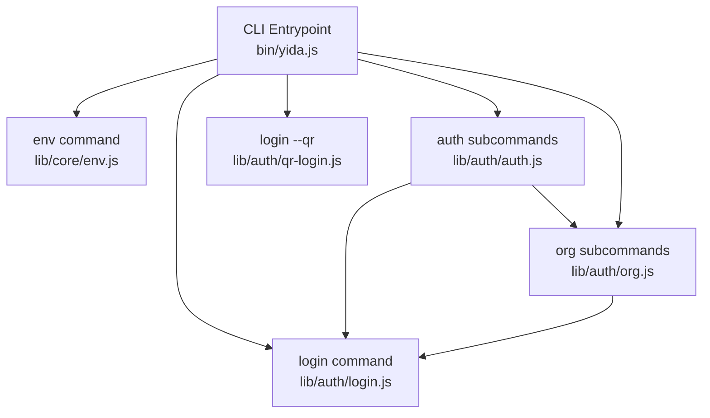
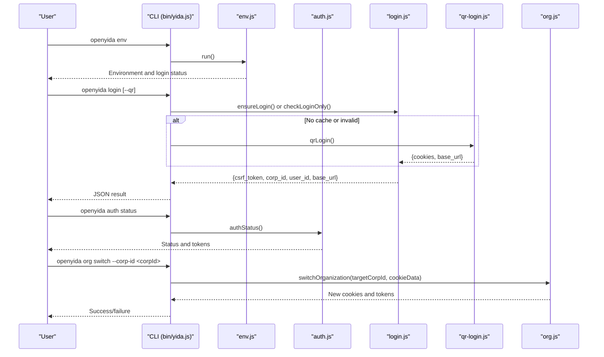
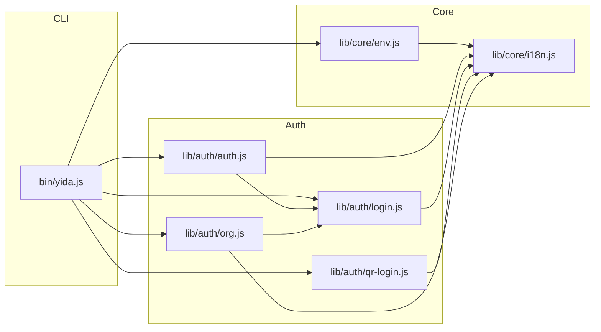
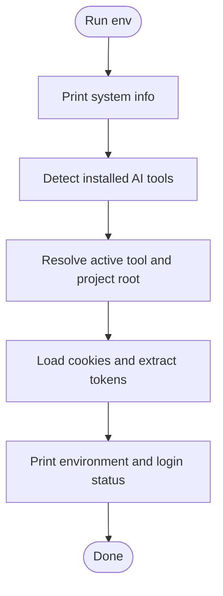
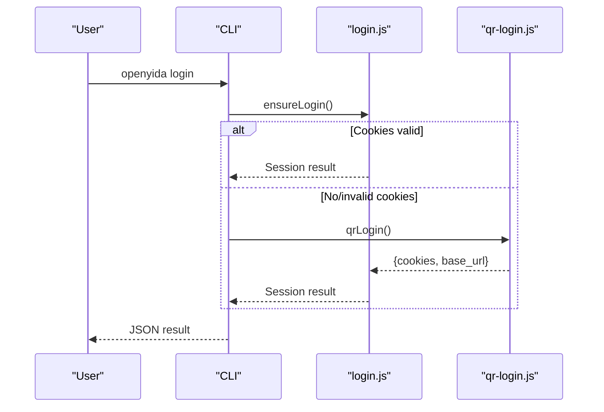
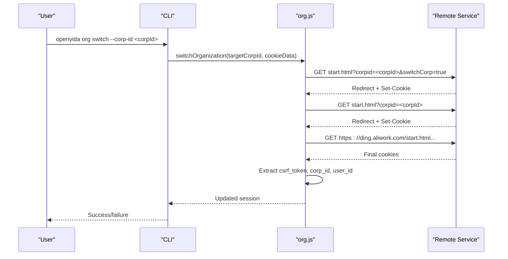
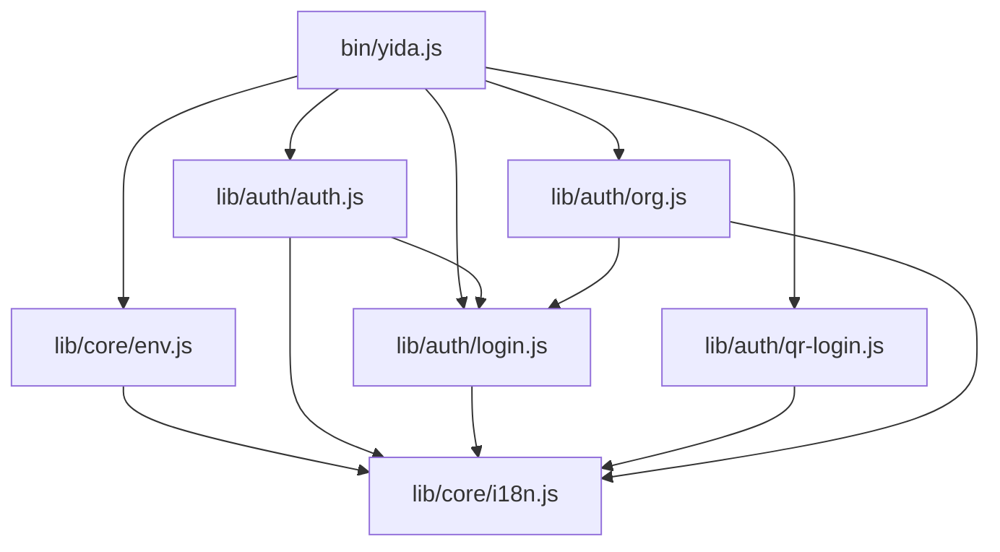

# Environment & Authentication Commands

<cite>
**Referenced Files in This Document**
- [yida.js](file://bin/yida.js)
- [env.js](file://lib/core/env.js)
- [login.js](file://lib/auth/login.js)
- [qr-login.js](file://lib/auth/qr-login.js)
- [auth.js](file://lib/auth/auth.js)
- [org.js](file://lib/auth/org.js)
- [i18n.js](file://lib/core/i18n.js)
- [README.md](file://README.md)
- [SKILL.md](file://yida-skills/SKILL.md)
- [env.test.js](file://tests/env.test.js)
- [auth.test.js](file://tests/auth.test.js)
</cite>

## Table of Contents
1. [Introduction](#introduction)
2. [Project Structure](#project-structure)
3. [Core Components](#core-components)
4. [Architecture Overview](#architecture-overview)
5. [Detailed Component Analysis](#detailed-component-analysis)
6. [Dependency Analysis](#dependency-analysis)
7. [Performance Considerations](#performance-considerations)
8. [Troubleshooting Guide](#troubleshooting-guide)
9. [Conclusion](#conclusion)
10. [Appendices](#appendices)

## Introduction
This document explains the Environment and Authentication command group of OpenYida’s CLI. It covers:
- env: Detect AI tool environment and login status
- login: Interactive login with QR code (--qr), cached login fallback, and check-only mode
- logout: Clear local session cookies
- auth: Subcommands for status, login, refresh, and logout
- org: List and switch organizations without re-login

It describes command syntax, parameters, options, usage examples, expected outputs, authentication flow, session persistence, cookie management, organization switching, troubleshooting, and security considerations.

## Project Structure
The CLI entrypoint routes commands to dedicated modules under lib/auth and lib/core. Authentication relies on local cookie caching (.cache/cookies.json) and optional QR-based login.

**Diagram sources**
- [yida.js:152-241](file://bin/yida.js#L152-L241)
- [env.js:1-171](file://lib/core/env.js#L1-L171)
- [login.js:1-349](file://lib/auth/login.js#L1-L349)
- [qr-login.js:1-617](file://lib/auth/qr-login.js#L1-L617)
- [auth.js:1-239](file://lib/auth/auth.js#L1-L239)
- [org.js:1-364](file://lib/auth/org.js#L1-L364)

**Section sources**
- [yida.js:8-50](file://bin/yida.js#L8-L50)
- [README.md:77-91](file://README.md#L77-L91)

## Core Components
- Environment detector: Detects active AI tool, project root, and login status.
- Login manager: Ensures login via cache or browser-based QR flow; exposes check-only mode.
- QR login: Terminal-based QR scanning with polling and organization selection.
- Auth facade: Provides unified status, login, refresh, and logout with persistent auth metadata.
- Organization manager: Lists and switches organizations using HTTP redirects and cookie updates.

**Section sources**
- [env.js:1-171](file://lib/core/env.js#L1-L171)
- [login.js:1-349](file://lib/auth/login.js#L1-L349)
- [qr-login.js:1-617](file://lib/auth/qr-login.js#L1-L617)
- [auth.js:1-239](file://lib/auth/auth.js#L1-L239)
- [org.js:1-364](file://lib/auth/org.js#L1-L364)

## Architecture Overview
The CLI orchestrates authentication and environment detection. The core flow:
- env prints environment and login status by reading local cookies
- login checks cache; if missing, starts QR login or opens browser for QR
- auth subcommands delegate to login and org modules
- org switches organizations by following redirects and updating cookies

**Diagram sources**
- [yida.js:152-241](file://bin/yida.js#L152-L241)
- [env.js:95-168](file://lib/core/env.js#L95-L168)
- [auth.js:61-127](file://lib/auth/auth.js#L61-L127)
- [login.js:134-155](file://lib/auth/login.js#L134-L155)
- [qr-login.js:499-614](file://lib/auth/qr-login.js#L499-L614)
- [org.js:190-313](file://lib/auth/org.js#L190-L313)

## Detailed Component Analysis

### Command: env
- Purpose: Detect AI tool environment and current login status.
- Syntax: openyida env
- Behavior:
  - Prints system info, detected AI tools, active tool and project root, and login status.
  - Reads cookies from local cache to derive base_url, corp_id, user_id, and csrf_token.
- Output: Human-readable summary with status indicators and token hints.
- Aliases: None
- Default behavior: Uses current working directory or active AI tool workspace root.

Usage example:
- openyida env

Expected output highlights:
- Active AI tool and project root
- Login status: logged-in or not
- Base URL, corp ID, user ID, partial CSRF token

Security considerations:
- Output truncates sensitive tokens; no secrets are printed in plaintext.

**Section sources**
- [yida.js:152-157](file://bin/yida.js#L152-L157)
- [env.js:95-168](file://lib/core/env.js#L95-L168)
- [env.test.js:11-65](file://tests/env.test.js#L11-L65)
- [env.test.js:69-162](file://tests/env.test.js#L69-L162)

### Command: login
- Purpose: Ensure a valid login session. Supports QR-based login and check-only mode.
- Syntax:
  - openyida login
  - openyida login --qr
  - openyida login --check-only
- Options:
  - --qr: Terminal QR login flow
  - --check-only: Only validate existing cache, do not trigger login
- Behavior:
  - Without options: Prefer cached cookies; if valid, return session info; otherwise, start QR login.
  - With --qr: Force terminal QR login via QR code rendering and polling.
  - With --check-only: Return whether cache is valid and usable.
- Output: JSON object containing status, can_auto_use, csrf_token, corp_id, user_id, base_url, cookies (when applicable).

Usage examples:
- openyida login
- openyida login --qr
- openyida login --check-only

Expected outputs:
- Valid session: JSON with session fields and can_auto_use true
- No cache or invalid: JSON indicating not logged in or requires QR login

**Section sources**
- [yida.js:165-179](file://bin/yida.js#L165-L179)
- [login.js:61-93](file://lib/auth/login.js#L61-L93)
- [login.js:134-155](file://lib/auth/login.js#L134-L155)
- [qr-login.js:499-614](file://lib/auth/qr-login.js#L499-L614)

### Command: logout
- Purpose: Clear local session cookies.
- Syntax: openyida logout
- Behavior:
  - Deletes project-scoped cookies.json file.
  - Prints confirmation and guidance.
- Output: Confirmation messages and hints.

Usage example:
- openyida logout

**Section sources**
- [yida.js:181-185](file://bin/yida.js#L181-L185)
- [login.js:320-339](file://lib/auth/login.js#L320-L339)

### Subcommands: auth
- Purpose: Unified authentication management.
- Syntax:
  - openyida auth status
  - openyida auth login
  - openyida auth refresh
  - openyida auth logout
- Behavior:
  - auth status: Print current login status, base_url, corp_id, user_id, csrf_token, and login metadata.
  - auth login: Perform login (QR flow) and persist metadata.
  - auth refresh: Extract csrf_token from cache and update timestamps.
  - auth logout: Clear local auth metadata.
- Output: Human-readable status or JSON results depending on subcommand.

Usage examples:
- openyida auth status
- openyida auth login
- openyida auth refresh
- openyida auth logout

**Section sources**
- [yida.js:187-204](file://bin/yida.js#L187-L204)
- [auth.js:61-127](file://lib/auth/auth.js#L61-L127)
- [auth.js:137-160](file://lib/auth/auth.js#L137-L160)
- [auth.js:168-210](file://lib/auth/auth.js#L168-L210)
- [auth.js:217-229](file://lib/auth/auth.js#L217-L229)

### Subcommands: org
- Purpose: Manage organizations without re-login.
- Syntax:
  - openyida org list
  - openyida org switch --corp-id <corpId>
- Behavior:
  - org list: List current and recent organizations using cached auth metadata.
  - org switch: Switch organization by following redirects and updating cookies; persists new corp_id and tokens.
- Output: Human-readable lists and status messages; returns structured results.

Usage examples:
- openyida org list
- openyida org switch --corp-id <corpId>

Notes:
- If no login cookies are present, commands fail early with guidance to log in.

**Section sources**
- [yida.js:207-241](file://bin/yida.js#L207-L241)
- [org.js:121-180](file://lib/auth/org.js#L121-L180)
- [org.js:190-313](file://lib/auth/org.js#L190-L313)
- [org.js:322-357](file://lib/auth/org.js#L322-L357)

## Architecture Overview
The CLI routes commands to modules that share common utilities for cookie loading, token extraction, and base URL resolution. The auth facade coordinates persistent metadata and refresh logic.

**Diagram sources**
- [yida.js:152-241](file://bin/yida.js#L152-L241)
- [env.js:12-13](file://lib/core/env.js#L12-L13)
- [auth.js:21-23](file://lib/auth/auth.js#L21-L23)
- [login.js:19-20](file://lib/auth/login.js#L19-L20)
- [qr-login.js:22-24](file://lib/auth/qr-login.js#L22-L24)
- [org.js:26-29](file://lib/auth/org.js#L26-L29)

## Detailed Component Analysis

### Environment Detection Flow

**Diagram sources**
- [env.js:95-168](file://lib/core/env.js#L95-L168)

**Section sources**
- [env.js:47-76](file://lib/core/env.js#L47-L76)
- [env.js:80-90](file://lib/core/env.js#L80-L90)
- [env.js:95-168](file://lib/core/env.js#L95-L168)

### Login Flow (Cached vs QR)

**Diagram sources**
- [yida.js:165-179](file://bin/yida.js#L165-L179)
- [login.js:134-155](file://lib/auth/login.js#L134-L155)
- [qr-login.js:499-614](file://lib/auth/qr-login.js#L499-L614)

**Section sources**
- [login.js:134-155](file://lib/auth/login.js#L134-L155)
- [qr-login.js:499-614](file://lib/auth/qr-login.js#L499-L614)

### Organization Switching Mechanism

**Diagram sources**
- [yida.js:226-234](file://bin/yida.js#L226-L234)
- [org.js:190-313](file://lib/auth/org.js#L190-L313)

**Section sources**
- [org.js:190-313](file://lib/auth/org.js#L190-L313)

### Authentication Metadata Persistence
- Auth facade writes a project-scoped auth.json file under .cache/ with loginType, loginTime, corpId, and userId.
- Refresh updates refreshTime and corp/user info.
- Logout clears auth.json.

**Section sources**
- [auth.js:29-53](file://lib/auth/auth.js#L29-L53)
- [auth.js:137-160](file://lib/auth/auth.js#L137-L160)
- [auth.js:168-210](file://lib/auth/auth.js#L168-L210)
- [auth.js:217-229](file://lib/auth/auth.js#L217-L229)

## Dependency Analysis
- CLI depends on:
  - env.js for environment detection
  - auth.js for unified auth operations
  - login.js for cached and browser-based login
  - qr-login.js for terminal QR login
  - org.js for organization management
- All modules depend on i18n.js for localized messages.

**Diagram sources**
- [yida.js:152-241](file://bin/yida.js#L152-L241)
- [env.js:12-13](file://lib/core/env.js#L12-L13)
- [auth.js:21-23](file://lib/auth/auth.js#L21-L23)
- [login.js:19-20](file://lib/auth/login.js#L19-L20)
- [qr-login.js:22-24](file://lib/auth/qr-login.js#L22-L24)
- [org.js:26-29](file://lib/auth/org.js#L26-L29)

**Section sources**
- [yida.js:152-241](file://bin/yida.js#L152-L241)
- [i18n.js:1-174](file://lib/core/i18n.js#L1-L174)

## Performance Considerations
- QR login uses polling with bounded attempts and timeouts; avoid frequent repeated invocations during long sessions.
- Organization switching follows a fixed number of redirects; network latency affects total time.
- Local cookie caching avoids repeated browser launches and network requests for subsequent commands.

## Troubleshooting Guide
Common issues and resolutions:
- Not logged in:
  - Run openyida login to authenticate; if using terminal, pass --qr.
  - Use openyida auth status to confirm.
- Login expired or invalid:
  - Run openyida auth refresh to re-extract csrf_token from cache.
  - If still failing, run openyida logout followed by openyida login.
- Network connectivity problems:
  - QR login and org switch rely on remote endpoints; retry after checking network.
  - Increase timeouts by rerunning the command.
- Session timeout:
  - Re-run login or refresh; ensure cookies.json exists and is readable.
- Organization mismatch:
  - Use openyida org list to see available orgs, then openyida org switch --corp-id <corpId>.
- Command usage errors:
  - Ensure correct subcommand syntax; refer to openyida --help or README.

**Section sources**
- [auth.js:61-127](file://lib/auth/auth.js#L61-L127)
- [auth.js:168-210](file://lib/auth/auth.js#L168-L210)
- [org.js:121-180](file://lib/auth/org.js#L121-L180)
- [org.js:190-313](file://lib/auth/org.js#L190-L313)
- [README.md:77-91](file://README.md#L77-L91)

## Conclusion
OpenYida’s Environment and Authentication commands provide a seamless developer experience:
- env quickly reports environment and login status
- login supports both cached sessions and QR-based flows
- auth and org offer robust session management and organization switching
- Persistent metadata and cookie caching streamline daily workflows

## Appendices

### Command Reference Summary
- openyida env
  - Detect environment and login status
- openyida login
  - Cached login or QR login fallback
  - Options: --qr, --check-only
- openyida logout
  - Clear local cookies
- openyida auth status|login|refresh|logout
  - Unified auth operations with metadata persistence
- openyida org list|switch --corp-id <corpId>
  - List and switch organizations without re-login

**Section sources**
- [yida.js:8-50](file://bin/yida.js#L8-L50)
- [README.md:77-91](file://README.md#L77-L91)

### Security Considerations
- Session persistence:
  - Cookies are stored locally in .cache/cookies.json; protect this file.
  - Auth metadata in .cache/auth.json includes login timestamps and identifiers.
- Token handling:
  - Output truncates sensitive tokens; do not log or pipe raw JSON with secrets.
- Organization switching:
  - Operates via HTTP redirects; ensure trust in base_url and domain.
- Internationalization:
  - Messages are localized; ensure environment variables are set appropriately.

**Section sources**
- [login.js:45-53](file://lib/auth/login.js#L45-L53)
- [auth.js:46-53](file://lib/auth/auth.js#L46-L53)
- [i18n.js:63-88](file://lib/core/i18n.js#L63-L88)

### Integration Notes
- The CLI integrates with AI coding tools by detecting active tool and project roots.
- Skill documentation emphasizes automatic login and cookie-driven operations.

**Section sources**
- [env.js:47-76](file://lib/core/env.js#L47-L76)
- [SKILL.md:33](file://yida-skills/SKILL.md#L33)