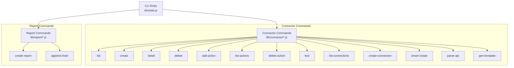
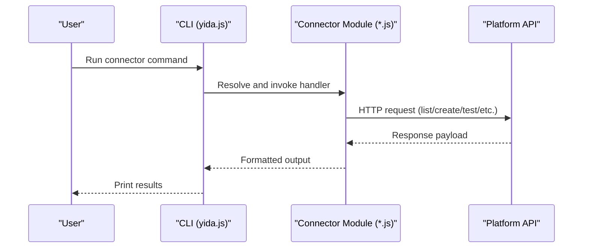
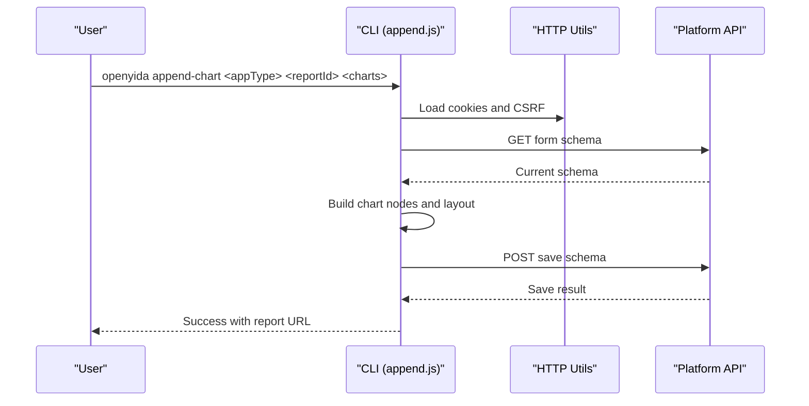
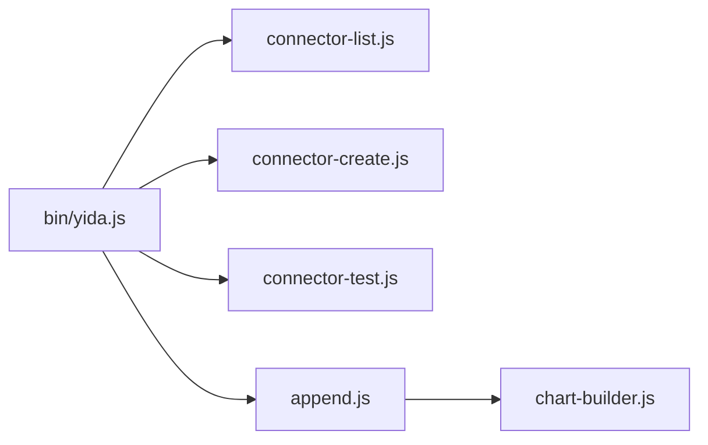
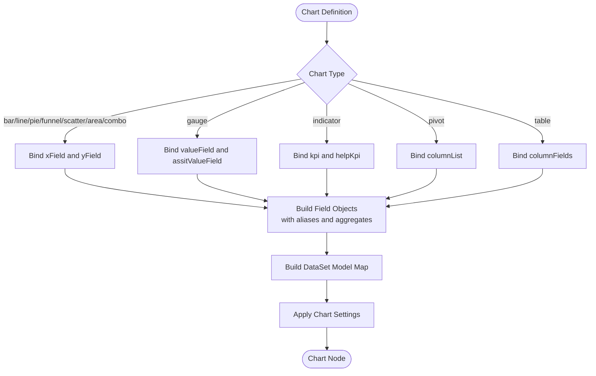

# HTTP Connector & Report Commands

<cite>
**Referenced Files in This Document**
- [yida.js](file://bin/yida.js)
- [connector-list.js](file://lib/connector/connector-list.js)
- [connector-create.js](file://lib/connector/connector-create.js)
- [connector-detail.js](file://lib/connector/connector-detail.js)
- [connector-delete.js](file://lib/connector/connector-delete.js)
- [connector-add-action.js](file://lib/connector/connector-add-action.js)
- [connector-list-actions.js](file://lib/connector/connector-list-actions.js)
- [connector-delete-action.js](file://lib/connector/connector-delete-action.js)
- [connector-test.js](file://lib/connector/connector-test.js)
- [connector-list-connections.js](file://lib/connector/connector-list-connections.js)
- [connector-create-connection.js](file://lib/connector/connector-create-connection.js)
- [connector-smart-create.js](file://lib/connector/connector-smart-create.js)
- [connector-parse-api.js](file://lib/connector/connector-parse-api.js)
- [connector-gen-template.js](file://lib/connector/connector-gen-template.js)
- [append.js](file://lib/report/append.js)
- [chart-builder.js](file://lib/report/chart-builder.js)
- [create-report.js](file://lib/report/create-report.js)
</cite>

## Table of Contents
1. [Introduction](#introduction)
2. [Project Structure](#project-structure)
3. [Core Components](#core-components)
4. [Architecture Overview](#architecture-overview)
5. [Detailed Component Analysis](#detailed-component-analysis)
6. [Dependency Analysis](#dependency-analysis)
7. [Performance Considerations](#performance-considerations)
8. [Troubleshooting Guide](#troubleshooting-guide)
9. [Conclusion](#conclusion)
10. [Appendices](#appendices)

## Introduction
This document explains OpenYida’s HTTP connector command group and report command group. It covers:
- HTTP connector lifecycle: list, create, detail, delete, add-action, list-actions, delete-action, test
- Authentication and connection management: list-connections, create-connection
- Automation helpers: smart-create, parse-api, gen-template
- Report creation and extension: create-report, append-chart
- Practical workflows, API integration patterns, authentication troubleshooting, and report performance tips

## Project Structure
OpenYida exposes CLI commands via a central entry that routes to submodules. The connector and report command groups are implemented under lib/connector and lib/report respectively.

**Diagram sources**
- [yida.js:441-476](file://bin/yida.js#L441-L476)
- [connector-list.js:1-112](file://lib/connector/connector-list.js#L1-L112)
- [connector-create.js:1-328](file://lib/connector/connector-create.js#L1-L328)
- [connector-detail.js:1-90](file://lib/connector/connector-detail.js#L1-L90)
- [connector-delete.js:1-61](file://lib/connector/connector-delete.js#L1-L61)
- [connector-add-action.js:1-215](file://lib/connector/connector-add-action.js#L1-L215)
- [connector-list-actions.js:1-75](file://lib/connector/connector-list-actions.js#L1-L75)
- [connector-delete-action.js:1-120](file://lib/connector/connector-delete-action.js#L1-L120)
- [connector-test.js:1-225](file://lib/connector/connector-test.js#L1-L225)
- [connector-list-connections.js:1-67](file://lib/connector/connector-list-connections.js#L1-L67)
- [connector-create-connection.js:1-174](file://lib/connector/connector-create-connection.js#L1-L174)
- [connector-smart-create.js:1-222](file://lib/connector/connector-smart-create.js#L1-L222)
- [connector-parse-api.js:1-223](file://lib/connector/connector-parse-api.js#L1-L223)
- [connector-gen-template.js:1-174](file://lib/connector/connector-gen-template.js#L1-L174)
- [create-report.js:1-26](file://lib/report/create-report.js#L1-L26)
- [append.js:1-326](file://lib/report/append.js#L1-L326)

**Section sources**
- [yida.js:441-476](file://bin/yida.js#L441-L476)

## Core Components
- Connector command group: Manages HTTP connectors, actions, and authentication accounts.
- Report command group: Creates and extends report dashboards with chart components.

Key responsibilities:
- Connector commands: CRUD connectors, manage actions, test requests, and manage authentication accounts.
- Report commands: Build chart schemas and append charts to existing reports.

**Section sources**
- [connector-list.js:1-112](file://lib/connector/connector-list.js#L1-L112)
- [connector-create.js:1-328](file://lib/connector/connector-create.js#L1-L328)
- [connector-test.js:1-225](file://lib/connector/connector-test.js#L1-L225)
- [append.js:1-326](file://lib/report/append.js#L1-L326)

## Architecture Overview
The CLI routes to submodules. Connector commands integrate with platform APIs to list, create, update, and test connectors and actions. Report commands fetch and modify report schemas to add charts.

**Diagram sources**
- [yida.js:441-476](file://bin/yida.js#L441-L476)
- [connector-test.js:174-181](file://lib/connector/connector-test.js#L174-L181)

## Detailed Component Analysis

### Connector Command Group

#### list
- Purpose: List HTTP connectors with optional filters and pagination.
- Syntax: openyida connector list [--keyword <keyword>] [--type <mine|manager>] [--start-date <YYYY-MM-DD>] [--end-date <YYYY-MM-DD>] [--page-size <n>]
- Options:
  - keyword: Filter by display name substring
  - type: mine or manager
  - start-date / end-date: Creation date range
  - page-size: Items per page
- Output: Tabular list of connectors with ID, display name, connector name, description, creator.

**Section sources**
- [connector-list.js:1-112](file://lib/connector/connector-list.js#L1-L112)

#### create
- Purpose: Create or update an HTTP connector.
- Syntax:
  - Create: openyida connector create "<displayName>" "<baseUrl>" --operations <file.json> [--auth <type>] [--username <u>] [--password 
] [--api-key-label <l>] [--api-key-name <n>] [--api-key-location <header|query>] [--app-key <key>] [--app-secret <secret>] [--desc <desc>] [--icon <icon>]
  - Update: openyida connector create --id <connectorId> [--desc <newDesc>]
- Behavior:
  - Create mode validates operations file and builds security schemes based on auth type.
  - Update mode reads existing connector and updates description while preserving operations and other metadata.
- Notes:
  - Operations file must define at least one action.
  - Supported auth types include NONE, BASIC, API_KEY, DINGTALK, ALIYUN, DINGTRUST.

**Section sources**
- [connector-create.js:1-328](file://lib/connector/connector-create.js#L1-L328)

#### detail
- Purpose: Show connector details including basic info and all actions.
- Syntax: openyida connector detail <connectorId>
- Output: Displays display name, connector name, description, host, base path, scheme, and security scheme, followed by a list of actions with summary, method, path, and input parameters.

**Section sources**
- [connector-detail.js:1-90](file://lib/connector/connector-detail.js#L1-L90)

#### delete
- Purpose: Delete a connector.
- Syntax: openyida connector delete <connectorId> [--force]
- Notes:
  - The CLI warns that deletion is not supported via API and directs users to the platform management UI.

**Section sources**
- [connector-delete.js:1-61](file://lib/connector/connector-delete.js#L1-L61)

#### add-action
- Purpose: Add new actions to an existing connector.
- Syntax: openyida connector add-action --operations <file.json> [--connector-id <id>] [--host <host>] [--confirm]
- Behavior:
  - Loads action definitions from file (supports single object or array).
  - If connector-id is not provided, lists matching connectors by host and asks to choose.
  - Merges new actions, overwriting duplicates by operationId.
- Output: Shows merged action list and updated action count.

**Section sources**
- [connector-add-action.js:1-215](file://lib/connector/connector-add-action.js#L1-L215)

#### list-actions
- Purpose: List actions of a connector.
- Syntax: openyida connector list-actions <connectorId>
- Output: Tabular list of actions with ID, name, method, path, and truncated description.

**Section sources**
- [connector-list-actions.js:1-75](file://lib/connector/connector-list-actions.js#L1-L75)

#### delete-action
- Purpose: Remove a single action from a connector.
- Syntax: openyida connector delete-action <connectorId> <operationId> [--force]
- Behavior:
  - Finds the action by operationId and removes it from the operations array.
  - Updates connector description and saves the connector.

**Section sources**
- [connector-delete-action.js:1-120](file://lib/connector/connector-delete-action.js#L1-L120)

#### test
- Purpose: Test a connector action end-to-end.
- Syntax: openyida connector test --connector-id <id> --action <actionId> [--params <json>] [--account-id <id>]
- Behavior:
  - Resolves action from connector detail.
  - Builds default request parameters from action definition and optional user params.
  - Optionally lists available authentication accounts if required.
  - Sends test request and prints status, headers, body, and execution time.
- Output: Success or error with response details.

**Section sources**
- [connector-test.js:1-225](file://lib/connector/connector-test.js#L1-L225)

#### list-connections
- Purpose: List authentication accounts for a connector.
- Syntax: openyida connector list-connections <connectorId>
- Output: Tabular list of accounts with ID, name, status, and creation time.

**Section sources**
- [connector-list-connections.js:1-67](file://lib/connector/connector-list-connections.js#L1-L67)

#### create-connection
- Purpose: Create an authentication account for a connector.
- Syntax: openyida connector create-connection <connectorId> <connectionName> [--username <u>] [--password 
] [--api-key <key>] [--app-key <key>] [--app-secret <secret>] [--app-code <code>]
- Behavior:
  - Determines auth type from connector’s security schemes.
  - Validates required credentials for the selected auth type.
  - Calls platform API to create the connection.

**Section sources**
- [connector-create-connection.js:1-174](file://lib/connector/connector-create-connection.js#L1-L174)

#### smart-create
- Purpose: End-to-end wizard to create or extend a connector from a curl command.
- Syntax: openyida connector smart-create --curl "<curl>" [--name <displayName>] [--desc <desc>]
- Phases:
  1. Parse curl and detect auth type.
  2. Match existing connectors by host and auth type.
  3. Generate action configuration and connector description.
  4. Output suggested commands to add to existing connector or create a new one, plus test suggestions.
- Output: Temporary operation file and step-by-step guidance.

**Section sources**
- [connector-smart-create.js:1-222](file://lib/connector/connector-smart-create.js#L1-L222)

#### parse-api
- Purpose: Parse API information from curl or Markdown documents and optionally output operation configuration.
- Syntax: openyida connector parse-api [--curl "<curl>"] [--doc <path>] [--output <path>] [--format <json|table>]
- Output:
  - Table report with server info, auth info, headers, and response schema hints.
  - Optional JSON report and saved operation file.

**Section sources**
- [connector-parse-api.js:1-223](file://lib/connector/connector-parse-api.js#L1-L223)

#### gen-template
- Purpose: Generate a Markdown template for documenting APIs to feed into automation.
- Syntax: openyida connector gen-template [<outputPath>]
- Output: Writes a structured template to disk for filling out server info, auth, actions, and examples.

**Section sources**
- [connector-gen-template.js:1-174](file://lib/connector/connector-gen-template.js#L1-L174)

### Report Command Group

#### create-report
- Purpose: Create a new report with initial charts.
- Syntax: openyida create-report <appType> "<reportName>" <chartsDefinition>
- Implementation:
  - Delegates to lib/report/index.js for the main workflow.
  - Uses chart-builder utilities to construct datasets, fields, and settings.

**Section sources**
- [create-report.js:1-26](file://lib/report/create-report.js#L1-L26)

#### append-chart
- Purpose: Append one or more charts to an existing report.
- Syntax: openyida append-chart <appType> <reportId> <chartsDefinition>
- Workflow:
  1. Parse arguments and read charts definition (JSON or file).
  2. Load login cookies and CSRF token.
  3. Fetch current report schema from platform.
  4. Compute layout positions and append chart nodes.
  5. Save schema back to platform.
- Chart building:
  - Uses lib/report/chart-builder to generate dataset models, field definitions, user configs, and settings per chart type.

**Diagram sources**
- [append.js:42-68](file://lib/report/append.js#L42-L68)
- [append.js:200-203](file://lib/report/append.js#L200-L203)
- [append.js:289-292](file://lib/report/append.js#L289-L292)

**Section sources**
- [append.js:1-326](file://lib/report/append.js#L1-L326)

## Dependency Analysis
- CLI routing: bin/yida.js maps connector and report subcommands to their handlers.
- Connector commands depend on shared API utilities for authentication, listing, fetching, saving, and testing.
- Report commands depend on HTTP utilities and chart builder to manipulate report schemas.

**Diagram sources**
- [yida.js:441-476](file://bin/yida.js#L441-L476)
- [append.js:36-37](file://lib/report/append.js#L36-L37)

**Section sources**
- [yida.js:441-476](file://bin/yida.js#L441-L476)
- [append.js:36-37](file://lib/report/append.js#L36-L37)

## Performance Considerations
- Batch operations: Prefer merging actions in a single add-action run to minimize save operations.
- Pagination: Use page-size and date filters in list to reduce payload sizes.
- Report layout: When appending charts, compute positions efficiently to avoid excessive reflows.
- Authentication caching: Reuse authentication accounts and avoid frequent re-creation.

## Troubleshooting Guide
- Authentication failures during test:
  - Ensure the connector requires an account and specify --account-id.
  - Verify account credentials match the connector’s auth type.
- Missing actions:
  - Use list-actions to confirm action IDs.
  - Use add-action with --confirm to merge new actions.
- Deleting actions:
  - Use delete-action with --force to remove a single action; remember it updates the whole operations array.
- Deleting connectors:
  - The CLI warns deletion is not supported via API; use the platform UI.
- Report save errors:
  - Confirm login cookies and CSRF token are present.
  - Validate charts definition format and chart types.

**Section sources**
- [connector-test.js:151-160](file://lib/connector/connector-test.js#L151-L160)
- [connector-delete-action.js:84-89](file://lib/connector/connector-delete-action.js#L84-L89)
- [connector-delete.js:53-58](file://lib/connector/connector-delete.js#L53-L58)
- [append.js:176-182](file://lib/report/append.js#L176-L182)

## Conclusion
OpenYida’s connector and report command groups provide a complete toolkit for integrating external APIs and building dynamic dashboards. By leveraging automation helpers like smart-create and parse-api, teams can rapidly onboard new endpoints. Report commands streamline dashboard composition and extension, enabling fast iteration on data visualization.

## Appendices

### Connector Authentication Types
- NONE: No authentication
- BASIC: Username/password
- API_KEY: Token via header or query
- DINGTALK: App Key and App Secret
- ALIYUN: AppCode
- DINGTRUST: App Key and App Secret

**Section sources**
- [connector-create.js:65-72](file://lib/connector/connector-create.js#L65-L72)
- [connector-create-connection.js:48-92](file://lib/connector/connector-create-connection.js#L48-L92)

### Report Chart Types and Data Binding Patterns
Supported chart types include bar, line, pie, funnel, scatter, area, combo, gauge, indicator, pivot, and table. Each type binds fields differently:
- Dimensions (x) vs Measures (y, leftY/rightY)
- Aggregation modes (COUNT, SUM, AVG, MAX, MIN, COUNT_DISTINCT)
- Date fields receive time granularity and format settings
- Indicator and pivot have specialized field sets

**Diagram sources**
- [chart-builder.js:116-186](file://lib/report/chart-builder.js#L116-L186)
- [chart-builder.js:191-515](file://lib/report/chart-builder.js#L191-L515)

**Section sources**
- [chart-builder.js:116-186](file://lib/report/chart-builder.js#L116-L186)
- [chart-builder.js:191-515](file://lib/report/chart-builder.js#L191-L515)

### Practical Workflows

- New API onboarding:
  - Use parse-api to analyze curl or docs.
  - Generate operation config and run smart-create to either add to an existing connector or create a new one.
  - Create an authentication account if required and test the action.
- Dashboard composition:
  - Define charts in JSON (or file) with cubeCode, fields, and roles.
  - Use create-report for initial creation or append-chart to add to an existing report.
  - Customize settings and styles via chart-builder defaults.

**Section sources**
- [connector-parse-api.js:166-220](file://lib/connector/connector-parse-api.js#L166-L220)
- [connector-smart-create.js:206-221](file://lib/connector/connector-smart-create.js#L206-L221)
- [append.js:165-326](file://lib/report/append.js#L165-L326)