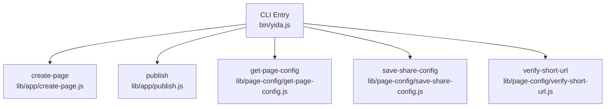
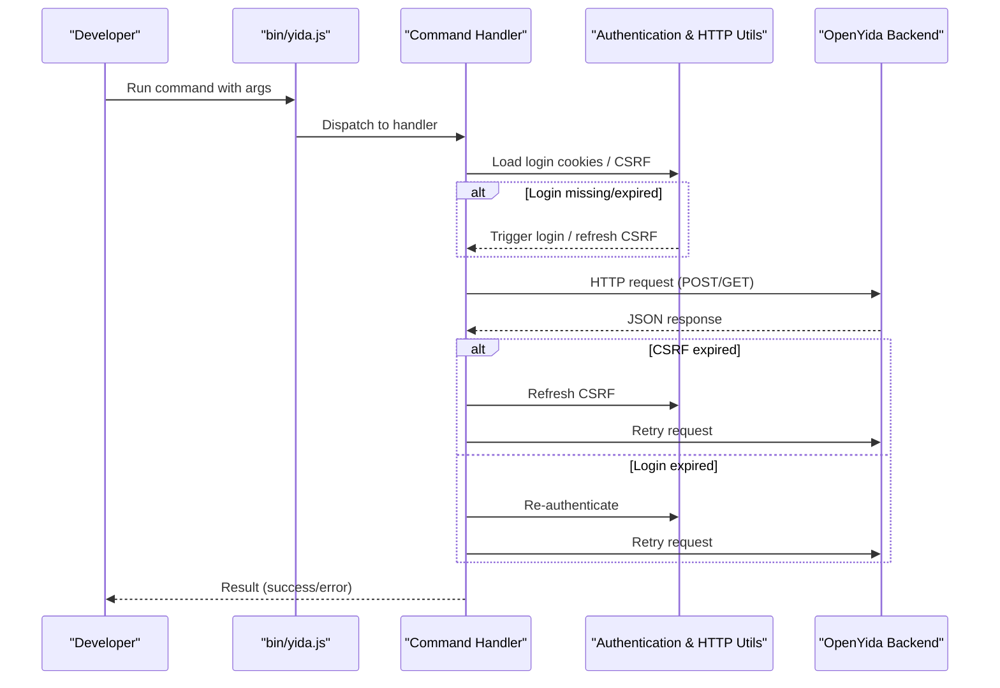
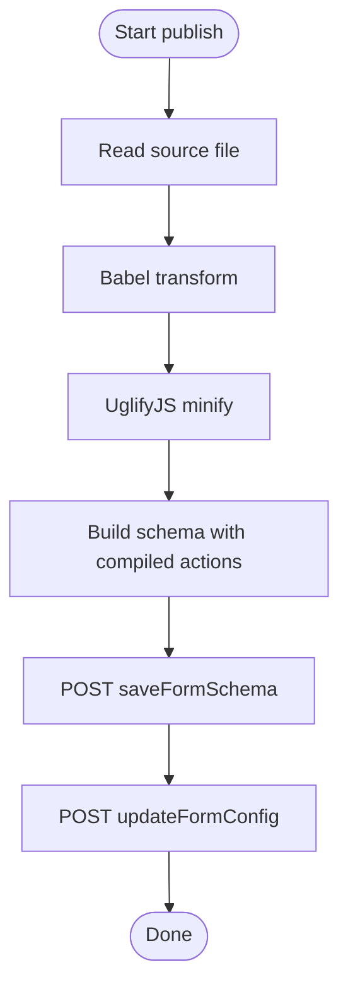
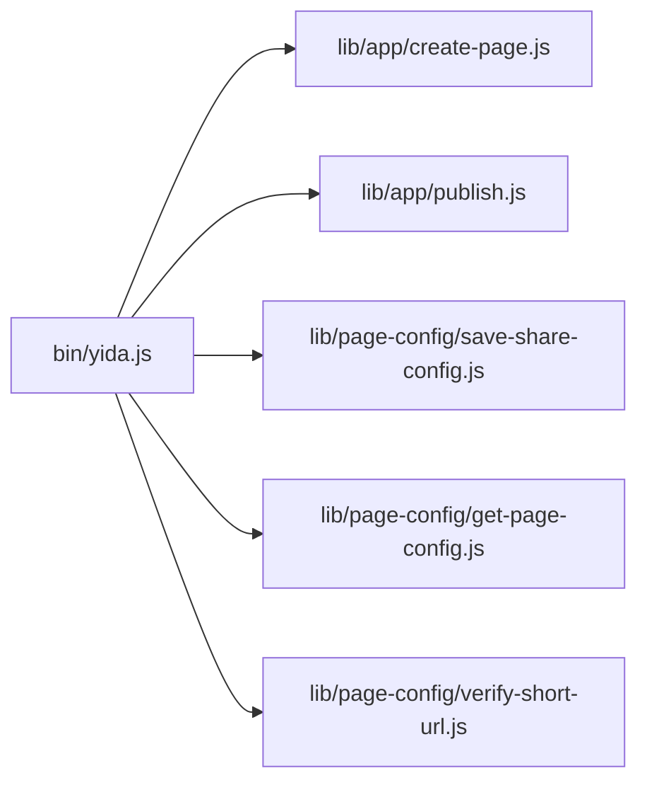

# Page Configuration & Sharing Commands

<cite>
**Referenced Files in This Document**
- [bin/yida.js](file://bin/yida.js)
- [lib/app/create-page.js](file://lib/app/create-page.js)
- [lib/app/publish.js](file://lib/app/publish.js)
- [lib/page-config/get-page-config.js](file://lib/page-config/get-page-config.js)
- [lib/page-config/save-share-config.js](file://lib/page-config/save-share-config.js)
- [lib/page-config/verify-short-url.js](file://lib/page-config/verify-short-url.js)
</cite>

## Table of Contents
1. [Introduction](#introduction)
2. [Project Structure](#project-structure)
3. [Core Components](#core-components)
4. [Architecture Overview](#architecture-overview)
5. [Detailed Component Analysis](#detailed-component-analysis)
6. [Dependency Analysis](#dependency-analysis)
7. [Performance Considerations](#performance-considerations)
8. [Troubleshooting Guide](#troubleshooting-guide)
9. [Conclusion](#conclusion)
10. [Appendices](#appendices)

## Introduction
This document explains the page configuration and sharing command group for OpenYida. It covers:
- Creating custom pages with create-page
- Compiling and publishing pages with publish
- Managing page sharing via save-share-config, get-page-config, and verify-short-url
It also documents the page development lifecycle, deployment workflows, access control options, and troubleshooting guidance.

## Project Structure
The CLI entry point routes commands to dedicated modules. The page configuration and sharing commands live under lib/page-config, while page creation and publishing live under lib/app.



**Diagram sources**
- [bin/yida.js:249-313](file://bin/yida.js#L249-L313)
- [lib/app/create-page.js:1-139](file://lib/app/create-page.js#L1-L139)
- [lib/app/publish.js:1-630](file://lib/app/publish.js#L1-L630)
- [lib/page-config/get-page-config.js:1-103](file://lib/page-config/get-page-config.js#L1-L103)
- [lib/page-config/save-share-config.js:1-255](file://lib/page-config/save-share-config.js#L1-L255)
- [lib/page-config/verify-short-url.js:1-275](file://lib/page-config/verify-short-url.js#L1-L275)

**Section sources**
- [bin/yida.js:249-313](file://bin/yida.js#L249-L313)

## Core Components
- create-page: Creates a custom page and optionally injects data sources after creation.
- publish: Compiles source JS, builds a schema, publishes it, and updates form configuration.
- save-share-config: Saves public access/share configuration for a page, validating URL format and CSRF/login state.
- get-page-config: Queries existing public access/share configuration for a page.
- verify-short-url: Validates whether a given short URL is available for open or share usage.

**Section sources**
- [lib/app/create-page.js:24-139](file://lib/app/create-page.js#L24-L139)
- [lib/app/publish.js:37-624](file://lib/app/publish.js#L37-L624)
- [lib/page-config/save-share-config.js:17-249](file://lib/page-config/save-share-config.js#L17-L249)
- [lib/page-config/get-page-config.js:19-97](file://lib/page-config/get-page-config.js#L19-L97)
- [lib/page-config/verify-short-url.js:33-269](file://lib/page-config/verify-short-url.js#L33-L269)

## Architecture Overview
The CLI routes commands to their handlers. Handlers manage authentication, request retries on token expiration, and interact with backend APIs to create, publish, and configure pages.



**Diagram sources**
- [bin/yida.js:152-512](file://bin/yida.js#L152-L512)
- [lib/page-config/save-share-config.js:127-249](file://lib/page-config/save-share-config.js#L127-L249)
- [lib/page-config/verify-short-url.js:150-269](file://lib/page-config/verify-short-url.js#L150-L269)
- [lib/app/publish.js:509-624](file://lib/app/publish.js#L509-L624)

## Detailed Component Analysis

### Command: create-page
Purpose: Create a new custom page and optionally inject data sources.

Syntax
- yida create-page <appType> "<pageName>" [--datasource <jsonOrFile>]

Parameters
- appType: Application identifier (required)
- pageName: Human-readable page name (required)
- --datasource: Optional JSON string or file path defining connectors to inject

Behavior
- Reads login cookies; triggers login if missing
- Calls backend to create a display form schema
- Optionally injects data sources by saving a schema with dataSourceList
- Outputs pageId, URL, and success metadata

Deployment workflow
- After creation, use publish to compile and deploy custom JavaScript assets

Practical example
- Create a page named “Demo Dashboard” under APP_EXAMPLE
- Optionally attach a connector data source via --datasource

Common pitfalls
- Missing login cache requires manual login
- Incorrect datasource JSON format prevents schema save

**Section sources**
- [bin/yida.js:20](file://bin/yida.js#L20)
- [lib/app/create-page.js:24-139](file://lib/app/create-page.js#L24-L139)

### Command: publish
Purpose: Compile source JavaScript, build a schema, publish it, and update form configuration.

Syntax
- yida publish <sourceFile> <appType> <formUuid>

Parameters
- sourceFile: Path to the source JS file (required)
- appType: Application identifier (required)
- formUuid: Form UUID of the page (required)

Processing logic
- Read and compile source with Babel transform
- Minify with UglifyJS
- Build schema with actions.module set to compiled code
- Save schema via backend API
- Update form configuration to mark as published

Deployment workflow
- Place source under project/pages/src
- Run publish with correct appType and formUuid
- Verify in workbench



**Diagram sources**
- [lib/app/publish.js:59-358](file://lib/app/publish.js#L59-L358)
- [lib/app/publish.js:363-505](file://lib/app/publish.js#L363-L505)

**Section sources**
- [bin/yida.js:24](file://bin/yida.js#L24)
- [lib/app/publish.js:37-624](file://lib/app/publish.js#L37-L624)

### Command: save-share-config
Purpose: Save public access/share configuration for a page.

Syntax
- yida save-share-config <appType> <formUuid> <url> <isOpen> [openAuth]

Parameters
- appType: Application identifier (required)
- formUuid: Form UUID (required)
- url: Short URL path (/o/... for public, /s/... for share)
- isOpen: 'y' to enable public access, 'n' otherwise
- openAuth: 'y' to require authentication for public access, 'n' otherwise

Validation rules
- isOpen must be 'y' or 'n'
- openAuth must be 'y' or 'n'
- If isOpen='y', url must be present and match /o/... pattern
- If isOpen='n', url may be omitted
- URL path part supports alphanumeric, hyphen, underscore only

Behavior
- Validates parameters
- Loads cookies, resolves base URL
- Sends POST to save share config; handles CSRF/token expiration by retry
- Returns structured result with success flag and messages

Access control options
- isOpen='y' enables public URL
- openAuth='y' requires authentication for public access
- For share URLs (/s/...), openAuth is not applicable

**Section sources**
- [bin/yida.js:26](file://bin/yida.js#L26)
- [lib/page-config/save-share-config.js:17-249](file://lib/page-config/save-share-config.js#L17-L249)

### Command: get-page-config
Purpose: Query current public access/share configuration for a page.

Syntax
- yida get-page-config <appType> <formUuid>

Parameters
- appType: Application identifier (required)
- formUuid: Form UUID (required)

Behavior
- Loads cookies and base URL
- Calls backend to fetch share config
- Prints open/share URLs if configured
- Returns JSON with isOpen, openUrl, shareUrl

**Section sources**
- [bin/yida.js:27](file://bin/yida.js#L27)
- [lib/page-config/get-page-config.js:19-97](file://lib/page-config/get-page-config.js#L19-L97)

### Command: verify-short-url
Purpose: Verify availability of a short URL for open or share access.

Syntax
- yida verify-short-url <appType> <formUuid> <url>

Parameters
- appType: Application identifier (required)
- formUuid: Form UUID (required)
- url: Short URL path (/o/... or /s/...)

Validation rules
- URL must start with '/o/' (public) or '/s/' (share)
- Path part must be non-empty and contain only alphanumeric, hyphen, underscore

Behavior
- Validates URL format
- Loads cookies and base URL
- Sends GET to verifyShortUrl endpoint
- Handles CSRF/token expiration by retry
- Returns availability and metadata

URL verification mechanisms
- Public URLs (/o/...) and share URLs (/s/...) are supported
- The backend checks uniqueness and ownership constraints

**Section sources**
- [bin/yida.js:25](file://bin/yida.js#L25)
- [lib/page-config/verify-short-url.js:33-269](file://lib/page-config/verify-short-url.js#L33-L269)

## Architecture Overview
The page development lifecycle spans creation, compilation, publishing, and sharing configuration.

```mermaid
sequenceDiagram
participant Dev as "Developer"
participant CLI as "bin/yida.js"
participant Create as "create-page"
participant Publish as "publish"
participant Share as "save-share-config / verify-short-url / get-page-config"
participant BE as "Backend APIs"
Dev->>CLI : create-page APP_TYPE "Page Name"
CLI->>Create : run(args)
Create->>BE : Create form schema
BE-->>Create : formUuid
Create-->>Dev : pageId, URL
Dev->>CLI : publish SRC_FILE APP_TYPE FORM_UUID
CLI->>Publish : compile + build schema + publish
Publish->>BE : saveFormSchema
Publish->>BE : updateFormConfig
BE-->>Publish : success/version
Publish-->>Dev : success
Dev->>CLI : verify-short-url APP_TYPE FORM_UUID "/o/path"
CLI->>Share : verify
Share->>BE : verifyShortUrl
BE-->>Share : available/taken
Share-->>Dev : result
Dev->>CLI : save-share-config APP_TYPE FORM_UUID "/o/path" y [n]
CLI->>Share : save
Share->>BE : saveShareConfig
BE-->>Share : success
Share-->>Dev : result
```

**Diagram sources**
- [bin/yida.js:20](file://bin/yida.js#L20)
- [bin/yida.js:24](file://bin/yida.js#L24)
- [bin/yida.js:25](file://bin/yida.js#L25)
- [bin/yida.js:26](file://bin/yida.js#L26)
- [lib/app/create-page.js:24-139](file://lib/app/create-page.js#L24-L139)
- [lib/app/publish.js:509-624](file://lib/app/publish.js#L509-L624)
- [lib/page-config/verify-short-url.js:150-269](file://lib/page-config/verify-short-url.js#L150-L269)
- [lib/page-config/save-share-config.js:127-249](file://lib/page-config/save-share-config.js#L127-L249)

## Detailed Component Analysis

### create-page
- Reads appType and pageName from arguments
- Ensures login state; triggers login if needed
- Calls backend to create a display form schema
- Optionally parses --datasource and injects data sources by saving a schema with dataSourceList
- Outputs pageId, URL, and success metadata

**Section sources**
- [lib/app/create-page.js:24-139](file://lib/app/create-page.js#L24-L139)

### publish
- Validates source file existence
- Compiles with Babel, minifies with UglifyJS
- Builds schema with actions.module set to compiled code
- Publishes schema and updates form configuration
- Handles CSRF token and login expiration with automatic retries

**Section sources**
- [lib/app/publish.js:37-624](file://lib/app/publish.js#L37-L624)

### save-share-config
- Parses and validates parameters
- Determines whether URL is open (/o/) or share (/s/)
- Sends POST to save share configuration
- Handles CSRF/token expiration by refreshing tokens and retrying

**Section sources**
- [lib/page-config/save-share-config.js:17-249](file://lib/page-config/save-share-config.js#L17-L249)

### get-page-config
- Fetches current share configuration
- Returns isOpen, openUrl, shareUrl
- Prints human-readable URLs and JSON output

**Section sources**
- [lib/page-config/get-page-config.js:19-97](file://lib/page-config/get-page-config.js#L19-L97)

### verify-short-url
- Validates URL format and path characters
- Calls backend to verify availability
- Handles CSRF/token expiration by retry

**Section sources**
- [lib/page-config/verify-short-url.js:33-269](file://lib/page-config/verify-short-url.js#L33-L269)

## Dependency Analysis
- CLI dispatch in bin/yida.js routes to each handler module
- Handlers depend on shared authentication utilities and HTTP helpers
- Handlers communicate with backend endpoints for creation, publishing, and configuration



**Diagram sources**
- [bin/yida.js:249-313](file://bin/yida.js#L249-L313)

**Section sources**
- [bin/yida.js:249-313](file://bin/yida.js#L249-L313)

## Performance Considerations
- Compilation: Babel transform and UglifyJS minification add CPU overhead; keep source concise and avoid unsupported syntax
- Network requests: Automatic retries on CSRF/login expiration add latency; ensure stable connectivity
- Asset handling: Compiled files are written to pages/dist; ensure consistent naming and avoid collisions

## Troubleshooting Guide
Common issues and resolutions
- Login or CSRF expired during save/share/verify/publish:
  - Handlers automatically refresh tokens and retry
  - If persistent, re-run login and retry the operation
- Invalid URL format for save-share-config or verify-short-url:
  - Ensure URL starts with /o/ or /s/ and path contains only alphanumeric, hyphen, underscore
- Source file not found for publish:
  - Verify absolute or relative path exists and is readable
- Compilation errors:
  - Review hints printed after Babel/UglifyJS failures; align with ES2015-compatible syntax and avoid unsupported features
- Unknown backend errors:
  - Check response details printed alongside failures; confirm appType and formUuid correctness

**Section sources**
- [lib/page-config/save-share-config.js:127-249](file://lib/page-config/save-share-config.js#L127-L249)
- [lib/page-config/verify-short-url.js:150-269](file://lib/page-config/verify-short-url.js#L150-L269)
- [lib/app/publish.js:509-624](file://lib/app/publish.js#L509-L624)

## Conclusion
The page configuration and sharing command group provides a complete workflow from page creation to publishing and sharing. By leveraging create-page, publish, and the sharing commands, developers can efficiently manage custom pages, enforce access controls, and troubleshoot common deployment issues.

## Appendices

### Practical Workflows

- Create a page and publish it
  - Create page: yida create-page APP_EXAMPLE "My Dashboard"
  - Publish: yida publish pages/src/my-dashboard.js APP_EXAMPLE FORM-XXXX
  - Verify in workbench using the returned URL

- Enable public access with optional authentication
  - Verify URL: yida verify-short-url APP_EXAMPLE FORM-XXXX /o/dashboard
  - Save config: yida save-share-config APP_EXAMPLE FORM-XXXX /o/dashboard y n
  - Retrieve config: yida get-page-config APP_EXAMPLE FORM-XXXX

- Share internally via organization link
  - Verify URL: yida verify-short-url APP_EXAMPLE FORM-XXXX /s/internal
  - Save config: yida save-share-config APP_EXAMPLE FORM-XXXX /s/internal n
  - Retrieve config: yida get-page-config APP_EXAMPLE FORM-XXXX

### Access Control Summary
- isOpen='y' enables public URL
- openAuth='y' requires authentication for public access
- isOpen='n' disables public URL; share URL (/s/...) remains usable within organization