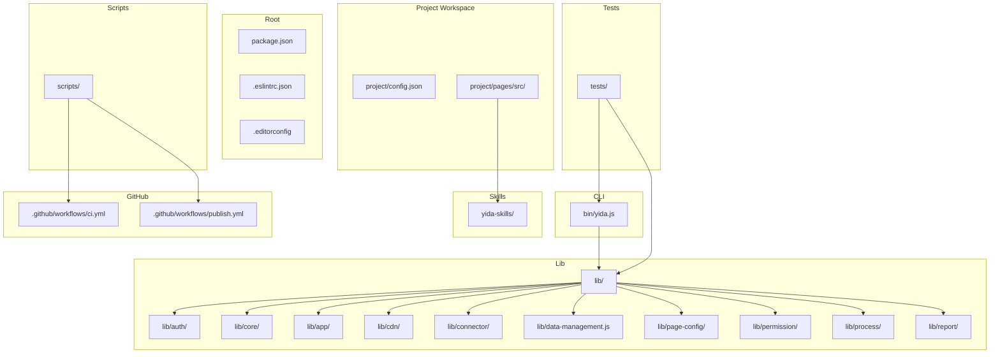
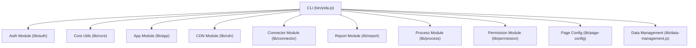
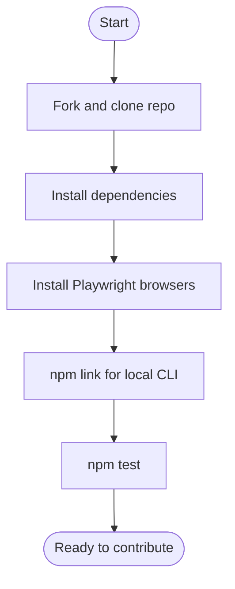
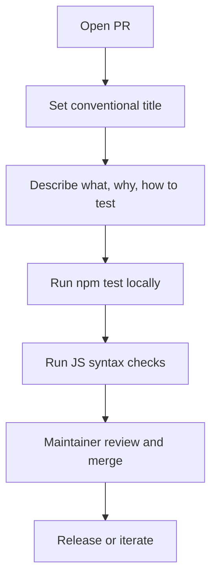
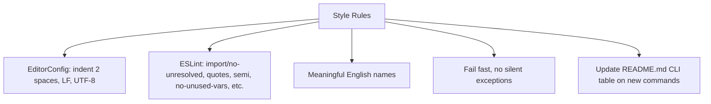
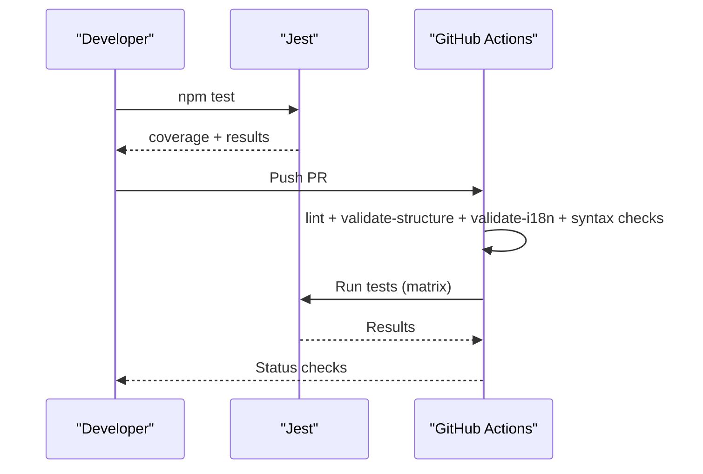
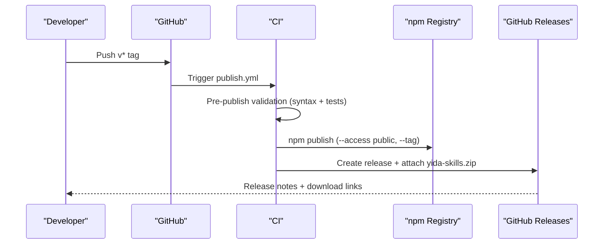
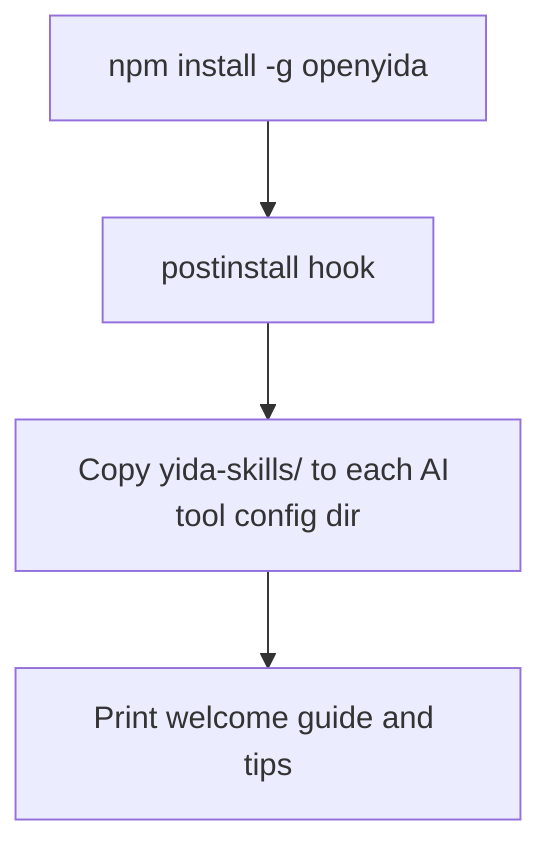
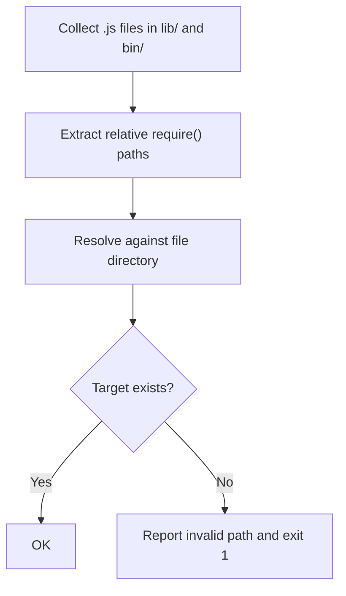
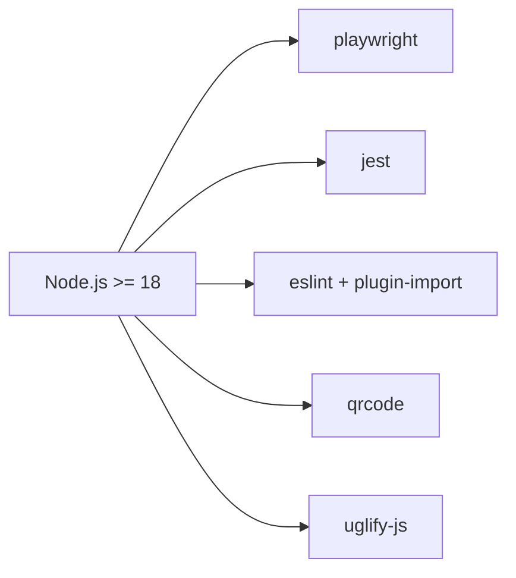

# Contributing & Development

<cite>
**Referenced Files in This Document**
- [CONTRIBUTING.md](file://CONTRIBUTING.md)
- [README.md](file://README.md)
- [SECURITY.md](file://SECURITY.md)
- [.github/PULL_REQUEST_TEMPLATE.md](file://.github/PULL_REQUEST_TEMPLATE.md)
- [.github/workflows/ci.yml](file://.github/workflows/ci.yml)
- [.github/workflows/publish.yml](file://.github/workflows/publish.yml)
- [package.json](file://package.json)
- [.eslintrc.json](file://.eslintrc.json)
- [.editorconfig](file://.editorconfig)
- [scripts/postinstall.js](file://scripts/postinstall.js)
- [scripts/validate-ci.sh](file://scripts/validate-ci.sh)
- [scripts/validate-deps.js](file://scripts/validate-deps.js)
</cite>

## Table of Contents
1. [Introduction](#introduction)
2. [Project Structure](#project-structure)
3. [Core Components](#core-components)
4. [Architecture Overview](#architecture-overview)
5. [Detailed Component Analysis](#detailed-component-analysis)
6. [Dependency Analysis](#dependency-analysis)
7. [Performance Considerations](#performance-considerations)
8. [Troubleshooting Guide](#troubleshooting-guide)
9. [Conclusion](#conclusion)
10. [Appendices](#appendices)

## Introduction
This document explains how to contribute to OpenYida, covering development setup, local environment configuration, contribution guidelines, code standards, testing procedures, pull request workflow, and release processes. It also describes the project’s architecture, governance, and integration with GitHub workflows and community tools.

## Project Structure
OpenYida is a Node.js CLI tool distributed via npm. The repository is organized into:
- CLI entry and commands under bin/
- Implementation modules under lib/
- User workspace templates under project/
- AI skill pack under yida-skills/
- Tests under tests/
- Scripts for validation and automation under scripts/
- GitHub workflows under .github/workflows/

**Diagram sources**
- [package.json:1-74](file://package.json#L1-L74)
- [bin/yida.js](file://bin/yida.js)
- [lib/](file://lib/)
- [project/](file://project/)
- [yida-skills/](file://yida-skills/)
- [tests/](file://tests/)
- [scripts/](file://scripts/)
- [.github/workflows/ci.yml:1-83](file://.github/workflows/ci.yml#L1-L83)
- [.github/workflows/publish.yml:1-100](file://.github/workflows/publish.yml#L1-L100)

**Section sources**
- [CONTRIBUTING.md:83-100](file://CONTRIBUTING.md#L83-L100)
- [package.json:1-74](file://package.json#L1-L74)

## Core Components
- CLI entry and command routing: bin/yida.js
- Command implementations: lib/ submodules (e.g., auth, core, app, cdn, connector, data-management.js, page-config, permission, process, report)
- User workspace templates: project/config.json and project/pages/src/
- AI skill pack: yida-skills/ for integration with Claude Code, Cursor, Aone Copilot, OpenCode, Qoder, and Wukong
- Tests: tests/ with Jest configuration in package.json
- Validation and automation scripts: scripts/ including postinstall, validate-structure, validate-i18n, validate-deps, and CI validation helpers

Key responsibilities:
- bin/yida.js: CLI entrypoint and command routing
- lib/auth/: authentication and organization switching
- lib/core/: shared utilities and core logic
- lib/app/, lib/cdn/, lib/connector/, lib/report/, lib/process/, lib/permission/, lib/page-config/: domain-specific command implementations
- project/: user workspace scaffolding
- yida-skills/: AI-assisted skill pack consumed by IDE integrations
- scripts/: CI validations, postinstall setup, and maintenance tasks

**Section sources**
- [CONTRIBUTING.md:83-100](file://CONTRIBUTING.md#L83-L100)
- [package.json:1-74](file://package.json#L1-L74)

## Architecture Overview
OpenYida follows a modular CLI architecture:
- CLI entry delegates to command modules in lib/
- Each command module encapsulates a functional area (auth, app, connector, report, etc.)
- The CLI integrates with Yida via browser automation (Playwright) for login and interactions
- AI tool integrations are enabled by copying yida-skills/ into each tool’s config directory during global installation

**Diagram sources**
- [bin/yida.js](file://bin/yida.js)
- [lib/](file://lib/)

**Section sources**
- [scripts/postinstall.js:1-215](file://scripts/postinstall.js#L1-L215)
- [package.json:50-60](file://package.json#L50-L60)

## Detailed Component Analysis

### Development Setup and Local Environment
- Install dependencies: npm install
- Install Playwright browsers for login: npx playwright install chromium
- Link globally for local debugging: npm link
- Run tests: npm test

**Section sources**
- [CONTRIBUTING.md:28-46](file://CONTRIBUTING.md#L28-L46)

### Pull Request Workflow
- One change per PR; clear PR title and description
- Include screenshots/recording for UI/behavior changes
- Ensure tests pass and JS syntax checks pass
- Mention AI tool used if applicable

**Section sources**
- [CONTRIBUTING.md:48-62](file://CONTRIBUTING.md#L48-L62)
- [.github/PULL_REQUEST_TEMPLATE.md:1-27](file://.github/PULL_REQUEST_TEMPLATE.md#L1-L27)

### Code Standards and Style
- Follow existing CommonJS modules and Node.js native APIs
- Prefer explicit English identifiers; avoid abbreviations
- Handle errors completely; do not swallow exceptions
- Keep CLI command table updated in README.md when adding commands
- EditorConfig enforces consistent indentation and line endings
- ESLint enforces style and import rules across bin/, lib/, scripts/

**Section sources**
- [CONTRIBUTING.md:76-82](file://CONTRIBUTING.md#L76-L82)
- [.editorconfig:1-20](file://.editorconfig#L1-L20)
- [.eslintrc.json:1-45](file://.eslintrc.json#L1-L45)

### Testing Procedures
- Unit tests powered by Jest; configured in package.json
- CI runs lint, structure validation, i18n validation, and tests across multiple OS and Node.js versions
- Local validation script mirrors CI checks

**Diagram sources**
- [.github/workflows/ci.yml:1-83](file://.github/workflows/ci.yml#L1-L83)
- [package.json:20-28](file://package.json#L20-L28)

**Section sources**
- [package.json:20-28](file://package.json#L20-L28)
- [.github/workflows/ci.yml:16-83](file://.github/workflows/ci.yml#L16-L83)
- [scripts/validate-ci.sh:1-25](file://scripts/validate-ci.sh#L1-L25)

### Continuous Integration and Release
- CI workflow validates lint, structure, i18n, syntax, and runs tests on Ubuntu, macOS, Windows with Node.js 18/20/22
- Publish workflow triggers on tags, validates syntax and tests, publishes to npm with appropriate tag (latest or beta), packages yida-skills.zip, and creates GitHub Release with release notes

**Diagram sources**
- [.github/workflows/publish.yml:1-100](file://.github/workflows/publish.yml#L1-L100)

**Section sources**
- [.github/workflows/ci.yml:1-83](file://.github/workflows/ci.yml#L1-L83)
- [.github/workflows/publish.yml:1-100](file://.github/workflows/publish.yml#L1-L100)

### AI Tool Integrations and Postinstall Automation
- During global installation, scripts/postinstall.js copies yida-skills/ into each AI tool’s config directory to enable seamless skill discovery
- Supports Claude Code, OpenCode, Aone Copilot, Cursor, Qoder, and Wukong

**Diagram sources**
- [scripts/postinstall.js:1-215](file://scripts/postinstall.js#L1-L215)

**Section sources**
- [scripts/postinstall.js:1-215](file://scripts/postinstall.js#L1-L215)

### Path Dependency Validation
- scripts/validate-deps.js scans lib/ and bin/ for relative require() paths and verifies target existence (including index.js resolution)
- Used in CI to prevent broken internal imports

**Diagram sources**
- [scripts/validate-deps.js:1-172](file://scripts/validate-deps.js#L1-L172)

**Section sources**
- [scripts/validate-deps.js:1-172](file://scripts/validate-deps.js#L1-L172)

## Dependency Analysis
- Runtime dependencies include Playwright for browser automation, QR code generation, and UglifyJS for minification
- Dev dependencies include ESLint and Jest for linting and testing
- Engines require Node.js >= 18
- Jest configuration matches tests/**/*.test.js and emits coverage reports

**Diagram sources**
- [package.json:50-72](file://package.json#L50-L72)

**Section sources**
- [package.json:50-72](file://package.json#L50-L72)

## Performance Considerations
- Keep PRs focused (one change per PR) to reduce complexity and improve review speed
- Prefer Node.js native APIs and avoid heavy synchronous operations in CLI commands
- Use Jest coverage to identify untested areas and improve reliability
- Validate structure and dependencies early to catch regressions quickly

## Troubleshooting Guide
- Node version mismatch: Ensure Node.js >= 18; CI uses Node.js 18/20/22
- Playwright browser missing: Run npx playwright install chromium
- Global linking issues: Use npm link after installing dependencies
- Lint failures: Run npm run lint and fix reported issues
- Test failures: Run npm test locally; review failing tests and add missing mocks or fixtures
- CI pre-publish failure: Confirm syntax checks and tests pass locally before tagging a release
- Postinstall not copying skills: Verify home directory paths and tool config directories exist

**Section sources**
- [CONTRIBUTING.md:28-46](file://CONTRIBUTING.md#L28-L46)
- [.github/workflows/ci.yml:16-83](file://.github/workflows/ci.yml#L16-L83)
- [.github/workflows/publish.yml:9-33](file://.github/workflows/publish.yml#L9-L33)
- [scripts/postinstall.js:1-215](file://scripts/postinstall.js#L1-L215)

## Conclusion
OpenYida welcomes contributions that improve developer experience, expand AI tool integrations, and enhance the CLI’s capabilities. By following the development setup, code standards, testing procedures, and PR workflow outlined here, contributors can collaborate effectively and help shape the future of AI-assisted low-code development on Yida.

## Appendices

### Governance and Maintainers
- Core maintainers oversee architecture, CLI design, feature development, and skill extensions
- Contributions are licensed under MIT

**Section sources**
- [CONTRIBUTING.md:11-18](file://CONTRIBUTING.md#L11-L18)
- [CONTRIBUTING.md:107-110](file://CONTRIBUTING.md#L107-L110)

### Security Policy
- Report vulnerabilities privately via GitHub Security Advisories or email
- Follow responsible disclosure; maintainers define response timelines and scope

**Section sources**
- [SECURITY.md:1-62](file://SECURITY.md#L1-L62)

### Community and Support
- Join the DingTalk group for updates and support
- Use README.md for quick-start and CLI command reference

**Section sources**
- [README.md:192-223](file://README.md#L192-L223)