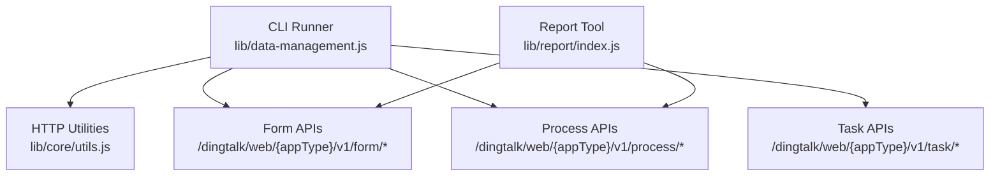
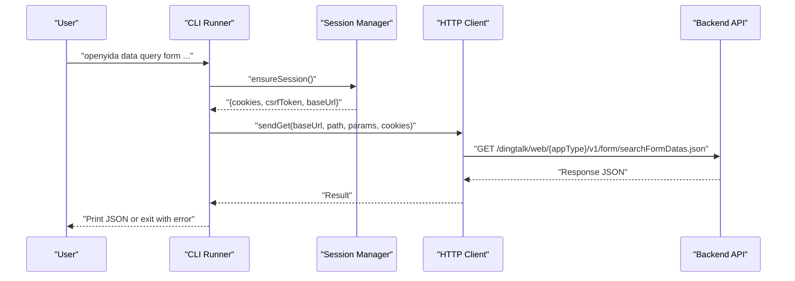
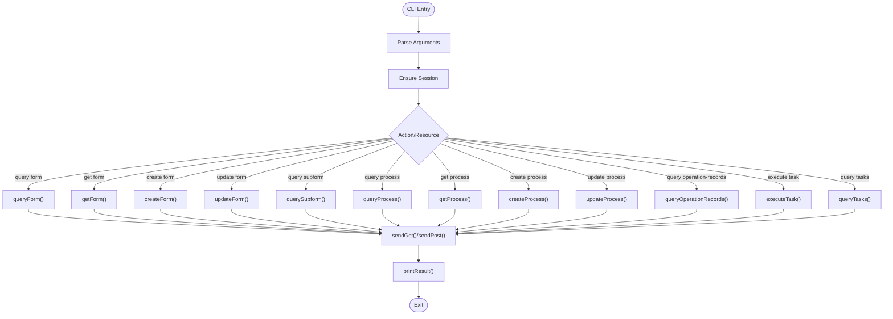
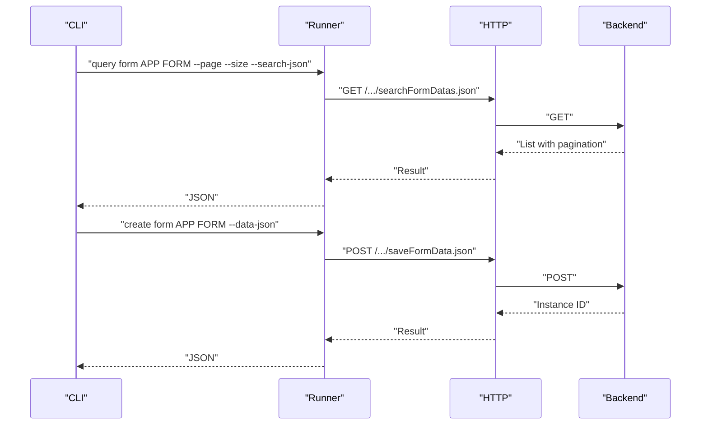
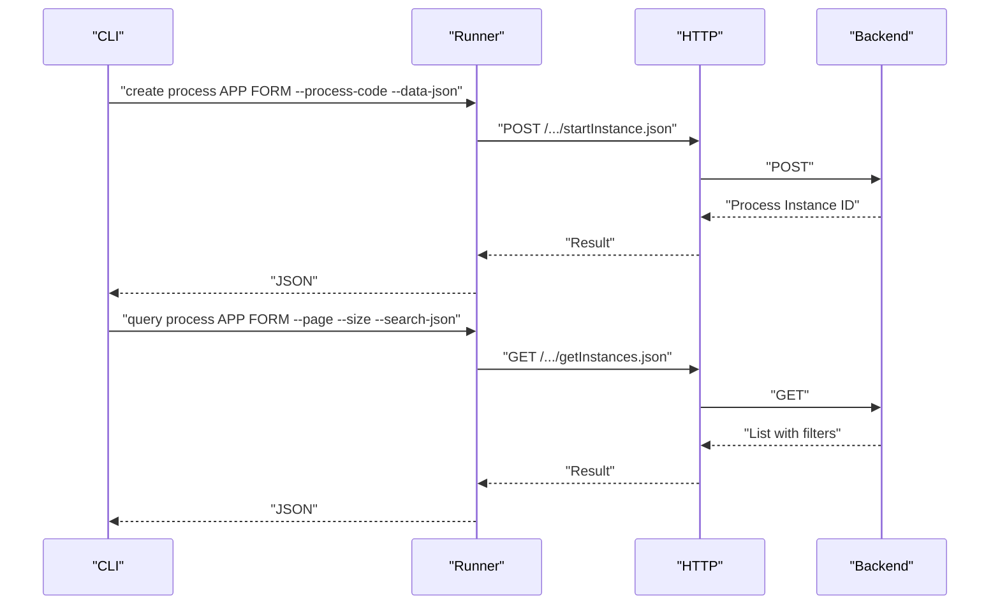
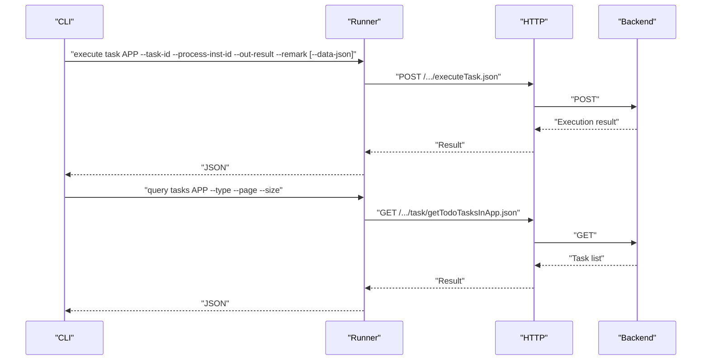
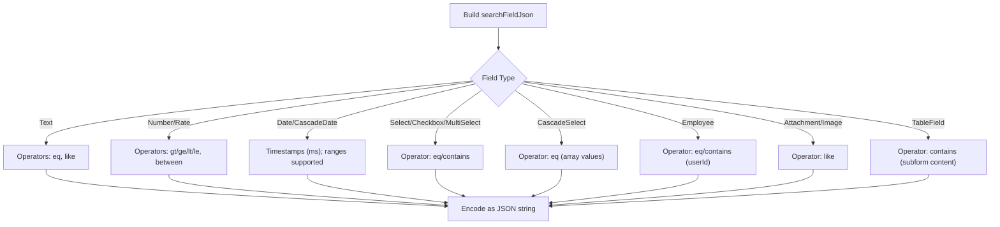
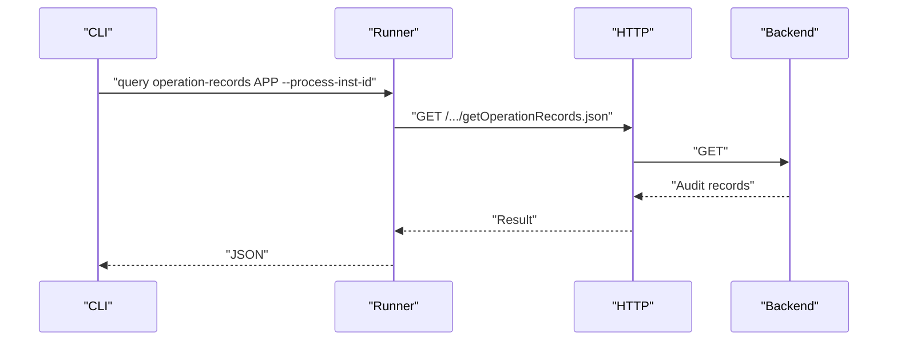
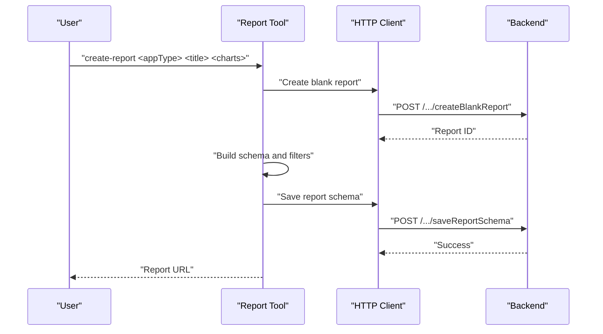
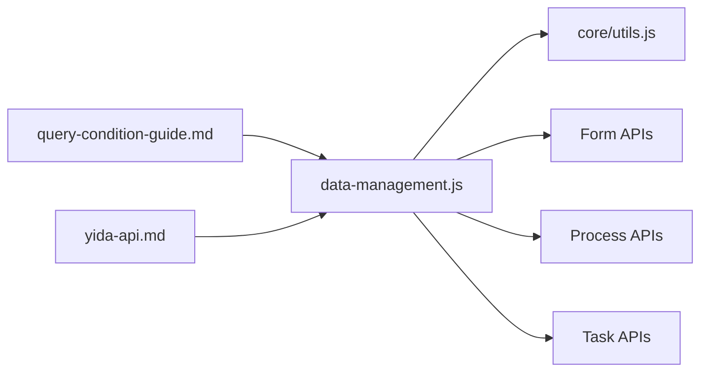

# Data Management & Operations

<cite>
**Referenced Files in This Document**
- [data-management.js](file://lib/data-management.js)
- [yida-api.md](file://yida-skills/reference/yida-api.md)
- [query-condition-guide.md](file://yida-skills/reference/query-condition-guide.md)
- [index.js](file://lib/report/index.js)
</cite>

## Table of Contents
1. [Introduction](#introduction)
2. [Project Structure](#project-structure)
3. [Core Components](#core-components)
4. [Architecture Overview](#architecture-overview)
5. [Detailed Component Analysis](#detailed-component-analysis)
6. [Dependency Analysis](#dependency-analysis)
7. [Performance Considerations](#performance-considerations)
8. [Troubleshooting Guide](#troubleshooting-guide)
9. [Conclusion](#conclusion)
10. [Appendices](#appendices)

## Introduction
This document describes OpenYida’s unified data operations system for managing forms, processes, tasks, and subforms. It covers consistent CRUD operations, query capabilities (filtering, pagination, sorting, complex search), permission and approval workflows, validation and business logic enforcement, audit trails, bulk operations, exports, and integrations. It also explains the relationships among data models, forms, and business processes, and provides practical workflows, configuration examples, and troubleshooting guidance.

## Project Structure
OpenYida exposes a CLI-driven data management interface that wraps backend APIs for forms, processes, and tasks. The primary entry is a CLI runner that parses commands and dispatches to HTTP handlers. Supporting references define the API surface, query condition formats, and reporting tooling.

**Diagram sources**
- [data-management.js:136-362](file://lib/data-management.js#L136-L362)
- [index.js:10-21](file://lib/report/index.js#L10-L21)

**Section sources**
- [data-management.js:13-362](file://lib/data-management.js#L13-L362)
- [index.js:1-282](file://lib/report/index.js#L1-L282)

## Core Components
- CLI Runner: Parses arguments, ensures session, and routes actions to appropriate handlers.
- HTTP Layer: Builds requests with CSRF tokens and cookies, handles GET/POST, and prints results.
- Form Operations: Create, read, update, list, and subform queries.
- Process Operations: Start, update, list, and fetch process instances; query operation records.
- Task Operations: Execute tasks with outcomes and optional data updates.
- Query Conditions: Structured JSON arrays for filtering, pagination, and sorting.

Key capabilities:
- Consistent CRUD across forms and processes.
- Pagination limits enforced at 100 per page.
- Search via structured JSON with operators mapped to field types.
- Sorting via dynamic ordering parameters.
- Subform queries by table field ID within a form instance.

**Section sources**
- [data-management.js:151-334](file://lib/data-management.js#L151-L334)
- [yida-api.md:50-448](file://yida-skills/reference/yida-api.md#L50-L448)
- [query-condition-guide.md:1-298](file://yida-skills/reference/query-condition-guide.md#L1-L298)

## Architecture Overview
The system orchestrates CLI commands to backend endpoints. Authentication is managed via session cookies and CSRF tokens. Requests are constructed with standardized parameters and printed as JSON responses or errors.

**Diagram sources**
- [data-management.js:44-149](file://lib/data-management.js#L44-L149)
- [data-management.js:124-136](file://lib/data-management.js#L124-L136)

## Detailed Component Analysis

### CLI Command Matrix
The CLI supports a matrix of commands for forms, processes, tasks, and subforms. Actions include query, get, create, update, and execute. Options vary by resource and action.

**Diagram sources**
- [data-management.js:336-362](file://lib/data-management.js#L336-L362)
- [data-management.js:151-334](file://lib/data-management.js#L151-L334)
- [data-management.js:124-136](file://lib/data-management.js#L124-L136)

**Section sources**
- [data-management.js:13-31](file://lib/data-management.js#L13-L31)
- [data-management.js:336-362](file://lib/data-management.js#L336-L362)

### Form Operations
- Query forms by ID or list with pagination and search.
- Create and update form instances with JSON payloads.
- List subform rows by table field ID within a form instance.

**Diagram sources**
- [data-management.js:151-214](file://lib/data-management.js#L151-L214)
- [yida-api.md:50-182](file://yida-skills/reference/yida-api.md#L50-L182)

**Section sources**
- [data-management.js:151-214](file://lib/data-management.js#L151-L214)
- [yida-api.md:50-182](file://yida-skills/reference/yida-api.md#L50-L182)

### Process Operations
- Start processes with form data and process code.
- Update existing process instances.
- List and fetch process instances with filters and search.
- Retrieve operation records for auditing.

**Diagram sources**
- [data-management.js:259-291](file://lib/data-management.js#L259-L291)
- [yida-api.md:452-658](file://yida-skills/reference/yida-api.md#L452-L658)

**Section sources**
- [data-management.js:232-291](file://lib/data-management.js#L232-L291)
- [yida-api.md:452-658](file://yida-skills/reference/yida-api.md#L452-L658)

### Task Operations
- Execute tasks with outcomes (approve/deny), remarks, and optional form data updates.
- Query tasks by type (todo, done, submitted, cc).

**Diagram sources**
- [data-management.js:293-334](file://lib/data-management.js#L293-L334)
- [yida-api.md:1-800](file://yida-skills/reference/yida-api.md#L1-L800)

**Section sources**
- [data-management.js:293-334](file://lib/data-management.js#L293-L334)

### Query Conditions and Filtering
- searchFieldJson is a JSON array string describing field-level filters.
- Operators depend on field types (e.g., eq, like, gt, ge, lt, le, between, contains).
- Date ranges use millisecond timestamps; cascading date ranges accept pairs of ranges.
- Subform filters support parentId to target nested components.

**Diagram sources**
- [query-condition-guide.md:7-220](file://yida-skills/reference/query-condition-guide.md#L7-L220)

**Section sources**
- [query-condition-guide.md:1-298](file://yida-skills/reference/query-condition-guide.md#L1-L298)

### Audit Trail and Operation Records
- Operation records for a process instance can be queried to track approvals, rejections, and comments.
- Use the operation-records query to retrieve historical actions.

**Diagram sources**
- [data-management.js:284-291](file://lib/data-management.js#L284-L291)

**Section sources**
- [data-management.js:284-291](file://lib/data-management.js#L284-L291)

### Reporting and Data Export
- The reporting tool creates blank reports, builds schemas, injects filters, and saves report configurations.
- While not a direct export API, it demonstrates how data sources and filters are wired for downstream consumption.

**Diagram sources**
- [index.js:96-271](file://lib/report/index.js#L96-L271)

**Section sources**
- [index.js:1-282](file://lib/report/index.js#L1-L282)

## Dependency Analysis
- CLI depends on core HTTP utilities for session management, base URL resolution, and request dispatch.
- Form, process, and task operations share a common request builder and error printer.
- Query conditions are standardized via a shared guide and API documentation.

**Diagram sources**
- [data-management.js:3-11](file://lib/data-management.js#L3-L11)
- [data-management.js:151-334](file://lib/data-management.js#L151-L334)
- [query-condition-guide.md:1-298](file://yida-skills/reference/query-condition-guide.md#L1-L298)
- [yida-api.md:1-800](file://yida-skills/reference/yida-api.md#L1-L800)

**Section sources**
- [data-management.js:3-11](file://lib/data-management.js#L3-L11)
- [data-management.js:151-334](file://lib/data-management.js#L151-L334)

## Performance Considerations
- Pagination limits: Maximum page size is 100 items. Exceeding this limit causes errors.
- Batch operations: Prefer server-side filtering and pagination to avoid large payloads.
- Subform queries: Use tableFieldId to scope subform lists and reduce payload sizes.
- Sorting: Use dynamicOrder to offload sorting to the backend when possible.
- Caching: Reuse session cookies and CSRF tokens within short-lived sessions to minimize re-authentication overhead.

Practical tips:
- Combine multiple filters in searchFieldJson to narrow results early.
- Use IDs-only queries when you only need identifiers to reduce bandwidth.
- For large exports, iterate pages and stream results to disk rather than loading all at once.

**Section sources**
- [yida-api.md:221-250](file://yida-skills/reference/yida-api.md#L221-L250)
- [yida-api.md:588-634](file://yida-skills/reference/yida-api.md#L588-L634)
- [data-management.js:85-95](file://lib/data-management.js#L85-L95)

## Troubleshooting Guide
Common issues and resolutions:
- Missing parameters: Ensure required flags (e.g., --inst-id, --process-inst-id, --task-id, --data-json) are present.
- CSRF/token/session errors: Re-authenticate to refresh cookies and CSRF tokens.
- Field ID mismatches: Verify field IDs via schema retrieval or existing data.
- Page size violations: Keep pageSize ≤ 100.
- Unknown command: Confirm action/resource combinations match supported matrix.

Operational checks:
- Validate appType and formUuid/approval codes.
- Confirm endpoint paths align with documented routes.
- Inspect response success/error fields and error messages for actionable diagnostics.

**Section sources**
- [data-management.js:32-42](file://lib/data-management.js#L32-L42)
- [data-management.js:97-107](file://lib/data-management.js#L97-L107)
- [query-condition-guide.md:272-280](file://yida-skills/reference/query-condition-guide.md#L272-L280)

## Conclusion
OpenYida’s data management system provides a robust, CLI-driven interface for unified form, process, and task operations. With standardized query conditions, pagination controls, and audit capabilities, it supports scalable data workflows. By adhering to documented APIs, query formats, and operational best practices, teams can implement reliable data CRUD, complex searches, and integrated reporting.

## Appendices

### Practical Workflows

- Create a form instance
  - Action: create form
  - Required: appType, formUuid, data-json
  - Optional: dept-id
  - Reference: [data-management.js:190-201](file://lib/data-management.js#L190-L201), [yida-api.md:52-63](file://yida-skills/reference/yida-api.md#L52-L63)

- Query forms with filters and pagination
  - Action: query form
  - Required: appType, formUuid
  - Filters: search-json (structured JSON), originatorId, createFrom/createTo, modifiedFrom/modifiedTo, dynamicOrder
  - Pagination: page, size (≤100)
  - Reference: [data-management.js:151-179](file://lib/data-management.js#L151-L179), [yida-api.md:327-397](file://yida-skills/reference/yida-api.md#L327-L397), [query-condition-guide.md:7-220](file://yida-skills/reference/query-condition-guide.md#L7-L220)

- Start a process instance
  - Action: create process
  - Required: appType, formUuid, processCode, data-json
  - Optional: dept-id
  - Reference: [data-management.js:259-271](file://lib/data-management.js#L259-L271), [yida-api.md:454-466](file://yida-skills/reference/yida-api.md#L454-L466)

- Execute a task
  - Action: execute task
  - Required: appType, task-id, process-inst-id, out-result, remark
  - Optional: data-json, no-execute-expressions
  - Reference: [data-management.js:293-308](file://lib/data-management.js#L293-L308), [yida-api.md:1-800](file://yida-skills/reference/yida-api.md#L1-L800)

- Query operation records for audit
  - Action: query operation-records
  - Required: appType, process-inst-id
  - Reference: [data-management.js:284-291](file://lib/data-management.js#L284-L291)

- Build a report with filters (integration example)
  - Tool: create-report
  - Steps: create blank report → build schema → inject filters → save schema
  - Reference: [index.js:96-271](file://lib/report/index.js#L96-L271)

### Permission and Approval Notes
- Role-based access control and field-level permissions are enforced by the backend; ensure the authenticated user has appropriate roles for the requested resources.
- Workflow-based approvals are executed via task execution endpoints; verify process codes and instance IDs before execution.

[No sources needed since this section consolidates guidance without analyzing specific files]