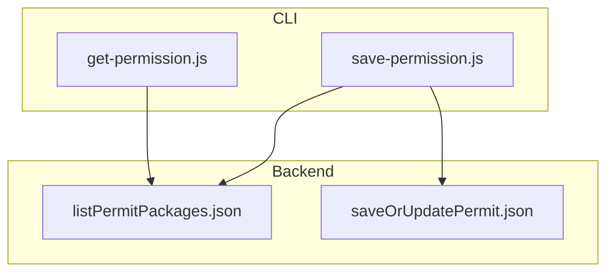
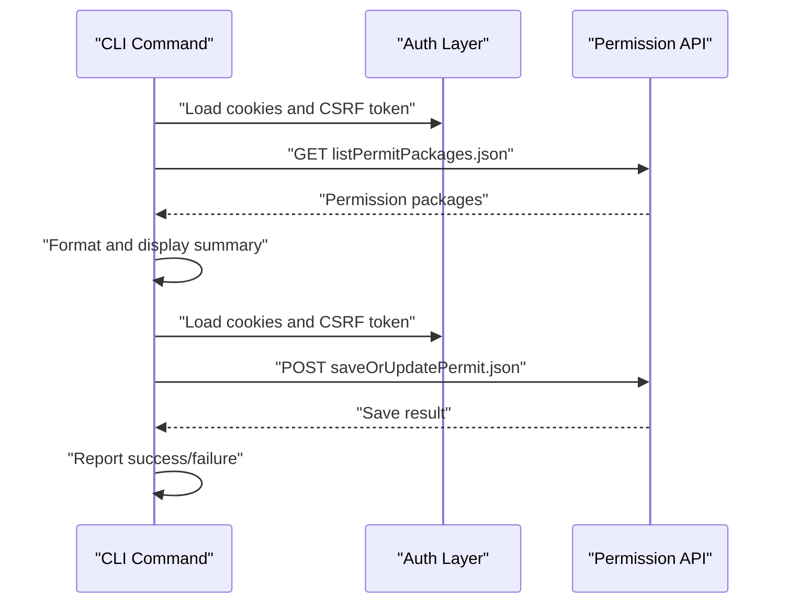
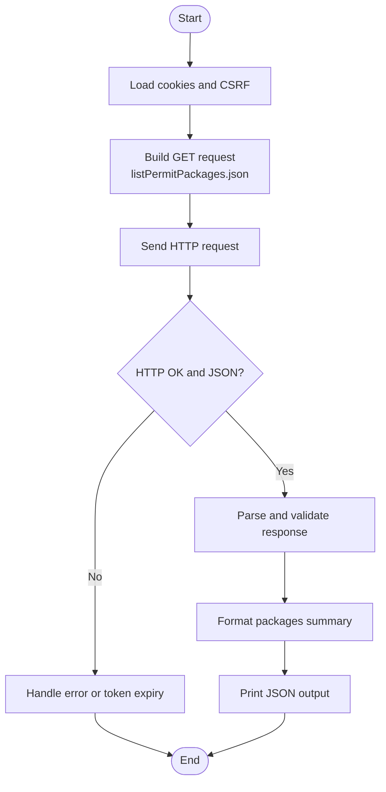
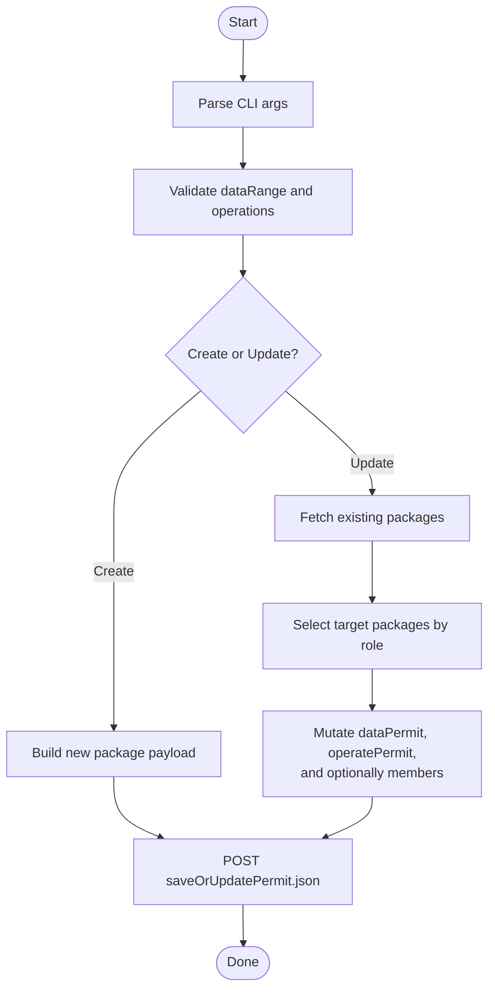
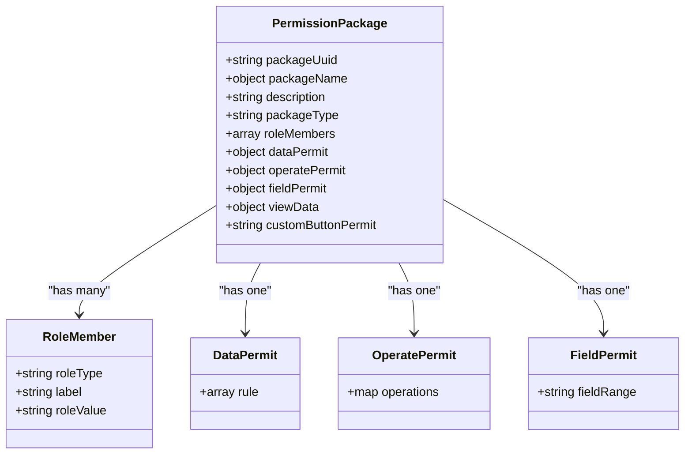
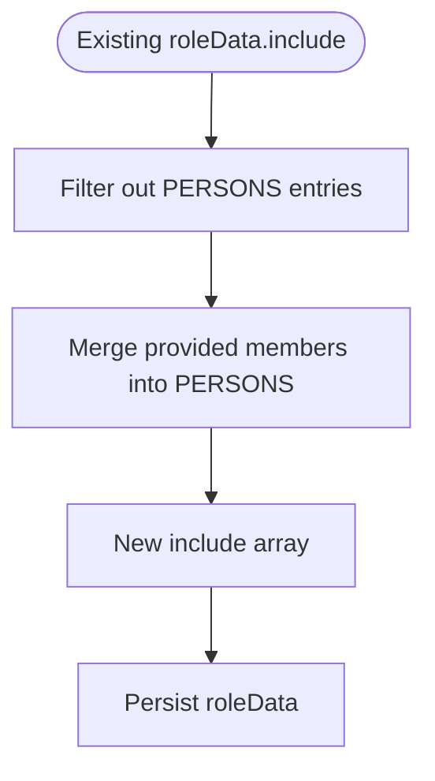
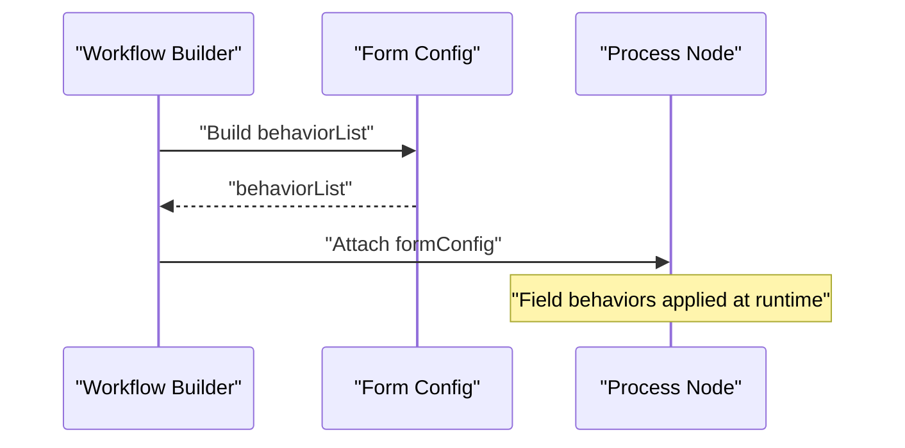
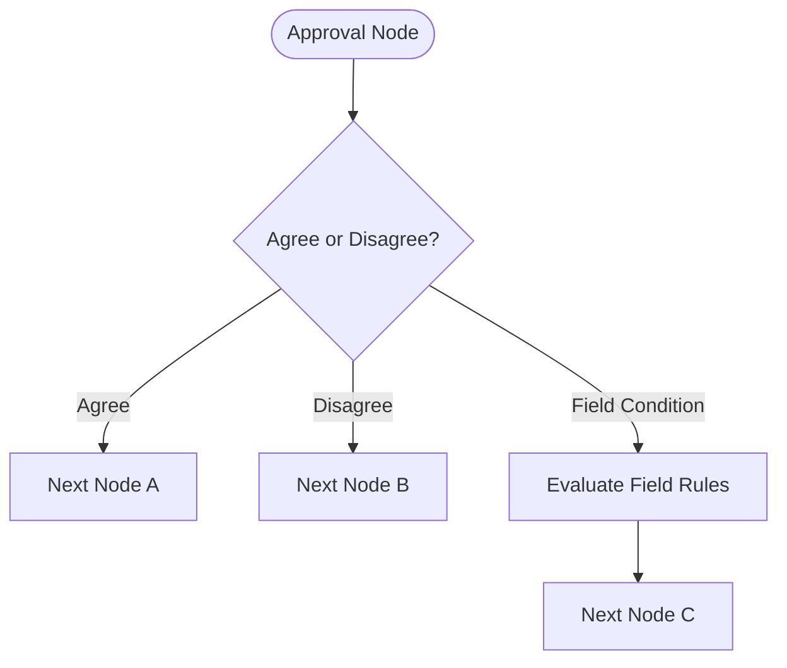
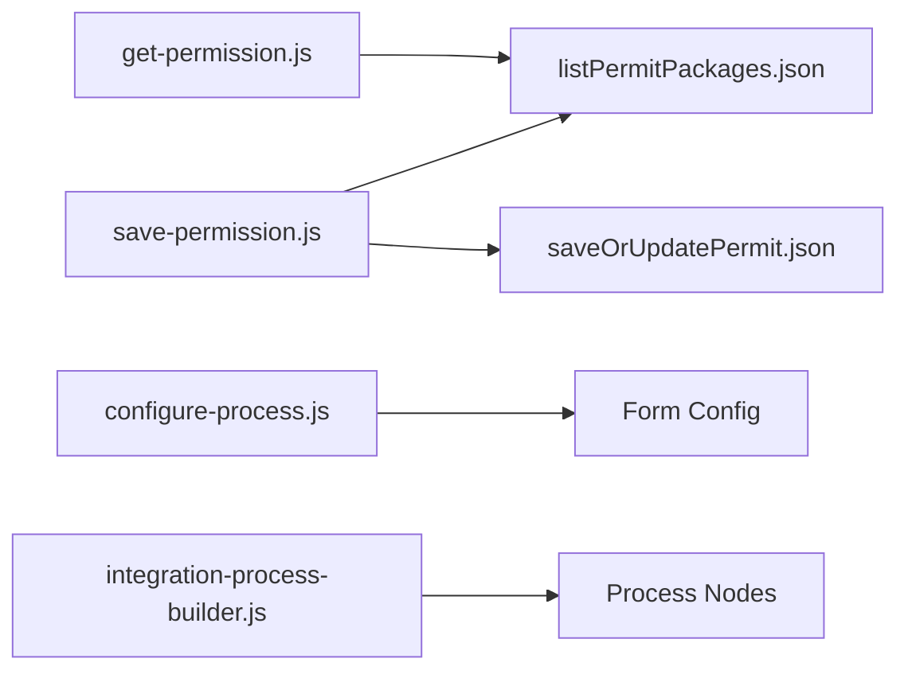

# Permission Management

<cite>
**Referenced Files in This Document**
- [get-permission.js](file://lib/permission/get-permission.js)
- [save-permission.js](file://lib/permission/save-permission.js)
- [configure-process.js](file://lib/process/configure-process.js)
- [integration-process-builder.js](file://lib/integration/integration-process-builder.js)
- [create-form.js](file://lib/app/create-form.js)
</cite>

## Table of Contents
1. [Introduction](#introduction)
2. [Project Structure](#project-structure)
3. [Core Components](#core-components)
4. [Architecture Overview](#architecture-overview)
5. [Detailed Component Analysis](#detailed-component-analysis)
6. [Dependency Analysis](#dependency-analysis)
7. [Performance Considerations](#performance-considerations)
8. [Troubleshooting Guide](#troubleshooting-guide)
9. [Conclusion](#conclusion)
10. [Appendices](#appendices)

## Introduction
This document explains OpenYida’s permission management system with a focus on role-based access control (RBAC), data access scopes, operation permissions, and integration with forms and workflows. It documents the CLI commands for querying and saving permission configurations, the underlying permission model exposed by the backend APIs, and practical guidance for designing secure and maintainable permission setups.

## Project Structure
OpenYida exposes two primary CLI commands for permission management:
- Query permissions for a given form
- Save or update permission groups for a form

These commands communicate with backend endpoints under the permission management module. Permissions are organized as “permission packages” associated with a form, each containing:
- Role membership (who can access)
- Data permission scope (what records they can see/edit)
- Operation permissions (actions allowed)
- Field-level behavior (read-only, hidden, etc.)
- View visibility and custom button permissions

**Diagram sources**
- [get-permission.js:19-87](file://lib/permission/get-permission.js#L19-L87)
- [save-permission.js:157-218](file://lib/permission/save-permission.js#L157-L218)
- [save-permission.js:264-355](file://lib/permission/save-permission.js#L264-L355)

**Section sources**
- [get-permission.js:1-206](file://lib/permission/get-permission.js#L1-L206)
- [save-permission.js:1-583](file://lib/permission/save-permission.js#L1-L583)

## Core Components
- Permission query command
  - Fetches permission packages for a form via a GET endpoint
  - Formats and prints a human-readable summary
- Permission save/update command
  - Validates inputs (data range, operations, members)
  - Optionally creates a new permission group or updates existing ones
  - Persists changes via a POST endpoint

Key capabilities:
- Data scope mapping (ALL, SELF, DEPARTMENT, CUSTOM, etc.)
- Operation keys (view, edit, delete, history, comment, print, batch operations, create)
- Role membership management (default users, managers, persons)
- Field behavior configuration (via workflow builder integration)
- Workflow-based approvals and conditional routing

**Section sources**
- [get-permission.js:19-87](file://lib/permission/get-permission.js#L19-L87)
- [get-permission.js:92-139](file://lib/permission/get-permission.js#L92-L139)
- [save-permission.js:34-66](file://lib/permission/save-permission.js#L34-L66)
- [save-permission.js:129-151](file://lib/permission/save-permission.js#L129-L151)
- [save-permission.js:234-262](file://lib/permission/save-permission.js#L234-L262)
- [save-permission.js:264-355](file://lib/permission/save-permission.js#L264-L355)

## Architecture Overview
The permission system centers on two backend endpoints:
- List permission packages for a form
- Save or update a permission package

**Diagram sources**
- [get-permission.js:23-87](file://lib/permission/get-permission.js#L23-L87)
- [save-permission.js:157-218](file://lib/permission/save-permission.js#L157-L218)
- [save-permission.js:264-355](file://lib/permission/save-permission.js#L264-L355)

## Detailed Component Analysis

### Permission Query (get-permission)
Responsibilities:
- Build and send a GET request to list permission packages for a form
- Parse and validate responses, handling login/session expiration
- Transform raw package data into a readable summary

Key behaviors:
- Uses cookies and CSRF token for authenticated requests
- Supports internationalized package names and descriptions
- Parses nested JSON fields (dataPermit, operatePermit, fieldPermit)
- Detects expired login or CSRF tokens and signals re-authentication

**Diagram sources**
- [get-permission.js:23-87](file://lib/permission/get-permission.js#L23-L87)
- [get-permission.js:92-139](file://lib/permission/get-permission.js#L92-L139)

**Section sources**
- [get-permission.js:23-87](file://lib/permission/get-permission.js#L23-L87)
- [get-permission.js:92-139](file://lib/permission/get-permission.js#L92-L139)

### Permission Save/Update (save-permission)
Responsibilities:
- Parse and validate CLI arguments
- Optionally create a new permission group or update existing ones
- Manage role membership overrides
- Persist changes to backend

Workflow highlights:
- Argument parsing supports create mode and update mode
- Validation ensures dataRange and operation keys are supported
- Role membership building includes MANAGER and optional PERSONS entries
- Data scope mapping converts user-friendly aliases to backend permit types
- Operation permissions are fully replaced based on provided operations map
- Member lists are merged by replacing PERSONS entries during updates

**Diagram sources**
- [save-permission.js:68-127](file://lib/permission/save-permission.js#L68-L127)
- [save-permission.js:129-151](file://lib/permission/save-permission.js#L129-L151)
- [save-permission.js:408-439](file://lib/permission/save-permission.js#L408-L439)
- [save-permission.js:478-511](file://lib/permission/save-permission.js#L478-L511)
- [save-permission.js:529-564](file://lib/permission/save-permission.js#L529-L564)
- [save-permission.js:264-355](file://lib/permission/save-permission.js#L264-L355)

**Section sources**
- [save-permission.js:68-127](file://lib/permission/save-permission.js#L68-L127)
- [save-permission.js:129-151](file://lib/permission/save-permission.js#L129-L151)
- [save-permission.js:234-262](file://lib/permission/save-permission.js#L234-L262)
- [save-permission.js:408-439](file://lib/permission/save-permission.js#L408-L439)
- [save-permission.js:478-511](file://lib/permission/save-permission.js#L478-L511)
- [save-permission.js:529-564](file://lib/permission/save-permission.js#L529-L564)
- [save-permission.js:264-355](file://lib/permission/save-permission.js#L264-L355)

### RBAC Model and Permission Fields
The permission model consists of several fields per package:
- Role members: who can access (e.g., DEFAULT, MANAGER, PERSONS)
- Data permission: record-level visibility scope
- Operation permission: action-level permissions
- Field permission: field-level behaviors (e.g., READONLY)
- View data: visibility of views
- Custom button permission: custom action availability

**Diagram sources**
- [get-permission.js:92-139](file://lib/permission/get-permission.js#L92-L139)
- [save-permission.js:428-439](file://lib/permission/save-permission.js#L428-L439)

**Section sources**
- [get-permission.js:92-139](file://lib/permission/get-permission.js#L92-L139)
- [save-permission.js:428-439](file://lib/permission/save-permission.js#L428-L439)

### Data Scope Mapping
The system maps user-friendly data scope aliases to backend permit types. Supported scopes include:
- ALL
- SELF
- DEPARTMENT
- CUSTOM
- ORIGINATOR
- ORIGINATOR_DEPARTMENT
- SAME_LEVEL_DEPARTMENT
- SUBORDINATE_DEPARTMENT
- FREE_LOGIN
- CUSTOM_DEPARTMENT
- FORMULA

Validation ensures only supported values are accepted.

**Section sources**
- [save-permission.js:34-48](file://lib/permission/save-permission.js#L34-L48)
- [save-permission.js:129-136](file://lib/permission/save-permission.js#L129-L136)

### Operation Keys
Supported operation keys include:
- OPERATE_VIEW
- OPERATE_EDIT
- OPERATE_DELETE
- OPERATE_HISTORY
- OPERATE_COMMENT
- OPERATE_PRINT
- OPERATE_BATCH_IMPORT
- OPERATE_BATCH_EXPORT
- OPERATE_BATCH_EDIT
- OPERATE_BATCH_DELETE
- OPERATE_BATCH_PRINT
- OPERATE_BATCH_DOWNLOAD
- OPERATE_BATCH_DOWNLOAD_QRCODE
- OPERATE_CREATE

Operations are represented as a map where enabled operations are recorded.

**Section sources**
- [save-permission.js:50-66](file://lib/permission/save-permission.js#L50-L66)
- [save-permission.js:138-151](file://lib/permission/save-permission.js#L138-L151)

### Role Membership and Inheritance
- MANAGER: administrative roles (e.g., appMainAdminRole, corpAdminRole)
- DEFAULT: default users
- PERSONS: explicit user IDs (comma-separated)
- During updates, PERSONS entries are replaced by provided member lists

**Diagram sources**
- [save-permission.js:234-262](file://lib/permission/save-permission.js#L234-L262)

**Section sources**
- [save-permission.js:423-426](file://lib/permission/save-permission.js#L423-L426)
- [save-permission.js:234-262](file://lib/permission/save-permission.js#L234-L262)

### Field-Level Permissions and Form Integration
Field-level behaviors are configured via workflow nodes and form configuration. The workflow builder supports:
- Behavior list with fieldId and fieldBehavior
- Backward compatibility with fieldPermissions
- Typical behaviors include READONLY

**Diagram sources**
- [configure-process.js:302-336](file://lib/process/configure-process.js#L302-L336)

**Section sources**
- [configure-process.js:302-336](file://lib/process/configure-process.js#L302-L336)

### Workflow-Based Approvals and Conditional Routing
Workflows define approvals and conditional transitions:
- Approvals can be set to originator or other roles
- Route rules support conditional modes
- Field-based conditions and approval result-based conditions are supported

**Diagram sources**
- [configure-process.js:176-216](file://lib/process/configure-process.js#L176-L216)
- [integration-process-builder.js:231-291](file://lib/integration/integration-process-builder.js#L231-L291)

**Section sources**
- [configure-process.js:176-216](file://lib/process/configure-process.js#L176-L216)
- [integration-process-builder.js:231-291](file://lib/integration/integration-process-builder.js#L231-L291)

### Department Field and Range Configuration
Department selection fields support:
- Multiple selection
- Search configuration
- Department range type and values
- Full department path display options

**Section sources**
- [create-form.js:511-541](file://lib/app/create-form.js#L511-L541)

## Dependency Analysis
- CLI commands depend on authentication utilities for cookies and CSRF tokens
- Both commands rely on the same backend endpoints for listing and saving permission packages
- Workflow builder integrates with form configuration to apply field behaviors
- Department field configuration influences data scope and filtering

**Diagram sources**
- [get-permission.js:23-87](file://lib/permission/get-permission.js#L23-L87)
- [save-permission.js:157-218](file://lib/permission/save-permission.js#L157-L218)
- [save-permission.js:264-355](file://lib/permission/save-permission.js#L264-L355)
- [configure-process.js:302-336](file://lib/process/configure-process.js#L302-L336)
- [integration-process-builder.js:231-291](file://lib/integration/integration-process-builder.js#L231-L291)

**Section sources**
- [get-permission.js:23-87](file://lib/permission/get-permission.js#L23-L87)
- [save-permission.js:157-218](file://lib/permission/save-permission.js#L157-L218)
- [save-permission.js:264-355](file://lib/permission/save-permission.js#L264-L355)
- [configure-process.js:302-336](file://lib/process/configure-process.js#L302-L336)
- [integration-process-builder.js:231-291](file://lib/integration/integration-process-builder.js#L231-L291)

## Performance Considerations
- Minimize repeated queries by caching permission packages locally when scripting
- Batch updates by selecting only affected permission groups
- Prefer updating operation permissions atomically to reduce round trips
- Use appropriate data scope values to limit record scanning and rendering overhead

## Troubleshooting Guide
Common issues and resolutions:
- Login or CSRF token expired
  - The commands detect expired credentials and signal re-authentication needs
  - Re-run the command to trigger login flow
- Invalid dataRange or operation keys
  - Ensure values match supported sets; invalid values cause immediate errors
- No permission groups found
  - Verify the form UUID and app type; ensure the form exists and has permission packages
- Partial update failures
  - Inspect individual package update results; correct misconfigurations and retry

Operational checks:
- Confirm cookies and CSRF token are present
- Validate JSON payloads for dataPermit, operatePermit, and fieldPermit
- Ensure member lists are comma-separated user IDs

**Section sources**
- [get-permission.js:64-81](file://lib/permission/get-permission.js#L64-L81)
- [save-permission.js:198-217](file://lib/permission/save-permission.js#L198-L217)
- [save-permission.js:334-354](file://lib/permission/save-permission.js#L334-L354)

## Conclusion
OpenYida’s permission management provides a robust RBAC foundation for forms, enabling precise control over who can access data, what operations they can perform, and how fields behave. The CLI tools streamline querying and updating permission packages, while workflow and form integrations ensure consistent enforcement across the platform.

## Appendices

### Permission API Endpoints
- GET listPermitPackages.json
  - Purpose: Retrieve permission packages for a form
  - Required headers: Cookie, X-Requested-With, Accept
  - Query parameters: _api, _mock, _csrf_token, _locale_time_zone_offset, formUuid, packageName, packageType, pageIndex, pageSize, appType, _stamp
- POST saveOrUpdatePermit.json
  - Purpose: Create or update a permission package
  - Required headers: Cookie, X-Requested-With, Content-Type, Accept, Origin, Referer
  - Form fields: _csrf_token, _locale_time_zone_offset, formUuid, packageType, packageName, description, roleData, dataPermit, operatePermit, customButtonPermit, fieldPermit, viewData, packageUuid (optional)

**Section sources**
- [get-permission.js:34-48](file://lib/permission/get-permission.js#L34-L48)
- [get-permission.js:50-62](file://lib/permission/get-permission.js#L50-L62)
- [save-permission.js:168-182](file://lib/permission/save-permission.js#L168-L182)
- [save-permission.js:184-196](file://lib/permission/save-permission.js#L184-L196)
- [save-permission.js:283-308](file://lib/permission/save-permission.js#L283-L308)
- [save-permission.js:317-332](file://lib/permission/save-permission.js#L317-L332)

### Parameter Structures and Response Formats
- Request parameters (saveOrUpdatePermit)
  - packageType: FORM_PACKAGE_VIEW
  - packageName: i18n object or string
  - description: i18n object or string
  - roleData: JSON object with include entries (MANAGER, DEFAULT, PERSONS)
  - dataPermit: JSON object with rule array
  - operatePermit: JSON object with operation keys mapped to 'y'
  - fieldPermit: JSON object with fieldRange
  - viewData: JSON object with all and viewUuids
  - packageUuid: string (present for updates)
- Response
  - success: boolean
  - content: depends on endpoint (package UUID for creation; status for update)
  - errorMsg: string (on failure)

**Section sources**
- [save-permission.js:428-439](file://lib/permission/save-permission.js#L428-L439)
- [save-permission.js:283-308](file://lib/permission/save-permission.js#L283-L308)
- [save-permission.js:456-466](file://lib/permission/save-permission.js#L456-L466)
- [save-permission.js:567-579](file://lib/permission/save-permission.js#L567-L579)

### Examples of Permission Setup
- Create a read-only permission group for default users
  - Use create mode with --name and optional --members
  - Defaults to VIEW only; adjust --action-permission to enable EDIT if needed
- Update data scope for manager role
  - Use update mode targeting MANAGER role
  - Set dataRange to SELF or DEPARTMENT as appropriate
- Add specific users to a permission group
  - Provide comma-separated user IDs via --members
  - Members replace existing PERSONS entries during updates

**Section sources**
- [save-permission.js:408-439](file://lib/permission/save-permission.js#L408-L439)
- [save-permission.js:495-511](file://lib/permission/save-permission.js#L495-L511)
- [save-permission.js:549-551](file://lib/permission/save-permission.js#L549-L551)

### Permission Conflict Resolution
- Role overlap
  - Use distinct permission groups for different roles (DEFAULT vs MANAGER)
  - Prefer explicit PERSONS membership for targeted access
- Data scope conflicts
  - Align dataRange with organizational hierarchy (SELF, DEPARTMENT, SUBORDINATE_DEPARTMENT)
  - Use CUSTOM or FORMULA for advanced scoping when necessary
- Operation permission conflicts
  - Keep operation sets minimal and explicit
  - Use separate permission groups for different operational profiles

**Section sources**
- [save-permission.js:495-511](file://lib/permission/save-permission.js#L495-L511)
- [save-permission.js:535-548](file://lib/permission/save-permission.js#L535-L548)

### Access Control Enforcement
- Enforce at form level via permission packages
- Enforce at field level via workflow formConfig behaviorList
- Enforce at workflow level via approvals and conditional routing

**Section sources**
- [configure-process.js:302-336](file://lib/process/configure-process.js#L302-L336)
- [configure-process.js:176-216](file://lib/process/configure-process.js#L176-L216)

### Integration Notes
- Forms: Configure department fields and search behavior
- Workflows: Define approvals and field behaviors
- Processes: Build process JSON with route rules and form configuration

**Section sources**
- [create-form.js:511-541](file://lib/app/create-form.js#L511-L541)
- [configure-process.js:302-336](file://lib/process/configure-process.js#L302-L336)
- [integration-process-builder.js:231-291](file://lib/integration/integration-process-builder.js#L231-L291)

### Best Practices
- Design permissions around organizational roles and data ownership
- Keep permission groups small and focused
- Use data scope mappings aligned with company hierarchy
- Regularly audit permission packages and remove unused members
- Document permission rationale for compliance audits