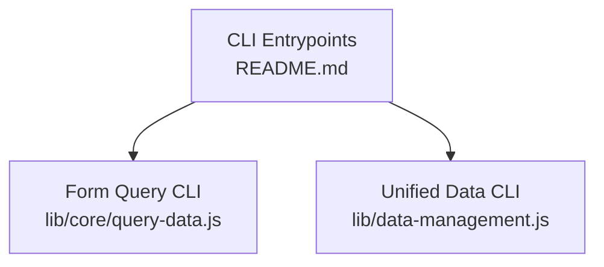
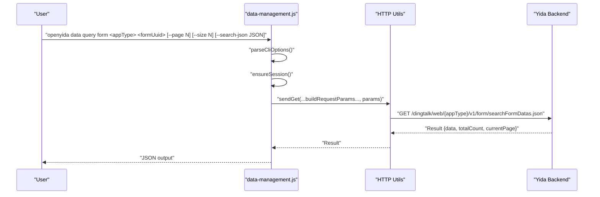
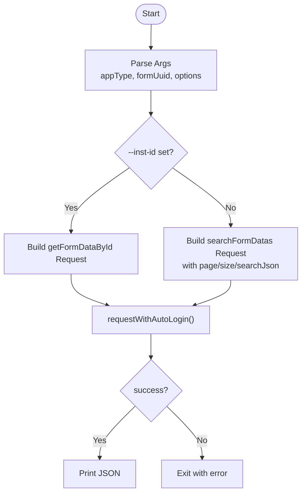
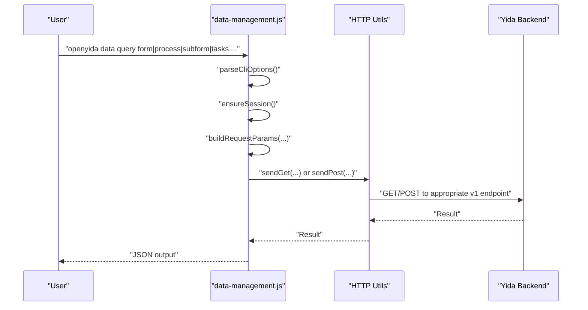
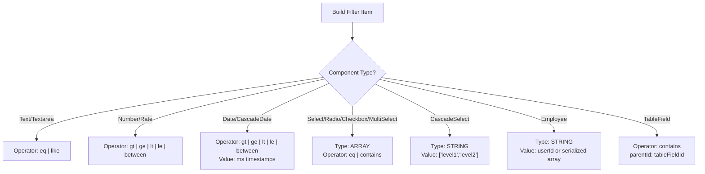
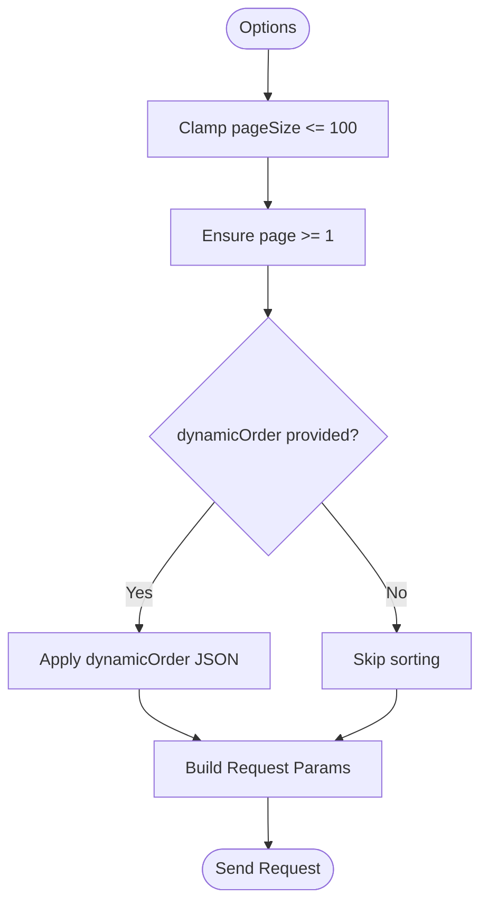
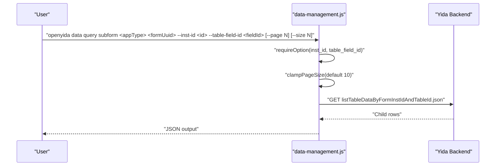
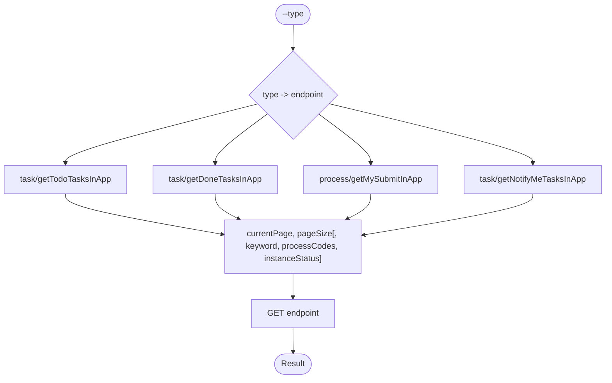
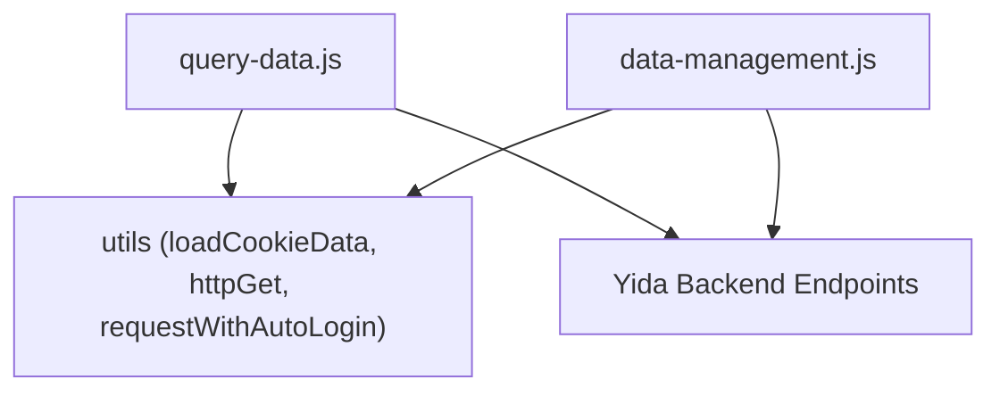

# Query Systems & Search

<cite>
**Referenced Files in This Document**
- [README.md](file://README.md)
- [lib/core/query-data.js](file://lib/core/query-data.js)
- [tests/query-data.test.js](file://tests/query-data.test.js)
- [lib/data-management.js](file://lib/data-management.js)
- [yida-skills/reference/query-condition-guide.md](file://yida-skills/reference/query-condition-guide.md)
- [yida-skills/reference/yida-api.md](file://yida-skills/reference/yida-api.md)
- [yida-skills/skills/yida-connector/examples/operations-search-formdata-v2.json](file://yida-skills/skills/yida-connector/examples/operations-search-formdata-v2.json)
- [yida-skills/reference/association-form-field.md](file://yida-skills/reference/association-form-field.md)
- [lib/report/constants.js](file://lib/report/constants.js)
- [tests/report-constants.test.js](file://tests/report-constants.test.js)
</cite>

## Table of Contents
1. [Introduction](#introduction)
2. [Project Structure](#project-structure)
3. [Core Components](#core-components)
4. [Architecture Overview](#architecture-overview)
5. [Detailed Component Analysis](#detailed-component-analysis)
6. [Dependency Analysis](#dependency-analysis)
7. [Performance Considerations](#performance-considerations)
8. [Troubleshooting Guide](#troubleshooting-guide)
9. [Conclusion](#conclusion)
10. [Appendices](#appendices)

## Introduction
This document explains OpenYida’s query systems and search capabilities across forms, processes, tasks, and subforms. It covers advanced filtering (date ranges, status filters, custom search conditions), pagination and sorting, search JSON format and parameter mapping, subform querying with table field filtering, task query types (todo, done, submitted, cc), complex search scenarios, performance optimization, result processing, formatting, and export. It also provides debugging guidance and best practices for efficient data retrieval.

## Project Structure
OpenYida exposes two primary CLI entry points for querying:
- A dedicated command for form instance data
- A unified data CLI supporting forms, processes, tasks, subforms, and more

**Diagram sources**
- [README.md:108-111](file://README.md#L108-L111)
- [lib/core/query-data.js:1-160](file://lib/core/query-data.js#L1-L160)
- [lib/data-management.js:13-30](file://lib/data-management.js#L13-L30)

**Section sources**
- [README.md:108-111](file://README.md#L108-L111)
- [lib/core/query-data.js:1-160](file://lib/core/query-data.js#L1-L160)
- [lib/data-management.js:13-30](file://lib/data-management.js#L13-L30)

## Core Components
- Form instance search (dedicated CLI): supports pagination, optional search JSON, and single-instance lookup.
- Unified data CLI: supports forms, processes, tasks, subforms, and operation records with consistent pagination and optional search parameters.
- Search JSON format: array of filter items with keys, values, types, operators, and component names; supports nested subform filtering via parentId.
- Task query types: todo, done, submitted, cc, each mapped to a backend endpoint with shared pagination and keyword filters.

**Section sources**
- [lib/core/query-data.js:1-160](file://lib/core/query-data.js#L1-L160)
- [lib/data-management.js:151-179](file://lib/data-management.js#L151-L179)
- [lib/data-management.js:310-334](file://lib/data-management.js#L310-L334)
- [yida-skills/reference/query-condition-guide.md:1-298](file://yida-skills/reference/query-condition-guide.md#L1-L298)

## Architecture Overview
End-to-end flow for form instance search via the unified data CLI:

**Diagram sources**
- [lib/data-management.js:151-179](file://lib/data-management.js#L151-L179)
- [lib/data-management.js:124-129](file://lib/data-management.js#L124-L129)

## Detailed Component Analysis

### Form Instance Search (Dedicated CLI)
- Supports:
  - Pagination: page and size with a maximum size enforced.
  - Search JSON: passed as a string parameter to filter by form fields.
  - Single instance lookup by instance ID.
- Request building:
  - Adds CSRF, stamp, and base URL resolution.
  - Uses searchFormDatas endpoint when search JSON is present; otherwise searchFormDataIds.
- Output:
  - JSON result printed to stdout; errors cause process exit with non-zero code.

**Diagram sources**
- [lib/core/query-data.js:95-157](file://lib/core/query-data.js#L95-L157)

**Section sources**
- [lib/core/query-data.js:1-160](file://lib/core/query-data.js#L1-L160)
- [tests/query-data.test.js:88-192](file://tests/query-data.test.js#L88-L192)

### Unified Data CLI (Forms, Processes, Tasks, Subforms)
- Forms:
  - Supports ids-only mode (searchFormDataIds) vs full data (searchFormDatas).
  - Accepts search JSON, originatorId, createFrom/To, modifiedFrom/To, and dynamicOrder.
- Processes:
  - Supports ids-only mode (getInstanceIds) vs full data (getInstances).
  - Accepts search JSON, task ID, instance status, approved result, and date ranges.
- Tasks:
  - Type-specific endpoints for todo, done, submitted, cc.
  - Shared pagination and optional keyword, process codes, and instance status filters.
- Subforms:
  - Queries table field data within a parent form instance using tableFieldId.

**Diagram sources**
- [lib/data-management.js:151-179](file://lib/data-management.js#L151-L179)
- [lib/data-management.js:216-230](file://lib/data-management.js#L216-L230)
- [lib/data-management.js:232-248](file://lib/data-management.js#L232-L248)
- [lib/data-management.js:310-334](file://lib/data-management.js#L310-L334)

**Section sources**
- [lib/data-management.js:151-179](file://lib/data-management.js#L151-L179)
- [lib/data-management.js:216-230](file://lib/data-management.js#L216-L230)
- [lib/data-management.js:232-248](file://lib/data-management.js#L232-L248)
- [lib/data-management.js:310-334](file://lib/data-management.js#L310-L334)

### Advanced Filtering Mechanisms
- Search JSON format:
  - Array of filter items with key, value, type, operator, and componentName.
  - Operators vary by component type (e.g., eq, like, gt/ge/lt/le, between).
  - Date values use millisecond timestamps; cascading date ranges accept arrays of ranges.
  - Selection-type fields use STRING or ARRAY types; multi-value selections use contains.
  - Subform filtering supported via parentId pointing to the table field.
- Examples:
  - Text equality/like, numeric comparisons, date ranges, selection contains, cascading selects, member fields, and subform contains.

**Diagram sources**
- [yida-skills/reference/query-condition-guide.md:7-220](file://yida-skills/reference/query-condition-guide.md#L7-L220)

**Section sources**
- [yida-skills/reference/query-condition-guide.md:1-298](file://yida-skills/reference/query-condition-guide.md#L1-L298)

### Pagination Controls and Sorting
- Pagination:
  - Both CLI commands enforce a maximum page size (100) and normalize page/page size values.
  - Unified data CLI clamps size and validates page numbers.
- Sorting:
  - Forms support dynamicOrder via a JSON string specifying sort direction per alias.
  - Connector example supports dynamicOrder as a JSON string for V2 search.

**Diagram sources**
- [lib/data-management.js:85-95](file://lib/data-management.js#L85-L95)
- [lib/core/query-data.js:39-53](file://lib/core/query-data.js#L39-L53)
- [yida-skills/reference/yida-api.md:344](file://yida-skills/reference/yida-api.md#L344)
- [yida-skills/skills/yida-connector/examples/operations-search-formdata-v2.json:147-155](file://yida-skills/skills/yida-connector/examples/operations-search-formdata-v2.json#L147-L155)

**Section sources**
- [lib/data-management.js:85-95](file://lib/data-management.js#L85-L95)
- [lib/core/query-data.js:39-53](file://lib/core/query-data.js#L39-L53)
- [yida-skills/reference/yida-api.md:344](file://yida-skills/reference/yida-api.md#L344)
- [yida-skills/skills/yida-connector/examples/operations-search-formdata-v2.json:147-155](file://yida-skills/skills/yida-connector/examples/operations-search-formdata-v2.json#L147-L155)

### Subform Querying and Hierarchical Data Retrieval
- Subform querying:
  - Requires parent formUuid, formInstanceId, and tableFieldId.
  - Paginates results for large child datasets.
- Association form fields:
  - Support filtering rules linking current form fields to target form fields.
  - Enable dynamic filtering and auto-fill behavior.

**Diagram sources**
- [lib/data-management.js:216-230](file://lib/data-management.js#L216-L230)

**Section sources**
- [lib/data-management.js:216-230](file://lib/data-management.js#L216-L230)
- [yida-skills/reference/association-form-field.md:1-69](file://yida-skills/reference/association-form-field.md#L1-L69)

### Task Query Types (todo, done, submitted, cc)
- Endpoint mapping:
  - todo -> task/getTodoTasksInApp
  - done -> task/getDoneTasksInApp
  - submitted -> process/getMySubmitInApp
  - cc -> task/getNotifyMeTasksInApp
- Shared parameters:
  - Pagination (page, size)
  - Optional keyword, processCodes, instanceStatus

**Diagram sources**
- [lib/data-management.js:310-334](file://lib/data-management.js#L310-L334)

**Section sources**
- [lib/data-management.js:310-334](file://lib/data-management.js#L310-L334)

### Search JSON Format and Parameter Mapping
- CLI to backend parameter mapping:
  - search-json -> searchFieldJson
  - page -> currentPage
  - size -> pageSize
  - createFrom/To, modifiedFrom/To -> createFromGMT/createToGMT, modifiedFromGMT/modifiedToGMT (connector V2 example)
  - dynamicOrder -> dynamicOrder
- Connector V2 example:
  - Accepts appType, systemToken, userId, formUuid, searchFieldJson, date ranges, and dynamicOrder in body.

**Section sources**
- [lib/core/query-data.js:58-78](file://lib/core/query-data.js#L58-L78)
- [lib/data-management.js:162-171](file://lib/data-management.js#L162-L171)
- [yida-skills/skills/yida-connector/examples/operations-search-formdata-v2.json:77-155](file://yida-skills/skills/yida-connector/examples/operations-search-formdata-v2.json#L77-L155)

### Complex Search Scenarios
- Example scenarios (conceptual):
  - Multi-condition AND filters: combine text equality, numeric range, and date range.
  - Subform inner filtering: use parentId to target a table field and apply text-like contains.
  - Member contains: pass a serialized array of user IDs for multi-user selection.
  - Cascading date ranges: supply arrays of timestamp pairs for multiple windows.
- Best practices:
  - Prefer ids-only queries when you only need IDs to reduce payload.
  - Use dynamicOrder to pre-sort by frequently accessed fields.
  - Limit pageSize to avoid heavy payloads; iterate pages as needed.

[No sources needed since this section provides conceptual guidance]

### Query Result Processing, Formatting, and Export
- Output:
  - Results are printed as JSON to stdout; errors are printed and cause non-zero exit.
- Data transformation:
  - Subform rows are returned as arrays within formData for table fields.
  - Member fields may include arrays of user identifiers.
- Export:
  - Pipe CLI output to external tools or scripts for downstream processing and export to CSV/XLSX.

**Section sources**
- [lib/core/query-data.js:138-156](file://lib/core/query-data.js#L138-L156)
- [lib/data-management.js:138-149](file://lib/data-management.js#L138-L149)
- [yida-skills/reference/yida-api.md:400-448](file://yida-skills/reference/yida-api.md#L400-L448)

## Dependency Analysis
- CLI entrypoints depend on session management and HTTP utilities.
- Form and process queries share a common request builder and parameter normalization.
- Task queries are decoupled by endpoint mapping but reuse pagination logic.

**Diagram sources**
- [lib/core/query-data.js:16-21](file://lib/core/query-data.js#L16-L21)
- [lib/data-management.js:4-11](file://lib/data-management.js#L4-L11)

**Section sources**
- [lib/core/query-data.js:16-21](file://lib/core/query-data.js#L16-L21)
- [lib/data-management.js:4-11](file://lib/data-management.js#L4-L11)

## Performance Considerations
- Enforce pageSize limits (≤100) to prevent timeouts and excessive memory usage.
- Use ids-only queries when feasible to minimize response size.
- Apply targeted filters (date ranges, status, keyword) to reduce dataset size early.
- Leverage dynamicOrder to offload sorting to the backend.
- Batch pagination: iterate currentPage until totalCount is satisfied.
- Avoid overly broad contains filters; prefer exact or partial matches where possible.

[No sources needed since this section provides general guidance]

## Troubleshooting Guide
- Authentication failures:
  - Ensure valid session and CSRF token; re-login if needed.
- Parameter errors:
  - Validate --page and --size values; ensure --search-json is a valid JSON string.
  - Confirm field IDs and types match component definitions.
- Common mistakes:
  - Using incorrect types (e.g., STRING vs ARRAY for selections).
  - Omitting required parameters for task queries (--type).
  - Exceeding maximum page size.

**Section sources**
- [tests/query-data.test.js:53-86](file://tests/query-data.test.js#L53-L86)
- [tests/query-data.test.js:117-136](file://tests/query-data.test.js#L117-L136)
- [lib/data-management.js:310-324](file://lib/data-management.js#L310-L324)
- [yida-skills/reference/query-condition-guide.md:272-280](file://yida-skills/reference/query-condition-guide.md#L272-L280)

## Conclusion
OpenYida provides robust, flexible querying across forms, processes, tasks, and subforms. By leveraging structured search JSON, pagination controls, and sorting, developers can efficiently retrieve and transform data. Following best practices—such as limiting page sizes, using ids-only queries when possible, and applying precise filters—ensures optimal performance and maintainable integrations.

## Appendices

### Appendix A: Search JSON Field Code Derivation (Reports)
- Certain field types require a _value suffix for filter usage (e.g., SelectField, MultiSelectField, EmployeeField).
- This affects how filter keys are constructed in downstream reporting/filtering logic.

**Section sources**
- [lib/report/constants.js:73-118](file://lib/report/constants.js#L73-L118)
- [tests/report-constants.test.js:215-242](file://tests/report-constants.test.js#L215-L242)