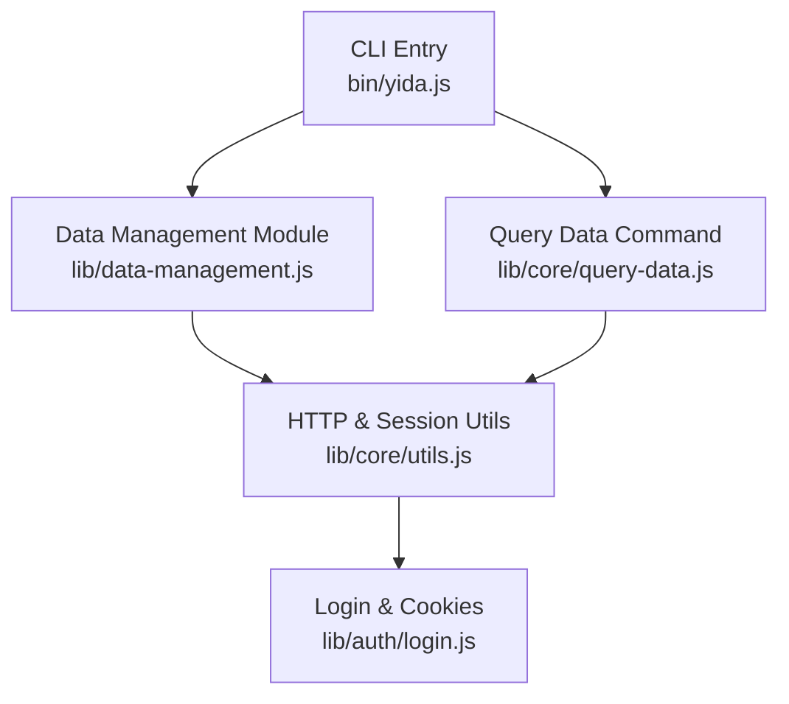
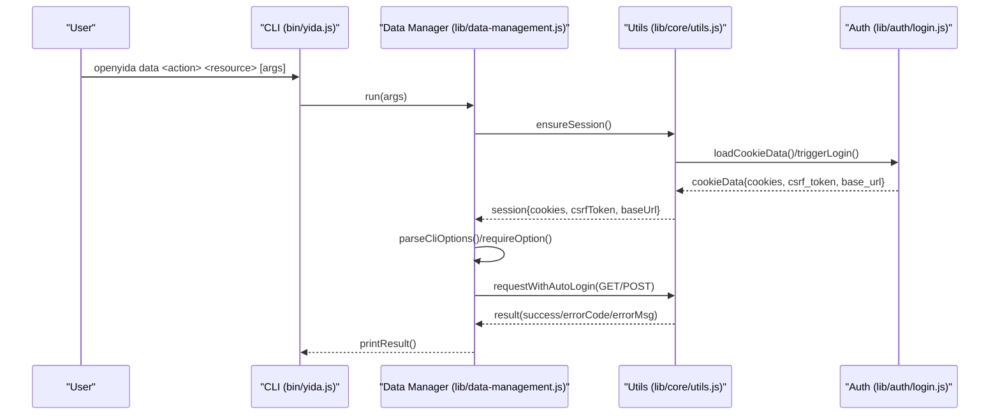
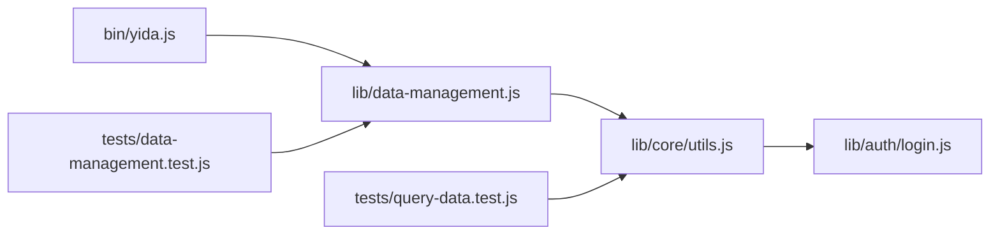

# Unified Data Operations

<cite>
**Referenced Files in This Document**
- [bin/yida.js](file://bin/yida.js)
- [lib/data-management.js](file://lib/data-management.js)
- [lib/core/utils.js](file://lib/core/utils.js)
- [lib/auth/login.js](file://lib/auth/login.js)
- [lib/core/query-data.js](file://lib/core/query-data.js)
- [tests/data-management.test.js](file://tests/data-management.test.js)
- [tests/query-data.test.js](file://tests/query-data.test.js)
- [yida-skills/reference/yida-api.md](file://yida-skills/reference/yida-api.md)
- [package.json](file://package.json)
- [README.md](file://README.md)
</cite>

## Table of Contents
1. [Introduction](#introduction)
2. [Project Structure](#project-structure)
3. [Core Components](#core-components)
4. [Architecture Overview](#architecture-overview)
5. [Detailed Component Analysis](#detailed-component-analysis)
6. [Dependency Analysis](#dependency-analysis)
7. [Performance Considerations](#performance-considerations)
8. [Troubleshooting Guide](#troubleshooting-guide)
9. [Conclusion](#conclusion)
10. [Appendices](#appendices)

## Introduction
This document describes OpenYida’s unified data operations system, focusing on the CLI interface for managing forms, processes, tasks, and subforms. It covers the command structure, parameter validation, session and authentication requirements, and provides practical usage patterns. It also explains the relationships between entities, performance considerations for large datasets, and troubleshooting steps for common errors.

## Project Structure
The unified data operations are exposed via the CLI entry point and implemented in a dedicated module. Supporting modules handle authentication, session management, HTTP transport, and optional auxiliary commands.

**Diagram sources**
- [bin/yida.js:326-335](file://bin/yida.js#L326-L335)
- [lib/data-management.js:336-362](file://lib/data-management.js#L336-L362)
- [lib/core/query-data.js:95-157](file://lib/core/query-data.js#L95-L157)
- [lib/core/utils.js:449-463](file://lib/core/utils.js#L449-L463)
- [lib/auth/login.js:341-349](file://lib/auth/login.js#L341-L349)

**Section sources**
- [README.md:108-111](file://README.md#L108-L111)
- [bin/yida.js:326-335](file://bin/yida.js#L326-L335)

## Core Components
- CLI entry dispatches the data command to the data management module.
- Data management module parses arguments, validates required parameters, ensures a valid session, and invokes appropriate endpoints for forms, processes, tasks, and subforms.
- HTTP utilities encapsulate GET/POST requests, CSRF handling, and automatic login/session refresh.
- Authentication module manages cookie caching, login prompts, and logout.

Key responsibilities:
- Argument parsing and validation
- Session initialization and persistence
- Request building and execution
- Result printing and error handling

**Section sources**
- [lib/data-management.js:62-83](file://lib/data-management.js#L62-L83)
- [lib/data-management.js:44-60](file://lib/data-management.js#L44-L60)
- [lib/core/utils.js:423-447](file://lib/core/utils.js#L423-L447)
- [lib/auth/login.js:134-155](file://lib/auth/login.js#L134-L155)

## Architecture Overview
The unified data operations follow a consistent flow:
- Parse CLI arguments into positional and option tokens.
- Validate required parameters per action/resource.
- Ensure a valid session (cookies + CSRF token).
- Build request parameters and call the appropriate endpoint.
- Print results or exit with error messages.

**Diagram sources**
- [bin/yida.js:326-335](file://bin/yida.js#L326-L335)
- [lib/data-management.js:336-362](file://lib/data-management.js#L336-L362)
- [lib/core/utils.js:423-447](file://lib/core/utils.js#L423-L447)
- [lib/auth/login.js:134-155](file://lib/auth/login.js#L134-L155)

## Detailed Component Analysis

### CLI Entry and Dispatch
- The CLI entry point recognizes the data command and delegates to the data management module.
- It prints help/usage when insufficient arguments are provided.

Practical usage:
- Use the data command to perform unified data operations across forms, processes, tasks, and subforms.

**Section sources**
- [bin/yida.js:326-335](file://bin/yida.js#L326-L335)
- [README.md:108-111](file://README.md#L108-L111)

### Data Management Module
Responsibilities:
- Define supported actions/resources and their argument patterns.
- Parse options and enforce required parameters.
- Clamp pagination parameters to safe defaults and limits.
- Build request payloads and call HTTP helpers.
- Print results or exit with error codes.

Supported operations:
- Forms: query, get, create, update, query subform
- Processes: query, get, create, update, query operation records
- Tasks: execute task
- Tasks listing: query tasks

Validation and error handling:
- Missing required parameters cause immediate failure with usage hints.
- Result success checks and error code evaluation determine exit status.

Pagination:
- Default page size varies by endpoint; enforced upper limit prevents oversized requests.

**Section sources**
- [lib/data-management.js:13-30](file://lib/data-management.js#L13-L30)
- [lib/data-management.js:97-107](file://lib/data-management.js#L97-L107)
- [lib/data-management.js:85-95](file://lib/data-management.js#L85-L95)
- [lib/data-management.js:151-179](file://lib/data-management.js#L151-L179)
- [lib/data-management.js:216-230](file://lib/data-management.js#L216-L230)
- [lib/data-management.js:232-248](file://lib/data-management.js#L232-L248)
- [lib/data-management.js:293-308](file://lib/data-management.js#L293-L308)
- [lib/data-management.js:310-334](file://lib/data-management.js#L310-L334)

### Session and Authentication
Session management:
- Loads cached cookies and CSRF token from project cache.
- Triggers interactive login if missing or invalid.
- Provides automatic CSRF refresh and re-login retry on expiration.

HTTP utilities:
- Encapsulates GET/POST requests with cookie filtering and CSRF header injection.
- Detects login/session expiration and triggers remediation.

**Section sources**
- [lib/data-management.js:44-60](file://lib/data-management.js#L44-L60)
- [lib/core/utils.js:170-201](file://lib/core/utils.js#L170-L201)
- [lib/core/utils.js:209-223](file://lib/core/utils.js#L209-L223)
- [lib/core/utils.js:232-251](file://lib/core/utils.js#L232-L251)
- [lib/core/utils.js:261-264](file://lib/core/utils.js#L261-L264)
- [lib/core/utils.js:276-341](file://lib/core/utils.js#L276-L341)
- [lib/core/utils.js:351-415](file://lib/core/utils.js#L351-L415)
- [lib/core/utils.js:423-447](file://lib/core/utils.js#L423-L447)
- [lib/auth/login.js:45-53](file://lib/auth/login.js#L45-L53)
- [lib/auth/login.js:134-155](file://lib/auth/login.js#L134-L155)

### Query Data Command (Alternative Path)
- Provides a focused command for querying form data with similar validation and session handling.
- Demonstrates consistent error handling and result printing.

**Section sources**
- [lib/core/query-data.js:23-56](file://lib/core/query-data.js#L23-L56)
- [lib/core/query-data.js:95-157](file://lib/core/query-data.js#L95-L157)

### API Reference Mapping
The CLI endpoints map to documented backend APIs for forms, processes, and tasks. These references define parameter shapes and behaviors.

Examples of mapped operations:
- Form create/update/search/get
- Process start/update/get instances
- Task execution and task lists
- Subform listing

**Section sources**
- [yida-skills/reference/yida-api.md:52-182](file://yida-skills/reference/yida-api.md#L52-L182)
- [yida-skills/reference/yida-api.md:186-217](file://yida-skills/reference/yida-api.md#L186-L217)
- [yida-skills/reference/yida-api.md:454-512](file://yida-skills/reference/yida-api.md#L454-L512)
- [yida-skills/reference/yida-api.md:540-658](file://yida-skills/reference/yida-api.md#L540-L658)

### Command Reference and Examples

- Forms
  - Query list: openyida data query form <appType> <formUuid> [--page N] [--size N] [--search-json JSON] [--inst-id ID]
  - Get instance: openyida data get form <appType> --inst-id <formInstId>
  - Create instance: openyida data create form <appType> <formUuid> --data-json <JSON> [--dept-id ID]
  - Update instance: openyida data update form <appType> --inst-id <formInstId> --data-json <JSON> [--use-latest-version y]
  - Query subform rows: openyida data query subform <appType> <formUuid> --inst-id <formInstId> --table-field-id <fieldId> [--page N] [--size N]

- Processes
  - Query instances: openyida data query process <appType> <formUuid> [--page N] [--size N] [--search-json JSON] [--task-id ID] [--instance-status STATUS] [--approved-result RESULT]
  - Get instance: openyida data get process <appType> --process-inst-id <processInstanceId>
  - Create instance: openyida data create process <appType> <formUuid> --process-code <processCode> --data-json <JSON> [--dept-id ID]
  - Update instance: openyida data update process <appType> --process-inst-id <processInstanceId> --data-json <JSON>
  - Query operation records: openyida data query operation-records <appType> --process-inst-id <processInstanceId>

- Tasks
  - Execute task: openyida data execute task <appType> --task-id <taskId> --process-inst-id <processInstanceId> --out-result <AGREE|DISAGREE> --remark <text> [--data-json JSON] [--no-execute-expressions y]
  - Query tasks: openyida data query tasks <appType> --type <todo|done|submitted|cc> [--page N] [--size N] [--keyword TEXT] [--process-codes JSON] [--instance-status STATUS]

Notes:
- Required parameters are enforced per operation.
- Pagination defaults and limits are applied automatically.
- Results are printed as JSON; failures exit with non-zero status.

**Section sources**
- [lib/data-management.js:13-30](file://lib/data-management.js#L13-L30)
- [lib/data-management.js:151-179](file://lib/data-management.js#L151-L179)
- [lib/data-management.js:216-230](file://lib/data-management.js#L216-L230)
- [lib/data-management.js:232-248](file://lib/data-management.js#L232-L248)
- [lib/data-management.js:293-308](file://lib/data-management.js#L293-L308)
- [lib/data-management.js:310-334](file://lib/data-management.js#L310-L334)

## Dependency Analysis
- The CLI depends on the data management module.
- The data management module depends on HTTP utilities and authentication.
- Tests validate argument parsing, pagination clamping, and conversion helpers.

**Diagram sources**
- [bin/yida.js:326-335](file://bin/yida.js#L326-L335)
- [lib/data-management.js:336-362](file://lib/data-management.js#L336-L362)
- [lib/core/utils.js:449-463](file://lib/core/utils.js#L449-L463)
- [lib/auth/login.js:341-349](file://lib/auth/login.js#L341-L349)
- [tests/data-management.test.js:18-45](file://tests/data-management.test.js#L18-L45)
- [tests/query-data.test.js:7-21](file://tests/query-data.test.js#L7-L21)

**Section sources**
- [tests/data-management.test.js:18-45](file://tests/data-management.test.js#L18-L45)
- [tests/query-data.test.js:7-21](file://tests/query-data.test.js#L7-L21)

## Performance Considerations
- Pagination limits: The system enforces maximum page sizes to avoid overloading the server. Exceeding limits is corrected to a safe value.
- Bulk operations: Prefer paginated queries and batch processing on the client side to manage memory and network usage.
- CSRF refresh: Automatic CSRF refresh avoids repeated manual intervention during long-running operations.
- Network timeouts: Requests include timeouts to prevent indefinite blocking.

Recommendations:
- Use smaller page sizes for large datasets to reduce payload size.
- Cache frequently accessed metadata (e.g., form schemas) to minimize redundant requests.
- Batch updates where feasible to reduce round trips.

**Section sources**
- [lib/data-management.js:85-95](file://lib/data-management.js#L85-L95)
- [lib/core/utils.js:310-311](file://lib/core/utils.js#L310-L311)
- [lib/core/utils.js:411-412](file://lib/core/utils.js#L411-L412)

## Troubleshooting Guide
Common issues and resolutions:
- Missing login credentials
  - Symptom: Immediate failure to proceed with operations.
  - Resolution: Run login command to establish a session; ensure cookies are cached.
  - References: [lib/auth/login.js:61-93](file://lib/auth/login.js#L61-L93), [lib/core/utils.js:170-201](file://lib/core/utils.js#L170-L201)

- CSRF token expired
  - Symptom: Requests return CSRF-related error codes.
  - Resolution: The system automatically refreshes CSRF and retries; re-run the command.
  - References: [lib/core/utils.js:245-251](file://lib/core/utils.js#L245-L251), [lib/core/utils.js:423-447](file://lib/core/utils.js#L423-L447)

- Login expired or session invalid
  - Symptom: Requests indicate login expired.
  - Resolution: Trigger re-login; the system will refresh and retry.
  - References: [lib/core/utils.js:232-238](file://lib/core/utils.js#L232-L238), [lib/core/utils.js:436-444](file://lib/core/utils.js#L436-L444)

- Parameter validation errors
  - Symptom: Usage hints printed and process exits with non-zero status.
  - Resolution: Review required parameters for the specific action/resource and ensure correct option names.
  - References: [lib/data-management.js:97-107](file://lib/data-management.js#L97-L107), [lib/data-management.js:293-308](file://lib/data-management.js#L293-L308)

- Pagination misuse
  - Symptom: Unexpected page size or page number behavior.
  - Resolution: Respect enforced defaults and limits; adjust --page and --size accordingly.
  - References: [lib/data-management.js:85-95](file://lib/data-management.js#L85-L95)

**Section sources**
- [lib/auth/login.js:61-93](file://lib/auth/login.js#L61-L93)
- [lib/core/utils.js:232-251](file://lib/core/utils.js#L232-L251)
- [lib/core/utils.js:423-447](file://lib/core/utils.js#L423-L447)
- [lib/data-management.js:97-107](file://lib/data-management.js#L97-L107)
- [lib/data-management.js:85-95](file://lib/data-management.js#L85-L95)

## Conclusion
OpenYida’s unified data operations provide a consistent, CLI-driven interface for managing forms, processes, tasks, and subforms. The system enforces robust parameter validation, handles session and authentication transparently, and offers predictable pagination and error handling. By following the documented commands and troubleshooting steps, users can reliably operate at scale while maintaining performance and reliability.

## Appendices

### Practical Workflows

- Form data operations
  - Search instances with filters and pagination.
  - Retrieve a single instance by ID.
  - Create a new instance with JSON payload.
  - Update an existing instance with partial data.

- Process instance management
  - List instances with optional filters (status, dates, approvals).
  - Start a new instance with form data and process code.
  - Update an existing instance with new data.
  - Retrieve operation records for audit/tracing.

- Task execution workflows
  - Execute a task with approval/disapproval outcome and remarks.
  - Optionally include updated form data and control expression execution.

- Entity relationships
  - Subforms are attached to parent form instances via table field IDs.
  - Process instances are associated with form definitions and can be queried by task or status.
  - Tasks belong to process instances and drive state transitions.

**Section sources**
- [lib/data-management.js:151-179](file://lib/data-management.js#L151-L179)
- [lib/data-management.js:216-230](file://lib/data-management.js#L216-L230)
- [lib/data-management.js:232-248](file://lib/data-management.js#L232-L248)
- [lib/data-management.js:293-308](file://lib/data-management.js#L293-L308)
- [yida-skills/reference/yida-api.md:52-182](file://yida-skills/reference/yida-api.md#L52-L182)
- [yida-skills/reference/yida-api.md:454-512](file://yida-skills/reference/yida-api.md#L454-L512)