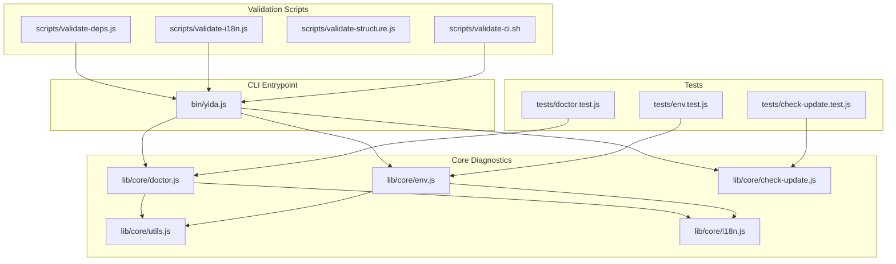
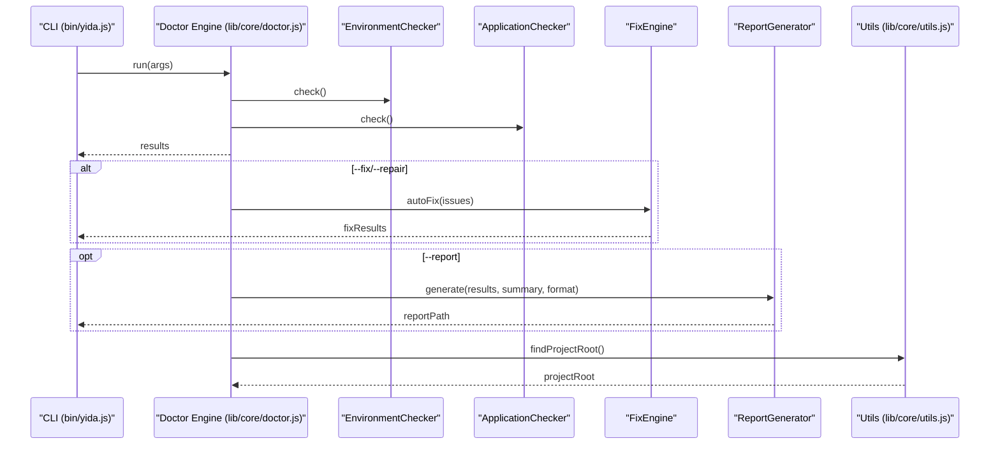
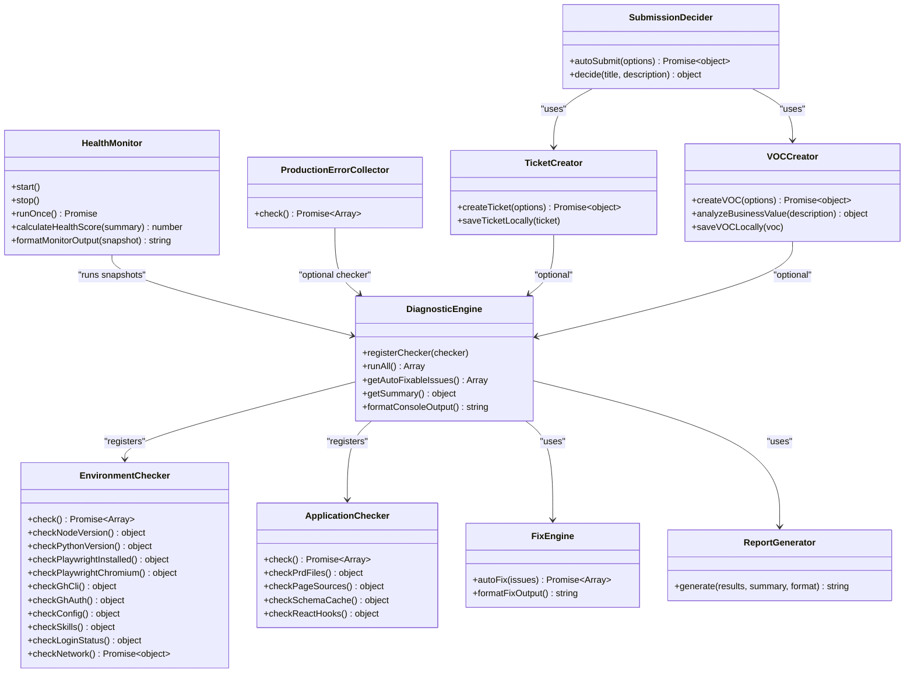
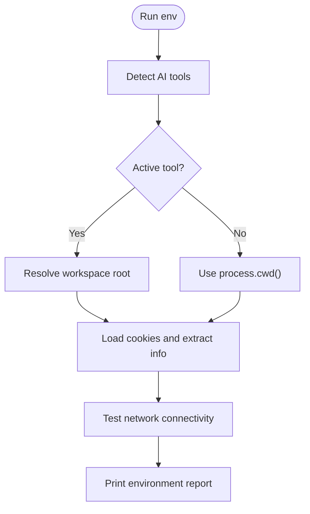
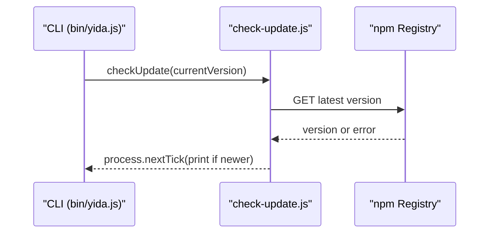
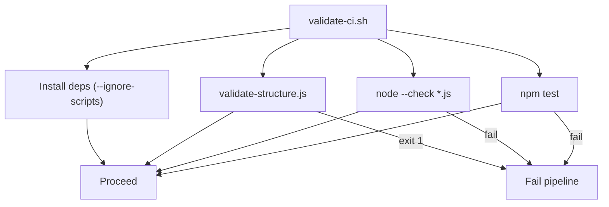
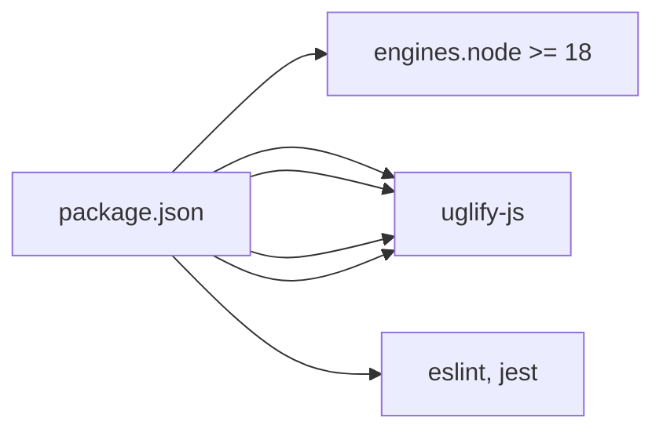

# Development Tools & Diagnostics

<cite>
**Referenced Files in This Document**
- [bin/yida.js](file://bin/yida.js)
- [lib/core/doctor.js](file://lib/core/doctor.js)
- [lib/core/env.js](file://lib/core/env.js)
- [lib/core/utils.js](file://lib/core/utils.js)
- [lib/core/check-update.js](file://lib/core/check-update.js)
- [lib/core/i18n.js](file://lib/core/i18n.js)
- [scripts/validate-deps.js](file://scripts/validate-deps.js)
- [scripts/validate-i18n.js](file://scripts/validate-i18n.js)
- [scripts/validate-structure.js](file://scripts/validate-structure.js)
- [scripts/validate-ci.sh](file://scripts/validate-ci.sh)
- [package.json](file://package.json)
- [tests/doctor.test.js](file://tests/doctor.test.js)
- [tests/check-update.test.js](file://tests/check-update.test.js)
- [tests/env.test.js](file://tests/env.test.js)
</cite>

## Table of Contents
1. [Introduction](#introduction)
2. [Project Structure](#project-structure)
3. [Core Components](#core-components)
4. [Architecture Overview](#architecture-overview)
5. [Detailed Component Analysis](#detailed-component-analysis)
6. [Dependency Analysis](#dependency-analysis)
7. [Performance Considerations](#performance-considerations)
8. [Troubleshooting Guide](#troubleshooting-guide)
9. [Conclusion](#conclusion)
10. [Appendices](#appendices)

## Introduction
This document describes the development tools and diagnostics capabilities of OpenYida, focusing on the doctor command for environment diagnostics, auto-fix workflows, and broader maintenance tooling. It explains the update checking system, dependency validation, structural integrity checks, and the validation framework for code quality, dependency management, and internationalization compliance. Advanced features such as performance monitoring, error tracking, and health reporting are documented alongside integration points for CI/CD pipelines, automated testing, and deployment validation. Practical examples and troubleshooting workflows are included to support day-to-day development and maintenance tasks.

## Project Structure
OpenYida organizes its CLI and diagnostics under a clear separation of concerns:
- Command entrypoint: bin/yida.js
- Core modules: lib/core (doctor, env, utils, i18n, check-update)
- Validation scripts: scripts (validate-deps, validate-i18n, validate-structure, validate-ci.sh)
- Tests: tests (doctor.test.js, check-update.test.js, env.test.js)
- Package metadata and scripts: package.json

**Diagram sources**
- [bin/yida.js:1-521](file://bin/yida.js#L1-L521)
- [lib/core/doctor.js:1-1504](file://lib/core/doctor.js#L1-L1504)
- [lib/core/env.js:1-171](file://lib/core/env.js#L1-L171)
- [lib/core/utils.js:1-463](file://lib/core/utils.js#L1-L463)
- [lib/core/check-update.js:1-71](file://lib/core/check-update.js#L1-L71)
- [lib/core/i18n.js:1-174](file://lib/core/i18n.js#L1-L174)
- [scripts/validate-deps.js:1-172](file://scripts/validate-deps.js#L1-L172)
- [scripts/validate-i18n.js:1-247](file://scripts/validate-i18n.js#L1-L247)
- [scripts/validate-structure.js:1-67](file://scripts/validate-structure.js#L1-L67)
- [scripts/validate-ci.sh:1-25](file://scripts/validate-ci.sh#L1-L25)
- [tests/doctor.test.js:1-826](file://tests/doctor.test.js#L1-L826)
- [tests/check-update.test.js:1-155](file://tests/check-update.test.js#L1-L155)
- [tests/env.test.js:1-163](file://tests/env.test.js#L1-L163)

**Section sources**
- [bin/yida.js:1-521](file://bin/yida.js#L1-L521)
- [package.json:1-74](file://package.json#L1-L74)

## Core Components
- Doctor diagnostics engine: orchestrates environment and application checks, auto-fix, reporting, and optional health monitoring.
- Environment detector: inspects AI tool environments, project roots, login status, and network connectivity.
- Utility helpers: project root discovery, cookie parsing, base URL resolution, HTTP helpers, and auto-login/retry logic.
- Internationalization: runtime language detection, translation loading, and fallback behavior.
- Update checker: asynchronous version check against npm registry with graceful failure.
- Validation scripts: dependency path validation, i18n completeness, structural integrity, and CI pipeline runner.

**Section sources**
- [lib/core/doctor.js:1-1504](file://lib/core/doctor.js#L1-L1504)
- [lib/core/env.js:1-171](file://lib/core/env.js#L1-L171)
- [lib/core/utils.js:1-463](file://lib/core/utils.js#L1-L463)
- [lib/core/i18n.js:1-174](file://lib/core/i18n.js#L1-L174)
- [lib/core/check-update.js:1-71](file://lib/core/check-update.js#L1-L71)
- [scripts/validate-deps.js:1-172](file://scripts/validate-deps.js#L1-L172)
- [scripts/validate-i18n.js:1-247](file://scripts/validate-i18n.js#L1-L247)
- [scripts/validate-structure.js:1-67](file://scripts/validate-structure.js#L1-L67)
- [scripts/validate-ci.sh:1-25](file://scripts/validate-ci.sh#L1-L25)

## Architecture Overview
The doctor command integrates multiple subsystems:
- CLI routing in bin/yida.js dispatches to doctor and other commands.
- Doctor orchestrates checkers (environment and application), applies fixes, generates reports, and optionally monitors health.
- Utilities provide shared infrastructure for environment detection, authentication, and HTTP operations.
- Validation scripts enforce structural and i18n standards and are integrated into CI.

**Diagram sources**
- [bin/yida.js:337-341](file://bin/yida.js#L337-L341)
- [lib/core/doctor.js:1366-1488](file://lib/core/doctor.js#L1366-L1488)
- [lib/core/doctor.js:1450-1456](file://lib/core/doctor.js#L1450-L1456)
- [lib/core/utils.js:121-133](file://lib/core/utils.js#L121-L133)

## Detailed Component Analysis

### Doctor Diagnostics Engine
The doctor command provides:
- Environment checks: Node.js version, Python/Playwright/gh CLI presence, config.json, Skills, login status, network connectivity.
- Application checks: PRD presence, page sources, schema cache validity, React Hooks usage rules.
- Auto-fix: automatic remediation for certain issues (e.g., create config.json, delete invalid schema cache) and manual/command prompts for others.
- Reporting: JSON, Markdown, HTML report generation with summary and detailed results.
- Monitoring: periodic health snapshots with scoring and trend display.
- Production diagnostics: collects and analyzes error logs for a given app ID.
- Automation: creates tickets (GitHub Issues) and VOCs (business value requests), with intelligent submission decisions.

**Diagram sources**
- [lib/core/doctor.js:50-129](file://lib/core/doctor.js#L50-L129)
- [lib/core/doctor.js:137-438](file://lib/core/doctor.js#L137-L438)
- [lib/core/doctor.js:446-631](file://lib/core/doctor.js#L446-L631)
- [lib/core/doctor.js:639-733](file://lib/core/doctor.js#L639-L733)
- [lib/core/doctor.js:741-863](file://lib/core/doctor.js#L741-L863)
- [lib/core/doctor.js:871-916](file://lib/core/doctor.js#L871-L916)
- [lib/core/doctor.js:924-1003](file://lib/core/doctor.js#L924-L1003)
- [lib/core/doctor.js:1011-1074](file://lib/core/doctor.js#L1011-L1074)
- [lib/core/doctor.js:1082-1138](file://lib/core/doctor.js#L1082-L1138)
- [lib/core/doctor.js:1146-1228](file://lib/core/doctor.js#L1146-L1228)
- [lib/core/doctor.js:1236-1305](file://lib/core/doctor.js#L1236-L1305)

**Section sources**
- [lib/core/doctor.js:1307-1488](file://lib/core/doctor.js#L1307-L1488)
- [tests/doctor.test.js:1-826](file://tests/doctor.test.js#L1-L826)

### Environment Detection
The env command detects:
- Installed AI tools and determines the active tool and project root.
- System information (OS, Node.js version, home and working directories).
- Login status (base URL, corp/user IDs, CSRF token).
- Network connectivity to the platform endpoint.

**Diagram sources**
- [lib/core/env.js:47-76](file://lib/core/env.js#L47-L76)
- [lib/core/env.js:80-90](file://lib/core/env.js#L80-L90)
- [lib/core/env.js:95-168](file://lib/core/env.js#L95-L168)
- [lib/core/utils.js:121-133](file://lib/core/utils.js#L121-L133)

**Section sources**
- [lib/core/env.js:1-171](file://lib/core/env.js#L1-L171)
- [tests/env.test.js:1-163](file://tests/env.test.js#L1-L163)

### Update Checking System
Asynchronously checks the npm registry for newer versions and prints a friendly message if available. Designed to not block the main command flow.

**Diagram sources**
- [bin/yida.js:58-59](file://bin/yida.js#L58-L59)
- [lib/core/check-update.js:56-68](file://lib/core/check-update.js#L56-L68)

**Section sources**
- [lib/core/check-update.js:1-71](file://lib/core/check-update.js#L1-L71)
- [tests/check-update.test.js:1-155](file://tests/check-update.test.js#L1-L155)

### Validation Framework
- Dependency validation: scans lib/ and bin/ for relative require paths and verifies targets exist.
- Internationalization validation: ensures language packs exist, keys match baseline, no hard-coded Chinese in CLI, and no empty translations.
- Structural integrity: checks required directories/files and validates engines.node.
- CI runner: installs deps, validates structure, checks JS syntax, runs tests.

**Diagram sources**
- [scripts/validate-ci.sh:1-25](file://scripts/validate-ci.sh#L1-L25)
- [scripts/validate-structure.js:1-67](file://scripts/validate-structure.js#L1-L67)
- [scripts/validate-deps.js:1-172](file://scripts/validate-deps.js#L1-L172)
- [scripts/validate-i18n.js:1-247](file://scripts/validate-i18n.js#L1-L247)

**Section sources**
- [scripts/validate-deps.js:1-172](file://scripts/validate-deps.js#L1-L172)
- [scripts/validate-i18n.js:1-247](file://scripts/validate-i18n.js#L1-L247)
- [scripts/validate-structure.js:1-67](file://scripts/validate-structure.js#L1-L67)
- [scripts/validate-ci.sh:1-25](file://scripts/validate-ci.sh#L1-L25)

### Internationalization Compliance
- Language detection via environment variables and system locale.
- Lazy-loading of translation dictionaries with fallback to Chinese.
- Translation interpolation supporting positional placeholders.
- CLI enforces absence of hard-coded Chinese strings and validates translation completeness.

**Section sources**
- [lib/core/i18n.js:1-174](file://lib/core/i18n.js#L1-L174)
- [scripts/validate-i18n.js:1-247](file://scripts/validate-i18n.js#L1-L247)

### Advanced Features: Performance Monitoring, Error Tracking, Health Reporting
- HealthMonitor periodically runs diagnostics and computes a health score based on pass rates and penalties for errors/warnings.
- ProductionErrorCollector reads cached error logs for a given app ID and surfaces warnings if present.
- ReportGenerator produces structured reports in multiple formats for audit and sharing.

**Section sources**
- [lib/core/doctor.js:924-1003](file://lib/core/doctor.js#L924-L1003)
- [lib/core/doctor.js:1011-1074](file://lib/core/doctor.js#L1011-L1074)
- [lib/core/doctor.js:741-863](file://lib/core/doctor.js#L741-L863)

### Extensibility Model
- Add new checkers by implementing a class with a check() method that returns an array of diagnostic items with id, label, passed, severity, optional message, and fix metadata.
- Register the checker in DiagnosticEngine and optionally wire auto-fix actions in FixEngine.
- Extend ReportGenerator to support new formats or additional metadata.

**Section sources**
- [lib/core/doctor.js:50-129](file://lib/core/doctor.js#L50-L129)
- [lib/core/doctor.js:639-733](file://lib/core/doctor.js#L639-L733)

## Dependency Analysis
- Runtime dependencies include Playwright and related packages for browser automation and QR login flows.
- Dev/test dependencies include ESLint and Jest for linting and testing.
- Engines requirement enforces Node.js version compatibility.

**Diagram sources**
- [package.json:50-73](file://package.json#L50-L73)

**Section sources**
- [package.json:1-74](file://package.json#L1-L74)

## Performance Considerations
- Asynchronous update checks avoid blocking CLI startup.
- HealthMonitor runs periodic snapshots with configurable intervals; tune intervalMs to balance overhead and responsiveness.
- Report generation writes files to .cache; ensure adequate disk space and permissions.
- Network-dependent checks (login status, network connectivity) include timeouts and graceful fallbacks.

[No sources needed since this section provides general guidance]

## Troubleshooting Guide

### Common Diagnostic Scenarios
- Environment not detected: run yida env to confirm AI tool activation and project root resolution.
- Login issues: verify cookies and CSRF token; use yida login to refresh or re-authenticate.
- Missing config.json: run yida doctor --fix to auto-create a template; review and customize.
- Invalid schema cache: run yida doctor --fix to remove corrupted files.
- Network connectivity failures: check firewall/proxy; doctor will surface warnings for aliwork.com connectivity.

**Section sources**
- [lib/core/env.js:95-168](file://lib/core/env.js#L95-L168)
- [lib/core/doctor.js:1366-1488](file://lib/core/doctor.js#L1366-L1488)

### Maintenance Procedures
- Regularly run yida doctor to catch environment and application issues early.
- Use yida doctor --report to generate audit-ready reports.
- Enable yida doctor --monitor for continuous health tracking during development sprints.
- Integrate scripts/validate-ci.sh into CI to prevent regressions.

**Section sources**
- [scripts/validate-ci.sh:1-25](file://scripts/validate-ci.sh#L1-L25)
- [lib/core/doctor.js:1366-1488](file://lib/core/doctor.js#L1366-L1488)

### Integration with CI/CD Pipelines
- Use validate-ci.sh to standardize pre-flight checks across environments.
- Validate-deps.js prevents broken internal imports after refactors.
- validate-i18n.js enforces translation completeness and avoids hard-coded strings.
- validate-structure.js ensures repository layout consistency.

**Section sources**
- [scripts/validate-ci.sh:1-25](file://scripts/validate-ci.sh#L1-L25)
- [scripts/validate-deps.js:1-172](file://scripts/validate-deps.js#L1-L172)
- [scripts/validate-i18n.js:1-247](file://scripts/validate-i18n.js#L1-L247)
- [scripts/validate-structure.js:1-67](file://scripts/validate-structure.js#L1-L67)

## Conclusion
OpenYida’s diagnostics and development tools provide a robust foundation for maintaining a healthy development environment, validating code quality, and ensuring reliable deployments. The doctor command centralizes environment and application checks, auto-fixes, reporting, and monitoring, while validation scripts and CI integration enforce structural and internationalization standards. Together, these capabilities improve system reliability and developer productivity.

[No sources needed since this section summarizes without analyzing specific files]

## Appendices

### Practical Examples Index
- Environment detection: yida env
- Auto-fix configuration issues: yida doctor --fix
- Generate diagnostic reports: yida doctor --report markdown
- Continuous health monitoring: yida doctor --monitor
- Production error analysis: yida doctor --production --app <appId>
- Ticket/VOC creation and auto-submission: interactive prompts via doctor

**Section sources**
- [bin/yida.js:30-50](file://bin/yida.js#L30-L50)
- [lib/core/doctor.js:1307-1488](file://lib/core/doctor.js#L1307-L1488)