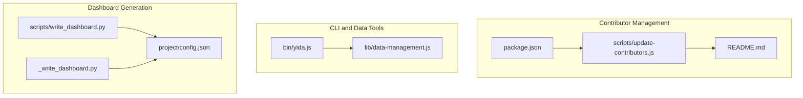
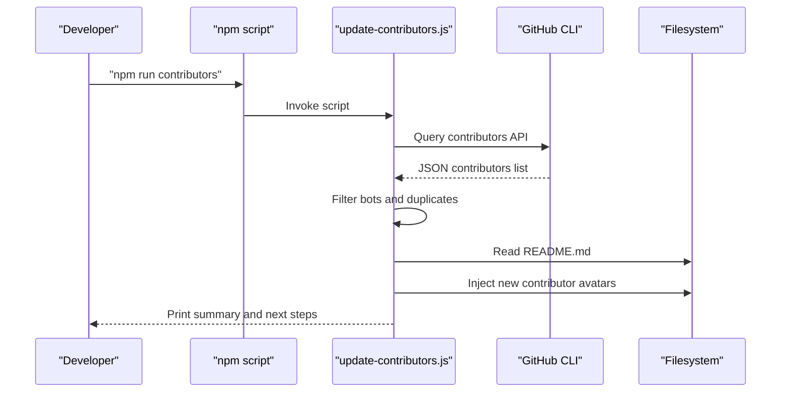
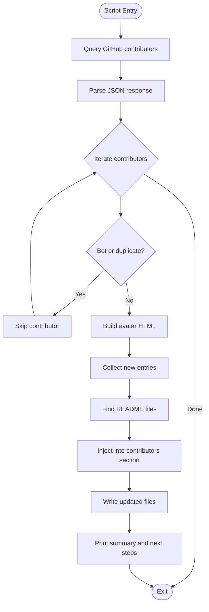
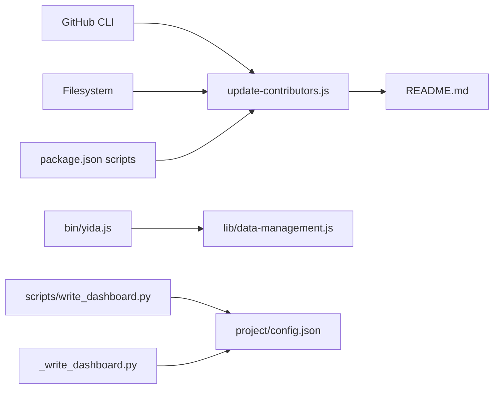

# Contributor Management System

<cite>
**Referenced Files in This Document**
- [update-contributors.js](file://scripts/update-contributors.js)
- [package.json](file://package.json)
- [README.md](file://README.md)
- [CHANGELOG.md](file://CHANGELOG.md)
- [yida.js](file://bin/yida.js)
- [data-management.js](file://lib/data-management.js)
- [write_dashboard.py](file://scripts/write_dashboard.py)
- [_write_dashboard.py](file://project/pages/src/_write_dashboard.py)
- [config.json](file://project/config.json)
</cite>

## Table of Contents
1. [Introduction](#introduction)
2. [Project Structure](#project-structure)
3. [Core Components](#core-components)
4. [Architecture Overview](#architecture-overview)
5. [Detailed Component Analysis](#detailed-component-analysis)
6. [Dependency Analysis](#dependency-analysis)
7. [Performance Considerations](#performance-considerations)
8. [Troubleshooting Guide](#troubleshooting-guide)
9. [Conclusion](#conclusion)
10. [Appendices](#appendices)

## Introduction
This document describes OpenYida’s contributor management system, focusing on the automated process that maintains contributor recognition and project metadata. It explains how contributor data is synchronized from GitHub, how the system identifies and adds new contributors to README files, and how this contributes to project transparency and community engagement. It also covers integration points with dashboard generation tools and outlines customization options for contributor recognition criteria, data sources, and update scheduling.

## Project Structure
The contributor management system spans a small set of focused files:
- A Node.js script that queries GitHub contributors and updates README files
- A package.json script alias that invokes the contributor updater
- The README files that host contributor avatars and links
- Supporting CLI and data management utilities that enable broader project tooling

**Diagram sources**
- [update-contributors.js:1-153](file://scripts/update-contributors.js#L1-L153)
- [package.json:20-28](file://package.json#L20-L28)
- [README.md:1-200](file://README.md#L1-L200)
- [yida.js:1-521](file://bin/yida.js#L1-L521)
- [data-management.js:1-363](file://lib/data-management.js#L1-L363)
- [write_dashboard.py:1-499](file://scripts/write_dashboard.py#L1-L499)
- [_write_dashboard.py:1-381](file://project/pages/src/_write_dashboard.py#L1-L381)
- [config.json:1-5](file://project/config.json#L1-L5)

**Section sources**
- [update-contributors.js:1-153](file://scripts/update-contributors.js#L1-L153)
- [package.json:20-28](file://package.json#L20-L28)
- [README.md:1-200](file://README.md#L1-L200)
- [yida.js:1-521](file://bin/yida.js#L1-L521)
- [data-management.js:1-363](file://lib/data-management.js#L1-L363)
- [write_dashboard.py:1-499](file://scripts/write_dashboard.py#L1-L499)
- [_write_dashboard.py:1-381](file://project/pages/src/_write_dashboard.py#L1-L381)
- [config.json:1-5](file://project/config.json#L1-L5)

## Core Components
- Contributor Updater Script: Queries GitHub contributors via the GitHub CLI, filters bots and duplicates, and injects new contributor avatars into README files.
- Package Script Alias: Provides a convenient npm script to run the updater.
- README Templates: Contain a dedicated contributors section where avatars are inserted.
- CLI and Data Management: Support broader project operations and can be extended to integrate contributor data into reports or dashboards.
- Dashboard Generation Scripts: Produce custom page assets and can be adapted to include contributor information in project dashboards.

Key responsibilities:
- Automated synchronization of contributor metadata from GitHub
- Deduplication and bot filtering
- Safe, targeted updates to README files
- Integration with project documentation and dashboards

**Section sources**
- [update-contributors.js:1-153](file://scripts/update-contributors.js#L1-L153)
- [package.json:20-28](file://package.json#L20-L28)
- [README.md:1-200](file://README.md#L1-L200)
- [data-management.js:1-363](file://lib/data-management.js#L1-L363)
- [write_dashboard.py:1-499](file://scripts/write_dashboard.py#L1-L499)
- [_write_dashboard.py:1-381](file://project/pages/src/_write_dashboard.py#L1-L381)

## Architecture Overview
The contributor management pipeline is a lightweight, external-data-driven process:

**Diagram sources**
- [update-contributors.js:1-153](file://scripts/update-contributors.js#L1-L153)
- [package.json:20-28](file://package.json#L20-L28)

## Detailed Component Analysis

### Contributor Updater Script
Responsibilities:
- Authenticate and query GitHub contributors using the GitHub CLI
- Parse response and filter out bots and existing contributors
- Generate avatar HTML blocks matching existing README format
- Locate README files and inject new contributor entries into the designated section
- Provide actionable post-update guidance

Processing logic highlights:
- Uses pagination and a generous buffer for large contributor sets
- Extracts existing usernames from README anchors to prevent duplicates
- Applies regex patterns to match the contributors section and append new entries
- Writes updated content back to each README file and reports counts

**Diagram sources**
- [update-contributors.js:1-153](file://scripts/update-contributors.js#L1-L153)

**Section sources**
- [update-contributors.js:1-153](file://scripts/update-contributors.js#L1-L153)

### Package Script Alias
- The npm script alias delegates to the updater script, enabling a simple command to refresh contributor lists.

**Section sources**
- [package.json:20-28](file://package.json#L20-L28)

### README Templates
- The README files include a dedicated contributors section identified by a specific anchor, into which new contributor avatars are injected.

**Section sources**
- [README.md:1-200](file://README.md#L1-L200)

### CLI and Data Management Integration
- The CLI routes commands and supports data operations that can be leveraged to fetch and process project-related data.
- Data management utilities provide a consistent pattern for authenticated requests and parameter handling, which can inspire similar patterns for extending contributor data retrieval from other sources.

**Section sources**
- [yida.js:1-521](file://bin/yida.js#L1-L521)
- [data-management.js:1-363](file://lib/data-management.js#L1-L363)

### Dashboard Generation Integration
- Dashboard generation scripts produce custom page assets and demonstrate patterns for writing structured content to files.
- These scripts can be adapted to incorporate contributor information into project dashboards, ensuring that contributor metadata appears alongside project metrics and insights.

**Section sources**
- [write_dashboard.py:1-499](file://scripts/write_dashboard.py#L1-L499)
- [_write_dashboard.py:1-381](file://project/pages/src/_write_dashboard.py#L1-L381)
- [config.json:1-5](file://project/config.json#L1-L5)

## Dependency Analysis
- External dependencies:
  - GitHub CLI for authenticated API access
  - Node.js built-in modules for process execution, filesystem, and path handling
- Internal dependencies:
  - README templates define the target location for contributor injection
  - Package scripts provide a single entry point for the updater
  - CLI and data management modules offer patterns for robust command-line and data operations

**Diagram sources**
- [update-contributors.js:1-153](file://scripts/update-contributors.js#L1-L153)
- [package.json:20-28](file://package.json#L20-L28)
- [README.md:1-200](file://README.md#L1-L200)
- [yida.js:1-521](file://bin/yida.js#L1-L521)
- [data-management.js:1-363](file://lib/data-management.js#L1-L363)
- [write_dashboard.py:1-499](file://scripts/write_dashboard.py#L1-L499)
- [_write_dashboard.py:1-381](file://project/pages/src/_write_dashboard.py#L1-L381)
- [config.json:1-5](file://project/config.json#L1-L5)

**Section sources**
- [update-contributors.js:1-153](file://scripts/update-contributors.js#L1-L153)
- [package.json:20-28](file://package.json#L20-L28)
- [README.md:1-200](file://README.md#L1-L200)
- [yida.js:1-521](file://bin/yida.js#L1-L521)
- [data-management.js:1-363](file://lib/data-management.js#L1-L363)
- [write_dashboard.py:1-499](file://scripts/write_dashboard.py#L1-L499)
- [_write_dashboard.py:1-381](file://project/pages/src/_write_dashboard.py#L1-L381)
- [config.json:1-5](file://project/config.json#L1-L5)

## Performance Considerations
- Pagination and buffer sizing: The updater uses pagination and a large buffer to handle repositories with many contributors efficiently.
- Minimal I/O: Updates are performed in-memory and written back in batches per README file.
- Regex-based parsing: The contributors section is matched using a targeted regex to minimize accidental edits.
- Idempotency: Existing contributor entries are skipped to avoid redundant writes.

[No sources needed since this section provides general guidance]

## Troubleshooting Guide
Common issues and resolutions:
- GitHub CLI not installed or not logged in:
  - Ensure the GitHub CLI is installed and authenticated before running the script.
- Empty or missing contributor data:
  - Verify network connectivity and permissions; the script logs API failures.
- README file read/write errors:
  - Confirm file permissions and that the contributors section exists in the target README files.
- No new contributors detected:
  - Check bot filters and ensure usernames are not already present in the contributors section.
- Post-update verification:
  - Review diffs and confirm avatar alignment with existing styles.

Operational tips:
- Use the printed guidance to review changes and commit them manually after inspection.
- Keep README templates consistent to maintain reliable regex matching.

**Section sources**
- [update-contributors.js:1-153](file://scripts/update-contributors.js#L1-L153)

## Conclusion
OpenYida’s contributor management system automates the maintenance of contributor recognition through a straightforward, reliable pipeline. By sourcing data from GitHub, filtering bots and duplicates, and injecting avatars into README files, it ensures project transparency and community appreciation. The system integrates cleanly with the project’s CLI and can be extended to incorporate contributor data into dashboards and reports, further enhancing visibility and engagement.

[No sources needed since this section summarizes without analyzing specific files]

## Appendices

### Practical Examples
- Running the contributor update:
  - Execute the npm script to refresh contributor lists across README files.
- Verifying changes:
  - Inspect diffs and confirm new avatars appear in the contributors section.
- Integrating with dashboards:
  - Adapt dashboard generation scripts to embed contributor metadata alongside project metrics.

**Section sources**
- [package.json:20-28](file://package.json#L20-L28)
- [update-contributors.js:1-153](file://scripts/update-contributors.js#L1-L153)
- [README.md:1-200](file://README.md#L1-L200)
- [write_dashboard.py:1-499](file://scripts/write_dashboard.py#L1-L499)
- [_write_dashboard.py:1-381](file://project/pages/src/_write_dashboard.py#L1-L381)

### Customization Options
- Recognition criteria:
  - Adjust bot filtering patterns and duplicate detection logic to fit project policies.
- Data sources:
  - Extend the updater to pull contributor data from alternative sources while preserving the README injection format.
- Update scheduling:
  - Integrate the npm script into CI workflows or manual release procedures to keep contributor lists current.

**Section sources**
- [update-contributors.js:63-98](file://scripts/update-contributors.js#L63-L98)
- [CHANGELOG.md:47-47](file://CHANGELOG.md#L47-L47)