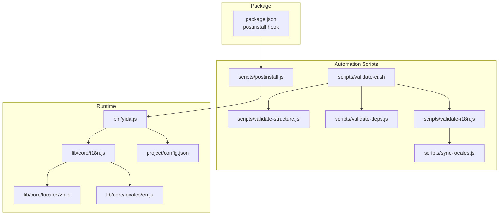
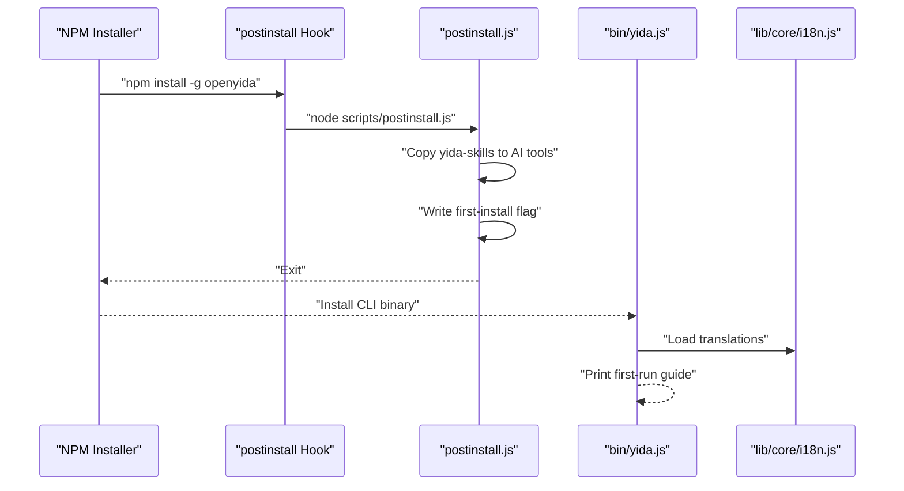
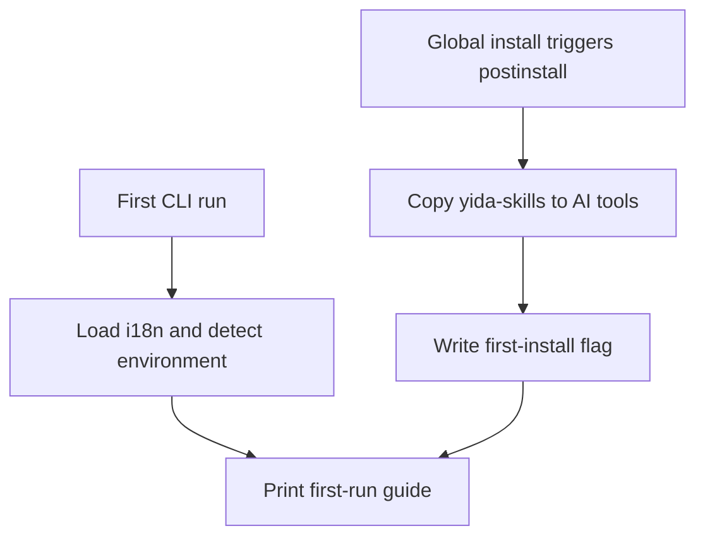
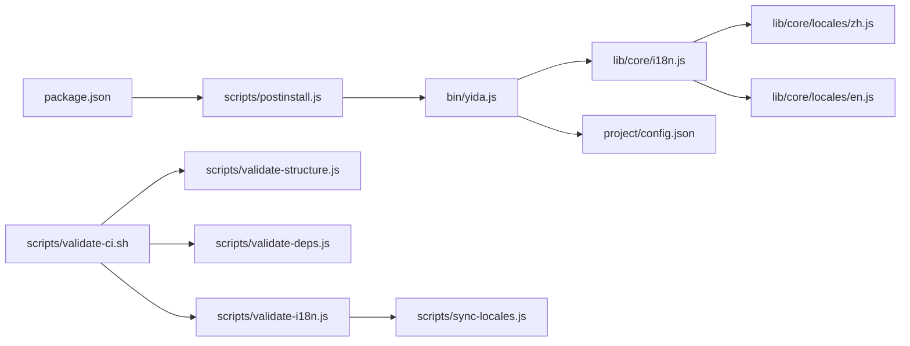

# Installation & Setup Automation

<cite>
**Referenced Files in This Document**
- [package.json](file://package.json)
- [bin/yida.js](file://bin/yida.js)
- [scripts/postinstall.js](file://scripts/postinstall.js)
- [scripts/validate-structure.js](file://scripts/validate-structure.js)
- [scripts/validate-deps.js](file://scripts/validate-deps.js)
- [scripts/validate-i18n.js](file://scripts/validate-i18n.js)
- [scripts/sync-locales.js](file://scripts/sync-locales.js)
- [scripts/validate-ci.sh](file://scripts/validate-ci.sh)
- [lib/core/i18n.js](file://lib/core/i18n.js)
- [lib/core/locales/zh.js](file://lib/core/locales/zh.js)
- [lib/core/locales/en.js](file://lib/core/locales/en.js)
- [lib/core/check-update.js](file://lib/core/check-update.js)
- [project/config.json](file://project/config.json)
</cite>

## Table of Contents
1. [Introduction](#introduction)
2. [Project Structure](#project-structure)
3. [Core Components](#core-components)
4. [Architecture Overview](#architecture-overview)
5. [Detailed Component Analysis](#detailed-component-analysis)
6. [Dependency Analysis](#dependency-analysis)
7. [Performance Considerations](#performance-considerations)
8. [Troubleshooting Guide](#troubleshooting-guide)
9. [Conclusion](#conclusion)
10. [Appendices](#appendices)

## Introduction
This document explains OpenYida’s installation and setup automation system. It covers:
- Post-installation automation that integrates AI tools and prints a guided welcome experience
- Project structure validation ensuring required directories and files exist
- Internationalization synchronization to keep translation files consistent across languages
- Practical examples for running automation, customizing parameters, and troubleshooting failures
- The relationship between installation automation and system initialization, and how these improve reliability

## Project Structure
OpenYida organizes automation around a small set of scripts and a CLI entrypoint:
- Scripts under scripts/ implement validation, synchronization, and post-installation tasks
- bin/yida.js is the CLI entrypoint that also provides a first-run guide
- package.json defines the postinstall lifecycle hook and runtime requirements
- lib/core/locales holds language packs synchronized by the locale sync script
- project/config.json centralizes environment configuration

**Diagram sources**
- [package.json:20-29](file://package.json#L20-L29)
- [scripts/postinstall.js:1-215](file://scripts/postinstall.js#L1-L215)
- [scripts/validate-structure.js:1-67](file://scripts/validate-structure.js#L1-L67)
- [scripts/validate-deps.js:1-172](file://scripts/validate-deps.js#L1-L172)
- [scripts/validate-i18n.js:1-247](file://scripts/validate-i18n.js#L1-L247)
- [scripts/sync-locales.js:1-289](file://scripts/sync-locales.js#L1-L289)
- [scripts/validate-ci.sh:1-25](file://scripts/validate-ci.sh#L1-L25)
- [bin/yida.js:1-521](file://bin/yida.js#L1-L521)
- [lib/core/i18n.js:1-174](file://lib/core/i18n.js#L1-L174)
- [lib/core/locales/zh.js:1-785](file://lib/core/locales/zh.js#L1-L785)
- [lib/core/locales/en.js:1-800](file://lib/core/locales/en.js#L1-L800)
- [project/config.json:1-5](file://project/config.json#L1-L5)

**Section sources**
- [package.json:1-74](file://package.json#L1-L74)
- [scripts/validate-ci.sh:1-25](file://scripts/validate-ci.sh#L1-L25)

## Core Components
- Post-installation automation: Copies AI skill packs into supported AI tool config directories, writes a first-install flag, and prints a friendly welcome with usage tips.
- Project structure validator: Ensures required directories and files exist and validates package engine requirements.
- Dependency validator: Scans lib/ and bin/ for invalid relative require() paths and reports missing targets.
- Internationalization validator: Checks completeness and consistency of locales, detects hard-coded Chinese in CLI source, and validates non-empty translations.
- Locale synchronization: Aligns translation keys across languages against a baseline (zh.js), preserving existing translations and removing obsolete keys.

**Section sources**
- [scripts/postinstall.js:1-215](file://scripts/postinstall.js#L1-L215)
- [scripts/validate-structure.js:1-67](file://scripts/validate-structure.js#L1-L67)
- [scripts/validate-deps.js:1-172](file://scripts/validate-deps.js#L1-L172)
- [scripts/validate-i18n.js:1-247](file://scripts/validate-i18n.js#L1-L247)
- [scripts/sync-locales.js:1-289](file://scripts/sync-locales.js#L1-L289)

## Architecture Overview
The installation automation pipeline ties together lifecycle hooks, validation, and localization:

**Diagram sources**
- [package.json:25](file://package.json#L25)
- [scripts/postinstall.js:1-215](file://scripts/postinstall.js#L1-L215)
- [bin/yida.js:73-138](file://bin/yida.js#L73-L138)
- [lib/core/i18n.js:1-174](file://lib/core/i18n.js#L1-L174)

## Detailed Component Analysis

### Post-Installation Automation
Purpose:
- Copy yida-skills into AI tool config roots for supported tools
- Ensure a first-install marker exists
- Print a guided welcome experience with usage tips and shortcuts

Key behaviors:
- Safe execution wrappers prevent failures from aborting the install
- Existing symlinks or directories are removed and replaced with a clean copy
- First-install and first-run flags are written to user home directories
- Colorful, localized welcome messages are printed using the i18n module

Practical usage:
- Triggered automatically after global install via the postinstall script hook
- Can be re-run by invoking the script directly

Customization:
- Modify supported AI tool paths by editing the tool-specific sections
- Adjust welcome message content by updating the print function and locale entries

**Section sources**
- [scripts/postinstall.js:1-215](file://scripts/postinstall.js#L1-L215)
- [bin/yida.js:73-138](file://bin/yida.js#L73-L138)
- [lib/core/i18n.js:1-174](file://lib/core/i18n.js#L1-L174)

### Project Structure Validation
Purpose:
- Enforce a canonical repository layout
- Verify required files and directories exist
- Validate Node.js engine requirement

Behavior:
- Checks for presence of core directories and files
- Reads package.json to ensure engines.node is defined
- Counts JS modules under lib/ and sub-skills under yida-skills/skills
- Exits with failure code if any validation fails

Customization:
- Add or remove required files/directories in the validation lists
- Adjust engine requirement by updating package.json

**Section sources**
- [scripts/validate-structure.js:1-67](file://scripts/validate-structure.js#L1-L67)
- [package.json:70-72](file://package.json#L70-L72)

### Dependency Validation
Purpose:
- Detect broken relative require() paths in lib/ and bin/
- Prevent runtime failures caused by missing modules

Behavior:
- Recursively scans .js files in lib/ and bin/
- Extracts require('./...') and require('../...') patterns
- Resolves paths and checks existence of files or index.js
- Reports all invalid references with file and resolved path

Customization:
- Extend scan directories by modifying the scan list
- Adjust resolution rules by updating the path existence checks

**Section sources**
- [scripts/validate-deps.js:1-172](file://scripts/validate-deps.js#L1-L172)

### Internationalization Validation
Purpose:
- Ensure translation completeness and consistency
- Detect hard-coded Chinese strings in CLI source
- Verify non-empty translation values

Behavior:
- Confirms all expected locale files exist and are loadable
- Compares key sets across locales against the baseline (zh.js)
- Scans CLI source for console outputs containing Chinese without translation calls
- Flags empty translation strings

Customization:
- Add or remove locales from the expected list
- Toggle strict mode to treat missing keys as errors or warnings

**Section sources**
- [scripts/validate-i18n.js:1-247](file://scripts/validate-i18n.js#L1-L247)
- [lib/core/locales/zh.js:1-785](file://lib/core/locales/zh.js#L1-L785)
- [lib/core/locales/en.js:1-800](file://lib/core/locales/en.js#L1-L800)

### Locale Synchronization
Purpose:
- Keep translation files aligned with a single source of truth
- Preserve existing translations, fill missing ones from fallbacks, and prune obsolete keys

Behavior:
- Loads baseline (zh.js) and English (en.js) as reference
- Iterates target locales and reconstructs each file with consistent key structure
- Preserves existing translations when types match the baseline
- Fills missing keys from en.js, then zh.js as last resort
- Removes keys not present in the baseline
- Writes files with preserved comments and formatting

Customization:
- Add or remove target locales by editing the target list
- Use dry-run mode to preview changes before writing

**Section sources**
- [scripts/sync-locales.js:1-289](file://scripts/sync-locales.js#L1-L289)
- [lib/core/locales/zh.js:1-785](file://lib/core/locales/zh.js#L1-L785)
- [lib/core/locales/en.js:1-800](file://lib/core/locales/en.js#L1-L800)

### CI Validation Workflow
Purpose:
- Provide a repeatable, automated pipeline to validate structure, syntax, tests, and i18n

Behavior:
- Installs dependencies (skipping scripts)
- Validates project structure
- Performs JavaScript syntax checks
- Runs tests
- Prints summary

Customization:
- Extend or modify steps in the shell script
- Integrate additional checks (lint, coverage) as needed

**Section sources**
- [scripts/validate-ci.sh:1-25](file://scripts/validate-ci.sh#L1-L25)

### Relationship Between Installation Automation and System Initialization
- Installation automation (postinstall) prepares AI tool integration and first-run markers
- System initialization (CLI first-run) loads i18n, detects environment, and prints a guided experience
- Together, they ensure a smooth onboarding experience and consistent environment setup

**Diagram sources**
- [scripts/postinstall.js:135-147](file://scripts/postinstall.js#L135-L147)
- [bin/yida.js:73-138](file://bin/yida.js#L73-L138)
- [lib/core/i18n.js:1-174](file://lib/core/i18n.js#L1-L174)

## Dependency Analysis
The automation scripts depend on each other and on runtime modules:

**Diagram sources**
- [package.json:20-29](file://package.json#L20-L29)
- [scripts/validate-ci.sh:1-25](file://scripts/validate-ci.sh#L1-L25)
- [scripts/validate-structure.js:1-67](file://scripts/validate-structure.js#L1-L67)
- [scripts/validate-deps.js:1-172](file://scripts/validate-deps.js#L1-L172)
- [scripts/validate-i18n.js:1-247](file://scripts/validate-i18n.js#L1-L247)
- [scripts/sync-locales.js:1-289](file://scripts/sync-locales.js#L1-L289)
- [bin/yida.js:1-521](file://bin/yida.js#L1-L521)
- [lib/core/i18n.js:1-174](file://lib/core/i18n.js#L1-L174)
- [lib/core/locales/zh.js:1-785](file://lib/core/locales/zh.js#L1-L785)
- [lib/core/locales/en.js:1-800](file://lib/core/locales/en.js#L1-L800)
- [project/config.json:1-5](file://project/config.json#L1-L5)

**Section sources**
- [package.json:20-29](file://package.json#L20-L29)
- [scripts/validate-ci.sh:1-25](file://scripts/validate-ci.sh#L1-L25)

## Performance Considerations
- Post-installation copies are performed once per install; subsequent runs skip redundant work
- Locale synchronization reads and writes files in batches; use dry-run to avoid unnecessary writes
- Dependency validation scans all .js files; restrict scan directories if needed for large projects
- CI validation runs sequentially; consider parallelizing independent checks for speed

## Troubleshooting Guide
Common issues and resolutions:
- Missing AI tool integration after install
  - Ensure the AI tool config directories exist and are writable
  - Re-run the postinstall script to re-copy skill packs
  - Verify the tool is supported by the installer

- First-run guide not appearing
  - Confirm the first-run flag file does not exist in the user home directory
  - Manually trigger the CLI to regenerate the flag and print the guide

- Translation inconsistencies
  - Run the i18n validator to identify missing or extra keys
  - Use the locale sync script to reconcile differences across locales

- Broken relative requires
  - Use the dependency validator to locate invalid paths
  - Fix import paths to match actual file locations or add missing files

- CI failures
  - Review the CI script output for failing steps
  - Address structure, syntax, or test failures before merging

**Section sources**
- [scripts/postinstall.js:135-147](file://scripts/postinstall.js#L135-L147)
- [bin/yida.js:73-138](file://bin/yida.js#L73-L138)
- [scripts/validate-i18n.js:1-247](file://scripts/validate-i18n.js#L1-L247)
- [scripts/sync-locales.js:1-289](file://scripts/sync-locales.js#L1-L289)
- [scripts/validate-deps.js:1-172](file://scripts/validate-deps.js#L1-L172)
- [scripts/validate-ci.sh:1-25](file://scripts/validate-ci.sh#L1-L25)

## Conclusion
OpenYida’s installation and setup automation ensures a reliable, consistent developer experience:
- Post-installation integrates AI tools and guides users
- Structural and dependency validations prevent runtime issues
- Internationalization validation and synchronization maintain high-quality translations
- CI validation provides a robust pipeline for quality assurance

Together, these mechanisms improve system reliability and reduce onboarding friction.

## Appendices

### Practical Examples

- Running installation automation
  - Global install triggers postinstall automatically
  - To re-run postinstall: execute the script directly

- Running structure validation
  - node scripts/validate-structure.js

- Running dependency validation
  - node scripts/validate-deps.js

- Running i18n validation
  - node scripts/validate-i18n.js
  - node scripts/validate-i18n.js --strict

- Running locale synchronization
  - node scripts/sync-locales.js
  - node scripts/sync-locales.js --dry-run

- Running CI validation locally
  - scripts/validate-ci.sh

- Customizing setup parameters
  - Modify supported AI tools in the postinstall script
  - Adjust required files/directories in the structure validator
  - Change target locales in the locale sync script
  - Update expected locales in the i18n validator

- Environment configuration
  - Configure base URLs and login endpoints in project/config.json
  - Control language selection via OPENYIDA_LANG or system locale variables

**Section sources**
- [scripts/postinstall.js:1-215](file://scripts/postinstall.js#L1-L215)
- [scripts/validate-structure.js:1-67](file://scripts/validate-structure.js#L1-L67)
- [scripts/validate-deps.js:1-172](file://scripts/validate-deps.js#L1-L172)
- [scripts/validate-i18n.js:1-247](file://scripts/validate-i18n.js#L1-L247)
- [scripts/sync-locales.js:1-289](file://scripts/sync-locales.js#L1-L289)
- [scripts/validate-ci.sh:1-25](file://scripts/validate-ci.sh#L1-L25)
- [project/config.json:1-5](file://project/config.json#L1-L5)
- [lib/core/i18n.js:63-88](file://lib/core/i18n.js#L63-L88)