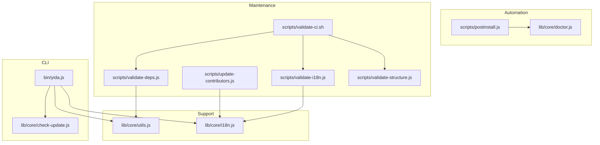
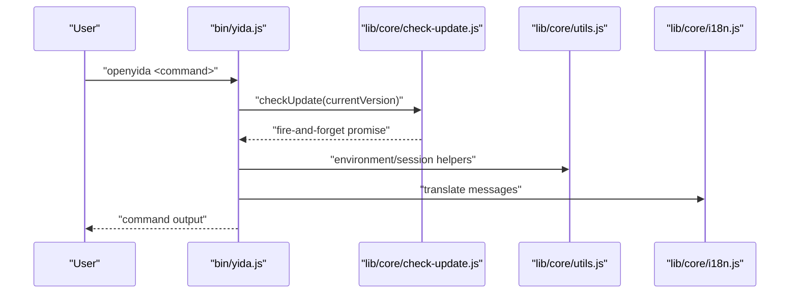
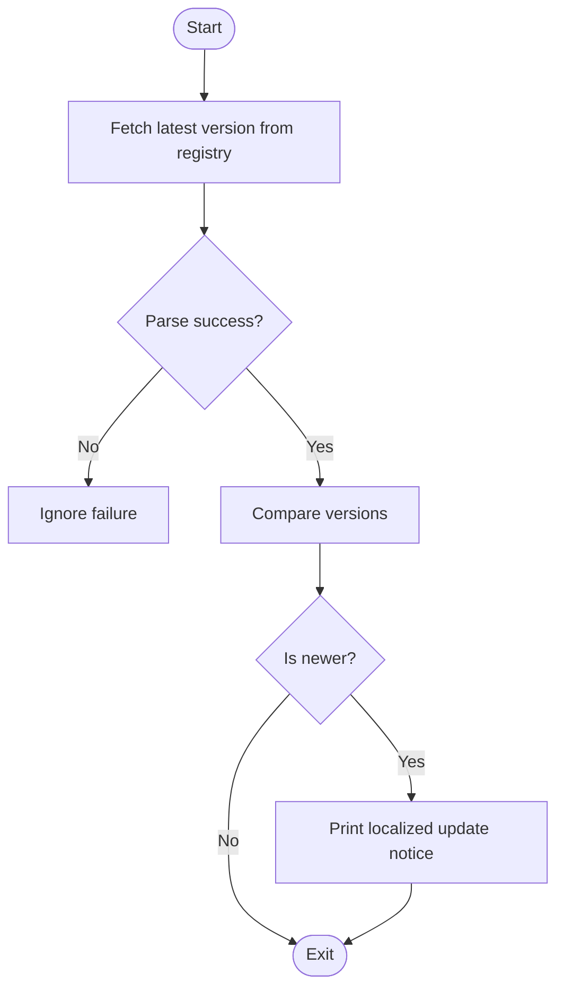
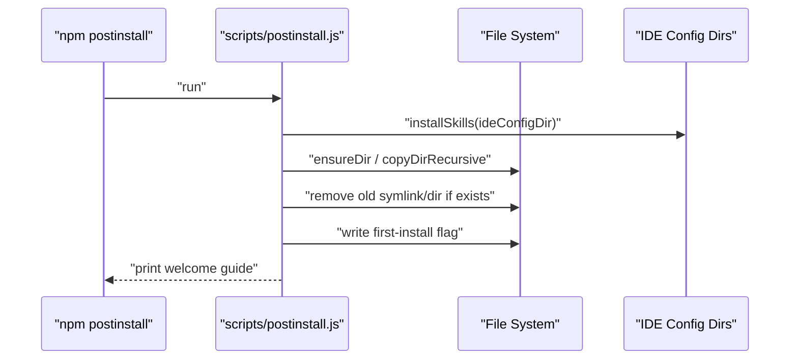
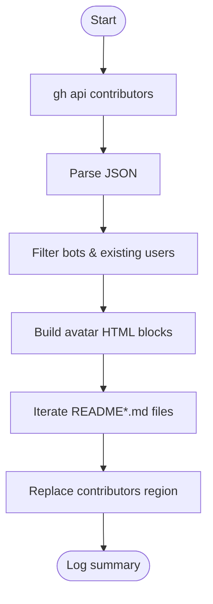
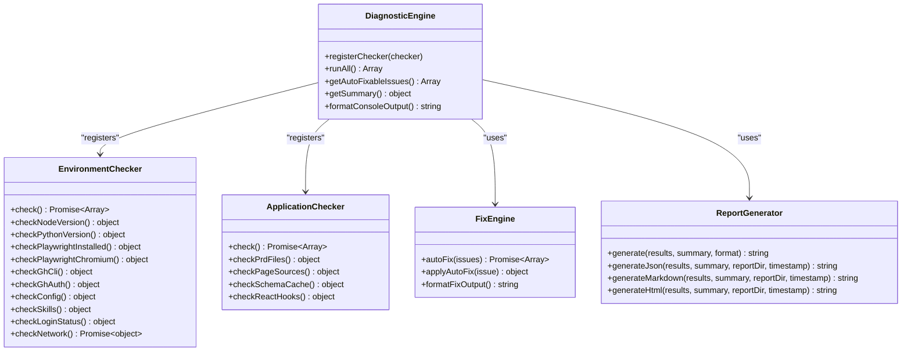
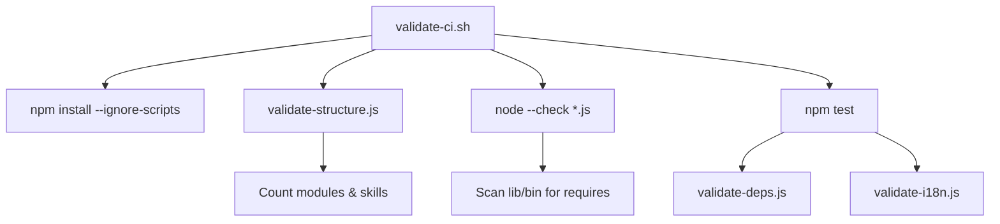
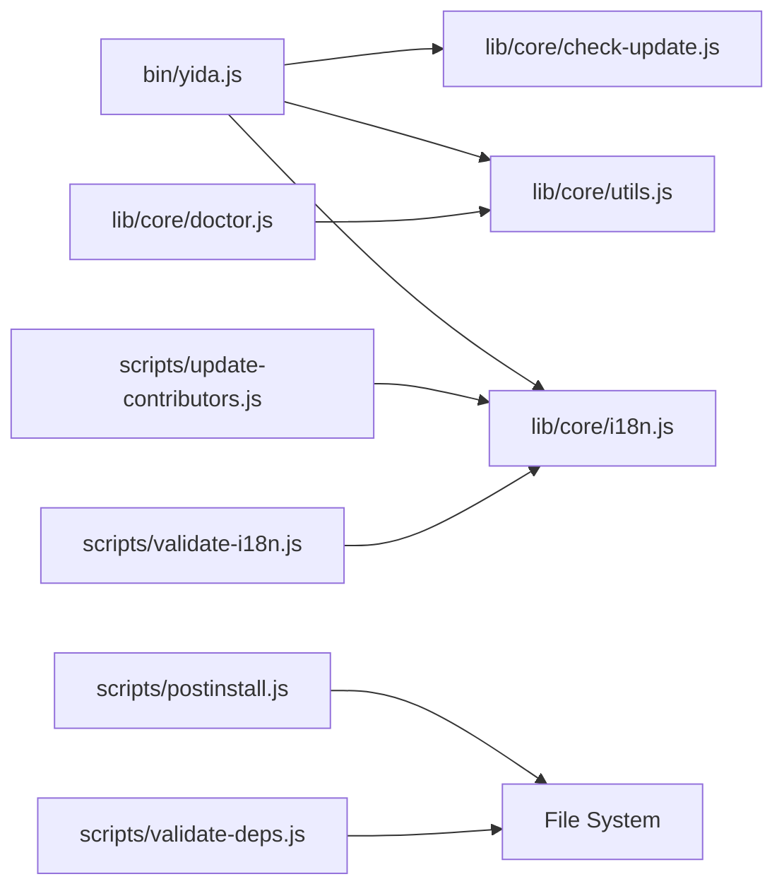

# Maintenance Tools & Automated Tasks

<cite>
**Referenced Files in This Document**
- [package.json](file://package.json)
- [bin/yida.js](file://bin/yida.js)
- [lib/core/check-update.js](file://lib/core/check-update.js)
- [lib/core/doctor.js](file://lib/core/doctor.js)
- [lib/core/utils.js](file://lib/core/utils.js)
- [lib/core/i18n.js](file://lib/core/i18n.js)
- [scripts/postinstall.js](file://scripts/postinstall.js)
- [scripts/update-contributors.js](file://scripts/update-contributors.js)
- [scripts/validate-deps.js](file://scripts/validate-deps.js)
- [scripts/validate-i18n.js](file://scripts/validate-i18n.js)
- [scripts/validate-structure.js](file://scripts/validate-structure.js)
- [scripts/validate-ci.sh](file://scripts/validate-ci.sh)
- [tests/check-update.test.js](file://tests/check-update.test.js)
</cite>

## Table of Contents
1. [Introduction](#introduction)
2. [Project Structure](#project-structure)
3. [Core Components](#core-components)
4. [Architecture Overview](#architecture-overview)
5. [Detailed Component Analysis](#detailed-component-analysis)
6. [Dependency Analysis](#dependency-analysis)
7. [Performance Considerations](#performance-considerations)
8. [Troubleshooting Guide](#troubleshooting-guide)
9. [Conclusion](#conclusion)
10. [Appendices](#appendices)

## Introduction
This document explains OpenYida’s maintenance tools and automated task systems. It covers:
- Update checking for CLI, dependencies, and AI skills
- Post-installation automation for environment setup and skill registration
- Contributor management tools for maintaining contributor lists
- Practical examples for running maintenance tasks, configuring automatic updates, troubleshooting installation issues, and managing contributor data
- How maintenance tools relate to system health, performance monitoring, and proactive issue prevention
- Customization options for maintenance schedules, update preferences, and automated workflows

## Project Structure
OpenYida organizes maintenance and automation across several areas:
- CLI entry and update checking
- Post-installation automation for AI skill registration
- Contributor list management via a dedicated script
- Validation scripts for structure, dependencies, internationalization, and CI
- Doctor diagnostics for system health and environment checks

**Diagram sources**
- [bin/yida.js:54-59](file://bin/yida.js#L54-L59)
- [lib/core/check-update.js:13](file://lib/core/check-update.js#L13)
- [scripts/postinstall.js:94-133](file://scripts/postinstall.js#L94-L133)
- [lib/core/doctor.js:50-129](file://lib/core/doctor.js#L50-L129)
- [scripts/update-contributors.js:16-28](file://scripts/update-contributors.js#L16-L28)
- [scripts/validate-deps.js:23-50](file://scripts/validate-deps.js#L23-L50)
- [scripts/validate-i18n.js:21-28](file://scripts/validate-i18n.js#L21-L28)
- [scripts/validate-structure.js:4-13](file://scripts/validate-structure.js#L4-L13)
- [scripts/validate-ci.sh:4-24](file://scripts/validate-ci.sh#L4-L24)
- [lib/core/utils.js:22-133](file://lib/core/utils.js#L22-L133)
- [lib/core/i18n.js:31-88](file://lib/core/i18n.js#L31-L88)

**Section sources**
- [package.json:20-28](file://package.json#L20-L28)
- [bin/yida.js:54-59](file://bin/yida.js#L54-L59)
- [scripts/postinstall.js:94-133](file://scripts/postinstall.js#L94-L133)
- [scripts/update-contributors.js:31-147](file://scripts/update-contributors.js#L31-147)
- [scripts/validate-deps.js:88-171](file://scripts/validate-deps.js#L88-L171)
- [scripts/validate-i18n.js:63-247](file://scripts/validate-i18n.js#L63-247)
- [scripts/validate-structure.js:17-67](file://scripts/validate-structure.js#L17-L67)
- [scripts/validate-ci.sh:4-24](file://scripts/validate-ci.sh#L4-L24)
- [lib/core/doctor.js:50-129](file://lib/core/doctor.js#L50-L129)
- [lib/core/utils.js:22-133](file://lib/core/utils.js#L22-L133)
- [lib/core/i18n.js:31-88](file://lib/core/i18n.js#L31-L88)

## Core Components
- Update checking: Asynchronous version check against the npm registry, printing a notice when a newer version is available.
- Post-installation automation: Copies AI skills into supported IDE tool configurations, prints a welcome guide, and manages first-run flags.
- Contributor management: Fetches contributors via the GitHub CLI, filters bots, and updates README contributor sections.
- Diagnostics: Comprehensive environment and application checks with auto-fix actions and report generation.
- Validation suite: Ensures project structure, dependency paths, i18n completeness, and CI pipeline correctness.

**Section sources**
- [lib/core/check-update.js:56-68](file://lib/core/check-update.js#L56-L68)
- [scripts/postinstall.js:72-90](file://scripts/postinstall.js#L72-L90)
- [scripts/postinstall.js:137-147](file://scripts/postinstall.js#L137-L147)
- [scripts/update-contributors.js:31-147](file://scripts/update-contributors.js#L31-147)
- [lib/core/doctor.js:50-129](file://lib/core/doctor.js#L50-L129)
- [scripts/validate-deps.js:88-171](file://scripts/validate-deps.js#L88-L171)
- [scripts/validate-i18n.js:63-247](file://scripts/validate-i18n.js#L63-247)
- [scripts/validate-structure.js:17-67](file://scripts/validate-structure.js#L17-L67)
- [scripts/validate-ci.sh:4-24](file://scripts/validate-ci.sh#L4-L24)

## Architecture Overview
The maintenance architecture integrates CLI-driven checks, post-install automation, contributor management, and diagnostics.

**Diagram sources**
- [bin/yida.js:54-59](file://bin/yida.js#L54-L59)
- [lib/core/check-update.js:56-68](file://lib/core/check-update.js#L56-L68)
- [lib/core/utils.js:449-462](file://lib/core/utils.js#L449-L462)
- [lib/core/i18n.js:114-138](file://lib/core/i18n.js#L114-L138)

## Detailed Component Analysis

### Update Checking Mechanism
- Purpose: Periodically notify users of new CLI releases without blocking normal operations.
- Behavior:
  - Asynchronously queries the npm registry for the latest version.
  - Compares semantic versions and logs a localized message when an update is available.
  - Silently ignores failures to avoid impacting user workflows.
- Integration:
  - Invoked at CLI startup and awaited after command completion to avoid race conditions.

**Diagram sources**
- [lib/core/check-update.js:19-36](file://lib/core/check-update.js#L19-L36)
- [lib/core/check-update.js:42-50](file://lib/core/check-update.js#L42-L50)
- [lib/core/check-update.js:56-68](file://lib/core/check-update.js#L56-L68)

**Section sources**
- [lib/core/check-update.js:13-71](file://lib/core/check-update.js#L13-L71)
- [bin/yida.js:58-59](file://bin/yida.js#L58-L59)
- [tests/check-update.test.js:1-155](file://tests/check-update.test.js#L1-L155)

### Post-Installation Automation
- Purpose: Automatically configure AI skill packs for supported IDEs and provide a first-run experience.
- Behavior:
  - Installs yida-skills into each supported AI tool’s config directory.
  - Removes legacy symlinks and replaces with clean copies.
  - Creates a first-install marker and prints a welcome guide indicating success or update.
- Supported tools: Claude Code, OpenCode, Aone Copilot, Cursor, Qoder, Wukong.

**Diagram sources**
- [scripts/postinstall.js:72-90](file://scripts/postinstall.js#L72-L90)
- [scripts/postinstall.js:137-147](file://scripts/postinstall.js#L137-L147)

**Section sources**
- [scripts/postinstall.js:94-133](file://scripts/postinstall.js#L94-L133)
- [scripts/postinstall.js:137-147](file://scripts/postinstall.js#L137-L147)

### Contributor Management Tool
- Purpose: Keep README contributor sections up-to-date by fetching real contributors and adding new ones.
- Behavior:
  - Uses the GitHub CLI to fetch contributors.
  - Filters out bots and existing users.
  - Generates avatar links with a fixed size and appends them to all README files matching the naming convention.
  - Provides guidance for manual review and commit.
- Prerequisites: gh CLI installed and logged in.

**Diagram sources**
- [scripts/update-contributors.js:31-147](file://scripts/update-contributors.js#L31-147)

**Section sources**
- [scripts/update-contributors.js:16-28](file://scripts/update-contributors.js#L16-L28)
- [scripts/update-contributors.js:31-147](file://scripts/update-contributors.js#L31-147)

### Diagnostics and System Health
- Purpose: Provide environment checks, application checks, auto-fix actions, and report generation.
- Components:
  - DiagnosticEngine: orchestrates checkers, aggregates results, and computes summaries.
  - EnvironmentChecker: validates Node, Python, Playwright, gh CLI, config.json, skills, login status, and network connectivity.
  - ApplicationChecker: validates PRD presence, page sources, schema cache integrity, and React Hooks usage.
  - FixEngine: applies auto-fixes and suggests manual fixes.
  - ReportGenerator: produces JSON, Markdown, and HTML reports.
- Integration: Available via the CLI doctor command.

**Diagram sources**
- [lib/core/doctor.js:50-129](file://lib/core/doctor.js#L50-L129)
- [lib/core/doctor.js:137-438](file://lib/core/doctor.js#L137-L438)
- [lib/core/doctor.js:446-631](file://lib/core/doctor.js#L446-L631)
- [lib/core/doctor.js:639-733](file://lib/core/doctor.js#L639-L733)
- [lib/core/doctor.js:741-800](file://lib/core/doctor.js#L741-L800)

**Section sources**
- [lib/core/doctor.js:50-129](file://lib/core/doctor.js#L50-L129)
- [lib/core/doctor.js:137-438](file://lib/core/doctor.js#L137-L438)
- [lib/core/doctor.js:446-631](file://lib/core/doctor.js#L446-L631)
- [lib/core/doctor.js:639-733](file://lib/core/doctor.js#L639-L733)
- [lib/core/doctor.js:741-800](file://lib/core/doctor.js#L741-L800)

### Validation Suite
- validate-deps.js: Scans lib/ and bin/ for relative require() paths and verifies existence of targets.
- validate-i18n.js: Ensures language files exist, keys match the baseline, detects hard-coded Chinese in CLI, and checks for empty translations.
- validate-structure.js: Confirms required directories and files, validates engines.node, counts lib modules, and enumerates skills.
- validate-ci.sh: Orchestrates installation, structure validation, syntax checks, and tests.

**Diagram sources**
- [scripts/validate-ci.sh:4-24](file://scripts/validate-ci.sh#L4-L24)
- [scripts/validate-structure.js:17-67](file://scripts/validate-structure.js#L17-L67)
- [scripts/validate-deps.js:88-171](file://scripts/validate-deps.js#L88-L171)
- [scripts/validate-i18n.js:63-247](file://scripts/validate-i18n.js#L63-247)

**Section sources**
- [scripts/validate-deps.js:23-50](file://scripts/validate-deps.js#L23-L50)
- [scripts/validate-deps.js:88-171](file://scripts/validate-deps.js#L88-L171)
- [scripts/validate-i18n.js:21-28](file://scripts/validate-i18n.js#L21-L28)
- [scripts/validate-i18n.js:63-247](file://scripts/validate-i18n.js#L63-247)
- [scripts/validate-structure.js:4-13](file://scripts/validate-structure.js#L4-L13)
- [scripts/validate-structure.js:17-67](file://scripts/validate-structure.js#L17-L67)
- [scripts/validate-ci.sh:4-24](file://scripts/validate-ci.sh#L4-L24)

## Dependency Analysis
- CLI depends on:
  - Update checker for asynchronous version notifications
  - Utilities for environment detection, cookie handling, and HTTP requests
  - Internationalization for localized messages
- Post-installation automation depends on:
  - File system APIs to manage directories and copies
  - Safe execution wrappers to tolerate platform differences
- Diagnostics depend on:
  - Environment detection and project root resolution
  - Auto-login and CSRF refresh mechanisms for seamless requests
- Validation scripts depend on:
  - File system scanning and parsing
  - Language dictionary loading for i18n checks

**Diagram sources**
- [bin/yida.js:54-59](file://bin/yida.js#L54-L59)
- [lib/core/check-update.js:19-36](file://lib/core/check-update.js#L19-L36)
- [lib/core/utils.js:449-462](file://lib/core/utils.js#L449-L462)
- [lib/core/i18n.js:114-138](file://lib/core/i18n.js#L114-L138)
- [scripts/postinstall.js:72-90](file://scripts/postinstall.js#L72-L90)
- [lib/core/doctor.js:50-129](file://lib/core/doctor.js#L50-L129)
- [scripts/update-contributors.js:31-147](file://scripts/update-contributors.js#L31-147)
- [scripts/validate-i18n.js:63-247](file://scripts/validate-i18n.js#L63-247)
- [scripts/validate-deps.js:88-171](file://scripts/validate-deps.js#L88-L171)

**Section sources**
- [bin/yida.js:54-59](file://bin/yida.js#L54-L59)
- [lib/core/check-update.js:19-36](file://lib/core/check-update.js#L19-L36)
- [lib/core/utils.js:449-462](file://lib/core/utils.js#L449-L462)
- [lib/core/i18n.js:114-138](file://lib/core/i18n.js#L114-L138)
- [scripts/postinstall.js:72-90](file://scripts/postinstall.js#L72-L90)
- [lib/core/doctor.js:50-129](file://lib/core/doctor.js#L50-L129)
- [scripts/update-contributors.js:31-147](file://scripts/update-contributors.js#L31-147)
- [scripts/validate-i18n.js:63-247](file://scripts/validate-i18n.js#L63-247)
- [scripts/validate-deps.js:88-171](file://scripts/validate-deps.js#L88-L171)

## Performance Considerations
- Update checking is fire-and-forget and non-blocking, minimizing impact on command latency.
- Diagnostics run synchronously per checker but are designed to short-circuit on fatal errors and provide actionable suggestions.
- Validation scripts batch file operations and use efficient scanning strategies to reduce overhead.
- Automation avoids heavy computations during post-install by relying on simple file operations and safe execution patterns.

[No sources needed since this section provides general guidance]

## Troubleshooting Guide
Common scenarios and resolutions:
- Update notification not shown:
  - Verify network connectivity and npm registry accessibility.
  - Confirm the update check runs asynchronously and completes after command output.
- Post-installation skills not detected:
  - Ensure the target IDE config directory exists and is writable.
  - Re-run the postinstall hook if legacy symlinks were present.
- Contributor update fails:
  - Confirm gh CLI is installed and authenticated.
  - Review diffs and commit changes manually if needed.
- Diagnostics report errors:
  - Use doctor to identify environment issues (Node, Python, Playwright, gh CLI, login status).
  - Apply auto-fixes where available or follow suggested commands.
- Validation failures:
  - Fix invalid require paths reported by validate-deps.js.
  - Add missing language files or keys reported by validate-i18n.js.
  - Ensure required directories and files exist per validate-structure.js.

**Section sources**
- [lib/core/check-update.js:56-68](file://lib/core/check-update.js#L56-L68)
- [scripts/postinstall.js:72-90](file://scripts/postinstall.js#L72-L90)
- [scripts/update-contributors.js:16-28](file://scripts/update-contributors.js#L16-L28)
- [lib/core/doctor.js:137-438](file://lib/core/doctor.js#L137-L438)
- [scripts/validate-deps.js:88-171](file://scripts/validate-deps.js#L88-L171)
- [scripts/validate-i18n.js:63-247](file://scripts/validate-i18n.js#L63-247)
- [scripts/validate-structure.js:17-67](file://scripts/validate-structure.js#L17-L67)

## Conclusion
OpenYida’s maintenance tools provide a robust foundation for:
- Proactive update awareness without disrupting workflows
- Seamless post-install setup for AI skill integration
- Automated contributor list maintenance
- Comprehensive diagnostics and validation to ensure system health and reliability

These tools collectively support long-term project sustainability, developer productivity, and consistent quality across environments.

[No sources needed since this section summarizes without analyzing specific files]

## Appendices

### Practical Examples

- Running maintenance tasks
  - Update check: Launch any CLI command; a background check will run and print a notice if a newer version is available.
  - Post-install automation: After installing globally, the postinstall script automatically registers skills and prints a welcome guide.
  - Contributor update: Run the contributors script to fetch and append new contributors to README files.
  - Diagnostics: Execute the doctor command to run environment and application checks, optionally auto-fix issues, and generate a report.
  - Validation: Run individual validators or the CI orchestration script to ensure structure, dependencies, and i18n integrity.

- Configuring automatic updates
  - The update check is fire-and-forget and does not require persistent configuration.
  - To keep skills current, rely on the postinstall hook behavior and periodic reinstallation.

- Managing contributor data
  - Ensure gh CLI is installed and authenticated.
  - Run the contributor script and review diffs before committing changes.

- Customizing maintenance schedules and workflows
  - Update preferences: No explicit scheduling; rely on the asynchronous check on CLI startup.
  - Automation workflows: Integrate validate-ci.sh into CI pipelines to enforce standards.
  - Diagnostics: Use doctor in pre-release hooks to prevent regressions.

[No sources needed since this section provides general guidance]