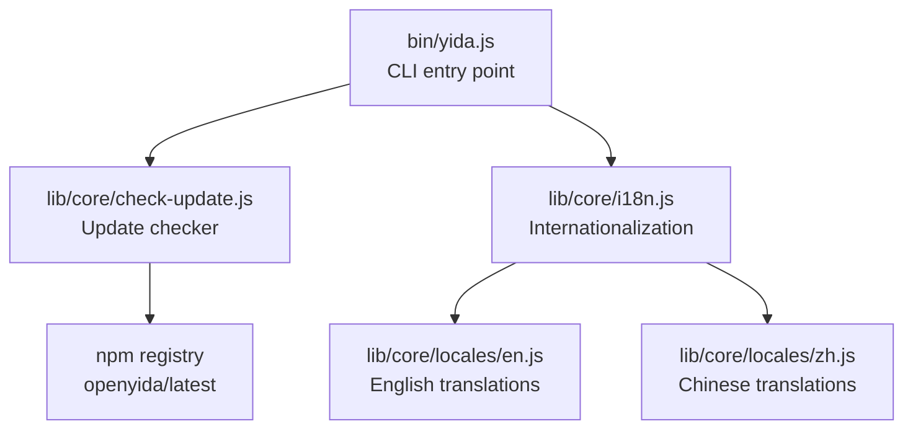
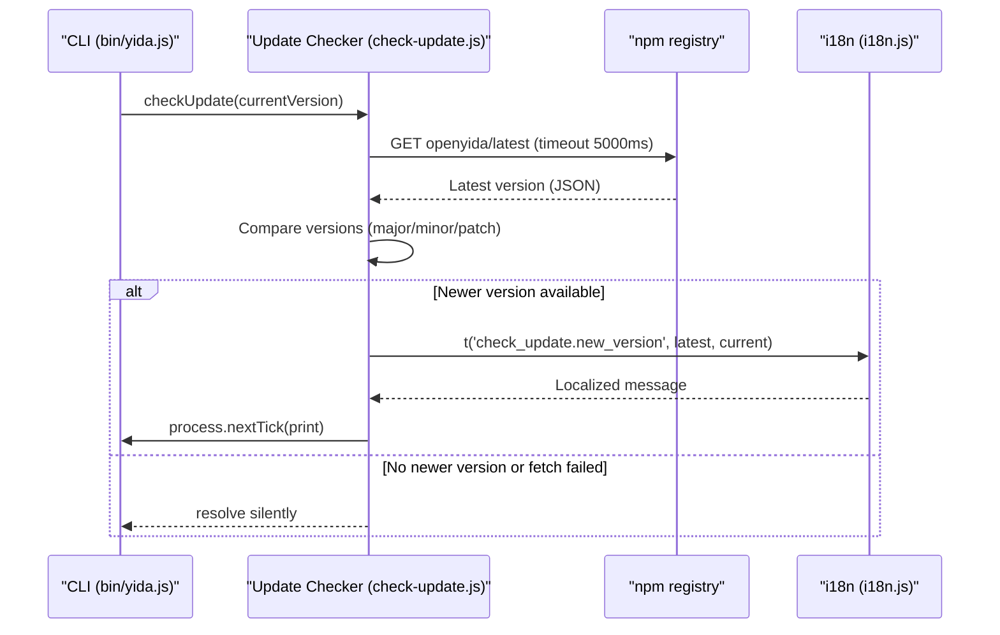
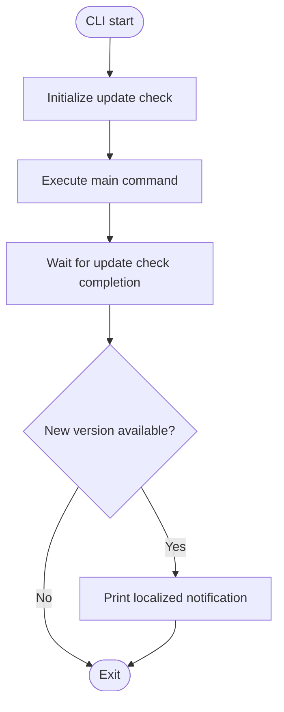
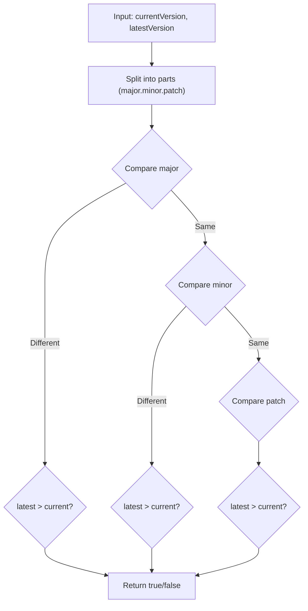
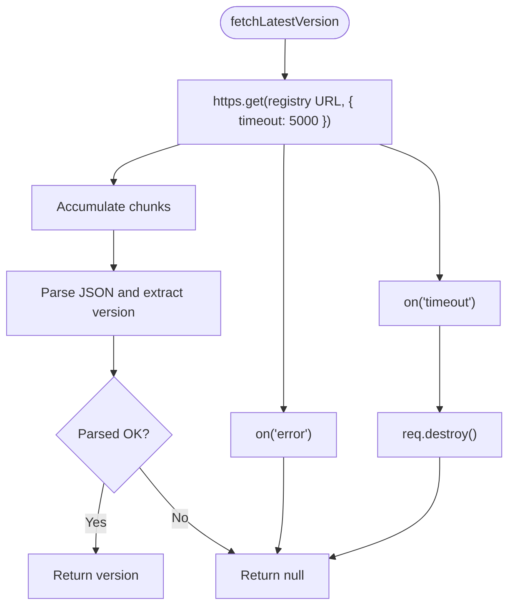
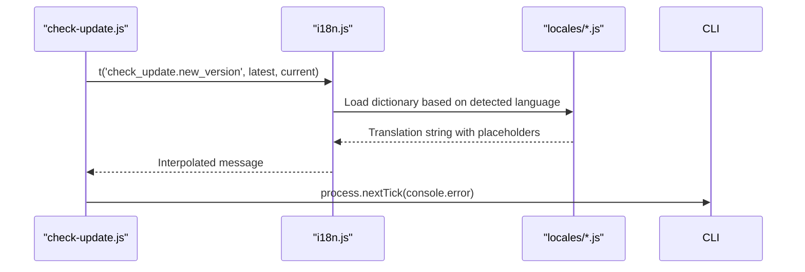
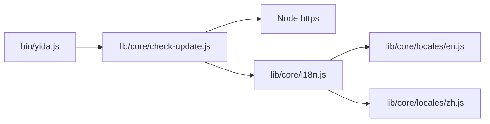

# Update Management System

<cite>
**Referenced Files in This Document**
- [bin/yida.js](file://bin/yida.js)
- [lib/core/check-update.js](file://lib/core/check-update.js)
- [lib/core/i18n.js](file://lib/core/i18n.js)
- [lib/core/locales/en.js](file://lib/core/locales/en.js)
- [lib/core/locales/zh.js](file://lib/core/locales/zh.js)
- [tests/check-update.test.js](file://tests/check-update.test.js)
- [package.json](file://package.json)
</cite>

## Table of Contents
1. [Introduction](#introduction)
2. [Project Structure](#project-structure)
3. [Core Components](#core-components)
4. [Architecture Overview](#architecture-overview)
5. [Detailed Component Analysis](#detailed-component-analysis)
6. [Dependency Analysis](#dependency-analysis)
7. [Performance Considerations](#performance-considerations)
8. [Troubleshooting Guide](#troubleshooting-guide)
9. [Conclusion](#conclusion)

## Introduction
This document describes OpenYida's update management system, which automatically checks for new versions of the openyida package from the npm registry and notifies users when an update is available. The system is designed to be non-intrusive: it runs asynchronously without blocking the main command execution, gracefully handles network failures, and integrates seamlessly with the CLI's internationalization framework. It also demonstrates how update checks relate to system health monitoring—specifically, that failed update checks do not impact core functionality.

## Project Structure
The update management system spans several modules:
- Command entry point initializes the update check and proceeds with normal command flow
- Update checker performs an asynchronous HTTP request to the npm registry
- Internationalization module provides localized update notifications
- Tests validate the update-checking logic and error handling

**Diagram sources**
- [bin/yida.js:54-59](file://bin/yida.js#L54-L59)
- [lib/core/check-update.js:10-13](file://lib/core/check-update.js#L10-L13)
- [lib/core/i18n.js:31-32](file://lib/core/i18n.js#L31-L32)
- [lib/core/locales/en.js:628-635](file://lib/core/locales/en.js#L628-L635)
- [lib/core/locales/zh.js:553-556](file://lib/core/locales/zh.js#L553-L556)

**Section sources**
- [bin/yida.js:54-59](file://bin/yida.js#L54-L59)
- [lib/core/check-update.js:10-13](file://lib/core/check-update.js#L10-L13)
- [lib/core/i18n.js:31-32](file://lib/core/i18n.js#L31-L32)
- [lib/core/locales/en.js:628-635](file://lib/core/locales/en.js#L628-L635)
- [lib/core/locales/zh.js:553-556](file://lib/core/locales/zh.js#L553-L556)

## Core Components
- Asynchronous update checker: Queries the npm registry for the latest version of the openyida package, compares it with the current version, and prints a localized notification if a newer version is available.
- Fire-and-forget invocation: The CLI starts the update check early and continues with command execution, ensuring no delay to user workflows.
- Graceful error handling: Network errors, timeouts, and invalid responses are handled silently, preventing failures from affecting core functionality.
- Semantic version comparison: Supports major, minor, and patch version detection using simple numeric comparisons.
- Internationalization: Notifications are localized via the i18n module and translation dictionaries.

**Section sources**
- [lib/core/check-update.js:19-36](file://lib/core/check-update.js#L19-L36)
- [lib/core/check-update.js:42-50](file://lib/core/check-update.js#L42-L50)
- [lib/core/check-update.js:56-68](file://lib/core/check-update.js#L56-L68)
- [bin/yida.js:58-59](file://bin/yida.js#L58-L59)
- [lib/core/i18n.js:114-138](file://lib/core/i18n.js#L114-L138)

## Architecture Overview
The update system follows a straightforward flow:
- The CLI entry point triggers an asynchronous update check immediately upon startup.
- The update checker fetches the latest version from the npm registry.
- The version comparison determines whether to notify the user.
- The notification is printed asynchronously after the main command completes.

**Diagram sources**
- [bin/yida.js:58-59](file://bin/yida.js#L58-L59)
- [lib/core/check-update.js:19-36](file://lib/core/check-update.js#L19-L36)
- [lib/core/check-update.js:42-68](file://lib/core/check-update.js#L42-L68)
- [lib/core/i18n.js:114-138](file://lib/core/i18n.js#L114-L138)

## Detailed Component Analysis

### Asynchronous Update Check Flow
The CLI starts the update check as a fire-and-forget operation. The main command continues executing, and the update check completes later without blocking user interaction.

**Diagram sources**
- [bin/yida.js:58-59](file://bin/yida.js#L58-L59)
- [bin/yida.js:516-520](file://bin/yida.js#L516-L520)

**Section sources**
- [bin/yida.js:58-59](file://bin/yida.js#L58-L59)
- [bin/yida.js:516-520](file://bin/yida.js#L516-L520)

### Version Comparison Logic
The system compares semantic versions by splitting the version strings into major, minor, and patch components and performing numeric comparisons. It treats missing or invalid versions conservatively.

**Diagram sources**
- [lib/core/check-update.js:42-50](file://lib/core/check-update.js#L42-L50)

**Section sources**
- [lib/core/check-update.js:42-50](file://lib/core/check-update.js#L42-L50)

### Network Request and Error Handling
The update checker queries the npm registry endpoint for the latest version. It sets a 5-second timeout and handles errors and non-JSON responses gracefully by returning null.

**Diagram sources**
- [lib/core/check-update.js:19-36](file://lib/core/check-update.js#L19-L36)

**Section sources**
- [lib/core/check-update.js:19-36](file://lib/core/check-update.js#L19-L36)

### Notification Display and Localization
When a newer version is detected, the system prints a localized message using the i18n module. The message includes the latest and current versions and provides a command to upgrade.

**Diagram sources**
- [lib/core/check-update.js:56-68](file://lib/core/check-update.js#L56-L68)
- [lib/core/i18n.js:114-138](file://lib/core/i18n.js#L114-L138)
- [lib/core/locales/en.js:628-635](file://lib/core/locales/en.js#L628-L635)
- [lib/core/locales/zh.js:553-556](file://lib/core/locales/zh.js#L553-L556)

**Section sources**
- [lib/core/check-update.js:56-68](file://lib/core/check-update.js#L56-L68)
- [lib/core/i18n.js:114-138](file://lib/core/i18n.js#L114-L138)
- [lib/core/locales/en.js:628-635](file://lib/core/locales/en.js#L628-L635)
- [lib/core/locales/zh.js:553-556](file://lib/core/locales/zh.js#L553-L556)

### Relationship to System Health Monitoring
The update checker is intentionally isolated from core functionality:
- Failures are caught and ignored to avoid impacting the main command.
- The system remains healthy even if the registry is unreachable or returns invalid data.
- Users receive optional, non-blocking notifications.

**Section sources**
- [lib/core/check-update.js:65-68](file://lib/core/check-update.js#L65-L68)

### Configuration and Customization
- Update frequency: Controlled by the timing of CLI invocations. There is no built-in periodic scheduler; updates are checked per run.
- Notification preferences: Controlled by the i18n language detection and translation keys. Users can influence language via environment variables.
- CI/CD integration: Since the update check is fire-and-forget and non-blocking, it works transparently in automated environments. To suppress network calls in CI, rely on standard network isolation or proxy configurations rather than modifying the update logic.

**Section sources**
- [lib/core/i18n.js:63-88](file://lib/core/i18n.js#L63-L88)
- [lib/core/i18n.js:158-173](file://lib/core/i18n.js#L158-L173)

## Dependency Analysis
The update system has minimal external dependencies and clear boundaries:
- bin/yida.js depends on the update checker and i18n modules.
- check-update.js depends on Node's https module and i18n for messaging.
- i18n depends on locale dictionaries for translations.

**Diagram sources**
- [bin/yida.js:54-59](file://bin/yida.js#L54-L59)
- [lib/core/check-update.js:10-13](file://lib/core/check-update.js#L10-L13)
- [lib/core/i18n.js:31-32](file://lib/core/i18n.js#L31-L32)

**Section sources**
- [bin/yida.js:54-59](file://bin/yida.js#L54-L59)
- [lib/core/check-update.js:10-13](file://lib/core/check-update.js#L10-L13)
- [lib/core/i18n.js:31-32](file://lib/core/i18n.js#L31-L32)

## Performance Considerations
- Asynchronous execution: The update check does not block the main command, minimizing perceived latency.
- Short timeout: A 5-second timeout prevents long waits on slow networks.
- Minimal overhead: Only one HTTP request per CLI invocation; version comparison is O(1).

## Troubleshooting Guide
Common issues and resolutions:
- Network timeout or failure
  - Symptom: No update notification despite a new version being available.
  - Cause: Registry unreachable or slow response.
  - Resolution: Retry later or check network connectivity; the system handles failures silently.
- Invalid registry response
  - Symptom: Unexpected behavior or no notification.
  - Cause: Non-JSON response from the registry.
  - Resolution: Ensure the registry is reachable and responding correctly.
- Language mismatch in notification
  - Symptom: Notification appears in an unexpected language.
  - Cause: OPENYIDA_LANG or system locale settings.
  - Resolution: Set OPENYIDA_LANG to the desired language or adjust system locale.
- CI/CD environment
  - Symptom: Unwanted network calls in automated pipelines.
  - Resolution: Isolate network access in CI or rely on the non-blocking nature of the check.

**Section sources**
- [lib/core/check-update.js:19-36](file://lib/core/check-update.js#L19-L36)
- [lib/core/i18n.js:63-88](file://lib/core/i18n.js#L63-L88)

## Conclusion
OpenYida's update management system provides a robust, non-intrusive way to inform users about new releases. By running asynchronously, handling errors gracefully, and supporting multiple languages, it enhances user awareness without compromising core functionality or CI/CD workflows. The simple semantic version comparison ensures accurate detection of major, minor, and patch updates, while the modular design keeps the system maintainable and testable.