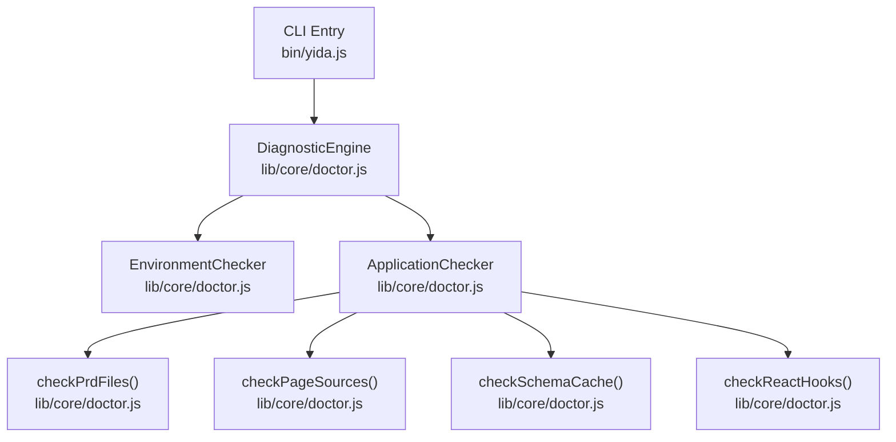
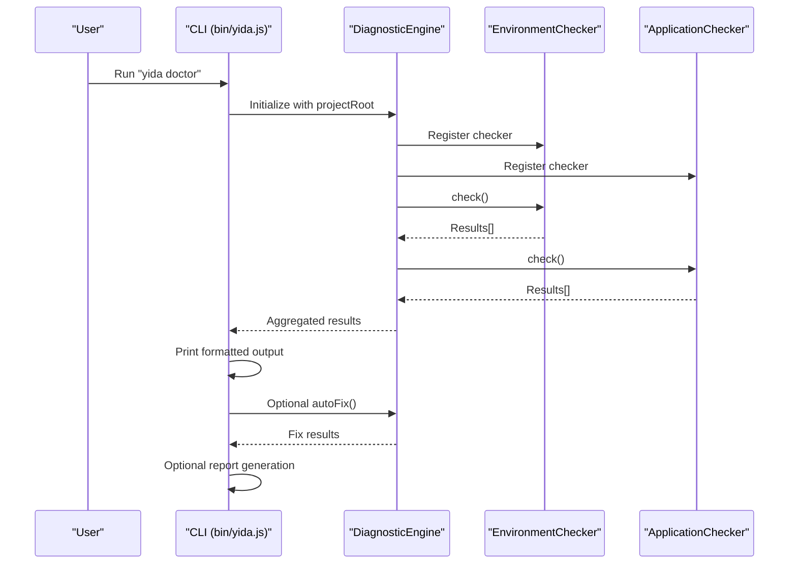
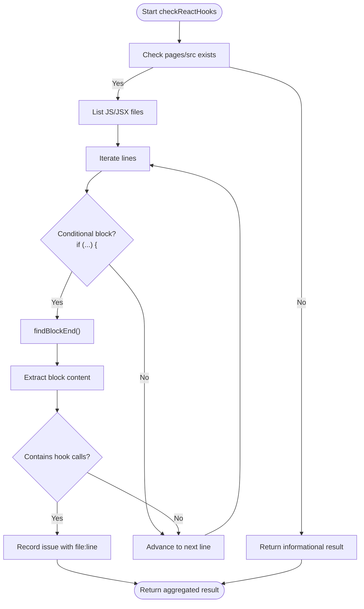
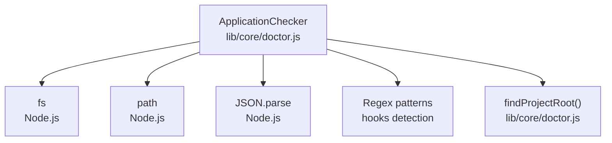

# Application Validation

<cite>
**Referenced Files in This Document**
- [doctor.js](file://lib/core/doctor.js)
- [doctor.test.js](file://tests/doctor.test.js)
- [yida.js](file://bin/yida.js)
- [demo-birthday-game.js](file://project/pages/src/demo-birthday-game.js)
- [demo-birthday-game.md](file://project/prd/demo-birthday-game.md)
- [config.json](file://project/config.json)
</cite>

## Table of Contents
1. [Introduction](#introduction)
2. [Project Structure](#project-structure)
3. [Core Components](#core-components)
4. [Architecture Overview](#architecture-overview)
5. [Detailed Component Analysis](#detailed-component-analysis)
6. [Dependency Analysis](#dependency-analysis)
7. [Performance Considerations](#performance-considerations)
8. [Troubleshooting Guide](#troubleshooting-guide)
9. [Conclusion](#conclusion)

## Introduction
This document explains OpenYida’s application-level diagnostic system with a focus on the ApplicationChecker class. It covers four validation areas:
- PRD documentation assessment: directory existence and markdown file validation
- Page source code analysis: empty file detection and console.log statement scanning
- Schema cache integrity verification: JSON parsing validation and corrupted file cleanup
- React Hooks usage pattern detection: conditional rendering violations and proper hook placement rules

It also documents the automated detection algorithms, common code patterns that trigger warnings, remediation strategies, and practical examples with suggested fixes. Finally, it provides guidelines for maintaining React best practices in low-code applications.

## Project Structure
OpenYida organizes application diagnostics under the core module and exposes a CLI entrypoint. The ApplicationChecker resides in the core diagnostics module and integrates with the broader diagnostic pipeline.

**Diagram sources**
- [yida.js:337-341](file://bin/yida.js#L337-L341)
- [doctor.js:456-462](file://lib/core/doctor.js#L456-L462)

**Section sources**
- [yida.js:337-341](file://bin/yida.js#L337-L341)
- [doctor.js:456-462](file://lib/core/doctor.js#L456-L462)

## Core Components
- ApplicationChecker: Orchestrates four checks:
  - PRD documentation presence and validity
  - Page source code hygiene (empty files, debug logs)
  - Schema cache integrity (JSON validity)
  - React Hooks usage correctness (conditional hooks, placement)
- DiagnosticEngine: Registers and runs checkers, aggregates results, computes summaries, and supports auto-fix and reporting.
- FixEngine: Applies automatic fixes for known issues (e.g., deleting invalid schema cache files).
- ReportGenerator: Generates diagnostic reports in JSON, Markdown, or HTML formats.

Key behaviors:
- Each check returns a standardized result object with id, label, passed flag, severity, optional message, and optional auto-fix metadata.
- Hooks validation scans JS/JSX files and detects hooks inside conditional blocks by parsing code blocks.

**Section sources**
- [doctor.js:446-612](file://lib/core/doctor.js#L446-L612)
- [doctor.js:50-129](file://lib/core/doctor.js#L50-L129)
- [doctor.js:639-733](file://lib/core/doctor.js#L639-L733)
- [doctor.js:741-863](file://lib/core/doctor.js#L741-L863)

## Architecture Overview
The diagnostic flow starts from the CLI, constructs a DiagnosticEngine, registers EnvironmentChecker and ApplicationChecker, executes checks, optionally applies fixes, and generates a report.

**Diagram sources**
- [yida.js:337-341](file://bin/yida.js#L337-L341)
- [doctor.js:1450-1487](file://lib/core/doctor.js#L1450-L1487)

## Detailed Component Analysis

### PRD Documentation Assessment
Purpose:
- Ensure the prd/ directory exists and contains at least one markdown (.md) file.

Detection algorithm:
- Verify directory existence; if missing, warn and suggest manual creation.
- If present, count .md files and report the number; if none, warn and suggest adding documentation.

Common patterns that trigger warnings:
- Missing prd/ directory
- prd/ directory present but empty

Remediation strategies:
- Create prd/ directory and add a markdown file describing the application’s requirements.

Validation logic and examples:
- Directory existence check and message construction
- Counting and reporting markdown files

**Section sources**
- [doctor.js:465-488](file://lib/core/doctor.js#L465-L488)
- [doctor.test.js:308-331](file://tests/doctor.test.js#L308-L331)

### Page Source Code Analysis
Purpose:
- Detect empty source files and console.log statements that indicate debug code.

Detection algorithm:
- Locate pages/src directory; if absent, warn and suggest creating it.
- Enumerate JS/JSX/TS/TSX files.
- Flag empty files and files containing console.log (excluding intentional disables).

Common patterns that trigger warnings:
- Empty files
- Presence of console.log statements

Remediation strategies:
- Remove or refactor debug statements
- Populate empty files with functional code

Validation logic and examples:
- Directory existence and file enumeration
- Empty file and console.log checks
- Aggregated warning messages

**Section sources**
- [doctor.js:490-527](file://lib/core/doctor.js#L490-L527)
- [doctor.test.js:333-355](file://tests/doctor.test.js#L333-L355)

### Schema Cache Integrity Verification
Purpose:
- Ensure .cache/*.json files are valid JSON and clean up corrupted ones automatically.

Detection algorithm:
- If .cache directory does not exist, pass silently.
- If present, enumerate files ending with -schema.json.
- Attempt to parse each file as JSON; on failure, mark as warning and prepare auto-fix action to delete the file.

Common patterns that trigger warnings:
- Non-JSON content in schema cache files

Remediation strategies:
- Automatic deletion of invalid schema cache files via FixEngine

Validation logic and examples:
- Directory traversal and file filtering
- JSON.parse wrapping and error handling
- Auto-fix action metadata

**Section sources**
- [doctor.js:529-568](file://lib/core/doctor.js#L529-L568)
- [doctor.test.js:357-381](file://tests/doctor.test.js#L357-L381)
- [doctor.js:696-706](file://lib/core/doctor.js#L696-L706)

### React Hooks Usage Pattern Detection
Purpose:
- Enforce React Hooks rules by detecting hooks used inside conditional blocks and ensuring proper placement.

Detection algorithm:
- If pages/src does not exist, skip with informational message.
- Enumerate JS/JSX files.
- For each file:
  - Split content into lines.
  - Scan for lines matching conditional blocks (e.g., if (...) {).
  - For each such block, locate its closing brace using a block depth counter.
  - Extract the block content and scan for hook invocation patterns (e.g., use[A-Z]\w*\s*\().
  - Record issues with file and line number.

Code block parsing mechanism:
- findBlockEnd(lines, startLine): iterates lines, increments depth on '{', decrements on '}', returns line index when depth reaches zero.

Common patterns that trigger warnings:
- Using hooks (e.g., useState, useEffect) inside conditional blocks
- Improper hook placement leading to inconsistent invocation order

Remediation strategies:
- Move hooks to the top level of the component function
- Extract conditional logic into separate components or custom hooks
- Use early returns for guards while keeping hooks at the top

Validation logic and examples:
- Conditional block detection and hook scanning
- Block boundary resolution via depth counting

**Diagram sources**
- [doctor.js:570-612](file://lib/core/doctor.js#L570-L612)
- [doctor.js:621-631](file://lib/core/doctor.js#L621-L631)

**Section sources**
- [doctor.js:570-612](file://lib/core/doctor.js#L570-L612)
- [doctor.js:621-631](file://lib/core/doctor.js#L621-L631)
- [doctor.test.js:383-401](file://tests/doctor.test.js#L383-L401)

### Practical Examples and Remediation Strategies
- Example: Empty page source file
  - Detection: checkPageSources flags empty files
  - Remediation: implement the intended UI logic or remove the file if unused
- Example: console.log statements
  - Detection: checkPageSources scans for console.log
  - Remediation: remove debug logs or replace with structured logging
- Example: Invalid schema cache
  - Detection: checkSchemaCache fails JSON.parse
  - Remediation: FixEngine deletes the corrupted file automatically
- Example: Conditional hook usage
  - Detection: checkReactHooks finds hooks inside if blocks
  - Remediation: move hooks to component top-level; restructure conditionals

These behaviors are validated by unit tests and demonstrated in the test suite.

**Section sources**
- [doctor.test.js:344-355](file://tests/doctor.test.js#L344-L355)
- [doctor.test.js:369-381](file://tests/doctor.test.js#L369-L381)
- [doctor.test.js:383-401](file://tests/doctor.test.js#L383-L401)

### Guidelines for Maintaining React Best Practices in Low-Code Applications
- Keep hooks at the top level of functional components
- Avoid conditional hook invocation; hoist hooks outside conditionals
- Prefer extracting conditional logic into dedicated components or custom hooks
- Minimize side effects and keep them predictable
- Use early returns for guard clauses while preserving hook ordering
- Validate runtime assumptions and fail fast with clear errors

[No sources needed since this section provides general guidance]

## Dependency Analysis
ApplicationChecker depends on:
- Filesystem APIs to traverse directories and read files
- JSON parsing for schema cache validation
- Line-by-line scanning and regular expressions for hooks detection
- Utility functions for project root discovery

**Diagram sources**
- [doctor.js:25-28](file://lib/core/doctor.js#L25-L28)
- [doctor.js:446-612](file://lib/core/doctor.js#L446-L612)

**Section sources**
- [doctor.js:25-28](file://lib/core/doctor.js#L25-L28)
- [doctor.js:446-612](file://lib/core/doctor.js#L446-L612)

## Performance Considerations
- Directory traversal and file reads are linear in the number of files; typical projects are small enough that overhead is negligible.
- JSON parsing occurs only for schema cache files; failures short-circuit further processing for that file.
- Hooks scanning performs line-by-line iteration with block depth tracking; complexity is proportional to file size.
- Recommendations:
  - Limit unnecessary file enumerations by checking directory existence first
  - Cache results for repeated runs if integrating into larger tooling
  - Consider parallelization for very large projects (outside current implementation)

[No sources needed since this section provides general guidance]

## Troubleshooting Guide
Common issues and resolutions:
- PRD directory missing
  - Symptom: Warning about missing prd/ directory
  - Resolution: Create prd/ and add markdown documentation
- No page source files detected
  - Symptom: Warning about missing pages/src directory
  - Resolution: Add page source files under pages/src
- console.log statements found
  - Symptom: Warning listing affected files
  - Resolution: Remove debug logs or replace with appropriate logging
- Invalid schema cache JSON
  - Symptom: Warning indicating malformed schema cache
  - Resolution: Run auto-fix to delete the corrupted file; rebuild schema if needed
- Conditional hook violations
  - Symptom: Warning with file:line references
  - Resolution: Move hooks to top-level; restructure conditionals

Automated repair:
- Use the auto-fix mode to delete invalid schema cache files when applicable.

**Section sources**
- [doctor.js:696-706](file://lib/core/doctor.js#L696-L706)
- [doctor.test.js:424-444](file://tests/doctor.test.js#L424-L444)

## Conclusion
OpenYida’s ApplicationChecker provides robust, automated validation across documentation, source hygiene, schema integrity, and React Hooks best practices. Its design integrates cleanly with the broader diagnostic pipeline, enabling warnings, automatic fixes, and comprehensive reporting. By following the remediation strategies and guidelines outlined here, teams can maintain high-quality, reliable low-code applications.