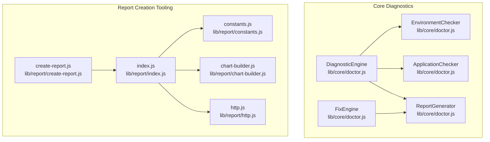
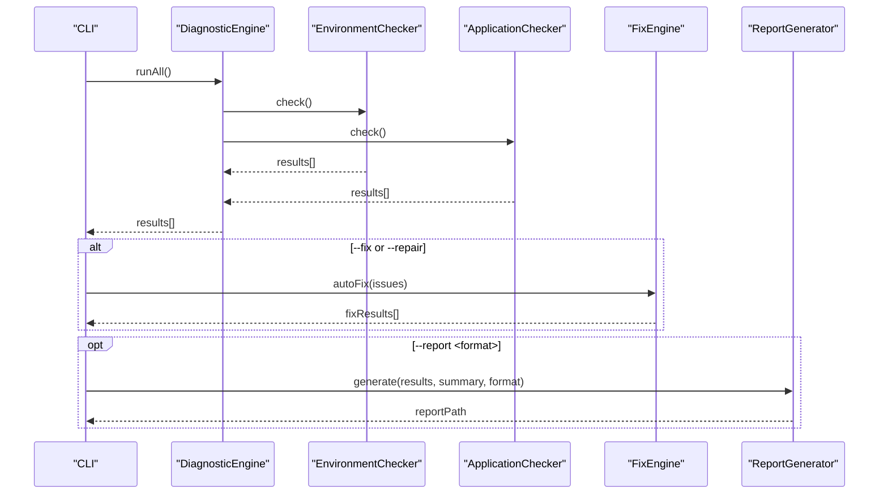
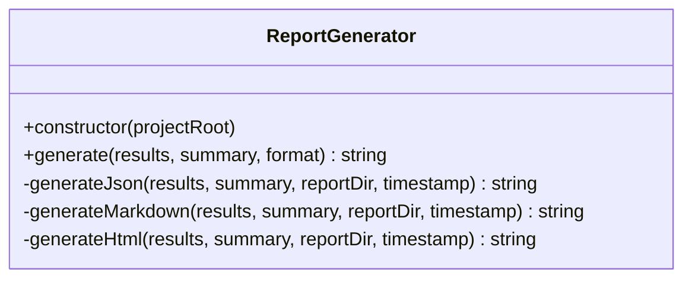
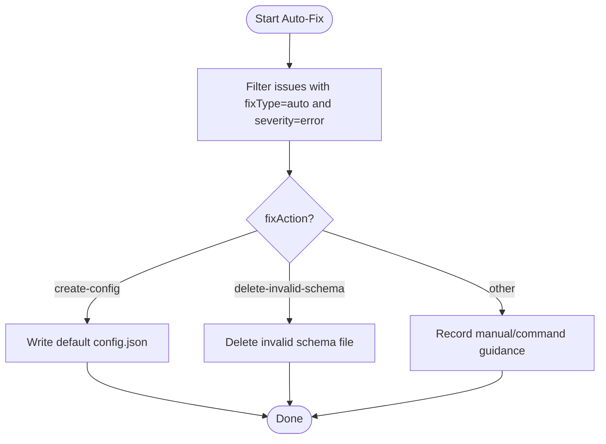
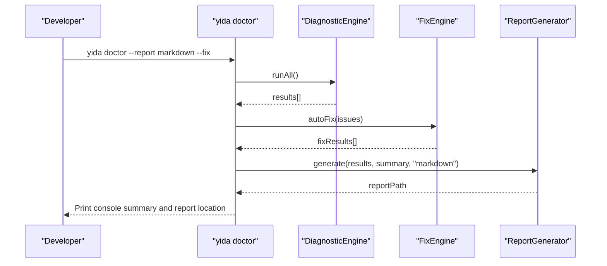
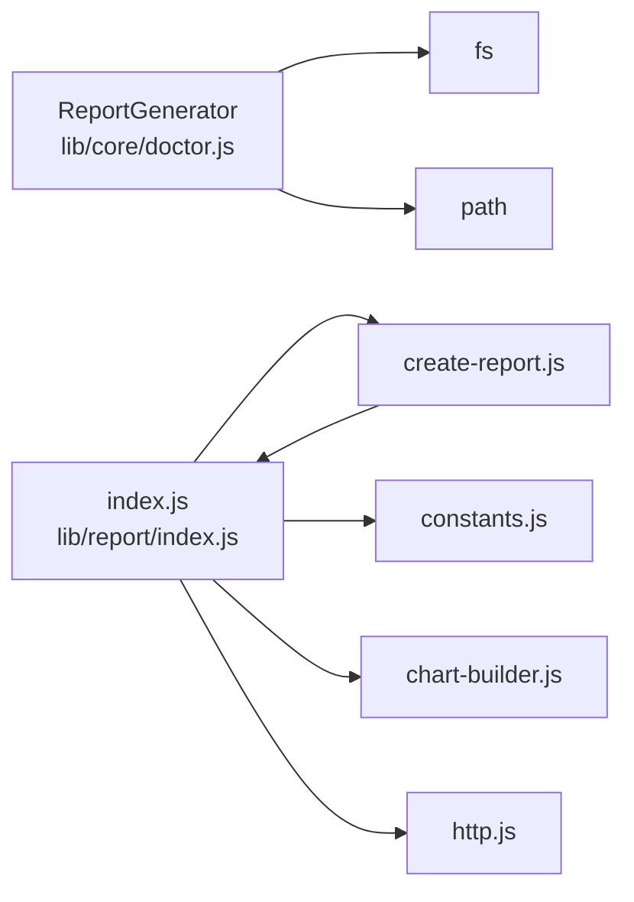

# Diagnostic Output & Reporting

<cite>
**Referenced Files in This Document**
- [doctor.js](file://lib/core/doctor.js)
- [report-constants.test.js](file://tests/report-constants.test.js)
- [create-report.js](file://lib/report/create-report.js)
- [index.js](file://lib/report/index.js)
- [constants.js](file://lib/report/constants.js)
- [chart-builder.js](file://lib/report/chart-builder.js)
- [http.js](file://lib/report/http.js)
- [doctor.test.js](file://tests/doctor.test.js)
</cite>

## Table of Contents
1. [Introduction](#introduction)
2. [Project Structure](#project-structure)
3. [Core Components](#core-components)
4. [Architecture Overview](#architecture-overview)
5. [Detailed Component Analysis](#detailed-component-analysis)
6. [Dependency Analysis](#dependency-analysis)
7. [Performance Considerations](#performance-considerations)
8. [Troubleshooting Guide](#troubleshooting-guide)
9. [Conclusion](#conclusion)
10. [Appendices](#appendices)

## Introduction
This document explains OpenYida’s diagnostic output formatting and reporting system. It focuses on the ReportGenerator class and related components that produce diagnostic reports in three formats:
- JSON for machine parsing and automation
- Markdown for human-readable documentation
- HTML for web-based presentation

It also documents the severity classification system (ERROR, WARNING, INFO), fix type categorization (AUTO, MANUAL, COMMAND), and the diagnostic result structure (issue IDs, labels, pass/fail status, and resolution recommendations). The guide includes examples of formatted output per severity level, common diagnostic scenarios, and practical guidelines for integrating diagnostic reports into development workflows.

## Project Structure
The diagnostic and reporting system spans two primary areas:
- Core diagnostic engine and reporting generator under lib/core
- Report creation tooling for dashboards under lib/report

**Diagram sources**
- [doctor.js:46-129](file://lib/core/doctor.js#L46-L129)
- [create-report.js:1-26](file://lib/report/create-report.js#L1-L26)
- [index.js:1-282](file://lib/report/index.js#L1-L282)
- [constants.js:1-138](file://lib/report/constants.js#L1-L138)
- [chart-builder.js:1-1743](file://lib/report/chart-builder.js#L1-L1743)
- [http.js:1-36](file://lib/report/http.js#L1-L36)

**Section sources**
- [doctor.js:1-1504](file://lib/core/doctor.js#L1-L1504)
- [create-report.js:1-26](file://lib/report/create-report.js#L1-L26)
- [index.js:1-282](file://lib/report/index.js#L1-L282)
- [constants.js:1-138](file://lib/report/constants.js#L1-L138)
- [chart-builder.js:1-1743](file://lib/report/chart-builder.js#L1-L1743)
- [http.js:1-36](file://lib/report/http.js#L1-L36)

## Core Components
- Severity classification: error, warning, info
- Fix type categorization: auto, manual, command
- Diagnostic result structure: id, label, passed, severity, message, fixType, fixAction, fixCommand, fixTarget
- Report formats: JSON, Markdown, HTML
- CLI integration: doctor command supports --report flag to generate reports

Key behaviors:
- ReportGenerator writes reports to .cache/reports with timestamps
- Unknown report formats default to Markdown
- Console output uses emoji indicators and summaries
- FixEngine supports auto-fix actions and manual/command prompts

**Section sources**
- [doctor.js:32-42](file://lib/core/doctor.js#L32-L42)
- [doctor.js:735-863](file://lib/core/doctor.js#L735-L863)
- [doctor.js:1366-1488](file://lib/core/doctor.js#L1366-L1488)

## Architecture Overview
The diagnostic pipeline integrates checkers, engines, and a report generator. The CLI orchestrates checks, optional auto-fix, and report generation.

**Diagram sources**
- [doctor.js:1366-1488](file://lib/core/doctor.js#L1366-L1488)
- [doctor.js:69-76](file://lib/core/doctor.js#L69-L76)
- [doctor.js:639-733](file://lib/core/doctor.js#L639-L733)
- [doctor.js:741-863](file://lib/core/doctor.js#L741-L863)

## Detailed Component Analysis

### ReportGenerator
Responsibilities:
- Generate reports in JSON, Markdown, or HTML
- Write to .cache/reports with timestamped filenames
- Default to Markdown for unknown formats

Behavior highlights:
- JSON: includes timestamp, summary, and results arrays
- Markdown: human-friendly summary table and bullet list of results
- HTML: compact table with summary cards and styled layout

**Diagram sources**
- [doctor.js:741-863](file://lib/core/doctor.js#L741-L863)

**Section sources**
- [doctor.js:741-863](file://lib/core/doctor.js#L741-L863)

### Diagnostic Result Structure
Each diagnostic result includes:
- id: stable identifier for the check
- label: human-readable description
- passed: boolean pass/fail
- severity: error | warning | info
- message: optional explanatory text
- fixType: auto | manual | command
- fixAction: action name for auto fixes
- fixCommand: shell command for command fixes
- fixTarget: target artifact for auto fixes

Examples by severity:
- ERROR: critical failure requiring immediate attention (e.g., missing config.json)
- WARNING: potential issues or recoverable problems (e.g., missing PRD files, stale cookies)
- INFO: informational pass-through (e.g., successful version checks)

Common scenarios and interpretations:
- EnvironmentChecker detects Node.js, Python, Playwright, gh CLI, config.json presence/format, Skills installation, login status, and network connectivity
- ApplicationChecker validates PRD presence, page sources, schema cache validity, and React Hooks usage
- FixEngine applies auto fixes (create-config, delete-invalid-schema) and provides manual/command guidance

**Section sources**
- [doctor.js:32-42](file://lib/core/doctor.js#L32-L42)
- [doctor.js:137-438](file://lib/core/doctor.js#L137-L438)
- [doctor.js:446-613](file://lib/core/doctor.js#L446-L613)
- [doctor.js:639-733](file://lib/core/doctor.js#L639-L733)
- [doctor.test.js:479-540](file://tests/doctor.test.js#L479-L540)

### Severity and Fix Type Classification
- Severity levels:
  - ERROR: critical failures (e.g., invalid config.json, missing gh CLI)
  - WARNING: recoverable issues or potential risks (e.g., missing PRD, stale cookies)
  - INFO: neutral pass-through (e.g., successful version checks)
- Fix types:
  - AUTO: automatic remediation supported (e.g., create config.json, delete invalid schema)
  - MANUAL: requires manual steps described in message
  - COMMAND: requires user to run a specific command

**Section sources**
- [doctor.js:32-42](file://lib/core/doctor.js#L32-L42)
- [doctor.js:639-733](file://lib/core/doctor.js#L639-L733)
- [doctor.js:137-438](file://lib/core/doctor.js#L137-L438)
- [doctor.js:446-613](file://lib/core/doctor.js#L446-L613)

### Automated Repair Process
Supported auto-fix actions:
- create-config: generates a default config.json template
- delete-invalid-schema: removes corrupted schema cache files

Manual/command fixes:
- Install Playwright, Chromium, or log in via yida login
- Provide missing Skills or PRD files

**Diagram sources**
- [doctor.js:639-733](file://lib/core/doctor.js#L639-L733)

**Section sources**
- [doctor.js:639-733](file://lib/core/doctor.js#L639-L733)
- [doctor.test.js:406-475](file://tests/doctor.test.js#L406-L475)

### Report Formats and Examples
- JSON: machine-parseable structure with timestamp, summary, and results
- Markdown: readable summary table and bullet list of results with emojis
- HTML: compact table with summary cards and styled layout

Example outputs (descriptive):
- JSON: top-level fields include timestamp, summary, results
- Markdown: “OpenYida Diagnostic Report” header, summary table, and a bullet list of results with icons
- HTML: “OpenYida Diagnostic Report” header, summary cards, and a results table

**Section sources**
- [doctor.js:741-863](file://lib/core/doctor.js#L741-L863)
- [doctor.test.js:479-540](file://tests/doctor.test.js#L479-L540)

### CLI Integration and Workflows
- CLI supports --report <format> to generate reports
- Optional --fix/--repair triggers FixEngine
- Optional --monitor runs continuous health monitoring
- Optional --production with --app collects production error logs

**Diagram sources**
- [doctor.js:1366-1488](file://lib/core/doctor.js#L1366-L1488)

**Section sources**
- [doctor.js:1366-1488](file://lib/core/doctor.js#L1366-L1488)

## Dependency Analysis
- ReportGenerator depends on:
  - fs for file I/O
  - path for constructing report paths
  - timestamp generation for unique filenames
- Report creation tooling depends on:
  - constants for component mappings and ID generators
  - chart-builder for constructing report schemas
  - http for backend API calls

**Diagram sources**
- [doctor.js:741-863](file://lib/core/doctor.js#L741-L863)
- [index.js:1-282](file://lib/report/index.js#L1-L282)
- [constants.js:1-138](file://lib/report/constants.js#L1-L138)
- [chart-builder.js:1-1743](file://lib/report/chart-builder.js#L1-L1743)
- [http.js:1-36](file://lib/report/http.js#L1-L36)

**Section sources**
- [doctor.js:741-863](file://lib/core/doctor.js#L741-L863)
- [index.js:1-282](file://lib/report/index.js#L1-L282)

## Performance Considerations
- Report generation is I/O bound; writing to .cache/reports avoids cluttering project roots
- HTML generation includes minimal inline styles; keep report counts reasonable for readability
- FixEngine executes targeted actions; avoid unnecessary repeated runs by filtering auto-fixable issues

## Troubleshooting Guide
Common issues and resolutions:
- Missing config.json:
  - Severity: WARNING
  - Fix type: AUTO
  - Action: create-config
- Invalid config.json:
  - Severity: ERROR
  - Fix type: none (manual review)
- Missing Skills:
  - Severity: WARNING
  - Fix type: MANUAL
  - Guidance: run installation script
- Stale or missing cookies:
  - Severity: WARNING
  - Fix type: COMMAND
  - Command: yida login
- Invalid schema cache:
  - Severity: WARNING
  - Fix type: AUTO
  - Action: delete-invalid-schema

Validation and testing:
- Unit tests confirm ReportGenerator produces correct file extensions and content for each format
- Tests cover severity and fix type behaviors across EnvironmentChecker and ApplicationChecker

**Section sources**
- [doctor.js:137-438](file://lib/core/doctor.js#L137-L438)
- [doctor.js:446-613](file://lib/core/doctor.js#L446-L613)
- [doctor.js:639-733](file://lib/core/doctor.js#L639-L733)
- [doctor.test.js:479-540](file://tests/doctor.test.js#L479-L540)

## Conclusion
OpenYida’s diagnostic output and reporting system provides structured, actionable insights across three formats—JSON, Markdown, and HTML—enabling both automation and human consumption. The severity and fix-type taxonomy ensures clear prioritization and remediation pathways, while the CLI integration streamlines developer workflows from diagnostics to automated fixes and report generation.

## Appendices

### Severity and Fix Type Reference
- Severity: error, warning, info
- Fix type: auto, manual, command

**Section sources**
- [doctor.js:32-42](file://lib/core/doctor.js#L32-L42)

### Report Generation Options
- JSON: machine-readable artifacts for CI/CD
- Markdown: documentation-friendly summaries
- HTML: web-ready diagnostics for teams

**Section sources**
- [doctor.js:741-863](file://lib/core/doctor.js#L741-L863)