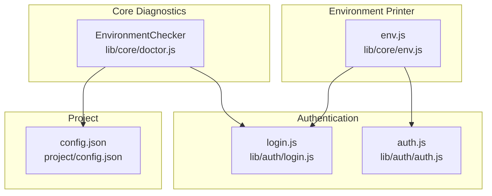
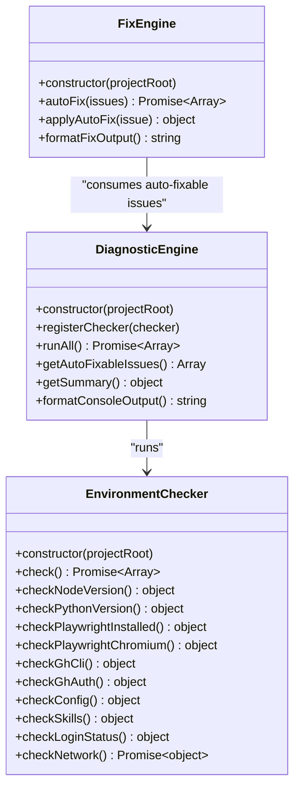
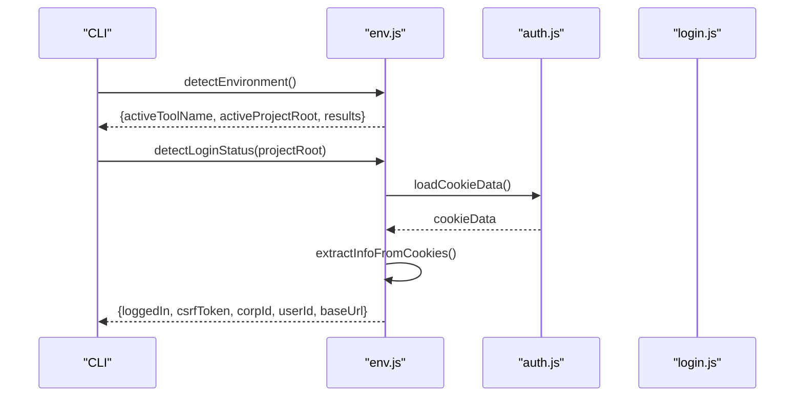
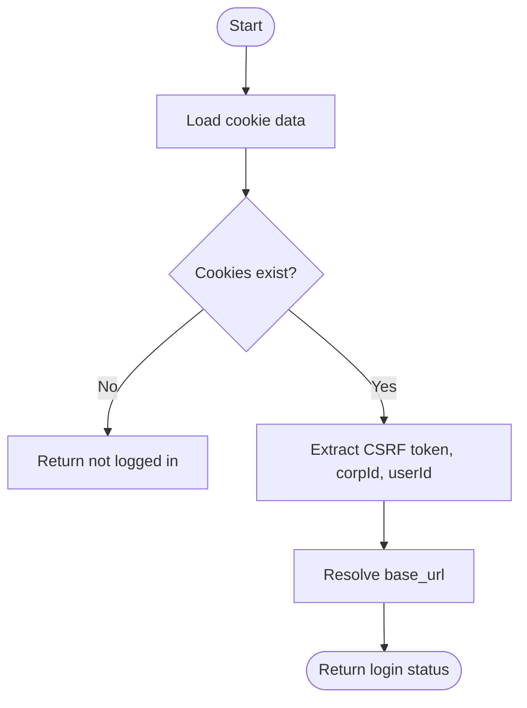
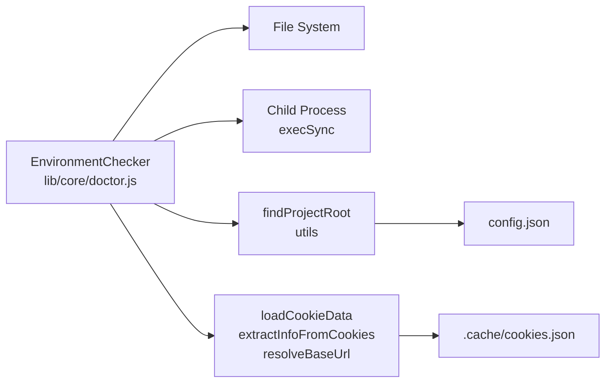

# Environment Checks

<cite>
**Referenced Files in This Document**
- [doctor.js](file://lib/core/doctor.js)
- [env.js](file://lib/core/env.js)
- [login.js](file://lib/auth/login.js)
- [auth.js](file://lib/auth/auth.js)
- [config.json](file://project/config.json)
- [env.test.js](file://tests/env.test.js)
- [doctor.test.js](file://tests/doctor.test.js)
</cite>

## Table of Contents
1. [Introduction](#introduction)
2. [Project Structure](#project-structure)
3. [Core Components](#core-components)
4. [Architecture Overview](#architecture-overview)
5. [Detailed Component Analysis](#detailed-component-analysis)
6. [Dependency Analysis](#dependency-analysis)
7. [Performance Considerations](#performance-considerations)
8. [Troubleshooting Guide](#troubleshooting-guide)
9. [Conclusion](#conclusion)

## Introduction
This document explains OpenYida’s environment validation system centered around the EnvironmentChecker class. It covers the ten validation categories, severity levels, fix types, automated repairs, and practical examples of check outcomes. It also provides troubleshooting guidance for common environment issues and describes how the system integrates with login and project configuration.

## Project Structure
The environment validation system lives in the core diagnostics module and interacts with authentication and project configuration:

- EnvironmentChecker: Implements all environment validations and returns structured results.
- Environment printer: Uses environment detection helpers to present active tooling and login status.
- Authentication: Provides login state detection and cookie-based session validation.
- Project configuration: Reads and validates the project’s config.json.

**Diagram sources**
- [doctor.js:137-438](file://lib/core/doctor.js#L137-L438)
- [env.js:47-90](file://lib/core/env.js#L47-L90)
- [login.js:27-41](file://lib/auth/login.js#L27-L41)
- [auth.js:61-127](file://lib/auth/auth.js#L61-L127)
- [config.json:1-5](file://project/config.json#L1-L5)

**Section sources**
- [doctor.js:137-438](file://lib/core/doctor.js#L137-L438)
- [env.js:47-90](file://lib/core/env.js#L47-L90)
- [login.js:27-41](file://lib/auth/login.js#L27-L41)
- [auth.js:61-127](file://lib/auth/auth.js#L61-L127)
- [config.json:1-5](file://project/config.json#L1-L5)

## Core Components
- EnvironmentChecker: Executes ten environment validations and returns a list of results with severity and optional fixes.
- DiagnosticEngine: Orchestrates checker registration, runs checks, aggregates results, and formats output.
- FixEngine: Applies automatic fixes for supported issues (e.g., creating config.json, removing invalid schema cache).
- Environment printer: Detects active AI tool, prints environment info, and reports login status.

Key result fields:
- id: Unique identifier per check.
- label: Human-readable label.
- passed: Boolean pass/fail.
- severity: One of ERROR, WARNING, INFO.
- message: Optional diagnostic message.
- fixType: One of AUTO, MANUAL, COMMAND.
- fixCommand: Command to run for manual fixes.
- fixAction: Action name for automatic fixes (e.g., create-config, delete-invalid-schema).

**Section sources**
- [doctor.js:30-43](file://lib/core/doctor.js#L30-L43)
- [doctor.js:50-129](file://lib/core/doctor.js#L50-L129)
- [doctor.js:639-733](file://lib/core/doctor.js#L639-L733)
- [env.js:47-90](file://lib/core/env.js#L47-L90)

## Architecture Overview
The EnvironmentChecker composes multiple checks that probe Node.js, Python, Playwright, GitHub CLI, project config, AI Skills, login state, and network connectivity. Results are normalized and can be auto-fixed when appropriate.

**Diagram sources**
- [doctor.js:50-129](file://lib/core/doctor.js#L50-L129)
- [doctor.js:137-438](file://lib/core/doctor.js#L137-L438)
- [doctor.js:639-733](file://lib/core/doctor.js#L639-L733)

## Detailed Component Analysis

### EnvironmentChecker Ten Validation Categories
The EnvironmentChecker performs ten distinct checks. Each returns a normalized result object with id, label, passed, severity, and optional fix metadata.

1) Node.js version compatibility (v16+ requirement)
- Purpose: Verify runtime Node.js meets minimum version.
- Severity: ERROR if below threshold; INFO otherwise.
- Example result: Passed with label “Node.js vX.Y.Z（要求 ≥ 16）”.
- Manual intervention: Upgrade Node.js to v16+.

2) Python installation and version checks (3.10+ minimum)
- Purpose: Confirm Python 3.10+ is installed.
- Severity: ERROR if missing/unrecognized; INFO if satisfied.
- Example result: Passed with label “Python X.Y.Z（要求 ≥ 3.10）”.
- Manual intervention: Install Python 3.10+.

3) Playwright framework verification
- Purpose: Detect if Playwright is importable via Python.
- Severity: INFO if installed; ERROR with COMMAND fix if missing.
- Example result: “Playwright 已安装”.
- Manual intervention: pip install playwright.

4) Chromium browser installation via Playwright
- Purpose: Validate Chromium download/installation.
- Severity: INFO if installed; WARNING with COMMAND fix if missing.
- Example result: “Playwright Chromium 已安装”.
- Manual intervention: playwright install chromium.

5) GitHub CLI setup and authentication status
- Purpose: Verify gh CLI presence and login status.
- Severity: INFO if installed and logged in; ERROR/WARNING otherwise.
- Example result: “gh CLI 已登录”.
- Manual intervention: Install gh CLI and run gh auth login.

6) Project configuration file validation (config.json)
- Purpose: Ensure config.json exists and is valid JSON.
- Severity: WARNING with AUTO fix if missing; ERROR if invalid JSON.
- Example result: “config.json 检测” with ERROR message for malformed JSON.
- Automated repair: Creates a minimal config.json template.

7) AI Skills package detection and installation status
- Purpose: Detect Skills under .claude/skills/skills.
- Severity: INFO if found; WARNING with MANUAL fix if missing.
- Example result: “Skills 已安装（N 个）”.
- Manual intervention: Run install-skills.sh.

8) Alibaba Yida platform login state verification with cookie validation
- Purpose: Check .cache/cookies.json presence and CSRF token validity.
- Severity: INFO if valid; WARNING with COMMAND fix if missing/expired.
- Example result: “宜搭登录态：已登录”.
- Manual intervention: yida login.

9) Network connectivity testing to aliwork.com
- Purpose: Probe HTTPS reachability to aliwork.com.
- Severity: INFO if reachable; WARNING if unreachable.
- Example result: “网络连通性（aliwork.com）”.

10) Active AI tool environment and project root
- Purpose: Detect active AI tool and whether its project root exists.
- Severity: Not a functional check; informational.
- Example result: Tool name and project root printed by env printer.

Automated repair capabilities:
- Create config.json: Generates a template config.json with loginUrl and defaultBaseUrl.
- Delete invalid schema cache: Removes a single broken schema file in .cache.

**Section sources**
- [doctor.js:146-159](file://lib/core/doctor.js#L146-L159)
- [doctor.js:161-173](file://lib/core/doctor.js#L161-L173)
- [doctor.js:175-210](file://lib/core/doctor.js#L175-L210)
- [doctor.js:212-233](file://lib/core/doctor.js#L212-L233)
- [doctor.js:235-259](file://lib/core/doctor.js#L235-L259)
- [doctor.js:261-304](file://lib/core/doctor.js#L261-L304)
- [doctor.js:306-340](file://lib/core/doctor.js#L306-L340)
- [doctor.js:342-364](file://lib/core/doctor.js#L342-L364)
- [doctor.js:366-405](file://lib/core/doctor.js#L366-L405)
- [doctor.js:407-437](file://lib/core/doctor.js#L407-L437)
- [doctor.js:680-715](file://lib/core/doctor.js#L680-L715)

### Environment Printer and Login Status
The environment printer detects the active AI tool, prints system info, lists detected tools, and reports login status based on cookies.

- detectEnvironment: Builds a list of installed tools and marks the active one; resolves workspace roots.
- detectLoginStatus: Loads cookies.json, extracts CSRF token, corpId, userId, and base_url.

**Diagram sources**
- [env.js:47-90](file://lib/core/env.js#L47-L90)
- [auth.js:61-127](file://lib/auth/auth.js#L61-L127)
- [login.js:45-53](file://lib/auth/login.js#L45-L53)

**Section sources**
- [env.js:47-90](file://lib/core/env.js#L47-L90)
- [auth.js:61-127](file://lib/auth/auth.js#L61-L127)
- [login.js:45-53](file://lib/auth/login.js#L45-L53)

### Login State Detection Workflow
Login state detection reads cookies.json, validates presence of CSRF token, and resolves base_url.

**Diagram sources**
- [login.js:61-93](file://lib/auth/login.js#L61-L93)
- [env.js:80-90](file://lib/core/env.js#L80-L90)

**Section sources**
- [login.js:61-93](file://lib/auth/login.js#L61-L93)
- [env.js:80-90](file://lib/core/env.js#L80-L90)

### Practical Examples of Check Results
Examples are derived from tests and the EnvironmentChecker implementation:

- Node.js version: Passed INFO result with label containing current version and requirement.
- Python version: Passed INFO result with label containing version and requirement; ERROR if missing/unparseable.
- Playwright installed: INFO if importable; ERROR with COMMAND fix requiring pip install playwright.
- Chromium installed: INFO if launchable; WARNING with COMMAND fix requiring playwright install chromium.
- GitHub CLI: INFO if gh --version succeeds; ERROR if missing; WARNING if not logged in with COMMAND fix gh auth login.
- config.json: WARNING with AUTO fix if missing; ERROR if invalid JSON; INFO if valid.
- Skills: INFO with count if found; WARNING with MANUAL fix if missing.
- Login status: INFO if CSRF token present; WARNING with COMMAND fix yida login if missing/expired; WARNING if cookie file invalid.
- Network: INFO if aliwork.com reachable; WARNING if unreachable.

**Section sources**
- [doctor.test.js:208-218](file://tests/doctor.test.js#L208-L218)
- [doctor.test.js:220-255](file://tests/doctor.test.js#L220-L255)
- [doctor.test.js:257-279](file://tests/doctor.test.js#L257-L279)
- [doctor.test.js:281-291](file://tests/doctor.test.js#L281-L291)
- [doctor.test.js:293-302](file://tests/doctor.test.js#L293-L302)
- [doctor.js:161-173](file://lib/core/doctor.js#L161-L173)
- [doctor.js:175-210](file://lib/core/doctor.js#L175-L210)
- [doctor.js:212-259](file://lib/core/doctor.js#L212-L259)
- [doctor.js:261-304](file://lib/core/doctor.js#L261-L304)
- [doctor.js:306-340](file://lib/core/doctor.js#L306-L340)
- [doctor.js:342-364](file://lib/core/doctor.js#L342-L364)
- [doctor.js:366-405](file://lib/core/doctor.js#L366-L405)
- [doctor.js:407-437](file://lib/core/doctor.js#L407-L437)

## Dependency Analysis
EnvironmentChecker depends on:
- Project root resolution to locate config.json and .cache.
- Exec system calls for Python, Playwright, and gh CLI.
- File system checks for config.json and cookies.json.
- Authentication utilities to interpret cookie data.

**Diagram sources**
- [doctor.js:137-438](file://lib/core/doctor.js#L137-L438)
- [login.js:27-41](file://lib/auth/login.js#L27-L41)

**Section sources**
- [doctor.js:137-438](file://lib/core/doctor.js#L137-L438)
- [login.js:27-41](file://lib/auth/login.js#L27-L41)

## Performance Considerations
- Exec calls: Some checks spawn external processes; timeouts and stderr piping are used to avoid hangs.
- Network check: Short timeout reduces wait time; failures produce warnings rather than hard errors.
- File I/O: Minimal reads for small JSON files; caching not used for these checks.

[No sources needed since this section provides general guidance]

## Troubleshooting Guide

Common environment issues and resolutions:
- Node.js version too low
  - Symptom: ERROR result indicating Node.js < 16.
  - Resolution: Upgrade Node.js to v16+.

- Python not found or version < 3.10
  - Symptom: ERROR result for Python detection.
  - Resolution: Install Python 3.10+.

- Playwright not installed
  - Symptom: ERROR result for Playwright.
  - Resolution: pip install playwright.

- Chromium not installed via Playwright
  - Symptom: WARNING result for Chromium.
  - Resolution: playwright install chromium.

- GitHub CLI not installed
  - Symptom: ERROR result for gh CLI.
  - Resolution: Install GitHub CLI from https://cli.github.com/.

- GitHub CLI not logged in
  - Symptom: WARNING result for gh auth status.
  - Resolution: gh auth login.

- config.json missing
  - Symptom: WARNING result for config.json.
  - Resolution: Automatic repair creates a template config.json.

- config.json invalid JSON
  - Symptom: ERROR result for config.json.
  - Resolution: Fix JSON syntax; EnvironmentChecker does not auto-repair invalid JSON.

- Skills not installed
  - Symptom: WARNING result for Skills.
  - Resolution: Run install-skills.sh.

- Login cookies missing/expired
  - Symptom: WARNING result for login status.
  - Resolution: yida login to refresh cookies.

- Network unreachable to aliwork.com
  - Symptom: WARNING result for network.
  - Resolution: Check network connectivity and proxy settings.

Automated repairs:
- Create config.json: The FixEngine writes a template config.json with loginUrl and defaultBaseUrl.
- Delete invalid schema cache: Removes a single broken schema file in .cache.

**Section sources**
- [doctor.js:680-715](file://lib/core/doctor.js#L680-L715)
- [doctor.js:306-340](file://lib/core/doctor.js#L306-L340)
- [doctor.js:342-364](file://lib/core/doctor.js#L342-L364)
- [doctor.js:366-405](file://lib/core/doctor.js#L366-L405)
- [doctor.js:407-437](file://lib/core/doctor.js#L407-L437)
- [doctor.test.js:220-255](file://tests/doctor.test.js#L220-L255)
- [doctor.test.js:281-291](file://tests/doctor.test.js#L281-L291)
- [doctor.test.js:257-279](file://tests/doctor.test.js#L257-L279)

## Conclusion
OpenYida’s environment validation system provides comprehensive checks across runtime, tooling, configuration, authentication, and connectivity. It standardizes results with severity and fix metadata, supports automated repairs for common issues, and integrates with the broader diagnostic and reporting pipeline. Users can quickly diagnose problems and take corrective actions guided by the system’s output and suggested fixes.